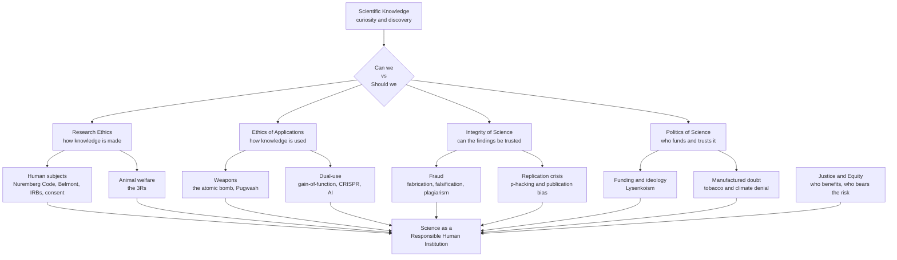

# ⚖️ The Ethics and Politics of Science

> [!abstract] TL;DR
> Science hands humanity **power**, and power demands **responsibility**. The *same* molecular biology that cures disease can engineer a pandemic; the *same* nuclear physics that lights a city can level it. And science is not a disembodied oracle — it is a **human institution** vulnerable to **fraud, bias, money, and politics**. This note traces four intertwined reckonings: the **responsibility of scientists** for how knowledge is *used* (crystallized by the atomic bomb — "*can we?*" versus "*should we?*"); **research ethics**, forged out of atrocity (Nazi experiments → the **Nuremberg Code**; **Tuskegee** → informed consent and **IRBs**; the **3Rs** for animals); the **integrity** of science itself (**scientific fraud** and the **replication crisis** — p-hacking, publication bias, and Ioannidis's warning that *"most published research findings are false"*); and the **politics** of science (funding as a value choice, **Lysenkoism**, the **manufacture of doubt** over tobacco and climate, and the erosion of **public trust**). Science's power makes its ethics and politics **unavoidable**.

---

## Intuition

**Analogy:** A locksmith who invents a better lock has also, in the same stroke, taught the world how to *pick* one. The knowledge is a single object; its two faces — protection and burglary — arrive together and cannot be separated. Now imagine that locksmith works in a guild that decides which locks get built (funding), that is sometimes tempted to *fake* a new design to win prestige (fraud), and whose members occasionally test experimental locks on people who never agreed to be test subjects (research ethics). That guild is **science**.

The history of science is not only a triumphal march of discovery; it is also a **history of moral catastrophes** — eugenics dressed as genetics, syphilis left untreated in the name of "research," a fraudulent paper that scared parents away from vaccines — and of **hard-won safeguards** built in their wake: informed consent, review boards, peer review, retraction, replication. The single most important lesson is deceptively simple: **"*can* we do this?" and "*should* we do this?" are different questions**, and the second one does not answer itself.

---

## How It Works

Ethics and politics touch science at four points along its pipeline — how knowledge is **made**, how it is **used**, whether it can be **trusted**, and who **controls and funds** it. A responsible scientist has to think at *all four* points, not just the exciting one at the lab bench.

### 1. The responsibility of scientists: *can we* vs *should we*

Does discovering knowledge carry moral responsibility for its **use**? For most of history scientists could tell themselves a comforting story — the **value-free ideal**: the scientist merely *reveals* how nature works; what society *does* with it is someone else's problem. The **atomic bomb** shattered that story. Physicists who split the atom out of pure curiosity watched their equations become **Hiroshima and Nagasaki** (see [[The_Atomic_Age]]). The reckoning was immediate and explicit: the **Franck Report** (1945) begged for a demonstration rather than a surprise attack on a city; **J. Robert Oppenheimer** said the physicists had "known sin"; **Leó Szilárd** — who had first conceived the chain reaction — spent the rest of his life on arms control; and the **Pugwash** conferences (from 1957, growing out of the **Russell–Einstein Manifesto**) organized scientists across the Iron Curtain against nuclear war. The debate it opened is still live: is the scientist a **neutral discoverer** or a **citizen** who must weigh consequences? The honest answer is that neutrality is itself a choice — and often an abdication.

### 2. Research ethics: safeguards written in the language of past atrocities

Every major protection for research participants exists because it was once catastrophically absent.

- **Nazi medical experiments** on concentration-camp prisoners led, at the Nuremberg "Doctors' Trial," to the **Nuremberg Code (1947)** — whose very first principle is that *"the voluntary consent of the human subject is absolutely essential."*
- The **Tuskegee syphilis study (1932–1972)** followed 399 poor Black men with untreated syphilis for **forty years** — withholding penicillin even after it became the standard cure — to observe the disease's course. Its exposure produced the **Belmont Report (1979)** and its three principles: **respect for persons** (autonomy, consent), **beneficence** (do good, minimize harm), and **justice** (fair distribution of burdens and benefits).
- **Milgram's obedience** studies and the **Stanford Prison Experiment** dramatized *psychological* harm and the limits of consent; the **thalidomide** disaster reshaped drug regulation.

The resulting framework is now routine: **informed consent**, **Institutional Review Boards (IRBs)** / ethics committees that must approve human-subjects research before it begins, and the Belmont principles as the working grammar of the field. This is developed in [[Research_Ethics_and_Human_Subjects]] and [[Applied_Ethics_Overview]].

### 3. Animal research and the 3Rs

Research on animals raises the question of their **moral status**. The mainstream governing framework is the **3Rs** (Russell and Burch, 1959): **Replacement** (use non-animal methods where possible — cell cultures, organoids, computer models), **Reduction** (use the fewest animals needed for valid results), and **Refinement** (minimize suffering). The debate — how to weigh genuine scientific and medical benefit against animal welfare — remains genuinely open rather than settled.

### 4. Dual-use and dangerous knowledge

Some research is **dual-use**: the very same result advances medicine *and* hands a blueprint to a bad actor. Nuclear physics was the archetype; today the frontier is biology and computation. **Gain-of-function** virology deliberately makes pathogens more transmissible or lethal to study them — and could seed the next pandemic. **Synthetic biology** lets labs print DNA to order. **CRISPR** gene editing made the **He Jiankui** scandal possible in 2018, when he created the first gene-edited babies — a reckless breach of consensus that landed him in prison (see [[The_Molecular_Biology_Revolution]]). **AI** raises parallel worries about misuse. Each poses the **publication dilemma**: does openly publishing a dangerous method advance science, or arm the wrong hands? This is the domain of **biosecurity** and dual-use governance.

### 5. Integrity: fraud and the replication crisis

Science's authority rests on the assumption that its findings are **real**. Two threats corrode that.

**Misconduct** is classically defined as **FFP — Fabrication, Falsification, Plagiarism**. History is littered with cases: **Piltdown Man** (a faked fossil that fooled paleontology for decades), **Jan Hendrik Schön** (fabricated physics data across dozens of papers), **Hwang Woo-suk** (faked human cloning / stem-cell breakthroughs), and — most damaging to public health — **Andrew Wakefield's** fraudulent 1998 paper falsely linking the MMR vaccine to autism, retracted in 2010 but still fueling vaccine refusal today. The **incentives** matter: **publish-or-perish**, intense competition, and prestige all reward the dishonest and the merely sloppy.

**The replication crisis** is subtler and more systemic: a large fraction of published findings — especially in psychology, biomedicine, and cancer biology — **fail to replicate** when independent teams repeat them. The causes are mostly *not* fraud but ordinary **researcher degrees of freedom**: **p-hacking** (trying analyses until one crosses p < 0.05), the **garden of forking paths** (many defensible choices, each nudging toward "significance"), **publication bias** (journals print positive results and bury null ones), **HARKing** (Hypothesizing After the Results are Known), small underpowered samples, and low **pre-study odds**. **John Ioannidis's** 2005 paper *"Why Most Published Research Findings Are False"* showed mathematically how these combine to make a *majority* of published claims wrong. The **reforms** — **preregistration**, **registered reports**, **open data and code**, larger samples, and dedicated **replication studies** — are science trying to *self-correct*, which connects to the very logic of empiricism in [[Scientific_Method_and_Empiricism]]. The Python demo below simulates exactly this distortion.

### 6. The politics of science: funding, denial, and trust

Science is entangled with power at every level. **Funding priorities are political choices** — a society that funds weapons over vaccines is making an ethical decision disguised as a budget. Ideology can **override** evidence outright: **Lysenkoism** in the Soviet Union rejected genetics as "bourgeois," persecuted geneticists, and imposed pseudoscientific agriculture that contributed to **famine**. Vested interests can **manufacture doubt**: the tobacco industry, and later the fossil-fuel industry, ran deliberate campaigns to exaggerate uncertainty and delay regulation — the "**merchants of doubt**" playbook, central to [[Ecology_and_Environmental_Science]]. And **public trust** is now itself contested: **climate, vaccine, and evolution denial**, driven by **motivated reasoning** and amplified by **misinformation**, turn factual questions into tribal identity markers. This raises the hard democratic problem of **expertise versus democracy** — who gets to decide, and how do experts advise without dictating? (A forthcoming *Pseudoscience and the Demarcation Problem* sibling note will develop where the line between science and its imitators falls.)

### 7. Justice and equity in science

Finally: **who benefits, and who bears the risk?** Science and technology distribute their gains and harms **unequally**. **Henrietta Lacks's** cells (HeLa) were taken without consent in 1951 and became a multi-billion-dollar research workhorse while her family received nothing — a stark case of exploitation and the ethics of ownership over one's own tissue. **Environmental injustice** concentrates pollution on the poor and marginalized; life-saving medicines remain out of reach across much of the **Global South** even after Northern labs (sometimes using Southern populations as subjects) develop them. Emerging tech — gene editing, AI — threatens to widen these gaps. This is **distributive justice** applied to knowledge, linking to [[Distributive_Justice_and_Inequality]] and, in prose, to a forthcoming *Women and Underrepresented Scientists* note on who gets to *do* science in the first place.

### Flow / Architecture



---

## Key Concepts

**Secondary (foundations everyone should grasp)**
- **Can we vs should we** — the gap between technical possibility and moral permissibility.
- **Informed consent** — no one may be experimented on without understanding and freely agreeing.
- **Scientific fraud (FFP)** — Fabrication, Falsification, Plagiarism; why the Wakefield vaccine paper caused real-world harm.
- **Dual-use** — one discovery, two uses (cure *and* weapon).

**Undergraduate (requires some background)**
- **The Nuremberg Code and Belmont Report** — respect for persons, beneficence, justice; the birth of IRBs.
- **The 3Rs** — Replacement, Reduction, Refinement in animal research.
- **The replication crisis** — p-hacking, HARKing, publication bias, underpowered studies; why so many findings evaporate.
- **The value-free ideal and its critics** — is science neutral, and can a scientist ever be?
- **The manufacture of doubt** — how vested interests weaponize legitimate uncertainty.

**Graduate (system-level thinking)**
- **Ioannidis's positive predictive value model** — how power, the number of tested hypotheses, bias, and pre-study odds combine to make most published findings false.
- **Family-wise error and the garden of forking paths** — why researcher degrees of freedom, not fraud, drive the crisis.
- **Dual-use research of concern (DURC) governance** — publication moratoria, biosecurity review, the ethics of *not* knowing.
- **Expertise versus democracy** — how scientific advice should enter policy without becoming technocracy or capture.
- **Distributive and procedural justice in science** — HeLa, Global South research ethics, and equity in emerging tech.

---

## Python Demo

This demo makes the replication crisis **quantitative**. It shows three distortions using pure simulation:

1. **The garden of forking paths / p-hacking:** run many analyses on **pure noise** (no real effect). The chance that *at least one* clears p < 0.05 rises fast with the number of "forks" — the family-wise error rate is `1 - (1 - alpha)^k`.
2. **Publication bias / the winner's curse:** many studies of a **tiny true effect** with small samples. If only "significant" studies get published, the published effect sizes are **badly inflated** above the truth.
3. **The null p-value distribution:** a single honest test gives uniform p-values, but the *minimum* p over many forks piles up below 0.05 — manufacturing "significance" from noise.

```python
# Simulating p-hacking, publication bias, and the replication crisis.
# Requires only numpy + matplotlib (no scipy).
import numpy as np
import matplotlib.pyplot as plt
from math import erfc

rng = np.random.default_rng(42)
ALPHA = 0.05

def two_sided_p(z):
    """Two-sided p-value from a z-statistic: p = erfc(|z| / sqrt(2))."""
    return np.vectorize(erfc, otypes=[float])(np.abs(z) / np.sqrt(2.0))

def z_stat(a, b, axis):
    """Two-sample z-statistic for difference in means along `axis`."""
    n = a.shape[axis]
    diff = a.mean(axis=axis) - b.mean(axis=axis)
    se = np.sqrt(a.var(axis=axis, ddof=1) / n + b.var(axis=axis, ddof=1) / n)
    return diff / se

# ---------------------------------------------------------------------------
# PART A - Garden of forking paths: false positives from PURE NOISE
# ---------------------------------------------------------------------------
ks = np.arange(1, 21)          # number of analyses ("forks") a researcher tries
n_studies, n = 4000, 30        # studies per k; sample size per group
sim_fwer = []
for k in ks:
    a = rng.normal(0.0, 1.0, size=(n_studies, k, n))   # group A: no effect
    b = rng.normal(0.0, 1.0, size=(n_studies, k, n))   # group B: SAME dist
    p = two_sided_p(z_stat(a, b, axis=2))              # shape (n_studies, k)
    sim_fwer.append(np.mean(p.min(axis=1) < ALPHA))    # "keep the best p"
sim_fwer = np.array(sim_fwer)
analytic_fwer = 1 - (1 - ALPHA) ** ks

# ---------------------------------------------------------------------------
# PART B - Publication bias / winner's curse: a TINY true effect
# ---------------------------------------------------------------------------
true_d, n_b, n_studies_b = 0.20, 20, 6000               # small effect, small n
a = rng.normal(0.0,    1.0, size=(n_studies_b, n_b))
b = rng.normal(true_d, 1.0, size=(n_studies_b, n_b))
obs_d = (b.mean(1) - a.mean(1)) / np.sqrt((a.var(1, ddof=1) + b.var(1, ddof=1)) / 2)
p_b = two_sided_p(z_stat(a, b, axis=1))
published = p_b < ALPHA                                  # only "significant" printed

print(f"True effect size ............ d = {true_d:.2f}")
print(f"Mean of ALL studies ......... d = {obs_d.mean():.2f}")
print(f"Mean of PUBLISHED studies ... d = {obs_d[published].mean():.2f}  "
      f"(inflated x{obs_d[published].mean()/true_d:.1f})")
print(f"Fraction 'significant' ...... {published.mean():.1%}  "
      f"(this is the study power)")

# ---------------------------------------------------------------------------
# PART C - Null p-value distribution: honest vs. min-of-10
# ---------------------------------------------------------------------------
k_fork = 10
a = rng.normal(0.0, 1.0, size=(20000, k_fork, n))
b = rng.normal(0.0, 1.0, size=(20000, k_fork, n))
p_all = two_sided_p(z_stat(a, b, axis=2))
p_single = p_all[:, 0]        # one honest test
p_min = p_all.min(axis=1)     # smallest of 10 forks

# ---------------------------------------------------------------------------
# Visualize
# ---------------------------------------------------------------------------
fig, ax = plt.subplots(1, 3, figsize=(16, 4.6))

ax[0].plot(ks, analytic_fwer, "-", color="crimson", label="analytic 1-(1-a)^k")
ax[0].plot(ks, sim_fwer, "o", color="navy", ms=5, label="simulated")
ax[0].axhline(ALPHA, ls="--", color="gray", label="nominal a = 0.05")
ax[0].set_xlabel("number of analyses tried (forks)")
ax[0].set_ylabel("P(at least one false positive)")
ax[0].set_title("A. P-hacking pure noise")
ax[0].legend(); ax[0].grid(alpha=0.3)

ax[1].hist(obs_d, bins=50, color="steelblue", alpha=0.6, label="all studies")
ax[1].hist(obs_d[published], bins=50, color="orange", alpha=0.8, label="published only")
ax[1].axvline(true_d, color="green", lw=2, label=f"true d = {true_d}")
ax[1].axvline(obs_d[published].mean(), color="red", lw=2, ls="--", label="published mean")
ax[1].set_xlabel("observed effect size (d)")
ax[1].set_ylabel("count")
ax[1].set_title("B. Publication bias (winner's curse)")
ax[1].legend()

ax[2].hist(p_single, bins=20, range=(0, 1), color="teal", alpha=0.6, label="1 honest test")
ax[2].hist(p_min, bins=20, range=(0, 1), color="crimson", alpha=0.6, label="min of 10 forks")
ax[2].axvline(ALPHA, ls="--", color="gray", label="p = 0.05")
ax[2].set_xlabel("p-value"); ax[2].set_ylabel("count")
ax[2].set_title("C. Null p-values: honest vs. hacked")
ax[2].legend()

plt.tight_layout()
plt.savefig("replication_crisis.png", dpi=110)
print("\nSaved figure to replication_crisis.png")
```

**What you see.** Panel A: trying just **14 analyses** on pure noise makes a false positive **more likely than not** (FWER > 0.5). Panel B: because only "significant" small studies get published, the printed effect is roughly **double** the true one — the literature *looks* stronger than reality. Panel C: an honest single test gives uniform p-values, but taking the best of ten forks stacks the mass under 0.05. Together they explain how a field can be full of "significant" results and still fail to replicate — **without a single fraudster**.

---

## Real-World Applications

- **Human-subjects regulation.** The Nuremberg Code and Belmont Report are not history — every clinical trial and university study today must pass an **IRB / ethics committee** and obtain **informed consent** before it can begin.
- **Biosecurity and dual-use governance.** After 2011 experiments made H5N1 bird flu more transmissible, journals and funders imposed **publication review and moratoria** on "gain-of-function" work — an explicit "should we publish this?" decision.
- **Open-science reforms.** Journals now offer **Registered Reports** (peer-reviewed *before* results exist) and require **preregistration** and **data sharing** to defuse p-hacking and publication bias directly.
- **Climate and public-health policy.** The IPCC and public-health agencies must communicate **consensus and uncertainty** against organized denial and misinformation — the science-communication frontier of [[Ecology_and_Environmental_Science]].
- **Research-integrity infrastructure.** Retraction Watch, plagiarism detectors, image-forensics tools, and mandatory misconduct investigations are the institutional immune system of [[Scientific_Institutions_and_Societies]].

---

## Common Pitfalls

- **Confusing "value-free" with "responsibility-free."** Believing science is neutral does not exempt the scientist; choosing not to consider consequences is itself a moral choice — the lesson of the atomic physicists.
- **Treating the replication crisis as a fraud problem.** The bulk of non-replication comes from *honest* researcher degrees of freedom (p-hacking, HARKing, low power), not misconduct. Blaming "bad apples" misses the systemic incentives.
- **Reading a single p < 0.05 as truth.** One significant result from many analyses is nearly meaningless; the demo shows noise manufactures "significance" routinely without preregistration.
- **False balance in reporting.** Giving a manufactured-doubt fringe "equal time" against overwhelming consensus (tobacco, climate, vaccines) misrepresents the state of evidence — a core denial tactic.
- **Assuming consent solves everything.** Consent is necessary but not sufficient; justice (who is recruited, who benefits) and power imbalances (Tuskegee, HeLa, Global South trials) matter just as much.
- **Ethics as an afterthought.** Bolting ethics review onto a finished project, rather than designing it in from the start, is how avoidable harms slip through.

---

## Related Concepts

- [[The_Atomic_Age]] — the bomb is where "can we vs should we" became inescapable; the origin of scientists' modern sense of responsibility.
- [[Research_Ethics_and_Human_Subjects]] — the deep dive on Nuremberg, Tuskegee, Belmont, informed consent, and IRBs referenced throughout.
- [[Applied_Ethics_Overview]] — the broader ethics vault that frames research, animal, dual-use, and AI ethics.
- [[The_Molecular_Biology_Revolution]] — CRISPR, gene editing, and the He Jiankui scandal that gave dual-use a genomic frontier.
- [[Ecology_and_Environmental_Science]] — the manufacture of doubt and climate denial as a politics-of-science case study.
- [[Scientific_Method_and_Empiricism]] — replication and self-correction are the method's promised safeguards, stressed by the crisis.
- [[Scientific_Institutions_and_Societies]] — peer review, journals, and retraction as science's integrity machinery.
- [[Distributive_Justice_and_Inequality]] — the justice lens on who benefits from and bears the risks of science.
- [[Statistical_Inference_and_Hypothesis_Testing]] — the machinery of p-values that p-hacking abuses.
- [[Cognitive_Biases_and_Heuristics]] — motivated reasoning and confirmation bias behind both denial and researcher self-deception.
- [[History_of_Science_Overview]] — the vault hub placing this moral reckoning in the arc of science's history.

---

## Review Questions

1. **(Secondary)** Explain the difference between "*can* we do this?" and "*should* we do this?" using either the atomic bomb or CRISPR gene editing as your example. Why can't the first question answer the second?
2. **(Undergraduate)** A psychology study reports a "significant" effect (p = 0.04). What questions would you ask before believing it? Using the demo's logic, explain how p-hacking and publication bias could produce that result even if the true effect is zero.
3. **(Graduate)** You are on a biosecurity review board. A lab wants to publish a method that makes a pandemic virus more transmissible, arguing openness advances vaccine design. Lay out the dual-use dilemma and defend a decision, addressing both the value of open science and the risks of dangerous knowledge.

---

## Sources

- Ioannidis, J. P. A. (2005). ["Why Most Published Research Findings Are False."](https://journals.plos.org/plosmedicine/article?id=10.1371/journal.pmed.0020124) *PLoS Medicine*.
- Open Science Collaboration (2015). ["Estimating the Reproducibility of Psychological Science."](https://www.science.org/doi/10.1126/science.aac4716) *Science*.
- U.S. National Commission (1979). [The Belmont Report.](https://www.hhs.gov/ohrp/regulations-and-policy/belmont-report/index.html) HHS Office for Human Research Protections.
- Oreskes, N. & Conway, E. M. (2010). [*Merchants of Doubt.*](https://www.merchantsofdoubt.org/) Bloomsbury Press.
- Gelman, A. & Loken, E. (2013). ["The Garden of Forking Paths."](http://www.stat.columbia.edu/~gelman/research/unpublished/forking.pdf) Columbia University.

---

#history-of-science #research-ethics #replication-crisis #dual-use #science-policy
