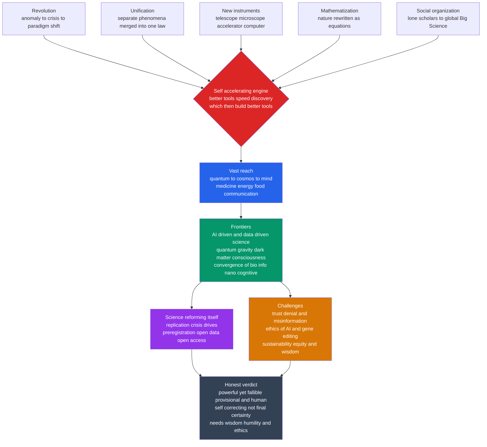

# 🔭 The Reach and Future of Science

> [!abstract] TL;DR
> This is the **capstone** of the History of Science vault: a step back from the individual revolutions to see the **whole arc**. Science advances by a small set of **recurring patterns** — *revolution* (Kuhn's anomaly → crisis → paradigm shift), *unification* (separate phenomena merged into single laws), *new instruments* extending the senses, the *mathematization* of nature, and ever more *collective* social organization — and it does so at an **accelerating pace**, because better tools speed discovery which in turn builds better tools. That self-accelerating engine has given science a **vast reach**, from the quantum to the cosmos to the human mind, transforming medicine, energy, food, and communication along the way. It now heads into new **frontiers** — AI-driven and data-driven discovery, grand unsolved questions like quantum gravity, dark matter, and consciousness — while **reforming its own integrity** (open science, reproducibility) and confronting serious **challenges** of public trust, ethics, and sustainability. The honest verdict, the whole vault's lesson: science is humanity's most powerful yet **fallible, provisional, and human** way of knowing — self-correcting rather than certain — and its future depends on wielding its immense reach with wisdom.

---

## Intuition

**Analogy:** In a few thousand years — a blink of evolutionary time — a species of ape went from telling **myths about thunder gods** to **mapping the Big Bang, editing its own genes, and building machines that learn.** Imagine time-lapsing that whole story into a single film: for the first 99% of the reel almost nothing moves, and then in the last few frames the picture explodes with telescopes, vaccines, transistors, and spacecraft. Science is the engine driving that final blur.

That engine is the **most powerful knowledge-generating machine humanity has ever built** — and this capstone is where we stop examining its individual gears (Copernicus, Newton, Darwin, Einstein, Watson-Crick, Turing) and step back to watch the *whole machine run*. The surprising discovery is that the blur is not chaos: it is produced by a handful of **repeating moves** applied over and over, each faster than the last. Understanding those moves — and where they are now pointing — is the difference between knowing a list of discoveries and understanding *science itself as a historical phenomenon*: how it grew, why it accelerates, how far it now reaches, and what it will take to steer it well.

---

## How It Works

The preceding five sections of this vault told the story era by era. This section reads it **vertically** — extracting the throughlines that recur across every era, the acceleration that binds them, the reach they produced, and the open horizon they point toward.

### The recurring patterns — a few moves generate the whole history

Read across the vault and the same structural moves appear again and again. The history of science is largely the story of these patterns compounding:

1. **Revolution.** Following [[Kuhn_Paradigms_and_Scientific_Revolutions]], mature fields do not creep forward smoothly; they accumulate **anomalies** a reigning paradigm cannot absorb, enter **crisis**, and undergo a discontinuous **paradigm shift**. The pattern recurs across domains — the [[The_Copernican_Revolution|Copernican]] overthrow of the geocentric cosmos, the [[The_Chemical_Revolution|chemical revolution]] that killed phlogiston, the [[The_Darwinian_Revolution|Darwinian]] reframing of life, the [[The_Relativity_Revolution|relativity]] and [[The_Quantum_Revolution|quantum]] breaks with classical physics, and [[Plate_Tectonics_and_Earth_Science|plate tectonics]] in the Earth sciences. Same shape, different centuries.
2. **Unification.** Progress often means realizing that *two things are one thing*. [[Newtonian_Mechanics_and_the_Principia|Newton]] unified celestial and terrestrial motion under one law of gravitation; [[Electricity_and_Magnetism_History|Maxwell]] unified electricity, magnetism, and light as a single electromagnetic field; twentieth-century physics unified the electromagnetic and weak forces into the electroweak theory; chemistry was folded into physics via quantum mechanics; and [[The_Molecular_Biology_Revolution|molecular biology]] folded heredity and life into chemistry. Each unification collapses many laws into fewer.
3. **New instruments extending the senses.** The **telescope** and **microscope** opened the very large and very small; the **particle accelerator** probed the subatomic; the **computer** became an instrument for simulating what cannot be built or observed. New science reliably follows new tools — the senses are extended, and a hidden layer of reality becomes available to investigation.
4. **The mathematization of nature.** A defining move since the Scientific Revolution: expressing regularities as **equations**, so nature becomes something to be *calculated and predicted*, not merely described. Prediction-then-confirmation (Neptune, the bending of starlight, the Higgs boson) is the mathematized method's signature triumph.
5. **Increasingly social and collective organization.** Science moved from lone natural philosophers to correspondence networks, to academies and journals (see [[Scientific_Institutions_and_Societies]]), to professionalized disciplines, to today's **Big Science** — the LHC, the human genome, global climate modeling — enterprises of thousands across nations. Knowledge production itself became an industrial-scale institution.

### The acceleration — a self-accelerating engine

These patterns do not just repeat; they **compound**. The intervals between revolutions shrink from millennia to centuries to decades. Roughly, *most scientists who have ever lived are alive now*, and scientific output has grown exponentially for two centuries (the striking log-linear curve in the [[History_of_Science_Overview]]). The mechanism is a feedback loop familiar from [[Systems_Thinking_Overview|systems thinking]]: **better tools → faster discovery → better tools.** Computing supercharged this loop — the [[The_Computing_and_Information_Revolution|computing and information revolution]] turned calculation, simulation, and data analysis into universal scientific instruments, folding back to accelerate every other field.

### The reach — from the quantum to the cosmos to the mind

The compounding produced a reach with no precedent. Science now spans the **origin of the universe** ([[The_Expanding_Universe|Big Bang cosmology]]), the **code of life** ([[The_Molecular_Biology_Revolution|the double helix and the genome]]), and the **workings of the mind** ([[The_Neuroscience_and_Mind_Sciences|neuroscience and the mind sciences]]) — and along the way transformed [[Germ_Theory_and_Modern_Medicine|medicine]], [[Thermodynamics_and_Energy|energy]], agriculture, and communication. It is, on the evidence, humanity's **most powerful and most reliable** way of understanding *and reshaping* the world.

### The frontier and the reflection

Where it is heading, how it is reforming itself, and what threatens it are laid out in the map below.



---

## Key Concepts

### Secondary — the shape of the whole story

- **A few patterns generate the history.** Revolution, unification, new instruments, mathematization, and collective organization — learn these five and you have the skeleton of the entire vault.
- **Science accelerates.** The gaps between great breakthroughs keep shrinking; most scientific work has been done very recently. Science is a *compounding* enterprise, not a steady one.
- **Reach from quantum to cosmos to mind.** The same enterprise that maps the Big Bang also reads DNA and studies the brain — one method, staggering breadth.
- **Powerful but not perfect.** Science is the best tool we have for reliable knowledge, yet it is made by fallible humans and is always open to revision. Confidence and humility together.

### Undergraduate — the mechanisms and the frontier

- **The self-accelerating feedback loop.** "Better tools → faster discovery → better tools" is a positive feedback loop; computing is the master amplifier that couples into every field. This is why the growth curve is exponential rather than linear.
- **The fourth paradigm.** Beyond experiment, theory, and simulation, **data-intensive discovery** — mining massive datasets — is now argued to be a distinct mode of science (Jim Gray's "fourth paradigm"). Machine learning (e.g. **AlphaFold** predicting protein structures) is transforming what "doing an experiment" means.
- **Convergence of fields.** The frontier is increasingly *between* disciplines — the **bio + info + nano + cognitive** convergence, synthetic biology, computational neuroscience — where the biggest problems and the newest tools now live.
- **Open-science reform.** The **replication crisis** exposed that many published results do not reproduce; the response — **preregistration, open data, open access, registered reports** — is science visibly *correcting its own institutions*, a live demonstration of self-correction.
- **The trust problem.** Scientific *knowledge* can be robust while public *trust* frays; climate and vaccine denial, misinformation, and the politicization of facts are challenges of communication and institutions as much as of evidence.

### Graduate — the deep synthesis and its tensions

- **Grand unsolved questions.** The frontier is defined by what we *cannot* yet explain: a **quantum theory of gravity** and possible "theory of everything"; the nature of **dark matter and dark energy** (about 95% of the universe is unaccounted for); the **origin of life**; the **hard problem of consciousness**; complexity, cancer, and aging. These are not gaps to be filled by more of the same but candidates for the *next* revolutions.
- **Is acceleration sustainable?** Counter-currents — **Eroom's law** (drug discovery getting slower and costlier), evidence that breakthroughs are becoming *harder to find* per dollar and per researcher, and debates over whether science is "slowing down" — complicate the naive exponential story and are themselves a frontier in the science of science (*scientometrics*).
- **The honest epistemic verdict.** The whole vault points to a middle path between **naive scientism** (science delivers final, value-free certainty) and **cynical relativism** (science is "just another belief system"). Following the [[Philosophy_of_Science_Overview|philosophy]] and [[The_Sociology_of_Scientific_Knowledge|sociology of science]], the defensible view is that science is **fallible, provisional, theory-laden, and socially embedded — and yet, through error-correction and intersubjective testing, our most reliable route to knowledge.** It does not give certainty; it gives *ever-improving, self-correcting understanding*.
- **Reach with responsibility.** The greater the power (AI, gene editing, geoengineering, **dual-use** research, existential risk), the higher the ethical stakes. The forthcoming *Science, Technology & Society* and *Ethics & Politics of Science* notes argue that governance, equity, and value-alignment are now *internal* to the scientific enterprise, not add-ons — the responsibility that comes with the reach.
- **Science as a crossroads.** The history of science is where the natural sciences meet **history, philosophy, sociology, and ethics** — the unifying view of this vault, showing science as a human, cultural, and deeply consequential enterprise rather than a disembodied march of facts.

---

## Python Demo

This capstone demo is a **synthesis dashboard** for the whole vault. **Panel 1** plots the major revolutions the vault covered on a timeline, annotates the **shrinking intervals** between them, and overlays the **exponential growth of scientific output** on a log axis — the accelerating pace. **Panel 2** renders the **unification** theme as a converging tree: separate phenomena progressively merged into single laws, trending toward an (open) theory of everything. Requires `numpy` and `matplotlib`.

```python
# Synthesis dashboard for the History of Science vault:
#   Panel 1 -> accelerating revolutions + exponential growth of output
#   Panel 2 -> unification of physics as a converging tree
import numpy as np
import matplotlib.pyplot as plt

# ----- Panel 1 data: major revolutions covered by the vault -----
revolutions = [
    (1543, "Copernican"),   (1687, "Newtonian"),
    (1789, "Chemical"),     (1859, "Darwinian"),
    (1865, "Electromag."),  (1877, "Thermo."),
    (1905, "Relativity"),   (1927, "Quantum"),
    (1945, "Atomic"),       (1953, "Molecular bio"),
    (1965, "Plate tect."),  (1975, "Computing"),
]
years  = np.array([r[0] for r in revolutions])
labels = [r[1] for r in revolutions]

# Illustrative order-of-magnitude proxy for cumulative scientific output.
# The exact numbers are not the point; the EXPONENTIAL SHAPE is.
g_years = np.array([1500, 1600, 1700, 1800, 1850, 1900, 1950, 2000, 2025])
g_output = np.array([3e2, 2e3, 1e4, 1e5, 5e5, 3e6, 2e7, 6e7, 1.2e8])

# Shrinking interval between successive revolutions.
gaps = np.diff(years)
print("Interval between successive revolutions (years):")
for (y0, l0), (y1, l1), g in zip(revolutions, revolutions[1:], gaps):
    print(f"  {l0:>13} -> {l1:<13}: {g:3d}")
print(f"  mean early gap (first 4): {gaps[:4].mean():.0f} yrs")
print(f"  mean late  gap (last 4):  {gaps[-4:].mean():.0f} yrs")

fig, (ax1, ax2) = plt.subplots(2, 1, figsize=(12, 9))

# --- Panel 1: timeline + exponential growth overlay ---
ax1.axhline(0, color="#334155", lw=2, zorder=1)
ax1.scatter(years, np.zeros_like(years), s=90, color="#dc2626", zorder=3)
for i, (yr, lab) in enumerate(revolutions):
    dy = 0.55 if i % 2 == 0 else -0.55
    ax1.annotate(f"{lab}\n{yr}", xy=(yr, 0), xytext=(yr, dy),
                 ha="center", va=("bottom" if dy > 0 else "top"),
                 fontsize=8, arrowprops=dict(arrowstyle="-", color="#94a3b8"))
ax1.set_ylim(-1.3, 1.3); ax1.set_yticks([])
ax1.set_xlim(1500, 2035)
ax1.set_title("Accelerating revolutions: intervals collapse from centuries to decades")

# Twin axis: exponential growth of output on a log scale.
axg = ax1.twinx()
axg.semilogy(g_years, g_output, "o-", color="#2563eb", lw=2,
             label="cumulative output (proxy, log)")
axg.set_ylabel("Scientific output (log, illustrative)", color="#2563eb")
axg.tick_params(axis="y", labelcolor="#2563eb")
axg.legend(loc="upper left", fontsize=8)

# --- Panel 2: unification of physics as a converging tree ---
# Nodes: (x, y, label).  x ~ era/level, y ~ vertical slot.
nodes = {
    "celestial": (0.0, 5.4, "Celestial\nmotion"),
    "terrest":   (0.0, 4.4, "Terrestrial\nmotion"),
    "elec":      (0.0, 3.0, "Electricity"),
    "mag":       (0.0, 2.2, "Magnetism"),
    "light":     (0.0, 1.4, "Light"),
    "space":     (0.0, 0.2, "Space"),
    "time":      (0.0, -0.6, "Time"),
    "weak":      (0.0, -1.8, "Weak\nforce"),
    "strong":    (0.0, -2.8, "Strong\nforce"),
    "gravity":   (0.0, 6.4, "Gravity"),

    "grav_law":  (1.4, 4.9, "Universal\ngravitation"),
    "em":        (1.4, 2.2, "Electro-\nmagnetism"),
    "spacetime": (1.4, -0.2, "Spacetime"),

    "gr":        (2.8, 5.6, "General\nrelativity"),
    "electroweak": (2.8, 1.0, "Electroweak"),

    "sm":        (4.0, 0.4, "Standard\nModel"),
    "toe":       (5.2, 3.0, "Theory of\nEverything?"),
}
edges = [
    ("celestial", "grav_law"), ("terrest", "grav_law"),
    ("elec", "em"), ("mag", "em"), ("light", "em"),
    ("space", "spacetime"), ("time", "spacetime"),
    ("spacetime", "gr"), ("gravity", "gr"), ("grav_law", "gr"),
    ("em", "electroweak"), ("weak", "electroweak"),
    ("electroweak", "sm"), ("strong", "sm"),
]
open_edges = [("sm", "toe"), ("gr", "toe")]  # not yet achieved

for a, b in edges:
    xa, ya, _ = nodes[a]; xb, yb, _ = nodes[b]
    ax2.plot([xa, xb], [ya, yb], color="#94a3b8", lw=1.6, zorder=1)
for a, b in open_edges:
    xa, ya, _ = nodes[a]; xb, yb, _ = nodes[b]
    ax2.plot([xa, xb], [ya, yb], color="#dc2626", lw=1.6, ls="--", zorder=1)

for key, (x, y, lab) in nodes.items():
    achieved = key != "toe"
    ax2.scatter([x], [y], s=520,
                color=("#2563eb" if achieved else "#dc2626"),
                zorder=2, edgecolors="white")
    ax2.text(x, y, lab, ha="center", va="center", color="white",
             fontsize=6.5, zorder=3, fontweight="bold")

ax2.set_xlim(-0.6, 6.0); ax2.set_ylim(-3.6, 7.2)
ax2.axis("off")
ax2.set_title("Unification: separate phenomena merged toward one law "
              "(dashed = open frontier)")

plt.tight_layout()
plt.savefig("reach_and_future_of_science.png", dpi=120)
plt.show()
```

Running it prints intervals that collapse from centuries in the early modern period to roughly a decade in the twentieth century, and the mean *late* gap is a fraction of the mean *early* gap — the acceleration made quantitative. Panel 1's log-axis growth curve is a near-straight line (exponential output), and Panel 2 shows physics literally converging: many phenomena on the left funnel into electromagnetism, general relativity, and the Standard Model, with the final merge into a "theory of everything" drawn as a **dashed red edge** — the great open frontier.

---

## Real-World Applications

- **Science education and scientific literacy.** Teaching the *arc* — that science advances by revolution and unification, accelerates, and self-corrects — inoculates students against both blind scientism and reflexive denialism, and explains why "the science changed" is a feature, not a failure.
- **Science policy and R&D strategy.** Recognizing the self-accelerating tool→discovery→tool loop justifies investment in **instruments and platforms** (accelerators, telescopes, sequencers, compute), while scientometric evidence of diminishing returns informs how funders bet on high-risk, field-converging research.
- **Governing powerful technologies.** The capstone's "reach with responsibility" frame underlies real governance of **AI, gene editing (CRISPR), dual-use biology, and geoengineering** — deciding what to build, and how to align immense capability with human values.
- **Building public trust.** Understanding trust as an *institutional and communicative* problem — not merely an evidence problem — shapes how agencies handle climate, vaccines, and misinformation, favoring transparency, open data, and honest uncertainty over authority claims.
- **Reforming research integrity.** The open-science movement — preregistration, registered reports, open access, reproducibility infrastructure — is the applied face of "science self-correcting," directly changing how journals, universities, and funders operate.

---

## Common Pitfalls

- **Naive triumphalism (whig scientism).** Reading the arc as an inevitable, value-free march to final truth. The vault's lesson is the opposite: science is fallible, provisional, and human. Confidence *and* humility, not certainty.
- **Cynical relativism.** Overcorrecting into "science is just another social construction with no special claim to truth." The [[The_Sociology_of_Scientific_Knowledge|sociology of science]] shows science is *embedded* in society without showing it is *merely* social — its self-correction genuinely tracks the world.
- **Straight-line extrapolation.** Assuming exponential acceleration continues forever. Evidence of rising research costs and "ideas getting harder to find" means the future arc is contested, not guaranteed — a testable question, not a slogan.
- **Mistaking reach for wisdom.** Confusing what science *can* do with what we *should* do. The greater the power, the more the ethical, political, and ecological questions become *part of* the scientific enterprise rather than external to it.
- **Hero-and-eureka myths.** Compressing collective, instrument-driven, institutional revolutions into lone-genius flashes. Every pattern in this note — especially unification and Big Science — is fundamentally *collaborative and material*.
- **Treating "AI-driven science" as magic.** Data-intensive and ML methods are powerful new instruments, but they inherit old pitfalls (bias, overfitting, unfalsifiable black boxes) and still require theory, mechanism, and human judgment to yield understanding rather than mere correlation.

---

## Related Concepts

This capstone is the synthesis point of the whole vault, so it links widely. **All wikilinks below are verified to exist.** The forthcoming Section-06 siblings — *Science, Technology & Society*, *The Ethics & Politics of Science*, and *Pseudoscience & the Demarcation Problem* — are referenced in prose above but not yet created.

**The vault's framing notes**
- [[History_of_Science_Overview]] — the entry point; this capstone is its bookend, converting the era-by-era arc into vertical throughlines.
- [[The_Scientific_Revolution_Overview]] — the great break that installed the mathematized, experimental, unifying method the whole later arc runs on.
- [[Philosophy_of_Science_Overview]] — supplies the "honest verdict": fallible, provisional, self-correcting knowledge between scientism and relativism.
- [[Kuhn_Paradigms_and_Scientific_Revolutions]] — the anomaly → crisis → paradigm-shift pattern that recurs across every domain in the reach.
- [[The_Sociology_of_Scientific_Knowledge]] — science as socially embedded; grounds "reach with responsibility" and the middle path against relativism.

**The recurring-pattern exemplars**
- [[Newtonian_Mechanics_and_the_Principia]] — unification of celestial and terrestrial motion; the mathematization of nature.
- [[Electricity_and_Magnetism_History]] — the paradigm case of unification (electricity + magnetism + light).
- [[The_Copernican_Revolution]] · [[The_Chemical_Revolution]] · [[The_Darwinian_Revolution]] · [[The_Relativity_Revolution]] · [[The_Quantum_Revolution]] · [[Plate_Tectonics_and_Earth_Science]] — the revolution pattern across astronomy, chemistry, biology, physics, and Earth science.
- [[Thermodynamics_and_Energy]] · [[The_Atomic_Age]] — energy and matter revolutions feeding the modern reach.

**The reach across domains**
- [[The_Expanding_Universe]] — the cosmological frontier (dark matter and dark energy among the grand unsolved questions).
- [[The_Molecular_Biology_Revolution]] — the code of life; the substrate for synthetic biology and the bio-info convergence.
- [[The_Neuroscience_and_Mind_Sciences]] — the mind frontier and the hard problem of consciousness.
- [[Germ_Theory_and_Modern_Medicine]] — how the reach transformed everyday human life.
- [[The_Computing_and_Information_Revolution]] — the master amplifier of the self-accelerating loop and the seed of AI-driven, data-intensive science.
- [[Ecology_and_Environmental_Science]] — the sustainability challenge and the planetary stakes of science's power.
- [[Scientific_Institutions_and_Societies]] — the social organization pattern, from academies to Big Science.

**Cross-vault frontiers (verified)**
- [[_MOC_AI_ML_Master]] — the AI/ML vault: the engine of the "fourth paradigm" of data-driven discovery.
- [[Quantum_Computing_Overview]] · [[Quantum_Machine_Learning]] · [[The_Future_of_Quantum_Computing]] — a live frontier technology emerging from the quantum revolution.
- [[Systems_Thinking_Overview]] · [[Emergence_and_Self_Organization]] — the feedback-loop and emergence lenses behind acceleration and field convergence.
- [[Sustainability_and_Planetary_Boundaries]] — the systems-level framing of science's sustainability challenge.

---

## Review Questions

1. **(Secondary)** The note claims a "few patterns generate the whole history" of science. Name the five recurring patterns, and for each give one concrete example from the vault. Then explain, in your own words, what it means to say science is a *self-accelerating* enterprise.
2. **(Undergraduate)** "Science is accelerating exponentially" and "breakthroughs are getting harder to find" are both defended in this note. Are they contradictory? Using the self-accelerating feedback loop *and* the diminishing-returns evidence, construct a coherent account of what the *next few decades* of scientific progress might actually look like, and identify what would have to be true for each story to win.
3. **(Graduate)** The capstone stakes out a middle path between "naive scientism" and "cynical relativism." State the strongest version of each extreme, then defend the middle position using (a) the *revolution* pattern from [[Kuhn_Paradigms_and_Scientific_Revolutions]] and (b) the *embeddedness* thesis from [[The_Sociology_of_Scientific_Knowledge]]. Does calling science "fallible and self-correcting rather than certain" *weaken* its authority, or is that precisely the source of its authority? Argue your case.

---

## Sources

- Bowler, P. J., & Morus, I. R. (2005). *Making Modern Science: A Historical Survey*. University of Chicago Press.
- Kuhn, T. S. (1962/1970). *The Structure of Scientific Revolutions* (2nd ed.). University of Chicago Press.
- Hey, T., Tansley, S., & Tolle, K. (Eds.). (2009). *The Fourth Paradigm: Data-Intensive Scientific Discovery*. Microsoft Research.
- Wootton, D. (2015). *The Invention of Science: A New History of the Scientific Revolution*. Harper.
- Bloom, N., Jones, C. I., Van Reenen, J., & Webb, M. (2020). "Are Ideas Getting Harder to Find?" *American Economic Review*, 110(4), 1104–1144.

---

#history-of-science #synthesis #future-of-science #scientific-progress #frontiers
