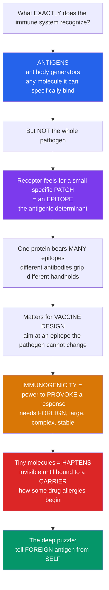

# 🎯 Antigens, Epitopes and Immunogenicity

> [!abstract] TL;DR
> An **antigen** is any molecule the immune system can *specifically bind* — the word literally means "antibody generator." But here is the subtlety that everything else in immunology rests on: receptors do **not** recognize a whole pathogen, or even a whole protein. Each receptor feels for one small, specific **patch** on the molecule's surface, called an **epitope** (or *antigenic determinant*). A single protein carries **many** distinct epitopes, so different antibodies grip different handholds on the same molecule — which is exactly why a virus presents dozens of targets and why vaccine designers fight over *which* epitope to aim at. Yet not every molecule provokes a response: **immunogenicity** — the power to actually *elicit* immunity — depends on being **foreign** (non-self), **large**, chemically **complex**, and **degradable/stable** enough to be handled. Tiny molecules are invisible on their own — a **hapten** — until they latch onto a large **carrier**, which is literally how some drug allergies (like penicillin) get started. Antigens and epitopes are the **vocabulary** of immune recognition: every cell, antibody, and therapy in immunology ultimately acts on these molecular targets. *Educational science content, not medical advice.*

---

## Intuition

**Analogy — feeling for a handhold on a climbing wall.** Picture the immune system as a security force whose whole job is to recognize enemies. The obvious question is: recognize *what, exactly*? The answer is **antigens** — molecules it can specifically detect. But the crucial twist is that an immune receptor does not "see" the whole intruder at once, the way you'd recognize a person by their entire silhouette. It works more like a blindfolded climber running a hand across a huge rock face and gripping **one specific small handhold**. That handhold is the **epitope**. A big protein is a vast climbing wall covered in handholds, and different antibodies each grab a *different* one — several climbers on the same wall, each holding a different grip, none of them touching the whole rock.

This "patch, not whole" recognition explains a lot. A single flu protein bristles with many epitopes, so a single infection raises a whole *committee* of antibodies, each locked onto its own patch. It is also why vaccine design is subtle: you want to aim the response at the **right** handhold — one the pathogen cannot easily reshape to escape — because a virus that mutates one epitope still keeps all the others.

But there is a second question hiding behind the first. Not every molecule is *worth* recognizing, and not every molecule can even trigger a response. **Immunogenicity** is the power to actually *provoke* the immune system into action, and it depends on properties like being **foreign** (unlike your own molecules), **large**, chemically **complex**, and **stable/processable**. A tiny molecule floating alone is often simply *invisible* — a **hapten** — too small to set off any alarm. Attach that same tiny molecule to a large carrier protein, though, and suddenly it becomes a visible target. That is not a laboratory curiosity: it is precisely how certain **drug allergies** work, when a small drug like penicillin chemically hitches onto your *own* proteins and turns them into flags the immune system now attacks. And that raises the deepest puzzle of all, the one this whole field circles back to: how does a system built to attack anything foreign learn *not* to attack **you**?

---

## How It Works

### Core mechanics

1. **Something binds a receptor.** A molecule counts as an **antigen** the moment an antibody or a T-cell receptor can *specifically bind* it. "Antigen" is a recognition label — it says nothing yet about whether a response follows.
2. **Only a patch is read.** The receptor's binding site — the **paratope** — contacts just a small surface region of the antigen: the **epitope**. Typical antibody epitopes span only a handful of residues out of hundreds.
3. **One antigen, many epitopes.** Because a large molecule has many surface patches, it carries many epitopes. This multiplicity is called **valency**, and it is why one infection produces a *diverse* pool of antibodies.
4. **Does it actually provoke?** Whether recognition escalates into a real response is **immunogenicity**, governed by foreignness, size, chemical complexity, degradability, dose, route, host genetics, and danger signals. An **immunogen** is an antigen that clears this bar; a **hapten** is an antigen that does not — until carried.
5. **Foreign versus self.** The receptor repertoire is shaped so it responds vigorously to foreign epitopes while *tolerating* self — the discipline that keeps recognition from becoming autoimmunity.

### The flow of recognition



---

## Key Concepts

### Secondary — the big picture

- **Antigen** = any molecule the immune system can specifically recognize and bind. The name means "antibody generator."
- **Epitope** (antigenic determinant) = the *small patch* on the antigen that a receptor actually grips. One antigen has many epitopes.
- **Immunogen** = an antigen that *also* triggers a response. Every immunogen is an antigen, but **not every antigen is an immunogen**.
- **Immunogenicity** = how strongly a molecule provokes a response. It is highest for things that are **foreign, big, and complex**.
- **Hapten** = a molecule too small to provoke a response on its own — until it attaches to a large **carrier**. This underlies some drug allergies.

### Undergraduate — mechanisms and distinctions

- **Antigen vs immunogen.** These are not synonyms. A hapten is *antigenic* (it can be bound by antibody) but not *immunogenic* alone (it cannot elicit that antibody). All immunogens are antigens; the reverse fails.
- **Chemical nature of antigens.** **Proteins** are the best immunogens — large, complex, degradable, and rich in distinct epitopes. **Polysaccharides** are moderately immunogenic (important for encapsulated bacteria). **Lipids** and **nucleic acids** are generally poor immunogens on their own but become targets when complexed (e.g., anti-DNA antibodies in lupus).
- **Linear vs conformational epitopes.** A **linear (continuous)** epitope is a contiguous stretch of sequence — it survives denaturation and is central to how T cells and denatured antigens are read. A **conformational (discontinuous)** epitope is assembled from residues that are far apart in sequence but brought together by **folding** — most antibody/B-cell epitopes are conformational, which is why unfolding a protein can destroy antibody binding.
- **Valency and immunodominance.** An antigen's many epitopes are not equal: a few **immunodominant** epitopes soak up most of the response, while others are barely noticed.
- **Determinants of immunogenicity.** **Foreignness** (the greater the difference from self, the stronger the response), **size** (larger is more immunogenic, with a rough lower threshold), **chemical complexity/heterogeneity**, **degradability and processability**, **dose and route** of exposure, host **genetics** (which MHC alleles you carry), and the presence of **adjuvants / danger signals**.
- **Haptens and carriers (Landsteiner).** A hapten binds antibody but cannot elicit one until coupled to a carrier protein — the **hapten–carrier effect**. Landsteiner's hapten experiments established that antibody specificity is exquisitely fine-grained and chemically definable.

### Graduate — depth and consequences

- **The paratope–epitope interface.** Antibody recognition is a shape-and-chemistry complementary fit across roughly 600–900 Ų of buried surface, dominated by the CDR loops. "Specificity" is really **relative** — antibodies show measurable **cross-reactivity** and **polyspecificity** (Van Regenmortel), so epitope boundaries are operational, not absolute.
- **Why B cells and T cells "see" antigen differently — the pivotal distinction.** **B-cell receptors / antibodies** bind **native, intact, three-dimensional** antigen directly — any chemical class, largely **conformational** epitopes, in the extracellular space. **T-cell receptors** never see native antigen; they recognize **short linear peptide fragments** that have been **processed** and **presented on MHC** molecules. This single fact shapes almost everything downstream (see *Antigen Processing and Presentation*).
- **Immunodominance mechanics.** Which epitopes dominate depends on processing efficiency, peptide–MHC binding affinity, the available T-cell/B-cell precursor repertoire, and antigen abundance — a systems property, not a fixed molecular label.
- **The self/non-self problem.** The repertoire is generated randomly (V(D)J recombination) and then *pruned*: strongly self-reactive clones are deleted or restrained by **tolerance**, leaving a repertoire biased toward foreign epitopes. Foreignness as an immunogenicity criterion is therefore an *emergent* consequence of tolerance, not an intrinsic chemical property (see *Self–Nonself Discrimination and Immune Tolerance* and *Clonal Selection and Immunological Memory*).
- **Special antigen categories.** **Superantigens** bypass normal specificity by cross-linking MHC II and TCR outside the peptide groove, activating huge fractions of T cells. **Alloantigens / xenoantigens** drive transplant rejection. **Tumor antigens** (neoantigens, over-expressed self) enable cancer immunotherapy. **Autoantigens** are self-molecules mistakenly targeted in autoimmunity. **Allergens** are ordinarily harmless antigens that provoke IgE-mediated hypersensitivity.
- **Hapten immunochemistry in disease.** In penicillin allergy, the reactive β-lactam ring covalently modifies host serum proteins (e.g., albumin), creating hapten–carrier conjugates that are now immunogenic — a direct clinical instance of Landsteiner's principle (see *Antibody Structure and Function* and [[Drug_Safety_Pharmacovigilance_and_Adverse_Effects]]).

---

## Python Demo

```python
# Antigens, epitopes, and immunogenicity — four quantitative pictures:
#   (1) Specific recognition: antibody binding is a saturating (Langmuir) curve
#       whose steepness/position encodes affinity (Kd). Different antibodies,
#       different affinities.
#   (2) Epitope map: ONE antigen presents MANY epitopes. Linear epitopes are
#       contiguous stretches; conformational epitopes join residues far apart
#       in sequence but close in the folded structure.
#   (3) Immunogenicity predictors: response strength rises with molecular size
#       and with foreignness (difference from self).
#   (4) Hapten-carrier effect: hapten alone -> no response; carrier alone -> no
#       ANTI-HAPTEN response; hapten+carrier -> strong anti-hapten antibody.
import numpy as np
import matplotlib.pyplot as plt

rng = np.random.default_rng(7)
fig, ax = plt.subplots(2, 2, figsize=(13, 9))

# ---- (1) Antibody binding curves: fraction bound = C / (Kd + C) ----
C = np.logspace(-2, 3, 400)                     # antigen concentration (nM)
for Kd, name, col in [(1.0, "high affinity  Kd=1 nM", "#2563eb"),
                      (10.0, "medium  Kd=10 nM", "#d97706"),
                      (100.0, "low affinity  Kd=100 nM", "#dc2626")]:
    bound = C / (Kd + C)
    ax[0, 0].plot(C, bound, color=col, lw=2.2, label=name)
    ax[0, 0].scatter([Kd], [0.5], color=col, zorder=5)  # half-saturation at Kd
ax[0, 0].set_xscale("log")
ax[0, 0].set_xlabel("antigen concentration (nM, log)")
ax[0, 0].set_ylabel("fraction of antibody bound")
ax[0, 0].set_title("(1) Specific recognition is a saturating binding curve\nhalf-max at C = Kd (affinity)")
ax[0, 0].axhline(0.5, ls=":", color="gray", lw=1)
ax[0, 0].legend(fontsize=8)
ax[0, 0].grid(alpha=0.3)

# ---- (2) Epitope map on a single protein of L residues ----
L = 120
ax[0, 1].hlines(1.0, 0, L, color="#334155", lw=6)          # the polypeptide
# linear epitopes = contiguous spans
linear = [(12, 22), (70, 80)]
for i, (a, b) in enumerate(linear):
    ax[0, 1].hlines(1.0, a, b, color="#2563eb", lw=10,
                    label="linear epitope" if i == 0 else None)
# conformational epitope = residues far apart in sequence, close when folded
conf = [(30, 34), (95, 99)]                                 # two separated segments
for i, (a, b) in enumerate(conf):
    ax[0, 1].hlines(1.0, a, b, color="#dc2626", lw=10,
                    label="conformational epitope" if i == 0 else None)
# arc showing the two conformational segments meeting in 3D
mid1 = np.mean(conf[0]); mid2 = np.mean(conf[1])
xs = np.linspace(mid1, mid2, 100)
ys = 1.0 + 0.6 * np.sin(np.pi * (xs - mid1) / (mid2 - mid1))
ax[0, 1].plot(xs, ys, "--", color="#dc2626", lw=1.6)
ax[0, 1].text((mid1 + mid2) / 2, 1.68, "folded together", color="#dc2626",
              ha="center", fontsize=8)
ax[0, 1].set_xlim(-3, L + 3); ax[0, 1].set_ylim(0.5, 2.0)
ax[0, 1].set_yticks([])
ax[0, 1].set_xlabel("residue position along the protein")
ax[0, 1].set_title("(2) One antigen, MANY epitopes\n(linear = contiguous, conformational = folded)")
ax[0, 1].legend(fontsize=8, loc="upper left")

# ---- (3) Immunogenicity vs size and foreignness ----
MW = np.linspace(0, 100, 400)          # molecular weight (kDa)
def immunogenicity(mw, foreignness):
    # sigmoid rise with size, scaled by how foreign the molecule is
    size_term = 1.0 / (1.0 + np.exp(-(mw - 15) / 6.0))   # threshold ~ a few kDa
    return foreignness * size_term
ax[1, 0].plot(MW, immunogenicity(MW, 1.0), color="#dc2626", lw=2.4,
              label="highly foreign")
ax[1, 0].plot(MW, immunogenicity(MW, 0.55), color="#d97706", lw=2.2,
              label="partly foreign")
ax[1, 0].plot(MW, immunogenicity(MW, 0.12), color="#2563eb", lw=2.2,
              label="self-like (tolerated)")
ax[1, 0].axvspan(0, 5, color="gray", alpha=0.15)
ax[1, 0].text(0.4, 0.9, "haptens /\nsmall molecules\npoorly immunogenic",
              fontsize=8, va="top")
ax[1, 0].set_xlabel("molecular weight (kDa)  ->  size")
ax[1, 0].set_ylabel("predicted immune response strength")
ax[1, 0].set_title("(3) Immunogenicity rises with SIZE and FOREIGNNESS")
ax[1, 0].legend(fontsize=8)
ax[1, 0].grid(alpha=0.3)

# ---- (4) Hapten-carrier effect (anti-hapten antibody titer) ----
conditions = ["hapten\nalone", "carrier\nalone", "hapten +\ncarrier"]
titer = [0.05, 0.03, 1.0]              # relative anti-hapten antibody response
colors = ["#94a3b8", "#94a3b8", "#059669"]
bars = ax[1, 1].bar(conditions, titer, color=colors, edgecolor="black")
for b, t in zip(bars, titer):
    ax[1, 1].text(b.get_x() + b.get_width() / 2, t + 0.02,
                  f"{t:.2f}", ha="center", fontsize=9)
ax[1, 1].set_ylabel("relative anti-hapten antibody titer")
ax[1, 1].set_ylim(0, 1.15)
ax[1, 1].set_title("(4) Hapten-carrier effect\n(small molecule invisible until carried)")

plt.tight_layout()
plt.savefig("antigens_epitopes_immunogenicity.png", dpi=130)
print("Saturation half-max occurs at C = Kd for each antibody.")
print("Conformational epitope joins residues", conf[0], "and", conf[1],
      "- distant in sequence, adjacent when folded.")
print("Hapten alone titer:", titer[0], " vs hapten+carrier:", titer[2])
```

**What the plots show.** Panel (1) makes *specificity* quantitative: antibody binding saturates, and the concentration at half-maximum equals the dissociation constant **Kd**, so a lower Kd is a tighter, more specific grip. Panel (2) is an **epitope map** of a single protein — several distinct epitopes coexist, and the red **conformational** epitope stitches together residues far apart in sequence that fold into one surface patch, whereas the blue **linear** epitopes are single contiguous spans. Panel (3) shows why **foreignness and size** dominate immunogenicity: self-like molecules stay flat (tolerated) no matter how big, while foreign molecules climb steeply once they clear a size threshold — and small molecules in the shaded region are essentially invisible. Panel (4) is the **hapten–carrier effect** in one bar chart: the hapten provokes almost nothing alone, but coupled to a carrier it elicits a strong anti-hapten antibody response.

---

## Real-World Applications

- **Rational vaccine and immunogen design.** Modern vaccines increasingly target *specific* conserved epitopes rather than whole pathogens. Epitope-focused design (e.g., stabilizing the RSV F protein or the SARS-CoV-2 spike in its prefusion conformation) presents the *right* handhold — one the pathogen cannot easily mutate away — maximizing broadly protective antibodies (see *Vaccines and Antibiotics*).
- **Conjugate vaccines exploit the hapten–carrier principle.** Bacterial **polysaccharides** are poor immunogens (especially in infants). Chemically conjugating them to a **carrier protein** (as in Hib, pneumococcal, and meningococcal conjugate vaccines) recruits T-cell help and produces durable, memory-forming responses — Landsteiner's century-old insight turned into public-health infrastructure.
- **Serology and antibody diagnostics.** ELISA, lateral-flow rapid tests, and Western blots all depend on defined **antigen–epitope** binding: a known antigen captures patient antibodies (or vice versa) with high specificity, turning molecular recognition into a readable signal.
- **Therapeutic and diagnostic monoclonal antibodies.** Every therapeutic mAb is engineered around a chosen epitope on its target; epitope mapping and affinity (Kd) tuning determine efficacy and whether it blocks, neutralizes, or merely tags.
- **Predicting and managing drug allergy.** Understanding that small drugs act as **haptens** by covalently modifying host proteins guides pharmacovigilance and allergy testing (see [[Drug_Safety_Pharmacovigilance_and_Adverse_Effects]]).
- **Cancer neoantigen vaccines.** Tumor-specific mutations create novel epitopes (**neoantigens**) absent from healthy tissue; identifying the immunogenic ones is the basis of personalized cancer immunotherapy.

---

## Common Pitfalls

- **Confusing "antigen" with "immunogen."** They are not synonyms. A hapten is an antigen (it binds antibody) but not an immunogen (it cannot elicit that antibody alone). Every immunogen is an antigen; the reverse is false.
- **Thinking the immune system recognizes whole pathogens.** It recognizes **epitopes** — small patches. One protein carries many, and different antibodies target different ones. Missing this makes valency, cross-reactivity, and vaccine escape mysterious.
- **Assuming all epitopes are linear.** Most **antibody** epitopes are **conformational**, depending on the folded shape. Denaturing an antigen (boiling, SDS) can abolish antibody binding while *creating* new linear epitopes — a frequent source of confusion between assays.
- **Forgetting that B cells and T cells see antigen differently.** B cells bind native 3D antigen; T cells only see **processed peptides on MHC**. Treating them the same breaks any understanding of antigen presentation.
- **Believing specificity is absolute.** Antibodies are cross-reactive and polyspecific; "one antibody, one epitope" is an idealization. Real recognition has measurable off-target binding.
- **Treating foreignness as an intrinsic chemical property.** A molecule is "foreign" only relative to *your* self-repertoire and tolerance. The same molecule can be immunogenic in one host and tolerated in another.
- **Underestimating adjuvants and dose.** A perfectly designed antigen can fail to immunize without the right danger signals, dose, and route — immunogenicity is contextual, not just molecular.

---

## Related Concepts

- [[The_Adaptive_Immune_System]] — the system whose lymphocyte receptors each bind one epitope; antigens and epitopes are the targets clonal selection acts on.
- [[The_Innate_Immune_System]] — supplies the danger signals and adjuvant-like context that decide whether an antigen becomes immunogenic.
- [[Vaccines_and_Antibiotics]] — vaccines are applied epitope/immunogen engineering; conjugate vaccines are the hapten–carrier principle in practice.
- [[Proteins_and_Amino_Acids]] — protein folding creates the conformational surface patches that most antibody epitopes recognize.
- [[Drug_Safety_Pharmacovigilance_and_Adverse_Effects]] — hapten–carrier chemistry underlies drug allergies such as penicillin hypersensitivity.

*Foundational siblings in this vault (build these next): Immunology Overview and the Immune System, Clonal Selection and Immunological Memory, Self–Nonself Discrimination and Immune Tolerance, Antibody Structure and Function, and Antigen Processing and Presentation — each acts on the antigen/epitope vocabulary defined here.*

---

## Review Questions

**Secondary.** In one sentence each, define *antigen*, *epitope*, and *immunogen*, and explain why a single protein can be bound by many different antibodies.

**Undergraduate.** A researcher raises antibodies against a folded protein, then runs a Western blot on the *denatured* protein and finds the antibodies no longer bind. What does this reveal about the epitope, and how would you redesign the assay to detect the protein anyway?

**Graduate.** A small drug molecule shows no immune response when injected into an animal, yet the same animal later develops a severe allergic reaction to the drug. Using the concepts of hapten, carrier, immunogenicity, and self/non-self, construct a mechanistic explanation, and state one experiment that would test it.

---

## Sources

- Murphy, K. & Weaver, C. — *Janeway's Immunobiology*, 9th–10th ed. (Garland Science) — antigens, epitopes, and antigen recognition.
- Abbas, A. K., Lichtman, A. H. & Pillai, S. — *Cellular and Molecular Immunology*, 10th ed. (Elsevier) — antibody specificity, immunogenicity, haptens.
- Landsteiner, K. — *The Specificity of Serological Reactions* (1936/1945) — the foundational hapten and antibody-specificity experiments.
- Van Regenmortel, M. H. V. — "Specificity, polyspecificity, and heterospecificity of antibody-antigen recognition," *Journal of Molecular Recognition* 27(11): 627–639 (2014).

---

#immunology #antigens #epitopes #immunogenicity #haptens
