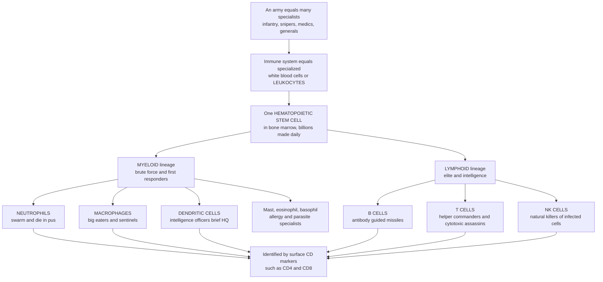

# 🩸 Cells of the Immune System

> [!abstract] TL;DR
> The immune system is not one thing but a **coordinated organization of specialized white blood cells (leukocytes)**, each a professional with a distinct job. Remarkably, all of them — the kamikaze **neutrophils**, the sentinel **macrophages**, the intelligence-gathering **dendritic cells**, the antibody-making **B cells**, and the commanding-and-killing **T cells** — descend from a single **hematopoietic stem cell (HSC)** in the **bone marrow** that produces *billions* of blood cells daily. That stem cell splits into two great branches: the **myeloid** lineage (brute-force innate first responders) and the **lymphoid** lineage (the elite adaptive cells plus innate **NK cells**). Immunologists tell these cells apart by the protein "name tags" on their surface — the **CD (cluster of differentiation)** markers such as **CD4** and **CD8** — read at scale by **flow cytometry**. Knowing this cellular cast is the roster of the body's entire defense force, and the foundation for every immune response, disease, and therapy.

## Intuition

**Analogy first.** An army is not one kind of soldier. It is a whole organization of specialists: infantry to hold the line, snipers to pick off high-value targets, medics to repair, combat engineers to clear debris, communications officers to relay orders, and generals to command the whole campaign. Each role is distinct, and the army only works because they are coordinated. The immune system is *exactly* like this — a standing force of many different specialized white blood cells, each a trained professional with its own job.

And here is the beautiful part. Every single soldier in this diverse army is recruited from one training camp. Deep in your **bone marrow** sits the **hematopoietic stem cell**, a self-renewing ancestor that pumps out *billions* of new blood cells every day for your entire life. From it, two great divisions branch off: the **myeloid** division supplies the brute-force front line — the neutrophils that swarm an infection and die in the pus, the big-eater macrophages that patrol every tissue, the dendritic-cell intelligence officers who carry enemy samples back to headquarters. The **lymphoid** division supplies the elite corps — the B cells that manufacture guided-missile antibodies, the T cells that command the whole response and assassinate infected cells, and the NK cells that gun down stressed and virus-hijacked cells on sight. Immunologists sort this whole roster by the badges each cell wears on its surface — the CD markers. Learn the cast, and you have learned how your body defends itself.

---

## How It Works

Every immune cell is the endpoint of a **branching production line** called **hematopoiesis**, running continuously in the bone marrow. A rare, self-renewing **hematopoietic stem cell (HSC)** commits step by step down one of two lineage roads. The **myeloid** road yields the innate first responders and the antigen-presenting cells; the **lymphoid** road yields the adaptive B and T cells plus the innate NK cell. Growth factors and **cytokines** steer each fork — deciding, cell by cell, which specialist gets made and in what numbers. The mature cells then circulate in blood, patrol tissues, and station themselves in lymphoid organs, and we recognize each type by the unique combination of **CD surface markers** it displays.

1. **One ancestor.** The multipotent, self-renewing **HSC** in the bone marrow is the common origin of the entire blood system, red and white.
2. **First fork.** The HSC gives rise to a **common myeloid progenitor** and a **common lymphoid progenitor**.
3. **Myeloid branch — brute force and first response.** Granulocytes (**neutrophils**, **eosinophils**, **basophils**), tissue **mast cells**, **monocytes** that mature into **macrophages**, and **dendritic cells** — the premier antigen-presenting bridge to adaptive immunity.
4. **Lymphoid branch — elite and intelligence.** **B lymphocytes** (make antibodies; humoral immunity), **T lymphocytes** (CD4+ helper commanders and CD8+ cytotoxic assassins), and innate **NK cells**.
5. **Identify and sort.** Each mature cell wears characteristic **CD markers**; **flow cytometry** reads these badges to count and separate the populations.



---

## Key Concepts

### Secondary Level

**Leukocytes are the white blood cells** — the cells of the immune system. They travel in the blood but do most of their work in the tissues, unlike red blood cells, which stay in vessels carrying oxygen. All of them, plus red cells and platelets, are made in the **bone marrow** from one kind of ancestor: the **hematopoietic stem cell**, which keeps dividing your whole life.

**Two families branch from that stem cell:**

- **Myeloid cells** — the fast, general-purpose first responders (mostly part of *innate* immunity).
- **Lymphoid cells** — the slower, highly specific specialists (the *adaptive* immune cells) plus the innate NK cell.

**The main cast and what each does:**

| Cell | Lineage | Job in one line |
|------|---------|-----------------|
| **Neutrophil** | Myeloid | Most abundant; first to a bacterial infection, engulfs microbes, dies in **pus** |
| **Macrophage** | Myeloid | "Big eater"; engulfs debris and pathogens, patrols every tissue as a sentinel |
| **Dendritic cell** | Myeloid | Intelligence officer; captures samples and briefs T cells in the lymph nodes |
| **Eosinophil / Basophil / Mast cell** | Myeloid | Fight parasites; drive allergy and release **histamine** |
| **B cell** | Lymphoid | Makes **antibodies** — the guided missiles of the blood |
| **T cell** | Lymphoid | Helper T cells command the response; cytotoxic T cells kill infected cells |
| **NK cell** | Lymphoid | Natural killer; destroys virus-infected and cancerous cells on sight |

**Name tags.** Scientists tell these cells apart by proteins on their surface called **CD markers** (like CD4 or CD8), a bit like reading the badge on a uniform.

### Undergraduate Level

**Hematopoiesis and its regulation.** The **HSC** is defined by two properties: **self-renewal** (it makes copies of itself, so the supply never runs out) and **multipotency** (it can become any blood cell). Commitment proceeds through a **common myeloid progenitor (CMP)** and a **common lymphoid progenitor (CLP)**, and is steered by **colony-stimulating factors** and other **cytokines** (e.g., G-CSF drives neutrophil output, EPO drives red cells). This lifelong, tunable production is why infection *raises* your neutrophil count within hours (the reason a "left shift" appears on a blood test) — a topic developed in the sibling note *Cytokines_and_Immune_Signaling*.

**The myeloid cells (mostly innate).**
- **Granulocytes** are named for cytoplasmic granules. **Neutrophils** are the most abundant leukocyte and the primary phagocytic first responder to bacteria and fungi; short-lived, they die in huge numbers (forming **pus**) and can cast out sticky DNA webs called **NETs** (neutrophil extracellular traps). **Eosinophils** attack parasites and drive allergic inflammation; **basophils** and tissue-resident **mast cells** release **histamine** and mediate **type I hypersensitivity** (allergy, anaphylaxis).
- **Monocytes** circulate in blood and mature into **macrophages** in tissue — the long-lived "big eaters" that perform **phagocytosis**, present antigen, secrete inflammatory cytokines, act as sentinels, and clean up in tissue repair. They exhibit **M1 (pro-inflammatory) vs M2 (repair/anti-inflammatory) polarization**. The mechanics of engulfment are detailed in the sibling note *Phagocytes_and_Phagocytosis*.
- **Dendritic cells (DCs)** are the premier **antigen-presenting cells (APCs)** and the crucial **innate–adaptive bridge**: they sample pathogens in peripheral tissue, then migrate to lymph nodes to **prime naive T cells**.

**The lymphoid cells (adaptive plus NK).**
- **B lymphocytes** mature in the **bone marrow**, produce **antibodies**, and mediate **humoral immunity**; upon activation they differentiate into antibody-factory **plasma cells** and long-lived **memory B cells**.
- **T lymphocytes** mature in the **thymus** (T for thymus) and drive **cell-mediated immunity**. The two major subsets are **CD4+ helper T cells**, which orchestrate the whole response by secreting cytokines, and **CD8+ cytotoxic T cells**, which kill infected and tumor cells; **regulatory T cells (Tregs)** restrain the response to prevent autoimmunity.
- **Natural killer (NK) cells** are innate lymphocytes that kill stressed, virus-infected, and tumor cells using the **"missing self"** logic (they attack cells that have lost their MHC class I "don't kill me" signal). **Innate lymphoid cells (ILCs)** are their tissue-based, cytokine-secreting cousins.

**Antigen-presenting cells (APCs).** The "professional" APCs are **dendritic cells, macrophages, and B cells** — they display captured antigen on **MHC class II** to activate CD4+ T cells (see *Innate_versus_Adaptive_Immunity*).

**Identifying and classifying cells.** Cells are defined less by shape than by their **surface markers**, named under the **CD (cluster of differentiation)** system: **CD3** (all T cells), **CD4** (helper T, also the HIV receptor), **CD8** (cytotoxic T), **CD19/CD20** (B cells), **CD56** (NK cells), **CD14** (monocytes). **Flow cytometry** and fluorescence-activated cell sorting (**FACS**) are the workhorse technologies of immunology: cells are tagged with fluorescent antibodies against CD markers, streamed single-file past lasers, and separated into populations by "gating."

**The organization.** Immune cells *develop* in the **primary lymphoid organs** (bone marrow and thymus), then *reside and patrol* the blood, tissues, and **secondary lymphoid organs** (lymph nodes, spleen, MALT). Lymphocytes **recirculate** continuously between blood, lymph, and these organs, maximizing the chance a rare specific cell meets its antigen — the subject of the sibling note *Lymphoid_Organs_and_Immune_Anatomy*.

### Graduate Level

**The HSC niche and hierarchy, revisited.** HSCs reside in specialized bone-marrow **niches** (endosteal and perivascular) whose signals (CXCL12, SCF, Notch, thrombopoietin) gate the balance between quiescence, self-renewal, and differentiation. The classic tidy tree (HSC → CMP/CLP → mature cells) has been substantially revised: single-cell and lineage-tracing data (Orkin & Zon; Laurenti & Göttgens) support a more **continuous, hierarchical–probabilistic** model in which "progenitors" are heterogeneous mixtures biased toward particular fates rather than discrete switch points. **Clonal hematopoiesis** — expansion of HSC clones bearing somatic mutations (DNMT3A, TET2) with age — links this system to leukemia risk and cardiovascular disease.

**Transcriptional control of lineage.** Fate is set by antagonistic master transcription factors: **PU.1** and **GATA-1** cross-repress to choose myeloid versus erythroid; **PU.1** vs **GATA-2/3**, **EBF1**, and **PAX5** commit lymphoid and B-cell identity; **NOTCH1** signaling in the thymus enforces the T-lineage choice. Lineage is thus a network of gene-regulatory decisions, not a fixed conveyor belt.

**Ontogeny of the myeloid sentinels.** Many **tissue-resident macrophages** (microglia, Kupffer cells, alveolar macrophages) are **not** replenished from blood monocytes but seeded prenatally from the **yolk sac / fetal liver** and self-maintain locally — overturning the old "monocyte-only" view. **Dendritic cells** subdivide into **cDC1** (cross-present to CD8 T cells), **cDC2** (prime CD4 T cells), and **plasmacytoid DCs (pDCs)** (massive type-I interferon output against viruses), each with distinct transcription-factor dependencies (BATF3, IRF4, IRF8).

**NK education and lymphocyte identity.** NK cytotoxic potential is calibrated by **"licensing/education"** through inhibitory receptors (KIRs, NKG2A) engaging self-MHC I during development — a tuning of the missing-self threshold. High-dimensional cytometry now maps this diversity far beyond two markers: **spectral flow cytometry** and **mass cytometry (CyTOF)** resolve 40+ markers per cell, and **single-cell RNA-seq** defines cell states by full transcriptome rather than a handful of CD proteins, revealing continua that discrete gates blur.

**Why the CD count is clinical.** The **CD4+ T-cell count** is the central staging biomarker in HIV/AIDS (progression tracks CD4 depletion); **CD20** is the target of the monoclonal antibody **rituximab** (B-cell lymphomas, autoimmunity); **CD19** defines the target of **CAR-T** cell therapy; **CD3/CD28** engagement is how therapeutic T cells are activated ex vivo. The roster and its markers are therefore not academic taxonomy but the direct handles of modern immunotherapy (see *Immunology_Overview_and_the_Immune_System*).

---

## Python Demo

```python
# Cells of the immune system: the cellular cast of defense.
# (a) LEUKOCYTE ABUNDANCE - the differential white-blood-cell count: which
#     leukocytes dominate the blood (neutrophils >> lymphocytes > monocytes...),
#     colored by myeloid vs lymphoid lineage from the one hematopoietic stem cell.
# (b) CD-MARKER FLOW CYTOMETRY - how immunologists IDENTIFY cells by the surface
#     proteins they carry; a CD4 vs CD8 scatter separates helper T, cytotoxic T,
#     and non-T lymphocytes into gateable clusters.
import numpy as np
import matplotlib.pyplot as plt

rng = np.random.default_rng(42)

# -----------------------------------------------------------
# (a) DIFFERENTIAL WHITE-BLOOD-CELL COUNT (typical adult blood)
# -----------------------------------------------------------
cells   = ["Neutrophil", "Lymphocyte", "Monocyte", "Eosinophil", "Basophil"]
percent = np.array([60.0, 30.0, 6.0, 3.0, 1.0])        # approx % of leukocytes
lineage = ["Myeloid", "Lymphoid", "Myeloid", "Myeloid", "Myeloid"]
colors  = ["#2563eb" if L == "Myeloid" else "#dc2626" for L in lineage]

# -----------------------------------------------------------
# (b) SIMULATED FLOW CYTOMETRY: CD4 vs CD8 on gated lymphocytes.
#     Each population is a Gaussian blob in 2D marker space; gating
#     thresholds (dashed lines) separate them the way FACS software does.
# -----------------------------------------------------------
def blob(n, cd4_mu, cd8_mu, spread=0.35):
    return rng.normal(cd4_mu, spread, n), rng.normal(cd8_mu, spread, n)

helper_cd4, helper_cd8 = blob(1500, 3.2, 0.6)   # CD4+ CD8-  helper T cells
cyto_cd4,   cyto_cd8   = blob(900,  0.6, 3.2)   # CD4- CD8+  cytotoxic T cells
nonT_cd4,   nonT_cd8   = blob(1100, 0.5, 0.5)   # CD4- CD8-  B / NK (double neg)

# -----------------------------------------------------------
# Plot
# -----------------------------------------------------------
fig, (ax1, ax2) = plt.subplots(1, 2, figsize=(13, 5))

bars = ax1.bar(cells, percent, color=colors, edgecolor="black")
ax1.set_ylabel("Percent of circulating leukocytes")
ax1.set_title("Differential white-blood-cell count\nblue equals myeloid, red equals lymphoid")
for b, p in zip(bars, percent):
    ax1.text(b.get_x() + b.get_width() / 2, p + 1, f"{p:.0f}%",
             ha="center", fontsize=9)
ax1.set_ylim(0, 70)
ax1.tick_params(axis="x", labelrotation=20)

ax2.scatter(helper_cd4, helper_cd8, s=6, alpha=0.4, color="#dc2626",
            label="CD4+ helper T")
ax2.scatter(cyto_cd4, cyto_cd8, s=6, alpha=0.4, color="#2563eb",
            label="CD8+ cytotoxic T")
ax2.scatter(nonT_cd4, nonT_cd8, s=6, alpha=0.4, color="#6b7280",
            label="CD4- CD8- B or NK")
ax2.axvline(1.8, color="black", ls="--", lw=1)     # gating thresholds
ax2.axhline(1.8, color="black", ls="--", lw=1)
ax2.set_xlabel("CD4 marker intensity, arbitrary units")
ax2.set_ylabel("CD8 marker intensity, arbitrary units")
ax2.set_title("Flow cytometry: identify cells by CD markers\ngating separates the populations")
ax2.legend(loc="upper right", fontsize=8)

plt.tight_layout()
plt.savefig("immune_cells.png", dpi=120)
plt.show()

# The punchline: one stem-cell lineage, many specialists; we tell them apart
# not by looks alone but by the CD name-tags on their surface.
print("Leukocyte differential (percent):")
for c, p in zip(cells, percent):
    print(f"  {c:12s}: {p:5.1f}%")
myeloid = percent[0] + percent[2] + percent[3] + percent[4]
print(f"\nMyeloid share  : {myeloid:.0f}%  (neutrophil-dominated brute force)")
print(f"Lymphoid share : {percent[1]:.0f}%  (the adaptive elite plus NK)")
```

Running it shows two truths of the cellular cast: **neutrophils dominate** the circulating white-cell pool (the myeloid front line vastly outnumbers everything else at rest), and the flow-cytometry panel resolves lymphocytes into **three clean clusters** — helper T, cytotoxic T, and non-T — purely from two surface markers, which is exactly how a real lab identifies and sorts them.

---

## Real-World Applications

- **CD4 count in HIV/AIDS** — clinicians monitor absolute **CD4+ T-cell** numbers by flow cytometry to stage disease and time treatment; the virus's destruction of helper T cells is the defining feature of AIDS.
- **CAR-T cell therapy** — a patient's **T cells** are engineered to target **CD19** on B-cell cancers, then reinfused; a direct clinical exploitation of the T-cell/B-cell roster and their CD markers.
- **Rituximab and B-cell depletion** — the monoclonal antibody targets **CD20** on B cells to treat lymphomas and autoimmune diseases (rheumatoid arthritis, multiple sclerosis).
- **G-CSF (filgrastim)** — recombinant growth factor that boosts **neutrophil** production, given after chemotherapy to prevent life-threatening infections — hematopoiesis engineered on demand.
- **Bone-marrow / HSC transplantation** — for leukemia and immunodeficiency, the entire immune system is rebooted by transferring donor **hematopoietic stem cells**, which reconstitute every leukocyte lineage.
- **Complete blood count with differential (CBC)** — the everyday clinical readout of the leukocyte roster: a high neutrophil count flags bacterial infection, high eosinophils suggest parasites or allergy, and abnormal blasts flag leukemia.

---

## Common Pitfalls

- **Thinking of "the immune system" as one thing.** It is a division of labor among many distinct cell types; almost every immune concept only makes sense once you know *which* cell is acting.
- **Confusing monocytes and macrophages.** They are the same lineage at different stages — monocytes circulate in blood, then mature into tissue macrophages. "Macrophage in the blood" is a red flag.
- **Assuming all tissue macrophages come from blood monocytes.** Many resident macrophages (microglia, Kupffer cells) are seeded before birth and self-renew locally — a modern correction to the textbook.
- **Equating lymphocytes with adaptive immunity only.** **NK cells** are lymphocytes but are **innate** — they act fast, without antigen-specific receptors or memory.
- **Reading CD markers as fixed one-cell-one-marker labels.** Identity is a *combination* of markers (e.g., a helper T cell is CD3+CD4+CD8-), and expression changes with activation state; single markers mislead.
- **Confusing "B cell = bone marrow" but "T cell = bone marrow too."** Both are *born* in bone marrow, but **T cells mature in the thymus** while **B cells mature in the bone marrow**. The maturation site, not the birthplace, defines the letter.
- **Forgetting the shared origin.** Neutrophils and cytotoxic T cells look and act nothing alike, yet both descend from the same HSC — missing this hides why hematopoietic disease affects the whole immune system at once.

---

## Related Concepts

This note is the cellular foundation of the **Immunology** vault. Its sibling notes — *Immunology_Overview_and_the_Immune_System* (the big picture and why the cast matters), *Innate_versus_Adaptive_Immunity* (how the two lineages map onto the two arms of defense), *Lymphoid_Organs_and_Immune_Anatomy* (where these cells develop, reside, and recirculate), *Phagocytes_and_Phagocytosis* (the eating mechanics of neutrophils and macrophages), and *Cytokines_and_Immune_Signaling* (the growth factors that steer hematopoiesis and coordinate the cells) — build directly on this roster and are referenced in prose above.

Cross-vault connections (verified to exist):

- [[The_Innate_Immune_System]] — the myeloid cells and NK cells profiled here are the workforce of innate immunity
- [[The_Adaptive_Immune_System]] — the lymphoid B and T cells here are the agents of specific, memory-forming adaptive immunity
- [[Hematologic_Disorders_and_Anemia]] — clinical companion: when hematopoiesis fails or goes malignant, the leukocyte roster is disrupted (leukemias, neutropenia)
- [[The_Circulatory_and_Respiratory_Systems]] — leukocytes are a component of blood; this covers the circulatory highway they travel and exit to reach tissues

---

## Review Questions

1. **Secondary:** All of your immune cells come from one kind of cell in the bone marrow. Name that cell, and explain what makes it able to keep supplying new blood cells your whole life. Then name one myeloid cell and one lymphoid cell and give each cell's main job.
2. **Undergraduate:** A patient's blood test shows a sharply elevated **neutrophil** count and a very low **CD4+ T-cell** count. From the lineage tree and the cells' functions, what kinds of problems could each finding point to, and why does the CD4 measurement require a technique like flow cytometry rather than a simple stain?
3. **Graduate:** The classical "CMP/CLP" hematopoietic tree has been revised toward a continuous, probabilistic model, and many tissue macrophages are now known to arise prenatally rather than from blood monocytes. Explain how single-cell and lineage-tracing evidence forced these revisions, and discuss why defining a cell by a fixed panel of CD markers can be misleading given transcription-factor–driven, state-dependent identity.

---

## Sources

- Murphy, K. & Weaver, C. (2022). *Janeway's Immunobiology*, 10th ed. Garland Science / W. W. Norton
- Abbas, A.K., Lichtman, A.H. & Pillai, S. (2021). *Cellular and Molecular Immunology*, 10th ed. Elsevier
- Orkin, S.H. & Zon, L.I. (2008). "Hematopoiesis: An Evolving Paradigm for Stem Cell Biology." *Cell* 132(4), 631–644
- Sompayrac, L. (2019). *How the Immune System Works*, 6th ed. Wiley-Blackwell
- Laurenti, E. & Göttgens, B. (2018). "From haematopoietic stem cells to complex differentiation landscapes." *Nature* 553, 418–426

#immunology #leukocytes #hematopoiesis #lymphocytes #cd-markers
