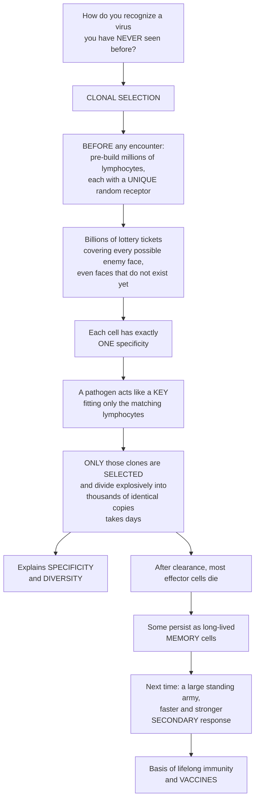

# 🎯 Clonal Selection and Immunological Memory

> [!abstract] TL;DR
> **Clonal selection** is the core operating principle of adaptive immunity: instead of designing a custom weapon for each new pathogen on demand, the body **pre-builds a colossally diverse repertoire of lymphocytes** — millions of B and T cells, each bearing one **unique, randomly generated receptor** — *before* it ever meets a pathogen. When an invader arrives, its molecules act like a key that fits only the rare matching lymphocytes; **only those clones are selected** and multiply explosively into a tailored army (which is why a first response takes days). This single idea explains **specificity**, near-limitless **diversity**, self-**tolerance**, and the immune system's superpower — **memory**: after the threat is cleared, some expanded cells persist as long-lived memory cells, so a second encounter meets a large, pre-trained standing army and the **secondary response** is faster, stronger, and higher-affinity. This is why you catch measles once and why vaccines work.

---

## Intuition

**Analogy first.** How can your immune system recognize and destroy a virus it has **never seen before** — including brand-new viruses that did not even exist when you were born? The elegant answer is **clonal selection**, and the trick sounds almost crazy. Rather than building a bespoke weapon for each new enemy on demand (impossible in real time), your body **prints billions of different lottery tickets in advance**. Before ever meeting a single pathogen, it generates a vast army of lymphocytes — each cell carrying **one unique, randomly-shaped receptor**, together covering essentially every possible "enemy face," even faces that do not exist yet.

When a real pathogen invades, its molecules act like a **key that fits only a few tickets** — the rare lymphocytes whose receptor happens to match. **Only those matching cells are selected**: they are triggered to divide explosively, cloning themselves into thousands of identical copies, all specific for that exact invader. (This is why a first response takes days — it takes time to multiply up a rare matching clone from a handful of cells.) That neatly explains two things at once: **specificity** (each response is tailored to the invader) and **diversity** (the repertoire was pre-built to cover anything).

But it also explains the immune system's real superpower: **memory**. After the infection clears, most of the expanded army stands down and dies, but a cadre survives as long-lived **memory cells**. The next time that pathogen appears, you are no longer starting from a few rare cells — you already have a **large standing army** trained against it, so the response is dramatically faster and stronger. That **secondary response** is exactly why you do not catch measles twice, and why **vaccines** work: they safely "pre-select" the right clones so memory is ready before the real threat ever arrives.

---

## How It Works

### Core Mechanics

Clonal selection theory, framed by **Frank Macfarlane Burnet** and **David Talmage** in the 1950s (building on Niels Jerne's selective ideas and, distantly, Paul Ehrlich's side-chain theory), rests on four postulates:

1. **One cell, one specificity — generated randomly.** Each lymphocyte is born bearing receptors of a **single specificity**, produced by random gene rearrangement (V(D)J recombination) **independently of any antigen**. A vast, diverse **repertoire of clones therefore exists *before* antigen is ever seen** — on the order of 10^11 or more potential specificities from a limited set of genes.
2. **Antigen selects, then the clone expands.** A pathogen's antigen binds and **selects** only the lymphocytes whose receptors happen to fit. Selection triggers **clonal expansion** (proliferation into a large clone of identical specificity) and **differentiation** into effector cells (e.g., antibody-secreting plasma cells, cytotoxic T cells).
3. **Self-reactive clones are purged.** Lymphocytes that recognize the body's own molecules are deleted or inactivated during development (**clonal deletion / tolerance**), which is why the system normally does not attack "self."
4. **Memory persists.** After the response, a subset of the expanded clone survives long-term as **memory cells**.

The explanatory power is enormous: the same simple logic accounts for **specificity**, **diversity**, the **kinetic lag** of a first response (time to amplify a rare precursor), **self-tolerance**, **self-limitation**, and **memory** — all without the body ever needing to "know" the enemy in advance.

### Flow / Architecture



---

## Key Concepts

### Secondary (high-school intuition)

- **The problem:** the immune system must recognize an almost unlimited universe of molecular shapes — including germs that are brand-new or even lab-made — with pinpoint accuracy and lasting memory.
- **The core idea:** your body makes a huge variety of defender cells *ahead of time*, each able to recognize just one shape. A germ "selects" the few that match, and those multiply into an army. That is **clonal selection**.
- **Why the first illness is slow:** it takes days to grow a rare matching cell into a big enough force.
- **Memory:** after you recover, some of those cells stay behind, so the same germ is defeated much faster next time — the basis of not catching a disease twice and of **vaccines**.

### Undergraduate

- **Repertoire before antigen.** Diversity is generated by **V(D)J recombination** (see *Generation_of_Receptor_Diversity_VDJ_Recombination*), so a diverse clonal repertoire pre-exists exposure. Antigen is an **instructor of selection, not of specificity** — it chooses among pre-made options rather than shaping the receptor.
- **Clonal expansion and differentiation.** A selected naive clone proliferates over days and differentiates into short-lived **effector cells** plus **memory cells**. A single plasma cell descended from that clone is **monospecific** — it secretes one antibody.
- **Clonal deletion and tolerance.** Immature lymphocytes that bind self-antigens are deleted or anergized (central and peripheral tolerance). Failure produces **autoimmunity**.
- **Primary vs secondary response — the hallmark.** The signature experiment: immunize, measure antibody titer; the **primary** response has a long lag (~5–10 days), a lower peak, mostly IgM, and lower affinity. Re-challenge with the same antigen and the **secondary** response has a short lag (1–3 days), a much higher peak, is class-switched (IgG), and is higher-affinity — because memory left behind a **higher precursor frequency** of better cells.
- **Contraction and memory.** After clearance most effector cells die (contraction); a stable pool of memory B and T cells survives for years to decades.

### Graduate

- **Somatic selection as a Darwinian process.** Clonal selection is **natural selection operating on cells within one body**: random **variation** (receptor genes), **selection** (by antigen binding), and **amplification** (proliferation of the fittest binders). This "somatic selection" is the conceptual sibling of organismal evolution (see [[Natural_Selection_and_Adaptation]]) and is taken further in the **germinal center**, where iterative mutation-and-selection of B-cell receptors drives **affinity maturation** — micro-evolution on a timescale of days.
- **Quantitative kinetics.** Time to reach a protective titer scales as `lag + (1/r)·ln(threshold / N0)`, where `N0` is the precursor frequency and `r` the expansion rate. Memory raises `N0` by orders of magnitude, which shortens the lag logarithmically and (with pre-differentiation and higher affinity) raises the peak — a mechanistic account of why vaccination works.
- **Memory subsets.** Central memory (T_CM; lymph-node-homing, high proliferative potential), effector memory (T_EM; peripheral, rapid effector function), and tissue-resident memory (T_RM; parked at portals of entry). B-cell memory splits into circulating memory B cells and long-lived bone-marrow plasma cells that sustain serum antibody for decades.
- **Durability and quirks.** Memory can be lifelong (measles, smallpox) or wane (tetanus, some coronaviruses). **Original antigenic sin** (antigenic imprinting): prior memory to a related strain can be preferentially recalled, sometimes blunting the response to a novel variant — a maladaptive side effect of the same selective machinery.

---

## Python Demo

```python
# Clonal selection & immunological memory, two panels:
#  (a) CLONAL SELECTION / EXPANSION: a rare matching clone is selected
#      from a diverse repertoire and proliferates to dominate the pool.
#  (b) PRIMARY vs SECONDARY: the memory advantage comes from a higher
#      precursor frequency -> shorter lag and higher peak (why vaccines work).
import numpy as np
import matplotlib.pyplot as plt

rng = np.random.default_rng(42)

# ============================================================
# (a) CLONAL SELECTION & EXPANSION
# A diverse repertoire of lymphocyte clones, each a different specificity.
# A pathogen SELECTS only the rare matching clone(s), which proliferate
# exponentially while the rest stay flat -- selection inside the body.
# ============================================================
n_clones     = 200                     # size of the naive repertoire (toy)
days         = np.arange(0, 15)         # days after infection
growth_rate  = np.log(2) / 0.5          # matching clones double ~every 12 h
K            = 1e5                       # carrying capacity per clone

start = rng.uniform(0.8, 1.2, size=n_clones)   # every clone starts rare (~1 cell)
matching = np.zeros(n_clones, dtype=bool)
matching[rng.choice(n_clones, size=3, replace=False)] = True   # pathogen fits 3 clones

counts = np.zeros((len(days), n_clones))
for i, t in enumerate(days):
    grown = start * np.exp(growth_rate * t)
    grown = K * grown / (K + grown)                    # logistic cap
    counts[i] = np.where(matching, grown, start)       # non-matching stay flat
freq = counts / counts.sum(axis=1, keepdims=True)      # fraction of the pool

# ============================================================
# (b) PRIMARY vs SECONDARY (memory) RESPONSE
# Same antigen twice. The mechanistic change is PRECURSOR FREQUENCY:
# memory leaves a large standing clone, so the secondary response starts
# from many cells (not a few) and from better, pre-differentiated cells.
# ============================================================
t = np.linspace(0, 45, 500)                            # days

def response(t, precursor, r, affinity, lag):
    """Antibody titer from an expanding-then-contracting clone."""
    x = np.clip(t - lag, 0.0, None)
    expansion = precursor * np.exp(r * x)
    Kcap = 1e6
    expansion = Kcap * expansion / (Kcap + expansion)  # saturating expansion
    contraction = np.exp(-0.05 * x)                    # slow decay after peak
    return affinity * expansion * contraction

# Primary: 1 naive precursor, extra activation lag, low affinity (IgM-like).
primary   = response(t, precursor=1.0,    r=1.0, affinity=1.0, lag=3.0)
# Secondary: ~1000x more memory precursors, quicker start, higher affinity (IgG).
secondary = response(t, precursor=1000.0, r=1.2, affinity=3.0, lag=1.0)

# Quantify the memory advantage: time to cross a protective threshold + peak.
thresh = 50.0
def first_crossing(t, y, thr):
    hit = y >= thr
    return t[np.argmax(hit)] if hit.any() else np.nan

lag_p, lag_s = first_crossing(t, primary, thresh), first_crossing(t, secondary, thresh)
print(f"Protective-titer lag  -> primary {lag_p:.1f} d, secondary {lag_s:.1f} d "
      f"(faster by {lag_p - lag_s:.1f} d)")
print(f"Peak titer            -> secondary is {secondary.max()/primary.max():.1f}x higher")

# ---------------- Plots ----------------
fig, (ax1, ax2) = plt.subplots(1, 2, figsize=(13, 5))

# Panel (a): clone frequencies over time (log scale).
for j in np.where(~matching)[0][:40]:
    ax1.plot(days, freq[:, j], color="0.75", lw=0.8)
for j in np.where(matching)[0]:
    ax1.plot(days, freq[:, j], color="crimson", lw=2.5)
ax1.plot([], [], color="0.75", lw=0.8, label="non-matching clones (flat)")
ax1.plot([], [], color="crimson", lw=2.5, label="SELECTED matching clones")
ax1.set_yscale("log")
ax1.set_xlabel("days after infection")
ax1.set_ylabel("clone frequency in repertoire (log)")
ax1.set_title("(a) Clonal selection & expansion:\nrare matching clone comes to dominate")
ax1.legend(loc="center right", fontsize=9)

# Panel (b): primary vs secondary titer.
ax2.plot(t, primary,   color="steelblue", lw=2.5, label="primary (naive precursor)")
ax2.plot(t, secondary, color="darkorange", lw=2.5, label="secondary (memory precursor)")
ax2.axhline(thresh, color="0.5", ls="--", lw=1, label="protective threshold")
ax2.set_xlabel("days after (re)exposure")
ax2.set_ylabel("antibody titer / effector number")
ax2.set_title("(b) Primary vs secondary response:\nmemory = shorter lag, higher peak")
ax2.legend(loc="upper right", fontsize=9)

plt.tight_layout()
plt.show()
```

Panel (a) shows the essence of **selection**: three rare precursors that happen to match the pathogen are amplified until they dominate the pool, while the other clones stay flat. Panel (b) shows the **memory** payoff: with a ~1000× higher starting precursor frequency (plus faster, higher-affinity cells), the secondary response crosses the protective threshold much sooner and peaks far higher — the quantitative basis of vaccination.

---

## Real-World Applications

> **Example — Vaccination as applied clonal selection.** Every vaccine is a controlled exercise in clonal selection and memory. A harmless antigen (an inactivated virus, a subunit protein, or an mRNA blueprint) is introduced so the body **selects and expands** the matching B and T cell clones and leaves behind memory — *without* the disease. On real exposure, the pre-existing memory pool delivers a fast, high-affinity **secondary response** that clears the pathogen before symptoms appear. Scale this across a population and you also get **herd immunity** (see [[Vaccination_Herd_Immunity_and_Elimination]]). The 1000-fold precursor-frequency advantage simulated above is exactly what a booster shot is buying.

- **Monoclonal antibodies.** Because one plasma clone makes one antibody, a single selected B cell can be immortalized (hybridoma) to mass-produce a single, defined antibody — the foundation of diagnostics and drugs for cancer, autoimmunity, and infection.
- **CAR-T and adoptive cell therapy.** Deliberately expanding a chosen T-cell specificity against a tumor antigen is clonal selection engineered in a lab.
- **Serological memory as a record.** Long-lived bone-marrow plasma cells keep secreting antibody for decades, so a blood test can reveal which pathogens (or vaccines) a person's immune system has "selected" against years earlier.
- **Affinity maturation for antibody engineering.** The germinal-center cycle of mutation-and-selection is copied in vitro (phage display, directed evolution) to evolve ultra-high-affinity binders.

---

## Common Pitfalls

- **"The antigen teaches the cell what shape to make."** No — this is the discarded *instructional* view. In clonal selection the receptor is generated **randomly and in advance**; antigen only **selects** among pre-existing specificities. Confusing selection with instruction is the single biggest conceptual error here.
- **"A lymphocyte can recognize many different antigens."** Each naive lymphocyte is **monospecific** — one receptor, one target. Diversity lives in the *population*, not the individual cell.
- **"Memory means the same cells never die."** Effector cells largely die off (contraction); memory is a **distinct, smaller, long-lived subset**, not the surviving front-line army.
- **"Secondary responses are faster because the cells move faster."** The speed-up is mostly a **numbers game**: a higher precursor frequency needs fewer doublings to reach a protective level (the logarithmic lag reduction in the demo), aided by pre-differentiation and higher affinity.
- **"Clonal selection guarantees perfect memory."** Memory durability varies by pathogen, and **original antigenic sin** shows the recall machinery can misfire, preferentially boosting old specificities against a novel variant.
- **"Self-tolerance is automatic and absolute."** Tolerance is an *active* purge of self-reactive clones during development; when it fails, the same selective amplification drives **autoimmune disease**.

---

## Related Concepts

This note is the foundational logic that the rest of the Immunology vault builds on. It follows the vault opener *Immunology_Overview_and_the_Immune_System* and the contrast in *Innate_versus_Adaptive_Immunity* (adaptive immunity's slow, specific, remembering character is a direct consequence of having to expand a rare clone). It relies on the players catalogued in *Cells_of_the_Immune_System* (B and T lymphocytes) and on *Generation_of_Receptor_Diversity_VDJ_Recombination*, which supplies the pre-built diversity that selection acts upon; it feeds directly into *Immunological_Memory_and_Vaccination_Principles*.

- [[The_Adaptive_Immune_System]] — the Biology-vault overview where clonal selection is the organizing principle behind humoral and cell-mediated immunity.
- [[Natural_Selection_and_Adaptation]] — clonal selection is **Darwinian selection operating on cells within the body**: variation, selection, amplification (somatic selection).
- [[Vaccination_Herd_Immunity_and_Elimination]] — the population-scale payoff of pre-selecting protective memory clones across many individuals.

---

## Review Questions

1. **(Secondary)** In your own words, why does it usually take several days to recover from an infection you have never had before, but far less time to fight off the *same* infection a second time?
2. **(Undergraduate)** State the four postulates of clonal selection theory. Explain precisely how the theory accounts for **both** the specificity and the near-limitless diversity of adaptive immune recognition, and where receptor diversity comes from.
3. **(Undergraduate/Graduate)** Given a memory precursor frequency ~1000× higher than the naive frequency, and using `time-to-threshold = lag + (1/r)·ln(threshold/N0)`, explain quantitatively why the secondary response has a shorter lag. What *additional* factors (beyond precursor number) make it higher-affinity and class-switched?
4. **(Graduate)** In what sense is clonal selection a Darwinian process, and how does the germinal center extend that process into affinity maturation? Discuss one way this same selective machinery can misfire (e.g., original antigenic sin or loss of self-tolerance).

---

## Sources

- Burnet, F.M. (1959). *The Clonal Selection Theory of Acquired Immunity*. Cambridge University Press.
- Murphy, K. & Weaver, C. (2022). *Janeway's Immunobiology*, 10th ed. Garland Science.
- Abbas, A.K., Lichtman, A.H. & Pillai, S. (2021). *Cellular and Molecular Immunology*, 10th ed. Elsevier.
- Ahmed, R. & Gray, D. (1996). "Immunological memory and protective immunity: understanding their relation." *Science*, 272(5258), 54–60.
- Talmage, D.W. (1957). "Allergy and immunology." *Annual Review of Medicine*, 8, 239–256.

---

#immunology #clonal-selection #immunological-memory #adaptive-immunity #vaccination
