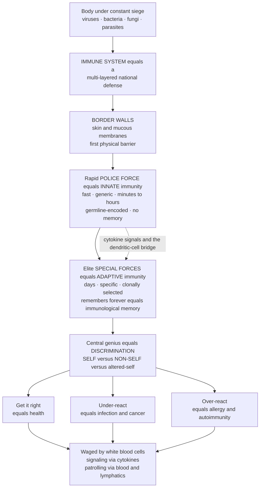

# 🛡️ Immunology Overview and the Immune System

> [!abstract] TL;DR
> **Immunology** is the study of the immune system — the cells, tissues, molecules, and mechanisms that defend the body against pathogens and other threats while maintaining **tolerance** to the body's own healthy tissue. The system is built in overlapping layers: **physical barriers** (skin and mucous membranes), a fast **innate** arm (evolutionarily ancient, germline-encoded, reacting within minutes to hours to broad classes of microbes, with **no memory**), and a slower **adaptive** arm (vertebrate-specific, using somatically generated, hugely diverse receptors that are clonally selected and leave lasting **immunological memory** — the basis of vaccination). Its cardinal principles are **specificity, diversity, memory, self/non-self discrimination and tolerance,** and **layered defense-in-depth**. When the balance is right you stay healthy; too **little** immunity produces immunodeficiency, chronic infection, and cancer, while too **much** or misdirected immunity produces allergy, autoimmunity, and transplant rejection. This note is the **hub** of the Immunology vault — it frames the whole system and maps the six sections that follow. *(Educational science, not individual medical advice.)*

---

## Intuition

**Analogy — your body's national defense force.** Your body is under constant siege. Every breath, every bite of food, and every cut in the skin exposes you to a relentless army of invaders — viruses, bacteria, fungi, and parasites, all trying to get in and multiply. The immune system is your body's complete **national defense apparatus**, an astonishingly sophisticated, multi-layered security system that protects you around the clock, mostly without you ever noticing.

It has **border walls**: your skin and mucous membranes, the first physical barrier. Behind them stands a rapid-response **police force** that reacts to any intruder within minutes — this is **innate immunity**, fast but generic, treating all invaders roughly the same. Backing them up is an elite, intelligent **special forces** branch that takes days to mobilize but learns the *specific* identity of each enemy and remembers it forever — this is **adaptive immunity**, the source of the immunological memory that makes vaccines work and stops you catching the same disease twice.

The system's central genius — and its central danger — is **discrimination**: it must accurately distinguish **self** (your own healthy cells) from **non-self** (invaders) and from dangerous **altered-self** (cancer). When it gets this right, you stay healthy. When it under-reacts, you get infections and cancer; when it over-reacts, you get allergies and autoimmune disease — the defenders turning their weapons on the body they were built to protect. This war is waged by an army of specialized white blood cells communicating through chemical messengers (**cytokines**) and patrolling every tissue via the blood and a dedicated highway system, the **lymphatics**. Understanding the immune system is understanding one of the most complex and consequential systems in all of biology — the difference between life and death in every infection, the foundation of vaccines and modern immunotherapy, and a system whose malfunctions cause a huge fraction of human disease.

---

## How It Works

The immune system operates as **defense-in-depth**: each layer catches what the previous one missed, and the fast generic layer *instructs* the slow specific one. The pivotal decision running through the whole system is **self versus non-self**.



**The two arms, integrated.** Innate immunity uses a fixed, genetically inherited set of **pattern-recognition receptors** that detect molecular signatures shared by whole classes of microbes — so it is ready instantly but cannot fine-tune. Adaptive immunity generates, in each individual, a vast repertoire of *unique* receptors by cutting and pasting gene segments, so it can recognize almost any molecular shape — but building and expanding the right clones takes days. The two are not separate systems working in parallel; the innate arm **detects danger, sounds the alarm, and activates** the adaptive arm, most famously through **dendritic cells** that carry captured antigen from the tissues to the lymph nodes and present it to T cells. Adaptive immunity then feeds back, arming innate cells to kill more effectively.

---

## Key Concepts

### 🟢 Secondary (foundations)
- **Two arms of defense.** **Innate** immunity = fast, generic guards on duty from birth; **adaptive** immunity = slow, specialist special forces that learn each enemy and *remember* it.
- **Barriers first.** Skin, mucus, stomach acid, and tears block most invaders before any cell has to fight.
- **Self versus non-self.** The system's core job is telling *your own cells* from *invaders* — attacking invaders while sparing you.
- **Memory and vaccines.** Because the adaptive arm remembers, a second encounter with the same germ is defeated faster — and a **vaccine** trains that memory safely, without the disease.
- **The army.** White blood cells (leukocytes) do the fighting; they travel through the blood and the lymphatic highways.

### 🟡 Undergraduate (mechanisms)
- **Cardinal principles.** **Specificity** (each adaptive receptor fits one antigen), **diversity** (a repertoire large enough to recognize nearly any antigen), **memory** (faster, larger secondary responses), **self/non-self discrimination and tolerance** (not attacking self), and **defense-in-depth** (redundant, layered protection).
- **Leukocyte lineages from hematopoiesis.** The **myeloid** line (neutrophils, macrophages, dendritic cells, mast cells, eosinophils, basophils) and the **lymphoid** line (B cells, T cells, NK cells) — future *Cells_of_the_Immune_System* territory.
- **Pattern recognition.** Innate cells use pattern-recognition receptors to detect conserved microbial patterns; this is the trigger for **inflammation** and the **complement** cascade.
- **Antigens and epitopes.** An **antigen** is anything the adaptive system can recognize; the specific piece a receptor binds is an **epitope** — the coming *Antigens_Epitopes_and_Immunogenicity* topic.
- **Effectors and signals.** **Antibodies** (secreted by B-cell-derived plasma cells), **T-cell receptors**, and the **cytokine** network that coordinates the response.
- **Anatomy.** Primary lymphoid organs (bone marrow, thymus) generate and school lymphocytes; secondary organs (lymph nodes, spleen, mucosal tissue) stage the response — the *Lymphoid_Organs_and_Immune_Anatomy* theme.
- **The disease spectrum.** Immunity is a **balance**: too little gives **immunodeficiency**; too much or misdirected gives **hypersensitivity/allergy** and **autoimmunity**.

### 🔴 Graduate (frontier and theory)
- **Generating diversity.** Somatic **V(D)J recombination**, junctional diversity, and (in B cells) **somatic hypermutation** with **affinity maturation** in germinal centers create receptor repertoires far larger than the genome could encode directly.
- **Clonal selection.** Antigen selects and expands the rare pre-existing lymphocyte clones whose receptors already fit it — the organizing principle of adaptive immunity and of memory (the *Clonal_Selection_and_Immunological_Memory* theme).
- **Tolerance, two-tiered.** **Central tolerance** (thymic negative selection, receptor editing in marrow) plus **peripheral tolerance** (regulatory T cells, anergy, checkpoints) enforce self/non-self discrimination; their breakdown underlies autoimmunity.
- **Beyond strict self/non-self.** The **danger/damage model** and recognition of **altered-self** (stress ligands, missing-self for NK cells) refine the classic self/non-self framing.
- **The activation logic.** T-cell activation needs **signal 1** (antigen on MHC), **signal 2** (costimulation), and **signal 3** (cytokines), which together bias **T-helper subset** differentiation and thus the flavor of the whole response.
- **Coevolution.** Host and pathogen are locked in an evolutionary arms race; immune **evasion** strategies drive much of pathogen diversity, and checkpoint biology is what modern cancer **immunotherapy** exploits.

---

## Python Demo

```python
# Two canonical pictures of the immune system, with numpy + matplotlib only.
# (a) Response kinetics: fast generic INNATE vs slow specific ADAPTIVE, plus the
#     primary-vs-secondary (MEMORY) antibody response that makes vaccines work.
# (b) Pathogen control: a layered defense (innate slows, adaptive clears) driving
#     an infection's pathogen load up and then to extinction.

import numpy as np
import matplotlib.pyplot as plt

# ----------------------------------------------------------------------
# (a) RESPONSE KINETICS + IMMUNOLOGICAL MEMORY
# ----------------------------------------------------------------------
def response(t, t0, lag, peak, rise, decay):
    """Gamma-like rise-then-decay pulse that starts at t0 + lag."""
    x = t - t0 - lag
    return np.where(x > 0, peak * (1.0 - np.exp(-x / rise)) * np.exp(-x / decay), 0.0)

t = np.linspace(0, 56, 2000)          # days spanning two exposures
exp1, exp2 = 0.0, 28.0                 # first and second exposure to the SAME pathogen

# Innate: fast, generic, no memory -> identical pulse on both exposures
innate = response(t, exp1, 0.0, 1.0, 0.3, 3.0) + response(t, exp2, 0.0, 1.0, 0.3, 3.0)

# Adaptive antibody titer: slow modest PRIMARY, then fast large durable SECONDARY
primary   = response(t, exp1, 5.0, 3.0, 2.5, 30.0)   # lag ~5 days, modest
secondary = response(t, exp2, 1.5, 7.0, 1.0, 45.0)   # lag ~1.5 days, bigger, longer-lived
adaptive  = primary + secondary

# ----------------------------------------------------------------------
# (b) PATHOGEN CONTROL BY A LAYERED DEFENSE (simple Euler integration)
# ----------------------------------------------------------------------
dt, T = 0.01, 25.0
steps = int(T / dt)
tp = np.linspace(0, T, steps)
P, E_in, E_ad = np.zeros(steps), np.zeros(steps), np.zeros(steps)
P[0] = 0.5                              # initial pathogen load

r, Pmax = 1.4, 100.0                    # pathogen logistic growth
kill_in, kill_ad = 0.4, 2.5            # per-effector killing rates (innate weak, adaptive strong)

for i in range(steps - 1):
    antigen = P[i] / (P[i] + 1.0)                                    # saturating antigen signal
    E_in[i+1] = E_in[i] + (1.3 * antigen - 0.6 * E_in[i]) * dt       # innate: fast on/off, no memory
    mat = 1.0 / (1.0 + np.exp(-(tp[i] - 7.0)))                        # clonal-expansion gate (~day 7 lag)
    E_ad[i+1] = E_ad[i] + (0.9 * antigen * mat - 0.2 * E_ad[i]) * dt  # adaptive: delayed, then surging
    dP = r * P[i] * (1.0 - P[i] / Pmax) - (kill_in * E_in[i] + kill_ad * E_ad[i]) * P[i]
    P[i+1] = max(P[i] + dP * dt, 1e-6)

# ----------------------------------------------------------------------
# PLOTS
# ----------------------------------------------------------------------
fig, (ax1, ax2) = plt.subplots(1, 2, figsize=(13, 5))

ax1.plot(t, innate,   color="tab:orange", lw=2, ls="--", label="Innate (fast, generic, no memory)")
ax1.plot(t, adaptive, color="tab:blue",   lw=2,          label="Adaptive antibody titer")
for x, lab in [(exp1, "1st exposure"), (exp2, "2nd exposure (same pathogen)")]:
    ax1.axvline(x, color="grey", ls=":", lw=1)
    ax1.text(x + 0.6, 0.2, lab, rotation=90, va="bottom", fontsize=8)
ax1.annotate("Primary:\nslow, modest", xy=(12, 2.2), xytext=(14, 4.8),
             arrowprops=dict(arrowstyle="->"), fontsize=8)
ax1.annotate("Secondary (memory):\nfaster, larger, durable", xy=(31, 6.4), xytext=(34, 3.4),
             arrowprops=dict(arrowstyle="->"), fontsize=8)
ax1.set_title("(a) Response kinetics and immunological memory")
ax1.set_xlabel("Days after first exposure"); ax1.set_ylabel("Response magnitude (arb. units)")
ax1.legend(loc="upper left", fontsize=8); ax1.grid(alpha=0.3)

ax2.plot(tp, P, color="tab:red", lw=2.5, label="Pathogen load")
ax2b = ax2.twinx()
ax2b.plot(tp, E_in, color="tab:orange", lw=2, ls="--", label="Innate effectors")
ax2b.plot(tp, E_ad, color="tab:blue",  lw=2,          label="Adaptive effectors")
ax2.set_title("(b) Layered defense controlling an infection")
ax2.set_xlabel("Days"); ax2.set_ylabel("Pathogen load", color="tab:red")
ax2b.set_ylabel("Immune effector level")
ax2.tick_params(axis="y", labelcolor="tab:red")
lines = ax2.get_lines() + ax2b.get_lines()
ax2.legend(lines, [l.get_label() for l in lines], loc="upper right", fontsize=8)
ax2.grid(alpha=0.3)

plt.tight_layout()
plt.show()
```

Panel (a) reproduces the textbook **primary-versus-secondary** antibody curve: the innate pulse is identical each time (no memory), while the adaptive response is slow and modest on first exposure but faster, larger, and longer-lived on re-exposure — the signature of memory and the entire rationale for vaccination. Panel (b) shows why the layered design matters: innate effectors alone only *slow* the pathogen, letting its load climb, until the delayed but powerful adaptive effectors surge and drive the infection to clearance.

---

## Real-World Applications

- **Vaccines.** From Jenner's cowpox in 1796 to modern **mRNA** and subunit vaccines, every vaccine exploits **immunological memory** — showing the adaptive arm a harmless preview so the *secondary* response is ready when the real pathogen arrives.
- **Cancer immunotherapy.** **Checkpoint inhibitors** release the brakes of peripheral tolerance so T cells attack tumors; **CAR-T** cells are patient T cells re-engineered to recognize a cancer antigen — direct applications of adaptive-immunity and tolerance biology.
- **Transplantation.** Organ rejection is the immune system doing its job too well against **non-self** tissue; matching donor **MHC/HLA** and using immunosuppression is applied self/non-self immunology.
- **Monoclonal antibody drugs.** Lab-made antibodies (for autoimmune disease, cancer, and infection) are the antibody effector arm turned into a precision drug platform.
- **Diagnostics and serology.** Antibody and antigen tests, allergy panels, and immune-cell counts translate immune principles into clinical measurement.
- **Managing immune imbalance.** Immunodeficiency screening on one end, and allergy/autoimmune biologics that *dial down* the response on the other, both hinge on understanding the balance this hub describes.

---

## Common Pitfalls

- **"Innate is weak, adaptive is strong."** Wrong framing. Innate is *fast and essential*, controls most infections outright, and **instructs** adaptive immunity via the dendritic-cell bridge; adaptive is powerful but useless without innate first sounding the alarm.
- **Thinking memory means only antibodies.** Long-lived **memory T cells** are as important as memory B cells and antibodies; immunity to many viruses is heavily T-cell-mediated.
- **"Boost your immune system."** More activity is not better — the whole system is about **balance and regulation**. An over-active response *is* allergy and autoimmunity, not health.
- **Confusing antigen, antibody, and epitope.** The **antigen** is the target, the **antibody** is one recognizing molecule, and the **epitope** is the exact patch on the antigen that is bound. Mixing these up derails almost every downstream concept.
- **Believing self/non-self is the whole story.** The **danger model** and recognition of **altered-self** (stressed and cancerous cells) explain cases that pure self/non-self cannot.
- **"Vaccines give you immunity."** Vaccines *train your own* immune system to build its own memory — they supply the lesson, not the defense itself.

---

## Related Concepts

**Cross-vault anchors (verified files):**
- [[Biology/11_Microbiology_and_Immunology/The_Innate_Immune_System|The Innate Immune System]] — the fast, generic first-responder arm this hub introduces, in cellular detail.
- [[Biology/11_Microbiology_and_Immunology/The_Adaptive_Immune_System|The Adaptive Immune System]] — the slow, specific, memory-forming arm and its B and T cells.
- [[Biology/11_Microbiology_and_Immunology/Vaccines_and_Antibiotics|Vaccines and Antibiotics]] — how immunological memory is harnessed prophylactically and how microbes are fought pharmacologically.
- [[Biology/11_Microbiology_and_Immunology/Viruses|Viruses]] — a central class of pathogen the immune system must recognize and clear.
- [[Biology/11_Microbiology_and_Immunology/Bacteria_and_Archaea|Bacteria and Archaea]] — the microbial targets of barrier, innate, and adaptive defenses.
- [[Clinical_Medicine/05_Immune_Infectious_and_Hematologic/Immune_Dysfunction_and_Autoimmunity|Immune Dysfunction and Autoimmunity]] — what happens clinically when self/non-self discrimination fails.
- [[Clinical_Medicine/05_Immune_Infectious_and_Hematologic/Hypersensitivity_Allergy_and_Immunodeficiency|Hypersensitivity, Allergy and Immunodeficiency]] — the two ends of the imbalance: too much reactivity and too little.
- [[Clinical_Medicine/05_Immune_Infectious_and_Hematologic/Infectious_Disease_and_Host_Pathogen_Interaction|Infectious Disease and Host-Pathogen Interaction]] — the coevolutionary contest the immune system exists to win.
- [[Health_Nutrition_and_Longevity/06_Public_Health_and_Prevention/Infectious_Disease_Vaccines_and_Immunity|Infectious Disease, Vaccines and Immunity]] — immunity and vaccines scaled to whole populations and herd immunity.

**Within this vault (siblings, coming as the vault fills in):** this hub opens onto *Innate_versus_Adaptive_Immunity* (the core dichotomy), *Cells_of_the_Immune_System* (the leukocyte players), *Lymphoid_Organs_and_Immune_Anatomy* (the organs and lymphatic highways), *Clonal_Selection_and_Immunological_Memory* (how diversity and memory arise), and *Antigens_Epitopes_and_Immunogenicity* (what the system recognizes). Later anchors include *Antibody_Structure_and_Function*, *The_Major_Histocompatibility_Complex*, *Vaccines_and_Vaccine_Technology*, and *The_Reach_and_Future_of_Immunology*. The vault's six sections run: **(1) Foundations of Immunology**, **(2) Innate Immunity and Inflammation**, **(3) Antigen Recognition and Presentation**, **(4) The Adaptive Immune Response**, **(5) The Immune System in Disease**, and **(6) Vaccines, Immunotherapy and Frontiers**.

---

## Review Questions

**🟢 Secondary.** In one or two sentences each: why is the innate arm described as "fast but generic," why is the adaptive arm "slow but specific," and how does this difference explain why a vaccine can stop you catching a disease you have never had?

**🟡 Undergraduate.** List the five cardinal principles of the immune response and, for each, name one concrete example from either arm of the system. Then explain how the dendritic cell links the innate and adaptive arms.

**🔴 Graduate.** The classic **self/non-self** framework cannot easily explain why the immune system tolerates gut bacteria and the fetus yet attacks tumors that arise from the body's own cells. Explain how the **danger/damage model** and the concept of **altered-self** extend the framework, and describe one therapy (for example a checkpoint inhibitor) whose mechanism depends on manipulating tolerance rather than recognition per se.

---

## Sources

- Murphy, K. & Weaver, C. — *Janeway's Immunobiology* (10th ed., Garland Science). The standard mechanistic reference.
- Abbas, A. K., Lichtman, A. H. & Pillai, S. — *Cellular and Molecular Immunology* (Elsevier). Clinically oriented core text.
- Sompayrac, L. — *How the Immune System Works* (Wiley-Blackwell). The best short conceptual on-ramp.
- Paul, W. E. (ed.) — *Fundamental Immunology* (Wolters Kluwer). The comprehensive advanced reference.
- Nobel Prize in Physiology or Medicine — historical citations on immunity (e.g., Behring 1901, Burnet & Medawar 1960, Allison & Honjo 2018): [nobelprize.org](https://www.nobelprize.org/prizes/lists/all-nobel-laureates-in-physiology-or-medicine/)

---

#immunology #immune-system #innate-immunity #adaptive-immunity #immunological-memory
