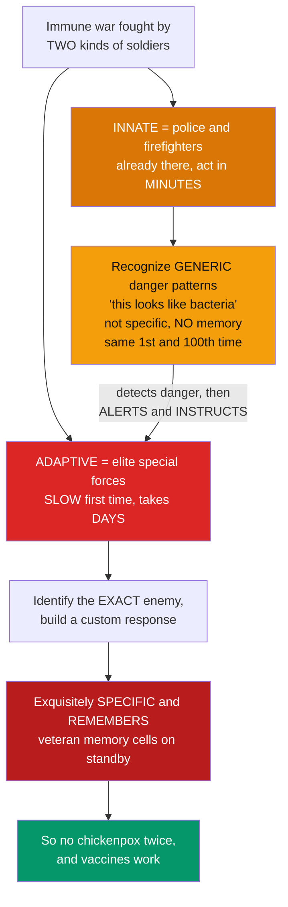

# 🛡️ Innate versus Adaptive Immunity

> [!abstract] TL;DR
> Vertebrate immunity is fought by **two very different kinds of soldiers**, and the contrast between them is the single most important idea in immunology. **Innate immunity** is the ancient, first-line defense present in all multicellular life: **fast** (minutes to hours), **generic** (it recognizes conserved molecular *patterns* shared by whole classes of microbes via germline-encoded receptors), non-clonal, and **memoryless** — it responds identically the 1st and 100th time. **Adaptive immunity**, evolved only in jawed vertebrates, is **slow** on first contact (days), because it must first identify the *exact* enemy and build a custom response, but it is **exquisitely specific** (one lymphocyte, one antigen) and — crucially — it **remembers**, leaving long-lived memory cells that make the second encounter faster and stronger. The two are not independent: the innate system **senses danger and instructs** the adaptive response, so they function as one integrated defense. This division — *fast-generic-forgetful* versus *slow-specific-remembering*, and how they cooperate — is the conceptual backbone of the entire immune response and of vaccination.

---

## Intuition

**Analogy first — two kinds of soldiers defending a country.**

Imagine a nation defending itself. Its **first responders are the innate immune system** — a standing **police force and firefighters**. They are *already there*, ready to act within **minutes** of any trouble. They are fast, and they respond to *generic* signs of danger — the way police respond to "someone breaking a window" without needing to know exactly who the burglar is. They recognize broad patterns shared by whole classes of intruders — the molecular equivalent of *"this looks like bacteria."* But they are not very specific, they do not get better with experience, and they have **no memory**: they respond identically the first time and the hundredth.

The second force is **adaptive immunity** — an **elite, intelligence-driven special forces unit**. It is **slow to mobilize the first time** — it takes **days** — because it must first identify the *exact* enemy and then build a custom-tailored response against that specific target. But it is **exquisitely specific** (recognizing one precise molecular feature of one pathogen) and, above all, it **remembers**. After defeating an enemy, it keeps veteran **memory cells** on permanent standby, so the next time that same pathogen appears the response is dramatically faster and stronger. This is why you do not get chickenpox twice, and how vaccines work.

The twist: **the two systems are not independent.** The innate system is the first to detect danger, and it **alerts and instructs** the adaptive system — telling it there is a *real* threat and what *kind* of threat it is. Understanding this division — fast-generic-forgetful versus slow-specific-remembering, and how the innate arm licenses the adaptive one — is the conceptual scaffold on which every other topic in immunology hangs.

---

## How It Works

### Core Mechanics

1. **A barrier is breached.** A pathogen crosses skin or mucosa. Damage and microbes generate two kinds of alarm signals: **PAMPs** (pathogen-associated molecular patterns — conserved microbial features like bacterial LPS or viral double-stranded RNA) and **DAMPs** (damage-associated molecular patterns released by injured host cells).
2. **The innate system senses within minutes.** Germline-encoded **pattern-recognition receptors (PRRs)** such as **Toll-like receptors (TLRs)** on macrophages and dendritic cells detect PAMPs. This triggers **inflammation**, the **complement** cascade, phagocytosis by **neutrophils** and **macrophages**, **NK-cell** killing of infected cells, and **interferon** release — a fast, generic, one-size-fits-all response with a fixed ceiling.
3. **Dendritic cells become the bridge.** A dendritic cell that has sensed danger via PRRs engulfs antigen, matures, and migrates to a lymph node. There it delivers **three signals** to a naive T cell: **signal 1** = antigen displayed on **MHC**; **signal 2** = costimulation (a "this is a real threat" license); **signal 3** = a cytokine cocktail that tells the adaptive arm *what kind* of pathogen it is.
4. **Clonal selection builds a custom response — slowly.** Among millions of lymphocytes, each bearing a unique somatically-generated receptor, the rare **B cell** or **T cell** whose receptor fits *this* antigen is selected and proliferates. This search-and-expand step is why the **primary** adaptive response takes days.
5. **Two adaptive arms deploy.** **Humoral immunity** — B cells become plasma cells secreting **antibodies** that neutralize toxins and opsonize extracellular pathogens. **Cell-mediated immunity** — **cytotoxic T cells (CD8+)** kill virus-infected and tumor cells; **helper T cells (CD4+)** coordinate everyone.
6. **Adaptive effectors redirect innate weapons.** Antibodies **opsonize** microbes for phagocytes and activate complement; helper-T cytokines **activate macrophages**. The two systems are one loop, not two silos.
7. **Memory persists.** After the threat clears, most effectors die, but long-lived **memory B and T cells** remain. On re-exposure the **secondary response** is faster, larger, and higher-affinity — while the innate response is unchanged.

### Flow / Architecture



---

## Key Concepts

### Secondary (the big picture)

- **Two teams, one goal.** *Innate* = fast, general, always ready, forgets. *Adaptive* = slow at first, precise, remembers.
- **Speed vs memory trade-off.** Innate wins the first minutes; adaptive wins the long war and every rematch.
- **Why you catch chickenpox once.** Adaptive **memory** means the second exposure is crushed before it makes you sick — the same principle a **vaccine** exploits by training memory *without* the disease.
- **The alarm relay.** Innate cells detect the intruder and *call in* the specialists. Neither team works alone.

### Undergraduate (the mechanisms)

- **The comparison table** — the core of the topic:

| Property | Innate | Adaptive |
|---|---|---|
| **Speed** | Immediate — minutes to hours | Delayed — days for a primary response |
| **Specificity** | Broad; conserved microbial **patterns** (PAMPs) | Exquisite; individual **antigens / epitopes** |
| **Receptors** | Germline-encoded, limited, fixed (**PRRs** e.g. TLRs) | Somatically generated by gene rearrangement; hugely **diverse** (BCRs, TCRs) |
| **Clonality** | Non-clonal, uniform | **Clonal selection** of rare specific lymphocytes |
| **Memory** | None / limited ("trained immunity") | Robust **immunological memory** → faster, stronger secondary response |
| **Evolution** | Ancient; all multicellular life | Jawed vertebrates only |

- **Components of innate immunity:** physical/chemical **barriers** (skin, mucosa, antimicrobial peptides), the **complement** system, **phagocytes** (neutrophils, macrophages), **dendritic cells**, **NK cells**, **inflammation**, and **interferons**.
- **Components of adaptive immunity:** **B lymphocytes** (antibodies → *humoral* immunity) and **T lymphocytes** (helper CD4+ and cytotoxic CD8+ → *cell-mediated* immunity), driven by **antigen presentation** on MHC.
- **A second axis — humoral vs cell-mediated:** antibody-mediated defense handles **extracellular** pathogens and toxins; T-cell-mediated defense handles **intracellular** pathogens, infected cells, and tumor cells.

### Graduate (the integration and its subtleties)

- **They are one system.** Dendritic cells are the physical bridge: PRR sensing → antigen presentation + **signal 2** costimulation + **signal 3** cytokines primes the adaptive response. Without the innate "license," naive T cells that see antigen alone become **anergic** rather than activated — a built-in safeguard against autoimmunity.
- **Self–nonself vs the danger model.** The classical Burnet **self–nonself** framework is refined by Matzinger's **danger model**: the adaptive system responds not merely to "foreign" but to antigen presented *in the context of innate danger signals* (PAMPs/DAMPs). This explains tolerance to commensals and to injected pure protein without adjuvant.
- **The molecular origin of adaptive immunity.** The vertebrate "big bang" of adaptive immunity is attributed to a **RAG-mediated VDJ recombination** system — plausibly domesticated from a transposon — enabling combinatorial receptor diversity of up to ~10¹¹ specificities from a compact germline.
- **Effector feedback onto innate cells.** Adaptive outputs re-arm the innate arm: antibodies opsonize for FcR-bearing phagocytes and fix complement; Th1 cytokines (IFN-γ) classically activate macrophages; this bidirectionality is why the innate/adaptive split is didactic, not physiological.
- **"Trained immunity."** Innate memory is not strictly zero: epigenetic reprogramming of monocytes/NK cells (e.g. after BCG or β-glucan) can produce a heightened, still-nonspecific innate response — a nuance to the textbook "innate has no memory."

---

## Python Demo

```python
# Innate vs Adaptive immunity, quantified two ways:
#   (a) response KINETICS + MEMORY over two infections by the SAME pathogen
#   (b) recognition BREADTH: few conserved patterns vs a vast receptor repertoire
import numpy as np
import matplotlib.pyplot as plt


def immune_pulse(t, t0, amp, t_peak, sharpness):
    """A normalized response pulse that peaks at `amp` at time t0 + t_peak.
    Larger `sharpness` -> narrower, faster-resolving response."""
    x = np.clip(t - t0, 1e-6, None)
    k = sharpness
    return amp * (x / t_peak) ** k * np.exp(k * (1.0 - x / t_peak))


# ---- Timeline: two infections by the SAME pathogen ----
t = np.linspace(0, 60, 2000)          # days
exp1, exp2 = 0.0, 40.0                 # primary and secondary exposure

# INNATE: peaks in hours, fixed generic magnitude, IDENTICAL both times (no memory)
innate = (immune_pulse(t, exp1, amp=1.0, t_peak=0.6, sharpness=1.4) +
          immune_pulse(t, exp2, amp=1.0, t_peak=0.6, sharpness=1.4))

# ADAPTIVE: slow lag + moderate size on the primary response;
#           faster, larger, higher-affinity on the secondary (memory) response
adaptive_primary   = immune_pulse(t, exp1, amp=3.0, t_peak=12.0, sharpness=2.2)
adaptive_secondary = immune_pulse(t, exp2, amp=6.5, t_peak=4.0,  sharpness=3.0)
adaptive = adaptive_primary + adaptive_secondary

fig, (axA, axB) = plt.subplots(1, 2, figsize=(13, 5))

# ---- Panel A: kinetics + memory ----
axA.plot(t, innate,   color="#d97706", lw=2.4, label="Innate: fast, generic, no memory")
axA.plot(t, adaptive, color="#dc2626", lw=2.4, label="Adaptive: slow, specific, remembers")
axA.fill_between(t, innate,   alpha=0.15, color="#d97706")
axA.fill_between(t, adaptive, alpha=0.12, color="#dc2626")

for x0, lab in [(exp1, "1st exposure"), (exp2, "2nd exposure\n(same pathogen)")]:
    axA.axvline(x0, color="#334155", ls="--", lw=1)
    axA.text(x0 + 0.6, 7.0, lab, fontsize=9, color="#334155")

axA.annotate("primary: days-long lag",
             xy=(12, 3.0), xytext=(15, 4.6),
             arrowprops=dict(arrowstyle="->", color="#dc2626"), color="#dc2626", fontsize=9)
axA.annotate("memory: faster,\nlarger, higher-affinity",
             xy=(44, 6.5), xytext=(28, 5.4),
             arrowprops=dict(arrowstyle="->", color="#dc2626"), color="#dc2626", fontsize=9)
axA.annotate("innate response\nunchanged (identical)",
             xy=(40.6, 1.0), xytext=(47, 2.4),
             arrowprops=dict(arrowstyle="->", color="#b45309"), color="#b45309", fontsize=9)

axA.set_xlabel("Time after infection (days)")
axA.set_ylabel("Response magnitude (arb. units)")
axA.set_title("(a) Kinetics & memory: fast-forgetful vs slow-remembering")
axA.set_ylim(0, 8.0)
axA.legend(loc="upper left", fontsize=9)
axA.grid(alpha=0.25)

# ---- Panel B: recognition breadth (receptor repertoire) ----
labels    = ["Innate\n(germline PRRs)", "Adaptive\n(BCR/TCR repertoire)"]
expressed = [1e2, 1e7]     # ~hundreds of PRR specificities vs ~10^7 expressed lymphocyte specificities
potential = [1e2, 1e11]    # adaptive theoretical diversity from VDJ recombination
xpos = np.arange(len(labels))

axB.bar(xpos, potential, width=0.55, color=["#d97706", "#dc2626"], alpha=0.30,
        label="theoretical diversity")
axB.bar(xpos, expressed, width=0.55, color=["#d97706", "#dc2626"],
        label="expressed specificities")
axB.set_yscale("log")
axB.set_xticks(xpos)
axB.set_xticklabels(labels)
axB.set_ylabel("Distinct receptor specificities (log scale)")
axB.set_title("(b) Recognition breadth: few conserved patterns vs vast repertoire")
axB.set_ylim(1, 1e12)
for xi, ev in zip(xpos, expressed):
    axB.text(xi, ev * 1.8, f"~{ev:.0e}", ha="center", fontsize=9)
axB.text(1, 1e11 * 1.8, "up to ~1e11", ha="center", fontsize=9, color="#7c3aed")
axB.legend(loc="upper left", fontsize=8)
axB.grid(axis="y", alpha=0.25)

plt.tight_layout()
plt.savefig("innate_vs_adaptive.png", dpi=120)
plt.show()

# ---- Quantify the contrast ----
innate_peak = immune_pulse(t, exp1, 1.0, 0.6, 1.4).max()
print(f"Innate peak (each exposure):  {innate_peak:.2f}  -> identical every time (no memory)")
print(f"Adaptive PRIMARY peak:        {adaptive_primary.max():.2f}")
print(f"Adaptive MEMORY  peak:        {adaptive_secondary.max():.2f}"
      f"  ({adaptive_secondary.max()/adaptive_primary.max():.1f}x larger, and days earlier)")
print(f"Repertoire ratio adaptive:innate ~ {1e7/1e2:.0e} (expressed), up to ~1e9 (potential)")
```

Panel (a) captures *fast-but-forgetful vs slow-but-remembering*: the innate curve spikes within hours to the same fixed ceiling on both exposures, while the adaptive curve lags for days on the primary response and then, on re-exposure, rises faster and higher (memory). Panel (b) captures the *receptor strategy*: a handful of conserved-pattern receptors versus a somatically generated repertoire millions of times larger.

---

## Real-World Applications

> **Vaccination.** Every vaccine is a deliberate exploitation of the innate→adaptive division. An **adjuvant** (e.g. alum, or the lipid nanoparticle in an mRNA vaccine) supplies the **innate danger signal** that a purified antigen alone lacks, licensing dendritic cells to prime T and B cells. The antigen then drives clonal selection and, above all, **memory** — so the immune system is pre-armed against a pathogen it has never actually met. Without engaging the innate arm, an antigen induces tolerance, not protection.

> **Sepsis.** When innate recognition of PAMPs (bacterial LPS via TLR4) becomes systemic and dysregulated, the same inflammatory machinery that normally protects locally drives a body-wide **cytokine storm** and organ failure — showing that "fast and generic" has a dangerous failure mode.

> **Checkpoint-inhibitor cancer immunotherapy.** Drugs like anti-PD-1 release the brakes on **cytotoxic (CD8+) T cells** — the adaptive, cell-mediated arm — so they can kill tumor cells the innate system cannot specifically target. Response often depends on whether the tumor is "hot" (innate-inflamed, well-presented) or "cold."

> **Autoimmunity & transplant rejection.** Both are the adaptive arm's specificity and memory aimed at the wrong target — self antigens or a donor graft — which is why immunosuppression and tolerance induction are central to transplantation.

---

## Common Pitfalls

- **Treating innate and adaptive as independent silos.** The most common conceptual error. Innate immunity is the **sensor and instructor** of adaptive immunity (dendritic cells, signals 1/2/3), and adaptive effectors in turn **re-arm** innate cells (opsonization, macrophage activation). Test yourself: if you can't explain the dendritic-cell bridge, you don't yet have the topic.
- **"Innate = weak, adaptive = strong."** Wrong axis. Innate is not weaker; it is *faster and more general*. Most infections are cleared by innate immunity alone before adaptive immunity even engages.
- **"Innate has zero memory."** Mostly true, but the modern nuance is **trained immunity** — epigenetic innate memory (e.g. post-BCG). Say "little to no classical memory," not "none."
- **Confusing the two axes.** *Innate vs adaptive* is one axis; *humoral vs cell-mediated* is a **second axis that lives entirely inside adaptive immunity**. Antibodies and T cells are both adaptive.
- **Assuming specificity means "foreign."** Adaptive activation requires antigen **plus** an innate danger signal (the danger model). Foreignness alone is neither necessary nor sufficient — this is why adjuvants exist and why we tolerate commensals.
- **Forgetting the cost of the receptor strategy.** The vast adaptive repertoire is generated randomly, so it inevitably produces self-reactive receptors — necessitating **central and peripheral tolerance** as a mandatory companion mechanism.

---

## Related Concepts

- [[The_Innate_Immune_System]] — the Biology/11 deep dive on barriers, complement, phagocytes, NK cells, and inflammation that this note frames as the "fast, generic" arm.
- [[The_Adaptive_Immune_System]] — the Biology/11 deep dive on B/T lymphocytes, antibodies, MHC, and clonal selection that this note frames as the "slow, specific, remembering" arm.
- [[Vaccines_and_Antibiotics]] — how immunological memory (the adaptive arm) is deliberately exploited for prophylaxis.
- [[Infectious_Disease_and_Host_Pathogen_Interaction]] — the clinical view of what happens when pathogens evade or subvert these two arms.
- [[Immune_Dysfunction_and_Autoimmunity]] — the clinical view of what happens when the balance between recognition, tolerance, and memory breaks down.

**Sibling notes in this Immunology vault** (build out these deep dives next): *Immunology Overview and the Immune System* (the map of the whole field), *Cells of the Immune System* (the players — myeloid and lymphoid lineages), *Clonal Selection and Immunological Memory* (how specificity and memory are generated), *Innate Immune Recognition and Pattern Receptors* (PRRs, PAMPs, and how danger is sensed), and *Antigen Processing and Presentation* (the MHC machinery that bridges innate sensing to adaptive priming).

---

## Review Questions

1. **(Secondary)** In one sentence each, contrast the innate and adaptive immune systems on **speed** and **memory**, and explain why this is why you can catch chickenpox only once.
2. **(Undergraduate)** Fill in and justify the five rows of the innate-vs-adaptive comparison table (speed, specificity, receptors, clonality, memory). Then explain why *humoral vs cell-mediated* is a **different** distinction from *innate vs adaptive*.
3. **(Undergraduate scenario)** A purified protein antigen is injected **without** an adjuvant and induces no lasting immunity; the same antigen **with** an adjuvant induces strong antibody titers and memory. Using signals 1, 2, and 3 and the role of dendritic cells, explain the difference.
4. **(Graduate)** Compare the classical **self–nonself** model with Matzinger's **danger model**. Which better explains tolerance to gut commensals and the requirement for adjuvants, and why?
5. **(Graduate trade-off)** The adaptive receptor repertoire is generated by random VDJ recombination, yielding up to ~10¹¹ specificities. State one enormous advantage and one unavoidable cost of this strategy, and name the mechanism that manages the cost.

---

## Sources

- Murphy, K. & Weaver, C. *Janeway's Immunobiology*, 9th/10th ed. Garland Science / W. W. Norton. (Ch. 1: Basic concepts in immunology.)
- Abbas, A. K., Lichtman, A. H., & Pillai, S. *Cellular and Molecular Immunology*, 10th ed. Elsevier. (Ch. 1–2: properties and overview of immune responses.)
- Medzhitov, R. & Janeway, C. Jr. "Innate Immunity." *New England Journal of Medicine* 343(5):338–344 (2000). https://doi.org/10.1056/NEJM200008033430506
- Sompayrac, L. *How the Immune System Works*, 6th ed. Wiley-Blackwell. (An accessible narrative of the innate/adaptive division and their cooperation.)
- Matzinger, P. "The Danger Model: A Renewed Sense of Self." *Science* 296(5566):301–305 (2002). https://doi.org/10.1126/science.1071059

---

#immunology #innate-immunity #adaptive-immunity #immunological-memory #humoral-vs-cellular
