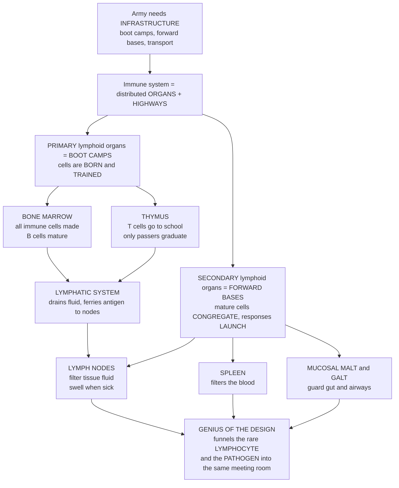

# 🛡️ Lymphoid Organs and Immune Anatomy

> [!abstract] TL;DR
> The immune system is not a single organ but a **distributed organ system** wired throughout the body. **Primary (central) lymphoid organs** — the **bone marrow** (where all immune cells are born and B cells mature) and the **thymus** (where T cells are "schooled" and tested) — are the **boot camps** that generate and train lymphocytes. **Secondary (peripheral) lymphoid organs** — the **lymph nodes**, the **spleen**, and the **mucosa-associated lymphoid tissue (MALT/GALT)** — are the **forward bases** where mature cells reside and where immune responses are actually launched. All of it is stitched together by the **lymphatic system**, a body-wide drainage network that continuously ferries antigen and antigen-presenting cells to the nodes. The architecture exists to solve one hard problem: making the one rare lymphocyte that recognizes a given pathogen physically **meet** that pathogen — by funneling both into the same small meeting rooms.

## Intuition

**Analogy first — an army needs more than soldiers; it needs an entire infrastructure.** It needs **boot camps** to turn raw recruits into trained troops, **forward operating bases** spread across the territory where those troops wait for the enemy, and a **transportation network** to move troops and intelligence to wherever they are needed. The immune system has exactly this architecture: a set of organs plus a set of highways.

There are **two kinds of bases**. The **primary lymphoid organs** are the **boot camps** where immune cells are *born* and *trained*: the **bone marrow** (where all immune cells are manufactured, and where **B** cells mature — mnemonically, **B** for **B**one marrow) and the **thymus** (a gland in the chest where **T** cells go to "school" and undergo brutal testing — **T** for **T**hymus — with only the cells that pass graduating into service). The **secondary lymphoid organs** are the **forward bases**, positioned exactly where invaders are likely to enter, where mature cells congregate and the actual response is launched: **lymph nodes** (hundreds of small bean-shaped filters strung along the body's drainage network, sampling fluid from the tissues — this is why they *swell* when you are sick, packed with proliferating cells fighting an infection), the **spleen** (which filters the *blood* and responds to blood-borne invaders), and the **mucosal tissues** (tonsils and the gut-associated lymphoid tissue — MALT and GALT — guarding the vast wet surfaces of the gut and airways where most pathogens actually try to break in).

Connecting all of it is the **lymphatic system** — a body-wide web of vessels that continuously drains tissue fluid and carries antigens and antigen-presenting cells to the lymph nodes so the immune system can survey the entire body. The genius of this design is that it dramatically **increases the odds** that the one rare lymphocyte able to recognize a given pathogen actually **meets** that pathogen — by funneling both into the same small meeting rooms. To understand immune anatomy is to understand **where** the immune response happens and **how** the body is physically organized for defense.

---

## How It Works

### Core Mechanics

The immune system is organized into a **generative compartment** and a **peripheral compartment**, linked by two circulations (blood and lymph):

1. **Primary lymphoid organs generate and educate lymphocytes.** In the **bone marrow**, hematopoietic stem cells give rise to all blood and immune cells; B cells complete their development there. Immature T cells leave the marrow and travel to the **thymus**, where they undergo **positive selection** (keep cells whose receptors can bind self-MHC) and **negative selection** (delete cells that bind self too strongly) — establishing **central tolerance**. Only a small fraction graduate.
2. **Mature naive lymphocytes exit into the blood** and begin a lifelong patrol, continuously **recirculating** between blood and secondary lymphoid organs.
3. **Secondary lymphoid organs concentrate antigen.** Peripheral tissues drain their interstitial fluid into **lymphatic vessels**, which carry fluid, soluble antigen, and **dendritic cells** (carrying captured antigen) into the **lymph nodes**. The **spleen** performs the analogous role for **blood-borne** antigen.
4. **Recirculating lymphocytes are filtered through these same organs.** Naive cells enter lymph nodes from the blood through specialized **high endothelial venules (HEVs)**, guided by **chemokines** and **adhesion molecules**, into compartmentalized zones — **B-cell follicles** and **T-cell paracortex**.
5. **Encounter, activation, and response.** Because antigen is concentrated in the node *and* the entire recirculating repertoire is filtered through it, the rare antigen-specific clone is likely to meet its antigen within days. It is then activated, proliferates (**clonal expansion**), and drives the **germinal-center reaction** for antibody affinity maturation. Effector cells then home back out to the infected tissue.
6. **Return to circulation.** Lymph collected by the nodes drains through larger lymphatic trunks and returns to the bloodstream via the thoracic duct, closing the loop.

**The functional logic — a "needle in a haystack" solved by architecture.** Any given naive lymphocyte specific for a particular antigen is extraordinarily rare (a **precursor frequency** of roughly 1 in 100,000 to 1 in 1,000,000). A random collision between that one cell and its pathogen somewhere in ~40 liters of body would essentially never happen in time. Secondary lymphoid organs fix this by **concentrating** antigen into microliter-scale meeting rooms and **funneling** the recirculating repertoire through those same rooms — raising the encounter probability from near-zero to near-certain within days.

### Flow / Architecture



---

## Key Concepts

### Secondary level — the big picture

- **Two kinds of lymphoid organs.** **Primary** organs *make and train* immune cells; **secondary** organs are *where cells fight*. Boot camps versus forward bases.
- **Bone marrow = the factory.** Every immune cell starts here; B cells also *finish growing up* here (**B** for **B**one marrow).
- **Thymus = the school.** T cells travel here to be tested; only those that pass graduate (**T** for **T**hymus). The thymus shrinks as you age.
- **Lymph nodes = the filters that swell.** Little bean-shaped stations along the drainage network. "Swollen glands" during a cold are lymph nodes crowded with cells fighting the infection.
- **Spleen = the blood filter.** It watches the bloodstream instead of the tissue fluid.
- **Tonsils and gut tissue (MALT/GALT).** Guards stationed at the mouth, gut, and airways — the doors most pathogens use.
- **The lymphatic system = the highways.** A network of vessels that drains fluid from tissues and carries it, plus captured invaders, to the nearest lymph node.

### Undergraduate level — structure and traffic

- **Central tolerance in the thymus.** Developing thymocytes migrate from the **cortex** (positive selection against self-MHC) to the **medulla** (negative selection against self-peptides presented on MHC, aided by AIRE-driven expression of peripheral self-antigens). This deletes most self-reactive T cells before they ever reach the periphery.
- **Lymph-node microanatomy.** An encapsulated organ with a **cortex** containing **B-cell follicles** (and **germinal centers** during a response), a **paracortex** that is the **T-cell zone** (entry point for naive cells via **HEVs**), and a **medulla** rich in macrophages and plasma cells. **Afferent** lymphatics deliver antigen; a single **efferent** lymphatic drains it onward.
- **Spleen microanatomy.** **White pulp** (immunological tissue: periarteriolar lymphoid sheath of T cells plus B-cell follicles) surrounds arterioles, while **red pulp** filters and disposes of aged or damaged **red blood cells**. The **marginal zone** between them samples blood-borne antigen.
- **Mucosal compartment.** **MALT** includes **GALT** (Peyer's patches, appendix, isolated lymphoid follicles), **BALT** (bronchus-associated), and **NALT** (nasopharyngeal — tonsils and adenoids). It defends the enormous mucosal surface area — the body's largest interface with the outside world.
- **Lymphocyte recirculation and homing.** Naive lymphocytes patrol by cycling blood → HEV → node → efferent lymph → thoracic duct → blood, roughly once per day, screening dendritic cells at each stop. **Homing** is directed by adhesion molecules (selectins, integrins) and **chemokine** gradients; effector cells switch their homing receptors to reach inflamed tissue.

### Graduate level — the deep mechanisms

- **Precursor frequency and the encounter problem.** Naive antigen-specific precursor frequencies are on the order of 1 in 10^5 to 10^6. The whole point of secondary lymphoid architecture is to compress the search: concentrating antigen on dendritic cells in a small node volume and driving the entire recirculating repertoire past it converts an intractable whole-body search into a solvable local one.
- **Stromal scaffolding.** **Fibroblastic reticular cells (FRCs)** build the conduit network of the T-zone and secrete **CCL19/CCL21** (ligands for CCR7 on naive T cells and DCs); **follicular dendritic cells (FDCs)** retain intact antigen and secrete **CXCL13** (ligand for CXCR5 on B cells), organizing the follicle. Compartmentalization is chemokine-encoded.
- **HEV biology and the multistep adhesion cascade.** Rolling (L-selectin binding peripheral node addressin) → chemokine-triggered integrin activation (LFA-1) → firm arrest → transmigration. This is the same tethering-and-arrest logic used at inflamed endothelium, retuned for lymph nodes.
- **Germinal-center reaction.** Within follicles, activated B cells cycle between a **dark zone** (proliferation and somatic hypermutation) and a **light zone** (affinity-based selection on FDC-displayed antigen with T-follicular-helper help), driving **affinity maturation** and class switching, and outputting long-lived plasma cells and memory B cells.
- **Thymic involution and immunosenescence.** Age-related thymic atrophy shrinks naive T-cell output; the peripheral repertoire is thereafter maintained largely by homeostatic proliferation, with consequences for responses to novel pathogens and vaccines in older adults.
- **Tertiary lymphoid structures (TLS).** Chronic inflammation, autoimmunity, and some tumors induce *ectopic*, lymph-node-like aggregates in non-lymphoid tissue — evidence that the same stromal/chemokine programs can be re-deployed on demand, with prognostic significance in cancer immunology.

---

## Python Demo

```python
# Immune anatomy demo:
# (a) Why secondary lymphoid organs work: an encounter-probability model
#     comparing "concentrate antigen + recirculate lymphocytes" vs a random
#     whole-body encounter for a rare antigen-specific clone.
# (b) Lymph-node cellularity dynamics across an infection: influx + clonal
#     proliferation (swelling) followed by contraction.
import numpy as np
import matplotlib.pyplot as plt

# ---------------------------------------------------------------------------
# (a) ENCOUNTER PROBABILITY / RECIRCULATION MODEL
# ---------------------------------------------------------------------------
# A naive lymphocyte specific for a given antigen is extraordinarily RARE.
precursor_freq = 1e-5          # ~1 in 100,000 lymphocytes fits this antigen
total_lymphocytes = 1e11       # order-of-magnitude human lymphocyte pool
specific_clone = precursor_freq * total_lymphocytes  # ~1e6 specific cells

# Secondary lymphoid organs concentrate antigen into a tiny node volume and
# funnel the recirculating repertoire through it. Model the time to first
# productive encounter as an exponential process: P(t) = 1 - exp(-rate * t).
t = np.linspace(0, 5, 300)     # days

# Aggregate encounter rate for the whole responding clone in a lymph node.
rate_conc = 2.5                # per day (antigen concentrated + recirculation)

# Without secondary organs, antigen and lymphocytes are diluted across the
# whole body (~40 L) instead of a ~few-microliter node -> huge concentration
# penalty, so the effective encounter rate collapses.
concentration_factor = 2e5     # node vs whole-body dilution advantage
rate_diffuse = rate_conc / concentration_factor

P_conc = 1 - np.exp(-rate_conc * t)
P_diffuse = 1 - np.exp(-rate_diffuse * t)

# ---------------------------------------------------------------------------
# (b) LYMPH-NODE DYNAMICS DURING AN INFECTION
# ---------------------------------------------------------------------------
days = np.linspace(0, 21, 400)
baseline = 1.0                 # resting node cellularity (relative units)

# Influx / retention: naive-cell entry rises and egress is transiently shut
# down early in the response -> a plateau of extra resident cells.
influx = 1.5 * (1 / (1 + np.exp(-1.4 * (days - 2.5))))
influx *= np.exp(-0.04 * days)  # slow relaxation of the influx component

# Responding clone: rapid expansion (doubling ~8 h) that peaks ~day 6, then
# contracts as effectors die back and memory is set.
t_peak = 6.0
growth = 0.9                    # per-day expansion rate (early phase)
decay = 0.35                    # per-day contraction rate (late phase)
clone = np.where(
    days <= t_peak,
    0.02 * np.exp(growth * days),
    0.02 * np.exp(growth * t_peak) * np.exp(-decay * (days - t_peak)),
)

cellularity = baseline + influx + clone   # total node "swelling"
peak_idx = np.argmax(cellularity)

# ---------------------------------------------------------------------------
# PLOTS
# ---------------------------------------------------------------------------
fig, (ax1, ax2) = plt.subplots(1, 2, figsize=(13, 5))

ax1.plot(t, P_conc, color="#2563eb", lw=2.5,
         label="Secondary lymphoid organ\n(antigen concentrated + recirculation)")
ax1.plot(t, P_diffuse, color="#dc2626", lw=2.5,
         label="Random whole-body encounter\n(no secondary organs)")
ax1.axhline(0.99, color="gray", ls="--", lw=1)
ax1.set_title("Why lymph nodes exist: encounter probability\n"
              f"for a rare clone (precursor freq = {precursor_freq:.0e})")
ax1.set_xlabel("Days since antigen arrives")
ax1.set_ylabel("P(specific lymphocyte meets its antigen)")
ax1.set_ylim(-0.03, 1.03)
ax1.legend(loc="center right", fontsize=8)
ax1.grid(alpha=0.3)

ax2.plot(days, cellularity, color="#059669", lw=2.5, label="Total node cellularity")
ax2.plot(days, baseline + clone, color="#7c3aed", lw=1.8, ls="--",
         label="Responding clone contribution")
ax2.axhline(baseline, color="gray", ls=":", lw=1, label="Resting baseline")
ax2.scatter([days[peak_idx]], [cellularity[peak_idx]], color="#dc2626", zorder=5)
ax2.annotate("peak swelling\n(lymphadenopathy)",
             xy=(days[peak_idx], cellularity[peak_idx]),
             xytext=(days[peak_idx] + 2, cellularity[peak_idx] - 0.4),
             fontsize=8, arrowprops=dict(arrowstyle="->", color="#dc2626"))
ax2.set_title("Lymph-node dynamics across an infection\n(influx + proliferation, then contraction)")
ax2.set_xlabel("Days since infection")
ax2.set_ylabel("Relative node cellularity")
ax2.legend(loc="upper right", fontsize=8)
ax2.grid(alpha=0.3)

plt.tight_layout()
plt.savefig("lymphoid_organs_demo.png", dpi=130)
plt.show()

# Quick console readout
print(f"Specific clone size (approx):        {specific_clone:.0e} cells")
print(f"P(encounter) by day 3, node:         {1 - np.exp(-rate_conc*3):.4f}")
print(f"P(encounter) by day 3, random body:  {1 - np.exp(-rate_diffuse*3):.2e}")
print(f"Node cellularity fold-change at peak: {cellularity[peak_idx]/baseline:.1f}x on day {days[peak_idx]:.1f}")
```

**What it shows.** Panel (a): with a secondary lymphoid organ concentrating antigen and recirculating lymphocytes, the probability that the one rare clone meets its antigen climbs to near-certainty within about three days; the same clone left to random whole-body diffusion has a near-zero chance. Panel (b): during an infection the node fills through influx plus clonal proliferation, swelling several-fold (clinically, **lymphadenopathy**), then contracts back toward baseline once memory is laid down.

---

## Real-World Applications

> **Vaccination and adjuvants.** Vaccines are engineered around this anatomy. Injection into muscle or skin deposits antigen where **dendritic cells** will capture it and carry it via **afferent lymphatics** to the **draining lymph node** — the node is the actual site of the response. **Adjuvants** work partly by improving antigen delivery and dendritic-cell trafficking to that node, and the transient post-vaccination swelling of a nearby node is the response happening on schedule.

> **Cancer staging and metastasis.** Because tumors drain through the lymphatics, the **draining ("sentinel") lymph node** is the first place metastatic cells lodge. **Sentinel lymph node biopsy** exploits the drainage map directly to stage cancers such as melanoma and breast cancer.

> **Asplenia and vaccination policy.** People without a functioning spleen lose their dedicated **blood filter** and are at high risk from **encapsulated bacteria** — the reason such patients receive targeted vaccination and prophylaxis. It is a clean illustration of an organ's anatomical role dictating clinical risk.

> **Thymus, HIV, and immunodeficiency.** Congenital thymic failure (as in DiGeorge syndrome) or profound loss of the peripheral T-cell pool shows what happens when the "boot camp" or the "forward bases" fail — a direct anatomical readout of immune competence.

---

## Common Pitfalls

- **Confusing primary and secondary lymphoid organs.** Primary organs *make and educate* lymphocytes (bone marrow, thymus); secondary organs are *where mature cells fight* (nodes, spleen, MALT). Mixing these up scrambles the whole story of where development versus response happens.
- **Thinking the spleen and lymph nodes are interchangeable.** They sample different fluids: **lymph nodes filter tissue lymph**, the **spleen filters blood**. Blood-borne pathogens are a spleen problem; tissue infections are a lymph-node problem.
- **Assuming "swollen glands" always mean infection.** Lymphadenopathy reflects cellular activity in a node — usually reactive to infection, but it can also signal malignancy or metastasis. It is a sign, not a diagnosis.
- **Ignoring the lymphatics as "just plumbing."** The lymphatic system is an active part of immunity: it transports antigen and dendritic cells *to* the nodes. It is also the highway cancer uses to spread — the same route, exploited.
- **Forgetting mucosal surfaces.** MALT/GALT contains a large share of the body's lymphocytes and guards where most pathogens actually enter. An immune-anatomy picture centered only on nodes and spleen misses the front line.
- **Treating the thymus as permanent.** The thymus **involutes** with age, and thymic output falls sharply in adulthood — a key reason immune responses and vaccine responses change over a lifetime.

---

## Related Concepts

This note is part of the **Foundations of Immunology** section. Its siblings — *Immunology_Overview_and_the_Immune_System*, *Cells_of_the_Immune_System*, *Clonal_Selection_and_Immunological_Memory*, *T_Cell_Development_and_Thymic_Selection*, and *Mucosal_and_Regional_Immunity* — extend this anatomical map: the overview frames the whole system, the cells note populates these organs with the players, clonal selection formalizes the "needle in a haystack" logic that the architecture solves, thymic selection details the T-cell "school," and mucosal/regional immunity zooms into the MALT/GALT front line.

Cross-vault connections (Glob-verified):

- [[The_Adaptive_Immune_System]] — the specific, memory-forming response that these secondary lymphoid organs physically house and launch.
- [[The_Innate_Immune_System]] — the fast, generic defenses whose dendritic cells carry antigen along the lymphatics to the nodes, bridging innate detection to adaptive response.
- [[The_Circulatory_and_Respiratory_Systems]] — the blood circulation that the spleen filters and that HEVs tap for lymphocyte recirculation; the lymphatic system returns fluid to it.
- [[Immune_Dysfunction_and_Autoimmunity]] — clinical consequences when central tolerance (thymus) or peripheral organization fails.
- [[Hematologic_Disorders_and_Anemia]] — bone-marrow hematopoiesis and splenic red-pulp red-cell disposal tie immune anatomy to blood-cell biology.

---

## Review Questions

**Secondary level.**
1. Name the two primary lymphoid organs and the three main secondary lymphoid organs, and state in one phrase what each one does. Why is the bone marrow "B for B cells" and the thymus "T for T cells"?

**Undergraduate level.**
2. A patient has a tissue infection in the arm; another has bacteria circulating in the bloodstream. Which secondary lymphoid organ is best positioned to respond in each case, and why does the difference in *which fluid the organ samples* determine the answer?

**Graduate level.**
3. Given a naive precursor frequency of ~1 in 10^6, explain quantitatively and mechanistically how secondary lymphoid organs raise the probability that the antigen-specific clone encounters its antigen within days. Reference antigen concentration, lymphocyte recirculation through HEVs, and chemokine-organized compartmentalization in your answer.

---

## Sources

- Murphy, K. & Weaver, C. *Janeway's Immunobiology*, 9th/10th ed. — Chapter on the anatomy of the immune system and lymphocyte development.
- Abbas, A. K., Lichtman, A. H. & Pillai, S. *Cellular and Molecular Immunology* — Cells and tissues of the immune system.
- von Andrian, U. H. & Mempel, T. R. (2003). "Homing and cellular traffic in lymph nodes." *Nature Reviews Immunology*, 3(11), 867–878.
- Mebius, R. E. & Kraal, G. (2005). "Structure and function of the spleen." *Nature Reviews Immunology*, 5(8), 606–616.

---

#immunology #lymphoid-organs #lymph-nodes #thymus #lymphatic-system
