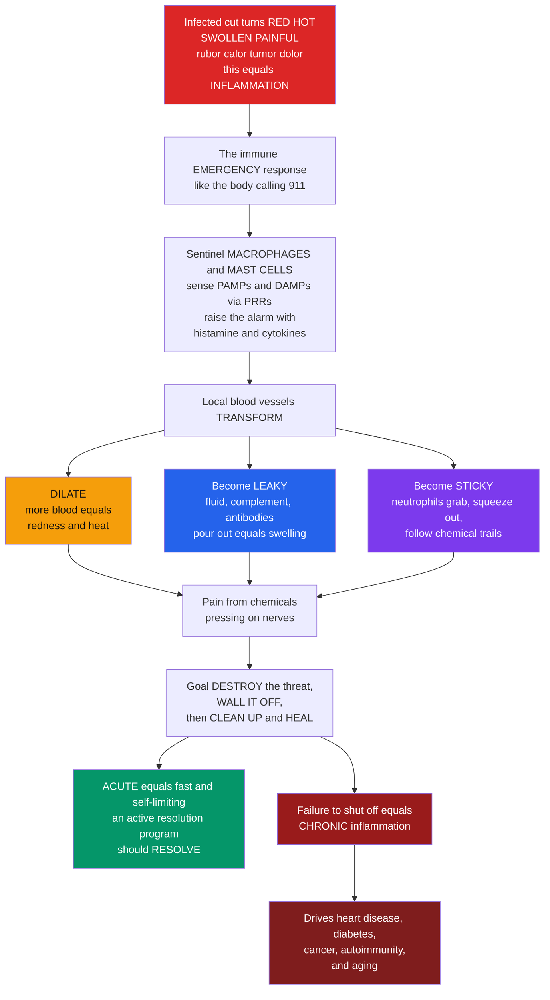

# 🔥 Inflammation and the Inflammatory Response

> [!abstract] TL;DR
> **Inflammation** is the coordinated response of vascularized tissue to infection or injury — the immune system's **core protective reaction**. Tissue **sentinels** (macrophages, mast cells, dendritic cells) detect danger through **pattern-recognition receptors** sensing microbial **PAMPs** or damage-released **DAMPs**, and raise a chemical alarm — **histamine, cytokines (TNF, IL-1, IL-6), chemokines, prostaglandins, and complement fragments C3a/C5a**. These mediators transform local blood vessels three ways: they **dilate** (more blood → redness and heat), become **leaky** (plasma, complement, and antibody pour into tissue → swelling), and turn **sticky** (endothelium grabs circulating leukocytes so they roll, adhere, and squeeze out to the site). The result is the four classical signs the Romans named — **rubor, calor, tumor, dolor** (plus *functio laesa*, loss of function) — as **neutrophils** arrive first and **monocytes/macrophages** follow. **Acute** inflammation is fast, self-limiting, and ends in an *active resolution program* that restores homeostasis. When it fails to shut off, **chronic** inflammation smolders — and low-grade chronic inflammation is now recognized as a driver of atherosclerosis, type-2 diabetes, cancer, autoimmunity, and aging itself ("inflammaging"). This note is the **immunology-mechanism view**; for the pathology and wound-healing view, see [[Inflammation_and_Tissue_Repair]].

---

## Intuition

**Analogy first — the body calling 911.** Get a splinter or an infected cut and the spot turns **red, hot, swollen, and painful**. Two thousand years ago the Romans catalogued exactly these four signs — *rubor* (redness), *calor* (heat), *tumor* (swelling), *dolor* (pain). It feels like the problem *is* the swelling and the throbbing. It isn't. Those signs **are the response** — the immune system mounting an emergency defense, like a city dispatching fire trucks, police, and ambulances to a disaster site.

Here is the emergency in slow motion. Local **sentinel cells** — macrophages and mast cells posted in the tissue like neighbourhood watch — are first to notice the trouble, and they raise the alarm by releasing chemical signals (**histamine, cytokines**). Those signals reprogram the nearby blood vessels in three ways. The vessels **dilate** — they widen to bring more blood, which is what makes the skin red and warm (like opening extra roads to the disaster). They turn **leaky** — their walls loosen so fluid and defensive proteins (**complement**, **antibodies**, clotting factors) flood out into the tissue, which is what makes it swell (like pouring supplies and reinforcements onto the scene). And their inner walls become **sticky** — so that white blood cells rushing past in the bloodstream (especially **neutrophils**) can grab hold, squeeze out through the vessel wall, and follow chemical scent-trails straight to the exact site of trouble (like ambulances converging on the address). The **pain** comes from those same chemicals and the swelling pressing on nerve endings — usefully, because it makes you guard the injured part.

The whole operation has one job: **destroy** the threat, **wall it off**, then **clean up and heal**. Acute inflammation is fast and self-limiting — it is *supposed* to switch off once the danger is gone. But when it fails to shut down, **chronic** inflammation results: a smouldering, misdirected version of the same machinery that we now understand quietly drives a staggering range of diseases — heart disease, diabetes, cancer, autoimmune disease, even aging itself. Understanding inflammation is understanding the immune system's core protective response — and one of the most important ideas in all of medicine.

---

## How It Works

### Core Mechanics

Acute inflammation unfolds as a tightly ordered, mediator-driven sequence:

1. **Sensing danger.** Tissue **sentinels** — resident **macrophages**, **mast cells**, and **dendritic cells** — carry germline-encoded **pattern-recognition receptors (PRRs)** such as Toll-like receptors. These detect **PAMPs** (pathogen-associated molecular patterns — conserved microbial features like bacterial LPS or viral dsRNA) and **DAMPs** (damage-associated molecular patterns — molecules like ATP, HMGB1, or uric acid spilled by dying cells). Recognition trips the alarm.
2. **Releasing mediators.** Sentinels immediately release **preformed** mediators (mast-cell **histamine**) and rapidly synthesise more — **cytokines** (TNF, IL-1, IL-6), **chemokines** (chemotactic signals like IL-8/CXCL8), and **lipid mediators** (**prostaglandins** and **leukotrienes** made from arachidonic acid). Plasma-derived cascades add **complement** anaphylatoxins **C3a/C5a** and **bradykinin**.
3. **Vasodilation.** A brief vasoconstriction is followed by **vasodilation** of arterioles — blood flow surges → *rubor* (redness) and *calor* (heat).
4. **Increased permeability.** Endothelial cells contract, opening interendothelial gaps → protein-rich **exudate** leaks into tissue, delivering **complement, antibody, and clotting factors** to the site → *tumor* (swelling/edema). Slowed, concentrated blood (**stasis**) positions leukocytes against the vessel wall.
5. **Leukocyte recruitment — the adhesion cascade.** **Margination → selectin-mediated ROLLING → chemokine activation → integrin-mediated firm ADHESION → transmigration (diapedesis) → chemotaxis** up the chemical gradient to the exact focus. **Neutrophils** dominate the first ~24 h (short-lived, form **pus**); **monocytes/macrophages** take over by 24–48 h.
6. **Effector action.** Recruited **phagocytes** engulf and destroy microbes and debris (aided by **opsonins** C3b and antibody), using reactive oxygen species and enzymes. *Dolor* (pain) from mediators and pressure, plus splinting of the part, produces *functio laesa* (loss of function).
7. **Resolution — the off-switch.** Once the stimulus is cleared, mediators decay and a lipid **class-switch** to **specialized pro-resolving mediators** (lipoxins, resolvins, protectins, maresins) actively **stops neutrophil influx**, drives macrophage **efferocytosis** (clearing spent neutrophils), and returns the tissue to homeostasis. Resolution is *programmed*, not passive.

**When step 7 fails** — because the stimulus is never removed, the response is autoimmune, or the resolution program is defective — acute inflammation tips into **chronic** inflammation: dominated by macrophages, lymphocytes, and plasma cells, with simultaneous tissue destruction and repair, granulomas, and fibrosis.

### Flow / Architecture



---

## Key Concepts

### Secondary (the big picture)

- **What inflammation is.** The body's built-in emergency response to injury or germs. Its job: isolate the threat, destroy it, and start healing.
- **The cardinal signs.** *Redness (rubor), heat (calor), swelling (tumor), pain (dolor)*, and *loss of function (functio laesa)*. Redness and heat come from **more blood** arriving; swelling from **fluid leaking** into tissue; pain from **chemicals** hitting nerves.
- **The three vessel changes.** Blood vessels **widen** (more blood), get **leaky** (fluid and defenders flood out), and turn **sticky** (white cells grab on and exit). Everything visible flows from these three.
- **Acute vs chronic.** **Acute** is fast, short (hours to days), and good — it clears the problem and quits. **Chronic** is slow, lasting (months to years), and often harmful — the response never stops and starts damaging the body.

### Undergraduate (the mechanisms)

- **Triggers and sensors.** **PAMPs** (microbial patterns) and **DAMPs** (danger signals from dead cells) are detected by **PRRs** on **tissue sentinels** — macrophages, mast cells, dendritic cells — which then release the alarm mediators.
- **The mediators, grouped.**
  - **Vasoactive amines:** **histamine** (mast cells/basophils — early vasodilation and permeability), serotonin.
  - **Cytokines:** **TNF, IL-1, IL-6** — activate endothelium, drive fever and the systemic acute-phase response.
  - **Chemokines:** e.g. IL-8/CXCL8 — set up the **chemotactic gradients** that guide leukocytes.
  - **Lipid mediators:** **prostaglandins** and **leukotrienes** from **arachidonic acid** (the **COX** pathway is the target of **NSAIDs**); platelet-activating factor.
  - **Complement:** anaphylatoxins **C3a/C5a** (vasoactive + chemotactic), C3b (opsonin).
  - **Kinins:** **bradykinin** (pain, permeability); plus **nitric oxide** (vasodilation).
  - **Pro-resolving mediators:** **lipoxins, resolvins, protectins, maresins** — actively terminate the response.
- **Vascular events.** Transient vasoconstriction → sustained **vasodilation** (↑ flow) → ↑ **permeability** (endothelial contraction → **exudate**, protein-rich, unlike a low-protein transudate) → **stasis** positions leukocytes for exit.
- **Cellular events — the leukocyte adhesion cascade.** *Margination → rolling (**selectins**) → activation (**chemokines**) → firm adhesion (**integrins** binding ICAM/VCAM) → transmigration/diapedesis → chemotaxis → phagocytosis.* **Neutrophils** first, **monocytes/macrophages** second.
- **The exudate and pus.** Exudate is purposeful delivery of plasma proteins and cells; **pus** is largely spent neutrophils — evidence of an active fight.
- **Systemic effects — the acute-phase response.** **Fever** (IL-1, IL-6, TNF, and prostaglandin E2 raise the hypothalamic set-point), **acute-phase proteins** (**C-reactive protein (CRP)**, fibrinogen, complement — released by the liver; CRP is a routine clinical marker), **leukocytosis**, and **sickness behavior** (fatigue, anorexia).

### Graduate (the integration and its subtleties)

- **Resolution is an active program, not decay.** Termination depends on a **lipid-mediator class switch** from pro-inflammatory prostaglandins/leukotrienes to **specialized pro-resolving mediators (SPMs)**. SPMs stop further neutrophil recruitment and promote **efferocytosis**. **Failed resolution** — not merely persistent stimulus — is now viewed as a primary cause of chronicity (Serhan, Nathan).
- **Inflammation as a physiological, homeostatic response.** Medzhitov reframes inflammation beyond infection/injury as a general adaptive response to **deviations from homeostasis** (e.g. metabolic stress → "**metaflammation**" in obesity), with a spectrum from classic acute inflammation to low-grade "para-inflammation." This unifies why metabolic and age-related diseases carry an inflammatory signature.
- **Chronic inflammation — cellular signature.** Dominated by **macrophages** (M1 pro-inflammatory vs M2 pro-repair polarization), **lymphocytes**, and **plasma cells**, with simultaneous destruction and repair. Distinctive patterns include **granulomas** (walled-off epithelioid macrophages, e.g. tuberculosis) and progressive **fibrosis** (TGF-β → myofibroblasts).
- **Systemic overwhelm — sepsis and cytokine storm.** When PRR sensing of PAMPs becomes systemic and dysregulated, a TNF/IL-1/IL-6 **cytokine storm** drives body-wide vasodilation, capillary leak, and organ failure — the same protective machinery turned catastrophic (severe sepsis, severe COVID-19).
- **Chronic inflammation and modern disease.** Low-grade chronic inflammation is causally implicated in **atherosclerosis** (an inflammatory response to arterial-wall lipid — validated by the CANTOS trial, where anti-IL-1β reduced cardiovascular events), **type-2 diabetes/metabolic syndrome**, **cancer** (tumor-promoting inflammation — an enabling hallmark), **neurodegeneration**, **autoimmune disease**, and **"inflammaging"** — the sterile, age-associated rise in inflammatory tone (see [[Hallmarks_of_Aging]]).
- **Therapeutic landscape.** **NSAIDs** (COX inhibition → ↓ prostaglandins), **corticosteroids** (broad mediator suppression), and targeted **biologics** — anti-TNF, anti-IL-1, anti-IL-6 — plus emerging **pro-resolution** (SPM-based) agents that aim to *promote resolution* rather than only *block initiation*.

---

## Python Demo

```python
# Inflammation and the inflammatory response, quantified two ways:
#   (a) ACUTE TIMECOURSE + RESOLUTION: two-wave leukocyte influx (neutrophils then
#       macrophages) and a mediator curve that PEAKS then RESOLVES -- contrasted with
#       a non-resolving (chronic) trajectory that fails to shut off.
#   (b) LEUKOCYTE ADHESION CASCADE + MEDIATOR BALANCE: rolling -> firm adhesion ->
#       transmigration as a function of endothelial activation, and a pro- vs
#       pro-resolving mediator balance whose threshold decides resolve vs chronic.
import numpy as np
import matplotlib.pyplot as plt

# ---------------- (a) Acute timecourse: two-wave influx + resolution ----------------
t = np.linspace(0, 120, 1200)           # hours (~5 days)

def wave(t, t_peak, width, amp):
    """A rise-and-fall cell-influx wave peaking at t_peak (log-normal-like)."""
    return amp * np.exp(-0.5 * ((np.log((t + 1e-6) / t_peak)) / width) ** 2)

neutrophils = wave(t, t_peak=18,  width=0.55, amp=1.0)   # first wave, peaks ~ day 1
macrophages = wave(t, t_peak=54,  width=0.60, amp=0.7)   # second wave, peaks ~ day 2-3

# Pro-inflammatory mediators: sharp rise, then ACTIVE resolution back to baseline
tau_rise, tau_res = 6.0, 26.0
mediator_acute = np.exp(-t / tau_res) - np.exp(-t / tau_rise)
mediator_acute /= mediator_acute.max()

# CHRONIC: same onset but resolution FAILS -> mediators plateau, never return home
onset = 1 - np.exp(-t / tau_rise)
mediator_chronic = 0.65 * onset + 0.05 * np.sin(2 * np.pi * t / 24) * onset

# ---------------- (b1) Leukocyte adhesion cascade vs endothelial activation ---------
signal = np.linspace(0, 1, 400)         # endothelial adhesion-molecule / chemokine signal

def hill(x, k, n):
    return x**n / (x**n + k**n)

rolling        = 1 - hill(signal, k=0.25, n=4)   # loose selectin capture -> decreases as firm adhesion takes over
firm_adhesion  = hill(signal, k=0.45, n=6)       # integrin-mediated firm arrest
transmigration = hill(signal, k=0.65, n=8)       # diapedesis, needs the strongest signal

# ---------------- (b2) Pro- vs pro-resolving mediator balance (threshold) ------------
pro     = np.linspace(0, 1, 400)
resolve_low, resolve_high = 0.25, 0.75           # weak vs strong resolution capacity
net_low  = pro - resolve_low * pro**0.5          # net inflammation, weak resolution
net_high = pro - resolve_high * pro**0.5         # net inflammation, strong resolution

# ---------------- Plot ----------------
fig, ax = plt.subplots(2, 2, figsize=(12, 8))

ax[0, 0].plot(t / 24, neutrophils, color="#dc2626", lw=2.2, label="Neutrophils (1st wave)")
ax[0, 0].plot(t / 24, macrophages, color="#7c3aed", lw=2.2, label="Macrophages (2nd wave)")
ax[0, 0].fill_between(t / 24, neutrophils, alpha=0.12, color="#dc2626")
ax[0, 0].fill_between(t / 24, macrophages, alpha=0.12, color="#7c3aed")
ax[0, 0].set(title="(a) Acute influx: neutrophils then macrophages",
             xlabel="days after insult", ylabel="cell influx (arb.)")
ax[0, 0].legend(); ax[0, 0].grid(alpha=0.3)

ax[0, 1].plot(t / 24, mediator_acute, color="#059669", lw=2.2,
              label="Acute: peaks then RESOLVES")
ax[0, 1].plot(t / 24, mediator_chronic, color="#991b1b", lw=2.2,
              label="Chronic: fails to shut off")
ax[0, 1].axhline(0.1, ls=":", color="gray", label="homeostasis")
ax[0, 1].set(title="(b) Mediator level: resolution vs chronicity",
             xlabel="days after insult", ylabel="mediator level (arb.)")
ax[0, 1].legend(); ax[0, 1].grid(alpha=0.3)

ax[1, 0].plot(signal, rolling,        color="#2563eb", lw=2.2, label="Rolling (selectins)")
ax[1, 0].plot(signal, firm_adhesion,  color="#d97706", lw=2.2, label="Firm adhesion (integrins)")
ax[1, 0].plot(signal, transmigration, color="#059669", lw=2.2, label="Transmigration (diapedesis)")
ax[1, 0].set(title="(c) Leukocyte adhesion cascade",
             xlabel="endothelial activation signal", ylabel="fraction of leukocytes")
ax[1, 0].legend(fontsize=8); ax[1, 0].grid(alpha=0.3)

ax[1, 1].plot(pro, net_low,  color="#991b1b", lw=2.2, label="Weak resolution -> chronic")
ax[1, 1].plot(pro, net_high, color="#059669", lw=2.2, label="Strong resolution -> resolves")
ax[1, 1].axhline(0, ls=":", color="gray")
ax[1, 1].fill_between(pro, net_high, 0, where=(net_high < 0), color="#059669", alpha=0.12)
ax[1, 1].set(title="(d) Pro vs pro-resolving mediator balance",
             xlabel="pro-inflammatory drive", ylabel="net inflammation")
ax[1, 1].legend(fontsize=8); ax[1, 1].grid(alpha=0.3)

fig.suptitle("Inflammation: acute resolution vs chronicity, recruitment, and mediator balance",
             fontsize=13)
fig.tight_layout()
plt.show()

# ---- Quantify the resolve-vs-chronic contrast ----
dt = t[1] - t[0]
burden_acute   = np.trapz(mediator_acute,   dx=dt)
burden_chronic = np.trapz(mediator_chronic, dx=dt)
print(f"Neutrophil peak at ~day {t[np.argmax(neutrophils)]/24:.1f};"
      f" macrophage peak at ~day {t[np.argmax(macrophages)]/24:.1f}")
print(f"Integrated mediator burden  acute:   {burden_acute:7.1f}  (bounded -> resolves)")
print(f"Integrated mediator burden  chronic: {burden_chronic:7.1f}  (keeps accumulating)")
print(f"Chronic:acute burden ratio ~ {burden_chronic/burden_acute:.1f}x")
```

**What the plots show.** Panel (a) captures the ordered **two-wave recruitment** — short-lived **neutrophils** peaking around day 1, **macrophages** arriving as the second wave by day 2–3. Panel (b) is the crux of the topic: the acute mediator curve rises sharply and then **actively resolves** back toward homeostasis, while the chronic curve fails to shut off and plateaus — and the printed *integrated mediator burden* shows the chronic response accumulating far more total inflammatory exposure. Panel (c) is the **leukocyte adhesion cascade** as endothelial activation rises: loose **rolling** hands off to integrin-mediated **firm adhesion** and then **transmigration**, each engaging at a higher signal threshold. Panel (d) is the **mediator balance** — when pro-resolving capacity is strong the net inflammation dips below zero (resolves); when it is weak, net inflammation stays positive (chronic). Same initiating insult, opposite fate, decided by the off-switch.

---

## Real-World Applications

> **Example — CRP and the acute-phase response as a clinical readout.** **C-reactive protein** is an acute-phase protein the liver secretes in response to **IL-6**. Clinicians read CRP as a direct, everyday proxy for where a patient sits on the resolve-vs-persist curve modeled above: a post-operative CRP that rises then falls tracks normal acute resolution, while a *failure to fall* (or a second rise) flags a smouldering complication such as an abscess. **High-sensitivity CRP** stratifies cardiovascular risk precisely because atherosclerosis is chronic vascular inflammation.

- **Anti-inflammatory therapeutics across the mediator map.** **NSAIDs** (aspirin, ibuprofen) block **COX** to cut prostaglandin-driven pain, fever, and swelling; **corticosteroids** broadly suppress mediators; **antihistamines** blunt mast-cell histamine in allergy. **Biologics** target single cytokines — anti-**TNF** (infliximab, adalimumab), anti-**IL-6** (tocilizumab), anti-**IL-1** (anakinra, canakinumab) — transforming rheumatoid arthritis, inflammatory bowel disease, and autoinflammatory syndromes.
- **Anti-inflammation as cardiology.** The **CANTOS** trial showed that neutralizing **IL-1β** (canakinumab) reduced recurrent cardiovascular events *independent of cholesterol*, clinically proving atherosclerosis is an inflammatory disease and opening "anti-inflammatory cardiology."
- **Sepsis and cytokine storm.** A systemic, dysregulated TNF/IL-1/IL-6 cascade causes vasodilation, capillary leak, and multi-organ failure — acute inflammation turned catastrophic; the same physiology drove severe COVID-19 cytokine storms treated with **dexamethasone** and **IL-6 blockade**.
- **Resolution pharmacology.** Because resolution is an active program, **specialized pro-resolving mediators** (resolvins, lipoxins) are being developed as a new drug class that *promotes* resolution and tissue return-to-homeostasis rather than only *blocking* initiation — a paradigm shift from anti-inflammation to pro-resolution.
- **Inflammaging and healthy-longevity research.** Chronic low-grade inflammation is a shared axis of age-related disease, motivating trials of anti-inflammatory and senolytic strategies to compress morbidity (see [[Cellular_Senescence_and_Senolytics]]).

---

## Common Pitfalls

- **"Inflammation is the disease."** The redness, heat, swelling, and pain are the *response*, not the pathogen. Reading the cardinal signs as the enemy misses that they are the machinery delivering the cure — the body's 911 call, not the emergency itself.
- **"Inflammation is always bad and should be suppressed."** **Acute** inflammation is essential — it clears infection and starts healing. Blanket suppression raises infection risk and impairs repair. Only *chronic* or *misdirected* inflammation is the enemy.
- **"Resolution just happens when the stimulus is gone."** Resolution is an **active, programmed** switch (pro-resolving lipid mediators, efferocytosis). **Failed resolution** is itself a cause of chronicity — a stimulus can even be cleared while inflammation persists.
- **"Chronic inflammation is just a longer version of acute."** It is qualitatively different — different cells (macrophages/lymphocytes/plasma cells vs neutrophils), simultaneous destruction *and* repair, granulomas, and fibrosis rather than clean resolution.
- **"Pus and swelling mean treatment failed."** Pus is largely spent neutrophils — evidence of an active fight; exudate is purposeful delivery of complement, antibody, and clotting factors.
- **Confusing exudate with transudate.** Inflammatory **exudate** is protein-rich (from increased *permeability*); a **transudate** is protein-poor (from hydrostatic/osmotic imbalance, e.g. heart failure) and is *not* inflammatory. The distinction is diagnostic.
- **Forgetting the vascular basis.** Students recite the four signs but cannot map them to the **three vessel changes** (dilate → red/hot; leak → swollen; sticky → cell delivery). If you cannot make that map, you do not yet own the topic.

---

## Related Concepts

- [[Inflammation_and_Tissue_Repair]] — the **Clinical Medicine / pathology** companion to this note: same phenomenon, but focused on wound healing, regeneration vs scarring, and fibrosis. This note is the **immunology-mechanism** view (sensors, mediators, the adhesion cascade, resolution); link across for the tissue-repair endpoint.
- [[Cellular_Injury_and_Adaptation]] — the reversible/irreversible cell damage that releases **DAMPs** and *triggers* inflammation in the first place.
- [[The_Innate_Immune_System]] — the Biology deep dive on barriers, complement, phagocytes, and pattern recognition — the arm of immunity that *executes* inflammation.
- [[Innate_versus_Adaptive_Immunity]] — situates inflammation as the fast, generic innate response, and shows how it *instructs* the slower adaptive arm.
- [[Cells_of_the_Immune_System]] — the sentinels (macrophages, mast cells, dendritic cells) and effectors (neutrophils, monocytes) named throughout this note.
- [[Hallmarks_of_Aging]] — chronic sterile inflammation ("**inflammaging**") is one of the interconnected hallmarks driving age-related disease.
- [[Cellular_Senescence_and_Senolytics]] — senescent cells secrete the inflammatory **SASP** that fuels chronic low-grade inflammation.

**Sibling notes in this Immunology section** (build out these deep dives next; referenced in prose above): *Innate Immune Recognition and Pattern Receptors* (the PRRs/PAMPs/DAMPs that *sense* danger), *The Complement System* (the C3a/C5a anaphylatoxins and C3b opsonin), *Phagocytes and Phagocytosis* (the neutrophils and macrophages that *arrive and destroy*), *Cytokines and Immune Signaling* (TNF, IL-1, IL-6 and the chemokine gradients), and *Autoimmunity and Loss of Tolerance* (a major driver of *chronic* inflammation).

---

## Review Questions

1. **(Secondary)** Name the four classical (Roman) cardinal signs of inflammation and, for each, state which of the **three vessel changes** — dilation, leakiness, or stickiness — most directly produces it. Why is inflammation usually *helpful* even though it feels bad?
2. **(Undergraduate)** Trace the **leukocyte adhesion cascade** from margination to chemotaxis, naming the molecule family responsible at the *rolling* and *firm-adhesion* steps. Then explain why **neutrophils** arrive before **macrophages**, and what each contributes.
3. **(Undergraduate scenario)** A patient's post-surgical CRP rises for two days and then falls, while a second patient's CRP rises and then keeps climbing. Using the acute-phase response and the resolve-vs-persist dynamics, interpret each trajectory clinically.
4. **(Graduate)** Explain why **resolution** is described as an *active program* rather than passive decay, naming the mediator class involved and the process by which spent neutrophils are cleared. How does "**failed resolution**" reframe the origin of chronic inflammation?
5. **(Graduate trade-off)** The CANTOS trial reduced cardiovascular events by blocking **IL-1β** but increased fatal infections. Using inflammation's dual role, explain this trade-off and contrast a **pro-resolution** strategy (e.g. resolvins) with classic **anti-inflammatory** blockade as a way to manage it.

---

## Sources

- Murphy, K. & Weaver, C. *Janeway's Immunobiology*, 9th/10th ed. Garland Science / W. W. Norton. (Innate immunity and the induced inflammatory response.)
- Medzhitov, R. (2008). "Origin and physiological roles of inflammation." *Nature*, 454, 428–435. https://doi.org/10.1038/nature07201
- Nathan, C. (2002). "Points of control in inflammation." *Nature*, 420, 846–852. https://doi.org/10.1038/nature01320
- Serhan, C. N. (2014). "Pro-resolving lipid mediators are leads for resolution physiology." *Nature*, 510, 92–101. https://doi.org/10.1038/nature13479
- Ridker, P. M. et al. (2017). "Antiinflammatory Therapy with Canakinumab for Atherosclerotic Disease" (CANTOS). *New England Journal of Medicine*, 377, 1119–1131. https://doi.org/10.1056/NEJMoa1707914

---

#immunology #inflammation #acute-phase-response #leukocyte-recruitment #chronic-inflammation
