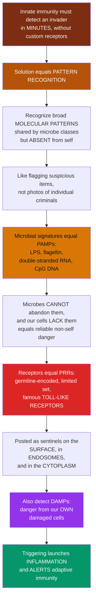

# 🚨 Innate Immune Recognition and Pattern Receptors

> [!abstract] TL;DR
> The innate immune system faces its hardest problem the moment a barrier is breached: it must detect *"there is an invader here"* within **minutes**, yet it has none of the adaptive system's custom-built, one-pathogen-one-receptor machinery. The Nobel-winning solution is **pattern recognition**. Instead of recognizing individual microbes, innate immunity recognizes broad **molecular patterns** shared by whole *classes* of pathogens but absent from our own cells — bacterial **LPS**, **flagellin**, viral **double-stranded RNA**, unmethylated **CpG DNA**. These universal microbial signatures are **PAMPs** (pathogen-associated molecular patterns), and they are ideal targets precisely because microbes *cannot abandon* them and host cells *do not have* them — so detecting one reliably means "non-self danger." The sensors are **PRRs** (pattern-recognition receptors) — a small, **germline-encoded** set, most famously the **Toll-like receptors (TLRs)** — stationed as sentinels on cell surfaces, inside endosomes, and in the cytosol to catch invaders in every compartment. The same receptors also sense **DAMPs** — danger signals leaking from our own damaged cells — so the system responds to sterile tissue injury as well as infection. When a PRR fires, it triggers alarm signaling (**NF-κB**, IRFs) that launches **inflammation** and **licenses the adaptive response**. This sensor layer is the foundation of all downstream immunity.

---

## Intuition

**Analogy first — airport security with no photos of the criminals.**

Imagine you run security at a huge airport, and your job is to stop dangerous people from getting through. You have a problem: you have *no photographs* of any specific criminal, and new ones you have never seen appear every day. You cannot possibly build a custom detector for each individual. So what do you do?

You do exactly what the innate immune system does: **you stop looking for individuals and start looking for suspicious *patterns*.** You do not need a photo of a bomber if you flag *anyone carrying a bundle of wires, a timer, and a canister* — because those items scream "threat" and ordinary passengers simply do not carry them. You have traded pinpoint identification for fast, reliable, class-level detection.

The immune system's "suspicious items" are called **PAMPs** — molecular signatures carried by entire *classes* of microbes but never by our own cells: the **LPS** coating gram-negative bacteria, the **flagellin** of their whip-like tails, the **double-stranded RNA** that only viruses make, the unmethylated **CpG DNA** typical of bacteria. The crucial trick is that these are things microbes **cannot throw away** — they are essential to *being* a bacterium or a virus — and things our cells simply **lack**. So flagging them means "non-self danger" with very few false alarms. The detectors are **PRRs**, above all the **Toll-like receptors**, and they are posted like guards at every checkpoint: the cell surface, the internal cargo-sorting endosomes, and the cytoplasm. The same guards also react to **DAMPs** — alarm signals spilling out of *our own* broken cells (DNA, ATP where it should not be) — so the system responds to a car crash inside the tissue, not just to intruders. And the moment a guard raises the alarm, it does two things: it starts a **fire response (inflammation)** and it **phones the specialists** — the adaptive immune system — telling them a real threat is confirmed. Understanding pattern recognition is understanding how the immune system's first responders know an enemy the instant they *smell* one.

---

## How It Works

### Core Mechanics

1. **The recognition problem.** A pathogen breaches a barrier. Innate cells — macrophages, dendritic cells, neutrophils, epithelial cells — must respond in **minutes**, but their receptors are **germline-encoded** and few in number, with no somatic diversification. They cannot know *which* microbe it is. (Charles Janeway framed this in 1989 as the "pattern recognition" hypothesis.)
2. **The solution — recognize conserved patterns.** Instead of species, innate immunity targets **PAMPs**: molecular structures that are **invariant, essential, and broadly shared** across microbial classes yet **absent from the host**. Because they are essential, microbes cannot mutate them away without dying — an evolutionarily "un-escapable" target.
3. **Cataloguing the PAMPs.** Bacterial **LPS/endotoxin** (gram-negative walls), **peptidoglycan** and **lipoteichoic acid** (gram-positive walls), **flagellin** (motility), unmethylated **CpG DNA**; viral **double- and single-stranded RNA** and viral DNA; fungal **β-glucans and mannans**.
4. **Sensing danger from self — DAMPs.** Damaged, necrotic, or stressed host cells leak **DAMPs / alarmins**: **HMGB1**, **ATP**, **uric acid** crystals, **mitochondrial DNA**. These signal **sterile** tissue damage, extending Polly Matzinger's **"danger model"** — the immune system reacts to *danger*, not merely to *foreignness*.
5. **The receptors — PRR families by location.** A small, non-clonal, broadly-covering set, positioned to catch pathogens in every compartment:
   - **TLRs (Toll-like receptors)** — surface TLRs (**TLR4**/LPS, **TLR5**/flagellin) sense extracellular microbes; endosomal TLRs (**TLR3**/dsRNA, **TLR7/8**/ssRNA, **TLR9**/CpG DNA) sense internalized nucleic acids.
   - **NLRs (NOD-like receptors)** — cytosolic; some assemble the **inflammasome** → caspase-1 → **IL-1β / IL-18** and **pyroptosis**.
   - **RLRs (RIG-I-like receptors)** — cytosolic sensors of viral RNA.
   - **CLRs (C-type lectin receptors)** — e.g. Dectin-1, sensing fungal carbohydrates.
   - **cGAS–STING** — the cytosolic double-stranded DNA sensor.
   - **Soluble/secreted PRRs** — mannose-binding lectin, C-reactive protein, and the **complement** system.
6. **Signaling and outcomes.** PRR engagement recruits adaptors (**MyD88 / TRIF**) that activate **NF-κB**, **IRFs**, and **MAPKs**, driving transcription of inflammatory **cytokines/chemokines** (TNF, IL-1, IL-6), antiviral **type I interferons**, and antimicrobial effectors — often with a **switch-like threshold** so a whisper of signal is ignored but a genuine breach flips the response ON.
7. **The consequences.** The alarm launches **inflammation** and recruits effector cells, and — critically — provides the **costimulation (signal 2)** and **cytokines (signal 3)** by which dendritic cells **license the adaptive immune system**. The innate sensor layer *instructs* adaptive immunity that a real, characterized threat exists.

### Flow / Architecture



---

## Key Concepts

### Secondary (the big picture)

- **The core idea.** Innate immunity does not memorize individual germs; it recognizes **patterns** that all germs of a kind share — like flagging anyone carrying obviously dangerous items rather than matching faces.
- **PAMPs = "microbe fingerprints."** Molecules found on whole classes of microbes but never on your own cells (bacterial LPS, viral double-stranded RNA). Detecting one means "this is not me, and it is dangerous."
- **PRRs = the detectors.** A small, fixed set of receptors you are *born with* (germline-encoded), the most famous being **Toll-like receptors**, stationed as guards on and inside your cells.
- **DAMPs = "your own alarm bells."** When your cells are injured, they spill molecules that should stay inside; PRRs sense these too, so the system also reacts to *damage*, not just infection.
- **What happens next.** A tripped detector starts **inflammation** and **calls in** the slower, specialized adaptive immune system.

### Undergraduate (the mechanisms)

- **Why PAMPs are the perfect target — the three criteria:** they are **invariant** (conserved across a class), **essential** (a microbe dies without them, so it cannot mutate them away to hide), and **non-self** (host cells lack them). This is what makes a *tiny* germline-encoded repertoire sufficient.
- **PAMP catalogue by pathogen type:**

| PAMP | Found on / in | Sensed mainly by |
|---|---|---|
| **LPS (endotoxin)** | Gram-negative bacteria | TLR4 (surface) |
| **Peptidoglycan, lipoteichoic acid** | Gram-positive bacteria | NOD1/2 (cytosol), TLR2 |
| **Flagellin** | Flagellated bacteria | TLR5, NLRC4 |
| **Unmethylated CpG DNA** | Bacteria, DNA viruses | TLR9 (endosome) |
| **Double-stranded RNA** | RNA viruses | TLR3 (endosome), RIG-I/MDA5 (cytosol) |
| **Single-stranded RNA** | RNA viruses | TLR7/8 (endosome) |
| **β-glucans, mannans** | Fungi | Dectin-1 (CLR) |
| **Cytosolic dsDNA** | DNA viruses, some bacteria | cGAS–STING |

- **DAMPs / alarmins:** **HMGB1**, **ATP**, **uric acid** crystals, **mitochondrial DNA** — endogenous molecules that signal **sterile** danger; the basis of Matzinger's **danger model**, which explains why tissue injury without any microbe can still ignite inflammation.
- **PRR families and their logic of location** — surface (extracellular microbes) → endosomal (internalized microbes / nucleic acids) → cytosolic (pathogens that invade the cell interior) → secreted (patrolling the blood/tissue fluid). **Location is a second layer of specificity:** host DNA in the nucleus is safe, but DNA in the cytosol or endosome is a red flag.
- **Signaling backbone:** most TLRs signal through **MyD88** (→ NF-κB → inflammatory cytokines); TLR3/TLR4 also use **TRIF** (→ IRF3 → **type I interferons**). NLR inflammasomes use **caspase-1** to mature **IL-1β/IL-18**.

### Graduate (the depth and subtleties)

- **Janeway's prediction, confirmed.** In 1989 Janeway argued that adaptive immunity must be *gated* by an ancient system recognizing conserved microbial patterns and providing costimulation. The discovery of the **Toll → TLR** axis (Hoffmann in *Drosophila*, **Beutler** showing TLR4 is the LPS receptor) confirmed it and earned the **2011 Nobel Prize**.
- **Self–nonself vs danger — a synthesis, not a rivalry.** PAMP sensing (non-self) and DAMP sensing (danger) are complementary inputs into the same PRR-driven decision. Sterile inflammation (gout via uric-acid inflammasome activation; ischemia-reperfusion via HMGB1/mtDNA) shows danger sensing operating with *no* microbe present.
- **Combinatorial and threshold decoding.** Which PRRs fire, in which compartment, and how strongly, is integrated into a **tailored** output — Th1-skewing interferons for viruses, IL-1/IL-17-promoting signals for fungi. Signaling is frequently **switch-like (Hill-type)** so subthreshold noise is ignored while a genuine breach flips gene programs ON, protecting against chronic low-grade autoinflammation.
- **The inflammasome as a two-signal device.** Signal 1 (a PRR/NF-κB priming step) induces pro-IL-1β; signal 2 (a DAMP/PAMP such as ATP, uric acid, or pore-forming toxins) triggers NLRP3 assembly and caspase-1 cleavage → mature IL-1β and **pyroptotic** cell death — a coincidence detector that guards against inappropriate release of a potent pyrogen.
- **The innate instructs the adaptive.** PRR-matured dendritic cells deliver antigen (signal 1) *plus* **costimulation (signal 2)** *plus* a PRR-shaped **cytokine milieu (signal 3)**. Without this innate license, antigen alone drives **anergy/tolerance** — the mechanistic reason **adjuvants** (many are TLR agonists) are indispensable to vaccines.
- **Failure modes as proof of importance.** Systemic TLR4/LPS signaling drives **sepsis**; gain-of-function inflammasome mutations cause **autoinflammatory** syndromes (e.g. CAPS); aberrant nucleic-acid sensing (cGAS–STING, TLR7) underlies **type-I-interferonopathies** and contributes to lupus.

---

## Python Demo

```python
# Innate pattern recognition, quantified two ways:
#   (a) PATTERN COVERAGE  -- a SMALL germline-encoded set of PRRs covers MANY microbe
#                            classes, because each PAMP is shared across whole classes.
#   (b) DANGER THRESHOLD  -- PRR signaling integrates PAMP + DAMP input and flips the
#                            inflammatory program ON only above a threshold (switch-like NF-kB).
import numpy as np
import matplotlib.pyplot as plt

# ---------------------------------------------------------------------------
# (a) PATTERN-COVERAGE MATRIX: PRRs (rows) x microbe classes (columns)
#     1.0 = strong detection of a conserved PAMP on that class, 0.5 = partial.
# ---------------------------------------------------------------------------
prrs = ["TLR4 / LPS", "TLR5 / flagellin", "TLR3 / dsRNA", "TLR7-8 / ssRNA",
        "TLR9 / CpG DNA", "NOD-NLR / PGN", "RIG-I / vRNA",
        "Dectin-1 / glucan", "cGAS-STING / dsDNA"]
classes = ["Gram-neg\nbacteria", "Gram-pos\nbacteria", "Flagellated\nbacteria",
           "RNA\nviruses", "DNA\nviruses", "Fungi"]

#            Gneg  Gpos  Flag  RNAv  DNAv  Fungi
M = np.array([
    [1.0,  0.0,  1.0,  0.0,  0.0,  0.0],   # TLR4  (LPS -> gram-neg, incl. flagellated)
    [1.0,  0.0,  1.0,  0.0,  0.0,  0.0],   # TLR5  (flagellin)
    [0.0,  0.0,  0.0,  1.0,  0.5,  0.0],   # TLR3  (dsRNA; some DNA-virus intermediates)
    [0.0,  0.0,  0.0,  1.0,  0.0,  0.0],   # TLR7-8 (ssRNA)
    [1.0,  1.0,  1.0,  0.0,  1.0,  0.0],   # TLR9  (bacterial + DNA-virus CpG DNA)
    [1.0,  1.0,  1.0,  0.0,  0.0,  0.0],   # NOD/NLR (peptidoglycan)
    [0.0,  0.0,  0.0,  1.0,  0.0,  0.0],   # RIG-I (viral RNA)
    [0.0,  0.0,  0.0,  0.0,  0.0,  1.0],   # Dectin-1 (beta-glucan)
    [0.5,  0.0,  0.0,  0.0,  1.0,  0.0],   # cGAS-STING (cytosolic dsDNA)
], dtype=float)

n_prr, n_class = M.shape
detectors_per_class = (M > 0).sum(axis=0)      # how many PRRs cover each microbe class
covered = (M.sum(axis=0) > 0).sum()            # microbe classes with >= 1 detector

# ---------------------------------------------------------------------------
# (b) DANGER-THRESHOLD MODEL: switch-like NF-kB activation vs combined signal.
#     Hill function; DAMP co-signal lowers the effective threshold (synergy).
# ---------------------------------------------------------------------------
def nfkb(signal, K, n=6):
    """Switch-like activation: sharp Hill response, half-max at threshold K."""
    s = np.clip(signal, 0, None)
    return s**n / (K**n + s**n)

sig = np.linspace(0, 10, 500)          # combined PAMP (+/- DAMP) signal strength
resp_pamp      = nfkb(sig, K=5.0)      # PAMP alone: high threshold
resp_pamp_damp = nfkb(sig, K=3.0)      # PAMP + DAMP: threshold lowered (danger synergy)

# ---------------------------------------------------------------------------
# Plot
# ---------------------------------------------------------------------------
fig, (axA, axB) = plt.subplots(1, 2, figsize=(14, 6),
                               gridspec_kw={"width_ratios": [1.25, 1]})

im = axA.imshow(M, cmap="YlOrRd", aspect="auto", vmin=0, vmax=1)
axA.set_xticks(range(n_class)); axA.set_xticklabels(classes, fontsize=9)
axA.set_yticks(range(n_prr));   axA.set_yticklabels(prrs, fontsize=9)
axA.set_title(f"(a) Pattern coverage: {n_prr} germline PRRs cover {covered}/{n_class} microbe classes")
for i in range(n_prr):
    for j in range(n_class):
        if M[i, j] > 0:
            axA.text(j, i, "PAMP", ha="center", va="center",
                     fontsize=6.5, color="#1e293b")
# annotate detectors-per-class along the top
for j, d in enumerate(detectors_per_class):
    axA.text(j, -0.75, f"{d} PRRs", ha="center", fontsize=8, color="#7f1d1d")
fig.colorbar(im, ax=axA, fraction=0.046, pad=0.04, label="detection strength")

axB.plot(sig, resp_pamp,      color="#d97706", lw=2.6, label="PAMP alone (threshold K=5)")
axB.plot(sig, resp_pamp_damp, color="#dc2626", lw=2.6, label="PAMP + DAMP (threshold K=3)")
axB.axhline(0.5, color="#334155", ls=":", lw=1)
axB.axvspan(0, 3, color="#22c55e", alpha=0.08)
axB.axvspan(5, 10, color="#ef4444", alpha=0.06)
axB.text(1.2, 0.9, "tolerated\n(noise below\nthreshold)", fontsize=9, color="#166534")
axB.text(7.4, 0.15, "ALARM\ninflammation ON", fontsize=9, color="#991b1b")
axB.annotate("DAMP co-signal\nlowers threshold\n(danger synergy)",
             xy=(3, 0.5), xytext=(4.6, 0.35),
             arrowprops=dict(arrowstyle="->", color="#7c3aed"), color="#7c3aed", fontsize=8.5)
axB.set_xlabel("Combined PAMP + DAMP signal strength")
axB.set_ylabel("NF-kB / inflammatory gene activation")
axB.set_title("(b) Switch-like danger threshold")
axB.set_ylim(-0.03, 1.05); axB.legend(loc="center right", fontsize=8.5); axB.grid(alpha=0.25)

plt.tight_layout()
plt.savefig("innate_pattern_recognition.png", dpi=120)
plt.show()

# ---- Quantify the strategy ----
print(f"PRRs (germline-encoded, fixed):     {n_prr}")
print(f"Microbe classes covered:            {covered}/{n_class}")
print(f"Avg PRRs guarding each class:        {detectors_per_class.mean():.1f}")
print(f"Redundancy (max PRRs on one class):  {detectors_per_class.max()}  "
      f"-> failsafe overlap")
half_pamp      = sig[np.argmin(np.abs(resp_pamp - 0.5))]
half_pamp_damp = sig[np.argmin(np.abs(resp_pamp_damp - 0.5))]
print(f"Half-max threshold  PAMP only:       {half_pamp:.1f}")
print(f"Half-max threshold  PAMP + DAMP:     {half_pamp_damp:.1f}  "
      f"(danger co-signal lowers the bar)")
```

Panel **(a)** captures the essence of the innate strategy: a mere handful of **germline-encoded PRRs** blankets every major microbe class, because each PAMP is *shared across a whole class* — a few dozen receptors doing the work that the adaptive system needs ~10⁷–10¹¹ specificities to accomplish. Note the **redundancy**: several classes are guarded by more than one PRR, a failsafe against pathogen evasion. Panel **(b)** captures **decision-making**: the response is **switch-like**, ignoring subthreshold noise (tolerance) but flipping the inflammatory program ON above a danger threshold — and a **DAMP co-signal lowers that threshold**, so simultaneous evidence of *microbe* and *damage* triggers a faster, more decisive alarm.

---

## Real-World Applications

> **Vaccine adjuvants are deliberate PRR triggers.** Many modern adjuvants are **TLR agonists**: **MPL** (a detoxified LPS/TLR4 agonist in the shingles and HPV vaccines), **CpG-1018** (a TLR9 agonist in a hepatitis-B vaccine), and imidazoquinolines (TLR7/8). They supply the innate "danger" license that a purified antigen lacks — engaging PRRs so dendritic cells mature and prime durable T- and B-cell memory. No PRR signal, no strong adaptive response.

> **Sepsis is pattern recognition gone systemic.** When gram-negative **LPS floods the bloodstream**, TLR4 signaling that is protective *locally* becomes a body-wide **cytokine storm** (TNF, IL-1, IL-6), driving vasodilation, coagulopathy, and multi-organ failure. The very sensitivity that makes innate sensing fast is also its most dangerous failure mode.

> **Autoinflammatory diseases target the inflammasome.** In **gout**, uric-acid crystals (a DAMP) activate the **NLRP3 inflammasome** → IL-1β → acute joint inflammation; in cryopyrin-associated periodic syndromes (CAPS), a mutation locks NLRP3 ON. This is why **IL-1 blockers** (anakinra, canakinumab) are transformative therapies — they neutralize the output of a misfiring PRR.

> **cGAS–STING as a drug target.** **STING agonists** are in trials to make "cold" tumors visible to the immune system by mimicking cytosolic-DNA danger sensing, while **STING/cGAS inhibitors** are pursued for interferon-driven autoimmunity — both exploiting the same nucleic-acid pattern-recognition axis.

---

## Common Pitfalls

- **Confusing "pattern" with "specific."** A PRR recognizes a *molecular class* (all LPS, all dsRNA), **not** a single pathogen. If you catch yourself saying "the TLR for *E. coli*," stop — it is the TLR for **LPS**, which *E. coli* and thousands of other gram-negatives share. That shared-ness is the whole point.
- **Thinking PRRs only detect microbes.** PRRs also fire on **DAMPs** from injured self cells — so sterile injury, ischemia, and crystals (gout) ignite inflammation with **no microbe present**. Forgetting DAMPs makes sterile inflammation look paradoxical.
- **Ignoring compartment logic.** DNA and RNA are not intrinsically dangerous — our own cells are full of them. It is **location** (nucleic acid in the *endosome* or *cytosol*, where microbial cargo ends up) plus features like unmethylated CpG that flag *non-self*. Miss this and you cannot explain how the system avoids attacking host nucleic acids.
- **Treating PRR signaling as a linear dial.** It is closer to a **switch with a threshold** (and, for the inflammasome, a **two-signal coincidence detector**). Subthreshold PAMP noise is deliberately tolerated; only a genuine breach flips the program ON. This is a feature that prevents chronic autoinflammation.
- **Divorcing innate sensing from adaptive immunity.** The output is not just inflammation — it is the **costimulation and cytokines that license dendritic cells** to prime T and B cells. A PRR event is the *upstream trigger* of the entire adaptive response; that is why adjuvants exist.
- **Saying "germline-encoded" means "few and weak."** Few in number, yes — but their conserved-pattern targeting gives **broad, redundant coverage**, and their signaling amplifies enormously. Fast and general is not the same as weak.

---

## Related Concepts

- [[The_Innate_Immune_System]] — the Biology/11 overview of barriers, phagocytes, NK cells, complement, and inflammation; this note is the **sensor layer** that decides *when* all of that machinery fires.
- [[The_Adaptive_Immune_System]] — the Biology/11 deep dive on B/T cells and MHC; PRR signaling supplies the **costimulation and cytokine license** (signals 2 and 3) that this arm requires to activate.
- [[Bacteria_and_Archaea]] — the source of key PAMPs: **LPS**, **peptidoglycan**, **lipoteichoic acid**, **flagellin**, and unmethylated **CpG DNA** that TLRs, NLRs, and cGAS–STING detect.
- [[Viruses]] — the source of nucleic-acid PAMPs: **double- and single-stranded RNA** and cytosolic DNA sensed by TLR3/7/8/9, RIG-I/MDA5, and cGAS–STING to trigger **type I interferons**.
- [[Inflammation_and_Tissue_Repair]] — the Clinical_Medicine view of the downstream consequence: PRR engagement launches the acute inflammatory response detailed there, and DAMP sensing links tissue injury directly to it.

**Sibling notes in this Immunology vault** (deep dives that surround this one): *Immunology Overview and the Immune System* (the map of the field), *Innate versus Adaptive Immunity* (the two-arm framework this sensor layer sits inside), *The Complement System* (the soluble PRR-like cascade of opsonins and lytic proteins), *Inflammation and the Inflammatory Response* (the effector program PRRs launch), and *Cytokines and Immune Signaling* (the TNF/IL-1/IL-6/interferon messengers that PRR signaling transcribes).

---

## Review Questions

1. **(Secondary)** Explain, using the airport-security analogy, why the innate immune system recognizes *patterns* (like LPS) rather than individual pathogens — and give one example of a PAMP and the microbe class it marks.
2. **(Undergraduate)** State the **three properties** that make a molecule a good PAMP target, and use them to explain why a bacterium cannot simply mutate away its LPS to escape TLR4 the way it might escape an antibody.
3. **(Undergraduate scenario)** A patient develops an acute, exquisitely painful gouty toe with **no infection**. Which PRR/effector complex is responsible, which DAMP triggers it, which cytokine drives the pain and swelling, and which drug class targets that cytokine?
4. **(Graduate)** Contrast surface, endosomal, and cytosolic PRRs. Why is *compartment* itself a form of specificity, and how does it let the system flag microbial nucleic acids without attacking the host's own abundant DNA and RNA?
5. **(Graduate trade-off)** PRR signaling is switch-like and, for the inflammasome, requires two signals. Explain the *benefit* of this threshold/coincidence design and the *disease* that results when it fails ON, naming one clinical example each for sepsis and for a genetic autoinflammatory syndrome.

---

## Sources

- Janeway, C. A. Jr. "Approaching the Asymptote? Evolution and Revolution in Immunology." *Cold Spring Harbor Symposia on Quantitative Biology* 54:1–13 (1989). https://doi.org/10.1101/SQB.1989.054.01.003
- Medzhitov, R. "Recognition of Microorganisms and Activation of the Immune Response." *Nature* 449:819–826 (2007). https://doi.org/10.1038/nature06246
- Takeuchi, O. & Akira, S. "Pattern Recognition Receptors and Inflammation." *Cell* 140(6):805–820 (2010). https://doi.org/10.1016/j.cell.2010.01.022
- Matzinger, P. "The Danger Model: A Renewed Sense of Self." *Science* 296(5566):301–305 (2002). https://doi.org/10.1126/science.1071059
- Murphy, K. & Weaver, C. *Janeway's Immunobiology*, 9th/10th ed. Garland Science / W. W. Norton. (Ch. 3: The induced responses of innate immunity.)

---

#immunology #pattern-recognition #toll-like-receptors #pamps #innate-immunity
