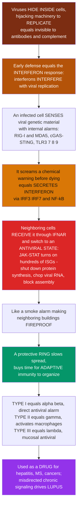

# 🛡️ Interferons and Antiviral Defense

> [!abstract] TL;DR
> Viruses are a special kind of enemy: they hide **inside** your own cells, hijacking the cellular machinery to copy themselves, which shields them from antibodies and complement that patrol the *outside*. The body's rapid, cell-intrinsic answer to this hidden threat is the **interferon (IFN) response** — and the name says it all: interferons **interfere** with viral replication. When a cell detects that it is infected — sensing viral genetic material with internal alarm receptors (**RIG-I/MDA5**, **cGAS–STING**, endosomal **TLR3/7/8/9**) — it does something almost altruistic: it **secretes interferon** as a chemical warning to its neighbors, often just before it dies. Neighboring cells that receive the IFN signal do not wait to be infected; they immediately switch into an **antiviral state**, activating hundreds of **interferon-stimulated genes (ISGs)** — **PKR** (halts protein synthesis), **OAS/RNase L** (chops viral RNA), **Mx GTPases** (block replication), **tetherin** (traps virions) — making themselves hostile territory the virus cannot easily replicate in. This creates a **protective ring** around the infection that slows viral spread and buys time for the slower **adaptive** response to organize. **Type I** IFN (α/β) is the direct antiviral alarm made by almost any infected cell; **Type II** IFN (γ) is the immune-directing signal made by NK and T cells; **Type III** IFN (λ) guards mucosal surfaces. Interferon is so powerful it is used as a **drug** — and, in a dark twist, chronic or misdirected IFN signaling drives **autoimmunity** such as lupus.

---

## Intuition

**Analogy first — the smoke alarm that makes the neighboring buildings fireproof.**

Most immune defenses work like a police force patrolling the *streets*: antibodies and complement float in the blood and tissue fluid, hunting invaders out in the open. But a virus is a burglar who never walks the streets — it breaks **into a house** (your cell), locks the door, and uses the home's own kitchen, tools, and electricity to manufacture thousands of copies of itself. Hidden inside, it is invisible to the street patrol. You need a *different* kind of defense: one that works from **inside** the buildings and warns the whole block.

That defense is **interferon**. Picture a building that catches fire (a cell that becomes infected). Before it burns down, it does two brilliant things. First, it triggers its **internal smoke detectors** — receptors that sniff out the tell-tale signature of the intruder, in this case *viral genetic material*, which no healthy house ever has lying around. Second, having confirmed the threat, it **screams a chemical warning to every neighboring building** — it secretes interferon — often as its final act before it is destroyed. This is almost altruistic: the burning building sacrifices itself to protect the block.

Here is the beautiful part. When the neighbors receive that warning, they do not simply call the fire department and wait. They **instantly turn themselves fireproof.** Each neighboring cell reads the interferon signal and flips on **hundreds of defensive genes** — the interferon-stimulated genes. It shuts down its own factories (protein synthesis) so the virus has nothing to hijack, it shreds any viral genetic material that gets in, and it bars the doors so newly made virions cannot escape. The virus arrives at the next house to find it already sealed, dark, and inhospitable. Multiply this across the whole neighborhood and you get a **protective ring** of resistant cells encircling the fire — the blaze is contained, the spread is slowed, and precious time is bought for the slower, specialist responders (the **adaptive** immune system: killer T cells and antibodies) to arrive and finish the job.

Interferon comes in flavors. **Type I** (α and β) is the direct "everyone go fireproof *now*" alarm that almost any infected cell can shout. **Type II** (γ) is more like a fire chief's radio call made by professional responders (NK and T cells) that tells the macrophage "clean-up crews" to switch to maximum aggression. Because this system is so potent, we bottle interferon as a **medicine** (for hepatitis, multiple sclerosis, some cancers) — and, tellingly, when the alarm gets stuck **ON** and keeps screaming with no real fire, the neighborhood tears itself apart: that chronic, misdirected interferon signaling is a driver of autoimmune disease like **lupus**. To understand interferons is to understand the cell-intrinsic, rapid-alarm heart of antiviral immunity.

---

## How It Works

### Core Mechanics

1. **The antiviral problem.** Viruses replicate **intracellularly**. Once inside, they are hidden from the extracellular arms of immunity — **antibodies** and **complement** cannot reach a genome being copied in the cytosol. Defense against viruses therefore must be **cell-intrinsic** (each cell defending itself) and **cell-mediated** (killer cells destroying infected cells), and it must fire *early*, before the antigen-specific adaptive response has had days to ramp up.
2. **Interferons — cytokines that interfere.** In 1957 **Isaacs and Lindenmann** discovered a secreted factor that made cells resistant to viral infection and named it *interferon* for its ability to **interfere** with viral replication. Interferons are a family of signaling proteins in **three types**:
   - **Type I IFN (IFN-α, many subtypes, and IFN-β):** the principal *direct antiviral* interferons, produced by virtually **any** infected nucleated cell — and in huge amounts by **plasmacytoid dendritic cells**. They act **autocrine** (on the secreting cell) and **paracrine** (on neighbors) through the shared **IFNAR** receptor.
   - **Type II IFN (IFN-γ):** produced by **NK cells and T cells**; primarily **immunomodulatory** rather than directly antiviral — it activates **macrophages** to the aggressive M1 state, boosts **antigen presentation / MHC**, and drives **Th1** responses. It signals through a distinct receptor (IFNGR).
   - **Type III IFN (IFN-λ):** antiviral like Type I but acting largely at **mucosal / epithelial** surfaces (gut, airway), where its receptor is concentrated.
3. **Induction — sensing the intruder.** An infected cell detects viral **nucleic acids** using **pattern-recognition receptors**: endosomal **TLR3** (dsRNA), **TLR7/8** (ssRNA), **TLR9** (CpG DNA); cytosolic **RIG-I / MDA5** (RLRs, viral RNA); and **cGAS–STING** (viral DNA). Engagement activates transcription factors **IRF3 / IRF7** (and **NF-κB**), which switch on transcription and **secretion of Type I IFN**.
4. **The antiviral state — the effector mechanism.** Secreted IFN binds the **IFNAR** receptor on neighboring (and infected) cells, triggering the **JAK–STAT** pathway (JAK1/TYK2 → STAT1/STAT2 → the **ISGF3** complex → **ISRE** promoter elements). This transcribes **hundreds of interferon-stimulated genes (ISGs)**, converting the cell into an **antiviral state**. Key ISG effectors:
   - **PKR** — phosphorylates **eIF2α**, halting cap-dependent **protein synthesis** so the virus has no factory.
   - **OAS / RNase L** — the OAS enzymes sense dsRNA and activate **RNase L**, which **degrades viral (and cellular) RNA**.
   - **Mx GTPases** — trap and block viral replication complexes.
   - **IFIT** proteins — sequester viral RNA lacking proper caps.
   - **Tetherin / BST2** — physically **tethers budding virions** to the cell so they cannot be released.
   - **ISG15, APOBEC3** — protein modification and lethal mutagenesis of viral genomes.
5. **More than a firewall.** The same IFN program **up-regulates MHC class I** (helping cytotoxic T cells recognize infected cells), **activates NK cells**, and **promotes apoptosis** of infected cells — pruning the infection while walling it off.
6. **Integration and tempo.** Type I IFN is the **first-line** antiviral response. It slows the virus (the "**IFN-versus-virus race**"), shapes which adaptive response develops, and hands off to killer T cells and antibodies. Whether the host wins often depends on whether IFN-induced protection spreads through the tissue **faster** than the virus replicates.
7. **The evolutionary arms race.** Because IFN is so effective, viruses have evolved **countermeasures** at every step: **influenza NS1** blocks RIG-I sensing and IFN induction; **hepatitis C** cleaves the RIG-I/STING adaptors; many viruses encode inhibitors of JAK–STAT signaling or of specific ISG effectors. Antiviral immunity is a perpetual measure-countermeasure spiral.

### Flow / Architecture



---

## Key Concepts

### Secondary (the big picture)

- **The special problem with viruses.** Viruses do their damage *hidden inside* your cells, where the blood-patrolling defenses cannot reach them. So the body needs an inside-out defense.
- **Interferon = the "warning shout."** An infected cell senses the virus and **shouts a chemical alarm** (interferon) to its neighbors, often just before it dies — sacrificing itself to protect the block.
- **The antiviral state = "going fireproof."** Neighbors that hear the alarm turn on **hundreds of defensive genes**, shutting down their own factories and shredding viral material so the virus cannot copy itself in them.
- **A protective ring.** Resistant neighbors form a **ring** around the infection that **slows the spread** and buys time for the slower, specialist immune response.
- **Two main flavors.** **Type I** (α/β) is the direct "go fireproof" alarm from any infected cell; **Type II** (γ) is a command signal from immune cells that fires up the macrophage clean-up crews.
- **A double-edged sword.** So powerful it is used as a **medicine** — but when the alarm gets stuck ON, it helps cause **autoimmune disease**.

### Undergraduate (the mechanisms)

- **Why extracellular defenses fail against viruses.** Antibodies and complement act on virions *between* cells; a replicating genome inside the cytosol is untouchable by them. Hence the need for **cell-intrinsic** (interferon/ISGs) and **cell-mediated** (CTL, NK) antiviral immunity.
- **Induction pathway (sensor → transcription → secretion):**

| Sensor | Location | Ligand | Output |
|---|---|---|---|
| **TLR3** | endosome | dsRNA | IRF3 → IFN-β |
| **TLR7/8** | endosome | ssRNA | IRF7 → IFN-α (pDCs) |
| **TLR9** | endosome | CpG DNA | IRF7 → IFN-α |
| **RIG-I / MDA5** | cytosol | viral RNA (5′-ppp, long dsRNA) | via MAVS → IRF3/7 |
| **cGAS–STING** | cytosol | viral dsDNA | via STING → IRF3 |

- **The antiviral-state pathway.** IFN → **IFNAR** → **JAK1/TYK2** → **STAT1/STAT2 + IRF9 (ISGF3)** → binds **ISRE** elements → transcription of **ISGs**. (Type II IFN-γ uses IFNGR → JAK1/JAK2 → **STAT1 homodimers (GAF)** → **GAS** elements — a related but distinct route.)
- **ISG effectors and what each blocks:** **PKR** (translation initiation), **OAS/RNase L** (viral RNA degradation), **Mx** (replication complexes), **IFIT** (uncapped RNA), **tetherin/BST2** (virion release), **ISG15/APOBEC3** (protein/genome sabotage). No single ISG is decisive; the **collective** program makes the cell inhospitable.
- **Autocrine vs paracrine.** The infected cell signals **itself** (autocrine reinforcement) and **its neighbors** (paracrine spread) — the paracrine reach sets the **radius of the protective ring**.
- **Type I vs Type II — do not conflate.** Type I (α/β, IFNAR): *direct antiviral*, made by nearly any cell. Type II (γ, IFNGR): *immune-directing*, made by NK/T cells, activates macrophages and boosts antigen presentation. Different producers, receptors, and jobs.
- **Bridging to adaptive immunity.** IFN raises MHC-I (better CTL targeting), activates NK cells, matures dendritic cells, and biases toward antiviral (Th1/CD8) responses — coupling the innate alarm to the adaptive follow-through.

### Graduate (the depth and subtleties)

- **A positive-feedback amplifier.** Basal **IRF3** drives an initial burst of **IFN-β**; secreted IFN acts back through IFNAR to induce **IRF7**, which amplifies a broad wave of **IFN-α** subtypes. This feed-forward loop makes the response **switch-like and self-amplifying** — and is exactly why it must be tightly restrained (SOCS proteins, USP18, receptor down-modulation) to avoid runaway signaling.
- **The IFN-versus-virus race, quantitatively.** Outcome depends on whether the **paracrine antiviral wave** (IFN diffusion + ISG induction kinetics) outpaces **viral spread** (burst size / replication rate). Fast, early IFN can abort an infection; a virus that delays or blocks IFN even briefly can win the race — the reason IFN-antagonist genes are near-universal in successful viruses.
- **Compartment and specificity of sensing.** RIG-I reads **5′-triphosphate / blunt short dsRNA** (hallmarks of viral, not host, RNA); MDA5 reads **long dsRNA**; cGAS reads **cytosolic dsDNA** (host DNA belongs in the nucleus). Discrimination of self from non-self here is largely about **molecular features + location**, and its failure underlies interferonopathy.
- **Inborn errors of IFN immunity.** Loss-of-function in the Type I IFN pathway (e.g. IRF7, IFNAR, TLR3, STAT1/2) causes **severe, sometimes life-threatening viral disease** — including a subset of severe COVID-19 and influenza — demonstrating that Type I IFN is *non-redundant* for antiviral defense. Strikingly, **auto-antibodies against Type I IFN** phenocopy these defects and account for a further slice of severe viral pneumonia.
- **The dark side — Type I interferonopathies and autoimmunity.** Chronic, **misdirected** IFN signaling — from defective clearance of self nucleic acids (e.g. **TREX1**, RNase H2 mutations in Aicardi–Goutières syndrome) or from immune-complex–driven pDC activation — produces a sustained **"IFN signature."** This signature is a hallmark of **systemic lupus erythematosus**, where self-DNA/RNA immune complexes engage TLR7/9 and cGAS–STING, driving pathogenic IFN. The same molecule that saves you from viruses can, unrestrained, help drive tissue-damaging autoimmunity — motivating **anifrolumab** (anti-IFNAR) as a lupus therapy.
- **Therapeutic and tumor context.** Recombinant IFN-α was a mainstay for chronic **hepatitis B/C** (now largely superseded by direct-acting antivirals) and some cancers (melanoma, certain leukemias); **IFN-β** modulates **multiple sclerosis**. In tumor immunity, Type I IFN downstream of **cGAS–STING** is central to spontaneous anti-tumor T-cell priming, making **STING agonists** an active immuno-oncology strategy — the flip side of STING inhibition for interferonopathy.

---

## Python Demo

```python
# Interferons and antiviral defense, quantified two ways:
#   (a) CONTAINMENT: does the interferon "antiviral state" limit viral spread through a
#       tissue?  Compare infected-cell fraction and viral load over time WITH vs WITHOUT
#       the IFN response, using a compartmental S -> I -> (dead) + free-virus model.
#       WITH IFN: infected cells secrete interferon that converts susceptible neighbors
#       into a REFRACTORY (antiviral-state) pool before the virus can reach them.
#   (b) PARACRINE RING: an infected cell secretes IFN that diffuses outward; local IFN
#       dose induces the ISG antiviral state (a switch-like Hill response), protecting a
#       RING of neighbors out to a finite radius -- the "smoke alarm makes neighbors
#       fireproof" picture, made quantitative.
import numpy as np
import matplotlib.pyplot as plt

# ===========================================================================
# (a) CONTAINMENT: WITH vs WITHOUT the interferon response
# ===========================================================================
# Compartments (fractions of a tissue of cells):
#   S = susceptible, I = infected, D = dead/cleared, R = refractory (antiviral state)
#   V = free virus,  F = interferon
# Shared viral dynamics:
beta  = 3.0    # infection rate  (per unit virus, per susceptible)
delta = 1.2    # death rate of infected cells
p     = 60.0   # virus produced per infected cell
c     = 6.0    # virus clearance rate
# Interferon dynamics (only "ON" in the WITH-IFN scenario):
q     = 6.0    # IFN secreted per infected cell
dF    = 2.0    # IFN decay
alpha = 12.0   # rate at which IFN converts S -> R (establishes antiviral state)

def simulate(ifn_on, T=18.0, dt=0.002):
    n = int(T/dt)
    S, I, D, R, V, F = 0.999, 0.001, 0.0, 0.0, 0.0, 0.0
    ts, Is, Vs = [], [], []
    for k in range(n):
        new_inf   = beta * S * V
        antiviral = (alpha * F * S) if ifn_on else 0.0
        dS = -new_inf - antiviral
        dI =  new_inf - delta * I
        dR =  antiviral
        dD =  delta * I
        dV =  p * I - c * V
        dF = (q * I - dF_decay * F) if ifn_on else 0.0
        S += dS*dt; I += dI*dt; R += dR*dt; D += dD*dt; V += dV*dt; F += dF*dt
        S = max(S, 0.0)
        ts.append(k*dt); Is.append(I); Vs.append(V)
    return np.array(ts), np.array(Is), np.array(Vs), R

dF_decay = dF  # readable alias used inside simulate()
t, I_no,  V_no,  _   = simulate(ifn_on=False)
_, I_yes, V_yes, Rf  = simulate(ifn_on=True)

# ===========================================================================
# (b) PARACRINE RING: IFN gradient from a point source + switch-like ISG response
# ===========================================================================
r        = np.linspace(0, 20, 500)   # distance from the infected cell (cell diameters)
lam      = 5.0                        # IFN diffusion length scale
F0       = 12.0                       # IFN concentration at the source
F_of_r   = F0 * np.exp(-r / lam)      # steady-state paracrine gradient

K, nH    = 1.5, 4                     # ISG induction: half-max dose K, Hill coefficient
antiviral_state = F_of_r**nH / (K**nH + F_of_r**nH)   # fraction in antiviral state
ring_r   = r[np.argmin(np.abs(antiviral_state - 0.5))]  # radius where 50% protected

# ===========================================================================
# Plot
# ===========================================================================
fig, (axA, axB) = plt.subplots(1, 2, figsize=(14, 6))

axA.plot(t, I_no,  color="#dc2626", lw=2.6, label="Infected fraction  (NO interferon)")
axA.plot(t, I_yes, color="#059669", lw=2.6, label="Infected fraction  (WITH interferon)")
axA.fill_between(t, I_no,  color="#dc2626", alpha=0.08)
axA.fill_between(t, I_yes, color="#059669", alpha=0.12)
axA.set_xlabel("time")
axA.set_ylabel("infected-cell fraction")
axA.set_title("(a) Interferon contains the infection")
axA.legend(loc="upper right", fontsize=9)
axA.grid(alpha=0.25)
peak_no, peak_yes = I_no.max(), I_yes.max()
axA.annotate(f"peak {peak_no:.2f}", xy=(t[I_no.argmax()], peak_no),
             xytext=(t[I_no.argmax()]+2, peak_no),
             arrowprops=dict(arrowstyle="->", color="#991b1b"), color="#991b1b", fontsize=9)
axA.annotate(f"peak {peak_yes:.2f}\n(protective ring +\nrefractory reservoir)",
             xy=(t[I_yes.argmax()], peak_yes), xytext=(t[I_yes.argmax()]+2.5, peak_yes+0.12),
             arrowprops=dict(arrowstyle="->", color="#065f46"), color="#065f46", fontsize=9)

axB.plot(r, F_of_r/F0, color="#d97706", lw=2.4, label="IFN concentration (paracrine gradient)")
axB.plot(r, antiviral_state, color="#7c3aed", lw=2.8, label="cells in ANTIVIRAL STATE (ISGs on)")
axB.axvline(ring_r, color="#334155", ls=":", lw=1.4)
axB.axvspan(0, ring_r, color="#22c55e", alpha=0.10)
axB.text(ring_r/2 - 1.5, 0.06, "PROTECTIVE RING\n(fireproof neighbors)",
         fontsize=9, color="#166534")
axB.text(ring_r + 0.4, 0.5, f"ring radius approx {ring_r:.1f}\ncell diameters",
         fontsize=9, color="#334155")
axB.set_xlabel("distance from infected cell (cell diameters)")
axB.set_ylabel("normalized level / fraction")
axB.set_title("(b) Paracrine IFN induces a ring of antiviral cells")
axB.legend(loc="upper right", fontsize=9)
axB.grid(alpha=0.25)
axB.set_ylim(-0.03, 1.05)

plt.tight_layout()
plt.savefig("interferon_antiviral_defense.png", dpi=120)
plt.show()

# ---- Quantify the effect ----
print("(a) CONTAINMENT")
print(f"  peak infected fraction  WITHOUT interferon: {peak_no:.3f}")
print(f"  peak infected fraction  WITH interferon:    {peak_yes:.3f}")
print(f"  peak reduction:                             {100*(1-peak_yes/peak_no):.0f}% lower")
print(f"  peak free-virus  WITHOUT / WITH:            {V_no.max():.1f} / {V_yes.max():.1f}")
print(f"  refractory (antiviral-state) reservoir left: {Rf:.2f} of tissue protected")
print("(b) PARACRINE RING")
print(f"  IFN half-max protection radius:             {ring_r:.1f} cell diameters")
print(f"  a small point source of IFN pre-arms a whole neighborhood of cells")
```

Panel **(a)** shows the core payoff of the interferon response: with the IFN loop switched **on**, infected cells convert their neighbors into a **refractory antiviral pool** before the virus can reach them, so the **infected-cell peak is dramatically lower**, free-virus is suppressed, and a large reservoir of protected tissue survives — the difference between a contained infection and a runaway one. Panel **(b)** makes the "protective ring" literal: interferon secreted from a single infected cell **diffuses outward** and, because ISG induction is **switch-like (Hill)**, it flips a well-defined **ring of surrounding cells** into the antiviral state — a tiny chemical whisper pre-arming a whole neighborhood, exactly the smoke-alarm-makes-neighbors-fireproof logic of the intuition.

---

## Real-World Applications

> **Recombinant interferon as a drug.** **IFN-α** was for decades a mainstay treatment for chronic **hepatitis B and C** (now largely replaced by direct-acting antivirals) and remains used in some cancers (melanoma, hairy-cell leukemia). **IFN-β** is a long-standing disease-modifying therapy in relapsing **multiple sclerosis**. These therapies work — or backfire — precisely because they engage the endogenous IFN/ISG program body-wide, which is also why flu-like side effects are so characteristic (you are inducing a systemic antiviral-state signal).

> **Severe viral disease from broken interferon immunity.** People with **inborn errors** of the Type I IFN pathway (defects in IRF7, IFNAR, TLR3, STAT1/2) suffer unusually severe or recurrent viral infections. In the COVID-19 pandemic, a notable fraction of life-threatening pneumonia was traced either to such genetic defects **or to auto-antibodies that neutralize a person's own Type I interferon** — a dramatic natural experiment proving IFN is non-redundant for antiviral defense. See [[Pandemics_and_Emerging_Infections]] for the population-level view.

> **Viral evasion as an arms race.** Successful viruses almost universally encode **IFN antagonists**: influenza **NS1** blocks RIG-I sensing and IFN induction; **hepatitis C** proteases cleave the RIG-I and STING adaptor proteins; poxviruses secrete decoy IFN receptors. Reading a virus's genome, you can often find its anti-interferon toolkit — a direct readout of how central IFN is to host defense.

> **The dark side — interferon-driven autoimmunity.** A chronic **"IFN signature"** is a hallmark of **systemic lupus erythematosus**, where self nucleic-acid immune complexes over-activate the same sensors that should only fire on viruses. Rare **Type I interferonopathies** (e.g. Aicardi–Goutières syndrome from TREX1/RNase H2 defects) show the extreme: an inability to clear self-DNA leaves the IFN alarm stuck **ON**. This biology motivated **anifrolumab**, an anti-IFNAR antibody now approved for lupus. See [[Immune_Dysfunction_and_Autoimmunity]].

> **Interferon in cancer immunotherapy.** Type I IFN downstream of the cytosolic-DNA sensor **cGAS–STING** is essential for spontaneous anti-tumor T-cell priming. **STING agonists** are being developed to turn immunologically "cold" tumors "hot" — the same nucleic-acid-to-IFN axis, deliberately triggered against cancer rather than a virus.

---

## Common Pitfalls

- **Thinking interferon directly kills the virus.** It does not. Interferon is a **signal**; it kills nothing itself. Its power is *indirect* — it induces **ISGs** in cells that then block viral replication and it mobilizes NK cells and CTLs. Say "interferon induces an antiviral state," not "interferon destroys the virus."
- **Confusing interferon with immunoglobulin / antibody.** Both are secreted proteins with "I" names, but they are unrelated. **Antibodies** are antigen-specific and act *extracellularly*; **interferons** are non-specific cytokines that reprogram cells to resist replication *intracellularly*. Interferon exists precisely to cover the blind spot antibodies cannot see.
- **Conflating Type I and Type II IFN.** They share a name and little else. **Type I (α/β, IFNAR)** = the direct antiviral alarm from any infected cell. **Type II (γ, IFNGR)** = an immune-directing signal from NK/T cells that activates macrophages and boosts antigen presentation. Different genes, receptors, producers, and roles — mixing them up is a classic exam error.
- **Assuming the interferon-secreting cell saves itself.** Often it does not — it screams the warning and then **dies** (by apoptosis or having its own translation shut down). The response is fundamentally **altruistic and paracrine**: the sacrifice of one cell protects the neighborhood. Focusing only on autocrine self-defense misses the point.
- **Believing "more interferon is always better."** No — **chronic or misdirected** IFN signaling drives **autoimmunity** (the lupus IFN signature) and interferonopathies, and even therapeutic IFN causes significant toxicity. The system is deliberately restrained (SOCS, USP18, receptor down-modulation); losing that restraint is a disease, not a bonus.
- **Treating ISGs as a single gene or a single mechanism.** The antiviral state is a **program of hundreds of ISGs** attacking many steps at once (translation, RNA integrity, replication, virion release). No single ISG is decisive, which is exactly why the collective response is robust and hard for viruses to fully evade.
- **Forgetting viral evasion.** Textbook diagrams show IFN winning cleanly; real infections are a **race** in which the virus actively sabotages IFN induction and signaling. Whether the host contains the infection often hinges on this tug-of-war, not on the mere existence of the pathway.

---

## Related Concepts

- [[Viruses]] — the intracellular replication cycle that makes viruses invisible to antibodies and complement, and the *reason* a cell-intrinsic interferon response exists; the source of the dsRNA, ssRNA, and cytosolic-DNA signatures that trigger IFN induction.
- [[The_Innate_Immune_System]] — the Biology/11 overview in which interferon sits as the **cell-intrinsic antiviral effector arm**, alongside phagocytes, NK cells, and complement; this note zooms into the antiviral half of innate defense.
- [[The_Adaptive_Immune_System]] — the slower, specific response that interferon **buys time for and biases**: IFN up-regulates MHC-I for CTL recognition and skews toward antiviral (Th1/CD8) immunity.
- [[Infectious_Disease_and_Host_Pathogen_Interaction]] — the Clinical_Medicine view of host–pathogen dynamics; interferon is a decisive node in whether a viral infection is contained, and the target of both viral evasion and inborn-error susceptibility.
- [[Immune_Dysfunction_and_Autoimmunity]] — the clinical counterpart to interferon's dark side: the **IFN signature** in lupus and Type I interferonopathies, where the antiviral alarm becomes a driver of self-directed disease.
- [[Antimicrobial_and_Antiviral_Agents]] — the Pharmacology view of antiviral therapeutics, including **recombinant interferon** (hepatitis, MS, cancers) as a drug that exploits this exact pathway.
- [[Pandemics_and_Emerging_Infections]] — the population-scale stakes: defective or auto-antibody-neutralized Type I IFN was a major driver of severe outcomes in the COVID-19 pandemic.

**Sibling notes in this Immunology vault** (deep dives that surround this one): *Innate Immune Recognition and Pattern Receptors* (the PRR sensor layer — TLR3/7/8/9, RIG-I/MDA5, cGAS–STING — that triggers interferon induction upstream of this note), *Natural Killer Cells and Innate Lymphoid Cells* (the interferon-activated killers that destroy infected cells, and a major source of IFN-γ), *Cytokines and Immune Signaling* (the broader messenger framework in which interferons are one cytokine family signaling through JAK–STAT), *Infection and Host–Pathogen Immune Strategies* (the arms race in which viruses evolve interferon antagonists), and *Autoimmunity and Loss of Tolerance* (where chronic, misdirected interferon signaling becomes pathogenic).

---

## Review Questions

1. **(Secondary)** Using the smoke-alarm analogy, explain why viruses need a *different* kind of immune defense than bacteria in the bloodstream, and describe what an infected cell does to protect its neighbors before it dies.
2. **(Undergraduate)** Trace the interferon response from **sensing** to **effect**: name one sensor that detects viral nucleic acid, the transcription factor it activates, what the infected cell then secretes, the receptor and signaling pathway that carries the message to a neighbor, and two ISG effectors and exactly what step of viral replication each one blocks.
3. **(Undergraduate scenario)** A recombinant protein is given to a hepatitis patient and produces flu-like symptoms and a broad up-regulation of antiviral genes across many tissues. Which type of interferon is this most likely to be, through which receptor does it act, and why are the systemic "flu-like" side effects an expected consequence of its mechanism rather than a coincidence?
4. **(Graduate)** Contrast **Type I** and **Type II** interferon by producer cell, receptor, signaling complex, and primary function. Then explain why a person with an inborn defect in the **Type I** IFN pathway suffers severe *viral* disease specifically, and how **auto-antibodies against Type I IFN** can phenocopy that genetic defect.
5. **(Graduate trade-off)** Interferon is both a life-saving antiviral alarm and a driver of autoimmunity. Explain the mechanistic reason the *same* pathway does both, name the disease associated with a chronic "IFN signature," and describe one therapeutic strategy that *blocks* interferon signaling and one that *triggers* it — and the clinical goal of each.

---

## Sources

- Isaacs, A. & Lindenmann, J. "Virus Interference. I. The Interferon." *Proceedings of the Royal Society of London B* 147(927):258–267 (1957). https://doi.org/10.1098/rspb.1957.0048
- Ivashkiv, L. B. & Donlin, L. T. "Regulation of Type I Interferon Responses." *Nature Reviews Immunology* 14:36–49 (2014). https://doi.org/10.1038/nri3581
- Schneider, W. M., Chevillotte, M. D. & Rice, C. M. "Interferon-Stimulated Genes: A Complex Web of Host Defenses." *Annual Review of Immunology* 32:513–545 (2014). https://doi.org/10.1146/annurev-immunol-032713-120231
- Murphy, K. & Weaver, C. *Janeway's Immunobiology*, 9th/10th ed. Garland Science / W. W. Norton. (Ch. 3: The induced responses of innate immunity — interferons and the antiviral response.)
- Bastard, P. et al. "Auto-antibodies against Type I IFNs in Patients with Life-Threatening COVID-19." *Science* 370(6515):eabd4585 (2020). https://doi.org/10.1126/science.abd4585

---

#immunology #interferons #antiviral-immunity #interferon-stimulated-genes #type-I-interferon
