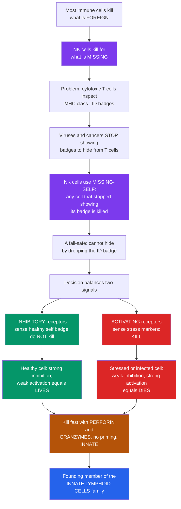

# 🎯 Natural Killer Cells and Innate Lymphoid Cells

> [!abstract] TL;DR
> **Most immune cells kill what is FOREIGN — Natural Killer (NK) cells are the clever exception: they kill cells for what they are MISSING.** Cytotoxic T cells hunt infected and cancerous cells by inspecting the molecular "ID badge" — **MHC class I** — that every healthy cell displays. Viruses and tumors evolved a countertrick: **stop displaying the badge** so there is nothing incriminating to show and the T cell is blind to them. NK cells turn that trick against them with the **"missing-self"** strategy — any cell that has *stopped* showing its healthy badge is instantly flagged and killed. It is a fail-safe: you cannot escape the T cells by dropping your ID without becoming a target for the NK cells. NK cells make the call by **balancing two signals** — **inhibitory** receptors that read the self badge and say *"don't kill,"* against **activating** receptors that read stress and say *"kill."* They strike immediately with the **same perforin-and-granzyme weapons as cytotoxic T cells but without days of priming** (they are innate), bridge to antibodies through **ADCC**, and stand as the founding member of the broader **innate lymphoid cell (ILC)** family that mirrors the T-helper subsets at the body's barriers.

---

## Intuition

**Analogy first — an assassin who kills for what is missing, not what is present.**

Picture a high-security building where every authorized person must wear a glowing **ID badge** at all times. Most guards are trained to spot *intruders* — someone carrying a weapon, wearing the wrong uniform, doing something suspicious. That is how **cytotoxic T cells** work: they inspect the little molecular ID badges (**MHC class I**) that every one of your cells displays on its surface, showing samples of the proteins being made inside. A virus-infected cell displays fragments of viral protein on its badge, the T cell reads *"enemy inside,"* and kills it.

But intruders learned to cheat. Viruses and cancers evolved a sneaky move: they **rip off the ID badge entirely**. No badge means no incriminating sample to show — and the T cell, trained to react to *bad* samples, sees nothing to react to. The intruder walks right past.

Enter the **Natural Killer cell** — a different kind of assassin with a different rule: *"Every legitimate person here wears a glowing badge. Anyone NOT wearing one is an impostor — kill on sight."* NK cells patrol the body checking that every cell still shows its healthy badge. A cell that has **stopped** displaying its badge is instantly suspicious and destroyed. This is the **"missing-self"** strategy, and it is brilliant precisely because it is a **fail-safe**: the very trick that lets a virus hide from the T cells (dropping the badge) is exactly what marks it for the NK cells. You cannot escape both.

NK cells make this life-or-death decision by weighing **two opposing signals**. **Inhibitory** receptors sense the healthy self badge and whisper *"this cell is fine — don't kill."* **Activating** receptors sense stress markers a sick cell puts out and shout *"kill."* A healthy cell shows a strong badge and few stress signals — inhibition wins, it lives. A stressed, infected, or cancerous cell shows a faint badge and many stress signals — activation wins, it dies. And when NK cells kill, they do it **fast** — releasing toxic granules (**perforin and granzymes**) that punch into the target and trigger it to self-destruct, the same weapons cytotoxic T cells use, but **without the days of priming** the adaptive system needs. NK cells are innate: ready immediately. They are the immune system's early antiviral force, a rising star of cancer immunotherapy, and the founding members of a whole family — the **innate lymphoid cells (ILCs)**, the innate mirror-images of the T-helper cells. Understanding NK cells is understanding one of immunology's most elegant ideas: **killing by absence**.

---

## How It Works

### Core Mechanics

1. **The setup — self-display as a health certificate.** Nearly every nucleated cell in your body constantly displays **MHC class I** molecules, each loaded with a short peptide sampled from the proteins being made inside. A healthy cell shows abundant MHC-I carrying ordinary self peptides — a running proof of *"I am normal."*
2. **The T-cell audit and the evasion it provokes.** **Cytotoxic T cells** read those peptides; if the peptide is viral or tumor-derived they kill the cell. To dodge this, many viruses (herpesviruses especially) and tumors **downregulate MHC-I** — no display, nothing for the T cell to recognize. Evasion of one killer creates an opening for another.
3. **Missing-self detection.** NK cells continuously probe every cell for the presence of self MHC-I. **Absence** of the normal badge — *missing self* — removes the "don't kill" brake and licenses lysis. A cell that dropped its badge to hide from T cells is now naked to NK cells.
4. **Induced-self, the second trigger.** Stress, infection, and DNA damage cause cells to **upregulate activating ligands** (such as MICA/MICB). Even a cell that still shows some MHC-I can be killed if it screams enough stress — *induced self* — because the activating signal overwhelms the residual inhibition.
5. **The balance-of-signals decision.** NK cells integrate **inhibitory** receptors (KIRs in humans, Ly49 in mice, NKG2A — all reading self MHC-I) against **activating** receptors (NKG2D reading stress ligands, natural cytotoxicity receptors, CD16). Killing fires only when **activating signals outweigh inhibition** — i.e., loss of MHC-I and/or gain of stress ligands.
6. **Education and self-tolerance.** During development NK cells are **"licensed"** by engaging self MHC-I, tuning their sensitivity so that they spare healthy self cells but stay poised to react when self-display is lost — a built-in tolerance mechanism.
7. **The kill — fast and immediate.** NK cells use the **same cytotoxic machinery as cytotoxic T cells**: directed release of granules containing **perforin** (forms pores) and **granzymes** (drive the target into apoptosis), plus death-receptor killing via FasL and TRAIL. Being **innate**, they need no priming — they act within hours.
8. **Bridge to adaptive immunity.** Through **CD16 (FcγRIII)**, NK cells bind antibody-coated targets and kill them — **antibody-dependent cell-mediated cytotoxicity (ADCC)** — linking innate killing to adaptive antibodies and underpinning several antibody therapeutics. NK cells also secrete **IFN-γ**, activating macrophages and shaping the adaptive response.
9. **The broader family — ILCs.** NK cells are the prototypic *cytotoxic* innate lymphoid cell. The *helper* ILCs — **ILC1, ILC2, ILC3** — are innate counterparts of the Th1/Th2/Th17 T-helper subsets, tissue-resident sentinels that pour out cytokines at barriers **before** adaptive immunity engages.

### Flow / Architecture



---

## Key Concepts

### Secondary (the big picture)

- **The third lymphocyte.** Alongside B cells and T cells, **NK cells** are the third kind of lymphocyte — but they belong to the **innate** immune system: no custom antigen receptors, no priming, ready to kill immediately.
- **Killing by absence.** T cells kill cells showing a *bad* ID badge; NK cells kill cells showing *no* badge. This is the **missing-self** idea — the single most important thing to remember.
- **Why it is clever.** Viruses and cancers hide from T cells by dropping their MHC-I "ID badge." That very move exposes them to NK cells. Two killers, complementary rules — you cannot escape both.
- **A balancing act.** Each cell an NK cell touches sends two kinds of signals: *"I'm healthy, don't kill me"* and *"I'm stressed, kill me."* NK cells add them up and kill only when the *"kill"* side wins.
- **Same weapons as T cells.** When they strike, NK cells use **perforin and granzymes** to punch into the target and make it self-destruct — the identical toolkit cytotoxic T cells use.

### Undergraduate (the mechanisms)

- **The missing-self hypothesis (Kärre).** Healthy cells constitutively express **MHC class I**; because viruses and tumors often **downregulate MHC-I** to evade cytotoxic T cells, they lose the inhibitory "self" signal and become NK targets. NK cells and CTLs are **complementary fail-safes**.
- **Induced-self.** Missing-self is not the only trigger. Stressed cells **upregulate activating ligands** (MICA/MICB and others). A target can be killed by losing MHC-I, by gaining stress ligands, or both.
- **The two-receptor balance:**

| Receptor class | Examples | Ligand it reads | Message |
|---|---|---|---|
| **Inhibitory** | KIRs (human), Ly49 (mouse), NKG2A | self **MHC class I** | *"don't kill — this cell is fine"* |
| **Activating** | NKG2D, natural cytotoxicity receptors, CD16 | stress ligands (MICA/MICB), antibody Fc | *"kill — this cell is compromised"* |

  NK cells kill when **activating output exceeds inhibitory output**.
- **NK education / licensing.** During development, engaging self-MHC-I **tunes** each NK cell's responsiveness. Educated NK cells are self-tolerant yet primed to react the moment self-display is lost.
- **Killing mechanisms.** (i) **Granule exocytosis** — **perforin** forms pores, **granzymes** enter and trigger apoptosis; (ii) **death-receptor** killing via **FasL** and **TRAIL**; (iii) **ADCC** — **CD16/FcγRIII** binds antibody-coated targets, linking NK cells to antibodies.
- **Cytokine role.** NK-secreted **IFN-γ** activates macrophages and biases the adaptive response toward Th1 — NK cells are effectors *and* regulators.
- **The ILC family.** NK cells are the prototypic **cytotoxic** ILC. The **helper ILCs** — **ILC1** (IFN-γ, like Th1), **ILC2** (IL-5/IL-13, like Th2 — allergy and anti-parasite), **ILC3** (IL-17/IL-22, like Th17 — gut and antibacterial defense) — are innate mirrors of the T-helper subsets, resident at barriers for a **rapid** cytokine response.

### Graduate (the integration and its subtleties)

- **Complementarity is an evolutionary arms race.** MHC-I downregulation is a classic viral immune-evasion strategy against CD8 T cells; the missing-self system is the host's counter-counter-measure. Some viruses in turn deploy **MHC-I decoys** (e.g., cytomegalovirus UL18 and virally encoded MHC-I mimics) to re-engage inhibitory NK receptors — a molecular back-and-forth that has shaped the **polymorphic, haplotype-diverse KIR locus**.
- **Licensing / "arming" and "disarming."** The functional consequence of NK education is that NK cells lacking any self-MHC-specific inhibitory receptor are **hyporesponsive** (disarmed), preventing autoreactivity in MHC-deficient settings — which is why total MHC-I loss does not cause runaway self-killing. Models (the "rheostat," "arming," "disarming") debate whether education tunes a threshold or a continuous responsiveness gain.
- **Missing-self is quantitative, not binary.** NK killing integrates the *number* and *affinity* of inhibitory versus activating engagements at the immune synapse; partial MHC-I loss yields graded, not all-or-none, cytotoxicity — the basis of the decision-boundary intuition in the demo below.
- **Adaptive-like NK memory.** The "innate = memoryless" rule is not absolute: **adaptive NK responses** occur — cytomegalovirus drives expansion of long-lived **Ly49H+ (mouse)** and **NKG2C+ (human)** NK subsets with recall capacity, blurring the innate/adaptive boundary and echoing "trained immunity."
- **ILC ontogeny and plasticity.** Helper ILCs and NK cells derive from a **common innate lymphoid progenitor**; ILC subsets exhibit **plasticity** (e.g., ILC2↔ILC1 conversion under inflammatory cytokines), paralleling T-helper plasticity and complicating clean taxonomy. NK cells are distinguished from ILC1 by their **cytotoxic** program and Eomes dependence.
- **Reproductive immunology.** **Uterine NK cells** (a specialized decidual subset) are *poorly cytotoxic* and instead secrete factors promoting **spiral-artery remodeling** and placentation — a striking non-killing role, and a case where NK–HLA-C (fetal) interactions influence pregnancy outcomes.

---

## Python Demo

```python
# Natural Killer cells, two ways:
#   (a) MISSING-SELF / BALANCE OF SIGNALS - model the NK "kill decision" as the
#       balance of INHIBITORY (self MHC-I) vs ACTIVATING (stress-ligand) signals
#       over a 2D decision space, and place three example target cells.
#   (b) NK-vs-CTL TIMING - contrast the IMMEDIATE innate NK antiviral response
#       with the DELAYED adaptive cytotoxic-T-cell (CTL) response during infection.
import numpy as np
import matplotlib.pyplot as plt

# ------------------------------------------------------------------
# (a) DECISION SPACE: kill when ACTIVATING signal beats INHIBITORY signal
#     Rule (simplified): kill if  activating - inhibitory > threshold
# ------------------------------------------------------------------
grid = np.linspace(0, 10, 400)
INH, ACT = np.meshgrid(grid, grid)          # x = inhibitory (MHC-I), y = activating (stress)
threshold = 1.0
kill_score = ACT - INH - threshold          # > 0 means KILL, < 0 means SPARE

# Example target cells: (inhibitory MHC-I level, activating stress level)
targets = {
    "Healthy cell\n(high MHC-I, low stress)":            (8.5, 1.5, "#059669"),
    "Virus/tumor cell\n(MHC-I downregulated: MISSING-SELF)": (1.2, 4.0, "#dc2626"),
    "Stressed cell\n(high stress ligands: INDUCED-SELF)":    (5.5, 8.5, "#b45309"),
}

# ------------------------------------------------------------------
# (b) TIMING: immediate NK response vs delayed CTL response vs viral load
# ------------------------------------------------------------------
def pulse(t, t_peak, amp, sharp):
    """Normalized response pulse peaking at `amp` at time `t_peak`."""
    x = np.clip(t, 1e-6, None)
    return amp * (x / t_peak) ** sharp * np.exp(sharp * (1.0 - x / t_peak))

t = np.linspace(0, 14, 1400)                # days after viral infection
nk  = pulse(t, t_peak=2.5, amp=1.0, sharp=2.0)     # innate NK: peaks ~day 2-3
ctl = pulse(t, t_peak=8.0, amp=1.6, sharp=3.5)     # adaptive CTL: peaks ~day 8
# Viral load: rises early, checked by NK, then crushed as CTLs arrive
viral = pulse(t, t_peak=4.5, amp=1.3, sharp=2.2) * np.exp(-0.06 * t)

# ------------------------------------------------------------------
# Plot
# ------------------------------------------------------------------
fig, (axA, axB) = plt.subplots(1, 2, figsize=(14, 6))

# --- Panel A: missing-self decision space ---
cs = axA.contourf(INH, ACT, kill_score, levels=[-20, 0, 20],
                  colors=["#bbf7d0", "#fecaca"], alpha=0.85)
axA.contour(INH, ACT, kill_score, levels=[0], colors="#111827", linewidths=2)
axA.text(2.0, 8.8, "KILL region\n(activation wins)", color="#7f1d1d",
         fontsize=11, weight="bold")
axA.text(6.2, 1.0, "SPARE region\n(inhibition wins)", color="#065f46",
         fontsize=11, weight="bold")
axA.text(7.2, 6.6, "decision\nboundary", color="#111827", fontsize=9, rotation=45)

for label, (xi, yi, col) in targets.items():
    fate = "KILLED" if (yi - xi - threshold) > 0 else "SPARED"
    axA.scatter(xi, yi, s=180, color=col, edgecolor="black", zorder=5)
    axA.annotate(f"{label}\n-> {fate}", (xi, yi),
                 textcoords="offset points", xytext=(8, -34),
                 fontsize=8, color=col, weight="bold")

axA.set_xlabel("Inhibitory signal  (self MHC-I  ->  'do not kill')")
axA.set_ylabel("Activating signal  (stress ligands  ->  'kill')")
axA.set_title("(a) Missing-self: NK kill decision = balance of two signals")
axA.set_xlim(0, 10); axA.set_ylim(0, 10)
axA.grid(alpha=0.2)

# --- Panel B: NK vs CTL timing ---
axB.fill_between(t, viral, color="#6b7280", alpha=0.25, label="Viral load")
axB.plot(t, nk,  color="#7c3aed", lw=2.6, label="Innate NK response (immediate)")
axB.plot(t, ctl, color="#dc2626", lw=2.6, label="Adaptive CTL response (delayed)")
axB.axvspan(0, 4, color="#7c3aed", alpha=0.07)
axB.text(0.4, 1.5, "NK holds the line\nfor the first days", color="#5b21b6",
         fontsize=9)
axB.annotate("CTLs arrive days later,\nthen finish the job",
             xy=(8, 1.6), xytext=(9.0, 1.0),
             arrowprops=dict(arrowstyle="->", color="#dc2626"),
             color="#dc2626", fontsize=9)
axB.set_xlabel("Days after viral infection")
axB.set_ylabel("Response magnitude (arb. units)")
axB.set_title("(b) Innate NK (immediate) vs adaptive CTL (delayed)")
axB.legend(loc="upper right", fontsize=9)
axB.grid(alpha=0.25)

plt.tight_layout()
plt.savefig("nk_cells.png", dpi=120)
plt.show()

# ------------------------------------------------------------------
# Quantify the decisions
# ------------------------------------------------------------------
print("Missing-self / induced-self decisions:")
for label, (xi, yi, _) in targets.items():
    score = yi - xi - threshold
    print(f"  {label.splitlines()[0]:20s}: activating-inhibitory-thr = {score:+.1f} "
          f"-> {'KILL' if score > 0 else 'SPARE'}")

print(f"\nNK response peaks at day {t[np.argmax(nk)]:.1f}  (innate, immediate)")
print(f"CTL response peaks at day {t[np.argmax(ctl)]:.1f}  (adaptive, delayed)")
print(f"Gap covered by NK cells:  ~{t[np.argmax(ctl)] - t[np.argmax(nk)]:.1f} days")
```

Panel (a) turns the missing-self logic into geometry: the black **decision boundary** separates a **SPARE** region (inhibition dominant — plenty of self MHC-I) from a **KILL** region (activation dominant). The **healthy cell** sits deep in the spare region; the **virus/tumor cell** that downregulated MHC-I slides left into the kill region by *missing-self*; the **stressed cell** rises into the kill region by *induced-self* even while retaining some MHC-I. Panel (b) shows *why NK cells matter*: the **innate NK** curve spikes within a couple of days and buys time, while the **adaptive CTL** curve does not peak until roughly a week — NK cells hold the line during the window before priming completes.

---

## Real-World Applications

> **Herpesvirus infection and MHC evasion.** Herpesviruses (including cytomegalovirus) are masters of **downregulating MHC-I** to hide from cytotoxic T cells — precisely the move that exposes them to NK cells. People with **NK-cell deficiency** suffer severe, recurrent **herpesvirus** infections, direct clinical proof that NK cells are a frontline antiviral defense.

> **Cancer immunosurveillance and NK immunotherapy.** Tumors that lose MHC-I to escape T cells become **missing-self** targets for NK cells. This drives a growing therapeutic frontier: **adoptive NK-cell transfer**, engineered **CAR-NK** cells, and **checkpoint blockade of inhibitory receptors** (anti-KIR, anti-NKG2A) to unleash NK killing against tumors.

> **ADCC and antibody drugs.** Therapeutic monoclonal antibodies such as **rituximab** (anti-CD20) and **trastuzumab** (anti-HER2) work in part by coating tumor cells so that **NK-cell CD16** engages the antibody Fc and triggers **ADCC** — the antibody points, the NK cell shoots. Fc-engineering to boost ADCC is a deliberate design goal for next-generation antibodies.

> **Barrier immunity via helper ILCs.** **ILC2s** drive rapid responses to allergens and parasites (and contribute to asthma), while **ILC3s** defend the gut against bacteria and maintain the epithelial barrier — fast, tissue-resident cytokine sources that act before adaptive immunity spins up.

> **Transplantation and pregnancy.** In bone-marrow transplantation, donor–recipient **KIR/MHC mismatch** can unleash beneficial anti-leukemia NK activity. In pregnancy, non-cytotoxic **uterine NK cells** promote **spiral-artery remodeling** for a healthy placenta — an NK role that is about building, not killing.

---

## Common Pitfalls

- **"NK cells recognize foreign antigen."** They do **not** have antigen-specific receptors and do not undergo priming. They read the **presence or absence of self MHC-I** plus stress ligands — a fundamentally different logic from B and T cells.
- **Thinking loss of MHC-I is the *only* trigger.** Missing-self is half the story. **Induced-self** — upregulated stress ligands (MICA/MICB) sensed by NKG2D — can trigger killing even when some MHC-I remains. Killing reflects the **balance**, not a single input.
- **Assuming total MHC-I loss means uncontrolled self-killing.** NK **education/licensing** ensures NK cells lacking self-MHC engagement become **hyporesponsive**, maintaining self-tolerance. The system is tuned, not trigger-happy.
- **Confusing NK cells with cytotoxic T cells.** Same *weapons* (perforin/granzymes), completely different *targeting rule* and *timing*: CTLs are antigen-specific, MHC-I-restricted, and take days to prime; NK cells are innate, missing-self-guided, and act immediately.
- **Treating "innate = no memory" as absolute for NK cells.** Cytomegalovirus drives **adaptive NK memory** (NKG2C+ in humans, Ly49H+ in mice) — a genuine exception to the textbook rule.
- **Lumping all ILCs together as "just NK cells."** NK cells are the **cytotoxic** ILC; **ILC1/2/3** are **helper** ILCs that secrete cytokines and generally do **not** kill — they mirror Th1/Th2/Th17, not cytotoxic T cells.
- **Forgetting the ADCC bridge.** NK cells are not purely innate loners — via **CD16** they read antibodies, tying them directly to adaptive humoral immunity and to antibody drugs.

---

## Related Concepts

This note lives in the **Immunology** vault's innate-immunity section. Its sibling notes — developed elsewhere in this vault and referenced here **in prose** — include *Innate versus Adaptive Immunity* (the fast-generic vs slow-specific framing that places NK cells firmly on the innate side), *Cytotoxic T Cells and Cell-Mediated Immunity* (the MHC-I-restricted killers whose evasion NK cells counter), *The Major Histocompatibility Complex* (the MHC-I "ID badge" whose absence NK cells detect), *Interferons and Antiviral Defense* (the antiviral cytokine milieu that primes and is amplified by NK IFN-γ), and *Tumor Immunology and Immune Evasion* (where NK-based immunotherapy is developed in depth). The foundational sibling *Cells of the Immune System* introduces NK cells as the third lymphocyte lineage.

Cross-vault connections (Glob-verified to exist):

- [[The_Innate_Immune_System]] — NK cells and ILCs are core innate effectors; this is the Biology-vault overview of the fast, generic arm they belong to.
- [[The_Adaptive_Immune_System]] — the B/T-cell world NK cells complement (missing-self vs antigen-specificity) and bridge to via ADCC and IFN-γ.
- [[Viruses]] — the pathogens whose MHC-I-downregulating evasion tactic makes them prime NK targets, especially herpesviruses.
- [[Infectious_Disease_and_Host_Pathogen_Interaction]] — the clinical view of host defense and pathogen evasion in which NK cells provide early antiviral cover.
- [[Hypersensitivity_Allergy_and_Immunodeficiency]] — clinical companion covering NK-cell deficiency (severe herpesvirus disease) and the ILC2-linked allergic responses.

---

## Review Questions

1. **(Secondary)** In one or two sentences, explain the difference between how a cytotoxic T cell decides to kill a cell and how a Natural Killer cell decides to kill a cell. Why is the NK strategy called "missing-self," and why does it act as a fail-safe against viruses that hide from T cells?
2. **(Undergraduate)** An NK cell contacts a target cell. Using the balance of **inhibitory** (KIR/NKG2A reading self MHC-I) and **activating** (NKG2D reading stress ligands) receptors, predict the outcome for: (a) a healthy cell with abundant MHC-I and no stress ligands; (b) a virus-infected cell that has downregulated MHC-I; (c) a stressed cell that still shows MHC-I but strongly upregulates MICA/MICB. Justify each prediction.
3. **(Undergraduate scenario)** A monoclonal antibody drug coats tumor cells but the tumor has downregulated MHC-I. Explain **two independent** ways NK cells could kill these cells (name the receptors involved), and why a cytotoxic T cell might fail against the same target.
4. **(Graduate)** NK-cell "education/licensing" tunes cells to self-MHC during development. Explain why NK cells lacking any self-MHC-specific inhibitory receptor become **hyporesponsive**, and how this prevents autoreactivity in an MHC-class-I-deficient individual without abolishing missing-self surveillance.
5. **(Graduate trade-off)** NK cells are classically "innate and memoryless," yet cytomegalovirus drives long-lived NKG2C+/Ly49H+ NK expansions with recall capacity, and NK cells are the prototype of a broader ILC family. Discuss how these observations complicate a clean innate/adaptive dichotomy, and what "adaptive NK memory" and ILC plasticity imply for that classification.

---

## Sources

- Murphy, K. & Weaver, C. (2022). *Janeway's Immunobiology*, 10th ed. Garland Science / W. W. Norton. (Innate immunity and NK cells; ILCs.)
- Kärre, K. (2008). "Natural killer cell recognition of missing self." *Nature Immunology* 9(5), 477–480. https://doi.org/10.1038/ni0508-477
- Vivier, E., Tomasello, E., Baratin, M., Walzer, T. & Ugolini, S. (2008). "Functions of natural killer cells." *Nature Immunology* 9(5), 503–510. https://doi.org/10.1038/ni1582
- Spits, H., Artis, D., Colonna, M., Diefenbach, A., et al. (2013). "Innate lymphoid cells — a proposal for uniform nomenclature." *Nature Reviews Immunology* 13(2), 145–149. https://doi.org/10.1038/nri3365
- Lanier, L. L. (2005). "NK cell recognition." *Annual Review of Immunology* 23, 225–274. https://doi.org/10.1146/annurev.immunol.23.021704.115526

---

#immunology #natural-killer-cells #missing-self #innate-lymphoid-cells #cytotoxicity
