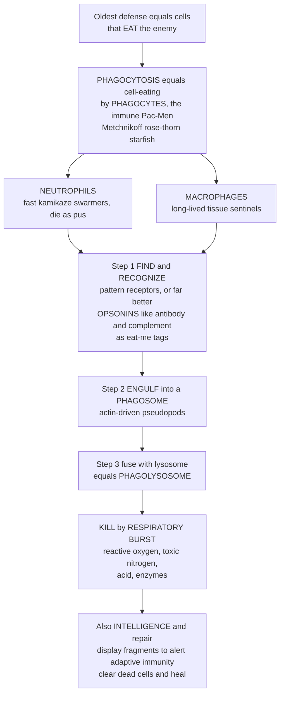

# 🍽️ Phagocytes and Phagocytosis

> [!abstract] TL;DR
> The oldest and most fundamental immune defense is beautifully simple: **cells that eat the enemy**. **Phagocytosis** (Greek *phago*, "to eat") is the receptor-guided engulfment of large particles — microbes, dead cells, and debris — whole into a membrane bubble called a **phagosome**, which then fuses with a digestive **lysosome** to form a **phagolysosome** where the captive is destroyed. The professionals are the **neutrophils** (fast, hugely abundant, kamikaze first-responders that swarm, eat, and die as **pus**) and the **macrophages** (long-lived tissue sentinels that eat continuously and call for backup). Recognition is far more efficient when the target is "buttered" with **opsonins** — antibody and complement **C3b** that act as *eat-me* tags. Killing uses a lethal **respiratory burst** of reactive oxygen, reactive nitrogen, acid, and enzymes. Crucially, phagocytosis is not only destruction but also **intelligence-gathering** (feeding antigen to adaptive immunity) and **housekeeping** (clearing dead cells to resolve inflammation and heal). It is the immune system's most direct and ancient weapon: **seek, engulf, and destroy.**

## Intuition

**Analogy first.** Imagine a Pac-Man roaming a maze, and every enemy it touches it simply *swallows whole* and dissolves. That is a phagocyte. The immune system's most ancient weapon is not a clever molecule or a guided missile — it is a **cell that eats the enemy**. This trick is so old that even single-celled amoebas feed this way; evolution simply repurposed *eating* into *defending*. The word itself is literal: **phago** means "to eat," so a **phagocyte** is an "eating cell" and **phagocytosis** is "cell-eating."

The discovery is one of biology's great stories. In the 1880s, **Élie Metchnikoff** stuck a rose thorn into a transparent **starfish larva** and, peering through his microscope the next morning, watched mobile cells **swarm to surround the intruder**. He realized that specialized cells actively hunt, engulf, and digest invaders — the birth of the *cellular theory of immunity*, and a Nobel Prize in 1908. Your two star eaters are the **neutrophils** (fast, absurdly abundant, kamikaze troops that flood an infection in enormous numbers, gorge, and die — the debris of that feast *is* pus) and the **macrophages** (the "big eaters," long-lived sentinels stationed in every organ, eating continuously and radioing for reinforcements).

The act is a little drama in three beats. First the phagocyte must **find and recognize** its target — sometimes directly, but far more efficiently when the target has been "buttered" with **opsonins** (antibody or complement that coat it like a layer of *eat-me* seasoning). Then it reaches out **arms of membrane** to surround and swallow the microbe into a bubble, the **phagosome**. Then comes the kill: the phagosome fuses with the cell's "stomach" — a **lysosome** full of digestive enzymes — and the trapped microbe is annihilated by a **respiratory burst** of bleach-like reactive oxygen, toxic nitrogen, acid, and shredding enzymes. And there is a twist: eating is also **espionage**. The cells that digest a pathogen keep fragments to show the adaptive immune system, and they tidy up dead cells to end inflammation and heal the wound. Seek, engulf, destroy — and report back.

---

## How It Works

Phagocytosis is a **conserved, stepwise engulfment program** for particles larger than about 0.5 μm. A phagocyte migrates toward an infection along chemical gradients, grabs its target through surface receptors, wraps it in actin-driven membrane arms, seals it into a phagosome, matures that compartment by fusing it with lysosomes, and finally kills and digests the contents — while also keeping antigenic fragments to brief the adaptive system.

1. **Chemotaxis and recruitment.** The phagocyte crawls up gradients of **chemoattractants** — complement fragment **C5a**, chemokines, and bacterial peptides like **fMLP** — toward the site of infection (a process orchestrated by inflammation and complement, covered in the sibling notes below).
2. **Recognition and attachment.** Binding is either **direct** (pattern-recognition receptors and scavenger/lectin receptors read microbial surfaces) or, far more efficiently, **opsonin-mediated**: **antibody** engages **Fcγ receptors** and complement **C3b** engages **complement receptors**, so a coated target is grabbed and swallowed much faster.
3. **Engulfment.** Receptor engagement triggers **actin polymerization**, extending **pseudopods** that zipper around the particle and pinch it off into a **phagosome**.
4. **Phagosome maturation.** The nascent phagosome sequentially **fuses with lysosomes**, acidifies, and becomes a fully armed **phagolysosome**.
5. **Killing and degradation.** The **respiratory burst** and enzymes destroy the captive; peptide fragments may then be **presented** to T cells.



---

## Key Concepts

### Secondary Level

**Phagocytosis means "cell-eating."** Certain white blood cells — **phagocytes** — defend you by literally **swallowing and digesting** invaders whole, like microscopic Pac-Men. It is the immune system's oldest trick, so old that amoebas use the same mechanism just to feed.

**The two star eaters:**

| Phagocyte | Nickname | What it does |
|-----------|----------|--------------|
| **Neutrophil** | The kamikaze swarmer | Most abundant white cell; floods a fresh infection in huge numbers, eats fast, and dies — the leftover **pus** is its battlefield debris |
| **Macrophage** | The "big eater" / sentinel | Long-lived; sits in every tissue eating debris and pathogens, and calls in reinforcements |

**The three beats of eating:**
1. **Find and recognize** the target. This is much easier when the enemy is "buttered" with **opsonins** — coatings (antibody, complement) that act as **eat-me tags**.
2. **Engulf** it by reaching out arms of membrane, sealing it into a bubble called a **phagosome**.
3. **Destroy** it: the bubble merges with the cell's "stomach" (a **lysosome**) to form a **phagolysosome**, and a burst of toxic chemicals dissolves the invader.

**The origin story.** In the 1880s **Metchnikoff** pushed a rose thorn into a see-through **starfish larva** and watched cells swarm to surround it — proof that cells actively eat invaders. He won the **Nobel Prize** for it in 1908.

### Undergraduate Level

**The professional phagocytes.**
- **Neutrophils** (polymorphonuclear leukocytes, PMNs) are the **most abundant leukocyte** and the rapid, short-lived, high-capacity front line against bacteria and fungi. They deploy preformed **granules**, and when overwhelmed can extrude sticky DNA-and-enzyme webs — **neutrophil extracellular traps (NETs)** — that snare microbes extracellularly. Mass death of spent neutrophils produces **pus**.
- **Macrophages** derive from blood **monocytes** that mature after entering tissue. They are **long-lived sentinels and scavengers** that also **present antigen**, **secrete cytokines**, and drive **tissue repair**. Their behavior is tunable: **M1 (classically activated)** macrophages are pro-inflammatory microbe-killers, while **M2 (alternatively activated)** macrophages promote resolution and healing.
- **Dendritic cells** phagocytose mainly to **sample antigen** and carry it to lymph nodes for presentation — the crucial innate-to-adaptive bridge. **Eosinophils** contribute phagocytic and toxic-granule defense, especially against parasites.

**The five steps in detail.**
1. **Chemotaxis:** directed migration up gradients of **C5a**, chemokines (e.g., CXCL8/IL-8), and bacterial **fMLP**.
2. **Recognition and attachment:** *direct* via **pattern-recognition receptors** and **scavenger/lectin receptors**, or *opsonin-mediated* — the key efficiency booster. **Opsonins** are molecules that coat a target as an *eat-me* signal: **antibody (IgG)** read by **Fcγ receptors**, and **complement C3b/iC3b** read by **complement receptors (CR1, CR3)**. Opsonization can raise uptake by orders of magnitude.
3. **Engulfment:** receptor clustering triggers **actin-driven pseudopod extension** that zippers around the particle, forming the **phagosome**.
4. **Phagosome maturation:** sequential **fusion with lysosomes**, progressive **acidification**, and delivery of hydrolases yields the **phagolysosome**.
5. **Killing and degradation.**

**The killing mechanisms.**
- **Oxygen-dependent — the respiratory (oxidative) burst.** The **NADPH oxidase** complex assembles on the phagosome membrane and generates **superoxide (O₂⁻)**, which yields **hydrogen peroxide (H₂O₂)** and, via **myeloperoxidase**, **hypochlorous acid (HOCl, bleach)** — collectively **reactive oxygen species (ROS)**. **Reactive nitrogen** (**nitric oxide, NO**, from iNOS) adds to the assault.
- **Oxygen-independent.** **Acidification**, **antimicrobial peptides (defensins)**, **lysozyme** (digests bacterial cell walls), **lactoferrin** (starves microbes of iron), and **proteases** finish the job; digestion follows.

**Beyond killing.** Phagocytosis also drives **antigen sampling and presentation** (macrophages and dendritic cells feed fragments to T cells), **efferocytosis** (silent clearance of apoptotic self cells to resolve inflammation and maintain tolerance), **tissue homeostasis and repair**, and **cytokine secretion** that orchestrates the wider response.

### Graduate Level

**Molecular choreography of maturation.** The phagosome matures through an ordered **Rab GTPase conversion** — early **Rab5** and **PI3P** giving way to late **Rab7** — recruiting the **HOPS** tethering complex and lysosomes. The **vacuolar H⁺-ATPase (V-ATPase)** drops luminal pH to ~4.5–5, and **LAMP** glycoproteins mark the mature compartment. Fcγ-receptor and complement-receptor engulfment differ mechanistically: FcγR drives a protrusive **"zipper"** with vigorous respiratory burst, whereas complement-mediated uptake is a quieter **"sinking"** engulfment — a distinction with immunological consequences for downstream signaling and inflammation.

**The oxidase and its chemistry.** The phagocyte **NADPH oxidase (NOX2/gp91^phox)** assembles from membrane **flavocytochrome b558** (gp91^phox + p22^phox) plus cytosolic **p47^phox, p67^phox, p40^phox, and Rac2**. It pumps electrons onto O₂ to make superoxide; **myeloperoxidase** converts H₂O₂ + Cl⁻ into **HOCl**. The burst is intense, brief, and consumes oxygen sharply (hence "respiratory burst," though it makes **no ATP** — it is not cellular respiration). **NETosis**, a distinct cell-death program, decondenses chromatin (PAD4-driven citrullination) and expels DNA-histone-enzyme traps.

**Pathogen evasion and subversion.** Microbes fight the eater at every step. **Capsules** (e.g., *Streptococcus pneumoniae*) resist attachment and opsonization. Intracellular pathogens survive *inside* the phagocyte: ***Mycobacterium tuberculosis*** **arrests phagosome-lysosome fusion**; ***Listeria monocytogenes*** **escapes into the cytosol** using pore-forming **listeriolysin O**; ***Salmonella*** remodels its compartment into a replicative **Salmonella-containing vacuole**. A partial counter is **LC3-associated phagocytosis (LAP)**, which recruits autophagy machinery to reinforce killing.

**When it goes wrong — clinical relevance.** **Chronic granulomatous disease (CGD)** stems from **NADPH-oxidase mutations** (no respiratory burst) causing recurrent catalase-positive infections and granulomas. **Leukocyte adhesion deficiency (LAD)** impairs the **β2-integrin (CD18)** needed for firm adhesion and recruitment. **Neutropenia** (few neutrophils) leaves patients dangerously infection-prone. Chronically, macrophages that gorge on oxidized LDL become lipid-laden **foam cells**, the seed of **atherosclerotic** plaques; and **defective efferocytosis** (failure to clear apoptotic cells) is linked to autoimmunity such as **systemic lupus erythematosus**. High-dimensional imaging and cytometry now resolve phagocyte states far beyond the M1/M2 dichotomy, which is best treated as a spectrum.

---

## Python Demo

```python
# Phagocytes and phagocytosis: seek, engulf, and destroy.
# (a) OPSONIZATION BOOST - engulfment efficiency as a function of opsonin
#     (antibody / complement C3b) coating density. Direct (non-opsonic) uptake
#     is weak and flat; opsonized targets are grabbed via Fc / complement
#     receptors in a steep, cooperative (Hill) fashion - the "buttering" effect.
# (b) PATHOGEN CLEARANCE - a bacterial population consumed by phagocytes over
#     time, with vs without opsonization: opsonized bacteria are cleared far
#     faster (higher effective engulfment rate).
# (c) RESPIRATORY BURST + KILLING - the oxidative burst inside the phagolysosome
#     is a sharp pulse of reactive oxygen; intraphagosomal pathogen survival
#     collapses as cumulative ROS exposure accumulates (killing kinetics).
import numpy as np
import matplotlib.pyplot as plt

# -----------------------------------------------------------
# (a) OPSONIZATION: engulfment efficiency vs opsonin coating density
# -----------------------------------------------------------
opsonin = np.linspace(0, 100, 300)          # C3b / IgG molecules per particle (a.u.)
Emax, K, n = 1.0, 25.0, 2.0                 # receptor-mediated Hill uptake
E_opsonized = Emax * opsonin**n / (K**n + opsonin**n)
E_direct = np.full_like(opsonin, 0.08)      # weak direct (PRR) uptake, ~flat

# -----------------------------------------------------------
# (b) PATHOGEN CLEARANCE over time (first-order phagocytic removal)
# -----------------------------------------------------------
t = np.linspace(0, 12, 300)                 # hours
P0 = 1.0e6                                   # starting bacteria
k_ops, k_no = 0.85, 0.15                     # clearance rate constants (1/hr)
P_opsonized = P0 * np.exp(-k_ops * t)
P_direct = P0 * np.exp(-k_no * t)

# -----------------------------------------------------------
# (c) RESPIRATORY BURST pulse and intraphagosomal survival
# -----------------------------------------------------------
tb = np.linspace(0, 30, 300)                # minutes after phagosome sealing
tau = 6.0                                   # burst peaks ~6 min
ROS = (tb / tau) * np.exp(1 - tb / tau)     # gamma-like pulse, peak = 1.0
cum_ROS = np.cumsum(ROS) * (tb[1] - tb[0])  # cumulative oxidative exposure
kill = 0.9                                   # killing potency per unit ROS-exposure
survival = np.exp(-kill * cum_ROS)          # fraction of pathogens still alive

# -----------------------------------------------------------
# Plot
# -----------------------------------------------------------
fig, (ax1, ax2, ax3) = plt.subplots(1, 3, figsize=(16, 4.6))

ax1.plot(opsonin, E_opsonized, color="#dc2626", lw=2.4,
         label="Opsonized (Fc / complement receptor)")
ax1.plot(opsonin, E_direct, color="#6b7280", lw=2.0, ls="--",
         label="Direct, non-opsonic (PRR)")
ax1.fill_between(opsonin, E_direct, E_opsonized, color="#fca5a5", alpha=0.3)
ax1.set_xlabel("Opsonin coating density (a.u.)")
ax1.set_ylabel("Engulfment efficiency")
ax1.set_title("(a) Opsonization boost\nthe buttering effect")
ax1.legend(fontsize=8, loc="lower right")
ax1.set_ylim(0, 1.05)

ax2.plot(t, P_opsonized, color="#dc2626", lw=2.4, label="With opsonization")
ax2.plot(t, P_direct, color="#6b7280", lw=2.0, ls="--", label="Without opsonization")
ax2.set_yscale("log")
ax2.set_xlabel("Time (hours)")
ax2.set_ylabel("Surviving bacteria (log scale)")
ax2.set_title("(b) Pathogen clearance\nopsonized cleared far faster")
ax2.legend(fontsize=8)

ax3b = ax3.twinx()
l1, = ax3.plot(tb, ROS, color="#f59e0b", lw=2.4, label="Respiratory burst (ROS)")
l2, = ax3b.plot(tb, survival, color="#2563eb", lw=2.4, label="Pathogen survival")
ax3.set_xlabel("Time inside phagolysosome (min)")
ax3.set_ylabel("Reactive oxygen output", color="#f59e0b")
ax3b.set_ylabel("Fraction surviving", color="#2563eb")
ax3.set_title("(c) Respiratory burst\nand killing kinetics")
ax3.legend(handles=[l1, l2], fontsize=8, loc="center right")
ax3b.set_ylim(0, 1.05)

plt.tight_layout()
plt.savefig("phagocytosis.png", dpi=120)
plt.show()

# Punchline numbers
print(f"Engulfment at high opsonin density : {E_opsonized[-1]:.2f}")
print(f"Engulfment, direct (non-opsonic)   : {E_direct[-1]:.2f}")
print(f"Boost factor from opsonization     : {E_opsonized[-1] / E_direct[-1]:.1f}x")
print(f"Bacteria left at 6 h, opsonized    : {P_opsonized[np.argmin(abs(t-6))]:.2e}")
print(f"Bacteria left at 6 h, non-opsonic  : {P_direct[np.argmin(abs(t-6))]:.2e}")
print(f"Pathogen survival after 30 min burst: {survival[-1]:.4f}")
```

Running it makes three points concrete. Panel **(a)** shows opsonization as a **steep, cooperative switch** — a well-coated target is engulfed roughly **an order of magnitude** more efficiently than a bare one, which is exactly why antibody and complement so dramatically amplify innate killing. Panel **(b)** turns that into outcome: opsonized bacteria are cleared **far faster**, collapsing on a log scale while un-opsonized bacteria linger. Panel **(c)** captures the kill: a **brief, intense respiratory burst** drives cumulative oxidative damage, and intraphagosomal **survival crashes toward zero** within minutes.

---

## Real-World Applications

- **Vaccines that work by opsonization.** Many vaccines succeed because the antibodies they raise **opsonize** the pathogen — coating it so neutrophils and macrophages engulf it efficiently. Anti-capsular vaccines (pneumococcal, *Haemophilus influenzae* type b, meningococcal) exist precisely because the bacterial **capsule blocks phagocytosis** until antibody overrides it.
- **Chronic granulomatous disease (CGD).** A textbook demonstration of the respiratory burst's importance: children with **NADPH-oxidase mutations** cannot generate ROS, so they suffer recurrent, severe infections with catalase-positive organisms — diagnosed with the classic **DHR / nitroblue-tetrazolium** burst test.
- **Sepsis and neutropenia.** Cancer chemotherapy that wipes out **neutrophils** leaves patients critically infection-prone; **G-CSF (filgrastim)** is given to rebuild the phagocytic front line, showing how central these eaters are to survival.
- **Atherosclerosis.** Macrophages that endlessly ingest **oxidized LDL** become **foam cells**, the cellular core of arterial plaques — phagocytosis gone chronic and maladaptive, a leading driver of heart attack and stroke.
- **Tuberculosis therapeutics.** ***Mycobacterium tuberculosis*** survives by **blocking phagosome-lysosome fusion**; drug and vaccine research targets this subversion to let the macrophage finish the kill.
- **Antibody and CAR therapies.** Therapeutic monoclonal antibodies can drive **antibody-dependent cellular phagocytosis (ADCP)** of tumor cells, and **"don't-eat-me" signal** blockers (anti-CD47) are engineered to unleash macrophages against cancer.

---

## Common Pitfalls

- **Confusing phagocytosis with general endocytosis or pinocytosis.** Phagocytosis is **receptor-triggered, actin-dependent** engulfment of **large** particles (>0.5 μm); pinocytosis is non-specific "cell-drinking" of fluid. Mixing them obscures why phagocytosis needs recognition and a cytoskeletal motor.
- **Thinking recognition is mostly direct.** In practice, **opsonin-mediated** uptake (antibody via Fcγ receptors, C3b via complement receptors) dominates efficient phagocytosis. Ignoring opsonins hides why antibody and complement matter so much.
- **Assuming engulfment always equals death.** Many pathogens **survive or exploit** the phagosome (*Mycobacterium*, *Listeria*, *Salmonella*). Being eaten is sometimes the pathogen's *strategy*, not its defeat.
- **Confusing the phagosome with the phagolysosome.** The **phagosome** is the freshly sealed bubble; only after **lysosome fusion and acidification** does it become the killing **phagolysosome**. Blocking that fusion is a classic evasion trick.
- **Reading "respiratory burst" as cellular respiration.** It is an **oxygen-consuming ROS-generating** reaction by **NADPH oxidase** that makes **no ATP** — the name refers to oxygen uptake, not energy production.
- **Treating neutrophils and macrophages as interchangeable.** Neutrophils are **short-lived, abundant, kamikaze** first-responders (they die as pus); macrophages are **long-lived tissue sentinels** that also present antigen, secrete cytokines, and repair. Their timing and roles differ.
- **Forgetting the non-killing roles.** Phagocytosis also does **antigen presentation** (intelligence) and **efferocytosis** (silent, anti-inflammatory clearance of dead cells). Framing it as pure destruction misses its housekeeping and tolerance functions.

---

## Related Concepts

This note sits in the **Innate Immunity and Inflammation** section and is the mechanistic engine behind several neighbors. Its sibling notes — *Innate_Immune_Recognition_and_Pattern_Receptors* (how phagocytes detect targets directly before opsonins are available), *The_Complement_System* (the source of the opsonin **C3b** and the chemoattractant **C5a** that recruits phagocytes), *Inflammation_and_the_Inflammatory_Response* (the tissue context that summons and resolves phagocyte activity), *Cells_of_the_Immune_System* (the broader leukocyte roster from which neutrophils, monocytes, and dendritic cells arise), and *Antigen_Processing_and_Presentation* (what macrophages and dendritic cells do with the fragments after eating) — build directly on the seek-engulf-destroy program described here and are referenced in prose above.

Cross-vault connections (verified to exist):

- [[The_Innate_Immune_System]] — phagocytes are the cellular workhorses of the innate response profiled there
- [[The_Endomembrane_System]] — the **lysosomes** that fuse with the phagosome to form the phagolysosome are part of this cell-biology machinery
- [[The_Cell_Membrane_and_Transport]] — engulfment is a specialized, receptor-driven form of membrane endocytosis
- [[The_Cytoskeleton_and_Cell_Motility]] — the **actin-driven pseudopods** that surround and swallow the target come from this cytoskeletal system
- [[Inflammation_and_Tissue_Repair]] — clinical companion: phagocyte recruitment, killing, and efferocytosis drive both acute inflammation and its resolution/healing

---

## Review Questions

1. **Secondary:** Explain in your own words what "phagocytosis" means and why a phagocyte is like a Pac-Man. Name the two main phagocyte cell types and give one distinctive feature of each. What is an **opsonin**, and why does it make eating easier?
2. **Undergraduate:** Walk through the five steps of phagocytosis from chemotaxis to degradation. At the recognition step, contrast **direct** with **opsonin-mediated** attachment, naming the specific opsonins and the receptors that read them. Then describe both the **oxygen-dependent** and **oxygen-independent** killing mechanisms inside the phagolysosome.
3. **Graduate:** A patient has recurrent catalase-positive bacterial infections and forms granulomas; a dihydrorhodamine burst assay is abnormal. Identify the likely defect and the molecular complex involved, and explain mechanistically why the respiratory burst fails. Separately, explain how ***Mycobacterium tuberculosis*** survives inside a macrophage despite being phagocytosed, and how this connects to the phagosome-maturation pathway (Rab5→Rab7, V-ATPase, lysosome fusion).

---

## Sources

- Metchnikoff, É. (1905). *Immunity in Infective Diseases*. Cambridge University Press (foundational cellular theory of immunity; Nobel Prize 1908)
- Murphy, K. & Weaver, C. (2022). *Janeway's Immunobiology*, 10th ed. Garland Science / W. W. Norton
- Flannagan, R.S., Jaumouillé, V. & Grinstein, S. (2012). "The Cell Biology of Phagocytosis." *Annual Review of Pathology* 7, 61–98
- Nauseef, W.M. & Borregaard, N. (2014). "Neutrophils at work." *Nature Immunology* 15(7), 602–611
- Abbas, A.K., Lichtman, A.H. & Pillai, S. (2021). *Cellular and Molecular Immunology*, 10th ed. Elsevier

#immunology #phagocytosis #macrophages #neutrophils #opsonization
