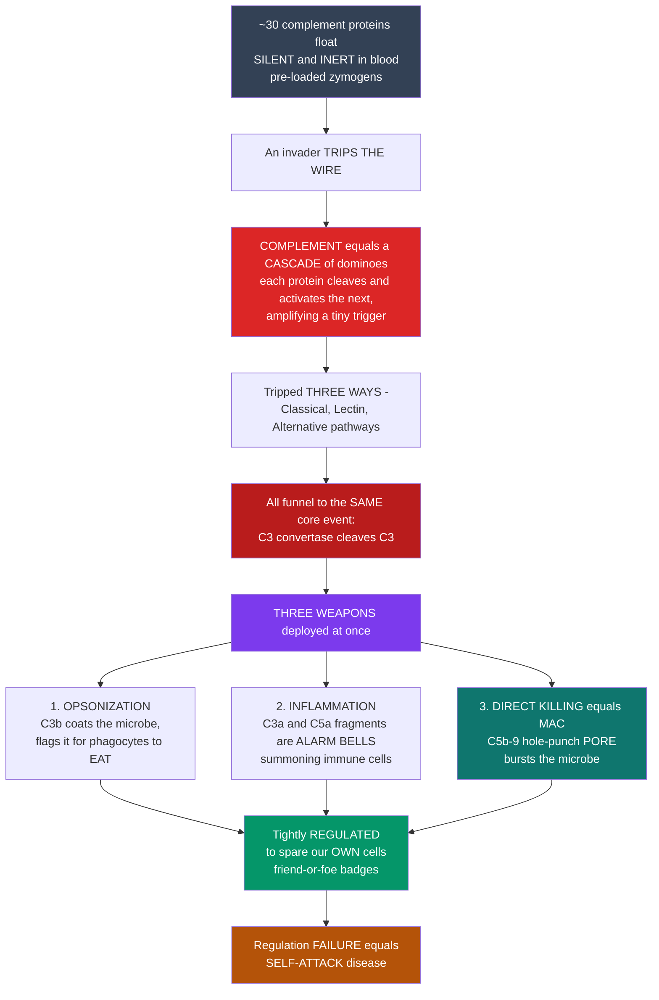

# 🩸 The Complement System

> [!abstract] TL;DR
> Floating in your blood right now is a **pre-loaded arsenal of ~30 proteins** — mostly liver-made, circulating as **inert zymogens** — that does nothing until an invader trips the wire. When it does, one protein cleaves and activates the next in a **self-amplifying proteolytic cascade**, so a tiny initial trigger explodes into a massive coordinated attack within **seconds**. The cascade can be tripped **three ways** — the **classical** pathway (antibody-triggered, via C1q), the **lectin** pathway (microbial-sugar-triggered, via MBL/ficolins), and the **alternative** pathway (spontaneous "tickover" plus a runaway amplification loop) — all converging on one hub, the cleavage of **C3** by a **C3 convertase**. The payoff is **three weapons at once**: **opsonization** (C3b coats the microbe as an "eat-me" tag for phagocytes), **inflammation** (the anaphylatoxins C3a and C5a summon and arm leukocytes), and **direct killing** (the **membrane attack complex**, C5b–9, drills a pore that osmotically bursts the target). Because such a weapon is lethal, it is **tightly regulated** by inhibitor proteins that spare host cells while microbes — which lack those regulators — are destroyed; when regulation fails, complement turns on **self**, causing diseases from PNH to atypical HUS to hereditary angioedema. Complement is one of innate immunity's most ancient, fast, and deadly weapons, and a bridge that also **amplifies antibody responses**.

---

## Intuition

**Analogy first — a silent, pre-loaded weapons system wired to a tripwire.**

Imagine a fortress that keeps a hidden defense grid strung through its corridors: **about thirty weapon-charges lie dormant and disarmed**, doing nothing, costing nothing, until an intruder crosses a tripwire. The instant the wire is tripped, the first charge fires — and firing the first charge arms the second, which arms the third, each one setting off *many* copies of the next. This is a **chain reaction of dominoes**, except every domino that falls knocks over *dozens* more: a single footstep on the wire becomes a building-wide detonation in seconds. That grid is the **complement system**, and its power comes from this **cascade amplification** — a handful of activated enzymes at the top generate *thousands* of active molecules at the bottom.

The system got its name because it was discovered as something in serum that "**complemented**" — assisted — antibodies in killing microbes. The tripwire can be triggered **three different ways** (three **pathways**), but all three funnel into the **same core event**, and all three deliver the **same three weapons at once**. First, **opsonization**: complement proteins paint the intruder's surface with fluorescent target-tags, flagging it for the fortress's eaters (**phagocytes**) as "devour this." Second, **inflammation**: released protein fragments act as **alarm bells and homing beacons**, screaming for reinforcements and guiding immune cells to the exact spot. Third, and most dramatic, **direct killing**: the cascade's final proteins snap together into the **membrane attack complex** — a molecular **hole-punch** that drills a ring-shaped pore straight through the intruder's membrane, so its insides leak out and it bursts.

A weapon this powerful is dangerous to its owner, so the fortress installs a **friend-or-foe safeguard**: inhibitor proteins studded on the fortress's *own* walls disarm any charge that lands on friendly surfaces, while the enemy — who has no such badges — gets the full treatment. When that safeguard breaks, the grid starts blowing holes in the fortress's own walls: **self-attack disease**. Understanding complement is understanding how the body keeps a loaded, self-triggering weapon in every drop of blood — and why keeping it aimed outward is a matter of life and death.

---

## How It Works

### Core Mechanics

1. **The resting state — a loaded gun.** Complement proteins (labelled C1–C9 plus factors B, D, P, H, I and more) circulate as **inactive zymogens**. Nothing happens until a surface or an antibody presents a trigger. This "always loaded, rarely fired" design is what lets innate immunity respond in **seconds**, faster than any cell can be recruited.
2. **Three triggers, one hub.** Three **activation pathways** initiate the cascade:
   - **Classical** — the antibody arm. When **IgG or IgM** binds antigen, the collagen-stalk protein **C1q** clamps onto the antibody's tails, activating C1r/C1s proteases. This is complement's direct link to **adaptive immunity** (C-reactive protein can also trigger it).
   - **Lectin** — the pattern arm. **Mannose-binding lectin (MBL)** and **ficolins** recognize conserved sugars (mannose, GlcNAc) on microbial surfaces — a **PAMP** sensor — activating **MASP** proteases, mechanistically parallel to C1.
   - **Alternative** — the always-on arm. C3 spontaneously hydrolyzes at a low rate ("**tickover**"), depositing a little C3b everywhere; on **host** surfaces regulators wipe it off, but on **microbial** surfaces (lacking regulators) it survives and ignites a powerful **amplification loop**.
3. **The convergence: C3 convertase.** Every pathway builds an enzyme called a **C3 convertase** (classical/lectin: **C4b2a**; alternative: **C3bBb**, stabilized by properdin). Each convertase is a catalyst that cleaves **many** C3 molecules into **C3a** (a small alarm fragment) and **C3b** (the central, surface-binding hub). This is the amplification step: *few enzymes → thousands of C3b*.
4. **The covalent grab.** Freshly cleaved **C3b** exposes a reactive **thioester bond** that snaps a covalent link to the nearest surface — burning the microbe's identity into the coating so it cannot wash off.
5. **Weapon 1 — opsonization.** Surface-bound **C3b** and its cleaved form **iC3b** are read by **complement receptors** (CR1, CR3) on **phagocytes**, dramatically boosting **phagocytosis** ("eat-me" tags).
6. **Weapon 2 — inflammation.** The freed small fragments **C3a** and **C5a** are **anaphylatoxins**: they recruit and activate neutrophils, trigger **mast-cell degranulation**, and raise vascular permeability. **C5a** is a potent **chemoattractant** — a homing beacon.
7. **Weapon 3 — the membrane attack complex.** As C3b accumulates it converts the C3 convertase into a **C5 convertase**, which cleaves **C5**. **C5b** then nucleates the sequential assembly of **C6, C7, C8, and multiple C9** into the **MAC (C5b–9)** — a transmembrane **pore** that collapses the target's ion gradients and causes **osmotic lysis**, especially of Gram-negative and enveloped microbes.
8. **The safeguard — regulation.** Soluble and membrane regulators (C1-INH, factor H, factor I, **DAF/CD55**, **MCP/CD46**, **CD59**) accelerate decay of convertases or block MAC assembly **on host cells**, which display them; microbes do not, so the discrimination between **self and non-self is enforced by regulation**, not just recognition.
9. **The bridge to adaptive immunity.** **C3d** deposited on antigen binds **CR2/CD21** on B cells, lowering their activation threshold ~1000-fold — so complement also **amplifies antibody responses**.

### Flow / Architecture



---

## Key Concepts

### Secondary (the big picture)

- **A loaded gun in your blood.** ~30 proteins wait, disarmed, until an invader appears. This "always ready" design is why complement acts in **seconds**.
- **A cascade of dominoes.** One protein activates the next, which activates the next — each step multiplies the last, so a small trigger becomes a huge response (**amplification**).
- **Three ways to trip it, one target.** The classical, lectin, and alternative pathways all converge on cutting **C3**.
- **Three weapons at once.** (1) **Opsonization** — coat the microbe so phagocytes eat it; (2) **Inflammation** — release fragments that sound the alarm and call in cells; (3) **Direct killing** — build the **membrane attack complex**, a pore that bursts the microbe.
- **A friend-or-foe safeguard.** Your own cells wear protective badges; microbes do not. Break the safeguard and complement attacks **you**.

### Undergraduate (the mechanisms)

- **The three pathways compared:**

| Pathway | Trigger / recognition | Initiating molecules | C3 convertase | Links to |
|---|---|---|---|---|
| **Classical** | **Antibody** (IgM/IgG) bound to antigen; also CRP | C1q → C1r/C1s | **C4b2a** | Adaptive immunity |
| **Lectin** | Microbial **carbohydrate PAMPs** (mannose, GlcNAc) | MBL / ficolins → MASP-1/2 | **C4b2a** | Pattern recognition |
| **Alternative** | Spontaneous **C3 tickover** on unprotected surfaces | C3b + factor B + factor D (+ properdin) | **C3bBb** | Amplification loop |

- **C3 is the hub.** All roads make a **C3 convertase**, which cleaves C3 → **C3a** (anaphylatoxin) + **C3b** (opsonin / builder of everything downstream). Additional C3b converts the C3 convertase into a **C5 convertase** (C4b2a3b or C3bBb3b).
- **The three effector functions (the payoff):**
  1. **Opsonization** — **C3b / iC3b** on the target are recognized by **complement receptors (CR1, CR3)** on phagocytes → enhanced **phagocytosis**.
  2. **Inflammation & chemotaxis** — the **anaphylatoxins C3a, C4a, C5a** recruit/activate leukocytes, degranulate mast cells, and increase vascular permeability; **C5a** is the strongest chemoattractant.
  3. **Membrane attack complex (MAC)** — **C5b-6-7-8-9** assemble a transmembrane **pore** → osmotic **lysis**, most effective against Gram-negative bacteria and enveloped microbes.
- **Plus two more jobs:** **immune-complex clearance** (C3b-tagged complexes ferried by erythrocyte CR1 to liver/spleen) and **bridging to adaptive immunity** (**C3d** lowering the B-cell activation threshold).
- **The regulators (the brakes):** **C1 inhibitor** (C1r/C1s, MASPs), **factor H** and **factor I** (degrade C3b), **C4BP** (classical), **DAF/CD55** (decay-accelerates convertases), **MCP/CD46** (cofactor for factor I), **CD59/protectin** (blocks MAC assembly). Host cells display them; microbes do not.

### Graduate (the integration and its subtleties)

- **The alternative pathway as an amplification engine.** "Tickover" hydrolysis of C3 to C3(H₂O) seeds a fluid-phase convertase; the real power is the **feedback loop** — every C3b made by *any* pathway can recruit factor B to form more C3bBb, making more C3b. Roughly 80% of terminal-pathway C3b in a classical response is actually generated by this alternative-pathway **amplification loop**. Complement is therefore best understood as *one amplification circuit with three ignition switches*.
- **Thioester chemistry — covalent target-marking.** C3 (and C4) contain an internal, metastable **thioester bond** buried until proteolysis exposes it; it then reacts with surface hydroxyl/amino groups within ~60 μs, **covalently** and irreversibly tagging the activating surface. This is why opsonization is spatially confined to the trigger and does not diffuse onto bystanders.
- **Self / non-self by regulation, not recognition.** The alternative pathway deposits C3b indiscriminately. Discrimination is **negative**: host surfaces carry **sialic acid / glycosaminoglycans** that recruit **factor H**, and membrane regulators (CD55, CD46, CD59) that decay convertases or block MAC. "Self" is defined operationally as "the surface that can switch complement off."
- **Convertase enzymology.** C3 convertases are **serine-protease heterodimers** with intrinsic decay (t½ of minutes); **properdin (factor P)** is the only *positive* regulator, stabilizing C3bBb ~10-fold. Therapeutic and pathological perturbations target the balance between properdin (accelerate) and factor H / DAF (decay).
- **Dysregulation maps cleanly to disease (educational):** loss of **CD55/CD59** via a GPI-anchor defect → **paroxysmal nocturnal hemoglobinuria (PNH)** with complement-mediated hemolysis; **factor H** loss-of-function → **atypical HUS**, **C3 glomerulopathy**, and (a common polymorphism) **age-related macular degeneration**; **C1-INH** deficiency → **hereditary angioedema** (a bradykinin/contact-system overlap). **Deficiencies:** early classical components (C1, C4, C2) → **SLE** (failed immune-complex clearance); **MAC** components (C5–C9) → recurrent **Neisseria** infections; C3 deficiency → severe pyogenic infections.
- **Therapeutics.** **Eculizumab** (anti-**C5**) blocks MAC formation and is transformative in PNH and aHUS; a growing pipeline targets C3 (pegcetacoplan), factor B, factor D, and MASP-2 — each choice trading breadth of blockade against infection risk.
- **Evolution.** A thioester-containing C3-like protein and an alternative-pathway-like loop exist in **invertebrates** lacking antibodies entirely — complement is an **ancient** innate defense that *predates* adaptive immunity, onto which the antibody-triggered classical pathway was later grafted.

---

## Python Demo

```python
# The complement system, quantified two ways:
#   (a) CASCADE AMPLIFICATION: an enzymatic chain where each activated enzyme
#       cleaves many copies of the next component -> exponential blow-up
#       (a few C3 convertases -> thousands of C3b), vs a non-catalytic response.
#   (b) MAC KILLING + REGULATION: osmotic-lysis survival as a function of
#       complement activation, comparing a microbe (no regulators), a host cell
#       (CD55/CD59 protected), and a host cell that has LOST regulation (PNH-like).
import numpy as np
import matplotlib.pyplot as plt

# ----------------------------------------------------------------------
# (a) Cascade amplification through successive enzymatic steps
# ----------------------------------------------------------------------
n0 = 3          # a few initial C3 convertases at the top of the cascade
gain = 6        # each enzyme cleaves ~gain copies of the next component / step
steps = np.arange(0, 8)                     # cascade depth
catalytic = n0 * gain ** steps               # exponential: enzymes making enzymes
noncatalytic = n0 * (1 + gain * steps)       # if each step only added (no catalysis)

step_labels = ["Trigger", "C4b2a", "C3 conv.", "C3b burst",
               "more C3b", "C5 conv.", "C5b-C8", "MAC (C9n)"]

# ----------------------------------------------------------------------
# (b) MAC-mediated lysis and the protective role of regulation
# ----------------------------------------------------------------------
activation = np.linspace(0, 100, 500)        # complement activation on the surface
thresh, steep = 40.0, 0.18                    # osmotic-lysis threshold + steepness

def survival(effective_pores):
    """Fraction of cells surviving vs number of functional MAC pores (sigmoid)."""
    return 1.0 / (1.0 + np.exp(steep * (effective_pores - thresh)))

microbe   = survival(activation * 1.00)       # no regulators -> full MAC assembly
host_prot = survival(activation * 0.08)       # CD55/CD59 block ~92% of MAC
host_pnh  = survival(activation * 1.00)       # lost CD59 (PNH) -> attacked like a microbe

# ----------------------------------------------------------------------
# Plot
# ----------------------------------------------------------------------
fig, (axA, axB) = plt.subplots(1, 2, figsize=(13, 5))

# Panel A: amplification
axA.semilogy(steps, catalytic, "o-", color="#dc2626", lw=2.4, ms=7,
             label="Enzymatic cascade (each enzyme cuts many)")
axA.semilogy(steps, noncatalytic, "s--", color="#64748b", lw=2.0, ms=6,
             label="Non-catalytic (linear) comparison")
axA.set_xticks(steps)
axA.set_xticklabels(step_labels, rotation=45, ha="right", fontsize=8)
axA.set_ylabel("Active molecules (log scale)")
axA.set_title("(a) Cascade amplification: a tiny trigger explodes")
axA.annotate(f"{n0} convertases\n-> {catalytic[-1]:,.0f} molecules",
             xy=(7, catalytic[-1]), xytext=(3.0, catalytic[-1] * 0.04),
             arrowprops=dict(arrowstyle="->", color="#dc2626"),
             color="#dc2626", fontsize=9)
axA.legend(loc="upper left", fontsize=8)
axA.grid(alpha=0.25, which="both")

# Panel B: MAC lysis + regulation
axB.plot(activation, microbe,   color="#dc2626", lw=2.6,
         label="Microbe (no regulators) -> LYSED")
axB.plot(activation, host_prot, color="#059669", lw=2.6,
         label="Host cell (CD55/CD59) -> PROTECTED")
axB.plot(activation, host_pnh,  color="#b45309", lw=2.4, ls="--",
         label="Host cell, regulation LOST (PNH) -> self-lysis")
axB.axhline(0.5, color="#334155", ls=":", lw=1)
axB.fill_between(activation, host_prot, 1.0, color="#059669", alpha=0.08)
axB.set_xlabel("Complement activation on the surface (arb. units)")
axB.set_ylabel("Fraction of cells surviving")
axB.set_title("(b) MAC killing vs regulation: friend-or-foe")
axB.set_ylim(-0.02, 1.05)
axB.legend(loc="center left", fontsize=8)
axB.grid(alpha=0.25)

plt.tight_layout()
plt.savefig("complement_system.png", dpi=120)
plt.show()

# ----------------------------------------------------------------------
# Quantify the two lessons
# ----------------------------------------------------------------------
print(f"[a] Amplification: {n0} initial convertases -> {catalytic[-1]:,.0f} active "
      f"molecules after {steps[-1]} steps ({catalytic[-1]/n0:,.0f}x).")
print(f"    Non-catalytic chain would reach only {noncatalytic[-1]:,.0f} "
      f"({catalytic[-1]/noncatalytic[-1]:,.0f}x less) -- catalysis is the whole point.")
half = thresh  # activation giving 50% survival for an unregulated surface
print(f"[b] At activation ~{half:.0f}: microbe survival "
      f"{survival(half*1.0):.2f} (killed) vs host survival "
      f"{survival(half*0.08):.2f} (spared) -- regulation makes self ~"
      f"{survival(half*0.08)/max(survival(half*1.0),1e-6):.0f}x safer.")
print("    Lose CD59 (PNH) and the host curve collapses onto the microbe curve: "
      "self becomes non-self.")
```

Panel (a) shows why complement is a *cascade*: because each activated enzyme cleaves **many** copies of the next component, the number of active molecules grows **exponentially** with cascade depth — a few C3 convertases become tens of thousands of downstream molecules, while a merely additive (non-catalytic) chain barely moves. Panel (b) shows the **friend-or-foe** logic of the MAC: a microbe with no regulators is driven past the osmotic-lysis threshold and killed, a host cell displaying **CD55/CD59** stays safely below it, and — the crucial teaching point — a host cell that **loses** its regulators (as in PNH) collapses onto the microbe curve and lyses itself. **Regulation, not recognition, is what keeps the weapon aimed outward.**

---

## Real-World Applications

> **Eculizumab and PNH.** In **paroxysmal nocturnal hemoglobinuria**, a somatic *PIGA* mutation strips red cells of GPI-anchored **CD55 and CD59**, so complement — activated at a low tickover level all the time — assembles the MAC on the patient's *own* erythrocytes and lyses them (intravascular hemolysis, dark morning urine). The monoclonal antibody **eculizumab** binds **C5**, blocking cleavage to C5b and preventing MAC assembly; it does not touch opsonization or the anaphylatoxins upstream. It is one of medicine's clearest demonstrations that a single node in this cascade can be a drug target.

> **Vaccines against Neisseria.** People deficient in **MAC components (C5–C9)** are strikingly susceptible to *Neisseria meningitidis* and *N. gonorrhoeae*, revealing that the **membrane attack complex** is the body's principal weapon against these organisms. This is also why anti-C5 therapy carries a boxed warning and mandates **meningococcal vaccination** before starting: the drug reproduces a MAC deficiency on purpose.

> **Transplant rejection.** In **antibody-mediated (hyperacute/acute) rejection**, recipient antibodies against donor endothelium fix complement via the **classical** pathway; pathologists stain graft biopsies for **C4d** — a covalently deposited split product — as a durable footprint that the classical pathway fired on the graft.

> **Age-related macular degeneration.** A common **factor H** polymorphism (Y402H) weakens alternative-pathway regulation in the retina, allowing chronic low-grade complement damage — a landmark example of complement **dysregulation** driving a common degenerative disease and a target for complement-inhibiting eye therapeutics.

---

## Common Pitfalls

- **Thinking the three pathways are three separate systems.** They are three **ignition switches on one engine**. They differ only in how the *first* C3 convertase is built; from C3 onward the machinery, weapons, and amplification loop are shared. If you can't state where they converge (**C3**), you don't yet have the topic.
- **Confusing C3a/C5a with C3b.** The *small* fragments (C3a, C5a) float away to cause **inflammation** (anaphylatoxins); the *large* fragment (C3b) stays **bound** to the surface for **opsonization** and to build the terminal pathway. Same cleavage event, opposite fates and jobs.
- **Believing recognition alone distinguishes self from microbe.** The alternative pathway deposits C3b on *everything*, including your own cells. Protection is achieved **negatively**, by host **regulators** (factor H, CD55, CD59). Lose them and complement attacks self — the entire logic of PNH and aHUS.
- **Treating the MAC as complement's main function.** In humans the dominant, most broadly important effect is **opsonization**, and many bacteria (thick-walled Gram-positives) are essentially immune to the MAC. Overweighting the "hole-punch" misrepresents where complement does most of its work.
- **Forgetting complement is an amplifier of antibody, not just an innate silo.** The classical pathway is antibody-triggered, and **C3d** lowers the B-cell activation threshold — complement sits on *both* sides of the innate/adaptive divide.
- **Assuming more complement activity is always protective.** The same amplification that kills microbes drives **cytokine/anaphylatoxin storms**, hemolysis, and glomerular injury when unchecked. Complement is a genuinely double-edged sword; its **regulation** is as important as its activation.

---

## Related Concepts

- [[The_Innate_Immune_System]] — the Biology/11 deep dive on barriers, phagocytes, and inflammation; complement is the humoral cascade at the heart of that innate arm.
- [[Innate_versus_Adaptive_Immunity]] — the sibling foundations note; complement is a canonical *fast, generic* innate weapon that nonetheless **bridges** to the adaptive arm (antibody-triggered classical pathway, C3d licensing of B cells).
- [[The_Adaptive_Immune_System]] — the Biology/11 note on antibodies and B/T cells that the classical pathway couples to, and that C3d amplifies.
- [[Cells_of_the_Immune_System]] — the phagocytes (neutrophils, macrophages) whose complement receptors read C3b/iC3b during opsonization.
- [[Immunology_Overview_and_the_Immune_System]] — the map of the whole field into which this cascade fits.
- [[Enzymes_and_Catalysis]] — the Biology/01 note on enzyme kinetics that explains *why* a proteolytic cascade of convertases produces exponential amplification.
- [[Immune_Dysfunction_and_Autoimmunity]] — the Clinical_Medicine/05 view of what complement dysregulation looks like as disease (aHUS, C3 glomerulopathy, lupus).
- [[Hematologic_Disorders_and_Anemia]] — the Clinical_Medicine/05 view of complement-mediated hemolysis (PNH) as a blood disorder.
- [[Hypersensitivity_Allergy_and_Immunodeficiency]] — the Clinical_Medicine/05 view of complement **deficiencies** (Neisseria susceptibility, lupus) and anaphylatoxin-driven reactions.
- [[Infectious_Disease_and_Host_Pathogen_Interaction]] — the clinical arena where complement clears microbes and where pathogens evolve evasins to subvert it.

**Sibling notes to build out in this section** (prose-only until written): *Innate Immune Recognition and Pattern Receptors* (the PRR/PAMP sensing that overlaps the lectin pathway), *Phagocytes and Phagocytosis* (the cells that read complement's opsonins), *Inflammation and the Inflammatory Response* (the anaphylatoxin-driven arm), *Antibody Structure and Function* (the IgG/IgM that trigger the classical pathway), and *Immunodeficiency Disorders* (the clinical face of missing complement components).

---

## Review Questions

1. **(Secondary)** Explain, using the "loaded weapons system" analogy, why the complement cascade can respond within seconds and how one tiny trigger becomes a massive attack. Name the three weapons it deploys.
2. **(Undergraduate)** The classical, lectin, and alternative pathways start differently but "all roads lead to C3." Describe each pathway's trigger and initiating molecules, and state the single event on which all three converge.
3. **(Undergraduate scenario)** A cleavage of C3 releases two fragments, C3a and C3b, that go on to do completely different jobs. Trace each fragment to its effector function and explain how the *same* reaction produces both an alarm signal and a phagocytosis tag.
4. **(Graduate)** Host cells and microbes are both exposed to the same tickover-deposited C3b, yet only microbes are destroyed. Explain how **regulation rather than recognition** enforces self/non-self discrimination, and predict what happens (and name the disease) when a host cell loses CD55 and CD59.
5. **(Graduate trade-off)** Eculizumab blocks C5 and is life-saving in PNH, yet it mandates meningococcal vaccination. Using the cascade's architecture, explain what protective function is lost when C5 is blocked, what upstream functions are preserved, and why that trade-off exists.

---

## Sources

- Murphy, K. & Weaver, C. *Janeway's Immunobiology*, 9th/10th ed. Garland Science / W. W. Norton. (Ch. 2: Innate immunity — the complement system.)
- Walport, M. J. "Complement" (First and Second of Two Parts). *New England Journal of Medicine* 344(14):1058–1066 and 344(15):1140–1144 (2001). https://doi.org/10.1056/NEJM200104053441406
- Ricklin, D., Hajishengallis, G., Yang, K. & Lambris, J. D. "Complement: a key system for immune surveillance and homeostasis." *Nature Immunology* 11(9):785–797 (2010). https://doi.org/10.1038/ni.1923
- Abbas, A. K., Lichtman, A. H. & Pillai, S. *Cellular and Molecular Immunology*, 10th ed. Elsevier. (Ch. 12: Effector mechanisms of humoral immunity — the complement system.)
- Merle, N. S., Church, S. E., Fremeaux-Bacchi, V. & Roumenina, L. T. "Complement System Part I — Molecular Mechanisms of Activation and Regulation." *Frontiers in Immunology* 6:262 (2015). https://doi.org/10.3389/fimmu.2015.00262

---

#immunology #complement-system #membrane-attack-complex #opsonization #innate-immunity
