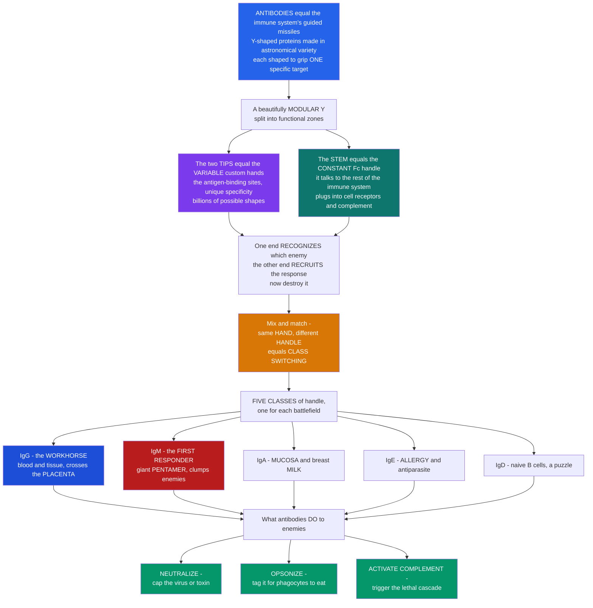

# 🧬 Antibody Structure and Function

> [!abstract] TL;DR
> An **antibody** (or **immunoglobulin, Ig**) is the immune system's most versatile molecular weapon: a **Y-shaped protein**, made in **astronomical variety**, each one shaped to grip **one** specific target out of billions. Its power is its **modular design**. The two **tips** of the Y are the business end — **variable**, custom-shaped "hands" (the two **antigen-binding sites**) whose sequence differs from antibody to antibody, giving each its unique **specificity**. The **stem** of the Y (the **Fc region**) is the **constant** "handle": it does not touch the enemy — it plugs into **receptors on immune cells** and into **complement** to trigger the actual destruction. So **one end asks "which enemy?" and the other commands "now destroy it!"** Because the hand and handle are separable, the *same* specificity can be bolted onto **different** handles — this is **class switching** — producing **five isotypes**, each tuned for a battlefield: **IgG** (the blood/tissue workhorse, the only isotype crossing the **placenta**), **IgM** (the first-responder **pentamer**, a superb clumper and complement activator), **IgA** (guarding **mucosa** and breast milk), **IgE** (driving **allergy** and antiparasite defense), and **IgD** (a naive-B-cell puzzle). What antibodies actually **do** is threefold — **NEUTRALIZE** (cap a virus or toxin), **OPSONIZE** (tag it for phagocytes), and **ACTIVATE COMPLEMENT** (ignite the lethal cascade) — plus **ADCC** and mast-cell arming. Binding strength has two flavors: **affinity** (one site) and **avidity** (all sites together — why IgM's ten sites punch above their per-site weight). Understanding how antibody structure produces **specificity, affinity, and avidity**, and how the Fc handle powers **effector function**, is the heart of humoral immunity — and the molecule behind vaccines, blood tests, and a vast fraction of modern drugs. *Educational science content, not medical advice.*

---

## Intuition

**Analogy first — a guided missile with a custom warhead and a universal tail.** Picture a letter **"Y."** An antibody is a guided missile built in two separable halves. The **two tips of the arms** are custom-shaped **hands** — soft, adjustable grippers that are moulded, one antibody at a time, to clamp onto exactly **one** enemy molecule. There are **billions** of possible hand-shapes, so somewhere in your repertoire is a hand for almost anything. These tips are the **variable** part: they differ from antibody to antibody, and they are the reason a single antibody is exquisitely **specific**. The **stem** of the Y is the opposite — a **constant, standardized handle** that never touches the enemy. Instead the handle is what the rest of the immune system grabs: it plugs into sockets (**receptors**) on killer and eater cells and into the **complement** cascade. So the molecule has a clean division of labour: the **tips recognize** ("which enemy?"), the **stem recruits** ("now destroy it!").

The beauty of a modular missile is that you can **swap parts**. Keep the same custom hand but change the handle, and you change the missile's **job** without changing its **aim** — this is **class switching**. There are **five handle types** (the **isotypes**), each specialized for a different battlefield. **IgG** is the workhorse patrolling blood and tissue, and it is the *only* handle small and sticky enough to be carried across the **placenta**, so a newborn arrives pre-armed with its mother's antibodies. **IgM** is the first responder: it snaps together into a giant **pentamer** — five Y's in a ring, **ten** hands — brilliant at grabbing and **clumping** enemies and at firing complement. **IgA** guards the wet frontier: the linings of gut, lung, and the milk that coats an infant's gut. **IgE** is the tripwire for **allergy** and worms, sitting cocked on mast cells. **IgD** rides on naive B cells doing something we still don't fully understand.

And what does a missile that lands actually *do*? Three things. It can **NEUTRALIZE** — physically **cap** a virus or a toxin so it can no longer dock onto your cells (the one job needing no help from anyone else). It can **OPSONIZE** — coat the enemy in "eat-me" flags that phagocytes read through Fc sockets. And it can **ACTIVATE COMPLEMENT** — its clustered handles ignite the lethal complement cascade. One elegant Y-shaped protein, mass-produced in unimaginable variety, is therefore both a **detector** and a **detonator** — and understanding exactly how its shape delivers specificity, strength, and firepower is understanding the single most medically important molecule in immunology.

---

## How It Works

### Core Mechanics

1. **The basic unit — a four-chain Y.** Every antibody is built from **two identical heavy chains** and **two identical light chains**, clasped together by **disulfide bonds** into a symmetric **Y**. Each chain is a string of compact **immunoglobulin-fold domains** (the β-sandwich "Ig domain" that recurs all over biology).
2. **Variable tips, constant stem.** The **arm tips** are the **variable (V) regions** — `VH` paired with `VL` — and they form the **two identical antigen-binding sites**. The rest of the molecule is **constant (C) region**, and the heavy-chain constant region is what defines the **class** and the **effector function**.
3. **The hands within the hands — CDRs.** Specificity is concentrated in three tiny hypervariable loops per chain, the **complementarity-determining regions (CDRs)**. The CDRs are the fingertips that actually contact antigen; the surrounding **framework regions** are scaffolding that holds the loops in place. The CDR surface that grips is the **paratope**; the patch it grips is the **epitope**.
4. **Fab and Fc — cut the Y in two.** Proteolysis (historically by papain) splits the Y into **two Fab fragments** (the "**F**ragment, **a**ntigen **b**inding" arms — recognition) and **one Fc fragment** (the "**F**ragment, **c**rystallizable" stem — effector). A flexible **hinge** lets the arms open and close so both hands can reach two epitopes at once.
5. **The stem talks to the system.** The **Fc** region docks onto **Fc receptors** on phagocytes, NK cells, and mast cells, and onto **C1q** of the classical complement pathway. Which Fc receptors and complement proteins respond is dictated entirely by the **isotype** of the stem.
6. **Two grips, two words — affinity vs avidity.** **Affinity** is the strength of **one** hand on **one** epitope (a `Kd`). **Avidity** is the **combined** strength when several hands hold on at once — and because letting go requires *all* of them to release simultaneously, multivalency multiplies functional binding far beyond the per-site affinity. This is why a **pentameric IgM**, with **ten** modest hands, out-grips a single high-affinity site.
7. **Get better with practice — affinity maturation.** During a response, B cells in **germinal centres** mutate their variable regions and are selected for tighter binding, so average affinity climbs by orders of magnitude over days to weeks.
8. **Three ways to finish the enemy.** **Neutralization** (block the pathogen or toxin — needs nothing else), **opsonization** (Fc-tagging for phagocytosis), and **complement activation** (classical pathway) — plus **ADCC** (NK cells kill an antibody-coated cell) and IgE-driven **mast-cell activation**.

### Flow / Architecture



---

## Key Concepts

### Secondary — the big picture

- **An antibody is a Y-shaped protein** made by **B cells** (and their mature form, **plasma cells**). Its whole job is to bind a specific enemy molecule and flag it for destruction.
- **Two ends, two jobs.** The **arm tips** are custom-shaped **hands** that grip one specific target (**variable** — different in every antibody). The **stem** is a standard **handle** (**constant**) that the rest of the immune system grabs.
- **Same hand, different handle = five classes.** By swapping the handle, one specificity is deployed five ways: **IgG** (blood workhorse, crosses the placenta to protect babies), **IgM** (first responder, a big clumper), **IgA** (mucus and milk), **IgE** (allergy and worms), **IgD** (unclear).
- **Antibodies do three things:** **neutralize** (cap the enemy so it can't work), **opsonize** (tag it for eating), and **activate complement** (trigger a killing cascade).
- **Strength in numbers.** One hand's grip is **affinity**; many hands gripping at once is **avidity** — why IgM with ten hands holds on so well.

### Undergraduate — mechanisms and distinctions

- **The four-chain architecture.** Two identical **heavy chains** + two identical **light chains** (κ or λ), joined by **inter-chain disulfide bonds**. Each chain folds into repeated **immunoglobulin domains**: light chains have `VL` + `CL`; heavy chains have `VH` + `CH1` + hinge + `CH2` + `CH3` (IgM and IgE add a `CH4`).
- **Where specificity lives.** The two **antigen-binding sites** are each formed by a `VH`–`VL` pair. Within them, the three **CDRs** per chain (six total) create the actual contact surface; **CDR-H3** is the most diverse and often dominates binding. The **framework** regions hold the CDR loops rigid.
- **Fab vs Fc.** **Fab** (the arms) = variable domains + `CH1`/`CL`; it binds antigen and can be engineered as a monovalent fragment. **Fc** (the stem) = `CH2`/`CH3`(/`CH4`); it engages **Fcγ/Fcε/Fcα receptors** and **C1q**. Engineered fragments matter: **Fab**, **F(ab')₂** (both arms, no Fc), and **scFv** are the building blocks of antibody drugs.
- **The five isotypes (defined by the heavy-chain constant region):**

| Isotype | Heavy chain | Form | Valency | Serum level | Half-life | Signature roles |
|---|---|---|---|---|---|---|
| **IgG** | γ (4 subclasses) | monomer | 2 | highest (~75% of serum Ig) | ~21 days | neutralization, opsonization, complement (IgG1/3), **only isotype crossing the placenta**, ADCC |
| **IgM** | μ | secreted **pentamer** (surface monomer) | 10 | moderate | ~5 days | **first** antibody made; **naive B-cell receptor**; potent **complement** activator; agglutination via high **avidity** |
| **IgA** | α | **dimer** (secretory) + serum monomer | 2–4 | high (most produced **by mass**) | ~6 days | **mucosal** and breast-milk immunity; neutralization at surfaces; poor complement fixer |
| **IgE** | ε | monomer | 2 | lowest | ~2 days (days on mast cells) | binds **mast cells/basophils** via FcεRI → **allergy/type I hypersensitivity** and antiparasite defense |
| **IgD** | δ | monomer | 2 | trace | ~3 days | co-expressed with IgM on **naive B cells**; function still debated |

- **Affinity vs avidity — the numbers.** **Affinity** = single-site `Kd` (lower `Kd` = tighter). **Avidity** = functional strength of the *whole* multivalent molecule; a bivalent IgG or decavalent IgM can bind repetitive epitopes with an effective `Kd` orders of magnitude below any single site because dissociation requires simultaneous release of all arms. IgM's individual sites are often *low* affinity, yet its **avidity** is enormous.
- **Affinity maturation.** Repeated cycles of **somatic hypermutation** and selection in the **germinal centre** improve average affinity ~100–1000× during a primary response, and memory/secondary responses start from this improved baseline.
- **Effector functions, mapped to structure:**
  1. **Neutralization** — Fab-only; sterically blocks a virus's receptor-binding site or a toxin's active site. The **sole** function requiring no other component.
  2. **Opsonization** — surface-bound IgG's clustered **Fc** engages **Fcγ receptors** on phagocytes → enhanced phagocytosis.
  3. **Complement activation** — clustered IgG/IgM **Fc** binds **C1q**, firing the classical pathway (opsonizing C3b, anaphylatoxins, MAC).
  4. **ADCC** — IgG on a target cell engages **FcγRIII/CD16** on **NK cells**, triggering cytotoxic killing.
  5. **Mast-cell/basophil activation** — antigen cross-links **IgE** on **FcεRI**, releasing histamine (allergy) and expelling parasites.

### Graduate — depth and consequences

- **The germline-to-repertoire pipeline.** Variable-region diversity is generated somatically by **V(D)J recombination** (combinatorial joining of gene segments plus junctional **N/P-nucleotide** insertion at CDR-H3), producing a naive repertoire of ~10¹¹ specificities *before* any antigen. **Class switch recombination (CSR)** later deletes the μ constant region and swaps in a downstream `CH` (γ, α, ε), changing isotype **while preserving the assembled `VDJ`** — the molecular basis of "same hand, different handle." Both CSR and somatic hypermutation depend on the enzyme **AID (activation-induced cytidine deaminase)**.
- **Fc glycosylation tunes effector function.** A conserved N-glycan at **Asn297** in `CH2` governs Fcγ-receptor and C1q engagement. **Afucosylation** dramatically enhances FcγRIIIa binding and ADCC — the rational basis for glyco-engineered therapeutic antibodies (e.g., obinutuzumab). Sialylation of Fc glycans is linked to the anti-inflammatory activity of high-dose IVIG.
- **FcRn — the recycling and transport receptor.** The **neonatal Fc receptor (FcRn)** binds IgG-Fc in a pH-dependent way inside endosomes and recycles IgG back to the surface, rescuing it from lysosomal degradation — this is why **IgG uniquely has a ~3-week half-life**. The same FcRn transports maternal IgG **across the placenta** and gut epithelium. Engineering Fc–FcRn affinity is a mainstream way to extend antibody-drug half-life.
- **IgG subclass division of labour.** IgG1 and IgG3 are strong complement fixers and FcγR engagers (anti-protein, anti-viral responses); IgG2 dominates anti-polysaccharide responses and fixes complement weakly; IgG4 undergoes **Fab-arm exchange** to become functionally monovalent and is poorly inflammatory (and pathogenic in "IgG4-related disease").
- **Secretory IgA and transcytosis.** Dimeric IgA is linked by the **J chain** and ferried across mucosal epithelium by the **polymeric Ig receptor (pIgR)**, whose cleaved ectodomain remains bound as **secretory component**, protecting the antibody from gut proteases. Secretory IgA works chiefly by **immune exclusion** — trapping microbes in mucus without triggering inflammation.
- **Avidity, formally.** For a molecule with `n` independent sites of single-site occupancy `p = C/(Kd+C)`, the probability that at least one arm is engaged is `1 − (1−p)^n`; the *functional* enhancement is even larger because rebinding of a locally tethered arm keeps the complex intact. Multivalency converts weak, fast-off single-site interactions into slow-off, high-avidity binding — the design principle behind IgM, IgA dimers, and engineered multivalent biologics.
- **The specificity/cross-reactivity trade-off.** "One antibody, one antigen" is an idealization: antibodies show measurable **polyreactivity**, and affinity maturation trades breadth for depth. Broadly neutralizing antibodies (against HIV, influenza stem) are prized precisely because they resist this narrowing.
- **Effector division of labour by isotype is not incidental.** Isotype choice (driven by cytokines and the germinal-centre environment) *is* the immune system deciding **which weapon** to deploy — mucosal exclusion (IgA), systemic opsonization and neonatal protection (IgG), first-wave complement fixation (IgM), or barrier tripwires (IgE).

---

## Python Demo

```python
# Antibody structure and function, quantified four ways:
#   (1) AFFINITY: single-site binding is a saturating Langmuir curve,
#       fraction_bound = C / (Kd + C); half-max occurs at C = Kd, so a
#       lower Kd is a tighter, higher-affinity grip.
#   (2) AVIDITY: a multivalent antibody with n arms binds far better than a
#       monovalent fragment even at LOWER per-site affinity. Functional
#       occupancy = 1 - (1 - p)**n, where p is single-site occupancy.
#       A decavalent IgM (weak per-site) out-grips a monovalent Fab (strong).
#   (3) ISOTYPES: the five classes compared across defining properties
#       (serum level, valency, half-life, complement, placental transfer,
#       mucosal role) as a normalized heatmap.
#   (4) AFFINITY MATURATION: Kd falling ~1000x over successive germinal-center
#       rounds of somatic hypermutation + selection.
import numpy as np
import matplotlib.pyplot as plt

fig, ax = plt.subplots(2, 2, figsize=(13, 9))

# ---- (1) Affinity: single-site Langmuir binding curves ----
C = np.logspace(0, 4, 400)                      # antigen concentration (nM)
for Kd, name, col in [(3.0,  "high affinity  Kd=3 nM",   "#2563eb"),
                      (30.0, "medium  Kd=30 nM",         "#d97706"),
                      (300.0,"low affinity  Kd=300 nM",  "#dc2626")]:
    ax[0, 0].plot(C, C / (Kd + C), color=col, lw=2.3, label=name)
    ax[0, 0].scatter([Kd], [0.5], color=col, zorder=5)   # half-max at C = Kd
ax[0, 0].set_xscale("log")
ax[0, 0].axhline(0.5, ls=":", color="gray", lw=1)
ax[0, 0].set_xlabel("antigen concentration (nM, log)")
ax[0, 0].set_ylabel("fraction of sites bound")
ax[0, 0].set_title("(1) AFFINITY: single-site binding\nhalf-max at C = Kd")
ax[0, 0].legend(fontsize=8)
ax[0, 0].grid(alpha=0.3)

# ---- (2) Avidity: multivalency beats per-site affinity ----
Kd_mono = 100.0     # monovalent Fab: STRONG per-site (100 nM)
Kd_site = 1000.0    # IgM per-site:   WEAK  per-site (1000 nM, 10x weaker)
p_mono = C / (Kd_mono + C)
p_site = C / (Kd_site + C)
mono_bound = p_mono                         # n = 1  (Fab / single site)
igm_bound  = 1.0 - (1.0 - p_site) ** 10     # n = 10 (pentameric IgM)
ax[0, 1].plot(C, mono_bound, color="#dc2626", lw=2.4,
              label="monovalent Fab (n=1, Kd=100 nM)")
ax[0, 1].plot(C, igm_bound,  color="#7c3aed", lw=2.6,
              label="pentameric IgM (n=10, per-site Kd=1000 nM)")
# apparent half-max concentration (functional avidity) for each
c_half_mono = C[np.argmin(np.abs(mono_bound - 0.5))]
c_half_igm  = C[np.argmin(np.abs(igm_bound  - 0.5))]
ax[0, 1].axhline(0.5, ls=":", color="gray", lw=1)
ax[0, 1].axvline(c_half_mono, ls="--", color="#dc2626", lw=1)
ax[0, 1].axvline(c_half_igm,  ls="--", color="#7c3aed", lw=1)
ax[0, 1].set_xscale("log")
ax[0, 1].set_xlabel("antigen concentration (nM, log)")
ax[0, 1].set_ylabel("fraction of molecules bound")
ax[0, 1].set_title("(2) AVIDITY: 10 weak hands beat 1 strong hand\n(multivalency shifts the curve LEFT)")
ax[0, 1].legend(fontsize=8, loc="center left")
ax[0, 1].grid(alpha=0.3)

# ---- (3) Isotype comparison heatmap (normalized 0-1) ----
isotypes = ["IgG", "IgM", "IgA", "IgE", "IgD"]
props = ["Serum\nlevel", "Valency", "Half-\nlife", "Complement\nactivation",
         "Placental\ntransfer", "Mucosal\nrole"]
#            serum  valency  half-life  complement  placenta  mucosal
M = np.array([
    [1.00,  0.20,   1.00,     0.60,       1.00,     0.20],   # IgG
    [0.45,  1.00,   0.25,     1.00,       0.00,     0.10],   # IgM
    [0.55,  0.40,   0.30,     0.20,       0.00,     1.00],   # IgA
    [0.02,  0.20,   0.10,     0.00,       0.00,     0.30],   # IgE
    [0.02,  0.20,   0.15,     0.00,       0.00,     0.10],   # IgD
])
im = ax[1, 0].imshow(M, cmap="viridis", aspect="auto", vmin=0, vmax=1)
ax[1, 0].set_xticks(range(len(props)))
ax[1, 0].set_xticklabels(props, fontsize=7)
ax[1, 0].set_yticks(range(len(isotypes)))
ax[1, 0].set_yticklabels(isotypes, fontsize=10)
for i in range(M.shape[0]):
    for j in range(M.shape[1]):
        ax[1, 0].text(j, i, f"{M[i, j]:.2f}", ha="center", va="center",
                      color="white" if M[i, j] < 0.6 else "black", fontsize=7)
ax[1, 0].set_title("(3) ISOTYPES: same hand, different handle\n(normalized property map)")
fig.colorbar(im, ax=ax[1, 0], fraction=0.046, pad=0.04, label="relative (0-1)")

# ---- (4) Affinity maturation across germinal-center rounds ----
rounds = np.arange(0, 6)
Kd0 = 1000.0                                  # nM, naive/early response
Kd = Kd0 * (0.25 ** rounds)                   # ~4x tighter per round -> ~1000x total
affinity = 1.0 / Kd                           # affinity = 1/Kd
ax[1, 1].semilogy(rounds, Kd, "o-", color="#0f766e", lw=2.4, ms=8)
for r, k in zip(rounds, Kd):
    ax[1, 1].annotate(f"{k:.0f} nM", (r, k), textcoords="offset points",
                      xytext=(6, 6), fontsize=8, color="#0f766e")
ax[1, 1].set_xlabel("germinal-center round (somatic hypermutation + selection)")
ax[1, 1].set_ylabel("dissociation constant Kd (nM, log)  ->  lower = tighter")
ax[1, 1].set_title("(4) AFFINITY MATURATION: Kd falls ~1000x\n(the response gets a better grip over time)")
ax[1, 1].grid(alpha=0.3, which="both")

plt.tight_layout()
plt.savefig("antibody_structure_and_function.png", dpi=130)

# ---- quantify the lessons ----
print(f"(1) Affinity: half-saturation occurs exactly at C = Kd for each curve.")
print(f"(2) Avidity: monovalent Fab half-max ~ {c_half_mono:.0f} nM, "
      f"pentameric IgM half-max ~ {c_half_igm:.0f} nM "
      f"-> IgM binds at ~{c_half_mono / c_half_igm:.0f}x lower concentration "
      f"DESPITE 10x weaker per-site affinity.")
print(f"(4) Affinity maturation: Kd improves from {Kd0:.0f} nM to {Kd[-1]:.2f} nM "
      f"({Kd0 / Kd[-1]:.0f}x tighter) over {rounds[-1]} rounds.")
```

**What the plots show.** Panel (1) makes **affinity** concrete: single-site binding saturates, and the concentration at half-maximum equals the dissociation constant `Kd`, so a lower `Kd` is a tighter grip. Panel (2) is the crux of **avidity**: a **decavalent IgM** whose individual hands are *ten times weaker* than a monovalent Fab still binds at a far lower concentration, because `1 − (1−p)^10` shifts the curve sharply left — ten modest grips beat one strong grip. Panel (3) is the **isotype map**: the same specificity, mounted on five different constant regions, yields five wildly different property profiles — IgG's long half-life and placental transfer, IgM's valency and complement power, IgA's mucosal dominance. Panel (4) shows **affinity maturation**: over successive germinal-centre rounds the `Kd` falls ~1000×, so the antibody response literally learns to grip harder as it matures.

---

## Real-World Applications

> **Maternal antibody and vaccines (IgG across the placenta).** Because **FcRn** actively transports maternal **IgG** across the placenta, newborns arrive with a borrowed adaptive immune repertoire that protects them for months. This is the rationale for **maternal immunization** — vaccinating pregnant people against pertussis, influenza, RSV, and tetanus so that protective IgG is delivered to the fetus before birth. It is antibody structure (the Fc–FcRn interaction) translated directly into public-health strategy.

> **Serology and diagnostics (defined antigen–antibody binding).** **ELISA**, lateral-flow rapid tests, Western blots, and **blood typing** all convert antibody specificity into a readable signal — a known antigen captures patient antibodies (or vice versa). Isotype matters clinically: detecting **IgM** signals a *recent/acute* infection (first antibody made), while **IgG** signals past exposure or immunity — the basis of "acute vs convalescent" serology (see [[Medical_Testing_and_Diagnostics]]).

> **Monoclonal-antibody drugs and antibody engineering.** A huge and growing fraction of modern therapeutics are engineered antibodies or antibody fragments: neutralizing mAbs (blocking a viral spike or a cytokine), **ADCC**-optimized (afucosylated) anti-tumor antibodies, **FcRn**-engineered long-half-life antibodies, bispecifics, and Fc-silenced formats where effector function is *unwanted*. The Fab/Fc modularity is exactly what makes this engineering possible (see [[Antibodies_and_Biologics]]).

> **Passive immunization and antitoxins.** Pre-formed antibodies — from convalescent plasma, pooled **IVIG**, hyperimmune globulin, antivenoms, and monoclonal antitoxins — provide *immediate* protection by **neutralization** without waiting for the recipient's own response. This is the oldest antibody therapy (von Behring's diphtheria antitoxin, Nobel 1901) and still front-line for snakebite, rabies exposure, and some toxins.

> **IgE and allergy diagnostics/therapy.** Measuring allergen-specific **IgE** underpins allergy testing, and anti-IgE monoclonals (omalizumab) treat severe allergic asthma by stripping IgE off mast cells — a direct clinical use of understanding which isotype arms the allergic tripwire.

---

## Common Pitfalls

- **Confusing the variable and constant regions' jobs.** The **variable** tips decide **what** is bound (specificity); the **constant** Fc stem decides **what happens next** (effector function and class). A change in one does not imply a change in the other — that separability *is* the point of class switching.
- **Thinking class switching changes specificity.** Class switch recombination swaps the **heavy-chain constant region only**; the assembled `VDJ` and therefore the antigen specificity are **preserved**. The same hand gets a new handle.
- **Equating affinity with avidity.** **Affinity** is one site; **avidity** is the whole molecule. IgM's per-site affinity is often *low*, yet its ten-armed **avidity** is enormous. Reporting a single-site `Kd` for a multivalent interaction badly overstates how easily it lets go.
- **Assuming higher valency always wins.** Multivalency only helps when the target presents **repetitive, appropriately spaced epitopes** (a microbial surface). Against a sparse or monomeric antigen, IgM's geometry gives no avidity bonus, and its bulk can be a liability.
- **Forgetting neutralization needs nothing else.** Of the effector functions, **only neutralization** works with the Fab alone — no complement, no cells. Blocking a receptor or active site is purely steric, which is why Fab and scFv fragments can be therapeutic.
- **Treating all IgG as interchangeable.** The four **IgG subclasses** differ sharply in complement fixation, FcγR engagement, and half-life; IgG4 is even functionally monovalent after Fab-arm exchange. "IgG" is a family, not a single molecule.
- **Ignoring Fc glycosylation.** The Asn297 glycan silently controls whether an IgG activates complement/ADCC strongly or weakly. Two antibodies with identical sequences can behave very differently depending on their glycan — a frequent surprise in biologics manufacturing.
- **Overlooking that IgA is the most-produced isotype by mass.** Serum is dominated by IgG, but the body secretes **more IgA** (mostly onto mucosal surfaces) than any other class — mucosal immunity is quantitatively enormous and easy to forget when you only look at blood.

---

## Related Concepts

- [[The_Adaptive_Immune_System]] — the Biology/11 overview of B/T cells and clonal selection; antibodies are the **secreted effector product** of the B-cell arm described there, and this note is the molecular deep-dive its "antibody" section points to.
- [[The_Complement_System]] — the sibling S02 cascade that antibody **Fc** ignites: clustered IgG/IgM binds **C1q** to fire the classical pathway, making complement activation one of the three core effector functions.
- [[Cells_of_the_Immune_System]] — the **plasma cells** that secrete antibody and the **phagocytes, NK cells, and mast cells** whose **Fc receptors** read the antibody stem to carry out opsonization, ADCC, and allergy.
- [[Clonal_Selection_and_Immunological_Memory]] — why one antigen selects the B cell whose antibody fits it, and why affinity-matured, class-switched antibody defines lasting humoral memory.
- [[Innate_versus_Adaptive_Immunity]] — antibodies are the archetypal **adaptive** effector, yet they recruit **innate** killers (complement, phagocytes, NK) through the Fc handle, bridging the two arms.
- [[Antibodies_and_Biologics]] — the Pharmacology/02 view of antibodies as **drugs**: how Fab/Fc modularity, isotype choice, and Fc engineering are exploited to build monoclonal, bispecific, and long-half-life therapeutics.
- [[Proteins_and_Amino_Acids]] — the Biology/01 foundation: the **immunoglobulin fold** and disulfide-bonded domain architecture are what give the antibody its rigid framework and flexible CDR loops.
- [[Medical_Testing_and_Diagnostics]] — the Clinical_Medicine/06 note on how antigen–antibody binding (ELISA, rapid tests, IgM-vs-IgG serology) becomes a diagnostic readout.

*Siblings in this section, referenced in prose until written: **Antigens, Epitopes and Immunogenicity** (defines the epitope/paratope vocabulary this note's binding sites act on), **T-Cell and B-Cell Receptors** (the membrane-bound Ig that is the B-cell receptor, vs the secreted antibody here), **Generation of Receptor Diversity — V(D)J Recombination** (how the astronomical variety of variable regions is built), **B-Cell Activation and the Germinal Center** (where affinity maturation and class switching happen), and **Monoclonal Antibodies and Biologics** (the immunology-side companion to the pharmacology view above).*

---

## Review Questions

**Secondary.** Using the "Y-shaped guided missile" picture, explain which part of an antibody decides *which* enemy it grabs and which part decides *what happens* to the enemy. Name the three things antibodies do to a target, and name the one isotype that crosses the placenta.

**Undergraduate.** A pentameric **IgM** has ten antigen-binding sites, each of *lower* affinity than a single high-affinity **IgG** site, yet IgM binds a bacterial surface far more tenaciously. Using the concepts of **affinity** and **avidity** (and the expression `1 − (1−p)^n`), explain how ten weak grips can beat one strong grip — and state the one condition on the antigen that this advantage requires.

**Graduate.** During an infection a B-cell clone starts making low-affinity **IgM** and ends up secreting high-affinity **IgG1** with the *same* specificity. Trace the two independent molecular processes responsible — one that changed the **constant** region and one that improved the **variable** region — name the enzyme common to both, and explain why the antibody's **antigen specificity** is unchanged while both its **affinity** and its **effector functions** are transformed. Then predict how afucosylating that IgG1's Fc glycan would change its behaviour.

---

## Sources

- Murphy, K. & Weaver, C. — *Janeway's Immunobiology*, 9th/10th ed. (Garland Science / W. W. Norton). Ch. 4–5: The structure of a typical antibody molecule, the generation of diversity, and antibody effector functions.
- Abbas, A. K., Lichtman, A. H. & Pillai, S. — *Cellular and Molecular Immunology*, 10th ed. (Elsevier). Ch. 5 (antibodies and antigens) and Ch. 12–13 (effector mechanisms of humoral immunity).
- Schroeder, H. W. Jr. & Cavacini, L. — "Structure and function of immunoglobulins." *Journal of Allergy and Clinical Immunology* 125(2 Suppl 2):S41–S52 (2010). https://doi.org/10.1016/j.jaci.2009.09.046
- Edelman, G. M. — "Antibody structure and molecular immunology" (Nobel Lecture, 1972); reviewed in Padlan, E. A., "Anatomy of the antibody molecule," *Molecular Immunology* 31(3):169–217 (1994). The Edelman–Porter four-chain model (Nobel Prize in Physiology or Medicine, 1972).
- Vidarsson, G., Dekkers, G. & Rispens, T. — "IgG subclasses and allotypes: from structure to effector functions." *Frontiers in Immunology* 5:520 (2014). https://doi.org/10.3389/fimmu.2014.00520

---

#immunology #antibodies #immunoglobulins #isotypes #affinity-avidity
