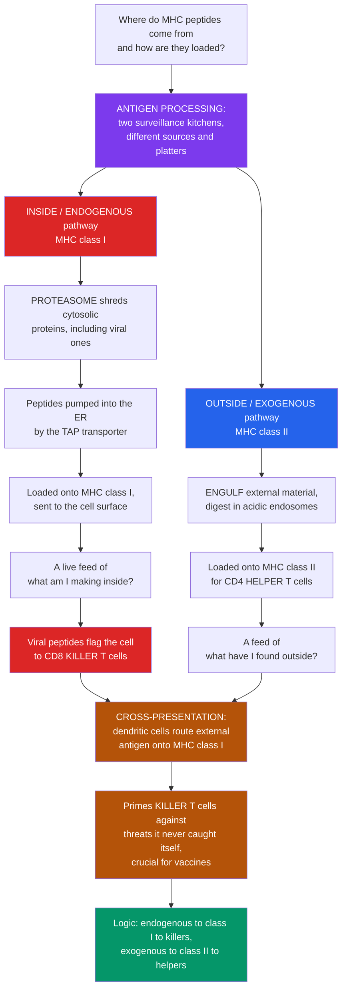

# 🍽️ Antigen Processing and Presentation

> [!abstract] TL;DR
> **T cells cannot see whole antigens — only short peptide fragments held up on MHC molecules.** *Antigen processing* is the cell's machinery for chopping proteins into bite-sized peptides and *loading* them onto MHC to serve to T cells. The cell runs **two surveillance kitchens** that sample **different sources** and serve on **different platters**. The **endogenous pathway** samples proteins made *inside* the cell: the **proteasome** shreds cytosolic proteins (including any viral proteins a virus forces the cell to make), the peptides are pumped into the ER by **TAP**, loaded onto **MHC class I**, and sent to the surface — a live feed of *"what am I making inside?"* read by **CD8 killer T cells**. The **exogenous pathway** samples material engulfed from *outside*: antigen-presenting cells digest it in acidic endosomes and load the peptides onto **MHC class II** for **CD4 helper T cells** — a feed of *"what have I found in my environment?"* A clever exception, **cross-presentation**, lets dendritic cells route external antigens onto MHC class I to prime killer T cells against viruses and tumors they were never infected by — the mechanism behind many vaccines. This division — **endogenous → class I → killers, exogenous → class II → helpers** — is what lets T cells tell an internal threat (destroy the cell) from an external one (mobilize help).

---

## Intuition

**Analogy first — two surveillance kitchens, each sampling a different source and serving on a different platter.**

MHC molecules are **display platforms** that hold up little peptide fragments for T cells to inspect (that is the job of [[The_Major_Histocompatibility_Complex]]). But a platform is useless without something to display, and a raw protein is far too big to fit. So the real question is: *where do the peptide fragments come from, and how do they get onto the platform?* That preparation-and-serving job is **antigen processing and presentation**.

Picture the cell as a restaurant running **two independent kitchens**, each obsessed with a different question. The first kitchen asks *"what am I cooking inside my own building right now?"* — the **inside / endogenous** kitchen. It constantly grabs samples of the proteins the cell is making in its own cytoplasm, runs them through a molecular **shredder** (the **proteasome**), pumps the shreds into a back room (the ER, via a conveyor called **TAP**), plates them on **MHC class I** platters, and carries those platters out to the front window — the cell surface. Because this kitchen samples the cell's *own* production line, if a **virus** has hijacked the cell and is forcing it to churn out viral proteins, fragments of those viral proteins land on the platters too. **CD8 killer T cells** patrolling outside read the class I platters and, on seeing a viral fragment, conclude *"this cell is infected"* and destroy it.

The second kitchen asks *"what have I found lying around outside?"* — the **outside / exogenous** kitchen, run only by professional **antigen-presenting cells** like dendritic cells. It **engulfs** debris, bacteria, and loose proteins from the environment, digests them in acidic vats (**endosomes and lysosomes** full of proteases), plates the fragments on **MHC class II** platters, and serves them to **CD4 helper T cells** — the coordinators who then mobilize the rest of the immune response.

And there is one clever crossover. Sometimes a dendritic cell that was *never itself infected* still needs to alert the killer T cells about a virus circulating nearby. So it does something unusual: it takes material it **engulfed from outside** and routes it onto **MHC class I** platters — the "wrong" kitchen's platter. This **cross-presentation** is how the immune system primes killers against pathogens and tumors the presenting cell never caught, and it is exactly why many **vaccines** work. Understanding these two kitchens — and the crossover — is understanding how the cell prepares and serves the molecular information that drives the entire T-cell response.

---

## How It Works

### Core Mechanics

1. **The constraint that forces the whole system.** Unlike antibodies (see [[Antibody_Structure_and_Function]]), a T-cell receptor cannot bind a whole folded antigen. It only recognizes a short **peptide** bound in the groove of an **MHC** molecule. So every protein a T cell will ever "see" must first be **degraded into peptides** and **loaded onto MHC** — processing and presentation.
2. **Two pathways for two questions.** The cell separates *"made inside"* from *"came from outside,"* and hands each to a different MHC class. This routing is the core logic.
3. **Endogenous pathway — step by step (MHC class I).** (i) The **proteasome** (and the interferon-induced **immunoproteasome**) continuously degrades cytosolic and misfolded proteins — including **defective ribosomal products (DRiPs)** and any **viral** or **tumor** proteins — into short peptides. (ii) The **TAP** transporter pumps these peptides from the cytosol into the **endoplasmic reticulum**. (iii) Inside the ER, the **peptide-loading complex** (**tapasin**, **calreticulin**, **ERp57**, plus ERAAP peptide trimming) helps load an optimally fitting peptide onto a nascent **MHC class I** molecule. (iv) The loaded class I travels to the **cell surface**, where **CD8 cytotoxic T cells** inspect it. Purpose: broadcast the intracellular proteome for cytotoxic surveillance.
4. **Exogenous pathway — step by step (MHC class II).** (i) A professional APC **endocytoses or phagocytoses** extracellular material. (ii) Acidic **endosomal/lysosomal proteases** (**cathepsins**) chew the antigen into peptides. (iii) Meanwhile **MHC class II** is synthesized with its groove plugged by the **invariant chain (Ii)**, which is trimmed down to a remnant called **CLIP**; in the **MIIC** compartment, **HLA-DM** catalyzes exchange of CLIP for a high-affinity antigenic peptide. (iv) The loaded class II reaches the surface for **CD4 helper T cells**. Purpose: alert the coordinators to extracellular threats.
5. **Cross-presentation — the important exception.** **Dendritic cells** divert *exogenous* antigen into the *class I* pathway, priming **CD8 T cells** against pathogens and tumors that never infected the DC itself (**cross-priming**). This is essential for CTL responses to many viruses, for tumor immunity, and for the design of many [[Vaccines_and_Antibiotics|vaccines]].
6. **Who presents.** **Professional APCs** — **dendritic cells** (the key primers of naive T cells), **macrophages**, and **B cells** — express MHC class II plus costimulation. Nearly *all* nucleated cells express MHC class I. Dendritic cells are the critical bridge from innate detection to adaptive activation.
7. **Immunodominance — a multi-step filter.** Only a minority of a protein's possible peptides ever get presented. Each stage — **proteasomal cleavage preference**, **TAP transport efficiency**, **MHC-binding affinity** — filters the pool, so a few epitopes dominate the response. This multiplicative filter is what epitope-prediction tools model.

### Flow / Architecture



---

## Key Concepts

### Secondary (the big picture)

- **T cells read fragments, not whole antigens.** A T cell can only recognize a short peptide displayed on an MHC platform. So every protein must first be **cut up** (processing) and **loaded** onto MHC (presentation).
- **Two kitchens, two sources.** The **inside** pathway samples proteins the cell makes itself and shows them on **MHC class I** to **killer T cells**. The **outside** pathway samples engulfed material and shows it on **MHC class II** to **helper T cells**.
- **Why the split matters.** It lets a T cell tell apart an **internal** threat — *"a virus is being made inside this cell, destroy it"* — from an **external** one — *"something bad is out here, call in help."*
- **The shredder and the digester.** Inside proteins are shredded by the **proteasome**; engulfed proteins are digested in **acidic vesicles**. Different machines for different sources.
- **The clever crossover.** Dendritic cells can put **outside** antigen onto **class I** to warn the killers about threats they never caught — **cross-presentation**, the basis of many vaccines.

### Undergraduate (the mechanisms)

- **The endogenous (class I) assembly line:** `cytosolic protein -> proteasome/immunoproteasome -> peptide -> TAP into the ER -> peptide-loading complex (tapasin, calreticulin, ERp57) -> MHC class I -> surface -> CD8 T cell`. Samples the **intracellular** proteome; peptides are typically **8–10 residues** (constrained by a closed groove).
- **The exogenous (class II) assembly line:** `endocytosis/phagocytosis -> acidic endosome -> cathepsins -> MIIC compartment, invariant chain -> CLIP, HLA-DM exchange -> MHC class II -> surface -> CD4 T cell`. Samples **extracellular** material; peptides are **longer and ragged** (open-ended groove).

| Feature | MHC class I pathway | MHC class II pathway |
|---|---|---|
| Antigen source | endogenous (cytosolic, viral, tumor) | exogenous (engulfed, extracellular) |
| Degrading machine | proteasome / immunoproteasome | endosomal cathepsins |
| Transport / loading | TAP into ER; tapasin-led loading | invariant chain / CLIP / HLA-DM in MIIC |
| Presented to | CD8 cytotoxic T cells | CD4 helper T cells |
| Expressed by | nearly all nucleated cells | professional APCs (DC, macrophage, B cell) |

- **The invariant chain trick.** MHC class II is made in the ER *alongside* class I, but must **not** grab ER peptides meant for class I. The **invariant chain** plugs its groove until it reaches the endosome, where it is trimmed to **CLIP** and swapped for real antigen by **HLA-DM** — an elegant compartmental sorting solution (built on the machinery of [[The_Endomembrane_System]]).
- **Cross-presentation, mechanistically.** DCs shuttle engulfed antigen from phagosomes into (or in contact with) the cytosol/proteasome/TAP route, or load it in specialized endosomes, delivering exogenous peptides onto **class I** to achieve **cross-priming** of CD8 T cells.
- **Immunodominance.** The response focuses on a few epitopes because presentation is a **serial filter**: a peptide must be *generated* by the proteasome, *transported* by TAP, and *bind* MHC with high enough affinity. Failing any stage removes it from view.

### Graduate (the integration and its subtleties)

- **Why class I is a "live feed."** Because the proteasome samples newly synthesized and rapidly degraded proteins (including **DRiPs**), MHC class I reports the *current* translational state of the cell with minimal lag — the feature that makes it a real-time viral alarm and the reason **detection latency** after infection is short but nonzero.
- **Cross-presentation is a cell-biological puzzle.** The **cytosolic** route (phagosome-to-cytosol export, then proteasome/TAP) versus the **vacuolar** route (endosomal proteases loading class I locally) remain actively studied; DC subsets (notably **cDC1 / BATF3-dependent** cells) specialize in it, which is why cDC1s are central to anti-tumor and antiviral CTL priming.
- **Immunoproteasome remodeling.** IFN-γ swaps catalytic subunits to form the **immunoproteasome**, shifting cleavage toward hydrophobic/basic C-termini that fit MHC-I anchors better — inflammation literally **retunes the epitope repertoire** presented.
- **Presentation is necessary but not sufficient.** A peptide-MHC complex only *licenses* recognition; naive T-cell activation still requires **costimulation** and cytokines from a licensed DC. Presentation without costimulation can drive **tolerance/anergy** instead of immunity — the same machinery serves both activation and peripheral tolerance.
- **Immune evasion targets this machinery.** Viruses block **TAP** (herpes simplex ICP47), degrade or retain **MHC-I** (cytomegalovirus US2/US11), or otherwise sabotage loading; tumors **downregulate MHC-I** or the antigen-processing machinery. Total MHC-I loss, however, exposes the cell to [[Natural_Killer_Cells_and_Innate_Lymphoid_Cells|NK cells]] via missing-self — a built-in counter to evasion.
- **Immunoinformatics.** Modern epitope prediction chains **proteasomal-cleavage**, **TAP-affinity**, and **MHC-binding** models (e.g., the NetMHC family) to forecast presented epitopes for vaccine design — a direct computational encoding of the immunodominance filter, and a link to **computational immunology**.

---

## Python Demo

```python
# Antigen processing and presentation, two views:
#   (a) TWO-PATHWAY SOURCING - a cell mixes ENDOGENOUS (cytosolic, incl. viral)
#       and EXOGENOUS (engulfed) proteins. The MHC class I pathway
#       (proteasome -> TAP -> ER) samples the ENDOGENOUS pool; the MHC class II
#       pathway (endosome/lysosome) samples the EXOGENOUS pool. We quantify the
#       SOURCE composition displayed on MHC-I vs MHC-II -> the division of labour.
#   (b) IMMUNODOMINANCE FILTER - predicting which peptides of a viral protein get
#       presented on MHC-I via a multiplicative filter of proteasomal cleavage x
#       TAP transport x MHC-binding affinity. Only a few peptides survive every
#       stage -> the immunodominant epitopes a vaccine would target.
import numpy as np
import matplotlib.pyplot as plt

rng = np.random.default_rng(7)

# ------------------------------------------------------------------
# (a) TWO-PATHWAY SOURCING
# ------------------------------------------------------------------
N = 20000
frac_endo = 0.70                              # most peptides are endogenous
is_endo = rng.random(N) < frac_endo           # True = endogenous, False = exogenous

# Probability a peptide reaches the surface on each MHC class, by source.
# Class I strongly favours ENDOGENOUS; class II strongly favours EXOGENOUS.
# Small cross-terms model cross-presentation (exo -> I) and autophagy (endo -> II).
p_I_given_endo,  p_I_given_exo  = 0.80, 0.06
p_II_given_endo, p_II_given_exo = 0.07, 0.80

p_I  = np.where(is_endo, p_I_given_endo,  p_I_given_exo)
p_II = np.where(is_endo, p_II_given_endo, p_II_given_exo)
on_I  = rng.random(N) < p_I
on_II = rng.random(N) < p_II

def source_split(mask):
    endo = np.sum(mask & is_endo)
    exo  = np.sum(mask & ~is_endo)
    tot  = endo + exo
    return endo / tot, exo / tot

I_endo,  I_exo  = source_split(on_I)
II_endo, II_exo = source_split(on_II)

# ------------------------------------------------------------------
# (b) IMMUNODOMINANCE FILTER along a viral protein
# ------------------------------------------------------------------
L = 300                                       # length of a viral protein
positions = np.arange(L - 8)                  # start positions of 9-mer epitopes
n = positions.size

# Three independent per-peptide scores in [0, 1]
cleavage = np.clip(rng.beta(2, 5, n) + 0.10 * rng.random(n), 0, 1)   # proteasome
tap      = np.clip(rng.beta(2, 4, n) + 0.10 * rng.random(n), 0, 1)   # TAP transport
binding  = np.clip(rng.beta(2, 6, n) + 0.10 * rng.random(n), 0, 1)   # MHC-I affinity

presentation = cleavage * tap * binding       # multiplicative multi-step filter
threshold = np.quantile(presentation, 0.97)   # top few percent = immunodominant
dominant = presentation >= threshold

# Funnel: candidates surviving each cumulative stage (per-stage cutoff 0.5)
s0 = n
s1 = np.sum(cleavage > 0.5)
s2 = np.sum((cleavage > 0.5) & (tap > 0.5))
s3 = np.sum((cleavage > 0.5) & (tap > 0.5) & (binding > 0.5))

# ------------------------------------------------------------------
# Plot
# ------------------------------------------------------------------
fig, (axA, axB) = plt.subplots(1, 2, figsize=(14, 6))

# --- Panel A: source composition on each MHC class ---
labels = ["MHC class I\n(endogenous pathway)", "MHC class II\n(exogenous pathway)"]
endo_vals = [I_endo, II_endo]
exo_vals  = [I_exo,  II_exo]
x = np.arange(2)
axA.bar(x, endo_vals, width=0.55, color="#dc2626",
        label="Endogenous source (cytosolic, incl. viral)")
axA.bar(x, exo_vals, width=0.55, bottom=endo_vals, color="#2563eb",
        label="Exogenous source (engulfed / external)")
for i in range(2):
    axA.text(i, endo_vals[i] / 2, f"{endo_vals[i]*100:.0f}%",
             ha="center", va="center", color="white", weight="bold")
    axA.text(i, endo_vals[i] + exo_vals[i] / 2, f"{exo_vals[i]*100:.0f}%",
             ha="center", va="center", color="white", weight="bold")
axA.set_xticks(x); axA.set_xticklabels(labels)
axA.set_ylabel("Fraction of displayed peptides, by source")
axA.set_title("(a) Two-pathway sourcing: MHC-I shows INSIDE, MHC-II shows OUTSIDE")
axA.set_ylim(0, 1.18)
axA.legend(loc="upper center", fontsize=8)

# --- Panel B: immunodominance filter along the viral protein ---
axB.plot(positions, presentation, color="#6b7280", lw=1.0, alpha=0.8,
         label="Presentation score = cleavage x TAP x binding")
axB.axhline(threshold, color="#b45309", ls="--", lw=1.5,
            label="Immunodominance threshold")
axB.scatter(positions[dominant], presentation[dominant], s=60, color="#dc2626",
            edgecolor="black", zorder=5, label="Predicted presented epitopes")
axB.set_xlabel("Start position of 9-mer along viral protein")
axB.set_ylabel("Predicted MHC-I presentation score")
axB.set_title("(b) Immunodominance = a multiplicative multi-step filter")
axB.legend(loc="upper right", fontsize=8)
axB.grid(alpha=0.25)

plt.tight_layout()
plt.savefig("antigen_processing.png", dpi=120)
plt.show()

# ------------------------------------------------------------------
# Quantify
# ------------------------------------------------------------------
print("Source composition of displayed peptides:")
print(f"  MHC class I : {I_endo*100:5.1f}% endogenous, {I_exo*100:5.1f}% exogenous")
print(f"  MHC class II: {II_endo*100:5.1f}% endogenous, {II_exo*100:5.1f}% exogenous")
print("\nImmunodominance funnel (per-stage cutoff 0.5, cumulative):")
print(f"  candidate 9-mers             : {s0}")
print(f"  survive proteasomal cleavage : {s1}")
print(f"  + survive TAP transport      : {s2}")
print(f"  + survive MHC-I binding      : {s3}")
print(f"  predicted immunodominant (top 3%): {int(np.sum(dominant))}")
```

Panel (a) makes the **division of labour** quantitative: even though the cell's peptide pool is mostly endogenous *and* mostly exogenous material is present, the **MHC class I** display comes out overwhelmingly **endogenous** while the **MHC class II** display comes out overwhelmingly **exogenous** — two distinct repertoires from two pathways sampling two sources (the small cross-fractions are the biological reality of cross-presentation and autophagy). Panel (b) shows why only a handful of peptides ever dominate: **presentation is a product of three independent probabilities**, so a peptide must clear *every* stage — proteasomal cleavage, TAP transport, and MHC binding — to appear as a red **immunodominant epitope**. That multiplicative filter is exactly what vaccine epitope-prediction pipelines compute.

---

## Real-World Applications

> **Vaccine epitope design (the direct payoff).** Because the T-cell response focuses on a few presented peptides, modern **peptide** and **mRNA vaccines** are engineered to encode antigens whose fragments will be processed and presented efficiently. **Cross-presentation** is deliberately exploited: adjuvants and delivery systems are chosen so dendritic cells route the vaccine antigen onto **MHC class I** and prime CD8 killer T cells — the goal for antiviral and cancer vaccines. See [[Vaccines_and_Antibiotics]].

> **Viral immune evasion of processing.** Many [[Viruses|viruses]] survive by sabotaging this machinery: herpes simplex **ICP47** blocks **TAP**, cytomegalovirus **US2/US11** drag MHC-I back out of the ER for destruction, and Epstein–Barr virus limits proteasomal generation of its own epitopes. The evolutionary "back-and-forth" is a hallmark of host–pathogen conflict, and dropping MHC-I to dodge CD8 cells re-exposes the cell to NK-cell missing-self surveillance.

> **Tumor immunology and checkpoint therapy.** Tumors present **neoantigens** (peptides from mutated proteins) on MHC-I; **cross-priming by cDC1 dendritic cells** is now understood to be essential for effective anti-tumor CD8 responses and for the success of checkpoint-blockade immunotherapy. Loss of antigen-processing components (TAP, B2M) is a common resistance mechanism.

> **Immunoinformatics / epitope prediction.** Tools in the **NetMHC / NetMHCpan** family chain models of proteasomal cleavage, TAP affinity, and MHC binding to predict which peptides a given HLA type will present — used for vaccine target selection, neoantigen discovery, and understanding immunodominance, a bridge to **computational immunology**.

> **Transplantation and autoimmunity.** Presentation is central to graft rejection (recipient T cells recognizing donor peptide-MHC via direct and indirect pathways) and to autoimmune disease, where aberrant presentation of self peptides on particular HLA alleles helps drive pathology — the reason HLA type is the strongest genetic risk factor for many autoimmune conditions.

---

## Common Pitfalls

- **"T cells recognize whole antigens like antibodies do."** They do **not**. A T-cell receptor only sees a **processed peptide bound to MHC**. Native, folded antigen is invisible to T cells — the entire processing apparatus exists to satisfy this constraint (contrast with [[Antibody_Structure_and_Function]] and [[T_Cell_and_B_Cell_Receptors]]).
- **Confusing which pathway feeds which class.** The rule is fixed: **endogenous → MHC class I → CD8 cytotoxic**, **exogenous → MHC class II → CD4 helper**. Reversing them inverts who kills and who coordinates.
- **Thinking MHC class I only shows viral/foreign peptides.** Class I constantly displays **self** peptides too; healthy cells show ordinary self fragments, and T cells were tolerized against those during selection. The system is a *complete* feed, not a foreign-only alarm.
- **Treating cross-presentation as the main route.** It is an important **exception**, largely restricted to specialized dendritic cells. Most MHC-I peptides come from the cell's *own* cytosol; assuming everything on class I was cross-presented is wrong.
- **Ignoring the invariant chain / CLIP step.** Students often forget *why* class II does not grab ER peptides. The **invariant chain** plugs the groove until the endosome, where **HLA-DM** swaps **CLIP** for real antigen — omit this and you cannot explain compartmental specificity.
- **Equating presentation with immunity.** A peptide-MHC complex only enables *recognition*. Without **costimulation** from a licensed APC, the same presentation can drive **tolerance/anergy** rather than activation.
- **Forgetting immunodominance is multiplicative.** A peptide binding MHC strongly still will not be presented if the proteasome never generates it or TAP never transports it. Presentation is a **serial AND-gate**, not a single binding step.

---

## Related Concepts

This note lives in the **Immunology** vault's antigen-recognition section. Its sibling notes — developed elsewhere in this vault and referenced here **in prose** — include *The Major Histocompatibility Complex* (the MHC platforms onto which processed peptides are loaded, and the class I / class II distinction this whole pathway serves), *Antibody Structure and Function* (the contrast case: antibodies bind native antigen, T cells only processed peptide-MHC), *T Cell and B Cell Receptors* (the TCR that reads peptide-MHC), *Helper T Cells and T Cell Subsets* (the CD4 cells that read MHC class II output), and *Cytotoxic T Cells and Cell-Mediated Immunity* (the CD8 killers that read MHC class I output). The foundational sibling *Antigens, Epitopes and Immunogenicity* defines the epitopes this machinery generates, and *Cells of the Immune System* introduces the dendritic cells that dominate presentation.

Cross-vault connections (Glob-verified to exist):

- [[The_Adaptive_Immune_System]] — the Biology-vault overview of the B/T-cell response that antigen presentation initiates and directs.
- [[The_Innate_Immune_System]] — dendritic cells and macrophages are innate sentinels; their engulfing-and-presenting role bridges innate detection to adaptive priming.
- [[The_Endomembrane_System]] — the ER, endosomes, lysosomes, and protein-trafficking machinery on which TAP-to-ER loading and endosomal class-II loading physically depend.
- [[Vaccines_and_Antibiotics]] — vaccines work by driving processing and (often cross-) presentation to prime protective T-cell responses.
- [[Viruses]] — the intracellular pathogens whose proteins the endogenous pathway broadcasts, and which evolved elaborate evasion of processing.

---

## Review Questions

1. **(Secondary)** In your own words, why must a cell "chop up" a protein before a T cell can respond to it, and how do the *inside* (endogenous) and *outside* (exogenous) kitchens end up serving their peptides to different kinds of T cells?
2. **(Undergraduate)** Trace a **viral** protein made inside an infected cell from synthesis to recognition, naming the machine at each step: proteasome, TAP, peptide-loading complex, MHC class I, and the T cell that reads it. Then contrast this with the fate of a **bacterial** protein engulfed by a dendritic cell.
3. **(Undergraduate scenario)** A dendritic cell is **not** infected by a virus, yet it needs to activate CD8 killer T cells against that virus. Explain the mechanism that makes this possible, why it is considered an "exception" to the usual pathway logic, and why it matters for vaccine design.
4. **(Graduate)** MHC class I and class II are both made in the ER, yet class II must avoid loading ER peptides destined for class I. Explain the invariant-chain / CLIP / HLA-DM solution, and how it enforces compartmental specificity.
5. **(Graduate trade-off)** Immunodominance means only a few of a pathogen's peptides drive the T-cell response. Explain how proteasomal cleavage, TAP transport, and MHC-binding affinity combine as a **multiplicative filter** to produce immunodominance, and discuss one consequence for (a) vaccine epitope selection and (b) viral immune evasion.

---

## Sources

- Murphy, K. & Weaver, C. (2022). *Janeway's Immunobiology*, 10th ed. Garland Science / W. W. Norton. (Antigen processing and presentation; MHC class I and II pathways.)
- Abbas, A. K., Lichtman, A. H. & Pillai, S. (2021). *Cellular and Molecular Immunology*, 10th ed. Elsevier. (Chapter on antigen processing and presentation to T lymphocytes.)
- Blum, J. S., Wearsch, P. A. & Cresswell, P. (2013). "Pathways of antigen processing." *Annual Review of Immunology* 31, 443–473. https://doi.org/10.1146/annurev-immunol-032712-095910
- Rock, K. L., Reits, E. & Neefjes, J. (2016). "Present yourself! By MHC class I and MHC class II molecules." *Trends in Immunology* 37(11), 724–737. https://doi.org/10.1016/j.it.2016.08.010
- Joffre, O. P., Segura, E., Savina, A. & Amigorena, S. (2012). "Cross-presentation by dendritic cells." *Nature Reviews Immunology* 12(8), 557–569. https://doi.org/10.1038/nri3254

---

#immunology #antigen-processing #antigen-presentation #cross-presentation #proteasome
