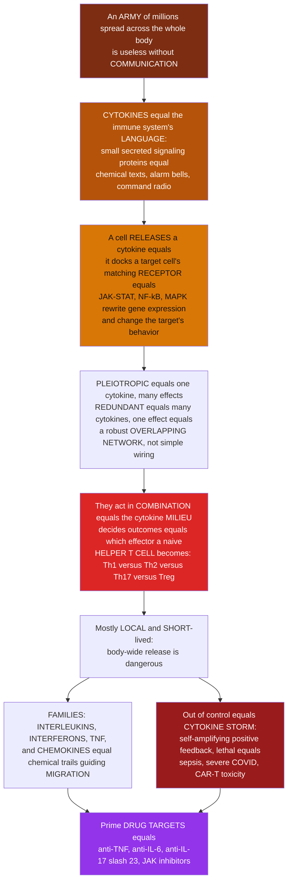

# 📣 Cytokines and Immune Signaling

> [!abstract] TL;DR
> An army of millions of soldiers scattered across the whole body is useless without a way to **talk** — and **cytokines are the immune system's language**. They are small, secreted (or membrane-bound) **signaling proteins** that one cell releases to change the behavior of another: *come here, attack, multiply, become this kind of cell, stand down*. A cytokine drifts to a target cell carrying the matching **receptor**, docks, and triggers intracellular signaling — most famously the **JAK–STAT** pathway (also **NF-κB** and **MAPK**) — that rewrites the target's **gene expression** and behavior. Three properties make them powerful and dangerous: they are **pleiotropic** (one cytokine does many different things to different cells), **redundant** (different cytokines do the same thing), and **combinatorial** — it is the overall **cytokine milieu**, not any single signal, that determines outcomes, most strikingly deciding what kind of effector a naive **helper T cell** becomes (Th1 vs Th2 vs Th17 vs Treg). They act mostly **locally and briefly**, because unleashing them body-wide is lethal: when production spirals into a self-amplifying feedback loop you get a **cytokine storm** (sepsis, severe COVID-19, CAR-T therapy). The major families — **interleukins**, **interferons**, **tumor necrosis factor (TNF)**, **chemokines** (which lay chemical trails guiding cell **migration**), and growth factors — are among the most important drug targets in medicine, from **anti-TNF** biologics that revolutionized autoimmune disease to **JAK inhibitors**.

---

## Intuition

**Analogy first — the command-and-control radio network of a scattered army.**

Imagine you command an army of a hundred million soldiers, but they are not massed on a single battlefield. They are spread thin across an entire continent — some patrolling the borders (skin and gut), some garrisoned in fortresses (lymph nodes), most drifting through the supply lines (blood and lymph). Individually each soldier is capable, but scattered like this the army is **useless** unless the soldiers can **talk to each other**: sound an alarm when a border is breached, call reinforcements to the exact spot, issue the order to attack or to hold fire, and tell fresh recruits what kind of specialist to become. Without communication you do not have an army — you have a hundred million confused individuals.

**Cytokines are that communication network.** They are the immune system's chemical **text messages, alarm bells, and command-and-control radio** — small proteins a cell secretes to send a message to other cells. A macrophage that finds bacteria at a wound shouts *"trouble here!"* by releasing cytokines. Those messages drift outward and are heard only by cells carrying the matching **receiver** — the specific cell-surface **receptor** for that cytokine. When a message is received, it changes the target's behavior: blood-vessel cells become sticky so more soldiers can climb out of the bloodstream, distant reinforcements start marching toward the wound, nearby cells raise their defenses, and the fever centers in the brain turn up the heat.

Now the subtle, powerful part. This is not a neat one-message-one-meaning system. Cytokines are **pleiotropic** — a single cytokine can say very different things to different cells (the same shout means *"multiply!"* to one cell and *"grow up and specialize!"* to another). They are **redundant** — several different cytokines can carry the *same* order, so knocking one out rarely silences the message. The result is a **robust, overlapping web**, not brittle point-to-point wiring. And crucially, cytokines act in **combination**: it is the overall **mixture in the air** — the "**cytokine milieu**" — that determines the outcome, not any single molecule. The most famous example: a naive **helper T cell** sniffs the local cocktail of cytokines and, based on that recipe, **commits its entire career** — becoming a Th1, Th2, Th17, or regulatory cell (link to helper T-cell subsets). The messaging environment *decides what the soldier becomes.*

Because these signals are so potent, they are deliberately kept **local and brief** — a whispered order to the next room, not a broadcast to the whole continent. Broadcasting is dangerous. When cytokine production loses its brakes and starts feeding on itself — cytokines activating cells that make *more* cytokines that activate *more* cells — you get a **cytokine storm**: a runaway alarm that no one can switch off, causing catastrophic inflammation, organ failure, and death. This is a lethal feature of **sepsis**, **severe COVID-19**, and even a side effect of powerful **immunotherapies** like CAR-T cells. The messengers that coordinate the army can, unrestrained, make it destroy the body it defends.

The families of these messengers each have a job: **interleukins** (IL-1, IL-2, IL-6…) are the broad general-purpose vocabulary; **interferons** are the antiviral alarm; **tumor necrosis factor (TNF)** is a master switch for inflammation; **chemokines** lay down invisible **scent trails** that guide cells to their destination (*"this way to the infection"*); and growth factors control how many soldiers get manufactured. Because cytokines govern nearly everything the immune system does, they are among the most important **drug targets** in all of medicine — blocking TNF transformed the treatment of autoimmune disease, and giving or blocking cytokines is at the heart of modern immunotherapy. To understand cytokines is to understand how millions of scattered cells become a single, coordinated response.

---

## How It Works

### Core Mechanics

1. **What a cytokine is.** A cytokine is a small **secreted (or membrane-bound) signaling protein** that mediates communication between immune cells — and between immune cells and almost every other tissue. They are sometimes called *"the hormones of the immune system,"* but with a key difference: most hormones travel through the whole bloodstream (**endocrine**), whereas most cytokines act **locally** on the secreting cell itself (**autocrine**) or its immediate neighbors (**paracrine**), and only occasionally system-wide (**endocrine**, e.g. IL-6 driving fever and the acute-phase response).
2. **Receptor binding → intracellular signaling → new gene expression.** A cytokine has no effect unless the target cell displays the matching **cell-surface receptor**. Binding clusters the receptor and switches on an intracellular cascade. The signature cytokine pathway is **JAK–STAT**: receptor-associated **Janus kinases (JAKs)** phosphorylate **STAT** transcription factors, which dimerize, enter the nucleus, and switch genes on. Other cytokines signal through **NF-κB** (the master inflammatory switch, used by IL-1 and TNF) or **MAPK** cascades. The end result is always **altered gene expression and altered behavior** — the target cell migrates, proliferates, differentiates, secretes its own cytokines, or dies.
3. **Potency and regulation.** Cytokines are active at **vanishingly small concentrations** (picomolar), which is exactly why they must be tightly controlled: short half-lives, short diffusion range, decoy and soluble receptors, and negative-feedback inhibitors (e.g. **SOCS** proteins that shut down JAK–STAT). *Local and brief* is a safety feature.
4. **The five defining properties.** These make the cytokine network robust but hard to reason about:
   - **Pleiotropy** — one cytokine exerts **different effects on different target cells** (IL-4 tells B cells to switch antibody class *and* tells T cells to become Th2).
   - **Redundancy** — **multiple cytokines share overlapping effects** (IL-2, IL-4, IL-7, IL-15 all promote lymphocyte growth), so no single knockout silences the message.
   - **Synergy and antagonism** — cytokines act in **combination**, amplifying or cancelling each other (IFN-γ and TNF synergize; IL-10 antagonizes inflammatory cytokines).
   - **Cascade induction** — one cytokine **induces others** (IL-1 → IL-6 → acute-phase response), forming relays.
   - **Context — the "cytokine milieu."** Because of the above, the **combination and context** determines the outcome, not any single molecule. This is the deep principle behind T-cell fate decisions.
5. **The major families (functional overview).**
   - **Interleukins (IL-1 through IL-40+)** — a huge, functionally diverse group named roughly in order of discovery: **IL-2** (T-cell growth), **IL-4/IL-5/IL-13** (Th2, allergy, eosinophils), **IL-6** (inflammation, fever, acute-phase proteins), **IL-1 & IL-18** (inflammasome outputs), **IL-10 & TGF-β** (regulatory, anti-inflammatory), **IL-12 & IL-23** (drive Th1 and Th17), **IL-17** (the Th17 effector).
   - **Interferons** — **type I** (IFN-α/β, direct antiviral) and **type II** (IFN-γ, activates macrophages, drives Th1).
   - **Tumor necrosis factor (TNF) family** — **TNF-α**, the master proinflammatory signal; also **Fas ligand** and others driving apoptosis.
   - **Colony-stimulating & hematopoietic growth factors** — **G-CSF, GM-CSF, EPO** — control production of blood and immune cells.
   - **Transforming growth factor-β (TGF-β)** — immunoregulation, tissue repair, fibrosis.
   - **Chemokines (chemotactic cytokines)** — the **CXC** and **CC** families (e.g. **CXCL8/IL-8**, **CCL2**) create concentration **gradients** that direct leukocyte **migration**, homing, and positioning — *the immune system's GPS*.
6. **What cytokines actually do in immunity.** Orchestrate **inflammation**; direct cell **recruitment and trafficking** (chemokines); control **hematopoiesis** (growth factors); drive **proliferation and differentiation** — most importantly the **polarization** of a naive helper T cell into an effector subset by the surrounding cytokine environment; **activate effectors** (IFN-γ supercharging macrophages); and enforce **regulation and resolution** so the response ends (IL-10, TGF-β).
7. **When it breaks — dysregulation and disease.** The **cytokine storm / cytokine release syndrome** is uncontrolled **positive-feedback** cytokine production → hyperinflammation, vascular leak, shock, and organ failure (seen in **sepsis**, **severe COVID-19**, **CAR-T therapy**, and hemophagocytic lymphohistiocytosis, HLH). Chronic cytokine **excess** drives **autoimmune and inflammatory disease** (TNF, IL-6, IL-17, IL-23 in rheumatoid arthritis, inflammatory bowel disease, psoriasis). Cytokine or receptor **deficiency** causes **immunodeficiency** (e.g. loss of the common γ-chain, shared by many interleukin receptors, causes severe combined immunodeficiency).
8. **Cytokines as drugs and drug targets.** Because they control so much, cytokines and their receptors are premier therapeutic targets. **Cytokine drugs**: IL-2, interferons, G-CSF, EPO. **Anti-cytokine biologics** that transformed medicine: **anti-TNF** (adalimumab, infliximab), **anti-IL-6R** (tocilizumab, also used for CAR-T cytokine storm), **anti-IL-17/IL-23** (psoriasis), and small-molecule **JAK inhibitors** that block the shared signaling node downstream of many cytokine receptors.

### Flow / Architecture



---

## Key Concepts

### Secondary (the big picture)

- **Cells need to talk.** Millions of immune cells scattered across the body are useless without a way to communicate. **Cytokines are the messages** — small proteins one cell releases to change what another cell does.
- **A message needs a receiver.** A cytokine only affects a cell that carries the matching **receptor**. No receiver, no message received.
- **The messages are simple orders.** *Come here, attack, multiply, become this kind of cell, stand down.* Chemokines specifically mean *"this way — follow the scent trail to the infection."*
- **The mix matters, not one molecule.** It is the whole **cocktail of cytokines** in a spot that decides what happens — most dramatically, deciding what kind of cell a young **helper T cell** grows up to be.
- **Kept local for safety.** Cytokines usually whisper to nearby cells and fade fast, because shouting to the whole body is dangerous.
- **The storm.** When the shouting feeds on itself and cannot be switched off, you get a **cytokine storm** — a runaway alarm that can be deadly (severe infections, severe COVID-19).
- **Great drug targets.** Because cytokines run the show, blocking one (like **TNF**) can treat serious diseases such as rheumatoid arthritis.

### Undergraduate (the mechanisms)

- **Modes of action.** **Autocrine** (a cell signals itself, e.g. T cells making IL-2 and responding to it), **paracrine** (neighbors), **endocrine** (rare, system-wide, e.g. IL-6 driving fever). The dominance of autocrine/paracrine is *why* range and half-life are short.
- **The JAK–STAT pathway (the signature cytokine route).** Cytokine → receptor dimerization → receptor-associated **JAKs** trans-phosphorylate each other and the receptor tail → **STATs** dock, get phosphorylated, dimerize → nucleus → transcription. Different cytokines use different JAK/STAT combinations, giving specificity. Negative feedback via **SOCS** proteins terminates the signal. (IL-1 and TNF instead signal mainly through **NF-κB**.)
- **The five properties, mechanistically.** Pleiotropy and redundancy arise because receptors **share subunits** (the common **γ-chain** for IL-2/4/7/9/15/21; the **gp130** subunit for IL-6-family) and downstream nodes (JAK–STAT), so signals overlap and cross-cover.
- **Functional map of key cytokines:**

| Cytokine | Main source | Headline function |
|---|---|---|
| **IL-1 / IL-18** | macrophages (inflammasome) | fever, inflammation, IL-18 → IFN-γ |
| **IL-2** | T cells | T-cell proliferation; also Treg maintenance |
| **IL-4 / IL-5 / IL-13** | Th2, mast cells | Th2/allergy, IgE, eosinophils |
| **IL-6** | macrophages, many cells | inflammation, fever, acute-phase, Th17 |
| **IL-10 / TGF-β** | Treg, macrophages | **anti-inflammatory / resolution** |
| **IL-12 / IL-23** | dendritic cells | drive **Th1 / Th17** |
| **IL-17** | Th17 | recruit neutrophils, antifungal, autoimmunity |
| **IFN-γ** | Th1, NK cells | **activate macrophages**, boost MHC |
| **TNF-α** | macrophages | master **proinflammatory** switch |
| **CXCL8 (IL-8) / CCL2** | many cells | **chemotaxis** of neutrophils / monocytes |

- **Chemokines and directed migration.** Chemokines are a specialized cytokine subfamily whose job is **chemotaxis**: they form a **concentration gradient**, highest at the source (e.g. an infection), and leukocytes crawl **up the gradient** by sensing which side of the cell sees more chemokine — the molecular basis of recruitment and homing to lymphoid organs.
- **T-cell polarization — the milieu decides.** A naive CD4⁺ T cell that is being activated reads the local cytokines and commits: **IL-12 → Th1**, **IL-4 → Th2**, **IL-6 + TGF-β → Th17**, **TGF-β alone → Treg**. Same starting cell, different environment, different fate — the clearest illustration of "the milieu decides."
- **Cytokine storm as a systems failure.** Normally inflammation is a **negative-feedback**–regulated pulse. A storm is what happens when a **positive-feedback loop** (cytokines → activated cells → more cytokines) overwhelms the brakes and crosses a **tipping point** into runaway hyperinflammation.

### Graduate (the depth and subtleties)

- **Receptor subunit sharing explains pleiotropy/redundancy quantitatively.** Type-I cytokine receptors are modular: a **shared signaling subunit** (γc, βc, or gp130) pairs with cytokine-specific α-chains. Because the shared chain triggers the same JAKs/STATs, distinct cytokines converge on overlapping transcriptional programs (**redundancy**), while one cytokine's receptor is expressed on many cell types, each with a different chromatin landscape, producing **pleiotropy**. This modularity is also why blocking a *shared* node (JAK inhibitors, anti-gp130) has broad effects while blocking one cytokine (anti-TNF) is narrower.
- **STAT combinatorics encode identity.** Which STATs are activated (STAT1 for IFNs, STAT4 for IL-12/Th1, STAT6 for IL-4/Th2, STAT3 for IL-6/IL-23/Th17, STAT5 for IL-2) largely defines the resulting T-helper program. T-cell polarization is thus a **cytokine → JAK → STAT → master-transcription-factor** (T-bet, GATA3, RORγt, FoxP3) decision, with cross-antagonism between programs making the choice switch-like and self-reinforcing.
- **The milieu as a computation.** Because effects are combinatorial (synergy/antagonism) and self-reinforcing (each subset secretes cytokines that promote itself and suppress the others), the cytokine environment behaves like a **multistable dynamical system**: small differences in the initial cocktail are amplified into discrete, stable effector states. This is polarization as a **bistable/multistable switch**, not a linear readout.
- **Cytokine storm = loss of a stable low-inflammation fixed point.** Formally, if cytokine production is a saturating (Hill) function of cytokine level and clearance/regulation is linear, the system can be **bistable**: a low, healthy fixed point and a high, pathological one, separated by an unstable **threshold**. A sufficiently large trigger (or weakened regulation, e.g. impaired IL-10/SOCS, or CAR-T–driven macrophage activation releasing IL-6) pushes the system past the threshold into the high state — a **tipping point**, not a smooth escalation. This is why anti-IL-6R (tocilizumab) can abort CRS: it lowers the feedback gain below the tipping threshold.
- **Redundancy is a robustness/therapeutics trade-off.** Redundancy makes the network **fault-tolerant** (single-gene loss rarely abolishes a function) but complicates drug design (blocking one cytokine may be compensated by another). Successful biologics tend to hit **non-redundant bottlenecks** — TNF and IL-6 sit at hubs where redundancy is low, which is part of why anti-TNF and anti-IL-6 are so effective.
- **Spatial signaling and quorum-like control.** Because cytokines are short-range, the immune response is **spatially structured**: paracrine niches (e.g. IL-2 consumption by Tregs locally starving effector T cells) implement local control. IL-2 "sink" dynamics and chemokine gradients turn diffusible signals into **positional information**, analogous to morphogen gradients in development.
- **Therapeutic frontiers.** Beyond blockade: **engineered/orthogonal IL-2** ("muteins") biased toward effector vs regulatory T cells for cancer vs autoimmunity; **cytokine fusion proteins** and localized delivery to overcome the toxicity of systemic cytokines; and **JAK inhibitors** as broad but manageable dampers of multiple cytokine axes at once. The design problem is always: exploit the network's leverage points without triggering its instabilities.

---

## Python Demo

```python
# Cytokines and immune signaling, illustrated two ways:
#   (a) CHEMOKINE GRADIENT + CHEMOTAXIS: chemokines are the immune system's GPS.
#       An infection at the origin secretes a chemokine that diffuses outward into a
#       CONCENTRATION GRADIENT (highest at the source). Immune cells scattered at the
#       periphery perform CHEMOTAXIS -- a biased random walk UP the local gradient --
#       and home in on the infection. We plot their converging trajectories over the
#       chemokine field: how a diffusible signal turns into directed traffic.
#   (b) CYTOKINE STORM as a POSITIVE-FEEDBACK TIPPING POINT: cytokines activate cells
#       that make MORE cytokines. Model cytokine level C(t) with saturating (Hill)
#       feedback production minus linear clearance/regulation. The system is BISTABLE:
#       a healthy low state and a lethal high (storm) state separated by a THRESHOLD.
#       A small trigger resolves; a trigger past the threshold runs away -- a tipping
#       point, not a smooth escalation. We overlay several triggers + the phase line.
import numpy as np
import matplotlib.pyplot as plt

rng = np.random.default_rng(7)

# ===========================================================================
# (a) CHEMOKINE GRADIENT + CHEMOTAXIS
# ===========================================================================
source = np.array([0.0, 0.0])     # infection site: chemokine source
lam    = 6.0                       # chemokine diffusion length scale (cell diameters)

def chemokine(x, y):
    """Steady-state paracrine chemokine concentration from a point source."""
    r = np.hypot(x - source[0], y - source[1])
    return np.exp(-r / lam)

def grad_unit_and_mag(pos):
    """Unit vector pointing UP the gradient (toward source) and gradient magnitude."""
    d = source - pos
    r = np.hypot(*d) + 1e-9
    toward = d / r                        # unit vector toward the source
    mag = (1.0 / lam) * np.exp(-r / lam)  # |grad| of exp(-r/lam): steeper near source
    return toward, mag

n_cells, n_steps, step = 12, 260, 0.35
chemotaxis_gain, noise = 45.0, 0.9

# start cells on a ring at the periphery
theta0 = np.linspace(0, 2*np.pi, n_cells, endpoint=False)
starts = np.column_stack([16*np.cos(theta0), 16*np.sin(theta0)])
tracks = [np.zeros((n_steps, 2)) for _ in range(n_cells)]

for i in range(n_cells):
    pos = starts[i].copy()
    for t in range(n_steps):
        tracks[i][t] = pos
        toward, mag = grad_unit_and_mag(pos)
        # biased random walk: drift up the gradient (bias grows where gradient is steep)
        # plus isotropic exploratory noise
        bias = chemotaxis_gain * mag * toward
        rand = noise * rng.standard_normal(2)
        v = bias + rand
        v = v / (np.hypot(*v) + 1e-9)      # normalize to a unit heading
        pos = pos + step * v
        if np.hypot(*(pos - source)) < 0.6:  # reached the infection
            tracks[i] = tracks[i][:t+1]
            break

# ===========================================================================
# (b) CYTOKINE STORM: positive-feedback bistability + tipping point
# ===========================================================================
# dC/dt = p * Hill(C) - d * C     Hill(C) = C^n / (K^n + C^n)
p, K, n_hill, d = 1.0, 1.0, 4, 0.5   # production, half-max, cooperativity, clearance
def dCdt(C):
    return p * C**n_hill / (K**n_hill + C**n_hill) - d * C

# integrate several initial triggers (immune insults of different sizes)
T, dt = 40.0, 0.01
tgrid = np.arange(0, T, dt)
triggers = [0.4, 0.8, 0.95, 1.05, 1.3, 1.8]   # threshold sits near C = 1.0
curves = []
for C0 in triggers:
    C = C0; hist = np.empty_like(tgrid)
    for k, _ in enumerate(tgrid):
        hist[k] = C
        C = max(C + dCdt(C) * dt, 0.0)
    curves.append(hist)

# phase line f(C): zeros are fixed points; the middle one is the tipping threshold
Cscan = np.linspace(0, 2.2, 600)
f = dCdt(Cscan)

# ===========================================================================
# Plot
# ===========================================================================
fig, (axA, axB) = plt.subplots(1, 2, figsize=(14, 6))

# --- (a) chemokine field + chemotaxis trajectories ---
gx = np.linspace(-18, 18, 200); gy = np.linspace(-18, 18, 200)
GX, GY = np.meshgrid(gx, gy)
field = chemokine(GX, GY)
cf = axA.contourf(GX, GY, field, levels=20, cmap="YlOrRd")
plt.colorbar(cf, ax=axA, fraction=0.046, pad=0.04, label="chemokine concentration")
for i in range(n_cells):
    tr = tracks[i]
    axA.plot(tr[:, 0], tr[:, 1], color="#1e3a8a", lw=1.3, alpha=0.9)
    axA.plot(tr[0, 0], tr[0, 1], "o", color="#1e3a8a", ms=4)
axA.plot(*source, "*", color="#111", ms=20, label="infection (chemokine source)")
axA.set_title("(a) Chemokine gradient guides cell MIGRATION (chemotaxis)")
axA.set_xlabel("x (cell diameters)"); axA.set_ylabel("y (cell diameters)")
axA.legend(loc="upper right", fontsize=9); axA.set_aspect("equal")

# --- (b) cytokine storm tipping point ---
for C0, hist in zip(triggers, curves):
    storm = hist[-1] > 1.0
    axB.plot(tgrid, hist, lw=2.4,
             color=("#991b1b" if storm else "#059669"),
             label=f"trigger {C0:.2f} -> {'STORM' if storm else 'resolves'}")
axB.axhline(1.0, color="#334155", ls=":", lw=1.5)
axB.text(T*0.55, 1.03, "unstable THRESHOLD (tipping point)", color="#334155", fontsize=9)
axB.text(T*0.62, 1.72, "high fixed point = CYTOKINE STORM", color="#991b1b", fontsize=9)
axB.text(T*0.62, 0.06, "low fixed point = healthy baseline", color="#065f46", fontsize=9)
axB.set_title("(b) Cytokine storm: a positive-feedback tipping point")
axB.set_xlabel("time"); axB.set_ylabel("cytokine level  C(t)")
axB.legend(loc="center right", fontsize=8); axB.grid(alpha=0.25)

plt.tight_layout()
plt.savefig("cytokines_and_immune_signaling.png", dpi=120)
plt.show()

# ---- Quantify ----
print("(a) CHEMOTAXIS")
reached = sum(np.hypot(*(tr[-1] - source)) < 0.6 for tr in tracks)
print(f"  {reached}/{n_cells} cells reached the infection by climbing the gradient")
print("(b) CYTOKINE STORM (tipping point near C = 1.0)")
for C0, hist in zip(triggers, curves):
    print(f"  trigger {C0:.2f}  ->  final C = {hist[-1]:.2f}  "
          f"({'STORM' if hist[-1] > 1.0 else 'resolves to baseline'})")
```

Panel **(a)** makes chemokines concrete: a single infection at the origin secretes a chemokine that spreads into a **gradient** (bright at the source, fading outward), and immune cells scattered on the periphery **climb that gradient** by biased random walk, their trajectories bending inward and converging on the infection — a diffusible chemical turned into **directed traffic**, the molecular GPS of recruitment. Panel **(b)** captures the danger of the same messaging system: cytokine production feeds back on itself (Hill-shaped) against linear clearance, creating a **bistable** system with a healthy low state and a lethal storm state separated by an unstable **threshold near C = 1**. Triggers below the threshold **resolve** (green); triggers just past it **run away** to the storm state (red). The lesson of the intuition made quantitative — a cytokine storm is a **tipping point**, and lowering the feedback gain (e.g. anti-IL-6R in CAR-T therapy) is what pulls the system back below it.

---

## Real-World Applications

> **Anti-TNF biologics — the drugs that redefined autoimmune disease.** **TNF-α** sits at a low-redundancy hub of the inflammatory network, which is why blocking it is so effective. **Infliximab** and **adalimumab** (monoclonal antibodies) and **etanercept** (a soluble TNF-receptor decoy) revolutionized the treatment of **rheumatoid arthritis, Crohn's disease, psoriasis, and ankylosing spondylitis** — turning once-crippling diseases into manageable conditions. This is the archetype of "cytokine as drug target," and the reason cytokine biology is central to modern rheumatology and gastroenterology.

> **Tocilizumab and the CAR-T cytokine storm.** **CAR-T cell therapy** can cure refractory leukemias and lymphomas, but the massively activated T cells trigger macrophages to pour out **IL-6**, producing **cytokine release syndrome (CRS)** — the engineered-immunity version of a cytokine storm. **Tocilizumab**, an **anti-IL-6-receptor** antibody, reverses CRS by cutting the feedback gain of the runaway loop. The same drug was deployed against the hyperinflammatory phase of **severe COVID-19**. This is the tipping-point model of Panel (b) turned into a clinical intervention.

> **Chemokine-guided homing and HIV entry.** Chemokines lay the **gradients** that route leukocytes to infections and to specific zones of lymph nodes (T-cell vs B-cell areas). Their receptors are also exploited by pathogens: **HIV** uses the chemokine receptor **CCR5** as its co-receptor to enter T cells. People with a **CCR5-Δ32** deletion are largely resistant to HIV, and **maraviroc** (a CCR5 blocker) is an antiretroviral drug — a direct therapeutic payoff of chemokine-receptor biology.

> **Therapeutic cytokines: G-CSF, EPO, interferons, IL-2.** Given *as drugs*: **G-CSF** (filgrastim) boosts neutrophil production after chemotherapy; **erythropoietin (EPO)** raises red-cell counts; **interferons** treat some viral hepatitis, multiple sclerosis, and cancers; **high-dose IL-2** was an early immunotherapy for melanoma and renal cancer. Their notorious side effects (flu-like symptoms, capillary leak) are exactly what you expect from deliberately broadcasting a normally-local signal system-wide.

> **JAK inhibitors — hitting the shared node.** Because many cytokine receptors funnel through **JAK–STAT**, small-molecule **JAK inhibitors** (tofacitinib, baricitinib, ruxolitinib) dampen *multiple* cytokine axes at once. They treat rheumatoid arthritis, ulcerative colitis, and myelofibrosis, and were used in severe COVID-19 — a strategy that trades the specificity of a single-cytokine biologic for the breadth of blocking the network's convergence point.

---

## Common Pitfalls

- **Treating a cytokine as having one fixed meaning.** Cytokines are **pleiotropic** — the *same* molecule instructs different cells differently depending on their receptors and internal state. "What does IL-4 do?" has no single answer; the correct frame is "what does IL-4 do *to this cell, in this context*." Learn cytokines by **effect-on-target**, not one-line definitions.
- **Assuming one cytokine controls one outcome.** Because of **redundancy and combinatorial action**, no single cytokine acts alone, and knocking one out often changes little (another covers for it). It is the **milieu** — the whole mixture — that determines the result, most visibly in T-cell polarization.
- **Confusing cytokines with antibodies (or with hormones).** All are secreted proteins, but **antibodies** are antigen-specific recognition molecules made by B cells, while **cytokines** are non-antigen-specific signaling proteins that change cell behavior. And unlike classic **hormones**, cytokines act mostly **locally**, not system-wide — forgetting this makes cytokine storms seem mysterious.
- **Thinking a cytokine storm is just "a lot of inflammation."** It is specifically a **positive-feedback runaway past a tipping point**, qualitatively different from a strong but regulated response. Missing this misses *why* it is self-sustaining, why it resists simple dampening, and why cutting the **feedback gain** (anti-IL-6R) rather than merely suppressing symptoms is the rational therapy.
- **Ignoring that cytokines are short-range by design.** Their **local, brief** action is a safety mechanism, enforced by short half-life, decoy receptors, and SOCS feedback. Treating cytokines as freely broadcasting through the body both misrepresents normal physiology and obscures why systemic cytokine *drugs* are so toxic.
- **Conflating chemokines with other cytokines.** Chemokines are a specialized subfamily whose defining job is creating **gradients for directed migration (chemotaxis)**, not general activation. Their receptors are GPCRs, distinct from the JAK–STAT cytokine receptors — and this distinction underlies drugs like maraviroc.
- **Believing "block the cytokine and you fix the disease."** Redundancy means blockade can be compensated; broad blockade (JAK inhibitors, systemic steroids) causes **immunosuppression and infection risk**. Effective therapy targets **non-redundant hubs** (TNF, IL-6) or the network's leverage points, balancing efficacy against the immune functions you are also switching off.

---

## Related Concepts

- [[The_Innate_Immune_System]] — the Biology/11 overview where cytokines first fire: pattern-recognition by macrophages and dendritic cells triggers the inflammatory cytokines (TNF, IL-1, IL-6) and chemokines that launch and shape every downstream response.
- [[The_Adaptive_Immune_System]] — cytokines are the bridge from innate to adaptive immunity and the signals that **polarize** naive helper T cells into Th1/Th2/Th17/Treg; this note supplies the messaging layer that governs adaptive differentiation.
- [[Cell_Signaling_in_Development]] — the general **signal → receptor → intracellular cascade → altered gene expression** logic, and morphogen **gradients** that pattern tissues; cytokine (JAK–STAT) signaling and chemokine gradients are the immune-system instance of these same principles.
- [[The_Cell_Membrane_and_Transport]] — cytokines act entirely through **cell-surface receptors** embedded in the plasma membrane; the receptor-and-transduction machinery this note relies on lives here at the membrane.
- [[Receptors_and_Signal_Transduction_as_Targets]] — the Pharmacology view of why receptors and signaling pathways (including **JAK–STAT**) are druggable; the mechanistic basis for JAK inhibitors and receptor-blocking biologics against cytokines.
- [[Antibodies_and_Biologics]] — the drug class that made anti-cytokine therapy possible: monoclonal antibodies like **infliximab** (anti-TNF) and **tocilizumab** (anti-IL-6R) that neutralize specific cytokines or their receptors.
- [[Feedback_Loops_and_Causality]] — the systems-thinking backbone of the **cytokine storm**: a reinforcing (positive) feedback loop overwhelming its balancing (negative) regulation and crossing a tipping point, exactly the dynamics modeled in Panel (b).

**Sibling notes in this Immunology vault** (deep dives that surround this one): *Innate Immune Recognition and Pattern Receptors* (the sensor layer whose triggering *induces* the inflammatory cytokines and chemokines described here), *Inflammation and the Inflammatory Response* (the tissue-level program that cytokines like TNF, IL-1, and IL-6 orchestrate, and where chemokines recruit the responders), *Interferons and Antiviral Defense* (one cytokine family — the antiviral interferons signaling through JAK–STAT — examined in depth), *Helper T Cells and T Cell Subsets* (where the "cytokine milieu decides fate" principle becomes Th1 vs Th2 vs Th17 vs Treg), and *Cancer Immunotherapy and Checkpoint Inhibitors* (where cytokines are given, blocked, and engineered as therapy — and where CAR-T triggers cytokine-release syndrome).

---

## Review Questions

1. **(Secondary)** Using the "scattered army" analogy, explain why an immune system of millions of cells needs cytokines at all, and give the everyday meaning of three different cytokine "messages" (including what a **chemokine** signal tells a cell to do).
2. **(Undergraduate)** Define **pleiotropy** and **redundancy** and give one example of each. Then explain, using these two properties, why it is the **cytokine milieu** rather than any single cytokine that determines which effector subset a naive helper T cell becomes.
3. **(Undergraduate scenario)** A naive CD4⁺ T cell is activated in a local environment rich in **IL-12**; a second identical cell is activated in an environment rich in **IL-4**. Predict the effector subset each becomes, name the STAT and master transcription factor involved in each case, and explain why the *same* starting cell can have two different fates.
4. **(Graduate)** A patient receiving **CAR-T therapy** develops cytokine release syndrome. Explain the cytokine storm as a **positive-feedback tipping point** (referencing the bistable model), identify the key cytokine driving the loop, and explain mechanistically why **anti-IL-6-receptor** antibody (tocilizumab) reverses it while simply lowering fever would not.
5. **(Graduate trade-off)** Cytokine **redundancy** makes the immune network robust but complicates drug design. Explain this trade-off, and use it to explain why **anti-TNF** and **anti-IL-6** biologics are unusually effective while blocking many other single cytokines is not — and what a **JAK inhibitor** does differently, with its associated cost.

---

## Sources

- Murphy, K. & Weaver, C. *Janeway's Immunobiology*, 9th/10th ed. Garland Science / W. W. Norton. (Ch. 3 induced innate responses and cytokines; Appendix III: cytokines and their receptors.)
- Abbas, A. K., Lichtman, A. H. & Pillai, S. *Cellular and Molecular Immunology*, 10th ed. Elsevier (2021). (Cytokines chapter; effector mechanisms of cell-mediated immunity.)
- O'Shea, J. J., Schwartz, D. M., Villarino, A. V., Gadina, M., McInnes, I. B. & Laurence, A. "The JAK-STAT Pathway: Impact on Human Disease and Therapeutic Intervention." *Annual Review of Medicine* 66:311–328 (2015). https://doi.org/10.1146/annurev-med-051113-024537
- Fajgenbaum, D. C. & June, C. H. "Cytokine Storm." *New England Journal of Medicine* 383:2255–2273 (2020). https://doi.org/10.1056/NEJMra2026131
- Zlotnik, A. & Yoshie, O. "The Chemokine Superfamily Revisited." *Immunity* 36(5):705–716 (2012). https://doi.org/10.1016/j.immuni.2012.05.008

---

#immunology #cytokines #chemokines #cytokine-storm #immune-signaling
