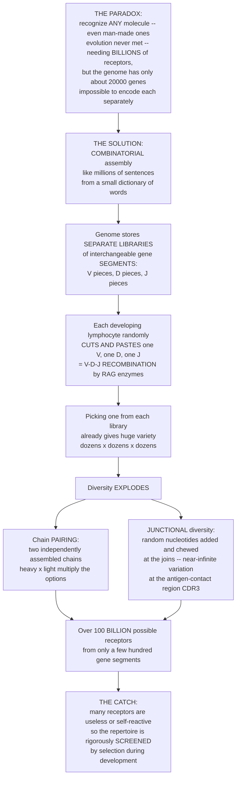

# 🧬 Generation of Receptor Diversity (V(D)J Recombination)

> [!abstract] TL;DR
> The adaptive immune system faces a genuine paradox: it must build **billions** of distinct antigen receptors to recognize essentially *any* molecule — even man-made chemicals evolution never encountered — yet the genome holds only about **20,000 genes**, so it is mathematically impossible to encode each receptor separately. The elegant resolution, a Nobel-winning discovery by **Susumu Tonegawa**, is **combinatorial assembly**: instead of storing complete receptor genes, the genome stores separate **libraries of interchangeable gene segments** — a set of **V** (variable), **D** (diversity), and **J** (joining) pieces — and each developing B or T cell randomly **cuts and pastes** one of each together (**V(D)J recombination**, performed by the **RAG1/RAG2** enzymes) to build one unique receptor gene. Diversity then explodes through **chain pairing** (heavy × light) and, above all, **junctional diversity** (deliberately sloppy joins where random nucleotides are added and chewed off), yielding a theoretical repertoire of **>10¹¹** specificities from only a few hundred segments. The catch: random generation makes many useless or **self-reactive** receptors, so this vast library must be rigorously **screened** during development. V(D)J recombination is the genetic engine of adaptive immunity — how limited DNA generates unlimited recognition.

---

## Intuition

**Analogy first.** Here is a paradox that should stop you in your tracks. Your immune system can build a receptor to recognize almost *any* molecule you can name — including brand-new, man-made chemicals that never existed anywhere in nature, so evolution could not possibly have "pre-designed" a receptor for them. To cover that near-infinite space of possible shapes it needs **billions** of different receptors. But your entire genome contains only about **20,000 genes**. You cannot have a billion genes for a billion receptors — the math simply does not fit. So how does the body build billions of unique receptors from a mere handful of genes?

The answer is one of the most beautiful tricks in all of biology (and it won **Tonegawa the 1987 Nobel Prize**): **combinatorial assembly**. Think of how you can write **millions of different sentences** from a small dictionary of words, or assemble **countless outfits** from a modest wardrobe just by mixing and matching. Instead of storing complete receptor genes, the genome stores **separate libraries of interchangeable gene *segments*** — a rack of **V** pieces, a rack of **D** pieces, and a rack of **J** pieces. As each B or T cell develops, it **randomly cuts and pastes** one V, one D, and one J segment together — that is **V(D)J recombination**, done by the **RAG enzymes** — to build one complete, unique receptor gene.

Just picking one piece from each library already gives huge variety (dozens × dozens × dozens). Then the diversity **explodes** from two further tricks. First, two independently assembled chains (a heavy chain and a light chain) **pair up**, multiplying the options again. Second — and this is the biggest boost — the joins between segments are made **sloppy on purpose**: random extra nucleotides are added and chewed off at the junctions (**junctional diversity**), creating near-infinite variation right at the most important spot, the part of the receptor that actually touches the antigen. The result is a starting repertoire of **over 100 billion (10¹¹)** possible receptors built from a few hundred gene segments. The one catch: random generation inevitably produces many **useless** or **dangerous self-reactive** receptors — so this vast library is then rigorously **screened** during development. Understanding V(D)J recombination is understanding the genetic engine of adaptive immunity: how limited DNA generates unlimited recognition.

---

## How It Works

### Core Mechanics

1. **The diversity problem.** Antigen receptors — the **B-cell receptor / antibody** and the **T-cell receptor** — must collectively recognize essentially any antigen, an estimated ≥10¹¹ distinct specificities. Encoding one gene per receptor is impossible. Tonegawa's discovery (1976–1983) was that the genome is literally **rearranged** in lymphocytes: the DNA in a mature B cell differs from the DNA it inherited.

2. **Segmented gene loci.** The immunoglobulin and TCR loci are not single genes but **arrays of gene segments**: **Variable (V)**, **Diversity (D)**, and **Joining (J)** segments. Chains that need more diversity (antibody **heavy chain**, **TCRβ**) use all three — **V, D, and J**. Chains that need less (antibody **light chain**, **TCRα**) use only **V and J**.

3. **Cutting and pasting.** During lymphocyte development, the **RAG1/RAG2** recombinase selects one segment of each type and joins them into a single, complete **variable-region exon** (V-D-J for heavy chains, V-J for light chains). RAG recognizes flanking **recombination signal sequences (RSS)** and obeys the **12/23 rule** — a segment bordered by a 12-bp-spacer RSS may only join one bordered by a 23-bp-spacer RSS — which enforces the correct segment order and prevents, say, two V's fusing directly.

4. **Cut, then repair.** RAG makes a double-strand break, forming sealed **hairpin** coding ends. These are opened and processed by the general-purpose **non-homologous end joining (NHEJ)** DNA-repair machinery — **Artemis** (opens hairpins), **DNA-PK**, **TdT** (adds nucleotides), and **DNA ligase IV** — which seals the coding joint. V(D)J recombination thus *co-opts* the cell's DNA-repair pathway (see [[Mutations_and_DNA_Repair]]).

5. **Three multiplicative sources of diversity.** **(1) Combinatorial segment diversity** — choosing among many V, D, and J segments. **(2) Combinatorial chain pairing** — a heavy chain and a light chain rearrange *independently*, then pair, multiplying the two repertoires. **(3) Junctional diversity** — the *dominant* source: exonuclease trimming, palindromic **P-nucleotides**, and random **N-nucleotides** added by **terminal deoxynucleotidyl transferase (TdT)** make each junction unique, producing the hypervariable **CDR3** loop that sits at the center of the antigen-binding site.

6. **One cell, one receptor.** **Allelic exclusion** ensures that once one allele rearranges productively, the second is silenced — so each lymphocyte expresses a **single specificity**. This is the molecular basis of **clonal selection**: one cell, one receptor, one antigen.

7. **The cost.** Because the process is random, roughly two-thirds of rearrangements are **out-of-frame** (non-productive), and many in-frame receptors are **self-reactive**. The repertoire must therefore be **screened** by positive and negative selection in the thymus and bone marrow.

### Flow / Architecture



---

## Key Concepts

### Secondary (high-school intuition)

- **The puzzle:** the immune system must recognize an almost unlimited number of molecular shapes — even germs and chemicals that are brand-new — but you only have about 20,000 genes. You cannot have one gene per shape.
- **The trick:** the body keeps **libraries of building-block pieces** (V, D, and J pieces) and **randomly snaps one of each together** to build a receptor. Mixing and matching a few pieces makes a huge number of combinations — like making millions of sentences from a small dictionary.
- **Why so many:** two receptor halves are built separately and **paired**, and the **joins are made deliberately messy**, adding even more variety exactly where the receptor grabs the target.
- **The downside:** because it is random, many receptors come out **broken or dangerous** (attacking your own body), so the body must **test and remove the bad ones** before letting the cell loose.

### Undergraduate

- **Segmented loci.** The Ig heavy-chain locus contains tandem arrays of ~40 functional **V**, ~25 **D**, and 6 **J** segments; light-chain (κ and λ) and TCRα loci lack D segments and use **V-J** only. RAG assembles one complete variable exon per allele.
- **RAG and the 12/23 rule.** **RAG1/RAG2** bind **recombination signal sequences (RSS)** — conserved heptamer/nonamer motifs separated by a 12- or 23-bp spacer. Efficient recombination pairs a 12-RSS with a 23-RSS (**12/23 rule**), enforcing correct segment order (V→D→J).
- **NHEJ finishes the job.** RAG creates hairpin coding ends; **Artemis/DNA-PKcs** open them, **TdT** adds N-nucleotides, and **DNA ligase IV/XRCC4** seals the coding joint. The signal ends form a precise signal joint (often excised as a circle).
- **The three diversity sources, multiplied.** Combinatorial segment choice (heavy ≈ 40×25×6; light ≈ 40×5) × **chain pairing** (heavy × light) × **junctional diversity**. Junctional diversity is the largest contributor and is concentrated in **CDR3**.
- **Frame and productivity.** Junctional indels randomize the reading frame, so only ~1/3 of rearrangements are **in-frame/productive**; the rest are non-functional. Allelic exclusion and successive rearrangement attempts (heavy before light) manage this loss.
- **B-cell-only second wave (foreshadow).** After antigen encounter in the **germinal center**, B cells further diversify their *already-assembled* genes via **somatic hypermutation** (affinity maturation) and **class-switch recombination**, both driven by **AID** — a second, antigen-*dependent* wave of diversity. T cells do **not** do this.

### Graduate

- **Repertoire arithmetic.** Combinatorial + pairing diversity alone yields ~10⁶–10⁷; junctional diversity multiplies this by ~10⁴–10⁶, giving a theoretical BCR repertoire of ~5×10¹³ and TCR repertoires up to ~10¹⁵–10¹⁸. The *realized* repertoire is capped by lymphocyte number (~10¹¹–10¹² cells), so sampling — not gene count — becomes the limiting factor.
- **Ordered, checkpointed rearrangement.** Heavy/β chains rearrange first; a productive chain forms a **pre-BCR/pre-TCR** that signals **allelic exclusion** and licenses light/α rearrangement. Failed rearrangements trigger further attempts (receptor editing on light-chain loci), and cells that never make a functional receptor die by neglect.
- **RSS architecture and RAG as a transposase.** RAG is an evolutionary descendant of a **transposon** (RAG-like sequences persist in *Transib*/ProtoRAG elements); the RSS-directed cut-and-transpose chemistry echoes transposition. Off-target RAG activity at "cryptic RSS" underlies oncogenic **chromosomal translocations** (e.g., *BCL2-IGH* in follicular lymphoma). Contrast this *somatic, site-directed, non-homologous* recombination with the *meiotic, homologous* recombination of classical genetics (see [[Linkage_Mapping_and_Recombination]]).
- **The cost of randomness and the necessity of selection.** ~2/3 non-productive (frame) plus a large fraction self-reactive means most assembled specificities are discarded. **Positive selection** (thymus) keeps only receptors that engage self-MHC usefully; **negative selection** deletes strongly self-reactive clones — the origin of **central tolerance**. Diversity generation and selection are therefore inseparable: the generator is deliberately profligate because the filter is rigorous.
- **Reading the repertoire.** High-throughput **AIRR-seq** (immune-repertoire sequencing) profiles CDR3 spectra to detect clonal expansions (lymphoma clonality), track vaccine/infection responses, and quantify diversity (e.g., via entropy of CDR3 usage). **TdT** is a clinical marker of immature lymphoblasts.

---

## Python Demo

```python
# V(D)J recombination in two panels:
#  (a) COMBINATORIAL DIVERSITY GROWTH -- how a few hundred gene segments
#      generate a >100-billion repertoire once you add chain pairing and
#      junctional diversity ("limited genes, unlimited receptors").
#  (b) JUNCTIONAL (CDR3) DISTRIBUTION + THE COST OF RANDOMNESS -- imprecise
#      joins build a variable CDR3, but ~2/3 of random joins are out-of-frame
#      and self-reactive receptors are later culled by selection.
import numpy as np
import matplotlib.pyplot as plt

rng = np.random.default_rng(7)

# ============================================================
# (a) COMBINATORIAL DIVERSITY GROWTH
# Representative human immunoglobulin segment counts (functional, approx):
# ============================================================
Vh, Dh, Jh = 40, 25, 6        # heavy-chain V, D, J segments
Vl, Jl     = 40, 5            # light-chain V, J segments (no D on light chains)

heavy_combos = Vh * Dh * Jh              # V-D-J assembly of the heavy chain
light_combos = Vl * Jl                   # V-J assembly of the light chain
pairing      = heavy_combos * light_combos    # independent heavy x light pairing
junctional_x = 1e5                       # boost from imprecise junctions (N/P nt, trimming)
total        = pairing * junctional_x

stages = ["Heavy chain\nV*D*J\nsegment combos",
          "+ light chain\npairing\n(heavy x light)",
          "+ junctional\ndiversity\n(sloppy joins)"]
values = [heavy_combos, pairing, total]

# ============================================================
# (b) JUNCTIONAL (CDR3) DIVERSITY + THE COST OF RANDOMNESS
# Simulate imprecise joining at the two heavy-chain junctions (V-D, D-J):
# TdT adds random N-nucleotides; exonuclease trims; P-nucleotides add a few.
# A rearrangement is PRODUCTIVE only if the reading frame is preserved
# (CDR3 nucleotide length divisible by 3) -> ~1/3 survive; selection then
# culls self-reactive/non-functional receptors -> only a fraction remain.
# ============================================================
N       = 200_000
base_nt = 30                                    # germline CDR3 backbone (nt)
n_junc  = 2                                     # heavy chain: V-D and D-J joins
adds    = rng.poisson(4.0, size=(N, n_junc))    # N-nucleotide additions (TdT)
trims   = rng.poisson(3.0, size=(N, n_junc))    # exonuclease nibbling
p_nt    = rng.integers(0, 3, size=(N, n_junc))  # P-nucleotides (0-2)
cdr3_nt = base_nt + (adds + p_nt - trims).sum(axis=1)
cdr3_nt = np.clip(cdr3_nt, 6, None)             # cannot fall below a short stub

in_frame      = (cdr3_nt % 3) == 0              # productive rearrangement
frac_in_frame = in_frame.mean()

# Of in-frame receptors, selection removes non-functional + self-reactive ones:
frac_selfreactive_removed = 0.60                # illustrative central+peripheral cull
frac_usable = frac_in_frame * (1 - frac_selfreactive_removed)

print(f"Combinatorial (segments x pairing): {pairing:.2e} receptors")
print(f"With junctional diversity:          {total:.2e} receptors")
print(f"In-frame (productive) fraction:     {frac_in_frame:.2f}")
print(f"Usable after selection:             {frac_usable:.2f}  "
      f"(most randomly built receptors are discarded)")

# ---------------- Plots ----------------
fig, (ax1, ax2) = plt.subplots(1, 2, figsize=(13, 5))

# Panel (a): explosive diversity growth on a log axis.
colors = ["#7ba7d0", "#f0a460", "#c0504d"]
bars = ax1.bar(stages, values, color=colors, edgecolor="black")
ax1.set_yscale("log")
ax1.set_ylabel("possible receptors (log scale)")
ax1.set_title("(a) Limited genes -> unlimited receptors:\ndiversity explodes at each step")
ax1.axhline(1e11, color="0.4", ls="--", lw=1)
ax1.text(0.02, 1.3e11, "~10^11 target repertoire",
         transform=ax1.get_yaxis_transform(), fontsize=8, color="0.3")
for b, v in zip(bars, values):
    ax1.text(b.get_x() + b.get_width()/2, v*1.6, f"{v:.1e}",
             ha="center", va="bottom", fontsize=8)
ax1.set_ylim(1e2, 1e13)

# Panel (b): CDR3 length distribution, in-frame vs out-of-frame.
bins = np.arange(cdr3_nt.min(), cdr3_nt.max() + 2)
ax2.hist(cdr3_nt[in_frame],  bins=bins, color="seagreen", alpha=0.85,
         label=f"in-frame / productive ({frac_in_frame*100:.0f}%)")
ax2.hist(cdr3_nt[~in_frame], bins=bins, color="0.7", alpha=0.7,
         label=f"out-of-frame / wasted ({(1-frac_in_frame)*100:.0f}%)")
ax2.set_xlabel("CDR3 length (nucleotides)")
ax2.set_ylabel("number of rearrangements")
ax2.set_title("(b) Junctional diversity builds CDR3 --\nbut most random joins are wasted")
ax2.legend(fontsize=9)

plt.tight_layout()
plt.show()
```

Panel **(a)** makes the paradox concrete: starting from a few hundred gene segments, choosing V-D-J for the heavy chain gives thousands of combinations; **chain pairing** with the light chain jumps to millions; and **junctional diversity** rockets the total past **10¹¹** — a hundred-billion-strong repertoire from a handful of genes. Panel **(b)** shows the flip side: the sloppy junctions that generate the hypervariable **CDR3** also make the reading frame random, so only ~1/3 of rearrangements are **productive**, and selection later culls a large share of the rest — the biological price of building diversity by chance.

---

## Real-World Applications

> **Example — Immune-repertoire sequencing (AIRR-seq) in the clinic.** Because every lymphocyte carries a *unique* V(D)J junction (its CDR3 is essentially a molecular barcode), high-throughput sequencing of the rearranged loci reads out the entire receptor repertoire. In a healthy person the CDR3 spectrum is broad and polyclonal; in **lymphoma or leukemia** a single malignant clone dominates, so a **clonal CDR3 peak** is a diagnostic of malignancy and a sensitive marker for tracking **minimal residual disease** after treatment. The same technology quantifies how a vaccine or infection reshapes the repertoire, identifies expanded antigen-specific clones, and guides antibody discovery — all built directly on the mechanics of V(D)J recombination.

- **RAG deficiency and SCID.** Loss-of-function mutations in **RAG1/RAG2** (or **Artemis**) abolish V(D)J recombination, so no functional B or T cell receptors form — causing **severe combined immunodeficiency (SCID)**, a life-threatening loss of adaptive immunity treated by bone-marrow transplant or gene therapy.
- **V(D)J errors drive lymphoid cancer.** Off-target RAG cleavage at cryptic RSS sites produces **chromosomal translocations** (e.g., *IGH-BCL2*, *IGH-MYC*) that place oncogenes under immunoglobulin enhancers — a mechanistic origin of many B-cell lymphomas.
- **TdT as a diagnostic marker.** Terminal deoxynucleotidyl transferase, the enzyme that adds N-nucleotides, is expressed only in immature lymphocytes; its detection flags **lymphoblastic** leukemias/lymphomas in pathology.
- **Monoclonal-antibody and antibody-engineering pipelines.** Because one B cell makes one V(D)J-defined specificity, single-cell BCR sequencing recovers paired heavy/light chains to clone therapeutic antibodies; the natural combinatorial logic is also mimicked in vitro by phage-display libraries.
- **Engineered receptors (CAR-T).** Chimeric antigen receptors and TCR-engineered T cells deliberately *install* a chosen specificity, bypassing random V(D)J assembly — a synthetic counterpart to the natural repertoire, relevant to immunoengineering.

---

## Common Pitfalls

- **"There must be a gene for every antibody."** No — the whole point is that there is **not**. A few hundred *segments* are combinatorially assembled into billions of receptors. Believing in one-gene-per-receptor is the exact misconception V(D)J recombination resolves.
- **"The antigen shapes the receptor."** V(D)J recombination happens **before and independently of antigen** (it is antigen-*independent*). Antigen only **selects** among pre-built specificities. Do not confuse the diversity generator with the later selection step.
- **"Combinatorial segment choice is the main source of diversity."** It is the *smallest* multiplicative term. **Junctional diversity** (N/P-nucleotides and trimming at the CDR3-encoding joins) contributes far more variation than the segment count.
- **"V(D)J recombination and somatic hypermutation are the same thing."** They are distinct. V(D)J is **antigen-independent gene assembly** by RAG *before* antigen; somatic hypermutation (and class switching) are **antigen-dependent** point-mutation processes by AID *after* antigen, in B-cell germinal centers only. T cells never hypermutate.
- **"Every rearrangement produces a working receptor."** Roughly two-thirds are **out-of-frame** and non-productive, and many in-frame receptors are self-reactive — which is why cells make multiple attempts, use allelic exclusion, and undergo rigorous selection.
- **"Somatic (V(D)J) recombination is the same as the recombination in genetics class."** Meiotic recombination is **homologous** crossover between chromosomes; V(D)J is **non-homologous**, RAG-directed, RSS-guided joining within one locus. Same word, different mechanism.
- **"More diversity is always better."** Unconstrained randomness generates dangerous **self-reactive** receptors; without central tolerance the same engine that protects you would cause autoimmunity. Diversity is only useful because it is filtered.

---

## Related Concepts

Within this Immunology vault, V(D)J recombination is the mechanism that **supplies the pre-built repertoire** that *Clonal_Selection_and_Immunological_Memory* acts upon — clonal selection presupposes that diversity already exists, and this note explains *how*. It produces the antigen receptors detailed in *T_Cell_and_B_Cell_Receptors* and gives antibodies the variable regions described in *Antibody_Structure_and_Function*. Its deliberately random, error-prone output is exactly what makes downstream screening essential, connecting forward to *T_Cell_Development_and_Thymic_Selection* (positive and negative selection that enforce self-tolerance). Finally, the *second*, antigen-dependent wave of B-cell diversification — somatic hypermutation and class switching by AID — is introduced in *B_Cell_Activation_and_the_Germinal_Center*. (These sibling notes are referenced in prose; wikilinks below point only to Glob-verified files.)

- [[The_Adaptive_Immune_System]] — the Biology-vault overview of adaptive immunity, whose defining specificity and diversity are generated by the mechanism described here.
- [[Mutations_and_DNA_Repair]] — V(D)J recombination co-opts the **non-homologous end joining** DNA-repair pathway (Artemis, ligase IV) to seal its programmed double-strand breaks.
- [[Linkage_Mapping_and_Recombination]] — a contrast: classical **homologous, meiotic** recombination between chromosomes versus the **somatic, non-homologous, RSS-directed** recombination that builds receptor genes.
- [[Mathematics/06_Probability_and_Statistics/Probability_Theory|Probability Theory]] — the **multiplication principle** of counting is exactly why independent segment choice × chain pairing × junctional variation multiplies into a >10¹¹ repertoire.

---

## Review Questions

1. **(Secondary)** Your body may need to recognize a chemical that was invented in a lab last year — something evolution never saw. Using the idea of "libraries of interchangeable pieces," explain in your own words how the immune system can build a matching receptor without having a specific gene for that chemical.
2. **(Undergraduate)** Name the three multiplicative sources of receptor diversity in V(D)J recombination and rank them by contribution. Which molecular players (RAG1/2, RSS, the 12/23 rule, TdT, Artemis, ligase IV) act at which step, and why is only ~1/3 of rearrangements productive?
3. **(Undergraduate/Graduate)** Distinguish V(D)J recombination from **somatic hypermutation**: when does each occur relative to antigen, which enzymes drive each, which cells perform each, and what part of the receptor does each diversify?
4. **(Graduate)** Explain why an immune system that *maximizes* diversity is not simply "better." How do allelic exclusion and thymic/bone-marrow selection convert a profligate, partly self-reactive generator into a safe, useful repertoire — and how can the same RAG machinery cause lymphoid malignancy?

---

## Sources

- Tonegawa, S. (1983). "Somatic generation of antibody diversity." *Nature*, 302(5909), 575–581. (Basis of the 1987 Nobel Prize in Physiology or Medicine.)
- Murphy, K. & Weaver, C. (2022). *Janeway's Immunobiology*, 10th ed. Garland Science — Chapter 5, "The Generation of Lymphocyte Antigen Receptors."
- Schatz, D.G. & Swanson, P.C. (2011). "V(D)J recombination: mechanisms of initiation." *Annual Review of Genetics*, 45, 167–202.
- Jung, D. & Alt, F.W. (2004). "Unraveling V(D)J recombination: insights into gene regulation." *Cell*, 116(2), 299–311.
- Abbas, A.K., Lichtman, A.H. & Pillai, S. (2021). *Cellular and Molecular Immunology*, 10th ed. Elsevier — "Antigen Receptors and Accessory Molecules."

---

#immunology #vdj-recombination #receptor-diversity #combinatorial-diversity #rag-enzymes
