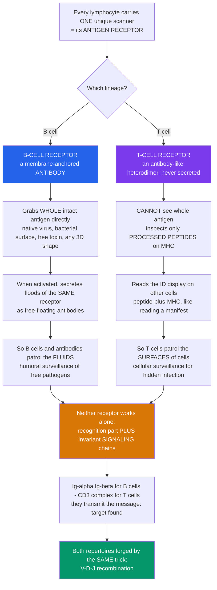

# 🛰️ T-Cell and B-Cell Receptors

> [!abstract] TL;DR
> Every lymphocyte carries **one** unique surface **antigen receptor**, and the whole of adaptive immunity comes down to two fundamentally different designs for it. The **B-cell receptor (BCR)** is essentially a **membrane-anchored antibody**: because it *is* an antibody, it grips **whole, intact antigen** of any chemical shape — a native virus particle, a bacterial surface, a free toxin — directly, and when the B cell is activated it pours out floods of that exact same receptor as **secreted antibody**. The **T-cell receptor (TCR)** works on a totally different principle: it **cannot see whole antigen at all** and instead reads only **short processed peptides displayed on MHC** molecules on the surfaces of other cells — like an inspector who can't open the cargo but reads the manifest posted on each container. So B cells and antibodies patrol the body's **fluids** (humoral surveillance of free pathogens), while T cells patrol the **surfaces of cells** (cellular surveillance for hidden internal infection). Crucially, neither receptor works alone — each is a two-part rig: a **recognition module** (BCR or TCR) plus invariant **signaling chains** (Igα/Igβ for B cells; the **CD3** complex for T cells) that transmit "I found my target." And both are forged by the **same** diversity-generating genetics — **V(D)J recombination** — that creates billions of specificities. *Educational science content, not medical advice.*

---

## Intuition

**Analogy — a soldier with a single, unique scanner.** Picture every lymphocyte as a soldier issued exactly **one** hand-held scanner, tuned to recognize its **one** specific enemy. That scanner is the **antigen receptor**, and it is the entire reason the cell exists. But there are two armies here, and they carry two very different kinds of scanner.

The **B cell's** scanner — the **B-cell receptor** — is essentially a **Y-shaped antibody bolted to the cell surface** instead of being thrown out into the world. Because it is an antibody, it can grip a **whole, intact object** directly: a native virus particle, a patch of bacterial coat, a free-floating toxin — any three-dimensional shape, the way a hand closes around whatever it touches. And here is the elegant part: when the B cell is finally activated, its **weapon is simply a copy of its scanner** — it starts secreting that same receptor by the millions as free antibodies flooding the blood and tissue fluids.

The **T cell's** scanner — the **T-cell receptor** — obeys a completely different rule. It **cannot see whole antigens floating around at all**. It is built to inspect only **little processed peptide fragments displayed on MHC molecules** on the surface of other cells. So a T cell's scanner does not grab enemies; it reads the small **"ID displays"** that every cell in your body posts on its surface, checking each **peptide-plus-MHC** combination for anything foreign. It is like an inspector who can never open a shipping container but can read the **manifest** taped to its door — and raises the alarm the moment a manifest lists contraband. This is exactly why **T cells patrol the body's cells**, reading their molecular displays for signs of a hidden internal infection, while **B cells and antibodies patrol the fluids**, grabbing free pathogens and toxins.

Two more facts finish the picture. First, **neither scanner works alone**: each is a two-piece rig — the **recognition part** that binds the target, wired to dedicated **signaling chains** (Igα/Igβ on B cells; the CD3 complex on T cells) whose only job is to shout **"target found!"** down into the cell and trigger activation. Second, both scanners are manufactured by the **same astonishing genetic trick** — **V(D)J recombination** — which shuffles gene segments to build billions of different specificities from a modest set of parts. Understanding the BCR and the TCR — *what* each one sees, and *how* each pairs recognition with signaling — is understanding the two fundamentally different ways the adaptive immune system recognizes the enemy.

---

## How It Works

### Core mechanics

1. **One cell, one specificity.** During development each lymphocyte commits to a **single** receptor sequence and displays thousands of identical copies on its surface. This clonal distribution is what **clonal selection** acts on: the antigen picks out the rare cell whose receptor already fits.
2. **The BCR = membrane immunoglobulin + Igα/Igβ.** A naive B cell displays surface **IgM** and **IgD** — the very antibody it will later secrete — non-covalently paired with the signaling heterodimer **Igα/Igβ (CD79a/CD79b)**. The immunoglobulin binds antigen; the Igα/Igβ tails carry the **ITAM** motifs that transmit the signal.
3. **The BCR sees native antigen directly.** Because it is an antibody, the BCR binds **unprocessed, three-dimensional** antigen of **any** chemical class — protein, carbohydrate, lipid — recognizing largely **conformational epitopes**, whether the antigen is free in solution or displayed on a surface.
4. **The TCR = αβ heterodimer + CD3 + co-receptor.** A T cell displays a membrane **α:β heterodimer** (structurally like an antibody Fab, but **never secreted**), assembled with the invariant **CD3** complex (γ, δ, ε chains plus the ζ homodimer) that carries the ITAMs, plus a **co-receptor**: **CD4** (binds MHC class II → helper lineage) or **CD8** (binds MHC class I → cytotoxic lineage).
5. **The TCR sees only peptide-on-MHC — "MHC restriction."** The TCR ignores free antigen entirely and recognizes a composite surface made of a **short linear peptide sitting in the groove of an MHC molecule** on another cell. No presentation, no recognition.
6. **Signal 1 needs signals 2 and 3.** Antigen binding (**signal 1**) is necessary but not sufficient: full activation requires **costimulation** (**signal 2**) and **cytokine** input (**signal 3**), a safeguard against responding to the wrong thing.
7. **Discrimination by dwell time — kinetic proofreading.** The TCR distinguishes a genuine agonist peptide from the sea of self-peptides largely by **how long** it stays bound. Only bindings that last long enough drive the receptor through a chain of sequential signaling steps to completion — converting tiny differences in binding half-life into large, decisive differences in output.

### The two ways adaptive immunity sees the enemy



---

## Key Concepts

### Secondary — the big picture

- **Antigen receptor** = the unique scanner on a lymphocyte's surface that recognizes its one specific target. Each cell has just one kind.
- **B-cell receptor (BCR)** = a **membrane-anchored antibody**. It grabs **whole, intact antigen** of any shape directly. Activated B cells secrete that same receptor as free **antibodies**.
- **T-cell receptor (TCR)** = a scanner that **cannot see whole antigen**; it reads only **processed peptides displayed on MHC** on the surface of other cells.
- **Division of labor.** B cells and antibodies patrol the **fluids** (grabbing free pathogens and toxins); T cells patrol the **surfaces of cells** (inspecting their displays for hidden infection).
- **Both need signaling chains.** The receptor recognizes; attached chains (**Igα/Igβ** for B cells, the **CD3** complex for T cells) transmit "target found" into the cell.

### Undergraduate — mechanisms and distinctions

- **BCR architecture.** Membrane **immunoglobulin** (surface **IgM/IgD** on naive B cells) supplies antigen binding through its variable regions; the associated **Igα/Igβ (CD79a/b)** heterodimer supplies the cytoplasmic **ITAMs** that couple binding to intracellular signaling. The membrane Ig's own cytoplasmic tail is too short to signal on its own — hence the accessory chains.
- **TCR architecture.** A disulfide-linked **α:β heterodimer** (a minority of T cells use **γ:δ**) provides antigen binding but has **no signaling tail**; the invariant **CD3** chains (**γ, δ, ε**) and the **ζζ** homodimer carry the ITAMs. **CD4** and **CD8** co-receptors both stabilize the MHC contact and recruit the kinase **Lck** — and simultaneously define lineage.
- **Variable and constant regions; CDRs.** Both receptors are immunoglobulin-superfamily members with **variable (V)** antigen-binding domains and **constant (C)** domains. Binding specificity is concentrated in three **complementarity-determining regions (CDRs)** per chain; **CDR3**, sitting at the recombination junction, is the most diverse and contacts the antigenic peptide most directly.
- **MHC restriction.** A TCR recognizes peptide **and** MHC together — it is restricted to the particular MHC alleles the individual expresses. A BCR has no such restriction; it binds antigen intrinsically.
- **What each responds to.** Because the BCR sees native antigen, B-cell responses cover proteins, polysaccharides, and lipids and can target surface-exposed conformational epitopes (great for **neutralizing** free pathogens). Because the TCR sees processed peptide-MHC, T cells detect fragments of **intracellular** proteins a whole antigen could never reveal (great for spotting **hidden** infection).
- **The three signals.** **Signal 1** = antigen via the receptor; **signal 2** = costimulation (e.g., CD28–B7 for T cells); **signal 3** = cytokines shaping the response. Signal 1 alone can drive **anergy** or tolerance rather than activation.

### Graduate — depth and consequences

- **The pivotal contrast, stated precisely.** The **BCR/antibody** binds **native, three-dimensional** antigen of any chemical class anywhere in the extracellular space — humoral surveillance of body fluids. The **TCR** binds **short linear peptides presented on MHC** on cell surfaces — cellular surveillance of the intracellular and phagocytosed proteome. Almost every downstream difference between humoral and cell-mediated immunity descends from this single fact (see the sibling notes on antibody structure, the MHC, and antigen processing).
- **Signal initiation.** Receptor engagement triggers **Lck** (T cells) or **Lyn/Syk** (B cells) to phosphorylate ITAM tyrosines, recruiting **ZAP-70** (T) or **Syk** (B), which nucleate the LAT/SLP-76 (or BLNK) signalosomes and fire the **Ca²⁺–calcineurin–NFAT**, **Ras–MAPK**, and **PKCθ/NF-κB** cascades that reprogram the cell.
- **Kinetic proofreading.** McKeithan's model explains the TCR's paradoxical **high sensitivity plus high specificity**: signaling requires completing a series of reversible modification steps, and any dissociation resets the chain. Because completing **N** steps scales roughly as (dwell fraction)ⁿ, a small increase in binding **half-life** produces a large, switch-like jump in output — letting a T cell ignore abundant self peptide-MHC yet respond to a handful of agonist complexes. The cost is a **speed–accuracy trade-off**: more proofreading steps sharpen discrimination but lower and slow the absolute signal (see the demo).
- **Serial engagement and avidity.** A single peptide-MHC can serially trigger **many** TCRs, amplifying scarce ligand; conversely, low-affinity BCRs compensate through **avidity** — multivalent binding to repetitive epitopes. Antigen-receptor "affinity" at the cell level is really an integrated, multivalent, time-averaged quantity.
- **The immunological synapse.** Sustained signaling is organized in space: receptors, co-receptors, and adhesion molecules segregate into concentric **SMACs** (central/peripheral/distal supramolecular activation clusters), stabilizing contact and tuning the signal.
- **Unconventional recognition.** **γδ T cells** and innate-like **NKT** and **MAIT** cells break the classical peptide-MHC rule: NKT cells read **lipids presented on CD1**, and MAIT cells read **microbial metabolites presented on MR1** — expanding the definition of "antigen" beyond peptides.
- **Where the repertoire comes from.** Both receptors are assembled by **V(D)J recombination** (RAG-mediated) and then **selected** during development — B cells purged of strong self-reactivity in the marrow; thymocytes subjected to **positive selection** (must read self-MHC) and **negative selection** (must not react too strongly to self peptide-MHC). Foreignness and self-tolerance are thus *built into* the finished repertoire (foreshadowing the diversity-generation and T-cell-development notes).

---

## Python Demo

```python
# T-cell and B-cell receptors: two ideas made quantitative.
#
# (a) RECOGNITION MODE -- what each receptor can even SEE.
#     Model a pool of antigen "forms" and score whether the BCR (a membrane
#     antibody) or the TCR (peptide-MHC reader) recognizes each. The BCR grips
#     native/conformational antigen of any chemical class directly; the TCR
#     binds ONLY peptide bound to MHC. We then quantify the "recognition space"
#     each covers -- broad-but-surface for the BCR, narrow-but-INTRACELLULAR
#     for the TCR.
#
# (b) SIGNAL DISCRIMINATION -- kinetic proofreading.
#     A TCR must pass through N sequential signaling steps (rate kp) before it
#     dissociates (rate koff = 1/dwell). Probability of completing all N steps
#     = (kp*dwell / (1 + kp*dwell))**N. Longer binding dwell-time => sharper,
#     switch-like signal. More proofreading steps N => better self-vs-agonist
#     discrimination, but LOWER absolute signal (a speed-accuracy trade-off).
import numpy as np
import matplotlib.pyplot as plt

fig, ax = plt.subplots(2, 2, figsize=(13, 9))

# ---- (a1) Recognition matrix: which receptor binds which antigen form ----
forms = ["native\nfolded\nprotein", "conformational\nsurface", "free\ntoxin",
         "carbohydrate", "lipid", "free linear\npeptide", "peptide-MHC\ncomplex"]
bcr = np.array([1.0, 1.0, 1.0, 0.9, 0.8, 0.25, 0.30])   # antibody grips native shapes
tcr = np.array([0.0, 0.0, 0.0, 0.0, 0.0, 0.05, 1.0])    # TCR sees ONLY peptide-MHC
x = np.arange(len(forms)); w = 0.38
ax[0, 0].bar(x - w/2, bcr, w, color="#2563eb", label="BCR (membrane antibody)")
ax[0, 0].bar(x + w/2, tcr, w, color="#7c3aed", label="TCR (peptide-MHC reader)")
ax[0, 0].set_xticks(x); ax[0, 0].set_xticklabels(forms, fontsize=7)
ax[0, 0].set_ylabel("relative binding / recognition")
ax[0, 0].set_title("(a1) What each receptor can SEE\nBCR: whole antigen, any shape   TCR: only peptide-MHC")
ax[0, 0].legend(fontsize=8); ax[0, 0].grid(alpha=0.3, axis="y")

# ---- (a2) Recognition space each receptor covers ----
labels = ["chemical classes\nseen directly", "sees INSIDE\ncells (proteome)"]
bcr_space = [5, 0]     # proteins, carbs, lipids, toxins, haptens-on-carrier; but surface-only
tcr_space = [1, 1]     # only peptides -- but reports the intracellular proteome
xx = np.arange(len(labels))
ax[0, 1].bar(xx - w/2, bcr_space, w, color="#2563eb", label="BCR")
ax[0, 1].bar(xx + w/2, tcr_space, w, color="#7c3aed", label="TCR")
ax[0, 1].set_xticks(xx); ax[0, 1].set_xticklabels(labels, fontsize=8)
ax[0, 1].set_ylabel("recognition space (count)")
ax[0, 1].set_title("(a2) Broad-but-surface  vs  narrow-but-INTRACELLULAR\ncomplementary coverage, not redundant")
ax[0, 1].legend(fontsize=8); ax[0, 1].grid(alpha=0.3, axis="y")

# ---- (b1) Kinetic proofreading: signal vs binding dwell-time ----
dwell = np.linspace(0, 10, 400)          # binding half-life (arbitrary time units)
kp = 1.0                                  # proofreading step rate
phi = kp * dwell / (1.0 + kp * dwell)     # per-step completion fraction
for N, col in [(1, "#22c55e"), (3, "#d97706"), (6, "#dc2626")]:
    ax[1, 0].plot(dwell, phi**N, color=col, lw=2.3, label=f"N = {N} proofreading steps")
ax[1, 0].axvline(0.5, ls=":", color="#64748b"); ax[1, 0].axvline(4.0, ls=":", color="#64748b")
ax[1, 0].text(0.5, 1.02, "self\npMHC", ha="center", fontsize=8, color="#64748b")
ax[1, 0].text(4.0, 1.02, "agonist\npMHC", ha="center", fontsize=8, color="#64748b")
ax[1, 0].set_xlabel("binding dwell-time (receptor-ligand half-life)")
ax[1, 0].set_ylabel("signal per engaged receptor")
ax[1, 0].set_title("(b1) Kinetic proofreading sharpens the threshold\nmore steps => switch-like discrimination by dwell-time")
ax[1, 0].set_ylim(0, 1.12); ax[1, 0].legend(fontsize=8); ax[1, 0].grid(alpha=0.3)

# ---- (b2) The speed-accuracy trade-off of proofreading ----
tau_self, tau_ag = 0.5, 4.0
phi_self = kp * tau_self / (1 + kp * tau_self)
phi_ag = kp * tau_ag / (1 + kp * tau_ag)
Ns = np.arange(1, 11)
discrimination = (phi_ag / phi_self) ** Ns     # agonist:self signal ratio
abs_signal = phi_ag ** Ns                       # absolute agonist signal
axb = ax[1, 1]
axb.plot(Ns, discrimination, "o-", color="#2563eb", lw=2.2, label="discrimination (agonist:self)")
axb.set_yscale("log")
axb.set_xlabel("number of proofreading steps N")
axb.set_ylabel("discrimination ratio (log)", color="#2563eb")
axb.tick_params(axis="y", labelcolor="#2563eb")
axb.set_title("(b2) Speed-accuracy trade-off\nspecificity up, absolute signal down")
axb.grid(alpha=0.3)
axr = axb.twinx()
axr.plot(Ns, abs_signal, "s--", color="#dc2626", lw=2.0, label="absolute agonist signal")
axr.set_ylabel("absolute agonist signal", color="#dc2626")
axr.tick_params(axis="y", labelcolor="#dc2626")
lines = axb.get_lines() + axr.get_lines()
axb.legend(lines, [l.get_label() for l in lines], fontsize=8, loc="center right")

plt.tight_layout()
plt.savefig("tcr_bcr_receptors.png", dpi=130)
print("BCR recognizes", int((bcr > 0.5).sum()), "of", len(forms),
      "antigen forms directly; TCR recognizes", int((tcr > 0.5).sum()),
      "(peptide-MHC only).")
print(f"Self dwell phi={phi_self:.3f}, agonist dwell phi={phi_ag:.3f}")
print("Discrimination ratio at N=1:", round(discrimination[0], 2),
      " at N=6:", round(discrimination[5], 2))
```

**What the plots show.** Panel **(a1)** is the central contrast made concrete: the **BCR** (blue) recognizes whole native antigen across every chemical class — proteins, toxins, carbohydrates, lipids — while the **TCR** (purple) lights up for essentially **one** thing, a **peptide-MHC complex**. Panel **(a2)** reframes that as *recognition space*: the BCR is **broad but surface-limited**, whereas the TCR is **narrow but uniquely able to report the intracellular proteome** through presented peptides — the two are complementary, not redundant. Panel **(b1)** is **kinetic proofreading**: as the number of required signaling steps **N** grows, the signal-versus-dwell-time curve steepens into a near-switch, so a short-lived **self** peptide-MHC stays silent while a longer-lived **agonist** crosses threshold. Panel **(b2)** exposes the catch — piling on proofreading steps drives the **agonist-to-self discrimination ratio** up exponentially (blue, log axis) but drags the **absolute signal** down (red): specificity is bought with sensitivity and speed, the deep design tension every antigen receptor must balance.

---

## Real-World Applications

- **CAR-T cell therapy** rewires the two recognition modes into one engineered receptor: a **BCR-style antibody fragment** (an scFv that binds native surface antigen, e.g., CD19) is fused to **TCR/CD3 ζ signaling** plus costimulatory tails — giving a T cell **antibody-like, MHC-unrestricted** targeting while keeping T-cell killing. It is a literal cut-and-paste of the recognition module from one receptor onto the signaling module of the other.
- **Checkpoint-inhibitor immunotherapy** (anti-PD-1, anti-CTLA-4) works by lifting the brakes on TCR **signal 2**, restoring T-cell activation against tumor peptide-MHC — a direct clinical exploitation of the "signal 1 needs signal 2" logic.
- **TCR-engineered T cells and TCR-mimic antibodies** are designed to recognize specific **peptide-MHC** targets from intracellular tumor antigens — reaching antigens that conventional antibodies (limited to the cell surface) can never see.
- **Therapeutic and diagnostic antibodies** are, in effect, **soluble BCRs**: the same molecule the B cell displays and secretes, harnessed to neutralize toxins, block receptors, or tag cells (see the antibody-structure sibling and [[Receptors_and_Signal_Transduction_as_Targets]]).
- **Repertoire sequencing (AIRR-seq)** reads out the V(D)J-generated diversity of BCR and TCR **CDR3** regions from blood, powering vaccine-response monitoring, minimal-residual-disease tracking in leukemia, and clonality tests.
- **Superantigen and cytokine-storm biology** — bacterial superantigens cross-link MHC II to the TCR **outside** the peptide groove, activating huge fractions of T cells at once; understanding normal receptor triggering explains why this shortcut is so dangerous.

---

## Common Pitfalls

- **Thinking the TCR binds free antigen.** It does not — ever. The TCR sees **only** peptide-on-MHC. Forgetting this makes MHC restriction, antigen presentation, and the entire logic of cell-mediated immunity incomprehensible.
- **Conflating the receptor with its signaling chains.** The membrane Ig and the TCR α:β heterodimer **bind** antigen but have essentially no signaling tail; the **Igα/Igβ** and **CD3** chains do the transmitting. "The receptor" is really a recognition-plus-signaling assembly.
- **Assuming the BCR and TCR see the same epitopes.** BCR epitopes are mostly **conformational** surface patches on native antigen; TCR "epitopes" are **short linear peptides** buried-then-presented in an MHC groove. The same protein yields completely different targets for the two systems.
- **Believing affinity alone decides T-cell activation.** Discrimination is dominated by **binding dwell-time / kinetic proofreading**, serial engagement, and avidity — not by equilibrium affinity read off a binding curve. Two ligands with similar affinity but different off-rates can behave completely differently.
- **Ignoring the co-receptor's dual role.** CD4 and CD8 are not just adhesion helpers; by recruiting Lck they shape signaling **and** they define the helper-versus-cytotoxic **lineage**. Treating them as passive markers misses half the story.
- **Forgetting signals 2 and 3.** Antigen binding without costimulation can induce **anergy or tolerance**, not activation. "The receptor bound antigen" does not by itself mean "the cell responded."
- **Overlooking unconventional receptors.** γδ T, NKT, and MAIT cells recognize lipids (CD1) and metabolites (MR1), so "antigen receptor sees peptide-MHC" is the *classical* rule, not the whole rule.

---

## Related Concepts

- [[Antigens_Epitopes_and_Immunogenicity]] — defines the antigens and epitopes these receptors bind; the linear-vs-conformational epitope distinction *is* the BCR-vs-TCR recognition difference.
- [[Clonal_Selection_and_Immunological_Memory]] — the "one cell, one receptor" specificity established here is exactly what clonal selection acts on when antigen picks the matching lymphocyte.
- [[Cells_of_the_Immune_System]] — introduces the B and T lymphocytes whose defining feature is the receptor detailed in this note.
- [[The_Adaptive_Immune_System]] — the humoral/cell-mediated split of adaptive immunity flows directly from the BCR-vs-TCR contrast in what each receptor can see.
- [[The_Cell_Membrane_and_Transport]] — both receptors are membrane-embedded signaling assemblies; their triggering is a case study in transmembrane signal transduction.
- [[Receptors_and_Signal_Transduction_as_Targets]] — antigen receptors and their downstream kinases (Lck, Syk, ZAP-70) are pharmacological targets in cancer and autoimmunity.

*Antigen-recognition siblings to build alongside this note (referenced in prose above): Antibody Structure and Function (the secreted form of the BCR), The Major Histocompatibility Complex and Antigen Processing and Presentation (the display system the TCR reads), Generation of Receptor Diversity via V(D)J Recombination (how both repertoires are built), and T-Cell Activation and Effector Functions (what happens after "target found").*

---

## Review Questions

**Secondary.** Explain, using the "soldier with a scanner" analogy, why B cells and antibodies patrol the body's fluids while T cells patrol the surfaces of other cells. What is the single biggest difference in what the BCR and the TCR can "see"?

**Undergraduate.** A virus infects a cell and replicates entirely inside it, exposing none of its proteins on the cell surface in native form. Explain why an **antibody/BCR** cannot detect this hidden infection but a **TCR** can, naming the molecules involved (MHC, peptide, CD8, CD3) and the step that makes the internal protein visible.

**Graduate.** A T cell must ignore thousands of abundant self peptide-MHC complexes yet respond to a mere handful of agonist complexes that differ only in binding half-life. Explain how **kinetic proofreading** achieves this, why increasing the number of proofreading steps improves specificity, and what the cell pays for that specificity. Then design one experiment (e.g., varying ligand off-rate) that would test the model.

---

## Sources

- Murphy, K. & Weaver, C. — *Janeway's Immunobiology*, 9th–10th ed. (Garland Science) — antigen receptors, BCR/TCR structure, and signaling.
- Abbas, A. K., Lichtman, A. H. & Pillai, S. — *Cellular and Molecular Immunology*, 10th ed. (Elsevier) — lymphocyte antigen receptors, CD3, co-receptors, and activation.
- Davis, M. M. & Bjorkman, P. J. — "T-cell antigen receptor genes and T-cell recognition," *Nature* 334: 395–402 (1988).
- Dushek, O. & van der Merwe, P. A. — "An induced rebinding model of antigen discrimination," *Trends in Immunology* 35(4): 153–158 (2014) — kinetic proofreading and TCR triggering.
- McKeithan, T. W. — "Kinetic proofreading in T-cell receptor signal transduction," *PNAS* 92(11): 5042–5046 (1995).

---

#immunology #t-cell-receptor #b-cell-receptor #antigen-recognition #kinetic-proofreading
