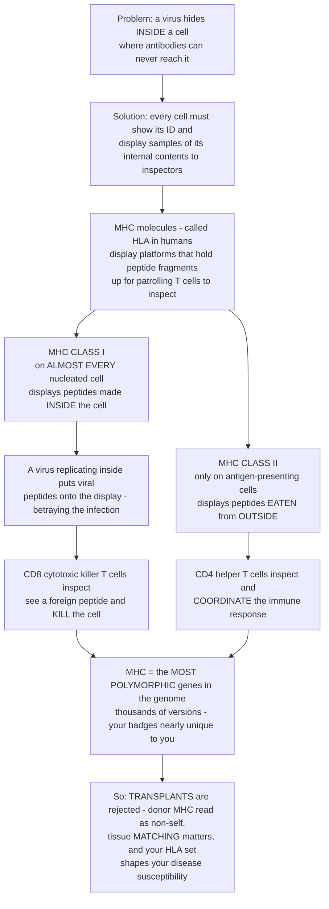

# 🪪 The Major Histocompatibility Complex

> [!abstract] TL;DR
> The **major histocompatibility complex (MHC** — called **HLA**, human leukocyte antigen, in humans) is the immune system's **display system**: a set of cell-surface glycoproteins that **bind short peptide fragments** of a cell's proteins and **hold them up for T cells to inspect**. This solves biology's hardest surveillance problem — *how do you detect a virus hiding **inside** a cell, where antibodies can never reach?* The answer is that essentially every cell is legally required to **broadcast a sample of its internal contents**. **MHC class I** sits on **almost every nucleated cell** and displays peptides from proteins made *inside*; if a virus is replicating there, **viral peptides appear on the display**, betraying the infection to **CD8⁺ cytotoxic (killer) T cells**, which destroy the cell. **MHC class II** sits only on **professional antigen-presenting cells** (dendritic cells, macrophages, B cells) and displays peptides from material **engulfed from outside**, which **CD4⁺ helper T cells** read to coordinate the response. T cells never see free antigen — they see **peptide-MHC**, making the MHC the fundamental *language* of T-cell recognition. And because the MHC genes are the **most polymorphic loci in the entire genome** (thousands of HLA alleles, co-dominantly expressed), each person's cellular "ID badges" are **nearly unique** — which is exactly why organ **transplants are rejected**, why **tissue matching** matters, and why your particular HLA set shapes which **diseases you are susceptible to**. *(Educational immunology at textbook level — not individual medical advice.)*

---

## Intuition

**Analogy — every cell must show its ID and a sample of its contents to roving inspectors.** Imagine a vast secure facility with millions of rooms, and a security force whose job is to catch saboteurs who sneak *inside* the rooms and lock the doors behind them. The guards can't peer through the walls, and they can't open every door. So the facility enforces a brilliant rule: **every room is required, continuously, to hold a small tray up to a slot in its door — and on that tray it must place random samples of whatever is being manufactured inside.** Inspectors walk the halls, glance at each tray, and if a sample looks foreign — say, bomb-making chemicals instead of the room's usual product — they immediately demolish that room, saboteur and all. The tray-in-the-slot is the **MHC molecule**; the samples on it are **peptide fragments**; the inspectors are **T cells**.

There are **two tray systems** for two purposes. The first, **MHC class I**, is installed on *almost every room* and shows samples of what that room is **making internally** — normally harmless self-parts, but if a virus has hijacked the room's machinery, viral parts show up on the tray and betray it. The inspectors for these trays are the **killer (cytotoxic) T cells**, who demolish on sight. The second system, **MHC class II**, is installed only on specialized "**waste-and-intake rooms**" (the antigen-presenting cells) that swallow debris from the hallways; their trays show samples of what was **eaten from outside**, and a different set of inspectors — the **helper T cells** — read those to *coordinate* the whole security response rather than to kill.

Here is the twist that makes the MHC extraordinary: **the exact shape of the tray-and-slot is nearly unique to each facility**. The genes encoding it are the **most variable in the whole genome**, so almost no two people carry the same set. Your inspectors are trained only on *your* tray shape — which is why, if you receive a room transplanted from someone else, your inspectors see the **foreign tray itself** as alien and attack it (transplant rejection), why finding a **compatible donor** is hard, and why the particular trays you inherited tilt you toward — or protect you from — specific diseases. To understand the MHC is to understand the *language* in which T cells read the hidden inner state of every cell in your body.

---

## How It Works

### Core mechanics — display, inspect, and the two-system division of labor

1. **The problem the MHC solves.** Antibodies patrol the *extracellular* world and can neutralize free viruses and toxins, but they are **useless against a pathogen already inside a cell**. Something must report a cell's *internal* state to the immune system. The MHC is that reporting system.
2. **What an MHC molecule does.** An MHC molecule is a cell-surface **glycoprotein with a peptide-binding groove**. Inside the cell, proteins are constantly chopped into short peptides; a subset of those peptides is loaded into the groove and the whole peptide-MHC complex is trafficked to the surface. The cell thereby **advertises a representative sample of its proteome**. A single cell displays *thousands* of different peptide-MHC complexes at once.
3. **T cells read peptide-MHC, not free antigen.** A T-cell receptor (**TCR**) does not recognize an antigen floating free — it recognizes the **combined surface of the peptide *plus* the MHC molecule holding it**. This is **MHC restriction** (Zinkernagel & Doherty, Nobel 1996): a given T cell responds to a peptide *only* when presented on *self*-MHC. The MHC is therefore the obligatory intermediary — the *grammar* — of all T-cell recognition.
4. **MHC class I — the "what I am making inside" channel.** Class I is expressed on **virtually all nucleated cells**. Structurally it is a long **α heavy chain** paired with **β₂-microglobulin**, forming a **closed groove** that binds **short peptides (~8–10 amino acids)**. It loads peptides from the **cytosolic / endogenous** pathway — proteins made inside the cell, degraded by the proteasome. Normally these are harmless self-peptides. But a **virus** replicating inside, or a **tumor** making mutated proteins, floods the class I display with foreign peptides. Class I is read by **CD8⁺ cytotoxic T cells** (the CD8 co-receptor binds a conserved part of class I), which then **kill** the presenting cell. The human class I loci are **HLA-A, HLA-B, HLA-C**. Class I molecules are *also* the ligands for **NK-cell inhibitory receptors** — a cell that stops displaying class I to hide from T cells ("**missing self**") is instead flagged for killing by NK cells.
5. **MHC class II — the "what I ate from outside" channel.** Class II is expressed only on **professional antigen-presenting cells** — **dendritic cells, macrophages, B cells**. Structurally it is two chains (**α + β**) forming an **open-ended groove** that binds **longer peptides (~13–25 amino acids)**. It loads peptides from the **extracellular / endosomal** pathway — material the cell **phagocytosed or endocytosed** from outside. Class II is read by **CD4⁺ helper T cells** (CD4 binds class II), which then **coordinate** the response — activating B cells, licensing cytotoxic T cells, and amplifying macrophages. The human class II loci are **HLA-DR, HLA-DQ, HLA-DP**.
6. **The binding groove and its motif.** Each MHC molecule binds not one peptide but a **range of peptides that share "anchor" residues** — specific amino acids at particular positions that dock into pockets in the groove. This shared pattern is the allele's **binding motif**. Because the motif is restrictive, **any one MHC allele presents only a limited slice** of all possible pathogen peptides.
7. **Polymorphism — the extraordinary feature.** The MHC is the **most polymorphic region of the human genome**: there are **thousands of HLA alleles**, most differing precisely in the residues lining the binding groove — i.e., in *which peptides they present*. Alleles are expressed **co-dominantly** (both the maternal and paternal copy of each locus is used), so an individual displays roughly **six classical class I** products (two each of A, B, C) plus several class II products. Diversity is maintained by **pathogen-driven balancing selection** and **heterozygote advantage**: carrying more distinct alleles lets you present more pathogen peptides, and spreading diversity across a *population* ensures the species can collectively present almost any pathogen — even one no individual could cover alone.
8. **The consequences.** Because MHC is nearly unique to each person, a transplanted organ carries **foreign (allogeneic) MHC** that the recipient's T cells attack — **graft rejection**, the phenomenon through which the MHC was originally discovered (hence "**histo**compatibility"). This is why donors and recipients are **HLA-matched**. The same polymorphism ties specific HLA alleles to **disease susceptibility** (autoimmune associations), **drug hypersensitivity**, and is exploited in **vaccine and immunotherapy design** to predict which epitopes will be presented.

### The MHC surveillance system, end to end



---

## Key Concepts

### Secondary (intuitive foundation)

- **Two display systems, two jobs.** **Class I** is on *nearly every cell* and shows "what I'm making inside" — it catches **viruses hiding in cells**. **Class II** is on a few *special* cells and shows "what I ate from outside" — it helps **coordinate** the response.
- **T cells are inspectors.** **Killer (CD8) T cells** read class I and *destroy* infected cells. **Helper (CD4) T cells** read class II and *organize* the defense. T cells never see germs directly — only the **peptide samples** the MHC holds up.
- **Your badges are nearly unique.** The MHC genes are the **most variable genes in your body**, so almost everyone's "cell ID badge" is different. That difference is why a **transplanted organ can be rejected** — the recipient's T cells see a stranger's MHC as foreign.

### Undergraduate (mechanistic detail)

- **Structure vs. cargo.** Class I = **α heavy chain + β₂-microglobulin**, **closed groove**, short **8–10-mer** peptides from the **proteasome/endogenous** pathway. Class II = **α + β chains**, **open groove**, longer **13–25-mer** peptides from the **endosomal/exogenous** pathway. Co-receptors match the pairing: **CD8→class I, CD4→class II**.
- **Human loci.** Class I: **HLA-A, -B, -C**. Class II: **HLA-DR, -DQ, -DP**. Genes cluster on **chromosome 6p21**. Alleles are **co-dominantly** expressed, so you present peptides using *both* inherited copies of every locus.
- **Binding motif.** Each allele binds peptides sharing **anchor residues** that dock into groove pockets; hence one allele presents a **restricted repertoire**, and different alleles present **different repertoires**.
- **MHC restriction.** A TCR recognizes **peptide + self-MHC together** — the classic **Zinkernagel–Doherty** finding. T cells are positively selected in the thymus to recognize *self*-MHC and negatively selected against self-peptides.
- **Missing self.** Class I also inhibits **NK cells**; virus- or tumor-driven **down-regulation of class I** (an immune-evasion trick) removes that inhibition and triggers NK killing — a fail-safe.

### Graduate (systems and evolution)

- **Polymorphism as adaptive strategy.** HLA is under **balancing selection**: **overdominance (heterozygote advantage)** and **negative frequency-dependent selection** (rare alleles are favored because pathogens adapt to common ones) both preserve diversity. The signature is an excess of **non-synonymous substitutions in the peptide-binding-region codons** and **trans-species polymorphism** (allelic lineages older than the species itself).
- **Coverage arithmetic.** Because one allele presents only a fraction of a proteome, an individual's protection scales with **allelic diversity**, and the **population's** collective coverage approaches completeness — the logic quantified in the demo below.
- **Alloreactivity.** A strikingly **high precursor frequency (~1–10%)** of an individual's T cells react to a single foreign MHC — because a stranger's MHC + its bound self-peptides mimic the "peptide-MHC" surfaces the TCR is tuned to. This is the immunological engine of **graft rejection** and **graft-versus-host disease**.
- **Clinical genomics.** HLA underlies **disease associations** (e.g., **HLA-B27 / ankylosing spondylitis**, **HLA-DQ2/DQ8 / celiac disease and type 1 diabetes**), **drug hypersensitivity** (e.g., **HLA-B*57:01 / abacavir**), and **transplant matching, forensics, and pharmacogenomics** via **HLA typing**. **Epitope-prediction** algorithms (which peptides a given HLA will present) drive modern **vaccine and cancer-immunotherapy** design.

---

## Python Demo

This simulation models the two defining ideas: (a) each MHC allele has an **anchor-residue motif**, so it presents only a **limited, allele-specific slice** of a pathogen's peptides — but the population's **polymorphism** collectively covers almost everything; and (b) the **heterozygote advantage** — an individual's peptide coverage rises with the number of distinct alleles carried, though it stays far below the population (herd) level. It also prints how vanishingly rare a full HLA match between strangers is.

```python
# MHC peptide presentation: anchor-residue motifs, polymorphism, and heterozygote advantage
import numpy as np
import matplotlib.pyplot as plt

rng = np.random.default_rng(7)

# ---- Model parameters ----
AA          = 20      # amino-acid alphabet
PEP_LEN     = 9       # MHC class I binds ~9-mer peptides
ANCHOR_POS  = [1, 8]  # anchor residues sit at peptide positions 2 and 9
N_PEPTIDES  = 3000    # a pathogen proteome chopped into candidate peptides
N_ALLELES   = 300     # HLA is the most polymorphic locus: many alleles in a population
ACCEPT_PER_ANCHOR = 5 # each allele's groove tolerates only ~5 of 20 residues per anchor

# A pathogen's peptides, as random 9-mers
peptides = rng.integers(0, AA, size=(N_PEPTIDES, PEP_LEN))

# Each allele = a binding MOTIF: which residues it accepts at each anchor position
accept = np.zeros((N_ALLELES, len(ANCHOR_POS), AA), dtype=bool)
for a in range(N_ALLELES):
    for k in range(len(ANCHOR_POS)):
        residues = rng.choice(AA, size=ACCEPT_PER_ANCHOR, replace=False)
        accept[a, k, residues] = True

# Binding matrix B[a, p] = True iff allele a presents peptide p
# (a peptide is presented only if BOTH of its anchor residues match the allele's motif)
B = np.ones((N_ALLELES, N_PEPTIDES), dtype=bool)
for k, pos in enumerate(ANCHOR_POS):
    anchor_residue = peptides[:, pos]          # residue each peptide shows at this anchor
    B &= accept[:, k, :][:, anchor_residue]    # -> (N_ALLELES, N_PEPTIDES)

# ---- Coverage statistics ----
single_allele_cov = B.mean(axis=1)             # fraction of peptides each single allele presents
population_cov     = B.any(axis=0).mean()      # union over ALL alleles = herd-level coverage
print(f"Average coverage of ONE allele  : {single_allele_cov.mean():.1%} of pathogen peptides")
print(f"Coverage of the WHOLE population : {population_cov:.1%} (union of all {N_ALLELES} alleles)")

# ---- Heterozygote advantage: coverage vs number of distinct alleles an individual carries ----
max_alleles, trials = 12, 300
het_cov = np.zeros(max_alleles)
for m in range(1, max_alleles + 1):
    accs = [B[rng.choice(N_ALLELES, size=m, replace=False)].any(axis=0).mean()
            for _ in range(trials)]
    het_cov[m - 1] = np.mean(accs)

# ---- Transplant matching: chance two random people share an allele (equal frequencies) ----
match_one_locus  = 1.0 / N_ALLELES             # sum p_i^2 with equal frequencies
match_three_loci = match_one_locus ** 3        # e.g. matching at HLA-A, -B, -DR
print(f"Chance two strangers match at ONE HLA locus   : {match_one_locus:.2e}")
print(f"Chance they match at THREE loci (A, B, DR)     : {match_three_loci:.2e}")

# ---- Plots ----
fig, (ax1, ax2) = plt.subplots(1, 2, figsize=(13, 5))

# Panel 1: each allele presents a DIFFERENT subset of peptides (polymorphism)
ax1.imshow(B[:30, :80], aspect="auto", cmap="Greens", interpolation="nearest")
ax1.set_title("Peptide-presentation matrix\n(each allele binds its own subset)")
ax1.set_xlabel("pathogen peptides")
ax1.set_ylabel("MHC alleles")

# Panel 2: heterozygote advantage vs population coverage
ax2.plot(range(1, max_alleles + 1), het_cov * 100, "o-", color="#b91c1c", lw=2,
         label="individual coverage")
ax2.axhline(population_cov * 100, ls="--", color="#2563eb",
            label=f"population (herd) coverage = {population_cov:.0%}")
ax2.set_title("Heterozygote advantage:\nmore distinct alleles -> broader coverage")
ax2.set_xlabel("number of distinct MHC alleles carried")
ax2.set_ylabel("% of pathogen peptides presentable")
ax2.set_ylim(0, 100); ax2.legend(); ax2.grid(alpha=0.3)

plt.tight_layout()
plt.savefig("mhc_peptide_presentation.png", dpi=120)
plt.show()
```

**What it shows.** With a restrictive motif, **one allele presents only ~6% of the proteome**, yet the **union of 300 population alleles approaches ~100%** — the essence of MHC polymorphism as a *population-level* defense. The heterozygote-advantage curve rises steadily with the number of distinct alleles an individual carries (yet stays well below population coverage), explaining the evolutionary pressure to be **HLA-heterozygous**. And the printed match probabilities show why an unrelated, fully HLA-matched transplant donor is astronomically rare.

---

## Real-World Applications

> **Solid-organ and stem-cell transplantation.** Kidney, liver, heart, and especially **hematopoietic stem-cell (bone-marrow) transplants** are matched by **HLA typing** (classically HLA-A, -B, -C, -DR, -DQ). Mismatched MHC provokes **alloreactive T-cell rejection** (host-versus-graft) or, in marrow transplants, **graft-versus-host disease** (donor T cells attack recipient tissue). Registries like Be The Match exist precisely *because* MHC polymorphism makes matched unrelated donors rare — the demo's match arithmetic made real.

> **HLA–disease associations and autoimmunity.** Specific alleles carry large relative risks: **HLA-B27** with **ankylosing spondylitis**, **HLA-DQ2/DQ8** with **celiac disease** and **type 1 diabetes**, **HLA-DRB1** shared-epitope alleles with **rheumatoid arthritis**, **HLA-B*15:02** and **HLA-B*57:01** with severe **drug hypersensitivity** (carbamazepine, abacavir). These reflect *which self- or drug-modified peptides an allele presents*, and now guide **pre-prescription genetic screening**.

> **Vaccine and cancer-immunotherapy design.** Computational **epitope prediction** (NetMHC-family tools) forecasts which peptides a patient's HLA will present, driving **T-cell vaccine** design and **personalized neoantigen cancer vaccines** — the pipeline sequences a tumor, predicts HLA-presented mutant peptides, and builds a vaccine against them. Tumors that **down-regulate class I** to escape T cells become the target of **NK-cell** and **checkpoint-inhibitor** strategies.

> **Forensics, paternity, and population genetics.** Because HLA is hyper-variable and co-dominantly inherited, HLA typing historically served **paternity and forensic identification**, and today the depth of HLA diversity is a workhorse for reconstructing **human migration and population history**.

---

## Common Pitfalls

- **"T cells recognize free antigen like antibodies do."** They do not. A TCR sees **peptide *bound to* MHC** as a single combined surface (**MHC restriction**). No presentation, no T-cell recognition — this is the whole point of the MHC.
- **"Class I shows outside stuff; class II shows inside stuff."** It is the **reverse**: **class I = endogenous/inside** (proteasome, cytosolic — catches viruses), **class II = exogenous/outside** (endosomal, engulfed material). Memorize it by *who reads it*: killers (CD8) inspect the inside; coordinators (CD4) inspect the outside. (The exception, **cross-presentation**, lets dendritic cells route *external* antigen onto class I — a deliberate special case, not the default.)
- **"MHC and HLA are different things."** **HLA is simply the human name for the MHC.** "MHC" is the general (all-vertebrate) term; "HLA" (human leukocyte antigen) is the human locus.
- **"More alleles just means more rejection risk, so diversity is bad."** Diversity is *adaptive*: it broadens **pathogen coverage** (heterozygote advantage) and protects the *population* against evolving pathogens. Transplant difficulty is a **side effect** of a system that was never designed with surgery in mind.
- **"MHC polymorphism means genes are mutating fast in your body."** No — the polymorphism is **germline** and **inherited**, maintained across the *population* by balancing selection over evolutionary time. Your own MHC alleles are fixed from birth.
- **"A cell with no class I is safe from the immune system."** The opposite: **missing self** removes the inhibitory signal to **NK cells**, which then kill the class-I-negative cell — closing the loophole viruses and tumors try to exploit.

---

## Related Concepts

- [[Biology/11_Microbiology_and_Immunology/The_Adaptive_Immune_System|The Adaptive Immune System]] — the broader system MHC serves: clonal selection, B/T cells, and memory all depend on antigen displayed by the MHC.
- [[Genetics/05_Human_and_Medical_Genetics/Human_Genome_and_Genetic_Variation|Human Genome and Genetic Variation]] — the MHC/HLA region is the single **most polymorphic** stretch of the human genome, the extreme case of the variation cataloged here.
- [[Genetics/02_Classical_and_Population_Genetics/Population_Genetics_and_Hardy_Weinberg|Population Genetics and Hardy-Weinberg]] — **balancing selection** and heterozygote advantage that maintain HLA diversity are population-genetic processes; HLA is the textbook example of departure from neutral expectation.
- [[Clinical_Medicine/05_Immune_Infectious_and_Hematologic/Immune_Dysfunction_and_Autoimmunity|Immune Dysfunction and Autoimmunity]] — specific HLA alleles are the strongest genetic risk factors for many autoimmune diseases, because they shape which self-peptides get presented.
- [[Biology/07_Evolution/Natural_Selection_and_Adaptation|Natural Selection and Adaptation]] — pathogen-driven, frequency-dependent selection on the MHC is a canonical example of natural selection maintaining variation rather than eroding it.

*Within the Immunology vault, this note anchors a cluster of siblings developed separately:* **Antibody Structure and Function** (the humoral counterpart — antibodies handle *extracellular* antigen the MHC cannot), **Antigen Processing and Presentation** (the proteasome/TAP and endosomal pathways that *load* the MHC groove), **T Cell and B Cell Receptors** (the TCR that reads peptide-MHC), **Cytotoxic T Cells and Cell-Mediated Immunity** (the CD8 killers that act on class I), and **Transplantation Immunology and Rejection** (alloreactivity to non-self MHC).

---

## Review Questions

1. **(Secondary)** A virus is replicating deep inside one of your skin cells, where antibodies cannot reach it. Explain, using the "tray in the door slot" idea, how the immune system nonetheless discovers and eliminates that hidden infection. Which class of MHC and which type of T cell are involved?
2. **(Undergraduate)** Contrast MHC class I and class II across four axes: (a) which cells express them, (b) the source of the peptides they display, (c) the co-receptor and T-cell subset that reads them, and (d) the peptide length their groove accommodates. Then explain *why* the two pathways sample different protein pools.
3. **(Graduate)** HLA is the most polymorphic locus in the genome, and this polymorphism is concentrated in the codons lining the peptide-binding groove. Argue how **balancing selection** (heterozygote advantage plus frequency-dependent selection) produces this signature, and connect it quantitatively to the trade-off illustrated in the demo — an individual's limited peptide coverage versus the population's near-complete coverage. Then explain why the same polymorphism makes unrelated transplant matching so improbable.

---

## Sources

- Murphy, K. & Weaver, C. (2022). *Janeway's Immunobiology*, 10th ed. Garland Science — Chapters on antigen recognition, MHC structure, and antigen processing.
- Zinkernagel, R.M. & Doherty, P.C. (1974). "Restriction of in vitro T cell-mediated cytotoxicity in lymphocytic choriomeningitis within a syngeneic or semiallogeneic system." *Nature* 248: 701–702 — the discovery of **MHC restriction** (Nobel Prize, 1996).
- Klein, J. & Sato, A. (2000). "The HLA System" (two-part review). *New England Journal of Medicine* 343: 702–709 and 782–786 — structure, polymorphism, and clinical relevance of HLA.
- Trowsdale, J. & Knight, J.C. (2013). "Major Histocompatibility Complex Genomics and Human Disease." *Annual Review of Genomics and Human Genetics* 14: 301–323 — MHC diversity and HLA–disease associations.
- Robinson, J. et al. (2020). "IPD-IMGT/HLA Database." *Nucleic Acids Research* 48: D948–D955 — the reference catalog documenting thousands of HLA alleles.

---

#immunology #mhc #hla #antigen-presentation #polymorphism
