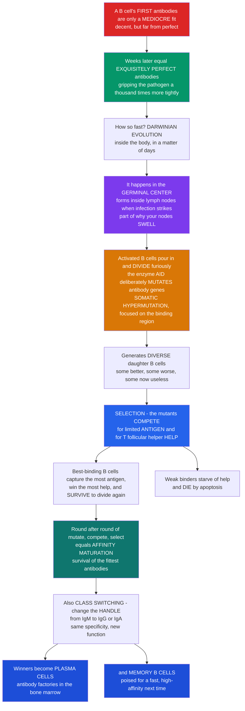

# 🧬 B-Cell Activation and the Germinal Center

> [!abstract] TL;DR
> When a **B cell** first meets a pathogen, its antibodies are usually only a **mediocre** fit — decent enough to sound the alarm, but far from ideal. Yet within weeks your body is producing **exquisitely perfect** antibodies that grip the same target a **thousand times** more tightly. How does the immune system engineer near-perfect antibodies so fast? The answer is one of the most astonishing processes in all of biology: **Darwinian evolution unfolding inside your own body**, in miniature, in a matter of days. It happens in a transient structure called the **germinal center** (GC), which blooms inside **lymph nodes** when an infection strikes — part of why your nodes **swell**. Activated B cells pour into the GC and start dividing furiously, while a special enzyme, **AID (activation-induced cytidine deaminase)**, deliberately **mutates their antibody genes** at roughly a **million times** the normal rate, aimed precisely at the antibody's antigen-binding region — this is **somatic hypermutation (SHM)**. That scatters the population into daughters with slightly different antibodies: some better, some worse, some now useless. Then comes **selection**: the mutants must **compete** for a limited pool of **antigen** (displayed on follicular dendritic cells) and for **"help"** from **T follicular helper (Tfh) cells**. The B cells whose mutated antibodies bind **best** capture the most antigen, win the most help, and survive to divide again; the losers **die by apoptosis**. Round after round of **mutate → compete → select** makes the antibodies better and better — this is **affinity maturation**, literally survival of the fittest antibodies. The GC also performs **class-switch recombination (CSR)** — changing the antibody's **handle** (isotype: IgM → IgG, IgA, or IgE) to tailor its function while keeping the same specificity. The winners graduate into two products: long-lived **plasma cells** (antibody factories that pump out the perfected antibody for years) and **memory B cells** (standing by for next time). Understanding B-cell activation and the germinal center is understanding how the body **evolves perfect antibodies on demand** — and it is the biological engine behind **vaccine-induced immunity**. *Educational science content, not medical advice.*

---

## Intuition

**Analogy first — a rapid breeding program for antibodies, run by natural selection.** Imagine you need a key that fits a brand-new lock, and all you have is a rough blank that *almost* turns. A patient locksmith could file it by hand, but that is slow. Instead, picture a factory that does something wilder: it makes **thousands of slightly different copies** of the blank — each filed a little differently, at random — then it **tests every copy against the lock at once** and keeps only the handful that turn a bit more smoothly. Those winners are copied again, each with fresh random tweaks, tested again, and the best kept again. After a dozen rounds of *randomly vary, then ruthlessly select*, you are holding a key that glides in perfectly — engineered not by design but by **evolution**, compressed into days.

That factory is the **germinal center**, and the "lock" is the pathogen. When an infection hits, GCs form inside your **lymph nodes** (which is part of why swollen glands are a sign your immune system is working). Activated B cells rush in and divide explosively, but with a deliberate twist: the enzyme **AID** sprays **random mutations** across just the part of the antibody gene that shapes the binding site — a molecular "filing" at a **million times** the background mutation rate. Every daughter cell now carries a slightly different antibody. Then the cells are forced to **compete**: there is only so much captured **antigen** to grab, and only so much survival signal — **"help"** — that the **T follicular helper cells** will dispense. The B cells whose antibodies grip the antigen **hardest** scoop up the most antigen, show the most of it to the helper cells, and receive the strongest "**you may live and divide**" signal. The weak binders starve of help and quietly **die**. Do this over and over and the average antibody gets tighter and tighter — **affinity maturation**, survival of the fittest antibodies, happening inside you.

While it sharpens the *grip*, the germinal center also swaps the antibody's *job*: **class switching** changes the constant "handle" (from IgM to IgG for the bloodstream, or IgA for mucosal surfaces) **without touching the specificity** — same key-teeth, different key-head. Finally, the champions of this tournament are promoted into two elite roles: **plasma cells**, which retire to the bone marrow and secrete the perfected antibody for years, and **memory B cells**, which lie in wait so that the *next* encounter with this pathogen is met with instant, high-affinity firepower. In one structure, over a few days, your body reruns three billion years of evolution's core trick — random variation plus selection — to hand-build a near-perfect weapon. That is the beating heart of humoral immunity, and it is exactly what a **vaccine** is quietly training.

---

## How It Works

### Core Mechanics

1. **Recognition — the B cell reads antigen through its BCR.** A naive B cell carries thousands of copies of a single antibody as its membrane-bound **B-cell receptor (BCR)**. When the BCR grips its matching antigen, the cell is partially activated and internalizes the antigen for processing.
2. **Two roads to activation.** *T-**dependent*** responses (to **protein** antigens) require a second signal: the B cell chops up the antigen and **presents** a peptide on **MHC class II** to a **T follicular helper (Tfh) cell**, which reciprocates with **CD40–CD40L** contact and **cytokines**. This "help" licenses full activation, germinal centers, memory, and high-affinity switched antibody. *T-**independent*** responses (to repetitive **polysaccharides**) skip T-cell help — the BCR is simply **cross-linked** by the repeating epitopes — giving a **fast but low-affinity, mostly IgM** response with little memory (why plain polysaccharide vaccines protect poorly, especially in infants).
3. **Two early fates.** Some activated B cells become **extrafollicular plasmablasts** — a rapid first wave of low-affinity IgM. Others migrate into a lymphoid **follicle** with their Tfh partners and seed a **germinal center**.
4. **The germinal center is a two-zone cycle.** The GC organizes into a **dark zone** (crowded with rapidly dividing B cells, where **somatic hypermutation** happens) and a **light zone** (where B cells are **selected** by competing for antigen and Tfh help). B cells shuttle back and forth: mutate in the dark, get tested in the light, and the survivors recycle to mutate again.
5. **Somatic hypermutation (SHM) — deliberate, targeted mutation.** In the dark zone, **AID (activation-induced cytidine deaminase)** deaminates cytosines in the antibody **variable-region** genes, and error-prone repair converts these lesions into **point mutations** at roughly **10⁶×** the genome's background rate, **focused on the V region**. This manufactures a diverse pool of antibody variants — some tighter, most neutral or worse, some frameshifted into uselessness.
6. **Selection — the Darwinian filter.** In the light zone, **antigen** is displayed (held intact on **follicular dendritic cells**) in **limited** supply. Higher-affinity BCR variants **capture more antigen**, internalize it, and **present more peptide** to a scarce population of **Tfh cells**. More presentation wins more Tfh help (CD40L + cytokines) → stronger survival and proliferation signals. **Winners recycle** to the dark zone to mutate again; **losers**, including newly **self-reactive** variants, **die by apoptosis**.
7. **Affinity maturation — the emergent result.** Iterating mutate→select for days to weeks drives the **average and best antibody affinity up by ~100–1000×**. No single cell is "trying" to improve; improvement is the statistical wake of selection acting on random variation — natural selection in a Petri-dish-sized arena inside you.
8. **Class-switch recombination (CSR) — new handle, same hand.** Also AID-dependent, CSR **deletes** the μ heavy-chain constant region and splices in a **downstream constant region** (γ, α, or ε), converting **IgM → IgG / IgA / IgE** while **preserving the assembled VDJ** and thus the specificity. **Tfh cytokines** steer the choice (roughly: IL-4 → IgE/IgG; TGF-β → IgA; IFN-γ → certain IgG subclasses), tailoring effector function to the threat.
9. **The outputs — factories and memory.** GC winners differentiate into **long-lived plasma cells** (homing to the **bone marrow**, secreting high-affinity, class-switched antibody for years) and **memory B cells** (quiescent, poised for a **faster, higher-affinity secondary response**). This dual output is the cellular basis of durable immunity.

### Flow / Architecture



---

## Key Concepts

### Secondary — the big picture

- **B cells make antibodies.** A B cell wears one antibody shape as its receptor. When that shape matches a piece of a germ, the B cell switches on.
- **First fit is only "okay."** Early antibodies bind the germ decently but not tightly.
- **The germinal center is an antibody breeding program.** Inside swollen **lymph nodes**, activated B cells copy themselves fast while an enzyme **randomly tweaks** the antibody's binding part (**somatic hypermutation**).
- **Then they compete.** The tweaked B cells fight over a limited supply of germ pieces and over **help** from helper T cells. The **best binders win and multiply**; the poor binders **die**. This is **affinity maturation** — the antibodies get better and better, like survival of the fittest.
- **Class switching changes the antibody's job**, not its target — e.g. from **IgM** (early, blood) to **IgG** (blood workhorse) or **IgA** (gut and lungs).
- **Two prizes at the end:** **plasma cells** (long-term antibody factories) and **memory B cells** (fast responders if the germ returns). This is why **vaccines** protect you for years.

### Undergraduate — mechanisms and distinctions

- **T-dependent vs T-independent activation.**
  - *T-dependent* (protein antigens): BCR engagement **plus** Tfh help. The B cell internalizes antigen, presents peptide on **MHC-II**, and receives **CD40L** + cytokines from a **Tfh** cell. Only this route builds **germinal centers, affinity maturation, class switching, and robust memory**.
  - *T-independent* (repetitive polysaccharides / TLR ligands): BCR **cross-linking** (± innate signals), no cognate T help. **Fast, mostly IgM, low affinity, little memory.** Clinically relevant for **encapsulated bacteria** (pneumococcus, meningococcus, *Haemophilus*) — the reason **conjugate vaccines** couple polysaccharide to a **protein carrier** to recruit T help.
- **Extrafollicular vs germinal-center responses.** The **extrafollicular** arm yields a rapid burst of low-affinity plasmablasts (early defense); the **GC** arm is slower but produces the high-affinity, switched, memory-generating output.
- **GC anatomy — dark zone and light zone.**
  - **Dark zone (DZ):** densely packed **centroblasts** proliferating and undergoing **SHM** (transcription factor program dominated by **CXCR4-high** positioning).
  - **Light zone (LZ):** **centrocytes** are **selected** by capturing antigen from **follicular dendritic cells (FDCs)** and competing for **Tfh** help (**CXCR5-high** positioning).
  - **Cyclic re-entry:** selected LZ cells return to the DZ; the number of DZ divisions a cell undergoes scales with how much Tfh help it won — help is "dosed" into proliferation.
- **Somatic hypermutation (SHM).** **AID** deaminates C→U in the transcribed V-region DNA; downstream, **UNG** and **error-prone polymerases** (e.g. Pol η) convert these lesions into point mutations (and some indels) at ~**10⁻³ per base per division**, ~10⁶× the genomic background, **targeted to the V exon and its CDRs**.
- **Affinity maturation as selection.** Because antigen and Tfh help are **limiting**, fitness ≈ **antigen captured × help received**, which rises with **BCR affinity**. Selection amplifies the beneficial tail of the mutation distribution; mean affinity climbs even though most individual mutations are neutral or harmful. Self-reactive mutants are purged (**tolerance** checkpoint).
- **Class-switch recombination (CSR).** AID also targets **switch (S) regions** upstream of each constant gene; double-strand breaks are joined (**NHEJ**), **looping out** the intervening DNA to place a new **CH** gene next to the VDJ. **Cytokine-directed** isotype choice: e.g. **IL-4 → IgG1/IgE**, **TGF-β → IgA**, **IFN-γ → IgG2a (mouse)**. Specificity is unchanged; **effector function** is retuned.
- **Outputs.** GC exit yields **long-lived plasma cells** (bone-marrow niches; serum antibody for years to decades) and **memory B cells** (rapid, high-affinity, switch-capable recall). Output timing and class depend on affinity thresholds and Tfh signals.

### Graduate — depth and consequences

- **AID: the double-edged engine.** A single enzyme powers **both** SHM and CSR, and its targeting is a compromise — deliberate genomic instability confined (mostly) to Ig loci by cofactors, transcription, and chromatin. **Off-target AID activity** produces the translocations (e.g. **MYC–IgH** in Burkitt lymphoma; **BCL2, BCL6** rearrangements) that make the **germinal center the cell-of-origin for most B-cell lymphomas** — the price of running a mutator in your own genome.
- **The selection algorithm, formalized.** GC selection approximates an **evolutionary / genetic algorithm**: variation (SHM) is generated in the DZ; a **fitness function** (antigen capture → pMHCII density → Tfh help → DZ division count) is applied in the LZ; and **recycling** re-injects winners. This is why GC dynamics are routinely modeled with **agent-based** and **population-genetics** frameworks, and why they display evolutionary phenomena — **clonal bursts**, **soft/hard sweeps**, **clonal interference**, **bottlenecks**, and even **extinction** of once-dominant clones.
- **Clonality and dynamics.** Multiphoton imaging (Victora, Nussenzweig, and colleagues) showed GCs are **oligoclonal and highly dynamic**: a few clones can undergo **"clonal bursts"** and dominate, diversity contracts over time, and **Tfh help is the rate-limiting resource** that couples affinity to proliferation. GCs are **permissive** early (broad diversity) and become **selective** later.
- **Affinity ceilings and breadth.** SHM+selection can improve affinity by ~2–3 orders of magnitude but hits **kinetic and structural ceilings**; extreme affinity is not always the goal. For pathogens like **HIV and influenza**, prolonged, iterated GC reactions are what eventually yield rare **broadly neutralizing antibodies** — a central target of structure-based vaccine design (germline-targeting immunogens that recruit and iteratively shepherd the right precursors through the GC).
- **Tfh biology.** Tfh differentiation (**Bcl6⁺, CXCR5⁺, PD-1⁺, IL-21⁺**) and its **regulatory counterpart (Tfr)** set the magnitude and stringency of selection. Dysregulated Tfh help underlies **autoantibody**-driven autoimmunity; conversely, weak or misdirected help limits vaccine responses in the very old or immunocompromised.
- **Clinical genetics of the pathway.** **Hyper-IgM syndromes** map directly onto this circuit: **CD40L** deficiency (X-linked; failed T–B help → no GCs, no switching, no high-affinity IgG, susceptibility to opportunistic infection) and **AID** or **UNG** deficiency (autosomal; SHM/CSR fail → high IgM, absent switched isotypes). **Common variable immunodeficiency (CVID)** frequently reflects impaired GC output. These experiments of nature confirm each module's role.
- **Kinetics and durability.** The **quality** and **longevity** of serum antibody depend on how long GCs persist and how many long-lived plasma cells they seed; **adjuvants** and **prime-boost** schedules work in part by **sustaining or restarting** GC reactions. Persistent antigen (as with some mRNA vaccines) can prolong GC activity, extending affinity maturation and breadth.
- **Tolerance within the GC.** SHM inevitably generates **self-reactive** BCRs; the LZ enforces a continuous **negative-selection** checkpoint (redemption or deletion). Failure of this checkpoint is one route to pathogenic **autoantibodies**.

---

## Python Demo

```python
# The germinal center as an evolutionary algorithm, illustrated four ways:
#   (1) AFFINITY MATURATION / DARWINIAN SELECTION: simulate a B-cell population
#       starting with MEDIOCRE antibody affinity, then iterate germinal-center
#       rounds of MUTATION (somatic hypermutation randomly perturbing affinity)
#       + SELECTION (cells retained/expanded in proportion to affinity; poor
#       binders die). Track how mean AND best affinity climb over rounds.
#   (2) DISTRIBUTION SHIFT: the whole affinity distribution marches rightward
#       (mediocre -> high-affinity) as rounds accumulate.
#   (3) CLASS SWITCHING: the isotype composition of the response shifts over
#       time -- IgM early -> IgG/IgA later (same specificity, new "handle").
#   (4) PRIMARY vs SECONDARY: because memory B cells start from an already
#       affinity-matured baseline, the secondary response is faster AND
#       higher-affinity than the primary.
import numpy as np
import matplotlib.pyplot as plt

rng = np.random.default_rng(7)

# ---------- (1) & (2) Affinity maturation as mutation + selection ----------
N = 800                      # B cells competing in the germinal center
ROUNDS = 12                  # germinal-center cycles (dark <-> light zone)
aff = rng.lognormal(mean=0.0, sigma=0.30, size=N)   # start: MEDIOCRE (~1.0 a.u.)

mean_traj, best_traj = [], []
snapshots = {}
snap_rounds = (0, ROUNDS // 2, ROUNDS - 1)

for r in range(ROUNDS):
    mean_traj.append(aff.mean())
    best_traj.append(aff.max())
    if r in snap_rounds:
        snapshots[r] = aff.copy()

    # SOMATIC HYPERMUTATION: multiplicative random tweak to each antibody.
    # Most mutations are neutral or deleterious (slight downward bias); a few help.
    mult = rng.lognormal(mean=-0.03, sigma=0.35, size=N)
    aff = aff * mult
    # A fraction of SHM events frameshift/stop the gene -> nonfunctional antibody.
    dead = rng.random(N) < 0.05
    aff[dead] = 1e-3
    aff = np.clip(aff, 1e-3, None)

    # SELECTION: survival/expansion proportional to affinity (compete for
    # limited antigen + Tfh help). Winners reseed the next generation.
    fitness = aff / aff.sum()
    idx = rng.choice(N, size=N, p=fitness)
    aff = aff[idx]

mean_traj = np.array(mean_traj)
best_traj = np.array(best_traj)

# ---------- (3) Class switching: isotype composition over the response ----------
days = np.linspace(0, 28, 200)
IgM = np.exp(-days / 6.0)                              # dominant early, then falls
IgG = 1.0 / (1.0 + np.exp(-(days - 10.0) / 3.0))       # rises, becomes dominant
IgA = 0.6 / (1.0 + np.exp(-(days - 14.0) / 4.0))       # rises later, smaller share
tot = IgM + IgG + IgA
fIgM, fIgG, fIgA = IgM / tot, IgG / tot, IgA / tot      # fractions of secreted Ig

# ---------- (4) Primary vs secondary antibody response ----------
t = np.linspace(0, 40, 400)
def response(t, t0, rate, peak, affinity):
    # simple rise-and-plateau titer curve scaled by antibody affinity/quality
    return peak * affinity / (1.0 + np.exp(-(t - t0) * rate))
primary   = response(t, t0=12, rate=0.5, peak=1.0, affinity=1.0)   # slow, low-affinity
secondary = response(t, t0=4,  rate=1.2, peak=1.0, affinity=3.5)   # fast, high-affinity (memory)

# ================================ PLOTS ================================
fig, ax = plt.subplots(2, 2, figsize=(13, 9))

# (1) mean & best affinity climbing over germinal-center rounds
ax[0, 0].semilogy(range(ROUNDS), mean_traj, "o-", color="#2563eb", lw=2.4,
                  ms=6, label="mean affinity")
ax[0, 0].semilogy(range(ROUNDS), best_traj, "s--", color="#0f766e", lw=2.0,
                  ms=6, label="best affinity")
ax[0, 0].axhspan(0.5, 1.5, color="#dc2626", alpha=0.12)
ax[0, 0].text(0.2, 1.0, "mediocre\nstart", color="#dc2626", fontsize=8, va="center")
ax[0, 0].set_xlabel("germinal-center round (SHM + selection)")
ax[0, 0].set_ylabel("antibody affinity (a.u., log)")
ax[0, 0].set_title("(1) AFFINITY MATURATION\nmutate -> compete -> select, round after round")
ax[0, 0].legend(fontsize=9)
ax[0, 0].grid(alpha=0.3, which="both")

# (2) the affinity distribution shifting rightward
colors = {snap_rounds[0]: "#dc2626", snap_rounds[1]: "#d97706", snap_rounds[2]: "#059669"}
bins = np.logspace(-1, 3, 40)
for r in snap_rounds:
    ax[0, 1].hist(snapshots[r], bins=bins, alpha=0.55, color=colors[r],
                  label=f"round {r}")
ax[0, 1].set_xscale("log")
ax[0, 1].set_xlabel("antibody affinity (a.u., log)")
ax[0, 1].set_ylabel("number of B cells")
ax[0, 1].set_title("(2) DISTRIBUTION SHIFT\nmediocre -> high-affinity over cycles")
ax[0, 1].legend(fontsize=9)
ax[0, 1].grid(alpha=0.3)

# (3) class switching: isotype fractions over time
ax[1, 0].stackplot(days, fIgM, fIgG, fIgA,
                   labels=["IgM (early)", "IgG (workhorse)", "IgA (mucosal)"],
                   colors=["#b91c1c", "#1d4ed8", "#059669"], alpha=0.85)
ax[1, 0].set_xlabel("days after antigen encounter")
ax[1, 0].set_ylabel("fraction of secreted antibody")
ax[1, 0].set_title("(3) CLASS SWITCHING\nsame specificity, changing 'handle' (isotype)")
ax[1, 0].legend(loc="center right", fontsize=8)
ax[1, 0].set_ylim(0, 1)
ax[1, 0].margins(x=0)

# (4) primary vs secondary response quality
ax[1, 1].plot(t, primary,   color="#d97706", lw=2.6, label="primary (naive, low-affinity)")
ax[1, 1].plot(t, secondary, color="#7c3aed", lw=2.6, label="secondary (memory, high-affinity)")
ax[1, 1].fill_between(t, primary, secondary, where=(secondary > primary),
                      color="#7c3aed", alpha=0.10)
ax[1, 1].set_xlabel("days after (re)exposure")
ax[1, 1].set_ylabel("antibody level x affinity (a.u.)")
ax[1, 1].set_title("(4) PRIMARY vs SECONDARY\nmemory starts affinity-matured -> faster, tighter")
ax[1, 1].legend(fontsize=9)
ax[1, 1].grid(alpha=0.3)

plt.tight_layout()
plt.savefig("b_cell_activation_and_the_germinal_center.png", dpi=130)

# --------------------------- quantify the lessons ---------------------------
print(f"(1) Affinity maturation: mean affinity rose from "
      f"{mean_traj[0]:.2f} to {mean_traj[-1]:.1f} a.u. "
      f"({mean_traj[-1] / mean_traj[0]:.0f}x) over {ROUNDS} rounds; "
      f"best clone reached {best_traj[-1]:.0f} a.u.")
print(f"(3) Class switching: at day 3 the response is "
      f"{fIgM[np.argmin(abs(days-3))]*100:.0f}% IgM; by day 21 it is "
      f"{fIgG[np.argmin(abs(days-21))]*100:.0f}% IgG + "
      f"{fIgA[np.argmin(abs(days-21))]*100:.0f}% IgA.")
print(f"(4) Secondary peak is ~{secondary.max()/primary.max():.1f}x the primary "
      f"peak and rises far sooner -- the payoff of memory + prior affinity maturation.")
```

**What the plots show.** Panel (1) is the core lesson: starting from a **mediocre** population, each germinal-center round of **random mutation followed by affinity-proportional selection** ratchets **both** the mean and the best affinity upward by orders of magnitude — Darwinian evolution, plotted. Panel (2) shows the same process as a **distribution marching rightward**: the whole B-cell population moves from low to high affinity as poor binders are culled and good binders are amplified. Panel (3) illustrates **class switching** — the isotype *mix* of the antibody output shifts from **IgM-dominated early** to **IgG/IgA later**, retuning function while the specificity is preserved. Panel (4) contrasts **primary vs secondary** responses: because memory B cells re-enter the fight already affinity-matured, the recall response is **faster and higher-affinity** — the quantitative signature of immune memory and the reason vaccine boosters work.

---

## Real-World Applications

> **Vaccination and adjuvants (engineering durable, high-affinity immunity).** A vaccine's entire purpose is to **ignite germinal centers** without the danger of real infection, so the body affinity-matures and class-switches antibodies and banks **memory B cells + long-lived plasma cells**. This is why **protein/conjugate vaccines** (which recruit **Tfh help**) outperform plain polysaccharides, why **adjuvants** are added (to prolong and amplify GC activity), and why **prime-boost** schedules exist — each boost restarts and extends the GC reaction, pushing affinity and breadth higher (see [[Vaccines_and_Antibiotics]]).

> **Broadly neutralizing antibodies and rational vaccine design.** For **HIV, influenza, and SARS-CoV-2**, protection depends on rare **broadly neutralizing antibodies** that only emerge after *many* GC cycles. Modern **germline-targeting** and **sequential-immunization** strategies are explicit attempts to **steer the germinal-center evolutionary process** — recruiting the right B-cell precursors and shepherding them through successive rounds of SHM/selection toward breadth.

> **Monoclonal-antibody discovery.** Therapeutic antibody pipelines **exploit affinity maturation** directly: hybridomas and single-B-cell cloning harvest naturally matured antibodies, while **in vitro directed evolution** (phage/yeast display, error-prone PCR) reruns the GC's *mutate-and-select* logic in a test tube to squeeze affinity even higher — the lab version of the germinal center (see [[Antibodies_and_Biologics]]).

> **B-cell lymphomas (AID's dark side).** Because SHM and CSR run a **mutator enzyme** across genomic DNA, **off-target AID activity** seeds the **chromosomal translocations** (e.g. **MYC–IgH** in Burkitt lymphoma) that make the germinal center the origin of most B-cell malignancies. Understanding GC biology is therefore central to hematologic oncology (see [[DNA_Repair_and_Mutation]]).

> **Immunodeficiency and autoimmunity (the circuit's failure modes).** **Hyper-IgM syndromes** (defects in **CD40L** or **AID**) block class switching and affinity maturation — high IgM, no protective IgG. Conversely, **dysregulated Tfh help and broken GC tolerance** let self-reactive, affinity-matured B cells escape, producing the **autoantibodies** of lupus and related diseases (see [[Immune_Dysfunction_and_Autoimmunity]] and [[Hypersensitivity_Allergy_and_Immunodeficiency]]).

---

## Common Pitfalls

- **Thinking a B cell "improves" its own antibody on purpose.** SHM is **random and undirected**; improvement is a **population-level statistic** produced by **selection**. No individual cell steers its mutations toward the antigen — the antigen just decides who survives.
- **Confusing somatic hypermutation with V(D)J recombination.** V(D)J assembly builds the **naive** repertoire *before* antigen (in the bone marrow); **SHM** *refines* an already-assembled V region *after* antigen, **inside the germinal center**. Different enzymes, different stages, different purpose.
- **Believing class switching changes what the antibody binds.** **CSR swaps the constant region only.** The VDJ (and thus the **specificity**) is preserved; only the **effector "handle"** (IgM→IgG/IgA/IgE) changes. Same target, new job.
- **Assuming affinity maturation needs no T cells.** High-affinity, class-switched, memory-generating responses are **T-dependent** — they require **Tfh help** via MHC-II presentation and CD40–CD40L. **T-independent** (polysaccharide) responses stay **low-affinity IgM** with little memory. This is exactly why **conjugate vaccines** were invented.
- **Ignoring that antigen and help are limiting.** Selection only works because **antigen (on FDCs) and Tfh help are scarce**. If either were unlimited, there would be **no competition** and therefore **no affinity maturation**. Scarcity is the selective pressure.
- **Treating higher affinity as always better.** SHM hits **structural/kinetic ceilings**, and excessively narrow high-affinity antibodies can lack **breadth**. For fast-mutating pathogens, **cross-reactive breadth** (harder to evolve) matters more than raw affinity.
- **Forgetting the germinal center's danger.** Running **AID** — a deliberate mutator — near your own genome is inherently risky; **off-target lesions** drive **B-cell lymphomas**. The GC is powerful *and* a controlled hazard.
- **Overlooking tolerance inside the GC.** SHM constantly generates **new self-reactive** BCRs; the light zone must **re-screen and delete** them. People forget the GC is not only optimizing affinity but also **policing self-reactivity** at every round.

---

## Related Concepts

- [[T_Cell_and_B_Cell_Receptors]] — the **BCR** is the membrane antibody whose engagement starts B-cell activation and whose **V region** is the exact target that somatic hypermutation rewrites during affinity maturation.
- [[Antibody_Structure_and_Function]] — the **product** of the germinal center: this note explains where the antibody's **affinity, class/isotype, and effector "handle"** are actually engineered (SHM + CSR), which that structural note takes as given.
- [[The_Major_Histocompatibility_Complex]] — **MHC class II** is how the B cell **presents processed antigen to Tfh cells**; more antigen captured means more peptide displayed, which is the currency of germinal-center selection.
- [[Clonal_Selection_and_Immunological_Memory]] — the germinal center is clonal selection **taken to a second level**: not just selecting a pre-existing clone but **iteratively mutating and re-selecting** it, and it is where **memory B cells and long-lived plasma cells** are born.
- [[Lymphoid_Organs_and_Immune_Anatomy]] — germinal centers are **transient structures inside the follicles of secondary lymphoid organs** (lymph nodes, spleen, Peyer's patches); their formation is part of why lymph nodes **swell** during infection.
- [[Cells_of_the_Immune_System]] — the cellular cast: **B cells, T follicular helper cells, follicular dendritic cells**, and the output **plasma cells and memory B cells** that this reaction generates.
- [[Antigens_Epitopes_and_Immunogenicity]] — defines the **antigen/epitope** that B cells compete to capture; whether an antigen is **protein (T-dependent)** or **polysaccharide (T-independent)** determines whether a germinal center even forms.
- [[The_Adaptive_Immune_System]] — the Biology/11 overview placing B-cell activation within the broader adaptive response; this note is the mechanistic deep-dive behind its "high-affinity antibody and memory" claims.
- [[Natural_Selection_and_Adaptation]] — the biology of **variation + selection**; the germinal center is a striking case of the **same Darwinian logic** running **somatically, inside one organism, in days** rather than across generations.
- [[Vaccines_and_Antibiotics]] — vaccines work by **safely triggering germinal-center reactions**, so that affinity-matured, class-switched antibody and memory are ready for the real pathogen.
- [[Immune_Dysfunction_and_Autoimmunity]] — **germinal-center dysregulation** (excess/aberrant Tfh help, broken tolerance) lets affinity-matured **autoantibodies** escape, a mechanism behind lupus and related autoimmune disease.
- [[Hypersensitivity_Allergy_and_Immunodeficiency]] — the clinical failure modes: **hyper-IgM syndromes** (CD40L/AID defects) and **CVID** are germinal-center circuits gone wrong, blocking class switching and affinity maturation.
- [[Antibodies_and_Biologics]] — the pharmacology view: **monoclonal-antibody discovery** and **in vitro directed evolution** deliberately re-run the germinal center's mutate-and-select logic to engineer therapeutic antibodies.
- [[DNA_Repair_and_Mutation]] — SHM and CSR are **AID-initiated DNA lesions** processed by (error-prone) repair; the same mutator that perfects antibodies can misfire into the **translocations** that cause B-cell lymphoma.

*Siblings in this section (04 Adaptive Immune Response), referenced in prose until written: **Helper T Cells and T-Cell Subsets** (the Tfh cells that dispense the limiting "help" driving selection), **Generation of Receptor Diversity — V(D)J Recombination** (how the naive antibody repertoire is assembled before SHM refines it), and **Immunological Memory and Vaccination Principles** (how the germinal center's memory-cell and long-lived-plasma-cell output translates into durable, vaccine-inducible protection).*

---

## Review Questions

**Secondary.** Using the "antibody breeding program" picture, explain in your own words how the germinal center turns **mediocre** antibodies into **near-perfect** ones. In your answer, say what the enzyme does (mutation), what the "competition" is over, and what happens to the B cells that bind **best** versus **worst**. Then name the **two kinds of cell** the winners become.

**Undergraduate.** A patient responds to a plain **polysaccharide** vaccine with a rapid but **low-affinity IgM** response that fades with little memory, whereas the **protein-conjugate** version of the same vaccine produces high-affinity, **class-switched IgG** and durable memory. Using **T-dependent vs T-independent** activation and the role of **Tfh help** (MHC-II presentation, CD40–CD40L, cytokines), explain the difference — and state **why conjugating the polysaccharide to a carrier protein** rescues the response.

**Graduate.** The germinal center is often described as a **genetic/evolutionary algorithm** running inside the body. (a) Identify the components that correspond to **variation**, the **fitness function**, and **selection + recycling**, and explain precisely **why antigen and Tfh help must be limiting** for affinity maturation to occur. (b) A single enzyme, **AID**, drives both **somatic hypermutation** and **class-switch recombination**; explain how one enzyme produces two such different outcomes, and why running it carries a **lymphoma** risk. (c) Predict what happens to a patient's antibody repertoire if **CD40L** is defective, and separately if **AID** is defective, and name the clinical syndrome each resembles.

---

## Sources

- Murphy, K. & Weaver, C. — *Janeway's Immunobiology*, 9th/10th ed. (Garland Science / W. W. Norton). Ch. 10: The humoral immune response — B-cell activation, T follicular helper cells, the germinal center, somatic hypermutation, affinity maturation, and class switching.
- Abbas, A. K., Lichtman, A. H. & Pillai, S. — *Cellular and Molecular Immunology*, 10th ed. (Elsevier). Ch. 12: B-cell activation and antibody responses (germinal-center reaction, affinity maturation, isotype switching).
- Victora, G. D. & Nussenzweig, M. C. — "Germinal Centers." *Annual Review of Immunology* 30:429–457 (2012); updated 40:413–442 (2022). https://doi.org/10.1146/annurev-immunol-020711-075032
- Mesin, L., Ersching, J. & Victora, G. D. — "Germinal Center B Cell Dynamics." *Immunity* 45(3):471–482 (2016). https://doi.org/10.1016/j.immuni.2016.09.001
- Muramatsu, M., Kinoshita, K., Fagarasan, S., Yamada, S., Shinkai, Y. & Honjo, T. — "Class Switch Recombination and Hypermutation Require Activation-Induced Cytidine Deaminase (AID), a Potential RNA Editing Enzyme." *Cell* 102(5):553–563 (2000). https://doi.org/10.1016/S0092-8674(00)00078-7

---

#immunology #germinal-center #affinity-maturation #somatic-hypermutation #class-switching
