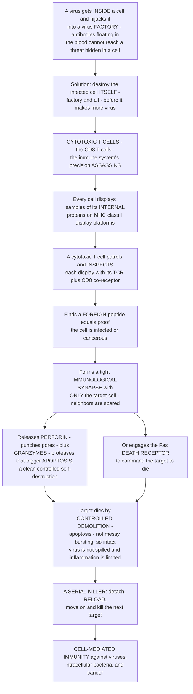

# 🗡️ Cytotoxic T Cells and Cell-Mediated Immunity

> [!abstract] TL;DR
> **Cytotoxic T lymphocytes (CTLs**, the **CD8⁺ T cells)** are the immune system's **precision assassins** — the effector cells that directly **kill** the body's own **infected, cancerous, or otherwise abnormal cells**. They exist to solve a problem antibodies cannot touch: when a virus gets *inside* a cell and hijacks it into a virus factory, or when a cell turns malignant, the threat is **hidden within**, and the only cure is to **destroy the compromised cell itself, factory and all**. CTLs do this with surgical specificity. Every nucleated cell continuously displays samples of its internal proteins on **MHC class I** molecules; a CTL patrols and **inspects** these displays with its **T-cell receptor (TCR) plus CD8 co-receptor**, and if it finds a **foreign peptide** — proof of infection or malignancy — it forms a tight, polarized **immunological synapse** with *only* that target cell and delivers a **focused lethal payload**. The killing uses two mechanisms: the main one is **directed release of cytotoxic granules** containing **perforin** (which delivers cargo across the target membrane) and **granzymes** (proteases that activate caspases inside the target); the second engages the **Fas death receptor**. Both drive the target into clean, controlled **apoptosis** rather than messy necrotic bursting — a controlled demolition that avoids spilling intact virus and limits inflammation. And a single CTL is a **serial killer**: it detaches, reloads, and moves on to the next target, dispatching many cells in sequence. This **cell-mediated immunity** is the essential defense against **viruses, intracellular bacteria and parasites, and tumors**, and it is the biological foundation of the **cancer-immunotherapy** revolution. *(Educational immunology at textbook level — not individual medical advice.)*

---

## Intuition

**Analogy — some enemies can't be reached, so you must destroy the building they hide in.** Antibodies are like patrol boats guarding the open water between cells: they can intercept a free virus drifting through the bloodstream, latch onto a toxin, and neutralize threats in the *open*. But a virus is not stupid. Its whole strategy is to get *inside* a cell, lock the door, and reprogram that cell's own machinery into a **virus factory** churning out thousands of copies of itself. Now the patrol boats are useless — the threat is hidden *within* one of your own buildings, behind walls antibodies can never cross. The situation is drastic, and so is the solution: **you cannot save the building; you must demolish it, factory and all, before it produces more virus.** This is the job of the **cytotoxic T cell** — the immune system's precision **assassin**.

Here is how it kills with surgical care rather than blunt force. Every cell in your body is legally required to **hold up samples of the proteins it is making inside** — placing them on molecular "display platforms" called **MHC class I** that stud almost every cell surface. A cytotoxic T cell walks the halls and **inspects these displays** one by one with its receptor. On a healthy cell it finds only ordinary self-parts and moves on. But on an infected cell, the display is contaminated with **foreign viral peptides** — undeniable proof that something alien is being manufactured inside. That is the trigger. The CTL then does something remarkable: it forms a **tight junction — an "immunological synapse" — with only the guilty cell**, sealing itself against that one target so its weapons fire in a *focused direction*. The neighboring healthy cells, pressed right up against the target, are **spared**.

The weapon itself is a pair of chemicals released into that sealed gap. **Perforin** punches its way across the target's membrane; **granzymes** slip through and flip the target's own **self-destruct switch** — triggering **apoptosis**, a clean, controlled, silent form of cell suicide. (A backup weapon, the **Fas "death receptor,"** lets the CTL simply *command* the target to die.) Crucially, the cell is made to undergo **controlled demolition, not a messy explosion**: apoptosis packages the dying cell — and the virus inside it — into tidy fragments, rather than bursting and spraying live virus everywhere. And then the assassin does what makes it so efficient: it **detaches, reloads its granules, and moves on to the next target** — a genuine **serial killer**, dispatching one compromised cell after another. To understand cytotoxic T cells is to understand the immune system's answer to hidden, intracellular threats: the **targeted killing of the body's own compromised cells**.

---

## How It Works

### Core mechanics — recognize the inside, synapse, deliver death, reload

1. **The problem CTLs solve.** Antibodies operate in the **extracellular** world; they cannot touch a pathogen already replicating *inside* a cell, nor a cell whose *own* genes have gone malignant. The internal state of a cell must therefore be **reported** and, when compromised, the cell must be **eliminated from within the immune system's own ranks**. Cytotoxic T cells are that elimination arm — **cell-mediated immunity** against **intracellular** threats.
2. **What a CTL recognizes.** A CTL's **T-cell receptor (TCR)**, aided by the **CD8 co-receptor**, reads **peptide bound to MHC class I**. Because class I is expressed on **virtually every nucleated cell** and samples the **cytosolic proteome** (proteins made *inside*), the CTL is effectively **surveying the internal contents of every cell in the body**. A **foreign peptide** on class I means a virus, an intracellular microbe, or a mutated tumor protein is being made inside — the license to kill.
3. **Priming — how a naïve CD8 T cell becomes an armed killer.** A naïve CD8 T cell is *not* yet a weapon. It must first be **activated in a lymph node by a dendritic cell** presenting the relevant peptide-MHC-I — often via **cross-presentation** (routing *engulfed* external antigen onto the dendritic cell's *own* class I) — together with **costimulation** and, usually, **help/"licensing" from a CD4⁺ helper T cell**. This priming drives **clonal expansion**: one antigen-specific precursor proliferates into thousands of **armed effector CTLs** that then leave the lymph node to hunt infected tissue.
4. **Search and specificity.** An effector CTL crawls through tissue, transiently touching cells and scanning their class-I displays. It ignores cells showing only **self-peptide** and stops only when its TCR engages a cell showing **its specific foreign peptide** — exquisite specificity that ensures healthy bystanders are not attacked.
5. **The immunological synapse.** On recognition, the CTL forms a **tight, organized, polarized contact** with the target — the **immunological synapse**. Adhesion molecules form a sealing ring; the CTL's internal machinery (microtubule-organizing center and secretory granules) **reorients toward the contact point**, so that whatever it secretes is delivered in a **focused direction into the sealed gap** — hitting the target and *only* the target.
6. **Killing mechanism 1 — granule exocytosis (the main pathway).** The CTL releases pre-formed **cytotoxic granules** into the synapse. These contain **perforin** (which, in the presence of calcium, helps deliver cargo across the target's membrane), **granzymes** (serine proteases that enter the target cytosol and cleave/activate **caspases** and other substrates → **apoptosis**), and **granulysin**. The result: the target's *own* death program is switched on from within.
7. **Killing mechanism 2 — the death-receptor pathway.** The CTL expresses **Fas ligand (FasL)**, which engages **Fas (CD95)** on the target. This clusters the receptor's intracellular **death domains**, recruits adaptors, and activates **caspase-8 → apoptosis** — a receptor-triggered command to die, complementary to the granule route.
8. **Why apoptosis, not necrosis.** Both pathways converge on **apoptosis** — a **clean, controlled self-destruction** in which the cell condenses, fragments, and is packaged for tidy removal. This is deliberate: apoptosis **avoids bursting the cell open and spilling intact, infectious virus**, and it **limits inflammation**, unlike messy necrotic lysis. Controlled demolition, not an explosion.
9. **Cytokines too.** Beyond direct killing, effector CTLs secrete **IFN-γ** and **TNF**, which have direct antiviral effects, up-regulate MHC-I on neighboring cells (making them easier to survey), and activate macrophages.
10. **Serial killing and the response arc.** A single CTL, after triggering apoptosis in one target, **detaches, replenishes its granules, and kills again** — one CTL clears **many** targets in sequence. After the pathogen is controlled, the population **contracts** (most effector CTLs die), leaving a small pool of long-lived **memory CD8 T cells** (central-memory, effector-memory, and tissue-resident subsets) that respond faster on re-exposure.

### The cytotoxic T cell, end to end



---

## Key Concepts

### Secondary (intuitive foundation)

- **Antibodies can't reach a hidden enemy.** Once a virus is *inside* a cell, patrolling antibodies are useless. The only fix is to **destroy the infected cell itself** — that is what cytotoxic T cells do.
- **Every cell shows its inside.** Cells hold up samples of their internal proteins on **MHC class I** platforms. A cytotoxic (CD8) T cell **inspects** these; a **foreign** sample means the cell is infected, so it gets killed.
- **A precise, focused kill.** The killer forms a tight seal (**immunological synapse**) with *only* the guilty cell and fires its weapons in one direction, so **healthy neighbors are spared**.
- **Controlled demolition, not an explosion.** The target is made to quietly self-destruct (**apoptosis**) instead of bursting, so live virus isn't sprayed everywhere.
- **A serial killer.** One cytotoxic T cell doesn't kill just once — it **detaches, reloads, and kills again and again**, clearing many infected cells.

### Undergraduate (mechanistic detail)

- **Identity and restriction.** CTLs are **CD8⁺** T cells; their TCR recognizes **peptide-MHC class I** with **CD8** binding a conserved region of class I. This is **MHC-I restriction** — they see the *endogenous* (intracellular) proteome.
- **Priming requirements.** Naïve CD8 activation needs **signal 1** (peptide-MHC-I on a dendritic cell, frequently via **cross-presentation**), **signal 2** (costimulation, e.g., CD28–B7), and often **CD4⁺ helper "licensing"** of the dendritic cell (CD40–CD40L). Then **clonal expansion** into effector CTLs.
- **Granule exocytosis pathway.** Directed secretion of **perforin** + **granzyme B** (and A, granulysin) into the synapse; granzymes activate **caspase-3** directly and via the mitochondrial (BID) route → **apoptosis**. Perforin enables granzyme entry across the target membrane.
- **Death-receptor pathway.** **FasL (CD178)** on the CTL ligates **Fas (CD95)** on the target → DISC assembly → **caspase-8** → apoptosis. Complementary, especially in sustained responses and immune regulation.
- **Effector cytokines.** **IFN-γ** (antiviral, up-regulates MHC-I, activates macrophages) and **TNF** amplify and broaden the response beyond direct lysis.
- **Response kinetics.** **Expansion → peak effector killing → contraction (~90–95% die) → memory.** Memory subsets: **central-memory (T_CM)**, **effector-memory (T_EM)**, and **tissue-resident memory (T_RM)**.

### Graduate (systems, evasion, and therapy)

- **CTLs vs NK cells — closing the loophole.** Both kill via **perforin/granzymes**, but CTLs are **antigen-specific and MHC-I-restricted** (they must *see* the foreign peptide), whereas **NK cells** detect **"missing self"** — cells that have **down-regulated MHC-I**. Since viruses and tumors often *hide* by shedding class I to evade CTLs, that very move makes them **NK targets** — the two systems together seal the escape route.
- **Immune evasion.** Pathogens and tumors counter CTLs by **MHC-I down-regulation**, **blocking antigen processing (TAP inhibition)**, expressing **serpins/anti-apoptotic proteins**, decoy Fas signaling, and inducing **T-cell exhaustion** (sustained antigen → PD-1/LAG-3/TIM-3 up-regulation, loss of effector function).
- **Exhaustion and checkpoints.** Chronic infection and tumors drive CTLs into an **exhausted** transcriptional state. **Checkpoint-inhibitor immunotherapy** (anti-PD-1/PD-L1, anti-CTLA-4) **releases the brakes**, restoring CTL killing — a Nobel-winning insight (Allison & Honjo, 2018).
- **Engineered cytotoxicity.** **CAR-T cells** graft a synthetic **chimeric antigen receptor** onto a patient's T cells so they kill **MHC-independently** by surface antigen (e.g., CD19 in B-cell leukemia); **TCR-engineered T cells** retarget CTLs to defined tumor peptide-MHC. Both weaponize the natural CTL killing machinery.
- **Immunopathology.** CTL killing is a **double-edged sword**: much of the tissue damage in **viral hepatitis** is CTL-mediated (killing infected hepatocytes), and **autoreactive CTLs** destroy **pancreatic β-cells in type 1 diabetes**. In **transplantation**, recipient CTLs attack **allograft** cells bearing foreign MHC (acute cellular rejection).
- **Quantitative killing.** A hallmark is **serial killing** — measured single-CTL kill rates and conjugate/detachment dynamics — so that a modest CTL:target ratio can clear a large infected-cell load, the logic explored in the demo below.

---

## Python Demo

Two ideas define the cytotoxic T cell, and this simulation models both: **(a) serial killing / target clearance** — a CTL as a *serial killer* that engages, kills, detaches, and **reloads** before the next target, so that even a modest number of CTLs can **outpace a spreading viral infection** and clear it (compared with the untreated case that runs away); and **(b) specificity** — CTLs kill **only** cells that display **foreign peptide-MHC-I** above a recognition **threshold**, so infected **targets** die while healthy **bystanders** (showing only self-peptide) are **spared**.

```python
# Cytotoxic T cells: (a) serial killing controls a viral infection,
# (b) specificity spares bystanders. numpy + matplotlib.
import numpy as np
import matplotlib.pyplot as plt

rng = np.random.default_rng(42)

# ============================================================
# PART A - SERIAL KILLING: CTLs clear a spreading viral infection
# ============================================================
# Each CTL is a SERIAL KILLER: engage a target, trigger apoptosis, then RELOAD
# (a refractory period) before moving on. We track infected cells over time for
# several CTL numbers, including the untreated (no-CTL) control that runs away.

def simulate_infection(n_ctl, steps=200, I0=50, carrying=2000,
                       spread=0.06, reload_steps=4, seed=0):
    """Discrete-time model: infected cells spread while serial-killing CTLs clear them."""
    r = np.random.default_rng(seed)
    I = float(I0)                        # infected-cell count
    reload_timer = np.zeros(n_ctl)       # steps until each CTL is ready to kill again
    history = []
    for t in range(steps):
        # (1) the virus spreads: infected cells recruit new infected cells (logistic growth)
        I += max(spread * I * (1 - I / carrying), 0.0)
        # (2) serial killing: every READY CTL kills one infected cell, then reloads
        ready = reload_timer <= 0
        kills = min(int(ready.sum()), int(I))     # cannot kill more cells than exist
        I -= kills
        just_killed = np.where(ready)[0][:kills]
        reload_timer[just_killed] = reload_steps  # killers enter their refractory period
        reload_timer[~ready] -= 1                 # everyone else counts down toward "ready"
        I = max(I, 0.0)
        history.append(I)
    return np.array(history)

steps    = 200
ctl_sets = [(0,   "no CTLs (uncontrolled)", "#6b7280"),
            (15,  "15 CTLs",                "#f59e0b"),
            (40,  "40 CTLs",                "#2563eb"),
            (100, "100 CTLs",               "#b91c1c")]
curves = [(lab, col, simulate_infection(n, steps=steps, seed=i))
          for i, (n, lab, col) in enumerate(ctl_sets)]

# ============================================================
# PART B - SPECIFICITY: only FOREIGN-peptide-displaying cells are killed
# ============================================================
# Infected TARGETS present many foreign peptide-MHC-I copies; healthy BYSTANDERS
# present essentially none (self-peptide only). The TCR fires its lethal hit only
# ABOVE a recognition threshold -> targets die, bystanders are spared.
n_cells       = 400
is_target     = rng.random(n_cells) < 0.40
foreign_pmhc  = np.where(is_target,
                         rng.normal(80, 20, n_cells),   # infected: high foreign load
                         rng.normal(3, 2, n_cells))     # bystander: near-zero (self only)
foreign_pmhc  = np.clip(foreign_pmhc, 0, None)

THRESHOLD, STEEP = 20.0, 0.25                            # steep, cooperative TCR triggering
p_kill = 1 / (1 + np.exp(-STEEP * (foreign_pmhc - THRESHOLD)))
killed = rng.random(n_cells) < p_kill

# ---- Plots ----
fig, (ax1, ax2) = plt.subplots(1, 2, figsize=(13, 5))

# Panel 1: serial killing controls the infection
for lab, col, c in curves:
    ax1.plot(range(steps), c, lw=2, color=col, label=lab)
ax1.set_title("Serial killing controls a viral infection\n(one CTL kills many targets in sequence)")
ax1.set_xlabel("time step"); ax1.set_ylabel("infected cells")
ax1.legend(); ax1.grid(alpha=0.3)

# Panel 2: specificity - foreign peptide-MHC-I density vs kill outcome
xs  = np.linspace(0, foreign_pmhc.max(), 200)
sig = 1 / (1 + np.exp(-STEEP * (xs - THRESHOLD)))
ax2.plot(xs, sig, color="#111827", lw=2, label="TCR kill probability")
ax2.axvline(THRESHOLD, ls="--", color="#6b7280", label="recognition threshold")
jit = rng.normal(0, 0.02, n_cells)
mb = ~is_target
ax2.scatter(foreign_pmhc[mb], killed[mb] + jit[mb], s=18, color="#16a34a",
            alpha=0.6, label="bystander (self only) -> spared")
mt = is_target
ax2.scatter(foreign_pmhc[mt], killed[mt] + jit[mt], s=18, color="#dc2626",
            alpha=0.6, label="infected target (foreign) -> killed")
ax2.set_title("Specificity: only cells showing FOREIGN\npeptide-MHC-I are killed - bystanders spared")
ax2.set_xlabel("foreign peptide-MHC-I copies per cell")
ax2.set_ylabel("killed (1) vs spared (0)")
ax2.legend(fontsize=8); ax2.grid(alpha=0.3)

plt.tight_layout()
plt.savefig("cytotoxic_t_cell_killing.png", dpi=120)
plt.show()

# ---- printed specificity stats ----
print(f"Infected targets killed  (sensitivity): {killed[is_target].mean():.1%}")
print(f"Healthy bystanders spared (specificity): {1 - killed[~is_target].mean():.1%}")
```

**What it shows.** In **Panel 1**, with **no CTLs** the infection climbs to its carrying capacity; adding CTLs — each one a *serial killer* that reloads and strikes again — bends the curve down, and enough CTLs **outpace viral spread and drive infected cells toward zero**. Because killing is *serial*, a comparatively small CTL:target ratio controls a much larger infected population. In **Panel 2**, the steep TCR threshold cleanly **separates outcomes by antigen**: infected **targets** (high foreign peptide-MHC-I) sit near "killed = 1," while healthy **bystanders** (self-peptide only) sit near "spared = 0" — reproducing the CTL's hallmark **specificity and bystander-sparing**, typically printing near-100% sensitivity and specificity.

---

## Real-World Applications

> **Antiviral defense and viral evasion.** CTLs are the decisive arm against **intracellular viruses** — influenza, CMV, hepatitis B/C, HIV, and SARS-CoV-2 — killing infected cells before they finish producing virus. The evolutionary arms race is visible in evasion: many viruses **down-regulate MHC-I** or **block antigen processing (TAP)** to blind CTLs — which, elegantly, exposes them to **NK-cell "missing-self" killing** instead. Understanding CTL epitopes drives **T-cell-based vaccine** design.

> **Tumor immunosurveillance and cancer immunotherapy.** CTLs continuously survey for cells displaying **mutated (neoantigen) peptides** on class I and kill nascent tumors. This is the biological basis of the **immunotherapy revolution**: **checkpoint inhibitors** (anti-PD-1/PD-L1, anti-CTLA-4) reverse CTL **exhaustion** to unleash killing; **CAR-T cells** (e.g., CD19-directed for B-cell leukemia/lymphoma) and **TCR-engineered T cells** retarget the CTL killing machinery onto tumors; and **neoantigen vaccines** prime tumor-specific CTLs.

> **Transplant rejection.** Recipient **CD8⁺ CTLs recognize foreign (allogeneic) MHC-I** on graft cells and kill them — the cellular engine of **acute cellular rejection**. This is precisely why organs are **HLA-matched** and why transplant patients receive **immunosuppression** that blunts CTL priming and effector function.

> **Immunopathology and autoimmunity.** CTL killing damages the host when misdirected: in **viral hepatitis**, much liver injury comes from CTLs destroying infected hepatocytes; in **type 1 diabetes**, autoreactive CTLs kill insulin-producing **pancreatic β-cells**. Diseases of the killing machinery itself — e.g., **perforin deficiency** — cause **familial hemophagocytic lymphohistiocytosis (HLH)**, a hyperinflammatory syndrome, underscoring how essential controlled cytotoxicity is.

---

## Common Pitfalls

- **"Antibodies handle viruses, so who needs killer T cells?"** Antibodies neutralize **free, extracellular** virus and toxins, but they are **blind to a virus already replicating inside a cell**. CTLs exist precisely for the **intracellular** phase — the two arms are complementary, not redundant.
- **"CD8 CTLs and CD4 helper T cells do the same thing."** No. **CD8⁺ CTLs read MHC class I and KILL** infected/abnormal cells; **CD4⁺ helper T cells read MHC class II and COORDINATE** (help B cells, license dendritic cells, activate macrophages). Killer vs coordinator, class I vs class II.
- **"CTLs make targets explode (lyse) like complement does."** They induce **apoptosis** — a *controlled, silent* self-destruction — specifically to **avoid bursting the cell and releasing intact virus**, and to limit inflammation. Perforin is a **cargo-delivery** tool for granzymes, not primarily a "burst the cell" pore.
- **"Perforin alone kills the target."** Perforin's key role is to **help granzymes enter** the target cytosol; the **granzymes** then activate **caspases** to run the target's apoptosis program. It is a two-part payload.
- **"A cell that hides its MHC-I is safe."** The opposite. **Missing self** removes the inhibitory signal to **NK cells**, which then kill the class-I-low cell — closing the very loophole viruses and tumors use to escape CTLs.
- **"One CTL kills one target and is spent."** CTLs are **serial killers**: after triggering apoptosis they **detach, reload granules, and kill again**, so a small number of CTLs can clear a large infected-cell load.
- **"CTL killing is always protective."** CTL cytotoxicity also **causes disease** when misaimed — tissue destruction in hepatitis, β-cell loss in type 1 diabetes, and allograft rejection are all CTL-mediated.

---

## Related Concepts

- [[Biology/11_Microbiology_and_Immunology/The_Adaptive_Immune_System|The Adaptive Immune System]] — the broader clonal-selection framework in which CTLs are the killer effector arm alongside antibodies and helper T cells.
- [[Biology/11_Microbiology_and_Immunology/Viruses|Viruses]] — the paradigmatic intracellular enemy: viral hijacking of a cell into a factory is exactly the threat CTLs evolved to counter, and viral MHC-I down-regulation is their signature evasion move.
- [[Clinical_Medicine/05_Immune_Infectious_and_Hematologic/Infectious_Disease_and_Host_Pathogen_Interaction|Infectious Disease and Host-Pathogen Interaction]] — the clinical stage on which CTL control of intracellular infection, and pathogen counter-strategies, play out.
- [[Clinical_Medicine/01_Foundations_of_Disease_and_Pathophysiology/Neoplasia_and_Cancer_Biology|Neoplasia and Cancer Biology]] — tumor immunosurveillance by CTLs and its failure underlie cancer's escape, and its restoration is the aim of checkpoint and CAR-T immunotherapy.
- [[Clinical_Medicine/01_Foundations_of_Disease_and_Pathophysiology/Cellular_Injury_and_Adaptation|Cellular Injury and Adaptation]] — the apoptosis-vs-necrosis distinction that defines *how* CTLs kill: clean, caspase-driven apoptosis rather than messy necrotic lysis.

*Within the Immunology vault, this note connects to a cluster of siblings developed separately:* **T Cell Development and Thymic Selection** (how CD8 T cells acquire their MHC-I-restricted, self-tolerant receptors), **Helper T Cells and T Cell Subsets** (the CD4 help that "licenses" CTL priming), **The Major Histocompatibility Complex** (the MHC class I display system CTLs inspect), **Natural Killer Cells and Innate Lymphoid Cells** (the perforin/granzyme partner that kills MHC-low "missing-self" cells CTLs cannot see), and **Cancer Immunotherapy and Checkpoint Inhibitors** (the clinical program that unleashes exhausted CTLs against tumors).

---

## Review Questions

1. **(Secondary)** A virus is replicating deep inside one of your lung cells, where antibodies cannot reach it. Explain, using the "inspect the internal display, then demolish the building" idea, how a cytotoxic T cell finds and eliminates that hidden infection — and why it destroys the whole cell rather than trying to save it.
2. **(Undergraduate)** Describe the two killing mechanisms a CTL uses (granule exocytosis vs the Fas death-receptor pathway) and explain why **both converge on apoptosis rather than necrosis**. Then explain the role of the **immunological synapse** in ensuring that only the target — and not neighboring healthy cells — is killed.
3. **(Graduate)** Viruses and tumors frequently **down-regulate MHC class I** to hide from CTLs. Explain why this is a good strategy against CTLs but a *bad* one overall, invoking **NK-cell "missing-self" recognition**. Then connect this to therapy: how do **checkpoint inhibitors** and **CAR-T cells** each restore or bypass CTL killing when tumors evade the normal peptide-MHC-I surveillance pathway?

---

## Sources

- Murphy, K. & Weaver, C. (2022). *Janeway's Immunobiology*, 10th ed. Garland Science — chapters on T-cell-mediated immunity, cytotoxic T cells, and effector mechanisms.
- Abbas, A.K., Lichtman, A.H. & Pillai, S. (2021). *Cellular and Molecular Immunology*, 10th ed. Elsevier — differentiation and effector functions of CD8⁺ cytotoxic T lymphocytes.
- Zhang, N. & Bevan, M.J. (2011). "CD8⁺ T Cells: Foot Soldiers of the Adaptive Immune System." *Immunity* 35(2): 161–168.
- Voskoboinik, I., Whisstock, J.C. & Trapani, J.A. (2015). "Perforin and granzymes: function, dysfunction and human pathology." *Nature Reviews Immunology* 15(6): 388–400.
- Halle, S., Halle, O. & Förster, R. (2017). "Mechanisms and Dynamics of T Cell-Mediated Cytotoxicity In Vivo." *Trends in Immunology* 38(6): 432–443 — quantitative serial killing and in-vivo CTL dynamics.

---

#immunology #cytotoxic-t-cells #cell-mediated-immunity #perforin-granzyme #cd8
