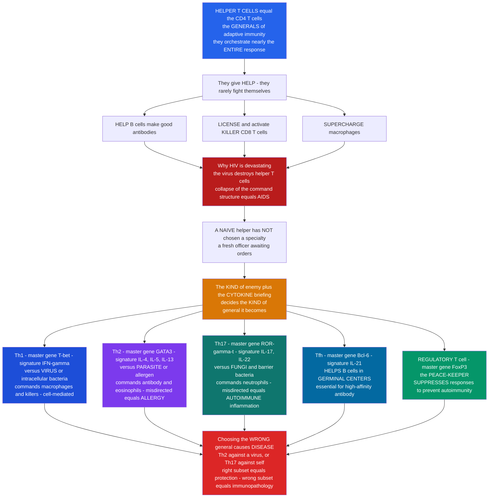

# 🎖️ Helper T Cells and T-Cell Subsets

> [!abstract] TL;DR
> If the immune system is an army, **helper T cells (CD4+ T cells) are the GENERALS**: they do little fighting themselves, but they **orchestrate nearly the entire adaptive response**. They **help B cells** make good antibodies, they **license killer (CD8) T cells**, they **supercharge macrophages**, and they set the whole battle plan — via **cytokines** and **costimulation**. Almost nothing in adaptive immunity happens without them, which is exactly why **HIV is so devastating**: the virus selectively destroys helper T cells, and the collapse of the immune command structure **is AIDS**. The sophisticated part is that there is **not one kind of general**. A **naive** CD4 cell is a fresh officer who has not chosen a specialty; the **kind of enemy**, transmitted as a **cytokine "briefing"** at activation, decides the **kind of general** it becomes. Against a **virus or intracellular bacterium** it becomes **Th1** (T-bet; IFN-γ; commanding macrophages and killers — cell-mediated immunity). Against a **parasite or allergen** it becomes **Th2** (GATA3; IL-4/5/13; commanding antibody and eosinophils — and, misdirected, driving **allergy**). Against **fungi and barrier bacteria** it becomes **Th17** (RORγt; IL-17/22; commanding neutrophils at skin and gut — and, misdirected, driving **autoimmune inflammation**). **Tfh** cells (Bcl-6; IL-21) specialize in **helping B cells in germinal centres**, and **regulatory T cells (Tregs; FoxP3)** are the peace-keepers whose job is to **suppress** responses and prevent friendly fire. Each subset is defined by a **master transcription factor** and a signature cytokine set, and the same **cross-inhibition** that makes the fates mutually exclusive is what makes choosing **wrong** — a Th2 response to a virus, a Th17 response against self — cause disease. Understanding helper T-cell subsets is understanding the **command-and-control logic** of the entire adaptive immune response. *Educational science content, not medical advice.*

---

## Intuition

**Analogy first — the generals who choose their specialty from the battlefield briefing.** Picture the immune system as an army. The infantry, the artillery, the snipers, the demolition crews — those are the B cells, killer T cells, macrophages, neutrophils, and eosinophils that do the actual killing. But an army of specialists without command is a mob. **Helper T cells are the generals.** They rarely fire a shot themselves; instead they **direct** everyone else. A helper T cell walks the B cells through building precisely-shaped antibodies. It hands the killer T cells their kill order (it **licenses** them). It walks up to a struggling macrophage and **supercharges** it into a far more lethal killer. It writes the battle plan and broadcasts it as chemical orders (**cytokines**). Take the generals away and the whole army stands paralysed with its weapons unfired — which is precisely what **HIV** does. HIV specifically infects and destroys **CD4+ helper T cells**, and when the generals fall below a critical number the command structure collapses; opportunistic infections that a healthy army would crush now run wild. **That collapse is what AIDS is.** The single most important reason to understand these cells is that they sit at the exact point of maximum leverage in the whole system.

Now the sophisticated part — and this is where most people's mental model is too simple. There is **not just one kind of general.** A **naive** helper T cell is like a freshly commissioned officer who has graduated but has **not yet chosen a specialty**. Sitting in a lymph node, it waits. When it finally meets its enemy — presented as a peptide on an antigen-presenting cell — it also receives a **briefing**: a specific mix of cytokines that the innate system produced *because of the kind of pathogen it detected*. **That briefing decides what kind of general the officer becomes.** Meet a **virus or an intracellular bacterium**, and the briefing (IL-12, interferons) turns the officer into a **Th1** general — commander of the **cell-mediated campaign**, rallying macrophages and killer T cells. Meet a **parasitic worm or an allergen**, and the briefing (IL-4) makes a **Th2** general — commander of **antibody and eosinophil** warfare (and, when it fires at a harmless pollen, the general behind **allergy**). Meet **fungi or certain bacteria at the barriers**, and the briefing (TGF-β + IL-6) makes a **Th17** general — commander of **neutrophil** defence of skin and gut (and, when it turns on the body's own tissue, a general behind **autoimmune inflammation**). There is a **Tfh** general who specializes entirely in coaching B cells inside **germinal centres** to produce elite, high-affinity antibody. And — crucially — there is the **regulatory T cell (Treg)**, the **peace-keeping general** whose entire job is to **suppress and stand down** the other generals, preventing them from firing on friendly troops or refusing to stop after the enemy is beaten.

The genius, and the danger, is this **flexibility.** Matching the right kind of general to the right kind of threat is enormously powerful: you do not fight a virus the way you fight a tapeworm. But the machinery that lets a naive cell become *any* general also lets it become the **wrong** one — and a Th2 response mounted against a virus, or a Th17 response mounted against your own joints, is not just useless but actively harmful. Each general is locked into its identity by a **master-controller gene** (T-bet, GATA3, RORγt, Bcl-6, FoxP3) and the signature cytokines it deploys, and these master genes **mutually antagonize** each other so that committing to one campaign shuts the others down. Learn the generals, learn their briefings, and learn what happens when the wrong one is chosen, and you have learned the command-and-control system that governs the entire adaptive immune response.

---

## How It Works

### Core Mechanics

1. **Recognition — CD4 reads peptide on MHC class II.** A helper T cell's **T-cell receptor** scans **antigen-presenting cells** (dendritic cells, macrophages, B cells) for its specific **peptide displayed on MHC class II**. The **CD4 co-receptor** is what defines the lineage: it binds a conserved part of **MHC II**, which is why these cells are "CD4+" and why MHC II — loaded with peptides from the *extracellular/vesicular* world — is the helper's window onto the threat (see [[The_Major_Histocompatibility_Complex]] and [[Antigen_Processing_and_Presentation]]).
2. **The THREE signals of activation.** Full activation of a naive CD4 cell requires three inputs delivered together, usually by a mature dendritic cell:
   - **Signal 1 — antigen:** TCR engagement of its **peptide–MHC-II** (see [[T_Cell_and_B_Cell_Receptors]]). This gives *specificity*.
   - **Signal 2 — costimulation:** **CD28** on the T cell binds **B7 (CD80/CD86)** on the activated APC. Signal 1 *without* signal 2 induces **anergy** (unresponsiveness) — a key tolerance checkpoint.
   - **Signal 3 — the polarizing cytokine milieu:** the specific cytokines present at the moment of activation. **This third signal chooses the subset.**
3. **The innate system writes the briefing.** The dendritic cell sensed the pathogen through its **pattern-recognition receptors** (see [[Innate_Immune_Recognition_and_Pattern_Receptors]]) and, depending on *what* it sensed, secretes a characteristic cytokine cocktail. Intracellular microbes → **IL-12**; worms/allergens → an **IL-4**-rich context; fungi/extracellular bacteria at barriers → **TGF-β + IL-6/IL-23**. So the choice of general is ultimately dictated by **the kind of pathogen the innate system detected**.
4. **Cytokines flip a master transcription factor.** Signal 3 activates **STAT** proteins that switch on a **master (lineage-defining) transcription factor**, which reprograms the cell into a subset:
   - **IL-12 + IFN-γ → STAT4/STAT1 → T-bet → Th1.**
   - **IL-4 → STAT6 → GATA3 → Th2.**
   - **TGF-β + IL-6 → STAT3 → RORγt → Th17.**
   - **TGF-β alone (no IL-6) → FoxP3 → induced Treg.**
   - **IL-6/IL-21 → Bcl-6 → Tfh.**
5. **Cross-inhibition makes fates mutually exclusive and self-reinforcing.** Each master factor **promotes its own program and represses the others** (T-bet ⊣ GATA3, GATA3 ⊣ T-bet, FoxP3 ⊣ RORγt, etc.), and each subset secretes cytokines that **amplify its own lineage and block the alternatives** (IFN-γ reinforces Th1 and suppresses Th2/Th17; IL-4 reinforces Th2 and suppresses Th1). This positive-feedback-plus-mutual-repression wiring is a **bistable switch**: it converts a graded cytokine bias into a **committed, stable, all-or-nothing** cell identity.
6. **The effector generals deliver "help."** Once polarized, the subset acts through its **signature cytokines**: Th1's **IFN-γ** licenses CD8 killers and activates macrophages; Th2's **IL-4/5/13** drives IgE class-switching and eosinophils; Th17's **IL-17/22** recruits neutrophils and fortifies epithelial barriers; **Tfh's IL-21** and CD40L drive the germinal-centre reaction that produces high-affinity antibody (the B-cell side of this is the germinal-centre story).
7. **Tregs impose the peace.** **Regulatory T cells** (master factor **FoxP3**; classically **CD4+CD25+**) actively **suppress** other T cells and APCs — by consuming **IL-2**, out-competing costimulation via **CTLA-4**, and secreting inhibitory **IL-10/TGF-β**. The running **effector-vs-Treg balance** decides whether a response *proceeds* (immunity) or is *held down* (tolerance).
8. **Right subset = protection; wrong subset = disease.** Appropriate polarization clears the threat; **inappropriate** polarization (Th2 against a virus, Th17 or lost Treg control against self) produces **failed defence, allergy, or autoimmunity** — the price of the system's flexibility.

### Flow / Architecture



---

## Key Concepts

### Secondary — the big picture

- **Helper T cells (CD4+) are the generals.** They do not do most of the killing; they **direct** the rest of the immune system by sending chemical orders called **cytokines**.
- **They help almost everyone:** they help **B cells** make good antibodies, they switch on **killer T cells**, and they boost **macrophages**. Take them away and the whole system barely works.
- **This is why HIV is so serious.** HIV kills helper T cells; when too many are gone, the immune command structure collapses and ordinary germs become deadly. That collapse **is AIDS**.
- **A naive helper has not picked a job yet.** When it meets an enemy, the *kind* of enemy — signalled by a mix of cytokines — decides what **kind** of general it becomes.
- **The main types:** **Th1** (fights viruses and intracellular bacteria, bosses macrophages and killers), **Th2** (fights parasites, drives antibody and eosinophils, and when misaimed causes **allergy**), **Th17** (defends skin and gut against fungi with neutrophils, and when misaimed drives **autoimmune inflammation**), **Tfh** (coaches B cells to make great antibodies), and **Treg** (the peace-keeper that **shuts responses down** to protect the body's own tissue).
- **Choosing the wrong general causes disease** — the right response for a worm is exactly the wrong response for a virus.

### Undergraduate — mechanisms and distinctions

- **CD4 restriction.** Helper T cells recognize **peptide + MHC class II**; the **CD4 co-receptor** binds MHC II, restricting helpers to antigens sampled from the **extracellular/endosomal** compartment and presented by **professional APCs** (dendritic cells, macrophages, B cells).
- **Three-signal activation.** *Signal 1* = TCR–peptide–MHC-II (specificity); *Signal 2* = **CD28↔B7 costimulation** (survival/commitment; its absence → **anergy**); *Signal 3* = **polarizing cytokines** (subset choice). This same three-signal logic underlies T-cell activation generally, including the priming of cytotoxic T cells.
- **The subset table (master TF + signature cytokines + role):**

| Subset | Master TF | Inducing cytokines | Signature output | Defends against | Misdirected → disease |
|---|---|---|---|---|---|
| **Th1** | **T-bet** | IL-12, IFN-γ | **IFN-γ**, TNF | intracellular bacteria, **viruses** | chronic inflammation, some autoimmunity |
| **Th2** | **GATA3** | IL-4 | **IL-4, IL-5, IL-13** | helminths / **parasites** | **allergy**, asthma, atopy |
| **Th17** | **RORγt** | TGF-β + IL-6/IL-23 | **IL-17, IL-22** | **fungi**, extracellular bacteria at barriers | psoriasis, IBD, **autoimmune** inflammation |
| **Tfh** | **Bcl-6** | IL-6, IL-21 | **IL-21**, CD40L | (helps B cells make high-affinity Ab) | autoantibody, lupus-type disease |
| **Treg** | **FoxP3** | TGF-β (no IL-6), IL-2 | IL-10, TGF-β, CTLA-4 | (suppresses to keep tolerance) | loss → **autoimmunity (IPEX)** |

- **How Th1 and Th2 "help."** **Th1** cells secrete **IFN-γ**, which is the classic macrophage activator (turning a permissive macrophage into a microbe-killing one) and a key co-signal licensing **CD8 cytotoxic** killing — the **cell-mediated** arm. **Th2** cells secrete **IL-4/IL-13** (driving B-cell class-switch to **IgE**) and **IL-5** (recruiting **eosinophils**) — the anti-helminth and, when misfired, the **allergic** arm.
- **Th17 and barrier defence.** **Th17** cells secrete **IL-17** (recruits **neutrophils**, induces antimicrobial peptides) and **IL-22** (reinforces epithelial barrier integrity) — critical at **skin, gut, and lung**, and a central driver of several **autoimmune** conditions when dysregulated.
- **Tfh and the germinal centre.** **Tfh** cells migrate into B-cell follicles and, via **CD40L** and **IL-21**, drive the **germinal-centre reaction** — the site of **somatic hypermutation, affinity maturation, and class switching** that produces high-affinity antibody and memory (the B-cell activation / germinal-centre story is the complementary note).
- **Tregs and peripheral tolerance.** **FoxP3+ Tregs** come in two flavours — **thymic (natural)** Tregs selected in the thymus, and **peripherally-induced** Tregs generated from naive cells under **TGF-β**. They enforce **peripheral tolerance** (suppressing self-reactive cells that escaped thymic selection) by **IL-2 consumption**, **CTLA-4**-mediated stripping of B7 from APCs, and **IL-10/TGF-β** secretion.
- **Differentiation as a decision.** Because the master TFs **cross-repress**, and each subset's cytokines **feed back** to reinforce itself and inhibit the others, the cytokine milieu at priming is a **switch**, not a dial — the cell commits to one stable identity.

### Graduate — depth and consequences

- **STAT-to-master-TF wiring.** Each inducing cytokine acts through a specific **JAK-STAT** pathway that induces the master TF: IL-12→**STAT4** and IFN-γ→**STAT1** (with **T-bet**); IL-4→**STAT6** (with **GATA3**); IL-6/IL-23/IL-21→**STAT3** (with **RORγt** or **Bcl-6**); IL-2→**STAT5** (stabilizing **FoxP3**). STAT5 (IL-2) and STAT3 (IL-6) are **antagonistic** at the *Foxp3/Rorc* loci — a molecular fulcrum for the **Treg-vs-Th17** decision, both of which require TGF-β but diverge on the presence of **IL-6**.
- **Bistability and plasticity.** Mutual cross-inhibition of master TFs, formalized as a **toggle switch**, yields **bistable, hysteretic** commitment: the fate depends not only on current cytokines but on the cell's history, and small biases resolve into discrete states. Yet lineages are **not irreversibly fixed** — **plasticity** (e.g., Th17→Th1 "ex-Th17," Treg→Tfh interconversion, hybrid Th1/Th17 cells) is now recognized, especially at inflamed sites, complicating the strict subset picture.
- **The innate instruction model.** The subset is ultimately chosen by the **innate immune system**: pathogen features engage specific **PRRs** on dendritic cells, shaping the DC's cytokine and costimulatory output, which becomes **signal 3**. Thus the qualitative "kind of response" is decided **before** the adaptive cell commits — a key reason adjuvants (which bias DC output) shape vaccine-induced T-cell polarity.
- **Treg suppression mechanisms, dissected.** (i) **Metabolic** — high-affinity **CD25 (IL-2Rα)** lets Tregs sink IL-2, starving effectors; (ii) **Costimulatory** — **CTLA-4** trans-endocytoses **B7** off APCs, removing signal 2; (iii) **Cytokine** — **IL-10, TGF-β, IL-35**; (iv) **Cytolytic** and **adenosine (CD39/CD73)** pathways. FoxP3 is the lineage master but requires stabilizing signals (IL-2, TGF-β, TCR tone, epigenetic demethylation of the **CNS2/TSDR** region) to remain committed.
- **Clinical spectra as subset balance.** The **Th1/Th2 balance** is textbook in **leprosy**: **tuberculoid** leprosy (strong Th1/cell-mediated, few bacilli, contained) vs **lepromatous** leprosy (Th2-skewed, poor macrophage activation, high bacterial load) — the *same* organism, opposite outcomes set by helper polarization. Similar logic explains outcome variation in leishmaniasis and tuberculosis.
- **Disease of the master genes.** Loss-of-function **FOXP3** mutation causes **IPEX** (Immune dysregulation, Polyendocrinopathy, Enteropathy, X-linked) — fatal multi-organ **autoimmunity** from missing Tregs — the cleanest human proof that one subset polices tolerance. Conversely, **Th17/IL-17–IL-23 axis** dysregulation underlies psoriasis, ankylosing spondylitis, and IBD, now targeted by anti-IL-17/anti-IL-23 biologics.
- **HIV immunopathogenesis, precisely.** HIV's envelope uses **CD4** (plus CCR5/CXCR4) as its receptor, so it **specifically infects helper T cells**; progressive CD4 depletion (clinically tracked by **CD4 count**) removes help for CTLs, B cells, and macrophages simultaneously — hence the broad **opportunistic infection** susceptibility that defines **AIDS**. This is the immune system's single point of failure made manifest (see [[Hypersensitivity_Allergy_and_Immunodeficiency]]).
- **Therapeutic exploitation.** **CD4-directed and cytokine-axis therapeutics** are now mainstream: anti-IL-4Rα (dupilumab, Th2/allergy), anti-IL-17/IL-23 (Th17 diseases), anti-IL-2 receptor and **CTLA-4-Ig (abatacept)** to blunt help, low-dose **IL-2** and adoptive **Treg therapy** to *boost* tolerance (autoimmunity, transplant), and, at the opposite pole, **checkpoint blockade** (anti-CTLA-4/PD-1) to *release* T-cell help against tumours (see [[Antibodies_and_Biologics]]).
- **Memory and the response arc (foreshadow).** After the effector burst contracts, a subset of helpers persists as **central and effector memory** cells, retaining much of their polarization; helper memory is a major contributor to **durable immunity** and to the rapid, high-quality antibody of secondary responses (the immunological-memory story is the companion note).

---

## Python Demo

```python
# Helper T-cell subsets, quantified three ways:
#   (1) CYTOKINE-DRIVEN FATE: the polarizing cytokine milieu present when a naive
#       CD4 cell is activated decides its subset. We score differentiation
#       propensity toward Th1/Th2/Th17/Treg across defined milieus and read off
#       the WINNING fate (argmax) for each briefing.
#   (2) BISTABLE SWITCH: the master transcription factors cross-inhibit
#       (T-bet <-> GATA3). Modeled as a toggle switch, sweeping the polarizing
#       bias (IL-12 favoring T-bet vs IL-4 favoring GATA3) produces a sharp,
#       HYSTERETIC commitment -> a naive cell snaps into Th1 OR Th2, not a blend.
#   (3) EFFECTOR-vs-TREG BALANCE: whether a response proceeds (immunity) or is
#       held down (tolerance) is set by the effector:Treg ratio. We plot the
#       tipping between immunity and tolerance as Treg suppression rises.
import numpy as np
import matplotlib.pyplot as plt

fig, ax = plt.subplots(2, 2, figsize=(13, 9))

# ---- (1) Cytokine-driven fate: milieu -> subset propensity ----
milieus = ["IL-12\n+ IFN-g", "IL-4", "TGF-b\n+ IL-6", "TGF-b\nalone", "IL-6\n+ IL-23"]
subsets = ["Th1", "Th2", "Th17", "Treg"]
scol    = ["#1d4ed8", "#7c3aed", "#0f766e", "#059669"]
#  rows = milieu, cols = subset propensity (0-1), from canonical biology
P = np.array([
    [0.90, 0.05, 0.03, 0.02],   # IL-12 + IFN-g  -> Th1
    [0.05, 0.88, 0.05, 0.02],   # IL-4           -> Th2
    [0.03, 0.05, 0.87, 0.05],   # TGF-b + IL-6   -> Th17
    [0.03, 0.05, 0.07, 0.85],   # TGF-b alone    -> Treg
    [0.05, 0.05, 0.80, 0.10],   # IL-6 + IL-23   -> Th17
])
x = np.arange(len(milieus)); w = 0.19
for j, (s, c) in enumerate(zip(subsets, scol)):
    ax[0, 0].bar(x + (j - 1.5) * w, P[:, j], w, label=s, color=c)
for i in range(len(milieus)):                      # star the winning fate
    j = int(np.argmax(P[i]))
    ax[0, 0].text(x[i] + (j - 1.5) * w, P[i, j] + 0.02, "*",
                  ha="center", fontsize=15, color=scol[j])
ax[0, 0].set_xticks(x); ax[0, 0].set_xticklabels(milieus, fontsize=8)
ax[0, 0].set_ylabel("differentiation propensity")
ax[0, 0].set_ylim(0, 1.05)
ax[0, 0].set_title("(1) SIGNAL 3 chooses the general\ncytokine briefing -> subset fate (* = winner)")
ax[0, 0].legend(fontsize=8, ncol=4, loc="upper center")

# ---- (2) Bistable toggle switch: T-bet vs GATA3 cross-inhibition ----
# dx/dt = b_x + a*K^n/(K^n + y^n) - x   (x = T-bet)
# dy/dt = b_y + a*K^n/(K^n + x^n) - y   (y = GATA3)
# b_x/b_y set by cytokine bias; integrate to steady state, sweep bias up then down.
def steady(bias, x0, y0, a=4.0, K=1.0, n=4, dt=0.01, steps=8000):
    x, y = x0, y0
    bx, by = 0.2 + bias, 0.2 + (1 - bias)     # bias in [0,1]: high -> favors T-bet
    for _ in range(steps):
        x += dt * (bx + a * K**n / (K**n + y**n) - x)
        y += dt * (by + a * K**n / (K**n + x**n) - y)
    return x - y                               # >0 Th1 (T-bet), <0 Th2 (GATA3)

biases = np.linspace(0, 1, 120)
up   = []; x0, y0 = 0.1, 3.0                    # start GATA3-high, sweep bias up
for b in biases:
    d = steady(b, x0, y0); up.append(d)
    x0, y0 = (3.0, 0.1) if d > 0 else (0.1, 3.0)
down = []; x0, y0 = 3.0, 0.1                     # start T-bet-high, sweep bias down
for b in biases[::-1]:
    d = steady(b, x0, y0); down.append(d)
    x0, y0 = (3.0, 0.1) if d > 0 else (0.1, 3.0)
down = down[::-1]
ax[0, 1].plot(biases, up,   "-",  color="#1d4ed8", lw=2.4, label="sweep up (was Th2)")
ax[0, 1].plot(biases, down, "--", color="#7c3aed", lw=2.4, label="sweep down (was Th1)")
ax[0, 1].axhline(0, color="gray", lw=1, ls=":")
ax[0, 1].fill_between(biases, 0, 4,  color="#1d4ed8", alpha=0.06)
ax[0, 1].fill_between(biases, -4, 0, color="#7c3aed", alpha=0.06)
ax[0, 1].text(0.82, 2.4, "Th1\n(T-bet)", color="#1d4ed8", ha="center", fontsize=9)
ax[0, 1].text(0.18, -2.6, "Th2\n(GATA3)", color="#7c3aed", ha="center", fontsize=9)
ax[0, 1].set_xlabel("polarizing bias  (0 = IL-4 / 1 = IL-12)")
ax[0, 1].set_ylabel("T-bet minus GATA3  (fate)")
ax[0, 1].set_title("(2) BISTABLE SWITCH: cross-inhibition\nsnaps the cell into ONE fate (note hysteresis)")
ax[0, 1].legend(fontsize=8, loc="lower right")
ax[0, 1].grid(alpha=0.3)

# ---- (3) Subset-function map: which effector axis each general commands ----
subs = ["Th1", "Th2", "Th17", "Tfh", "Treg"]
func = ["Activate\nmacrophage", "License\nCD8 killer", "IgE +\neosinophil",
        "Neutrophil\nbarrier", "B-cell help\ngerminal ctr", "SUPPRESS\ntolerance"]
F = np.array([
    [1.00, 0.90, 0.05, 0.10, 0.20, 0.00],   # Th1
    [0.05, 0.05, 1.00, 0.10, 0.30, 0.00],   # Th2
    [0.10, 0.10, 0.10, 1.00, 0.15, 0.00],   # Th17
    [0.05, 0.05, 0.15, 0.05, 1.00, 0.00],   # Tfh
    [0.00, 0.00, 0.00, 0.00, 0.00, 1.00],   # Treg
])
im = ax[1, 0].imshow(F, cmap="magma", aspect="auto", vmin=0, vmax=1)
ax[1, 0].set_xticks(range(len(func))); ax[1, 0].set_xticklabels(func, fontsize=7)
ax[1, 0].set_yticks(range(len(subs)));  ax[1, 0].set_yticklabels(subs, fontsize=10)
for i in range(F.shape[0]):
    for j in range(F.shape[1]):
        ax[1, 0].text(j, i, f"{F[i, j]:.1f}", ha="center", va="center",
                      color="white" if F[i, j] < 0.6 else "black", fontsize=7)
ax[1, 0].set_title("(3) SUBSET-FUNCTION MAP\neach general commands a distinct effector axis")
fig.colorbar(im, ax=ax[1, 0], fraction=0.046, pad=0.04, label="command strength")

# ---- (4) Effector-vs-Treg balance: immunity vs tolerance tipping point ----
ratio = np.logspace(-1, 1.3, 300)               # effector : Treg ratio
def response(r, potency):                        # sigmoid tipping in log-ratio
    return 1.0 / (1.0 + np.exp(-2.2 * (np.log10(r) - np.log10(1.0 / potency))))
for potency, c, lbl in [(3.0, "#dc2626", "weak Treg suppression"),
                         (1.0, "#d97706", "balanced"),
                         (0.33, "#059669", "strong Treg suppression")]:
    ax[1, 1].plot(ratio, response(ratio, potency), lw=2.5, color=c, label=lbl)
ax[1, 1].axhspan(0.0, 0.5, color="#059669", alpha=0.05)
ax[1, 1].axhspan(0.5, 1.0, color="#dc2626", alpha=0.05)
ax[1, 1].text(0.13, 0.85, "IMMUNITY\n(response proceeds)", color="#b91c1c", fontsize=9)
ax[1, 1].text(3.0, 0.12, "TOLERANCE\n(response suppressed)", color="#047857",
              fontsize=9, ha="left")
ax[1, 1].axhline(0.5, ls=":", color="gray", lw=1)
ax[1, 1].set_xscale("log")
ax[1, 1].set_xlabel("effector : Treg ratio (log)")
ax[1, 1].set_ylabel("response magnitude")
ax[1, 1].set_title("(4) EFFECTOR-vs-TREG BALANCE\ntipping between immunity and tolerance")
ax[1, 1].legend(fontsize=8, loc="center left")
ax[1, 1].grid(alpha=0.3, which="both")

plt.tight_layout()
plt.savefig("helper_t_cells_and_subsets.png", dpi=130)

# ---- quantify the lessons ----
for i, m in enumerate(["IL-12+IFNg", "IL-4", "TGFb+IL-6", "TGFb alone", "IL-6+IL-23"]):
    print(f"(1) Milieu {m:12s} -> fate {subsets[int(np.argmax(P[i]))]}")
switch_up   = biases[np.argmax(np.array(up)   > 0)]
switch_down = biases[np.argmax(np.array(down) > 0)]
print(f"(2) Bistable switch: Th2->Th1 flip at bias ~{switch_up:.2f} when sweeping UP, "
      f"but ~{switch_down:.2f} when sweeping DOWN -> HYSTERESIS (memory of past state).")
print(f"(4) At effector:Treg = 1, strong-suppression response ~"
      f"{response(1.0, 0.33):.2f} (tolerance) vs weak-suppression ~"
      f"{response(1.0, 3.0):.2f} (immunity).")
```

**What the plots show.** Panel (1) is **signal 3 in action**: the *same* naive cell, given different cytokine briefings, commits to different generals — IL-12+IFN-γ → **Th1**, IL-4 → **Th2**, TGF-β+IL-6 → **Th17**, TGF-β alone → **Treg** — the winning fate starred in each column. Panel (2) is the **bistable switch** created by T-bet↔GATA3 **cross-inhibition**: as the polarizing bias is swept, the cell does not blend the two fates — it **snaps** into one, and because the up-sweep and down-sweep flip at *different* bias values (**hysteresis**), the cell "remembers" its history, the hallmark of a committed, self-reinforcing identity. Panel (3) is the **subset-function map**: each general commands a **distinct effector axis** (Th1 → macrophages and CD8 killers; Th2 → IgE and eosinophils; Th17 → neutrophil barrier defence; Tfh → germinal-centre B-cell help; Treg → suppression), making concrete why matching subset to threat matters. Panel (4) is the **effector-vs-Treg balance**: whether a response *proceeds* (immunity) or is *held down* (tolerance) turns on the effector:Treg ratio and Treg potency — the same dial whose failure (too little suppression) yields autoimmunity and whose excess (too much suppression) lets tumours and chronic infections escape.

---

## Real-World Applications

> **HIV/AIDS and the CD4 count (why the generals matter).** HIV enters cells via **CD4**, so it destroys precisely the helper T cells that coordinate everything else. Clinicians literally **count CD4 cells** to stage disease: as the count falls, help for CTLs, B cells, and macrophages evaporates together, and the characteristic **opportunistic infections** of AIDS appear. It is the most vivid clinical demonstration that helper T cells are a single point of failure for the whole adaptive system (see [[Hypersensitivity_Allergy_and_Immunodeficiency]]).

> **Allergy and Th2-axis biologics.** Allergic asthma, atopic dermatitis, and eosinophilic disease are **Th2-driven** (IL-4/IL-5/IL-13, IgE). Modern therapeutics target exactly these nodes: **dupilumab** (anti-IL-4Rα) blocks IL-4/IL-13 signalling, **mepolizumab** (anti-IL-5) starves eosinophils, and **omalizumab** (anti-IgE) disarms the tripwire — each a direct clinical use of knowing which general drives the disease (see [[Antibodies_and_Biologics]]).

> **Th17 and autoimmune inflammation.** Psoriasis, ankylosing spondylitis, and inflammatory bowel disease are substantially **Th17/IL-23-axis** diseases. Blocking this axis — **secukinumab/ixekizumab** (anti-IL-17), **ustekinumab** (anti-IL-12/23 p40), **risankizumab** (anti-IL-23) — has transformed treatment, validating Th17 as the misdirected general behind barrier-tissue autoimmunity (see [[Immune_Dysfunction_and_Autoimmunity]]).

> **Treg therapy and transplant tolerance.** Because **FoxP3+ Tregs** enforce peripheral tolerance, they are being harnessed deliberately: **low-dose IL-2** to expand Tregs, and **adoptive Treg cell therapy** to suppress graft-versus-host disease, autoimmunity, and transplant rejection — the aim being durable **tolerance** without global immunosuppression. The mirror-image is **IPEX syndrome**, where a broken *FOXP3* gene abolishes Tregs and causes fatal early-life autoimmunity.

> **Cancer immunotherapy and checkpoint blockade.** Tumours exploit helper/Treg biology to shut down responses. **Checkpoint inhibitors** (anti-**CTLA-4**, anti-**PD-1**) release the brakes on T-cell help and effector function, unleashing anti-tumour immunity — a therapy built entirely on understanding costimulation, Treg suppression, and the effector-vs-tolerance balance modeled above.

---

## Common Pitfalls

- **Thinking helper T cells "just help a little."** They orchestrate **nearly the entire adaptive response** — antibody quality, CTL licensing, macrophage activation, and memory all depend on CD4 help. "Helper" undersells their role as the system's command layer; their loss (HIV) is catastrophic precisely because so little works without them.
- **Assuming the subset is fixed by the antigen alone.** The subset is chosen by **signal 3** — the cytokine milieu the *innate* system produced after sensing the pathogen via PRRs. The **same peptide** can prime Th1 or Th2 depending on the adjuvant/context; the antigen supplies specificity, not polarity.
- **Confusing MHC I and MHC II for CD4.** Helpers read **peptide on MHC class II** via **CD4**; cytotoxic cells read **MHC class I** via CD8. Swapping these is a classic exam error — MHC II samples the *extracellular/vesicular* world, which is why helpers coordinate responses to it.
- **Treating Th1/Th2/Th17 as rigid, permanent identities.** Real cells show **plasticity** (ex-Th17 → Th1, hybrid states) and the subsets **cross-regulate**. The clean master-TF picture is a first approximation; inflamed tissues blur the lines.
- **Forgetting that Tregs are helpers too.** Tregs are **CD4+** cells whose "help" is **suppression**. Omitting them makes the immune system look like it has an accelerator but no brake — and Treg failure (IPEX) proves the brake is essential.
- **Ignoring the Treg-vs-Th17 fork.** Both need **TGF-β**; the **presence of IL-6** flips the outcome from tolerogenic **Treg** to inflammatory **Th17**. Missing this single-cytokine switch misses why inflammation can convert a would-be regulator into an effector.
- **Believing "more immune response is always better."** A **wrong** or **excessive** response is disease: Th2 against a virus fails, Th17/failed-Treg against self causes autoimmunity, and unchecked help drives allergy. Appropriateness and regulation — not raw magnitude — define a healthy response.
- **Overlooking that IFN-γ activation of macrophages is helper-dependent.** Macrophages become potent killers largely because **Th1-derived IFN-γ** licenses them; a macrophage without helper input often *harbors* rather than kills intracellular microbes (the tuberculoid-vs-lepromatous leprosy contrast).

---

## Related Concepts

- [[The_Major_Histocompatibility_Complex]] — helper T cells are defined by reading **peptide on MHC class II** via their **CD4 co-receptor**; MHC II is the presentation platform that makes the whole helper compartment possible.
- [[Antigen_Processing_and_Presentation]] — the pathway that loads **extracellular/vesicular** peptides onto MHC II in professional APCs, delivering **signal 1** to the naive helper and shaping which antigens generals ever see.
- [[T_Cell_and_B_Cell_Receptors]] — the **TCR** that supplies signal 1 to the helper, and the **B-cell receptor/antibody** on the very B cells that Th and Tfh cells "help" mature.
- [[Innate_Immune_Recognition_and_Pattern_Receptors]] — the **PRRs** on dendritic cells that sense the pathogen and thereby write the **cytokine briefing (signal 3)** that chooses the subset — the innate instruction of adaptive polarity.
- [[Phagocytes_and_Phagocytosis]] — the **macrophages** that Th1's **IFN-γ** "supercharges" into microbe-killers, and the neutrophils that Th17 recruits to barriers.
- [[Cells_of_the_Immune_System]] — places CD4 helpers among the lymphocytes, and identifies the B cells, CD8 killers, eosinophils, and neutrophils that helper subsets command.
- [[Innate_versus_Adaptive_Immunity]] — helpers are the coordinating hub of the **adaptive** arm, yet their polarity is set by **innate** cytokines — the two arms meeting at the subset decision.
- [[Clonal_Selection_and_Immunological_Memory]] — how the specific naive helper clone is selected and expanded, and how **helper memory** contributes to durable, high-quality secondary responses.
- [[The_Adaptive_Immune_System]] — the Biology/11 overview of the B/T-cell system; this note is the deep-dive on the **T-helper command layer** its "T cell" section points to.
- [[Immune_Dysfunction_and_Autoimmunity]] — the clinical face of **wrong** polarization: Th17 dysregulation and **Treg failure (IPEX)** driving autoimmune disease.
- [[Hypersensitivity_Allergy_and_Immunodeficiency]] — **Th2**-driven allergy at one pole and **CD4 depletion (HIV/AIDS)** immunodeficiency at the other — both helper-subset stories.
- [[Antibodies_and_Biologics]] — the Pharmacology view of the **CD4-/cytokine-axis therapeutics** (anti-IL-4Rα, anti-IL-17/23, CTLA-4-Ig, checkpoint blockade) that target the biology in this note.
- [[Gene_Regulation]] — the Biology/04 foundation for **master transcription factors** (T-bet, GATA3, RORγt, FoxP3, Bcl-6) and the cross-repressive, bistable regulatory logic that locks in each subset.

*Siblings in this section, referenced in prose until written: **T-Cell Development and Thymic Selection** (how CD4 lineage and thymic/natural Tregs are made and selected), **Cytotoxic T Cells and Cell-Mediated Immunity** (the CD8 killers that Th1 cells license), **B-Cell Activation and the Germinal Center** (where Tfh cells drive affinity maturation and class switching), and **Cytokines and Immune Signaling** (the signature-cytokine language every subset speaks). General **T-cell activation** (the three-signal model) is covered here and in the cytotoxic/development notes rather than as a separate file.*

---

## Review Questions

**Secondary.** Using the "generals of the immune army" picture, explain why helper T cells are so important that their destruction by **HIV** collapses the whole immune system into **AIDS**. Then explain why there is not just *one* kind of helper general, and give the enemy each of these fights: **Th1**, **Th2**, **Th17**, and what the **regulatory T cell** does instead of fighting.

**Undergraduate.** A naive CD4 T cell is activated by a dendritic cell. List the **three signals** it must receive, and state what happens if it gets signal 1 without signal 2. Then explain how **signal 3** determines whether the cell becomes **Th1** vs **Th2** vs **Treg**, naming the inducing cytokine and the **master transcription factor** for each — and explain why a **Th2** response mounted against a **virus** would be a poor choice.

**Graduate.** **Th17** and **induced Treg** cells *both* require **TGF-β**, yet one is pro-inflammatory and one is tolerogenic. (a) Identify the single additional cytokine that flips the outcome and the STAT/master-TF wiring involved. (b) Using the concept of **mutual cross-inhibition** of master transcription factors, explain why helper fates behave as a **bistable switch** with hysteresis rather than a graded continuum, and one consequence of the observed **plasticity** that complicates this model. (c) Explain, at the level of a single failed gene, why **IPEX** demonstrates that Tregs are indispensable — and contrast this with how **checkpoint blockade** deliberately shifts the effector-vs-Treg balance the other way in cancer therapy.

---

## Sources

- Murphy, K. & Weaver, C. — *Janeway's Immunobiology*, 9th/10th ed. (Garland Science / W. W. Norton). Ch. 9 & 11: T-cell-mediated immunity, CD4 effector subsets, and the differentiation of helper T cells.
- Abbas, A. K., Lichtman, A. H. & Pillai, S. — *Cellular and Molecular Immunology*, 10th ed. (Elsevier). Ch. 10–11 (differentiation and functions of CD4+ effector T cells) and Ch. 15 (immunologic tolerance and regulatory T cells).
- Zhu, J., Yamane, H. & Paul, W. E. — "Differentiation of effector CD4 T cell populations." *Annual Review of Immunology* 28:445–489 (2010). https://doi.org/10.1146/annurev-immunol-030409-101212
- Josefowicz, S. Z., Lu, L.-F. & Rudensky, A. Y. — "Regulatory T cells: mechanisms of differentiation and function." *Annual Review of Immunology* 30:531–564 (2012). https://doi.org/10.1146/annurev.immunol.25.022106.141623
- Zhou, L., Chong, M. M. W. & Littman, D. R. — "Plasticity of CD4+ T cell lineage differentiation." *Immunity* 30(5):646–655 (2009). https://doi.org/10.1016/j.immuni.2009.05.001

---

#immunology #helper-t-cells #th1-th2-th17 #regulatory-t-cells #cd4
