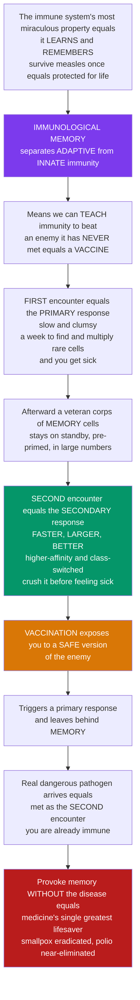

# 🛡️ Immunological Memory and Vaccination Principles

> [!abstract] TL;DR
> The single most miraculous property of the immune system is that it **learns and remembers**: survive **measles** once and you are protected for **life** — your body never forgets that enemy. This **immunological memory** is what separates **adaptive** immunity from **innate**, and it is arguably the most important fact in all of medicine, because it means we can **teach** the immune system to defeat a pathogen it has *never actually met*. The mechanism: the **first** encounter (the **primary response**) is slow and clumsy — it takes a week or more to find the rare matching lymphocytes, multiply them up, and refine the antibodies, and during that delay you get sick (or die). But afterward the body keeps a **veteran corps of memory B and T cells** — specifically trained, pre-primed, and standing by in large numbers. So the **second** encounter (the **secondary/anamnestic response**) is dramatically **faster, larger, and better** — higher-affinity, class-switched antibody that often crushes the pathogen before you feel a thing. **Vaccination** is a brilliant hack of this system: deliberately expose you to a **safe** version of the enemy (killed, weakened, or just a piece — see the vaccine-technology note for platforms) that is safe enough not to cause disease but real enough to trigger a full primary response and leave you with **memory**. When the real pathogen arrives, your body responds as if it were the *second* encounter — you are already immune. This one principle — **provoke memory without the disease** — eradicated **smallpox**, drove **polio** to the brink, and underlies **boosters**, **adjuvants**, and **herd immunity**. *Educational science content, not medical advice.*

---

## Intuition

**Analogy first — a veteran army that never forgets a battle.** Imagine a country invaded for the first time by an enemy it has never seen. The defence is a shambles: it takes a week to figure out who the enemy is, to recruit and train the few soldiers who happen to know how to fight them, and to mass-produce the right weapons. During that scramble the country is overrun and takes heavy damage — you *get sick*. But the country wins in the end, and here is the crucial part: it does **not** simply demobilise and forget. It keeps a permanent **veteran corps** — battle-hardened troops who fought that exact enemy, held on standby in large numbers, weapons pre-loaded, intelligence memorised. If that same enemy ever returns, there is no scramble: the veterans deploy instantly, in force, with better weapons, and crush the invasion **before the population even notices**. That standing veteran corps is **immunological memory**, and it is the immune system's true superpower — the thing that makes *adaptive* immunity fundamentally different from the disposable, always-the-same *innate* defences.

Now the masterstroke. If a veteran corps is what protects you, could you **create one without ever fighting the real war**? Yes — you stage a **training exercise** against a harmless dummy of the enemy: a defeated, disarmed, or cardboard-cutout version that looks real enough to provoke the full mobilise-train-and-remember response, but cannot actually hurt anyone. Afterward you are left with the same veteran corps — ready for the real enemy, which you now meet as if it were the *second* time. That training exercise is a **vaccine**. The first illness (the **primary response**) is slow and dangerous; the veterans it leaves behind make any **secondary response** fast and decisive; and a vaccine buys you the veterans **without the illness**. This one idea — provoke memory without the disease — is the single greatest lifesaver in the history of medicine. It also explains **booster shots** (topping up a veteran corps whose numbers slowly wane), **adjuvants** (convincing the immune system the dummy threat is "real" enough to bother remembering), and **herd immunity** (when enough of the population carries veterans, the enemy can no longer spread at all).

---

## How It Works

### Core Mechanics

1. **Memory is the hallmark of adaptive immunity.** Innate defences respond the same way to every re-exposure; **adaptive** immunity responds *better* the second time. That improvement — a faster, larger, higher-quality response upon re-encountering a specific antigen — *is* immunological memory, and it is a direct consequence of **clonal selection** (a rare matching clone, expanded and preserved).
2. **The primary response is slow because precursors are rare.** On first exposure, only a handful of naive lymphocytes carry a receptor that fits the pathogen. Finding them, activating them, and multiplying them up into an effector army takes **~5–10 days** — the "lag" during which you get sick. Antibody is at first low-affinity and **IgM**-dominant.
3. **Contraction, then a durable memory pool.** After the pathogen is cleared, **~90–95% of effector cells die** (contraction), preventing runaway immunopathology. But a stable subset of antigen-specific **memory B cells and memory T cells** — plus **long-lived plasma cells** in the bone marrow — persists for years to decades.
4. **Memory has three advantages that make the secondary response superior:**
   - **(1) Higher precursor frequency** — instead of a few rare naive cells, thousands of trained cells are already present. Fewer doublings are needed to reach a protective level, so the **lag collapses** (a logarithmic speed-up).
   - **(2) Qualitatively better cells** — memory B cells carry **class-switched, affinity-matured** receptors forged in the **germinal centre**; memory T cells are **pre-differentiated** and reactivate with weaker signals and faster effector output.
   - **(3) Strategic location** — **tissue-resident memory** sits parked at the body's portals of entry (skin, gut, lung), ready to act on contact rather than waiting for cells to traffic from lymph nodes.
5. **The primary/secondary comparison is the defining signature.** Primary: long lag, low peak, IgM, low affinity. Secondary (**anamnestic**): short lag, high peak, class-switched **IgG/IgA**, high affinity. Plotting antibody titer against time and re-challenging is the classic experiment that reveals memory.
6. **Vaccination is applied memory.** A vaccine supplies a **safe antigen** that triggers a primary response and leaves memory, *without* disease — so the real pathogen is met as a secondary response. A good vaccine needs the right **antigen**, an **adjuvant** (the innate "danger" signal that licenses a strong, durable response), the right **response type** (antibody vs T cell; Th polarisation), and **durable memory**. **Prime-boost** schedules and **boosters** top up memory as it wanes.
7. **Active vs passive.** **Active** immunisation induces the *person's own* memory (infection or vaccine) — slow to start but durable. **Passive** immunisation *transfers preformed antibodies* (maternal IgG, antisera, monoclonals) — **immediate but temporary, and leaves no memory**.
8. **Memory scales to populations.** When enough individuals carry vaccine-induced memory, transmission chains break — **herd immunity** — the epidemiological payoff that eradicated smallpox.

### Flow / Architecture



---

## Key Concepts

### Secondary — the big picture

- **The superpower:** adaptive immunity **learns and remembers**. Beat a germ once and you keep a "veteran corps" of cells trained against it — which is why you rarely catch measles or chickenpox twice.
- **Why the first time is dangerous:** the **primary response** is slow (about a week to find and grow the few matching cells), so you get sick while the body scrambles.
- **Why the second time is easy:** **memory cells** left behind mean the **secondary response** is much **faster and stronger** — often clearing the germ before you feel ill.
- **A vaccine is a safe practice run:** it shows the immune system a harmless version of the enemy (killed, weakened, or just a piece) so you build memory **without** getting the disease. When the real germ comes, your body reacts as if it is the *second* time.
- **Boosters** top up memory that slowly fades. **Active** immunity (your own memory, from infection or vaccine) lasts; **passive** immunity (borrowed antibodies, like those a baby gets from its mother) protects immediately but wears off.

### Undergraduate — mechanisms and distinctions

- **The cellular basis.** After a primary response, effector cells undergo **contraction** (mass apoptosis), leaving antigen-specific **memory B cells**, **memory T cells**, and **long-lived plasma cells (LLPCs)**. Memory cells are more numerous than naive precursors, longer-lived, and reactivate on weaker stimulation.
- **The three memory advantages, made precise.** (1) **Precursor frequency** — memory raises the starting number of specific cells by orders of magnitude, shrinking the lag; (2) **Cell quality** — memory B cells express **somatically hypermutated, class-switched, high-affinity** receptors; memory T cells are epigenetically poised for rapid cytokine/cytotoxic output; (3) **Location** — resident cells guard barriers directly.
- **Memory subsets (a core exam topic):**

| Subset | Location | Key trait | Role on re-exposure |
|---|---|---|---|
| **Central memory T (Tcm)** | lymph nodes, spleen (CCR7+) | high proliferative potential, self-renewing | rapid clonal re-expansion, "reserve army" |
| **Effector memory T (Tem)** | blood, peripheral tissue (CCR7−) | immediate effector function | fast cytokine/cytotoxic response |
| **Tissue-resident memory T (Trm)** | skin, gut, lung (non-recirculating) | parked at portals of entry | first-on-scene local defence |
| **Memory B cells** | recirculating, lymphoid | class-switched, affinity-matured BCR | rapid germinal-centre re-entry, fast high-affinity antibody |
| **Long-lived plasma cells** | bone-marrow niches | constitutively secrete antibody | maintain **serum titer** for years to decades |

- **Primary vs secondary — the defining comparison:**

| Feature | Primary response | Secondary (anamnestic) response |
|---|---|---|
| Lag before antibody | ~5–10 days | ~1–3 days |
| Magnitude (peak titer) | low | much higher (10–1000×) |
| Dominant isotype | **IgM**, then some IgG | **class-switched IgG / IgA** |
| Antibody affinity | lower | **affinity-matured** (higher) |
| Precursor pool | rare naive cells | large memory pool |
| Net effect | you often get sick | often cleared before illness |

- **Active vs passive immunisation.** **Active** = the host generates its own memory — infection or **vaccination**; onset in days–weeks, but **durable**. **Passive** = transfer of *preformed antibody* — transplacental maternal IgG, breast-milk IgA, **antisera/antitoxins**, pooled **IVIG**, and **monoclonal antibodies**; protection is **immediate** but **temporary** (antibody half-life ~weeks) and confers **no memory**.
- **What makes a good vaccine response.** An appropriate **antigen**; an **adjuvant** supplying the innate danger/costimulation signal (see pattern-recognition) so the response is strong and durable; the **right response type** (neutralising antibody vs cytotoxic T cells; Th1/Th2/Th17 polarisation); and **long-lived memory**. **Prime-boost** regimens exploit the primary/secondary logic on purpose.
- **Correlates of protection.** A measurable immune marker (often a neutralising **antibody titer**) that predicts protection — e.g., anti-HBs after hepatitis B vaccine, rabies neutralising titer. These let regulators license and monitor vaccines without always running a full efficacy trial.

### Graduate — depth and consequences

- **Why some immunity is lifelong and some wanes.** Durability is set by (a) **LLPC longevity** in bone-marrow survival niches sustaining serum antibody, (b) the size and quality of the **memory B/T** pool available for recall, (c) **antigen persistence** (latent or chronic antigen keeping cells engaged), and (d) **periodic re-exposure** acting as natural boosters. Estimated antibody half-lives span from *effectively lifelong* (measles, smallpox, rubella) to a few years (some coronaviruses), which is why tetanus needs decadal boosters and seasonal viruses do not confer durable sterilising immunity.
- **Quantitative kinetics of the memory advantage.** Time to a protective titer scales roughly as `lag + (1/r)·ln(threshold / N0)`, where `N0` is precursor frequency and `r` the expansion rate. Because `N0` enters through a **logarithm**, raising it 1000× (naive → memory) shortens the effective lag substantially and, combined with pre-differentiation and higher affinity, raises the peak — a mechanistic account of why boosters work and why sterilising protection is achievable.
- **Original antigenic sin / antigenic imprinting.** Prior memory to a related strain can be **preferentially recalled**, biasing the response toward *old* epitopes and blunting adaptation to a novel **variant** — well documented for **influenza** (imprinting by childhood strain) and implicated in **dengue** (where cross-reactive but poorly neutralising antibody can drive **antibody-dependent enhancement**). It is a maladaptive side effect of the same selective recall machinery that normally protects.
- **Correlates of protection, formally (Plotkin).** Distinguish **mechanistic** correlates (the marker *causes* protection, e.g. neutralising antibody) from **non-mechanistic** ones (a marker merely *associated* with protection), and **absolute** vs **relative** thresholds. Not all protection is antibody-mediated — some vaccines (e.g. against intracellular pathogens) rely on **T-cell** correlates that are harder to measure.
- **"Trained immunity" — a caveat to the innate/adaptive dichotomy.** Certain innate cells (monocytes, NK cells) can show **epigenetically encoded** heightened responsiveness after some stimuli (e.g. **BCG**), a non-specific "innate memory." It is real but distinct from — and far less specific and durable than — classical lymphocyte memory.
- **Vaccine platforms (brief — detail in the vaccine-technology note).** **Live-attenuated** (strong, durable, broad B+T memory; not for the immunocompromised), **inactivated/killed** (safe, often needs adjuvant and boosters), **subunit/conjugate** (defined antigen; conjugation recruits T-cell help for polysaccharides), and modern **mRNA** and **viral-vector** platforms (rapid design, strong T-cell and antibody responses). The immunology of *memory* is the same across platforms; they differ in *how* the antigen and danger signal are delivered.
- **Challenges: why some pathogens resist vaccination.** **Antigenic variability** (HIV, influenza, *Plasmodium*/malaria) means memory is aimed at a moving target; **immune evasion** (latency, glycan shields, decoy epitopes) hides conserved sites; and **waning immunity** erodes protection over time. These drive research into **broadly neutralising** and **conserved-epitope** vaccines, mucosal (barrier) immunity, and durable-memory adjuvants.
- **The population dimension.** Vaccine-induced memory, aggregated across individuals, produces **herd immunity**: once the immune fraction exceeds `1 − 1/R0`, sustained transmission collapses. This is how **smallpox** was **eradicated** (1980) and **polio** driven to the edge — the epidemiological consummation of a purely immunological phenomenon.

---

## Python Demo

```python
# Immunological memory & vaccination, quantified four ways:
#   (1) PRIMARY vs SECONDARY: antibody titer over time. The memory (secondary)
#       response has a shorter lag, higher peak, and higher affinity than the
#       naive (primary) response -- the defining signature of memory.
#   (2) VACCINE PROTECTION: pathogen load over time for an UNVACCINATED host
#       (slow primary response -> high pathogen peak -> illness) vs a VACCINATED
#       host (fast secondary response -> low peak -> cleared before illness).
#   (3) WANING & BOOSTERS: serum titer decays over years; each booster raises the
#       memory setpoint and slows decay (memory maturation) -> lasting protection.
#   (4) MEMORY DURABILITY: antibody decay differs by pathogen -- some effectively
#       lifelong, some waning within a few years.
import numpy as np
import matplotlib.pyplot as plt

fig, ax = plt.subplots(2, 2, figsize=(13, 9))

# ---------- shared response model ----------
def effector(t, precursor, r, lag, cap=1e6):
    """Expanding-then-saturating effector/antibody level from a clone."""
    x = np.clip(t - lag, 0.0, None)
    e = precursor * np.exp(r * x)
    return cap * e / (cap + e)                     # logistic saturation

# ---- (1) PRIMARY vs SECONDARY antibody titer ----
t = np.linspace(0, 40, 600)
# primary: 1 naive precursor, long lag, low affinity (IgM-like)
primary   = 1.0 * effector(t, precursor=1.0,    r=1.0, lag=5.0)
# secondary: ~1000x memory precursors, short lag, ~4x affinity (class-switched IgG)
secondary = 4.0 * effector(t, precursor=1000.0, r=1.2, lag=1.5)
thresh = 5e4
def first_cross(t, y, thr):
    hit = y >= thr
    return t[np.argmax(hit)] if hit.any() else np.nan
lag_p, lag_s = first_cross(t, primary, thresh), first_cross(t, secondary, thresh)
ax[0, 0].plot(t, primary,   color="#2563eb", lw=2.5, label="primary (naive precursor)")
ax[0, 0].plot(t, secondary, color="#d97706", lw=2.5, label="secondary (memory precursor)")
ax[0, 0].axhline(thresh, ls="--", color="0.5", lw=1, label="protective threshold")
ax[0, 0].set_xlabel("days after (re)exposure")
ax[0, 0].set_ylabel("antibody titer / effector level")
ax[0, 0].set_title("(1) PRIMARY vs SECONDARY:\nmemory = shorter lag, higher peak, higher affinity")
ax[0, 0].legend(fontsize=8)
ax[0, 0].grid(alpha=0.3)

# ---- (2) VACCINE PROTECTION: pathogen load, vaccinated vs unvaccinated ----
dt = t[1] - t[0]
def simulate(precursor, r, lag, growth=1.2, kill=4e-6, P0=1.0):
    """Pathogen grows exponentially until the immune effector clears it."""
    E = effector(t, precursor, r, lag)
    P = np.zeros_like(t); P[0] = P0
    for i in range(1, len(t)):
        dP = growth * P[i-1] - kill * E[i-1] * P[i-1]
        P[i] = max(P[i-1] + dP * dt, 0.0)
    return P
P_unvax = simulate(precursor=1.0,    r=1.0, lag=5.0)     # primary response
P_vax   = simulate(precursor=1e4,    r=1.5, lag=1.5)     # secondary (vaccinated)
illness = 1e4                                            # symptom threshold
ax[0, 1].semilogy(t, np.clip(P_unvax, 1e-1, None), color="#b91c1c", lw=2.6,
                  label="unvaccinated (primary): high load -> illness")
ax[0, 1].semilogy(t, np.clip(P_vax,   1e-1, None), color="#059669", lw=2.6,
                  label="vaccinated (secondary): cleared, no illness")
ax[0, 1].axhline(illness, ls="--", color="0.4", lw=1, label="illness threshold")
ax[0, 1].set_ylim(1e-1, 1e7)
ax[0, 1].set_xlabel("days after exposure to real pathogen")
ax[0, 1].set_ylabel("pathogen load (log)")
ax[0, 1].set_title("(2) VACCINE PROTECTION:\nmemory clears the pathogen before disease")
ax[0, 1].legend(fontsize=8, loc="lower right")
ax[0, 1].grid(alpha=0.3, which="both")

# ---- (3) WANING & BOOSTERS: rising setpoint, slowing decay ----
days = np.linspace(0, 10 * 365, 4000)                   # 10 years
boost_times = [0, 30, 365, 5 * 365]                     # prime, boost x3
peaks       = [100, 400, 800, 1200]                     # each boost recalls higher
half_lives  = [40, 70, 160, 500]                        # memory matures -> slower decay
titer = np.zeros_like(days)
for bt, pk, hl in zip(boost_times, peaks, half_lives):
    m = days >= bt
    titer[m] += pk * np.exp(-np.log(2) * (days[m] - bt) / hl)
prot = 50.0
ax[1, 0].plot(days / 365, titer, color="#7c3aed", lw=2.4)
ax[1, 0].axhline(prot, ls="--", color="0.5", lw=1, label="protective threshold")
for bt in boost_times:
    ax[1, 0].axvline(bt / 365, ls=":", color="0.6", lw=1)
ax[1, 0].annotate("prime", (0.0, 1250), fontsize=8)
ax[1, 0].annotate("boosters raise the setpoint\nand slow the decay",
                  (2.0, 900), fontsize=8, color="#7c3aed")
ax[1, 0].set_xlabel("years after priming dose")
ax[1, 0].set_ylabel("serum antibody titer")
ax[1, 0].set_title("(3) WANING & BOOSTERS:\neach boost tops up and durably raises memory")
ax[1, 0].legend(fontsize=8)
ax[1, 0].grid(alpha=0.3)

# ---- (4) MEMORY DURABILITY across pathogens ----
years = np.linspace(0, 50, 500)
durability = {                                          # illustrative Ab half-lives (yr)
    "Measles (near-lifelong)": (3000, "#059669"),
    "Tetanus (decadal boost)": (11,   "#2563eb"),
    "Influenza (variable)":    (4,    "#d97706"),
    "Seasonal coronavirus":    (1.2,  "#b91c1c"),
}
for name, (hl, col) in durability.items():
    ax[1, 1].plot(years, 100 * 0.5 ** (years / hl), color=col, lw=2.3, label=name)
ax[1, 1].axhline(10, ls="--", color="0.5", lw=1, label="protective threshold")
ax[1, 1].set_xlabel("years since exposure / vaccination")
ax[1, 1].set_ylabel("relative antibody titer (%)")
ax[1, 1].set_title("(4) MEMORY DURABILITY:\nsome immunity is lifelong, some wanes")
ax[1, 1].legend(fontsize=8)
ax[1, 1].grid(alpha=0.3)

plt.tight_layout()
plt.savefig("immunological_memory_and_vaccination.png", dpi=130)

# ---------- quantify the lessons ----------
print(f"(1) Protective-titer lag: primary {lag_p:.1f} d vs secondary {lag_s:.1f} d "
      f"(memory is {lag_p - lag_s:.1f} d faster).")
print(f"    Peak titer: secondary is {secondary.max()/primary.max():.1f}x higher than primary.")
print(f"(2) Peak pathogen load: unvaccinated {P_unvax.max():.0f} (> illness {illness:.0f}), "
      f"vaccinated {P_vax.max():.0f} (< illness) -> vaccine prevents disease.")
print(f"(3) Post-prime protection lasts ~{days[titer>=prot].max()/365:.1f} yr with boosters "
      f"(vs a rapid single-dose decay).")
```

**What the plots show.** Panel (1) is the defining **primary-vs-secondary** signature: the memory response starts from a ~1000× larger precursor pool, so it crosses the protective threshold far sooner and peaks much higher, with higher-affinity antibody. Panel (2) turns that into **vaccine protection**: the unvaccinated host mounts only the slow primary response, so the pathogen races to a high load and *crosses the illness threshold* (symptomatic disease); the vaccinated host's fast secondary response clamps the pathogen down before it ever gets there — **cleared without illness**. Panel (3) shows **waning and boosters**: titer decays after each dose, but every booster **recalls a higher peak and matures the memory** so decay slows — the setpoint ratchets up and protection is sustained for years. Panel (4) shows that **durability is pathogen-specific**: memory to measles is effectively lifelong, while some coronavirus antibody wanes within a couple of years — which is exactly why some diseases need periodic boosters and others do not.

---

## Real-World Applications

> **Smallpox eradication — the archetype.** In 1796 Edward Jenner showed that deliberate exposure to the mild **cowpox** virus protected against deadly **smallpox** (variola) — the two share cross-reactive antigens, so cowpox provokes memory that recognises smallpox. Two centuries later, a global vaccination campaign built enough population-level memory to break every transmission chain, and in **1980** the WHO declared smallpox **eradicated** — the only human disease ever eliminated. It is the purest demonstration of "provoke memory without the disease," scaled to the whole species (see [[Vaccination_Herd_Immunity_and_Elimination]]).

> **Booster schedules exploit prime-boost kinetics.** Tetanus/diphtheria boosters every ~10 years, childhood DTaP series, and multi-dose HPV or hepatitis B schedules are all engineered secondary responses: each dose finds a larger, better memory pool and drives titers higher and more durable — exactly the setpoint-ratchet in the demo. Timing between doses is tuned to let germinal-centre affinity maturation complete before the next boost.

> **Passive immunisation — borrowed memory for immediate need.** When there is no time to build one's own memory, preformed antibody is transferred: **maternal IgG** across the placenta protects newborns; **rabies immunoglobulin** and **tetanus antitoxin** neutralise toxin/virus at exposure; **antivenom** for snakebite; **RSV monoclonals** (e.g., long-acting antibodies) for infants; and **IVIG** for immunodeficiency. Protection is instant but fades in weeks and leaves **no memory** — the defining limitation of passive immunity.

> **Adjuvants supply the "danger" signal.** Purified subunit antigens are often poorly immunogenic on their own; **adjuvants** (alum, oil-in-water emulsions, TLR-agonist systems such as AS01/AS04) engage **innate pattern-recognition** to convince the immune system the threat is real, boosting the magnitude, quality, and durability of memory (see [[Innate_Immune_Recognition_and_Pattern_Receptors]]). This is why the *immunology of memory* and the *technology of delivery* are inseparable.

> **Correlates of protection guide licensure and monitoring.** Measurable markers — anti-HBs ≥10 mIU/mL for hepatitis B, rabies neutralising titer ≥0.5 IU/mL, haemagglutination-inhibition titers for influenza — let clinicians and regulators verify that protective memory exists without waiting for a natural challenge, and decide when a **booster** is needed.

> **Why HIV, influenza, and malaria remain hard.** Antigenically variable pathogens turn memory into aim at a moving target: influenza mutates its surface every season (and **original antigenic sin** can bias recall toward childhood strains), HIV hides conserved sites behind a glycan shield and integrates latently, and *Plasmodium* cycles through antigenic stages. These are the frontier problems driving broadly neutralising and conserved-epitope vaccine research.

---

## Common Pitfalls

- **"Memory means the effector cells simply survive."** No — most effector cells **die** in the contraction phase; memory is a **distinct, smaller, long-lived subset** (memory B/T cells and LLPCs), not the leftover front-line army.
- **"Secondary responses are faster because the cells move faster."** The speed-up is mostly a **numbers game**: a higher **precursor frequency** needs fewer doublings to reach a protective level (a *logarithmic* lag reduction), aided by pre-differentiation and higher affinity — not by cells intrinsically "moving faster."
- **"A vaccine gives you a mild version of the disease."** A well-designed vaccine gives the immune **stimulus** without the **disease**. Even live-attenuated vaccines are weakened so they replicate too poorly to cause illness in an immunocompetent host, while still provoking memory.
- **"Passive immunisation builds immunity."** Transferred antibody protects *immediately* but confers **no memory** and wanes in weeks — it is borrowed, not learned. Only **active** immunisation (infection or vaccine) leaves durable memory.
- **"If antibody titer drops, protection is gone."** Serum antibody can wane while **memory B/T cells persist** and rapidly regenerate antibody on re-exposure. For some diseases the memory-cell recall (not the resting titer) is the true correlate — though for others a maintained titer *is* what protects.
- **"More antibody is always better."** **Original antigenic sin / imprinting** and **antibody-dependent enhancement** (dengue) show that recalling the *wrong* memory, or non-neutralising antibody, can be neutral or even harmful against a variant.
- **"Trained immunity means innate cells have real memory too."** Innate "training" is a genuine but **non-specific, shorter-lived** epigenetic effect — categorically different from the antigen-specific, decades-long memory of lymphocytes. Do not conflate the two.
- **"One dose is enough because the primary response worked."** Many vaccines need **prime-boost** precisely because a single primary response yields modest, waning memory; boosters recruit the matured memory pool to reach durable, protective levels.

---

## Related Concepts

- [[Innate_versus_Adaptive_Immunity]] — memory is the property that *defines* adaptive immunity against the fixed, non-remembering innate system; this note is the payoff of that distinction.
- [[Antibody_Structure_and_Function]] — the **class-switched, affinity-matured, high-affinity IgG/IgA** that dominates the secondary response, and the antibody **titer** that serves as the commonest **correlate of protection**.
- [[Innate_Immune_Recognition_and_Pattern_Receptors]] — the innate "danger" signalling that **adjuvants** hijack to license a strong, durable memory response to an otherwise inert vaccine antigen.
- [[The_Adaptive_Immune_System]] — the Biology/11 overview of B/T cells and clonal selection on which primary/secondary responses and memory subsets are built.
- [[Vaccines_and_Antibiotics]] — the Biology/11 introduction to how vaccines prevent disease, the applied context this note supplies the immunological mechanism for.
- [[Vaccination_Herd_Immunity_and_Elimination]] — the Epidemiology/04 population-scale consequence of vaccine-induced memory: herd immunity, elimination, and the eradication of smallpox.

*Siblings and closely-linked notes, referenced in prose until cross-linked: **Clonal_Selection_and_Immunological_Memory** (the S01 logic of why one clone is selected, expanded, and preserved as memory — the foundation this note applies), **B_Cell_Activation_and_the_Germinal_Center** (where class switching and affinity maturation forge the superior memory B cells), **Helper_T_Cells_and_T_Cell_Subsets** (the Th polarisation that decides which kind of memory a vaccine builds), **Vaccines_and_Vaccine_Technology** (the S06 companion detailing vaccine **platforms** — live-attenuated, inactivated, subunit/conjugate, mRNA, viral-vector — which this note deliberately does not duplicate), **Mucosal_and_Regional_Immunity** (tissue-resident memory and secretory IgA guarding the barriers where most pathogens enter), and the S04 siblings **T_Cell_Development_and_Thymic_Selection** and **Cytotoxic_T_Cells_and_Cell_Mediated_Immunity** (the T-cell arm whose memory subsets protect against intracellular pathogens).*

---

## Review Questions

**Secondary.** Using the "veteran army" picture, explain why the *first* time you catch a new illness you get sick, but the *second* time you often do not. Then explain, in the same terms, how a vaccine protects you *before* you have ever met the real germ, and why some vaccines need **booster** shots.

**Undergraduate.** A patient's antibody titer against a pathogen has fallen below the "protective" threshold ten years after vaccination, yet on exposure they mount a fast, high-titer, high-affinity response and never fall ill. Explain this using **memory B cells vs long-lived plasma cells**, the **precursor-frequency** advantage, and the **primary-vs-secondary** distinction. Why is resting serum titer sometimes a poor correlate of protection?

**Graduate.** (a) Using `time-to-threshold = lag + (1/r)·ln(threshold/N0)`, explain quantitatively why raising precursor frequency 1000× via memory shortens the lag only *logarithmically* yet still transforms protection, and name two *qualitative* factors beyond `N0` that further improve the secondary response. (b) Contrast the mechanisms that make measles immunity effectively lifelong with those that let seasonal-coronavirus immunity wane, and explain how **original antigenic sin** could cause vaccine-induced memory to *underperform* against an antigenic variant.

---

## Sources

- Murphy, K. & Weaver, C. (2022). *Janeway's Immunobiology*, 10th ed. Garland Science / W. W. Norton. Chapters on immunological memory, the humoral immune response, and vaccination.
- Ahmed, R. & Gray, D. (1996). "Immunological memory and protective immunity: understanding their relation." *Science* 272(5258): 54–60. https://doi.org/10.1126/science.272.5258.54
- Plotkin, S. A. (2010). "Correlates of protection induced by vaccination." *Clinical and Vaccine Immunology* 17(7): 1055–1065. https://doi.org/10.1128/CVI.00131-10
- Sallusto, F., Lanzavecchia, A., Araki, K. & Ahmed, R. (2010). "From vaccines to memory and back." *Immunity* 33(4): 451–463. https://doi.org/10.1016/j.immuni.2010.10.008
- Pollard, A. J. & Bijker, E. M. (2021). "A guide to vaccinology: from basic principles to new developments." *Nature Reviews Immunology* 21: 83–100. https://doi.org/10.1038/s41577-020-00479-7

---

#immunology #immunological-memory #vaccination #primary-vs-secondary #herd-immunity
