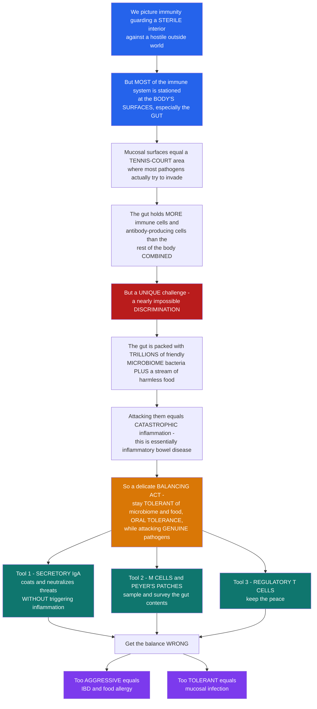

# 🛡️ Mucosal and Regional Immunity

> [!abstract] TL;DR
> We instinctively picture the immune system defending a **sterile interior** against a hostile outside world — but the surprising truth is that the **vast majority of your immune system isn't guarding your blood; it's stationed at your body's SURFACES**, above all the **gut**. The **mucosal surfaces** — the linings of the gastrointestinal, respiratory, and genitourinary tracts — add up to an area the size of a **tennis court**, and they are where the overwhelming majority of pathogens actually try to invade (you inhale, swallow, and absorb the outside world every moment). So the immune system concentrates most of its forces there: the **gut alone holds more lymphocytes and antibody-producing cells than the rest of the body combined**, and secretes **more antibody by mass** than any other compartment. But mucosal immunity faces a **uniquely profound challenge** that internal immunity does not — it must make a nearly **impossible discrimination**. Your gut is packed with **trillions** of harmless, even beneficial bacteria (your **microbiome**) plus a constant stream of harmless **food proteins**. Attack all of these and you get **catastrophic, chronic inflammation** — essentially what **inflammatory bowel disease** is. So mucosal immunity performs a delicate balancing act: stay **tolerant** of the friendly microbiome and food (**oral tolerance**) while staying ready to strike genuine pathogens — **"peaceful coexistence with vigilance."** It wields special tools for this: **secretory IgA**, a dedicated antibody poured across the mucosa in enormous quantities that coats and neutralizes threats **without triggering inflammation** (a non-inflammatory guardian); specialized **sampling structures** (**M cells** and **Peyer's patches**) that survey the luminal contents; and a heavy reliance on **regulatory T cells** to keep the peace. Get the balance wrong and disease follows: too aggressive → **inflammatory bowel disease** and **food allergy**; too tolerant → **mucosal infection**. Understanding mucosal and regional immunity is understanding where the real front line of defense actually lies. *Educational science content, not medical advice.*

---

## Intuition

**Analogy first — the immune system is a border force, not a palace guard.** We imagine immunity as a garrison guarding a pristine, sealed interior — sterile blood, sterile organs — repelling anything that gets inside. But that picture has the geography backwards. The body is not a sealed fortress; it is a country with an **immense, porous, teeming frontier**. Every breath, every meal, every sip drags the outside world across a thin wet membrane. So a wise government does not keep its army in the capital — it stations the overwhelming bulk of its forces at the **border**. That is exactly what your immune system does. If you unfolded all the mucosal surfaces of the gut, lungs, and other tracts, they would cover roughly a **tennis court**, and the **gut alone contains more immune cells and antibody factories than everything else in the body put together**. The front line is not deep inside. It is at the surfaces.

But this border force faces a problem the palace guard never has to solve. Inside the sterile interior, the rule is simple: *anything foreign is an enemy*. At the border, that rule would be a catastrophe. The gut lumen is home to **trillions of resident microbes** — your **microbiome** — most of them harmless and many actively helpful (they digest fiber, make vitamins, and crowd out invaders). Streaming past them is a river of **harmless food protein**. If the border guards opened fire on all of this, the result would be **relentless, self-inflicted inflammation** — which is, in essence, what **inflammatory bowel disease** is. So the mucosal immune system must perform a discrimination that borders on the impossible: **welcome the trillions of friendly residents and the constant food, while still identifying and destroying the rare genuine invader.** Its default posture is therefore not aggression but **tolerance-with-vigilance** — a peace treaty it actively maintains, not a truce it stumbles into.

To pull off this feat it deploys tools you won't find guarding the interior. Its signature weapon is **secretory IgA**, an antibody it pumps across the mucosal lining in staggering quantity — grams per day — that **coats and neutralizes** microbes and toxins and even shapes the microbiome, all **without lighting the fuse of inflammation** (a guardian that disarms threats quietly). It builds dedicated **listening posts** — **M cells** that ferry samples of the gut contents to underlying **Peyer's patches**, and dendritic cells that reach into the lumen to taste it. And it leans heavily on **regulatory T cells**, peacekeepers that actively suppress reactions against food and commensals. Get this balancing act wrong in one direction and you drive **inflammatory bowel disease** and **food allergy**; wrong in the other and pathogens breach the wall. Understanding mucosal and regional immunity is understanding the extraordinary problem of defending the body's vast, crowded borders — and recognizing where the real front line has been all along.

---

## How It Works

### Core Mechanics

1. **Where the immune system actually lives.** The **mucosa-associated lymphoid tissue (MALT)** is the largest part of the immune system by cell number and by antibody output. It is regionally organized: **GALT** (gut-associated, the dominant piece — Peyer's patches, isolated lymphoid follicles, the lamina propria, mesenteric lymph nodes), **BALT** (bronchus/lung), and **NALT** (nasopharynx, including the tonsils and adenoids). Most of the body's **plasma cells** sit in the gut lamina propria, and the gut secretes more immunoglobulin than every other site combined.
2. **The central tension: DEFENSE versus TOLERANCE.** A mucosal surface is bombarded with antigen — food, inhaled particles, and above all the **commensal microbiome**. The system must **discriminate** the harmless majority from the dangerous rare exception. Its resting decision is biased toward **tolerance**; a robust inflammatory response is triggered only when trustworthy **danger signals** (invasion of the epithelium, microbial **PAMPs** in the wrong place, tissue damage) cross a threshold.
3. **The barrier and innate mucosal defenses.** Before any lymphocyte acts, a layered wall does most of the work: a **mucus** blanket (often two layers in the colon, the inner one kept nearly sterile), an **epithelium** sealed by **tight junctions**, secreted **antimicrobial peptides** (defensins) from Paneth cells, and the **microbiome itself** providing **colonization resistance** by occupying niches invaders would use. **Innate lymphoid cells** (notably **ILC3**) and **intraepithelial lymphocytes** patrol the epithelial layer.
4. **Secretory IgA — the signature mechanism.** Mucosal plasma cells make **dimeric IgA** joined by a **J chain**. The epithelium's **polymeric immunoglobulin receptor (pIgR)** grabs it at the basal surface, **transcytoses** it across the cell, and releases it into the lumen still wearing a piece of pIgR called **secretory component**, which shields it from gut proteases. In the lumen, **secretory IgA (sIgA)** performs **immune exclusion** — binding and neutralizing microbes, viruses, and toxins, trapping them in mucus, and shaping the microbiome — **without activating complement or inflammation**. The same sIgA is passed to infants in **breast milk** (passive mucosal immunity).
5. **Antigen sampling and induction.** To decide what to respond to, the gut samples its contents. **M (microfold) cells** overlying Peyer's patches transport luminal antigen and whole microbes across the epithelium to waiting dendritic cells; other dendritic cells extend processes directly into the lumen. Antigen is carried to the **mesenteric lymph nodes**, where responses are induced and B cells are pushed to **class-switch to IgA**.
6. **Mucosal tolerance.** **Oral tolerance** is the systemic **hyporesponsiveness** the body develops to swallowed antigens — the reason a lifetime of dietary protein does not provoke immune attack. It is enforced chiefly by **regulatory T cells** induced by specialized **tolerogenic dendritic cells** using **retinoic acid** (from dietary vitamin A), **TGF-β**, and **IL-10**. The microbiome reinforces this: commensal fermentation produces **short-chain fatty acids** (SCFAs like butyrate) that expand colonic **Tregs**.
7. **Host–microbiome mutualism.** Immunity and the microbiome **co-regulate** one another: the microbiome **educates** the developing immune system and calibrates its set-points, while the immune system **contains and shapes** the microbiome (partly via sIgA). A disturbed community — **dysbiosis** — is linked to inflammatory and metabolic disease.
8. **Regional compartmentalization and homing.** Mucosal immunity is semi-separate from systemic immunity yet internally connected: a "**common mucosal immune system**" in which lymphocytes primed at one mucosal site are imprinted with **homing receptors** (e.g., the integrin **α4β7** and chemokine receptor **CCR9**, induced by retinoic acid) that guide them back to mucosa. This is why an **oral or intranasal vaccine** can raise sIgA at distant mucosal surfaces that an injected vaccine cannot.

### Flow / Architecture



---

## Key Concepts

### Secondary — the big picture

- **Most of your immune system is at your surfaces, not your insides.** The linings of your gut, lungs, and other tracts are the real front line, because that is where the outside world touches you. The **gut alone** has more immune cells than the rest of the body combined.
- **The big challenge is telling friend from foe.** Your gut holds **trillions of helpful bacteria** (your **microbiome**) and a constant flow of **harmless food**. The immune system must **leave these alone** while still attacking real germs. Attacking your own microbiome and food would cause constant, painful inflammation.
- **The rule at the border is "peaceful coexistence with vigilance."** By default the mucosa **tolerates**; it only fights when it sees strong signs of a genuine threat.
- **A special non-inflammatory antibody does the guarding: secretory IgA.** The body pours huge amounts of **IgA** across the gut lining. It **coats and blocks** germs and toxins **without causing inflammation**. Mothers also pass it to babies in **breast milk**.
- **Getting the balance wrong causes disease.** Too aggressive → **inflammatory bowel disease** and **food allergies**. Too tolerant → **mucosal infections**.

### Undergraduate — mechanisms and distinctions

- **MALT and its regions.** **Mucosa-Associated Lymphoid Tissue** is organized regionally: **GALT** (gut — Peyer's patches, isolated lymphoid follicles, lamina propria, mesenteric nodes), **BALT** (bronchial), **NALT** (nasopharyngeal — tonsils/adenoids). GALT dominates; the gut lamina propria houses the majority of the body's plasma cells.
- **Inductive vs effector sites.** **Inductive sites** (Peyer's patches, mesenteric lymph nodes) are where naive lymphocytes first meet sampled antigen and are activated; **effector sites** (the diffuse lamina propria and epithelium) are where the resulting IgA plasma cells and T cells do their work. **M cells** bridge lumen and inductive tissue by transcytosing antigen.
- **Secretory IgA in detail.** Dimeric IgA + **J chain** is transported across epithelium by **pIgR**; cleavage leaves **secretory component** attached, protecting sIgA from proteolysis and anchoring it in mucus. Its dominant mode is **immune exclusion** — high-avidity, low-inflammation binding that neutralizes and agglutinates without fixing complement well. IgA is the **most-produced antibody isotype by mass** in the body (grams per day), almost all of it mucosal.
- **Oral tolerance and the cells that enforce it.** Ingested antigen normally induces **systemic hyporesponsiveness**. The key effectors are **induced regulatory T cells (Tregs)**, generated by **tolerogenic CD103⁺ dendritic cells** presenting antigen with **retinoic acid + TGF-β**, secreting **IL-10**. Low-dose antigen favors Treg induction; the outcome is active suppression, not mere ignorance.
- **The barrier is layered and largely innate.** Mucus (with the near-sterile inner colonic layer), tight-junction-sealed epithelium, Paneth-cell **defensins**, **ILC3**-derived **IL-22** (which drives epithelial repair and antimicrobial peptide output), and **colonization resistance** from a healthy microbiome all precede adaptive responses.
- **Compartmentalization and homing.** Mucosal and systemic immunity are semi-separate. Priming at a mucosal inductive site imprints lymphocytes with gut-homing **α4β7 integrin** and **CCR9** (retinoic-acid dependent), routing them back to mucosa — the basis of the **common mucosal immune system** and of mucosal vaccination.

### Graduate — depth and consequences

- **The discrimination problem, formally.** The mucosal immune system confronts an extreme **base-rate problem**: the prior probability that any given luminal antigen is a pathogen is minuscule against a vast background of commensals and food. Under any reasonable cost model, the Bayes-optimal decision threshold is pushed far toward **tolerance** — attacking everything above a low danger threshold would incur enormous aggregate cost from false alarms (self-inflicted inflammation). The system reads **contextual danger signals** (epithelial invasion, cytosolic PAMP sensing, tissue damage, dysbiotic shifts) rather than mere foreignness — an implementation of the "danger/context" model at the body's most antigen-saturated site.
- **sIgA shapes the microbiome, and vice versa.** sIgA is not only anti-pathogen; a large fraction of commensals are steadily **IgA-coated**, and this coating regulates community composition, spatial organization, and mucus penetration. Much mucosal IgA is **polyreactive, T-independent, and of moderate affinity**, well-suited to broad "housekeeping" containment; **T-dependent, affinity-matured IgA** from germinal centers targets specific threats. The microbiome in turn drives IgA-plasma-cell development and diversifies the repertoire.
- **Tolerance is actively built by the microbiota.** Specific taxa induce specific programs: segmented filamentous bacteria promote **Th17**, *Clostridia* clusters and their **SCFAs** (butyrate as an HDAC inhibitor) expand colonic **FoxP3⁺ Tregs**, and *Bacteroides fragilis* polysaccharide A promotes IL-10⁺ Tregs. **Retinoic acid** (vitamin A) and **AhR ligands** (from tryptophan/diet) are dietary inputs feeding directly into tolerance and barrier programs — a molecular link between nutrition and mucosal immune set-points.
- **Regional specialization.** Immunity is not uniform along the tract: the small intestine, colon, and stomach differ in dominant lymphocytes, antimicrobial strategy, mucus architecture, and Treg/Th17 balance, tuned to local microbial density and function (Mowat & Agace's "regional specialization"). "Mucosal immunity" is a family of locally optimized systems, not one homogeneous tissue.
- **Breakdowns as failures of the balance.** **Inflammatory bowel disease** (Crohn's, ulcerative colitis) reflects a breakdown of tolerance to the microbiome, driven by barrier defects, dysregulated innate sensing (e.g., NOD2), and aberrant effector T-cell responses. **Food allergy** and **celiac disease** represent loss of **oral tolerance** (celiac being an IgA-associated, HLA-restricted reaction to gluten). Each is the discrimination failing in the "too aggressive" direction; overwhelmed defense (e.g., *Vibrio cholerae*, enteric viruses) is failure in the "too tolerant/too slow" direction.
- **Mucosal vaccines — a hard frontier.** Because protection at a surface often requires **local sIgA** and tissue-resident memory that injected vaccines induce poorly, **oral and intranasal vaccines** (oral polio, rotavirus, cholera; intranasal influenza) aim to engage the mucosal inductive pathway directly. The central obstacles are the mucosa's default **tolerance** (delivering antigen without triggering tolerance instead of immunity), degradation, and dilution — which is why mucosal adjuvants and delivery systems are active research.

---

## Python Demo

```python
# Mucosal immunity, quantified four ways:
#   (1) DISCRIMINATION: harmless commensals/food carry a LOW "danger signal",
#       real pathogens a HIGH one, but the two distributions OVERLAP and
#       commensals vastly OUTNUMBER pathogens. Any decision threshold trades
#       attacking-a-commensal (autoimmune / IBD) against tolerating-a-pathogen
#       (infection).
#   (2) COST OF THE THRESHOLD: because commensals dominate by base rate, the
#       cost-minimizing threshold sits HIGH -- the mucosal default is
#       tolerance-with-vigilance, not aggression.
#   (3) IMMUNE DISTRIBUTION: most of the body's lymphocytes (and most antibody
#       by mass) are at the GUT / mucosa, not in blood -- the real front line.
#   (4) SECRETORY-IgA IMMUNE EXCLUSION: coating luminal microbes with sIgA
#       suppresses invasion WITHOUT raising inflammation (a non-inflammatory
#       guardian).
import numpy as np
import matplotlib.pyplot as plt
from math import erf

# --- Gaussian helpers (no scipy needed) ---
def norm_pdf(x, mu, sd):
    return np.exp(-0.5 * ((x - mu) / sd) ** 2) / (sd * np.sqrt(2 * np.pi))

_erf = np.vectorize(erf)
def norm_cdf(x, mu, sd):
    return 0.5 * (1.0 + _erf((x - mu) / (sd * np.sqrt(2))))

# Danger-signal model: commensals/food LOW, pathogens HIGH, overlapping
mu_c, sd_c = 1.0, 0.8     # commensals + food
mu_p, sd_p = 4.5, 1.0     # genuine pathogens
prior_c, prior_p = 0.99, 0.01   # base rates: benign antigens dominate
c_auto = 1.0              # cost per unit of attacking commensals -> inflammation/IBD
c_inf  = 40.0            # cost per unit of tolerating a pathogen -> infection

# --- (2) sweep the decision threshold, find the cost-minimizing cut ---
t = np.linspace(-1, 8, 800)
FP = 1.0 - norm_cdf(t, mu_c, sd_c)      # attack a commensal  (false alarm)
FN = norm_cdf(t, mu_p, sd_p)            # tolerate a pathogen (miss)
cost_auto = prior_c * FP * c_auto        # aggregate autoimmune/IBD cost
cost_inf  = prior_p * FN * c_inf         # aggregate infection cost
total = cost_auto + cost_inf
t_star = t[np.argmin(total)]

fig, ax = plt.subplots(2, 2, figsize=(13, 9))

# ---- (1) The discrimination problem: overlapping, base-rate-skewed populations ----
x = np.linspace(-2, 9, 700)
ax[0, 0].fill_between(x, prior_c * norm_pdf(x, mu_c, sd_c), color="#0f766e",
                      alpha=0.55, label="commensals + food (99%, TOLERATE)")
ax[0, 0].fill_between(x, prior_p * norm_pdf(x, mu_p, sd_p), color="#b91c1c",
                      alpha=0.7, label="pathogens (1%, ATTACK)")
ax[0, 0].axvline(t_star, color="#d97706", lw=2.5, ls="--",
                 label=f"optimal threshold = {t_star:.2f}")
ax[0, 0].set_xlabel("danger signal (invasion, PAMPs, tissue damage)")
ax[0, 0].set_ylabel("base-rate-weighted density")
ax[0, 0].set_title("(1) DISCRIMINATION: benign antigens swamp the rare pathogen\n"
                   "the two overlap -> perfect separation is impossible")
ax[0, 0].legend(fontsize=8)
ax[0, 0].grid(alpha=0.3)

# ---- (2) Cost of the threshold: tolerance-with-vigilance is optimal ----
ax[0, 1].plot(t, cost_auto, color="#7c3aed", lw=2.2,
              label="cost of ATTACKING commensals (IBD/autoimmune)")
ax[0, 1].plot(t, cost_inf, color="#b91c1c", lw=2.2,
              label="cost of TOLERATING pathogens (infection)")
ax[0, 1].plot(t, total, color="#111827", lw=2.8, label="total expected cost")
ax[0, 1].axvline(t_star, color="#d97706", lw=2.5, ls="--",
                 label=f"optimum -> tolerance-biased (t={t_star:.2f})")
ax[0, 1].set_xlabel("decision threshold (attack only if danger > threshold)")
ax[0, 1].set_ylabel("expected cost")
ax[0, 1].set_title("(2) COST: base rate pushes the optimum HIGH\n"
                   "the default at the mucosa is TOLERANCE-with-vigilance")
ax[0, 1].legend(fontsize=8)
ax[0, 1].grid(alpha=0.3)

# ---- (3) Immune distribution: the front line is the gut ----
sites  = ["Gut / GALT", "Other mucosa\n(resp, GU)", "Spleen", "Lymph nodes", "Blood"]
share  = np.array([0.60, 0.15, 0.12, 0.10, 0.03])   # illustrative lymphocyte share
colors = ["#0f766e", "#14b8a6", "#64748b", "#94a3b8", "#cbd5e1"]
bars = ax[1, 0].bar(sites, share * 100, color=colors, edgecolor="black")
for b, s in zip(bars, share):
    ax[1, 0].text(b.get_x() + b.get_width() / 2, s * 100 + 1,
                  f"{s*100:.0f}%", ha="center", fontsize=9)
ax[1, 0].set_ylabel("share of body's lymphocytes (illustrative)")
ax[1, 0].set_title("(3) IMMUNE DISTRIBUTION: the gut + mucosa dominate\n"
                   "more immune cells than the rest of the body combined")
ax[1, 0].set_ylim(0, 72)
ax[1, 0].tick_params(axis="x", labelsize=8)
ax[1, 0].grid(alpha=0.3, axis="y")

# ---- (4) Secretory-IgA immune exclusion: block invasion, not inflame ----
coat = np.linspace(0, 1, 200)              # fraction of luminal microbes sIgA-coated
invasion = 0.9 * np.exp(-3.0 * coat)       # immune exclusion suppresses invasion
inflammation = np.full_like(coat, 0.05)    # sIgA is NON-inflammatory: stays flat/low
ax[1, 1].plot(coat, invasion, color="#b91c1c", lw=2.6,
              label="invasion probability (falls with coating)")
ax[1, 1].plot(coat, inflammation, color="#0f766e", lw=2.6, ls="--",
              label="inflammation (stays LOW: non-inflammatory)")
ax[1, 1].fill_between(coat, inflammation, invasion, color="#fca5a5", alpha=0.3)
ax[1, 1].annotate("IMMUNE EXCLUSION:\nneutralize WITHOUT inflammation",
                  xy=(0.72, 0.11), fontsize=8.5, color="#0f766e",
                  ha="center")
ax[1, 1].set_xlabel("fraction of microbes coated by secretory IgA")
ax[1, 1].set_ylabel("probability")
ax[1, 1].set_title("(4) SECRETORY IgA: immune exclusion\n"
                   "coating blocks invasion + shapes microbiome, quietly")
ax[1, 1].legend(fontsize=8)
ax[1, 1].grid(alpha=0.3)

plt.tight_layout()
plt.savefig("mucosal_and_regional_immunity.png", dpi=130)

# --- quantify the lessons ---
FP_star = 1.0 - norm_cdf(t_star, mu_c, sd_c)
FN_star = norm_cdf(t_star, mu_p, sd_p)
print(f"(1-2) Optimal danger threshold = {t_star:.2f}, which sits well ABOVE the "
      f"commensal mean ({mu_c}) -> nearly all commensals/food are TOLERATED.")
print(f"      At the optimum: {FP_star*100:.1f}% of commensals wrongly attacked, "
      f"{FN_star*100:.1f}% of pathogens tolerated.")
print(f"(3)   Gut + mucosa hold ~{(share[0]+share[1])*100:.0f}% of lymphocytes; "
      f"blood only ~{share[-1]*100:.0f}%.")
print(f"(4)   At 80% sIgA coating, invasion drops to "
      f"{0.9*np.exp(-3.0*0.8)*100:.0f}% of baseline while inflammation stays ~5%.")
```

**What the plots show.** Panel (1) makes the **discrimination problem** visceral: the harmless population (commensals + food) and the pathogen population **overlap**, and the benign one is ~100× larger — so no threshold can cleanly separate them. Panel (2) is the payoff: because benign antigens dominate by **base rate**, the cost-minimizing threshold is pushed **high**, well above the commensal distribution — mathematically confirming that the mucosal default should be **tolerance-with-vigilance**, reacting only to strong danger signals. Panel (3) upends the "sterile interior" intuition: the **gut and mucosa hold the lion's share of lymphocytes**, blood almost none — the front line is at the surface. Panel (4) captures **secretory IgA's** trick: as coating rises, the probability of microbial **invasion collapses** while **inflammation stays flat and low** — a guardian that neutralizes threats and shapes the microbiome **quietly**.

---

## Real-World Applications

> **Breast milk and infant health (passive mucosal immunity).** A mother's mammary gland is part of the **common mucosal immune system**: plasma cells primed in her gut home to the breast and secrete **secretory IgA** into milk. That sIgA coats the newborn's gut, providing **immune exclusion** against enteric pathogens for months before the infant can make its own — one of the clearest reasons breastfeeding lowers the incidence and severity of infant diarrheal and respiratory infection.

> **Mucosal vaccines (oral polio, rotavirus, cholera, intranasal flu).** Some pathogens are best stopped at the surface they infect, which requires **local sIgA** and tissue-resident memory that injected vaccines induce poorly. **Oral** rotavirus and cholera vaccines and the **intranasal** live influenza vaccine deliberately engage the mucosal inductive pathway. The core difficulty is the mucosa's default **tolerance** — delivering antigen so it induces immunity rather than oral tolerance — which is why mucosal adjuvants remain an active frontier (see [[Vaccines_and_Antibiotics]]).

> **Inflammatory bowel disease as a tolerance failure.** **Crohn's disease** and **ulcerative colitis** are, at their core, a **breakdown of tolerance to the microbiome** — barrier defects and dysregulated immune sensing turn the normal peace treaty into chronic inflammation. Modern biologics (anti-TNF, anti-integrin **α4β7** blockade with vedolizumab that specifically prevents lymphocyte **homing to gut**, anti-IL-23) are direct clinical applications of mucosal-immunity mechanisms (see [[Liver_and_Gastrointestinal_Disease]] and [[Immune_Dysfunction_and_Autoimmunity]]).

> **Food allergy, celiac disease, and oral immunotherapy.** Loss of **oral tolerance** underlies IgE-mediated **food allergy** and (via a distinct gluten-specific mechanism) **celiac disease**. **Oral immunotherapy** — feeding tiny, escalating doses of allergen — is an attempt to *re-engineer* oral tolerance, exploiting the same Treg-inducing, low-dose pathway the gut uses naturally.

> **The microbiome as a therapeutic target.** Because the microbiome and mucosal immunity co-regulate each other, interventions that reshape the community — **fecal microbiota transplant** (highly effective for recurrent *C. difficile*, which is a failure of **colonization resistance**), defined probiotic consortia, and dietary fiber that fuels **SCFA-driven Tregs** — are increasingly used or studied to restore immune balance (see [[The_Gut_Microbiome_and_Nutrition]]).

---

## Common Pitfalls

- **Thinking of immunity as "inside the body."** The largest, busiest part of the immune system is at the **mucosal surfaces**, above all the gut. Reasoning only from blood counts (dominated by IgG and circulating cells) systematically underweights the compartment that does most of the work and produces the most antibody.
- **Treating "foreign = attack" as the universal rule.** It holds in the sterile interior but is catastrophic at the mucosa, where trillions of foreign commensals and constant food must be **tolerated**. Mucosal immunity keys on **context and danger**, not foreignness alone.
- **Confusing tolerance with weakness or ignorance.** **Oral tolerance** is an **active, enforced** state (Treg-mediated suppression), not a failure to notice antigen or an exhausted response. It can be induced, broken, and re-established.
- **Assuming secretory IgA works like blood antibodies.** sIgA's dominant mode is **non-inflammatory immune exclusion** — it agglutinates and neutralizes in the lumen and is a **poor complement fixer** by design. Expecting it to trigger the inflammatory effector functions of IgG misreads its purpose.
- **Equating "IgA-coated" with "pathogenic."** A large, healthy fraction of the **commensal** microbiome is steadily sIgA-coated as normal housekeeping. Coating is a regulatory and containment signal, not a pathogen flag.
- **Forgetting the barrier does most of the work.** Mucus layers, tight junctions, defensins, and **colonization resistance** from a healthy microbiome exclude the vast majority of would-be invaders before any lymphocyte is engaged; adaptive mucosal immunity is the exception-handler, not the first responder.
- **Expecting an injected vaccine to protect a mucosal surface.** Systemic IgG often does not translate into luminal **sIgA** or resident mucosal memory, which is why some infections require **mucosal** vaccination — and why "the shot worked but they still got a gut/nasal infection" is not paradoxical.
- **Ignoring diet and the microbiome as immune inputs.** Vitamin A (**retinoic acid**), fiber-derived **SCFAs**, and specific commensal taxa are not background noise — they set mucosal tolerance and barrier programs. Dysbiosis is both a cause and a consequence of mucosal immune dysfunction.

---

## Related Concepts

- [[Natural_Killer_Cells_and_Innate_Lymphoid_Cells]] — the S02 note covering **ILC3**, the innate lymphoid cell whose **IL-22** output drives epithelial repair and antimicrobial peptides, a core innate pillar of the mucosal barrier described here.
- [[Innate_Immune_Recognition_and_Pattern_Receptors]] — how the epithelium and its sentinels sense **PAMPs** and danger; mucosal discrimination depends on reading these context signals rather than mere foreignness.
- [[Cells_of_the_Immune_System]] — the **plasma cells** (mostly gut-resident) that secrete IgA, the dendritic cells that sample the lumen, and the regulatory T cells that enforce tolerance are all introduced there.
- [[The_Gut_Microbiome_and_Nutrition]] — the Health-vault companion on the microbiome and diet: the **SCFAs**, fiber, and commensal communities that this note treats as immune inputs shaping tolerance and colonization resistance.
- [[Bacteria_and_Archaea]] — the Biology/11 view of the bacteria that constitute the trillions-strong **microbiome** the mucosal immune system must tolerate and contain.
- [[Liver_and_Gastrointestinal_Disease]] — the Clinical_Medicine note on **inflammatory bowel disease** and GI pathology, the clinical face of mucosal tolerance breaking down.
- [[Immune_Dysfunction_and_Autoimmunity]] — the broader loss-of-tolerance framework of which IBD and food allergy are mucosal instances.
- [[The_Digestive_and_Excretory_Systems]] — the Biology/09 anatomy of the gut tract whose vast surface and thin barrier are the physical stage for all of mucosal immunity.
- [[Vaccines_and_Antibiotics]] — the Biology/11 note on vaccination; **mucosal (oral/intranasal) vaccines** aim to raise the sIgA and local protection described here.

*Siblings in this section, referenced in prose until written: **Lymphoid Organs and Immune Anatomy** (the lymphoid-tissue map into which MALT/GALT/BALT/NALT fit), **Antibody Structure and Function** (the isotype machinery behind dimeric IgA, the J chain, and secretory component), **Helper T Cells and T-Cell Subsets** (the Tregs and Th17 cells that set the mucosal tolerance/defense balance), **Immunological Memory and Vaccination Principles** (the memory and homing that mucosal vaccines exploit), and **Hypersensitivity and Allergy** (food allergy as a failure of oral tolerance).*

---

## Review Questions

**Secondary.** Most people imagine the immune system as a guard protecting a clean, sterile inside. Explain why that picture is misleading for the gut, where **most** of your immune cells actually are — and describe the special problem the gut immune system faces that a guard on the inside never has to solve. Name the non-inflammatory antibody it uses to handle that problem.

**Undergraduate.** Define **oral tolerance** and **immune exclusion**, and explain how each contributes to "peaceful coexistence with vigilance." In your answer, identify the cell type most responsible for enforcing oral tolerance and two molecular signals (one dietary) that induce it, and explain why **secretory IgA** is described as a *non-inflammatory* guardian even though it neutralizes pathogens.

**Graduate.** The mucosal immune system must separate a tiny population of pathogens from an enormous background of commensals and food. Using a base-rate / cost argument, explain why the cost-minimizing decision threshold is pushed toward **tolerance**, and why this makes the mucosa read **context and danger signals** rather than foreignness. Then explain how this same tolerance-biased default becomes the central obstacle for **oral vaccines**, and how a breakdown of the balance in each direction produces **inflammatory bowel disease** versus **mucosal infection**.

---

## Sources

- Murphy, K. & Weaver, C. — *Janeway's Immunobiology*, 9th/10th ed. (Garland Science / W. W. Norton). Chapter on **mucosal immunity** (the mucosal immune system, MALT, secretory IgA transport, and oral tolerance).
- Mowat, A. M. & Agace, W. W. — "Regional specialization within the intestinal immune system." *Nature Reviews Immunology* 14:667–685 (2014). https://doi.org/10.1038/nri3738
- Belkaid, Y. & Hand, T. W. — "Role of the microbiota in immunity and inflammation." *Cell* 157(1):121–141 (2014). https://doi.org/10.1016/j.cell.2014.03.011
- Brandtzaeg, P. — "Secretory IgA: designed for anti-microbial defense." *Frontiers in Immunology* 4:222 (2013). https://doi.org/10.3389/fimmu.2013.00222
- Pabst, O. & Mowat, A. M. — "Oral tolerance to food protein." *Mucosal Immunology* 5:232–239 (2012). https://doi.org/10.1038/mi.2012.4

---

#immunology #mucosal-immunity #secretory-iga #oral-tolerance #microbiome
