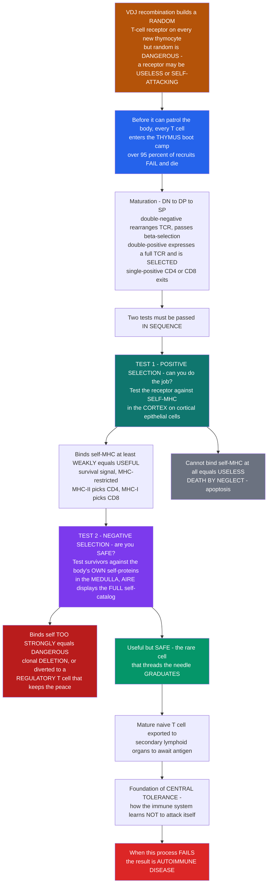

# 🎓 T-Cell Development and Thymic Selection

> [!abstract] TL;DR
> **V(D)J recombination** builds every new T cell a **randomly generated receptor**, and *random* is dangerous: some receptors will be **useless** (unable to read anything the body displays) and some **catastrophic** (primed to attack the body's own cells). Before any T cell is allowed out to patrol, it must survive the most brutal boot camp in biology — the **thymus** — where **over 95 percent of recruits are killed**. Graduation requires passing **two tests in sequence**. **Positive selection** asks *"can you even do the job?"*: a thymocyte whose receptor binds **self-MHC** at least weakly gets a survival signal and is kept (it is **MHC-restricted** and functional, and this step also decides **CD4 vs CD8**); a receptor that cannot see self-MHC at all is useless and dies by **neglect**. **Negative selection** asks *"are you safe?"*: survivors are tested against a comprehensive gallery of the body's **own self-proteins** — remarkably, the gene **AIRE** forces the thymus to display tissue-specific proteins from all over the body (insulin, thyroid antigens, everything), so recruits see the full catalog of "self." A cell that binds self **too strongly** is a potential autoimmune attacker and is either **deleted** (clonal deletion) or converted into a peace-keeping **regulatory T cell**. Only the rare cell that threads the needle — **useful** (sees self-MHC) yet **safe** (does not attack self) — graduates and exits to the lymph nodes. This double screening is the foundation of **central tolerance**: how the immune system learns not to attack itself — and why, when it fails, **autoimmune disease** results. *Educational science content, not medical advice.*

---

## Intuition

**Analogy first — the elite academy with a savage graduation rate.** Your body generates T cells the way a factory prints lottery tickets: **at random**, in astronomical variety, so that somewhere in the repertoire is a receptor for almost any enemy. But randomness cuts both ways. A randomly built receptor might be **useless** — a barcode scanner that cannot read *any* of the barcodes the body actually displays — or it might be **catastrophic**, tuned to grip the body's *own* healthy tissue and tear it apart. You cannot let random recruits loose on the streets. So every young T cell is marched into the **thymus**, an organ that runs the most unforgiving boot camp in the body: **more than nineteen out of twenty recruits wash out and die**, and only a tiny, screened remnant graduates.

The training is **two tests, taken in order**. The first is **positive selection**, and it asks a blunt question: *can you do the job at all?* Each recruit's receptor is pressed against the body's own **MHC molecules** — the display platforms that every cell uses to show fragments of what is inside it. If the receptor can grip self-MHC **at least weakly**, the recruit is **useful** (it can read the displays) and receives a survival signal. If it cannot recognize self-MHC at all, it is a scanner that reads nothing — and it is simply **left to die by neglect**, quietly, from lack of a rescue signal.

The second test is more important, and it is where the real danger is caught: **negative selection**, which asks *are you safe?* The survivors are now paraded past a comprehensive gallery of the body's **own self-proteins**. Here the thymus performs its most remarkable trick: a special gene called **AIRE** forces thymic cells to manufacture and display proteins from **all over the body** — insulin from the pancreas, thyroid antigens, retinal proteins — organs the thymus has nothing to do with. It is as if the academy hangs a portrait of *every* citizen on the walls so recruits can memorize exactly who **not** to attack. Any recruit whose receptor grips one of these self-portraits **too strongly** is a potential traitor, and it is dealt with harshly: **killed** (clonal deletion) or **re-trained** into a **regulatory T cell** whose lifelong job is to *suppress* immune attacks and keep the peace.

Only the rare cell that threads the needle — **useful enough** to read self-MHC but **safe enough** not to attack self-proteins — pins on its badge and enters the body. This double screening is the physical basis of **central tolerance**: the reason a healthy immune system, armed with billions of random receptors, does not turn on the very body it defends. Understand thymic selection and you understand how the body forges an army that is at once **functional and self-tolerant** — and why, when the boot camp lets a traitor slip through, the result is **autoimmune disease**.

---

## How It Works

### Core Mechanics

1. **The raw material is random and therefore dangerous.** In the thymus, developing T cells assemble a T-cell receptor (TCR) by **V(D)J recombination** — cutting and pasting gene segments to build, essentially at random, one unique receptor per cell. The resulting repertoire covers almost anything, but it is unscreened: many receptors are **non-functional** (cannot engage self-MHC) and a dangerous minority are **self-reactive** (grip the body's own molecules). Selection exists to fix both problems.
2. **Progenitors migrate to the thymus and mature through defined stages.** Bone-marrow-derived progenitors seed the thymus and progress: **double-negative (DN, CD4−CD8−)** thymocytes rearrange the TCR-β chain and pass the **β-selection checkpoint** (a test that a functional β chain was made) → **double-positive (DP, CD4+CD8+)** thymocytes now express a complete **αβ TCR** and are the cells that undergo selection → **single-positive (SP, CD4+ *or* CD8+)** mature naive T cells that exit. The thymus is regionalized: selection begins in the **cortex** and finishes in the **medulla**.
3. **Positive selection — "can you do the job?"** In the **cortex**, on **cortical thymic epithelial cells (cTECs)**, each DP thymocyte's TCR is tested against **self-peptide–self-MHC**. A TCR that binds with **low but adequate affinity** receives a rescue signal and is **positively selected**: it is guaranteed to be **MHC-restricted** (it can read the body's display platforms). A TCR that **cannot engage self-MHC** gets no signal and dies by **neglect** (apoptosis) — the majority fate.
4. **Positive selection also sets lineage.** The same step commits the cell to **CD4 vs CD8**: a TCR that reads **MHC class II** becomes a **CD4** helper-lineage cell; one that reads **MHC class I** becomes a **CD8** cytotoxic-lineage cell. Recognition and identity are decided together.
5. **Negative selection — "are you safe?"** The positively selected survivors move to the **medulla**, where **medullary thymic epithelial cells (mTECs)** and **dendritic cells** present a vast array of **self-antigens**. A TCR that binds self **too strongly** marks a potentially autoreactive cell, which is removed by **clonal deletion** (apoptosis) or diverted to a **regulatory T cell** fate.
6. **AIRE shows recruits the whole body.** The transcriptional regulator **AIRE (autoimmune regulator)** drives **promiscuous (ectopic) expression** of thousands of **tissue-restricted self-antigens** in mTECs — insulin, thyroglobulin, retinal and other organ-specific proteins that the thymus would otherwise never make. This lets developing T cells "see" essentially the **whole self-proteome** and be purged if reactive. Loss of AIRE causes the human autoimmune syndrome **APECED / APS-1**.
7. **The affinity window is narrow.** Fate is a function of TCR affinity for self: **too low** → death by neglect; an **intermediate** band → positive selection and survival; **too high** → negative selection and deletion. Only the narrow middle window graduates — which is why **more than 95 percent** of thymocytes die in the thymus.
8. **The output is a screened repertoire.** The rare graduates — **mature naive CD4 and CD8 T cells** that are **MHC-restricted (useful)** *and* **self-tolerant (safe)** — leave the thymus and travel to **secondary lymphoid organs** to await their antigen. This is the foundation of **central tolerance**; because it is incomplete, it is backed up later by **peripheral tolerance**.

### Flow / Architecture



---

## Key Concepts

### Secondary — the big picture

- **T cells are built at random, so they must be screened.** Each new T cell gets a **randomly shaped receptor**. Random means some are **useless** and some are **dangerous** (they would attack your own body). They cannot be trusted until tested.
- **The thymus is a boot camp with a >95 percent failure rate.** Almost all recruits are killed; only a screened few graduate.
- **Test 1 — positive selection (can you do the job?).** A T cell must be able to recognize the body's **display platforms (MHC)** at least weakly. If it can, it survives; if it cannot, it **dies by neglect**.
- **Test 2 — negative selection (are you safe?).** The survivors are shown the body's **own proteins**. Any T cell that reacts **too strongly** to self is a potential traitor and is **killed** or turned into a **peace-keeping regulatory T cell**.
- **AIRE shows the whole body.** A special gene, **AIRE**, makes the thymus display proteins from all over the body (like insulin), so recruits learn the full list of what **not** to attack.
- **The result: an army that is useful AND safe.** This is called **central tolerance** — the reason your immune system does not attack you. When it fails, you get **autoimmune disease**.

### Undergraduate — mechanisms and distinctions

- **Developmental staging.** Thymocytes progress **DN (CD4−CD8−) → DP (CD4+CD8+) → SP (CD4+ or CD8+)**. The **β-selection checkpoint** (at the DN3 stage) confirms a productive TCR-β rearrangement (paired with the invariant pre-Tα) before α-chain rearrangement; DP cells bearing a complete **αβ TCR** are the substrate for selection; SP cells are exported.
- **Anatomy of selection.** **Positive selection** happens in the **cortex** on **cTECs** (which express a distinctive peptide-generating machinery, including the thymoproteasome subunit β5t); **negative selection** happens mainly in the **medulla** on **mTECs** and bone-marrow-derived **dendritic cells**.
- **Positive selection = usefulness + MHC restriction + lineage.** Rescue requires the TCR to engage **self-peptide–self-MHC** above a low threshold. This simultaneously guarantees **MHC restriction** and commits **CD4 (MHC-II) vs CD8 (MHC-I)** lineage. No engagement → **death by neglect**, the fate of the large majority.
- **Negative selection = safety (central tolerance).** TCRs binding self **above a high threshold** trigger **clonal deletion** (apoptosis, driven by pro-apoptotic BIM) or **agonist selection** into the regulatory-T-cell lineage.
- **AIRE and promiscuous gene expression.** mTECs, under **AIRE**, ectopically transcribe thousands of **tissue-restricted antigens (TRAs)** so that T cells specific for peripheral-organ proteins can be tolerized centrally. **AIRE deficiency** in humans causes **APECED/APS-1** (autoimmune polyendocrinopathy — e.g., hypoparathyroidism, adrenal failure, candidiasis).
- **The affinity window.** A single continuous variable — **TCR affinity for self-pMHC** — partitions fates: below the positive threshold (neglect), between the thresholds (survival), above the negative threshold (deletion). The window is narrow, which is *why* thymic attrition is so severe.
- **Regulatory T cells (natural/thymic Tregs).** A **FoxP3+ CD4+CD25+** subset is selected in the thymus, frequently from cells of **intermediate-to-high self-reactivity**, and enforces tolerance in the periphery by suppressing other lymphocytes.
- **Central tolerance is incomplete.** Not every self-antigen is displayed, and thresholds are imperfect, so some self-reactive cells **escape**. This necessitates a second line — **peripheral tolerance** (Treg suppression, **anergy**, **ignorance**, deletion) — outside the thymus.

### Graduate — depth and consequences

- **Signal strength, kinetics, and the affinity model.** Selection outcome tracks **TCR:self-pMHC dwell time / affinity** and the resulting quality and quantity of downstream signaling (ERK dynamics, calcium, TCR-proximal kinases). Low, sustained signals favor **survival/positive selection**; strong, acute signals favor **deletion**. This is often idealized as an **affinity window**, though the real determinant is integrated signal strength across serial pMHC encounters, and the *same* peptide can be positively selecting at low density and negatively selecting at high density.
- **Peptide specificity of positive selection.** cTECs generate a **private self-peptide repertoire** via the **thymoproteasome (β5t)**, cathepsin L, and the protease TSSP, biasing positive selection toward TCRs that will later cross-react with foreign peptides on the same MHC — a mechanistic link between "seeing self" during education and "seeing non-self" during infection.
- **AIRE mechanism.** AIRE is not a classical sequence-specific activator; it engages **stalled/paused RNA polymerase II**, reads chromatin marks (via its PHD fingers, e.g., unmethylated H3K4), and licenses **stochastic, mosaic transcription** of TRAs so that, across the mTEC population, the near-complete self-proteome is represented. Fezf2 drives an AIRE-independent TRA program in parallel. Antigen is also **spread** to dendritic cells for cross-presentation, and **thymic mimetic cells** (mTECs adopting peripheral-cell identities) further broaden the displayed self.
- **Treg agonist selection and the tolerance trade-off.** Thymic Treg development is favored by **higher-affinity self-recognition** than conventional selection, plus IL-2/TGF-β signals; the repertoire thus deliberately *retains* some self-reactive specificities but reassigns them to **suppression**. Tolerance is therefore not purely deletional — it is a blend of **recessive** (deletion/anergy) and **dominant** (Treg-mediated) mechanisms.
- **Central vs peripheral tolerance as layered defense.** Central tolerance (thymus for T cells; bone marrow for B cells — **receptor editing**, clonal deletion) removes the bulk of overtly self-reactive cells during development; **peripheral tolerance** catches escapees. Failure of the FoxP3/Treg axis causes **IPEX** (immune dysregulation, polyendocrinopathy, enteropathy, X-linked); failure of AIRE causes **APS-1** — two experiments of nature showing the necessity of *both* deletional and regulatory arms.
- **Thymic dynamics over a lifetime.** Thymic output peaks early and declines with **age-related involution**, reducing naive-T-cell export and contributing to immunosenescence; **DiGeorge syndrome (22q11.2 deletion)** with thymic aplasia produces severe **T-cell deficiency**. These constrain vaccine responses, infection risk, and immune reconstitution after transplant.
- **Applied frontiers.** Understanding selection thresholds informs **engineered T cells** (CAR-T / TCR-T): affinity that is too high risks **on-target/off-tumor** toxicity or fratricide, echoing negative selection's logic; and **thymic transplantation** is used therapeutically in athymic DiGeorge. The same rules explain why **alloreactive** T cells — never tolerized to foreign MHC — drive **transplant rejection** and graft-versus-host disease.

---

## Python Demo

```python
# T-CELL DEVELOPMENT AND THYMIC SELECTION, two panels:
#  (a) THE AFFINITY WINDOW / DOUBLE SELECTION -- a thymocyte's fate as a
#      function of its TCR affinity for self-peptide-MHC:
#         too LOW  -> death by neglect  (fails positive selection)
#         MIDDLE   -> positive selection & survival (the useful window)
#         too HIGH -> negative selection / clonal deletion (dangerous)
#      We overlay a random pre-selection affinity distribution and compute
#      what fraction survives -- illustrating the >95% death rate.
#  (b) AIRE & CENTRAL TOLERANCE -- self-reactive clones are deleted only if
#      they MEET their target self-antigen in the thymus. AIRE forces display
#      of tissue-restricted antigens (TRAs). WITH AIRE almost all self-reactive
#      clones are purged; WITHOUT AIRE the TRA-specific clones ESCAPE ->
#      autoimmunity. We compare the surviving self-reactive fraction.
import numpy as np
import matplotlib.pyplot as plt

rng = np.random.default_rng(7)

# ============================================================
# (a) THE AFFINITY WINDOW
# ============================================================
aff = np.linspace(0, 6, 1000)          # TCR affinity for self-pMHC (arb. log units)
theta_pos = 2.0                        # must EXCEED this for a positive-selection signal
theta_neg = 3.2                        # exceeding this triggers negative selection (deletion)

def sig(x, c, k):                      # smooth threshold
    return 1.0 / (1.0 + np.exp(-k * (x - c)))

p_positive = sig(aff, theta_pos, 6)            # P(gets rescue signal)
p_negative = sig(aff, theta_neg, 6)            # P(gets deleted)
p_survive  = p_positive * (1.0 - p_negative)   # rescued AND not deleted -> GRADUATES
p_neglect  = (1.0 - p_positive) * (1.0 - p_negative)

# A random pre-selection repertoire: TCR self-affinities are broadly distributed,
# with most receptors too weak to read self-MHC.
samples = np.clip(rng.normal(loc=0.8, scale=0.85, size=300_000), 0, 6)
ps_pos = sig(samples, theta_pos, 6)
ps_neg = sig(samples, theta_neg, 6)
f_survive = np.mean(ps_pos * (1.0 - ps_neg))
f_neglect = np.mean((1.0 - ps_pos) * (1.0 - ps_neg))
f_delete  = np.mean(ps_neg)
print("(a) Fate of a random pre-selection repertoire:")
print(f"    death by neglect  : {100*f_neglect:5.1f}%")
print(f"    clonal deletion   : {100*f_delete:5.1f}%")
print(f"    GRADUATE (survive): {100*f_survive:5.1f}%  -> ~{100*(1-f_survive):.0f}% die in the thymus")

# ============================================================
# (b) AIRE & CENTRAL TOLERANCE
# ============================================================
n_clones = 200_000
frac_TRA = 0.40                        # fraction of self-antigens that are tissue-restricted
is_TRA   = rng.random(n_clones) < frac_TRA   # this self-reactive clone targets a TRA?

# WITH AIRE: TRAs are ectopically displayed (stochastic, ~95% coverage) -> deleted;
#            ubiquitous self-antigens are always displayed -> deleted.
displayed_aire   = np.where(is_TRA, rng.random(n_clones) < 0.95, True)
escaped_aire     = ~displayed_aire     # not displayed -> not deleted -> ESCAPES to periphery
# WITHOUT AIRE: TRAs are NOT displayed -> every TRA-reactive clone escapes.
displayed_noaire = np.where(is_TRA, False, True)
escaped_noaire   = ~displayed_noaire

esc_aire   = 100 * escaped_aire.mean()
esc_noaire = 100 * escaped_noaire.mean()
print("\n(b) Autoreactive clones ESCAPING central tolerance:")
print(f"    with AIRE   : {esc_aire:5.1f}% of self-reactive clones escape")
print(f"    without AIRE: {esc_noaire:5.1f}% escape  (-> APECED-like autoimmunity)")

# ---------------- Plots ----------------
fig, (ax1, ax2) = plt.subplots(1, 2, figsize=(13, 5))

# Panel (a): fate curves + shaded regions + affinity distribution.
ax1.axvspan(0, theta_pos, color="#93c5fd", alpha=0.30, label="death by neglect")
ax1.axvspan(theta_pos, theta_neg, color="#86efac", alpha=0.45, label="survival window")
ax1.axvspan(theta_neg, 6, color="#fca5a5", alpha=0.35, label="negative selection")
ax1.plot(aff, p_survive, color="#059669", lw=2.8, label="P(survive / graduate)")
ax1.plot(aff, p_positive, color="#0f766e", lw=1.6, ls="--", label="P(positive signal)")
ax1.plot(aff, p_negative, color="#b91c1c", lw=1.6, ls="--", label="P(deletion)")
# overlay the pre-selection affinity distribution (scaled to axis)
hist, edges = np.histogram(samples, bins=60, range=(0, 6), density=True)
ctr = 0.5 * (edges[:-1] + edges[1:])
ax1.fill_between(ctr, hist / hist.max() * 0.9, color="#6b7280", alpha=0.25,
                 label="pre-selection TCR affinities")
ax1.axvline(theta_pos, color="#0f766e", lw=1); ax1.axvline(theta_neg, color="#b91c1c", lw=1)
ax1.set_xlabel("TCR affinity for self-peptide-MHC  (weak -> strong)")
ax1.set_ylabel("probability")
ax1.set_title("(a) The affinity window of thymic selection\n"
              f"only ~{100*f_survive:.0f}% graduate -> >95% die")
ax1.legend(fontsize=7, loc="upper right")
ax1.set_ylim(0, 1.05)

# Panel (b): AIRE vs no-AIRE escaped autoreactive fraction.
bars = ax2.bar(["with AIRE", "without AIRE"], [esc_aire, esc_noaire],
               color=["#059669", "#dc2626"], width=0.55)
for b, v in zip(bars, [esc_aire, esc_noaire]):
    ax2.text(b.get_x() + b.get_width()/2, v + 0.8, f"{v:.0f}%",
             ha="center", fontsize=11, fontweight="bold")
ax2.set_ylabel("self-reactive clones escaping to the periphery (%)")
ax2.set_title("(b) AIRE shows recruits the WHOLE self\n"
              "no AIRE -> tissue-specific clones escape -> autoimmunity")
ax2.set_ylim(0, max(esc_noaire * 1.25, 10))

plt.tight_layout()
plt.savefig("t_cell_development_and_thymic_selection.png", dpi=130)
```

**What the plots show.** Panel (a) makes the **affinity window** concrete: a single variable — how strongly a T cell's receptor grips **self-peptide-MHC** — decides everything. Below the low threshold the cell gets no rescue and dies by **neglect**; between the thresholds it is **positively selected and survives** (the narrow green band); above the high threshold it is **negatively selected and deleted**. Overlaying a realistic random repertoire (most receptors too weak to read self-MHC) shows why only a **few percent graduate** — the printed numbers reproduce the textbook **>95 percent** thymic death rate. Panel (b) is the payoff of **AIRE**: because a self-reactive T cell is only purged if it actually **meets its target antigen in the thymus**, and because AIRE forces the display of tissue-restricted antigens like insulin, a functioning AIRE program deletes almost all self-reactive clones — but **without AIRE**, the clones specific for peripheral-organ proteins never meet their target, **escape**, and seed the organ-specific autoimmunity seen in **APECED/APS-1**.

---

## Real-World Applications

> **Example — AIRE, APECED, and type-1 diabetes (central tolerance in humans).** The clearest real-world demonstration of thymic negative selection is what happens when it breaks. Loss-of-function mutations in **AIRE** cause **APECED / APS-1**, in which patients develop autoimmunity against multiple endocrine organs (parathyroid, adrenal, gonad) plus chronic candidiasis — precisely because tissue-restricted self-antigens are no longer displayed in the thymus, so organ-specific self-reactive T cells are never deleted. The same logic underlies why display (or non-display) of the **insulin** gene in the thymus modulates risk of **type-1 diabetes**. Panel (b) of the demo is a toy model of exactly this escape.

> **DiGeorge syndrome and thymic transplantation.** The **22q11.2 deletion** can cause **thymic aplasia**: without a thymus, T cells cannot be educated, producing a severe **T-cell immunodeficiency**. **Cultured thymus tissue transplantation** provides a stromal scaffold on which the patient's own progenitors undergo positive and negative selection — a direct therapeutic use of the biology described here.

> **IPEX and the regulatory-T-cell arm.** Mutations in **FoxP3** abolish functional regulatory T cells, causing **IPEX** (fatal early-onset multi-organ autoimmunity). This shows that thymic *deletion* is not enough on its own — the **Treg lineage** selected in the thymus is an indispensable, dominant tolerance mechanism.

> **Engineered T cells (CAR-T / TCR-T).** Thymic selection's affinity logic reappears in cell therapy: an engineered receptor with **too-high affinity** for a self-shared antigen risks **on-target/off-tumor toxicity**, exactly the danger negative selection evolved to prevent. Affinity tuning of therapeutic TCRs is central-tolerance thinking applied in the clinic.

> **Transplant rejection and GvHD.** **Alloreactive** T cells recognize *foreign* MHC to which they were never tolerized in the thymus. Because central tolerance only educates cells against **self**-MHC, a large fraction of the repertoire reacts to a donor organ — the immunological root of **rejection** and **graft-versus-host disease**.

---

## Common Pitfalls

- **Thinking positive and negative selection use different signals.** Both read the **same input** — TCR binding to **self-peptide-MHC**. The difference is **strength**: weak/adequate binding rescues (positive); too-strong binding kills (negative). It is one continuous **affinity window**, not two unrelated tests.
- **Believing positive selection tests for reacting to foreign antigen.** It does not — the thymus has no pathogens. Positive selection tests only whether the TCR can engage **self-MHC** at all, guaranteeing **MHC restriction**; usefulness against foreign peptide is inferred, not measured.
- **Assuming "death by neglect" is deletion of dangerous cells.** Neglect kills the **useless** cells (those that cannot see self-MHC) by **withholding a survival signal**. **Deletion** is the active removal of **dangerous** (too-self-reactive) cells. Confusing the two inverts the biology.
- **Treating central tolerance as complete.** The thymus cannot display every self-antigen perfectly, and thresholds leak, so **some self-reactive cells escape**. Tolerance therefore *requires* a peripheral backup (Tregs, anergy, ignorance). Assuming central tolerance is airtight makes autoimmunity look impossible.
- **Forgetting AIRE's role — "how could the thymus know about insulin?"** Without appreciating **AIRE-driven promiscuous expression of tissue-restricted antigens**, thymic tolerance to peripheral-organ proteins seems impossible. AIRE is the mechanism that makes the "gallery of the whole self" real.
- **Equating all tolerance with deletion.** Tolerance is both **recessive** (deletion, anergy) and **dominant** (Treg-mediated suppression). Self-reactive-but-useful cells can be **repurposed into Tregs**, not simply killed — an easy point to miss.
- **Ignoring lineage commitment.** Positive selection does more than rescue: reading **MHC-II vs MHC-I** commits the cell to **CD4 vs CD8**. Selection and identity are decided in the same step.
- **Assuming thymic output is constant.** The thymus **involutes with age**, so naive-T-cell export falls over a lifetime — with real consequences for infection, vaccination, and immune reconstitution.

---

## Related Concepts

- [[Lymphoid_Organs_and_Immune_Anatomy]] — the S01 note on **primary vs secondary lymphoid organs**; the **thymus** is the *primary* organ of T-cell maturation described here, and the graduates are exported to the *secondary* organs it catalogs.
- [[Clonal_Selection_and_Immunological_Memory]] — thymic selection is the **developmental purge of self-reactive clones** (postulate three of clonal selection) that makes the pre-built random repertoire safe to deploy.
- [[Cells_of_the_Immune_System]] — defines the **T lymphocytes**, **thymic epithelial cells**, and **dendritic cells** that are the actors in this note; here they are followed through their **education**.
- [[Innate_versus_Adaptive_Immunity]] — thymic education is *why* adaptive immunity can be both **specific and self-restrained**; it is a cost the innate system does not pay.
- [[Antibody_Structure_and_Function]] — the B-cell/humoral counterpart product; B cells undergo an analogous **central tolerance** (receptor editing, clonal deletion) in the bone marrow rather than the thymus.
- [[The_Adaptive_Immune_System]] — the Biology/11 overview where T-cell maturation is summarized; this note is the deep-dive its "T-cell development" section points to.
- [[Immune_Dysfunction_and_Autoimmunity]] — the Clinical_Medicine/05 note on what happens when tolerance **fails** (AIRE/APECED, FoxP3/IPEX), the clinical face of a broken thymic boot camp.
- [[Hypersensitivity_Allergy_and_Immunodeficiency]] — the Clinical_Medicine/05 note covering **DiGeorge**-type thymic aplasia and the resulting T-cell **immunodeficiency**.
- [[Gene_Regulation_and_Epigenetics]] — the Genetics/01 basis for **AIRE's promiscuous, chromatin-guided transcription** of tissue-restricted antigens in medullary thymic epithelial cells.

*Siblings in this S04 section, referenced in prose until written: **Generation of Receptor Diversity — V(D)J Recombination** (the random receptor assembly that makes selection necessary), **Helper T Cells and T-Cell Subsets** (the CD4 graduates and the thymic Treg lineage), **Cytotoxic T Cells and Cell-Mediated Immunity** (the CD8 graduates), and **Autoimmunity and Loss of Tolerance** (the disease consequences of failed central and peripheral tolerance).*

---

## Review Questions

1. **(Secondary)** Using the "elite boot camp" picture, explain the two tests a young T cell must pass in the thymus. Which test checks whether the cell is **useful**, and which checks whether it is **safe**? Roughly what fraction of recruits graduate?
2. **(Undergraduate)** Positive and negative selection both depend on a T cell's receptor binding **self-peptide-MHC** — so how can the *same* interaction rescue a cell in one case and kill it in another? Describe the **affinity window**, name the fate of a cell that binds self-MHC **too weakly**, and name the fate of one that binds **too strongly**.
3. **(Undergraduate)** What is **AIRE**, in which thymic cells does it act, and why is it essential for tolerance to organ-specific proteins like **insulin**? Predict the phenotype of a person with a loss-of-function *AIRE* mutation.
4. **(Graduate)** Central tolerance is **incomplete**. Explain three reasons some self-reactive T cells inevitably escape the thymus, and describe the layered **peripheral** mechanisms that catch them. Contrast the disease caused by loss of **AIRE** with the disease caused by loss of **FoxP3**, and use them to argue that tolerance is *both* deletional and dominant.
5. **(Graduate)** An engineered TCR-T cell is designed with very high affinity for a tumor antigen that is also weakly expressed on healthy tissue. Using the logic of **negative selection**, predict the risk, and explain why the thymus would normally have deleted a T cell bearing such a receptor.

---

## Sources

- Murphy, K. & Weaver, C. — *Janeway's Immunobiology*, 9th/10th ed. (Garland Science / W. W. Norton). Ch. 8: The development of T lymphocytes — positive and negative selection, lineage commitment, and central tolerance.
- Abbas, A. K., Lichtman, A. H. & Pillai, S. — *Cellular and Molecular Immunology*, 10th ed. (Elsevier). Ch. 8 (lymphocyte development and antigen receptor gene rearrangement) and Ch. 15 (immunologic tolerance and autoimmunity).
- Klein, L., Kyewski, B., Allen, P. M. & Hogquist, K. A. — "Positive and negative selection of the T cell repertoire: what thymocytes see (and don't see)." *Nature Reviews Immunology* 14(6):377–391 (2014). https://doi.org/10.1038/nri3667
- Anderson, M. S. & Su, M. A. — "AIRE expands: new roles in immune tolerance and beyond." *Nature Reviews Immunology* 16(4):247–258 (2016). https://doi.org/10.1038/nri.2016.9
- Hogquist, K. A., Baldwin, T. A. & Jameson, S. C. — "Central tolerance: learning self-control in the thymus." *Nature Reviews Immunology* 5(10):772–782 (2005). https://doi.org/10.1038/nri1707

---

#immunology #t-cell-development #thymic-selection #central-tolerance #aire
