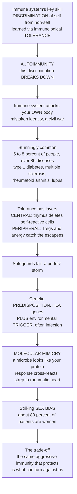

# 🎯 Autoimmunity and Loss of Tolerance

> [!abstract] TL;DR
> The immune system's single most important skill is **discrimination** — telling **self** (your own healthy cells and tissues) from **non-self** (invaders) — and it *learns* this during development by culling the lymphocytes that would attack you, a state called **immunological tolerance**. **Autoimmunity** is what happens when that discrimination **breaks down**: the immune system turns its full destructive power against the body's own tissue as if it were an enemy — a catastrophic case of mistaken identity, a civil war. It is stunningly common — roughly **5–8 %** of people, across **more than 80 diseases**, from **type 1 diabetes** (immune destruction of insulin-making β-cells) to **multiple sclerosis** (attacking the nervous system's myelin insulation) to **rheumatoid arthritis** (attacking the joints) to **lupus** (attacking many organs at once). Tolerance is defended in layers: **central tolerance** deletes most self-reactive cells during development in the thymus and marrow, and **peripheral tolerance** (regulatory T cells, anergy) catches the escapees. Autoimmunity results when these safeguards fail — and it usually takes a **"perfect storm"** of a genetic **predisposition** (certain **HLA/MHC** variants are enormous risk factors) plus an environmental **trigger**, often an infection. One striking mechanism is **molecular mimicry**: a microbe carries a molecule resembling one of *your* proteins, so the anti-microbe response accidentally cross-reacts with self (how strep throat can lead to rheumatic heart disease). Autoimmune disease also shows a still-mysterious **sex bias** — about **80 % of patients are women** — and sits on a profound trade-off: the same aggressive immunity that protects us from pathogens is what turns against us. *(This is the immunology-mechanism view — educational, not medical advice; the clinical and treatment complement is [[Clinical_Medicine/05_Immune_Infectious_and_Hematologic/Immune_Dysfunction_and_Autoimmunity|Immune Dysfunction and Autoimmunity]].)*

---

## Intuition

**Analogy — the security force trained never to attack its own citizens.** Picture an elite security force whose mission is impossibly delicate: destroy *every* foreign intruder while *never once* harming a citizen of the city it guards. To pull this off, every recruit goes through a brutal academy early in life. Trainees are shown pictures of ordinary citizens, and *anyone who reacts aggressively to a citizen is expelled on the spot* — that early screening is **central tolerance**, run in the thymus and bone marrow. But the academy is imperfect; a few dangerous recruits always slip through. So the city also runs internal-affairs officers who patrol the streets, and the moment a guard starts eyeing a local, they either whisper "stand down" or quietly pull the guard off duty — that ongoing supervision is **peripheral tolerance**, enforced by **regulatory T cells** and by **anergy** (a guard who draws a weapon without proper authorization is simply switched off). Together, the academy plus the internal-affairs patrol is **immunological tolerance** — the reason a lethal force can live safely among the people it protects.

**Autoimmunity is the day that whole apparatus of restraint fails at once.** A dangerous recruit who should have been expelled slips through the academy, the internal-affairs officers go silent, and the force — still lethal, still disciplined, still *relentless* — mistakes its own citizens for the enemy and opens fire. It is friendly fire on a city-wide scale, and *which* citizens get attacked decides which catastrophe unfolds: shell the power plant and the lights go out (attack the insulin-making β-cells → **type 1 diabetes**); strip the insulation off the communication lines (attack nerve myelin → **multiple sclerosis**); seize up the transit hubs (attack the joints → **rheumatoid arthritis**); or shell indiscriminately across every district (attack ubiquitous nuclear antigens → **lupus**). Same error — broken discrimination — aimed at different targets. And a loyal force rarely turns on its own for a single reason: it usually takes a **genetic predisposition** (certain command-structure genes — the **HLA** variants — that make guards twitchy) *plus* an **environmental trigger**, most classically an *intruder who happens to look exactly like a citizen* (**molecular mimicry**). The line between defending the self and destroying it turns out to be astonishingly thin.

---

## How It Works

### Core mechanics — tolerance, and the multi-layer failure that breaks it

1. **Why self-reactivity is unavoidable.** The adaptive immune system builds T-cell and B-cell receptors by *randomly* rearranging gene segments, generating an astronomically diverse repertoire so that *some* lymphocyte can recognize *any* possible pathogen. The unavoidable side effect: a large fraction of those random receptors also fit **self**. The immune system must therefore purge or restrain its self-reactive members — **tolerance** is not a bonus feature, it is a structural necessity of a randomly generated repertoire.
2. **Central tolerance (the academy).** In the **thymus**, developing T cells that bind self-peptide–**MHC** too strongly are deleted by **negative selection**; the transcription factor **AIRE** forces medullary thymic epithelium to display tissue-restricted self-antigens (insulin, thyroglobulin, myelin proteins) so that even organ-specific self-reactive clones are caught before deployment. In the **bone marrow**, strongly self-reactive B cells are deleted or rescued by **receptor editing**. Central tolerance is powerful but **inherently leaky** — no antigen catalogue is complete, so self-reactive cells always escape to the periphery.
3. **Peripheral tolerance (internal affairs).** Escapees are held in check body-wide by several overlapping brakes: **regulatory T cells (Tregs, FOXP3+)** that *actively and dominantly* suppress self-reactivity; **anergy**, the functional inactivation of a lymphocyte that encounters antigen *without* a co-stimulatory "second signal"; **clonal deletion** of chronically stimulated cells; **immunological ignorance** (self-antigens hidden behind barriers — brain, eye, testis — in **immune-privileged sites**); and inhibitory **checkpoints** (**CTLA-4, PD-1**). Tolerance is therefore not a one-time event but a *continuous, actively maintained* state.
4. **Breaking tolerance — the "perfect storm."** Autoimmunity needs a susceptible host *and* a trigger. **Genetic predisposition**: particular **HLA/MHC** alleles (which dictate *which* self-peptides are even presented) plus non-HLA immune-regulatory variants (**PTPN22, CTLA4, IL23R**, and rare monogenic hits in **AIRE** → APECED and **FOXP3** → IPEX). **Environmental trigger**: most classically an **infection**, but also the **microbiome/dysbiosis**, **smoking**, diet, low vitamin D, and certain drugs. Neither hit alone is usually enough; disease emerges when weak tolerance and a trigger combine to push self-reactivity past a pathogenic threshold.
5. **The loss-of-tolerance mechanisms.** *(i)* **Molecular mimicry** — a microbial epitope resembles a self epitope, so the anti-pathogen response cross-reacts with tissue (streptococcal M-protein vs cardiac myosin in **rheumatic fever**; *Campylobacter* surface glycans vs nerve gangliosides in **Guillain-Barré syndrome**). *(ii)* **Release of sequestered antigens** — trauma or infection exposes antigens the immune system never learned to tolerate. *(iii)* **Bystander activation / adjuvant effect** — infection-driven inflammation licenses nearby self-reactive cells. *(iv)* **Defective clearance of apoptotic cells and NETs** — undigested nuclear debris becomes autoantigen (central to **lupus**). *(v)* **Failure of regulatory control** — Treg deficiency or checkpoint loss. *(vi)* **Epitope spreading** — the attack broadens from one self-antigen to many over time.
6. **How the damage is done, and the clinical spectrum.** Once tolerance breaks, self is destroyed by the *same* effector weapons used on pathogens, mapping onto **hypersensitivity types II–IV**: **autoantibodies** against cell-surface antigens (Type II — Graves', myasthenia gravis), **immune complexes** depositing in tissue (Type III — the nephritis and vasculitis of lupus), and **self-reactive T cells** directly killing targets (Type IV — β-cell and myelin destruction). Diseases array from **organ-specific** (one tissue-restricted antigen: type 1 diabetes, Hashimoto/Graves, MS, myasthenia gravis, pernicious anemia) to **systemic** (ubiquitous antigens such as nuclear DNA: **SLE**, rheumatoid arthritis, scleroderma, Sjögren).
7. **The fundamental trade-off.** The same aggressive, memory-forming immunity that clears pathogens is what turns against us in autoimmunity — you cannot have relentless pathogen defense *without* risking self-attack. Paul Ehrlich called self-destruction "*horror autotoxicus*" and thought it near-impossible; autoimmunity is the demonstration that it is not only possible but common — the price of an adaptive immune system.

### The discrimination that fails



*Read top to bottom: the immune system's defining skill is self/non-self discrimination, learned as tolerance; autoimmunity is that discrimination breaking down so the body attacks itself; it is common and takes many named forms; tolerance is normally defended in central and peripheral layers whose combined failure — a genes-plus-trigger perfect storm, sometimes via molecular mimicry — unleashes the attack, all riding on the trade-off that the defenses which protect us are the ones that can turn against us.*

---

## Key Concepts

### Secondary (intuitive)

- **Self vs non-self.** The immune system's core job is to attack foreign things (germs) while leaving *your own body* alone. Getting that distinction right is what keeps a powerful defense from becoming dangerous.
- **Tolerance = the learned restraint.** During development, the immune system trains itself *not* to attack you by deleting the cells that would. Autoimmunity is when that training fails.
- **Autoimmunity = a civil war.** The immune system mistakes your own tissue for the enemy and attacks it. It is not weakness — the defenses are *too* active, aimed the *wrong* way.
- **Same mistake, different disease.** Which tissue is attacked decides the illness: insulin cells → **type 1 diabetes**, joints → **rheumatoid arthritis**, nerve insulation → **multiple sclerosis**, many organs at once → **lupus**.
- **It usually takes two things.** Bad luck in your genes *plus* an outside trigger like an infection. One fascinating trigger: a germ that happens to *look like* one of your own proteins (**molecular mimicry**).
- **Who gets it.** Autoimmune disease is common (5–8 % of people, 80+ diseases) and strikes **women far more than men** — often about 8 in 10 patients are female.

### Undergraduate (formal)

- **Two arms of tolerance.** *Central*: negative selection of strongly self-reactive T cells in the **thymus** (aided by **AIRE**, which promiscuously expresses tissue-restricted antigens) and deletion/**receptor editing** of self-reactive B cells in **marrow**. *Peripheral*: **Tregs (FOXP3+)**, **anergy** (antigen without co-stimulation), activation-induced deletion, immune-privileged sites, and **checkpoints (CTLA-4, PD-1)**. Central tolerance is inherently incomplete, so peripheral tolerance is the ongoing guardrail — both must hold.
- **Autoimmunity defined.** A breakdown of self-tolerance producing **adaptive** immune responses — **autoantibodies** and/or **autoreactive T cells** — against self antigens, causing tissue damage. Prevalence ~5–8 %; more than 80 recognized diseases.
- **Organ-specific vs systemic.** *Organ-specific* diseases target a tissue-restricted antigen (islet β-cell, thyroid, myelin, acetylcholine receptor): type 1 diabetes, Hashimoto/Graves, MS, myasthenia gravis, pernicious anemia. *Systemic* diseases target **ubiquitous antigens** (nuclear DNA, histones, ribonucleoproteins), so damage is multi-organ via circulating immune complexes: **SLE** (antinuclear antibodies, immune-complex nephritis — a **Type III hypersensitivity** picture), rheumatoid arthritis, scleroderma, Sjögren.
- **Mechanisms of tissue damage (Gell–Coombs mapping).** **Type II** (antibody vs cell-surface/matrix antigen): Graves', myasthenia gravis, autoimmune hemolytic anemia. **Type III** (immune-complex deposition + complement): lupus nephritis and vasculitis. **Type IV** (T-cell-mediated): type 1 diabetes, MS, Hashimoto, celiac.
- **The multifactorial cause.** **Genetic susceptibility** — the strong **HLA/MHC** associations (HLA-DR/DQ in type 1 diabetes and rheumatic disease; HLA-B27 in spondyloarthropathy) because HLA sets *which* self-peptides are presented; plus non-HLA loci (**PTPN22, CTLA4, IL23R**), complement deficiencies, family clustering, and high twin concordance. **Environmental triggers** — infections (leading), microbiome, smoking, diet, vitamin D, drugs. Autoimmunity is **polygenic and multifactorial**, not Mendelian (rare monogenic exceptions: APECED/AIRE, IPEX/FOXP3).
- **Loss-of-tolerance mechanisms.** **Molecular mimicry** (microbial vs self epitope cross-reactivity — rheumatic fever, Guillain-Barré), **bystander activation and epitope spreading**, **release of sequestered antigens**, **defective clearance of apoptotic cells** (lupus), **failure of Treg/regulatory control**, and inappropriate **MHC expression/costimulation** on target tissue.
- **Notable features.** A striking **female predominance** (~80 %), a chronic **relapsing-remitting** course, and epidemiological links to reduced early microbial exposure (the "hygiene"/regulation hypotheses).

### Graduate (mechanistic and systems)

- **AIRE and the price of a complete self-catalogue.** AIRE-driven promiscuous gene expression in medullary thymic epithelium tolerizes T cells to proteins made only in distant organs; loss-of-function (**APECED/APS-1**) causes multi-organ autoimmunity — proof that central tolerance is *antigen-display-limited*. Corollary: any self-antigen poorly represented in the thymus is a latent autoimmune target.
- **Tregs as a dominant, transferable brake.** FOXP3+ Tregs enforce *dominant* tolerance — their loss (**FOXP3** mutation → **IPEX**) causes fatal early polyautoimmunity, and adoptive Treg transfer suppresses disease in models. This reframes much autoimmunity as a **regulatory deficit**, motivating low-dose IL-2 and Treg-expansion therapies.
- **Checkpoints and the oncology mirror.** CTLA-4 and PD-1 exist precisely to enforce peripheral tolerance; checkpoint-inhibitor cancer immunotherapy *deliberately* releases those brakes and predictably unmasks **immune-related adverse events** — drug-induced thyroiditis, colitis, hypophysitis, type-1-diabetes-like states. Iatrogenic autoimmunity is a live demonstration that tolerance is an *active, checkpoint-dependent* process, not a passive absence of self-reactive cells.
- **The lupus interferon axis.** SLE illustrates innate–adaptive crosstalk: impaired clearance of apoptotic debris and **neutrophil extracellular traps (NETs)** exposes nuclear antigens; nucleic-acid-containing immune complexes engage endosomal **TLR7/9** and drive a **type I interferon** program that amplifies autoreactivity — the rationale for anti-interferon and anti-BAFF biologics.
- **Sex bias and the X chromosome.** Female predominance likely reflects estrogen effects on immune signaling *plus* **X-chromosome dosage** — incomplete X-inactivation of immune genes (**TLR7, CD40L**) and, on a leading recent hypothesis, autoantigenicity of the Xist ribonucleoprotein complex that coats the inactive X. Any complete theory of autoimmunity must explain the ~80 % female skew.
- **Molecular mimicry, proven.** Rheumatic fever (streptococcal M-protein vs cardiac myosin), some type 1 diabetes (viral vs islet antigens), and post-infectious neuropathy (*Campylobacter* LPS vs ganglioside) are worked examples where a *defined* microbial epitope cross-reacts with a *defined* self-antigen — the clearest mechanistic bridge from infection to autoimmunity.
- **The suppression trade-off, quantified.** Every immunosuppressant shifts the host along a curve trading autoimmune activity against **opportunistic infection** (anti-TNF and latent TB reactivation; rituximab and hepatitis B / JC virus). Modern therapy targets the *narrowest effective node* (a single cytokine or lineage) to preserve protective immunity — the immunological logic behind biologics over blanket steroids, and the frontier of **antigen-specific tolerance restoration**.

---

## Python Demo

```python
# Autoimmunity as a failure of self-tolerance, in four pictures:
#   (a1) THE PERFECT STORM. Disease requires BOTH weak tolerance (genetic risk) AND an
#        environmental trigger. A 2-D map of genetic risk x trigger -> disease probability
#        shows the interaction: neither hit alone crosses the disease line; together they do.
#   (a2) LAYERED SAFEGUARDS. The fraction of self-reactive cells that ESCAPE to cause disease
#        depends on central tolerance x peripheral (Treg) tolerance x trigger amplification.
#        Only when central AND peripheral are weak AND a trigger is present does escape cross
#        the pathogenic threshold.
#   (b1) MOLECULAR MIMICRY. The more a microbial epitope resembles a self epitope, the more a
#        cross-reactive response spills onto self tissue -- above a similarity threshold it
#        attacks self (e.g. strep M-protein ~ cardiac myosin -> rheumatic heart disease).
#   (b2) SELF-REACTIVE REPERTOIRE. Failed negative selection / Treg loss leaves more
#        high-self-affinity lymphocytes alive -- comparing a healthy vs an autoimmune-prone
#        repertoire and the escaped self-reactive fraction.
import numpy as np
import matplotlib.pyplot as plt

fig, ax = plt.subplots(2, 2, figsize=(13, 9))

# ---------- (a1) Perfect storm: genetic risk x trigger -> disease probability ----------
g = np.linspace(0, 1, 200)                 # genetic risk (weaker tolerance ->)
t = np.linspace(0, 1, 200)                 # environmental trigger strength
G, T = np.meshgrid(g, t)
self_react = 0.20 * G + 0.20 * T + 0.60 * G * T     # interaction term dominates -> needs BOTH
disease_prob = 1.0 / (1.0 + np.exp(-10.0 * (self_react - 0.45)))
im = ax[0, 0].imshow(disease_prob, origin="lower", extent=[0, 1, 0, 1],
                     aspect="auto", cmap="inferno", vmin=0, vmax=1)
cs = ax[0, 0].contour(G, T, disease_prob, levels=[0.5], colors="cyan", linewidths=2)
ax[0, 0].clabel(cs, fmt="disease threshold", fontsize=8)
ax[0, 0].scatter([0.9], [0.85], color="red", s=70, edgecolor="white", zorder=5)
ax[0, 0].annotate("perfect storm", (0.9, 0.85), (0.42, 0.9), color="white", fontsize=9,
                  arrowprops=dict(arrowstyle="->", color="white"))
ax[0, 0].set(title="(a1) Multifactorial cause: genetic risk x trigger",
             xlabel="genetic risk  (weaker tolerance ->)",
             ylabel="environmental trigger strength")
fig.colorbar(im, ax=ax[0, 0], label="disease probability")

# ---------- (a2) Layered safeguards: escaping self-reactive fraction ----------
scen        = ["Healthy", "Weak central\n(HLA / AIRE)", "Treg loss\n(weak peripheral)",
               "Both weak\n+ trigger"]
central_eff = np.array([0.98, 0.85, 0.98, 0.85])   # efficiency of thymic negative selection
periph_eff  = np.array([0.92, 0.92, 0.55, 0.55])   # efficiency of Treg / anergy control
trigger_amp = np.array([1.0,  1.0,  1.0,  2.4])    # infection amplifies escapees
escape = (1 - central_eff) * (1 - periph_eff) * trigger_amp
thr = 0.03
cols = ["#27AE60" if e < thr else "#C0392B" for e in escape]
ax[0, 1].bar(range(len(scen)), escape, color=cols, edgecolor="k")
ax[0, 1].axhline(thr, ls="--", color="black", label="pathogenic threshold")
ax[0, 1].set_xticks(range(len(scen))); ax[0, 1].set_xticklabels(scen, fontsize=8)
ax[0, 1].set(title="(a2) Layered tolerance: fraction of self-reactive cells escaping",
             ylabel="escape fraction (self-reactivity reaching tissue)")
ax[0, 1].legend(fontsize=8); ax[0, 1].grid(alpha=0.3, axis="y")

# ---------- (b1) Molecular mimicry: epitope similarity -> cross-reactivity ----------
sim = np.linspace(0, 1, 300)               # similarity of microbial epitope to self epitope
cross = 1.0 / (1.0 + np.exp(-14.0 * (sim - 0.60)))
ax[1, 0].plot(sim, cross, color="#8E44AD", lw=2.4)
ax[1, 0].axvline(0.60, ls="--", color="black", label="mimicry threshold")
ax[1, 0].axhline(0.5, ls=":", color="grey", lw=1)
ax[1, 0].fill_between(sim, cross, where=sim >= 0.60, color="#C0392B", alpha=0.22,
                      label="cross-reacts -> attacks self")
ax[1, 0].scatter([0.82], [1.0 / (1.0 + np.exp(-14.0 * (0.82 - 0.60)))],
                 color="red", s=70, edgecolor="k", zorder=5)
ax[1, 0].annotate("strep M-protein\nvs cardiac myosin", (0.82, 0.9), (0.28, 0.55),
                  fontsize=8, arrowprops=dict(arrowstyle="->"))
ax[1, 0].set(title="(b1) Molecular mimicry: similarity -> cross-reactivity",
             xlabel="similarity of microbial epitope to self epitope",
             ylabel="cross-reactive attack on self", ylim=(-0.03, 1.05))
ax[1, 0].legend(fontsize=8, loc="center left"); ax[1, 0].grid(alpha=0.3)

# ---------- (b2) Self-reactive repertoire: healthy vs autoimmune-prone ----------
aff = np.linspace(0, 1, 400)               # lymphocyte receptor affinity for a self antigen
raw = np.exp(-3.0 * aff)                    # pre-selection: many low-affinity, few high
surv_healthy = 1.0 / (1.0 + np.exp(18.0 * (aff - 0.45)))   # strong negative selection deletes high-aff
surv_auto    = 1.0 / (1.0 + np.exp(9.0  * (aff - 0.65)))   # leaky selection + Treg loss -> more survive
rep_healthy, rep_auto = raw * surv_healthy, raw * surv_auto
path = aff > 0.5
ax[1, 1].plot(aff, rep_healthy, color="#27AE60", lw=2.3, label="Healthy repertoire")
ax[1, 1].plot(aff, rep_auto,    color="#C0392B", lw=2.3, label="Autoimmune-prone")
ax[1, 1].axvline(0.5, ls="--", color="black", label="pathogenic self-affinity")
ax[1, 1].fill_between(aff, rep_auto, where=path, color="#C0392B", alpha=0.22,
                      label="escaped self-reactive cells")
ax[1, 1].set(title="(b2) Self-reactive repertoire after selection",
             xlabel="receptor affinity for self antigen",
             ylabel="surviving lymphocytes (density)")
ax[1, 1].legend(fontsize=8); ax[1, 1].grid(alpha=0.3)

fig.suptitle("Autoimmunity as failure of self-tolerance: perfect storm, layered safeguards, mimicry, repertoire",
             fontsize=13)
fig.tight_layout()
plt.show()
```

**What the plots show.** *Panel (a1)* is the multifactorial idea in one map: disease probability climbs only toward the *top-right corner*, where genetic risk (weak tolerance) **and** an environmental trigger are both high — neither axis alone crosses the cyan disease-threshold contour, which is exactly why most autoimmunity requires a **perfect storm** rather than a single cause. *Panel (a2)* decomposes tolerance into layers: the escaping fraction of self-reactive cells is tiny when both central *and* peripheral tolerance are intact, rises modestly if either one weakens alone, and only crosses the pathogenic threshold when *both* fail *and* a trigger amplifies the escapees — the layered-safeguard logic of tolerance. *Panel (b1)* models **molecular mimicry**: a microbial epitope only weakly resembling self provokes little self-attack, but past a similarity threshold the anti-microbe response spills onto self tissue (the strep-M-protein-versus-cardiac-myosin cross-reaction that underlies rheumatic heart disease). *Panel (b2)* contrasts repertoires: a healthy thymus deletes high-self-affinity lymphocytes sharply, but with **failed negative selection or Treg loss** the deletion curve softens, leaving a shaded population of high-affinity self-reactive cells alive to drive disease. *(All curves are illustrative, textbook-level models — not fitted clinical data.)*

---

## Real-World Applications

> **Example — molecular mimicry and rheumatic heart disease.** After a *Streptococcus pyogenes* throat infection, antibodies and T cells raised against the bacterial **M-protein** cross-react with **cardiac myosin and valve tissue** because the two are molecularly similar. In a genetically susceptible child this cross-reaction inflames the heart valves — **rheumatic fever** progressing to **rheumatic heart disease**. It is the cleanest real-world proof of loss-of-tolerance by mimicry: a defined microbial epitope, a defined self-antigen, and a preventable outcome — which is exactly why prompt antibiotic treatment of strep throat is a public-health priority.

- **HLA typing and disease risk.** The strongest genetic risk factors for autoimmune disease are **HLA/MHC** alleles, mapped by the same GWAS methods used for any complex trait. HLA-DR/DQ haplotypes stratify type 1 diabetes and rheumatoid arthritis risk, and **HLA-B27** typing is used clinically in ankylosing spondylitis — a direct application of the principle that HLA sets which self-peptides are presented.
- **Autoantibody testing as a mechanistic readout.** The **antinuclear antibody (ANA)** panel operationalizes *systemic* autoimmunity: because lupus targets ubiquitous nuclear antigens, patients circulate anti-nuclear, **anti-dsDNA**, and anti-Smith antibodies, and immune-complex deposition **consumes complement (low C3/C4)** — serology that both diagnoses and tracks the friendly-fire biology.
- **Checkpoint biology, weaponized in oncology (the mirror).** Cancer immunotherapies that *release* CTLA-4/PD-1 brakes deliberately lower the tolerance threshold to attack tumors — and predictably cause **immune-related adverse events** (autoimmune thyroiditis, colitis, hypophysitis, new type-1-diabetes). Iatrogenic autoimmunity is now everyday clinical proof that peripheral tolerance is an *active* checkpoint process.
- **Treg and tolerance-restoring therapies.** Because much autoimmunity is a *regulatory deficit*, experimental therapies aim to *restore* tolerance rather than blanket-suppress it — **low-dose IL-2** and adoptive **Treg** transfer to expand regulatory cells, and **antigen-specific tolerization** to switch off only the offending self-reactivity — the frontier beyond broad immunosuppression.
- **The suppression–infection trade-off in practice.** Anti-TNF biologics transformed rheumatoid arthritis and inflammatory bowel disease, but by blunting granuloma maintenance they can **reactivate latent tuberculosis** — so latent-TB screening before starting is standard. The mechanistic trade-off (defense vs self-attack) becomes a concrete clinical checklist.

---

## Common Pitfalls

- **"Autoimmunity means a weak immune system."** The opposite — the immune system is *over-active and misdirected*, not weak. It is a **targeting** error, not an **intensity** error. Confusing autoimmunity with **immunodeficiency** (the *sibling* topic) misframes the whole problem; the two can even coexist, since many primary immunodeficiencies present with autoimmunity because they disturb the *regulation* of immunity.
- **Treating tolerance as a passive gap.** Peripheral tolerance is *actively maintained* every day by Tregs, anergy, and checkpoints — it is not simply "the absence of self-reactive cells." This is why *removing* a brake (a checkpoint inhibitor, or Treg loss) *causes* autoimmunity, and why "tolerance-restoring" therapy is even conceivable.
- **Assuming one cause.** Autoimmunity is almost never monocausal. A gene, an infection, or a hormone alone rarely suffices — it is the **interaction** (the perfect storm) that matters, which is why identical-twin concordance is well below 100 % and why finding "the trigger" for an individual patient is usually impossible.
- **Equating autoantibody with mechanism.** Some autoantibodies *cause* the damage (anti-acetylcholine-receptor in myasthenia gravis; anti-dsDNA in lupus nephritis); others are downstream **markers** of a T-cell-driven process and are not themselves destructive. A positive test is a clue, not a diagnosis — low-titre ANA is common in healthy people and rises with age.
- **Over-reading molecular mimicry.** Sequence or structural similarity between a microbe and self is common; it triggers disease only when similarity is high *and* tolerance is already fragile *and* the self-epitope is accessible. Mimicry is a real mechanism, not an explanation for every post-infectious symptom.
- **Ignoring the sex bias.** Autoimmune disease is roughly 80 % female, so under-suspecting it in women delays diagnosis; the mechanism (hormones and X-chromosome dosage) is still an active research question, not a settled footnote.
- **Reading this as clinical guidance.** This note explains *immunological mechanisms* at textbook level. It is **not** advice for any individual's diagnosis or treatment — the clinical and therapeutic view lives in the linked Clinical Medicine note and, ultimately, with a clinician.

---

## Related Concepts

**Within this Immunology vault (Section 05 — Immune System in Disease).** This note is the loss-of-tolerance anchor of the section and sits beside several siblings, referenced here in prose because they are companion notes in the same section. *Hypersensitivity and Allergy* covers the **Gell–Coombs Type II–IV** effector mechanisms that *execute* autoimmune tissue damage (and Type I allergy as the misdirected-response cousin); *Immunodeficiency Disorders* is the deliberately excluded contrast — dysregulation toward *too little* rather than *misdirected* immunity, though the two overlap. Upstream, *T Cell Development and Thymic Selection* is where **central tolerance** (negative selection, AIRE) is built — the machinery whose failure this note describes — and *Helper T Cells and T Cell Subsets* details the **regulatory T cells (Tregs)** that enforce peripheral tolerance and whose loss drives autoimmunity. Downstream, *Cancer Immunotherapy and Checkpoint Inhibitors* is the oncology mirror: deliberately releasing the same CTLA-4/PD-1 brakes to attack tumors, at the cost of iatrogenic autoimmunity.

**Across the vault (Glob-verified links).**

- [[Clinical_Medicine/05_Immune_Infectious_and_Hematologic/Immune_Dysfunction_and_Autoimmunity|Immune Dysfunction and Autoimmunity]] — the *clinical and treatment* complement to this *mechanism* view: named diseases, autoantibody diagnostics, and the immunosuppression/biologics therapeutic landscape.
- [[Biology/11_Microbiology_and_Immunology/The_Adaptive_Immune_System|The Adaptive Immune System]] — the T cells, B cells, antibodies, and MHC restriction whose randomly generated repertoire *requires* tolerance and whose self-reactivity, unleashed, *is* autoimmunity.
- [[Biology/11_Microbiology_and_Immunology/The_Innate_Immune_System|The Innate Immune System]] — complement, phagocytes, TLRs, and the interferon/NET biology that execute immune-complex and interferon-driven damage in lupus and amplify autoreactivity.
- [[Genetics/05_Human_and_Medical_Genetics/Complex_Trait_Genetics_and_GWAS|Complex Trait Genetics and GWAS]] — how the HLA and non-HLA risk loci behind autoimmune susceptibility are mapped, explaining its polygenic, multifactorial genetic architecture.
- [[Health_Nutrition_and_Longevity/02_Nutrition_Science/The_Gut_Microbiome_and_Nutrition|The Gut Microbiome and Nutrition]] — the microbiome as an environmental modulator of tolerance, implicated in the rising incidence of autoimmune disease and in "hygiene/regulation" hypotheses.

---

## Review Questions

**Secondary.** Using the "security force trained never to attack its own citizens" analogy, explain what **tolerance** is and what goes wrong in **autoimmunity**. Why does the *same* underlying failure produce type 1 diabetes in one person and multiple sclerosis in another? And why does becoming autoimmune usually take *two* things rather than one — give an example of each.

**Undergraduate.** Distinguish **central** from **peripheral** tolerance, naming one key mechanism of each and where it operates. Then explain the **perfect-storm** model of autoimmunity: give one **genetic** contributor (and why HLA is so important) and one **environmental** trigger, and describe how **molecular mimicry** turns an anti-infection response into an anti-self response using a named example. Finally, contrast an **organ-specific** with a **systemic** autoimmune disease by the *type of self-antigen* each targets.

**Graduate.** Autoimmunity has been described as a failure of an *active, Treg- and checkpoint-dependent* restraint rather than a passive absence of self-reactive cells. Marshal three lines of evidence for this claim (consider IPEX/FOXP3, APECED/AIRE, and checkpoint-inhibitor immune-related adverse events), and explain what each reveals about *which layer* of tolerance failed. Then, given that the same effector mechanisms defend against pathogens and attack self, argue why "tolerance-restoring" therapies (antigen-specific tolerization, low-dose IL-2, Treg transfer) are conceptually preferable to blanket immunosuppression — and state precisely the trade-off they are trying to escape.

---

## Sources

- Murphy, K., & Weaver, C. (2022). *Janeway's Immunobiology* (10th ed.). Garland Science / W. W. Norton — immunological tolerance, central and peripheral tolerance, autoreactivity, and the immunobiology of autoimmune disease.
- Abbas, A. K., Lichtman, A. H., & Pillai, S. (2021). *Cellular and Molecular Immunology* (10th ed.). Elsevier — tolerance checkpoints, mechanisms of self-reactivity, and the effector arms of autoimmune tissue damage.
- Rosenblum, M. D., Remedios, K. A., & Abbas, A. K. (2015). "Mechanisms of human autoimmunity." *Journal of Clinical Investigation*, 125(6), 2228–2233 — central/peripheral tolerance checkpoints and their failure in human disease.
- Theofilopoulos, A. N., Kono, D. H., & Baccala, R. (2017). "The multiple pathways to autoimmunity." *Nature Immunology*, 18(7), 716–724 — genetic, environmental, and mechanistic routes (mimicry, regulation failure, interferon) to loss of tolerance.

---

#immunology #autoimmunity #immune-tolerance #molecular-mimicry #regulatory-t-cells
