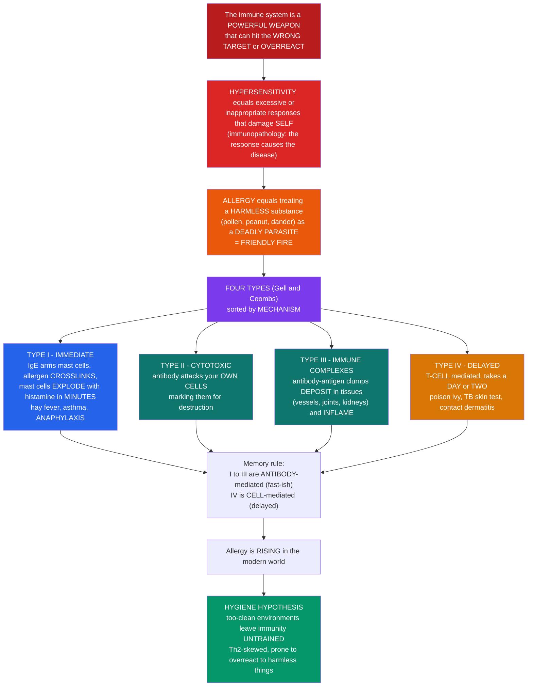

# 🤧 Hypersensitivity and Allergy

> [!abstract] TL;DR
> Your immune system is a **powerful weapon**, and like any powerful weapon it can cause terrible damage when it **fires at the wrong target or overreacts**. **Hypersensitivity** is the umbrella term for immune responses that are **excessive or inappropriate**, damaging your own tissues — the response, not the pathogen, causing the disease (**immunopathology**). **Allergy** is the most familiar example: your immune system treating a **harmless** substance — pollen, peanuts, cat dander — as if it were a deadly parasite, and mounting a full-scale attack that hurts **you**, not any real threat. It is **friendly fire**. Immunologists sort these misfires into **four types** (the **Gell and Coombs classification**) by mechanism. **Type I** is **immediate allergy**: an allergen triggers **IgE** that arms **mast cells** like landmines; on re-exposure the allergen **crosslinks** the IgE and the mast cells **explode**, dumping **histamine** within minutes — hay fever, hives, asthma, and, at worst, life-threatening **anaphylaxis** (a body-wide crash). **Type II** is antibody attacking your own **cells** (marking them for destruction, as in some blood disorders and transfusion reactions). **Type III** is **immune complexes** — clumps of antibody-bound antigen depositing in vessels, joints, and kidneys and igniting inflammation there. **Type IV** is **delayed** and different: not antibody-mediated at all but **T-cell** mediated, taking a day or two (poison ivy, the tuberculin skin test, contact dermatitis). A memorable rule: **types I–III are antibody-mediated (fast-ish), type IV is cell-mediated (delayed)**. Allergy is **exploding** in the modern world, and the leading explanation — the **hygiene hypothesis** — suggests our too-clean environments deprive the developing immune system of the microbial "training" it needs, leaving it prone to overreact to harmless things. Understanding hypersensitivity is understanding the immune system's dangerous capacity for friendly fire. *Educational science content, not medical advice.*

---

## Intuition

**Analogy first — friendly fire from your own guns.** Imagine your immune system as a superbly armed garrison protecting a city. Against a real invader it is exactly what you want: fast, lethal, overwhelming. But a weapon that powerful is dangerous in a second way — not because it is too weak, but because it can **misfire**. Sometimes it aims at a **harmless passer-by** and blows them up; sometimes it fires with **wildly disproportionate force** at a trivial threat and levels the block in the process. In both cases the damage is real, the target was wrong, and the casualties are your **own citizens**. That is **hypersensitivity**: the garrison hurting the city it was built to defend. The invader isn't the problem anymore — the **defense** is.

**Allergy** is the classic misfire. A speck of **pollen**, a molecule of **peanut**, a flake of **cat dander** — utterly harmless things — drift in, and the garrison reacts as if a **deadly parasite** had breached the walls: alarms, explosions, floods, evacuation. All that firepower, and the "enemy" was a bit of dust. The streaming eyes of hay fever, the wheeze of asthma, the welts of hives, and the whole-body collapse of **anaphylaxis** are not caused by pollen or peanut doing anything harmful; they are caused by your **own** immune response, over-reacting to nothing. Friendly fire, aimed at a phantom.

The genius of the **Gell and Coombs classification** is that it is a **map of the misfires** — four distinct ways the garrison can go wrong, sorted by **which weapon** malfunctions. **Type I** is the **hair-trigger booby-trap**: antibodies called **IgE** wire up **mast cells** like landmines seeded through your tissues, and the next time the allergen appears it trips them all at once — an **immediate**, explosive release of **histamine** in **minutes**. **Type II** is a case of **mistaken identity**: antibodies stick to your **own cells** and mark them for demolition. **Type III** is **debris in the machinery**: clumps of antibody stuck to antigen (**immune complexes**) drift downstream and jam into the plumbing — blood-vessel walls, joints, kidney filters — and start fires wherever they lodge. **Type IV** is the **slow, deliberate strike team**: no antibodies at all, but **T cells** that take a **day or two** to muster before they attack (the poison-ivy rash that blooms two days after the hike, the red bump of a positive **TB skin test**). The one-line memory hook: **I, II, III are antibody-mediated and fast-ish; IV is cell-mediated and delayed.**

And why is this friendly fire **getting worse**? Allergic disease is surging across the developed world, and the leading idea — the **hygiene hypothesis** — is almost poetic: an immune system, like a soldier, has to be **trained** to tell friend from foe, and that training comes from **early-life exposure** to a rich soup of microbes and dirt. Raise it in a too-clean world, and it grows up **jumpy and untrained**, apt to open fire on pollen and peanuts because it never learned what a real enemy looks like. Understanding hypersensitivity, then, is understanding the immune system's most sobering property: a weapon strong enough to save your life can, when it overreacts or aims wrong, **turn on you**.

---

## How It Works

### Core Mechanics

1. **Hypersensitivity = immunopathology.** The defining feature is that **the immune response itself**, not the antigen, causes the tissue damage. The trigger antigen (an **allergen** in allergy, a drug, a self-antigen, a microbial antigen) may be intrinsically harmless; the harm comes from a response that is **excessive** (too much firepower) or **inappropriate** (aimed at the wrong target). This is the flip side of protective immunity — the same effector mechanisms (antibody, complement, T cells) turned destructive.
2. **The Gell and Coombs framework sorts by mechanism, not by trigger.** Four types, remembered by the **ACID** mnemonic: **A**naphylactic (I), **C**ytotoxic (II), **I**mmune-complex (III), **D**elayed (IV). Types **I–III are antibody-mediated**; type **IV is T-cell-mediated**. The same allergen or drug can cause more than one type.
3. **Type I — immediate / IgE-mediated (the "allergic" type).** Two phases. **Sensitization** (first exposure, *no symptoms*): allergen is taken up, presented to **Th2** cells, whose cytokines (**IL-4, IL-13**) drive B cells to class-switch to **IgE**; that IgE binds the high-affinity receptor **FcεRI** on **mast cells** and **basophils**, arming them. **Elicitation** (re-exposure, *symptoms*): allergen **crosslinks** adjacent IgE molecules, triggering mast-cell **degranulation** — a near-instant dump of **histamine**, plus newly made **leukotrienes** and **prostaglandins**. The **immediate reaction** (minutes) causes vasodilation, itch, bronchoconstriction, and mucus; a **late-phase reaction** (hours) recruits eosinophils and sustains inflammation.
4. **Type I manifestations scale with route and dose.** Local exposure gives **allergic rhinitis** (hay fever), **asthma**, **urticaria** (hives), **atopic dermatitis** (eczema), and food/drug/insect allergy. **Systemic** mast-cell activation gives **anaphylaxis** — body-wide vasodilation (shock), bronchoconstriction (can't breathe), and collapse — a medical emergency.
5. **Type II — antibody-mediated cytotoxic.** **IgG or IgM** binds antigens on a **cell surface** or in the **matrix**, then recruits **complement** and **Fc-receptor-bearing** cells to destroy or dysregulate that cell. Examples: **autoimmune hemolytic anemia**, **transfusion reactions** (ABO mismatch), **hemolytic disease of the newborn** (anti-Rh), **Goodpasture syndrome** (anti-basement-membrane), and some drug-induced cytopenias.
6. **Type III — immune-complex-mediated.** Soluble **antigen–antibody complexes** form in the blood and, instead of being cleared, **deposit** in tissues where fluid is filtered under pressure — **blood-vessel walls, joints, kidney glomeruli**. There they fix **complement** and draw in neutrophils, causing local inflammation. Examples: **serum sickness**, the **Arthus reaction**, **vasculitis**, **lupus nephritis**, **post-streptococcal glomerulonephritis**.
7. **Type IV — delayed-type / cell-mediated.** **No antibody.** Antigen-specific **T cells** (Th1, Th17, or cytotoxic CD8) that were primed earlier are re-activated on re-exposure; over **24–72 hours** they recruit and activate macrophages and cause tissue damage. Examples: **contact dermatitis** (poison ivy, nickel), the **tuberculin (TB) skin test**, **granuloma** formation, **transplant rejection**, and **celiac disease**. The delay is the diagnostic tell — it takes time to mobilize cells rather than trip pre-armed antibodies.
8. **The allergy epidemic and the hygiene hypothesis.** Allergic disease has risen steeply in industrialized populations over decades — too fast for genetics alone. The **hygiene hypothesis** (Strachan, 1989), refined as the **"old friends"** and **biodiversity** hypotheses, proposes that reduced **early-life microbial exposure** (fewer siblings, cleaner homes, antibiotics, less contact with soil and animals) deprives the developing immune system of signals it needs to build **regulatory** networks (**Tregs**) and a balanced **Th1/Th2** setpoint — leaving it **Th2-skewed** and prone to make IgE against harmless antigens. Barrier genetics (e.g., **filaggrin** mutations causing leaky skin) and the **dual-allergen-exposure** hypothesis (sensitization through inflamed skin vs tolerance through the gut) further shape who becomes allergic.

### Flow / Architecture



---

## Key Concepts

### Secondary — the big picture

- **Hypersensitivity is the immune system overreacting or mis-aiming**, so that its own response — not the germ — causes the damage. It is the immune system as a **double-edged sword**.
- **Allergy is the everyday example:** the immune system treats something **harmless** (pollen, peanuts, cat dander) like a dangerous parasite and attacks it, hurting **you**. That is **friendly fire**.
- **There are four types (Gell and Coombs).** **Type I** = immediate allergy (IgE and **mast cells** exploding in **minutes** — hay fever, asthma, and life-threatening **anaphylaxis**). **Type II** = antibodies attacking your own **cells**. **Type III** = **immune complexes** clogging and inflaming tissues. **Type IV** = **delayed**, driven by **T cells**, appearing a **day or two** later (poison ivy, TB skin test).
- **The quick rule:** types I–III use **antibodies** (fast-ish), type IV uses **T cells** (delayed).
- **Allergy is on the rise**, and the leading idea (the **hygiene hypothesis**) is that growing up in **too-clean** surroundings leaves the immune system **untrained**, so it overreacts to harmless things.

### Undergraduate — mechanisms and distinctions

- **Type I in two phases.** **Sensitization**: allergen → **Th2** response → **IL-4/IL-13** → B-cell class switch to **IgE** → IgE binds **FcεRI** on mast cells/basophils (silent, no symptoms). **Elicitation**: re-exposure → allergen **crosslinks** surface IgE → mast-cell **degranulation** → **preformed** histamine (seconds–minutes) + **newly synthesized** leukotrienes and prostaglandins → **immediate reaction** (minutes) and a cell-recruiting **late-phase** (2–8 h).
- **The mediators map to symptoms.** **Histamine** → vasodilation, itch, increased vascular permeability (wheal-and-flare, edema). **Leukotrienes** (LTC4/D4/E4) → sustained bronchoconstriction and mucus. **Prostaglandin D2** → bronchoconstriction and vasodilation. Systemically, all at once → **anaphylaxis** (hypotension + airway compromise).
- **Atopy and the allergic march.** **Atopy** is the genetic tendency to make IgE against common environmental antigens. The **allergic march** is the typical childhood progression: **atopic dermatitis** → **food allergy** → **allergic rhinitis** → **asthma**.
- **Type II — three sub-mechanisms.** (a) **Complement/Fc-mediated lysis or phagocytosis** of antibody-coated cells (hemolytic anemia, transfusion reactions); (b) **inflammation** via Fc-receptor recruitment (some vasculitides); (c) **receptor dysfunction** without cell death — antibodies that **block** or **stimulate** a receptor (Graves disease and myasthenia gravis are sometimes classed as **type V** for this reason).
- **Type III depends on complex size and antigen:antibody ratio.** **Antigen excess** favors small, soluble complexes that evade clearance and **deposit** in vessels, glomeruli, and joints, where they fix complement (C3a/C5a chemoattractants) and recruit neutrophils. **Serum sickness** (systemic, days after antigen exposure) and the **Arthus reaction** (local, at an injection site) are the archetypes.
- **Type IV is a memory T-cell response.** Sensitization primes antigen-specific **Th1/Th17** (and CD8 CTL) cells; re-challenge triggers cytokine release (**IFN-γ**, TNF) that activates **macrophages** over **24–72 h**. Small reactive chemicals (haptens like **urushiol** from poison ivy, **nickel**) bind self-proteins to become immunogenic — the basis of **contact dermatitis**. The **tuberculin skin test** is a deliberate, diagnostic type IV reaction.
- **Diagnosis and management (educational, brief).** **Skin-prick** and **serum specific-IgE** testing identify type I sensitizations; **patch testing** identifies type IV contact allergens. Management ladders: **avoidance**, **antihistamines** and **corticosteroids** (dampening mediators/inflammation), **epinephrine** for anaphylaxis (reversing vasodilation and bronchoconstriction), **allergen immunotherapy** (desensitization — retraining tolerance), and **anti-IgE biologics** (omalizumab, stripping IgE off mast cells).

### Graduate — depth and consequences

- **Why IgE at all — the antiparasite hypothesis.** The IgE/mast-cell/eosinophil axis (**type 2 immunity**) evolved against **helminths** and venoms — large threats that antibody-plus-complement cannot simply engulf. Allergy is this ancient anti-parasite program **misdirected** at innocuous environmental proteins, which is why allergens are often stable, soluble, protease-active proteins that resemble worm antigens. Mast-cell degranulation is, in its proper context, a rapid tissue-defense and barrier-expulsion mechanism.
- **The FcεRI signaling threshold.** Sensitized mast cells carry IgE of many specificities; degranulation requires **aggregation** of FcεRI by multivalent allergen crosslinking two or more IgE molecules. The **affinity, specific-IgE fraction, and epitope valency** of the allergen set the threshold — explaining why highly cross-reactive, multivalent allergens (peanut Ara h 2) are dangerous while monovalent haptens can bind IgE yet fail to trigger release. This threshold logic underlies both **desensitization protocols** (delivering sub-threshold, escalating doses) and the protective effect of **blocking IgG4** raised by immunotherapy.
- **Immune-complex pathology is a clearance failure.** Healthy handling depends on **complement-mediated solubilization** and transport of complexes to phagocytes (via erythrocyte **CR1**). **Complement deficiencies (C1q, C2, C4)** paradoxically *predispose* to immune-complex disease and lupus, because complexes are not cleared — a counterintuitive link between an antibody-effector cascade and type III pathology, and a reason [[The_Complement_System]] sits at the heart of both protection and autoimmunity.
- **Type IV heterogeneity.** "Delayed-type hypersensitivity" spans distinct subtypes: **IVa** (Th1/macrophage — tuberculin, granuloma), **IVb** (Th2/eosinophil — some chronic drug/atopic reactions), **IVc** (cytotoxic CD8 — contact dermatitis, severe cutaneous drug reactions like **Stevens–Johnson/TEN**), and **IVd** (T-cell/neutrophil). Severe drug reactions can be genetically predisposed by **HLA** alleles (e.g., HLA-B*57:01 and abacavir), tying type IV to [[The_Major_Histocompatibility_Complex|MHC]]-restricted T-cell recognition.
- **The Th1/Th2/Treg regulatory logic behind the hygiene hypothesis.** Early microbial exposure (and helminth/commensal signals) promotes **regulatory T cells** and **IL-10/TGF-β**-mediated tolerance and a balanced Th1 arm; its absence permits **Th2 dominance** and IgE against environmental antigens. Modern framings emphasize the **microbiome** (breadth and stability of colonization, short-chain-fatty-acid signaling) and **regulatory** failure rather than a simple Th1-vs-Th2 seesaw — allergy as a **failure of tolerance**, not merely excess Th2. This connects mucosal immunology, the gut microbiome, and Treg biology directly to allergic disease prevalence.
- **The allergen itself matters.** Clinically important allergens are enriched for **proteolytic activity** (Der p 1 dust-mite protease disrupts epithelial tight junctions and biases toward Th2), **lipid-binding** (which engages innate receptors), and **stability**. This is why allergenicity is a property of the **antigen and the barrier context**, not just the host — and why **barrier dysfunction** (filaggrin-null skin, the **dual-allergen-exposure** hypothesis) is now central to how sensitization is thought to begin.
- **Therapeutic desensitization as re-education.** **Allergen immunotherapy** works by shifting the response away from IgE toward **IL-10** and **blocking IgG4**, and by expanding allergen-specific **Tregs** — literally inducing **tolerance** to the allergen. **Anti-IgE (omalizumab)** removes free IgE and downregulates FcεRI; **anti-IL-4Rα (dupilumab)** and **anti-IL-5** biologics block the type-2 cytokine axis. These are precision immunology: each drug targets a specific node in the sensitization-to-elicitation pathway.

---

## Python Demo

```python
# Hypersensitivity and allergy, quantified three ways:
#   (1) TYPE I, TWO PHASES: the SENSITIZATION vs REACTION time course.
#       First exposure builds IgE but releases (almost) no mediator -> no symptoms.
#       Second exposure crosslinks IgE -> explosive mast-cell degranulation:
#       a fast histamine SPIKE within minutes plus a slower LATE-PHASE bump.
#   (2) DOSE-RESPONSE: allergen dose vs mediator release / severity, a sigmoid
#       climbing from asymptomatic through local reaction to ANAPHYLAXIS.
#   (3) FOUR-TYPES timing/mechanism MAP: onset time (minutes vs days) of the four
#       Gell-and-Coombs types, colored by mediator; plus the HYGIENE HYPOTHESIS
#       (allergy prevalence falling with early-life microbial exposure).
import numpy as np
import matplotlib.pyplot as plt

fig, ax = plt.subplots(2, 2, figsize=(13, 9))

# ---- (1) Type I: sensitization (1st exposure) vs reaction (2nd exposure) ----
t = np.linspace(0, 240, 800)                     # minutes after exposure

def mast_release(t, amp, t_imm=8, w_imm=6, amp_late=0.0, t_late=180, w_late=60):
    """Immediate degranulation spike + optional late-phase bump."""
    immediate = amp * np.exp(-0.5 * ((t - t_imm) / w_imm) ** 2)
    late = amp_late * np.exp(-0.5 * ((t - t_late) / w_late) ** 2)
    return immediate + late

# First exposure = SENSITIZATION: IgE is being made, mast cells are being armed,
# but there is essentially no mediator release and NO symptoms.
first = mast_release(t, amp=0.04, amp_late=0.0)
# Second exposure = ELICITATION: crosslinking -> big immediate spike + late phase.
second = mast_release(t, amp=1.0, amp_late=0.35, t_late=180, w_late=45)

ax[0, 0].plot(t, first, color="#2563eb", lw=2.3,
              label="1st exposure (SENSITIZATION): no symptoms")
ax[0, 0].plot(t, second, color="#dc2626", lw=2.6,
              label="2nd exposure (REACTION): degranulation")
ax[0, 0].axvspan(0, 30, color="#dc2626", alpha=0.08)
ax[0, 0].annotate("IMMEDIATE\n(minutes)", (8, 1.02), color="#dc2626",
                  fontsize=8, ha="center")
ax[0, 0].annotate("LATE-PHASE\n(hours)", (180, 0.40), color="#b45309",
                  fontsize=8, ha="center")
ax[0, 0].set_xlabel("time after exposure (minutes)")
ax[0, 0].set_ylabel("mast-cell mediator release (histamine, norm.)")
ax[0, 0].set_title("(1) TYPE I: silent 1st hit, explosive 2nd hit")
ax[0, 0].legend(fontsize=8, loc="upper right")
ax[0, 0].grid(alpha=0.3)

# ---- (2) Dose-response: allergen dose vs severity, up to anaphylaxis ----
dose = np.logspace(-3, 2, 400)                    # relative allergen dose (log)
ec50, hill = 1.0, 1.6
severity = dose**hill / (ec50**hill + dose**hill) # sigmoid 0..1
ax[0, 1].plot(dose, severity, color="#7c3aed", lw=2.6)
# clinical severity bands
for y0, y1, c, lab in [(0.00, 0.15, "#bbf7d0", "asymptomatic"),
                       (0.15, 0.55, "#fde68a", "local reaction\n(hives, rhinitis)"),
                       (0.55, 0.85, "#fdba74", "systemic"),
                       (0.85, 1.00, "#fca5a5", "ANAPHYLAXIS")]:
    ax[0, 1].axhspan(y0, y1, color=c, alpha=0.6)
    ax[0, 1].text(0.0012, (y0 + y1) / 2, lab, fontsize=7, va="center")
ax[0, 1].axhline(0.85, ls="--", color="#b91c1c", lw=1.2)
ax[0, 1].set_xscale("log")
ax[0, 1].set_xlabel("allergen dose (relative, log)")
ax[0, 1].set_ylabel("reaction severity (fraction of max)")
ax[0, 1].set_title("(2) DOSE-RESPONSE: from harmless to ANAPHYLAXIS")
ax[0, 1].grid(alpha=0.3, which="both")

# ---- (3) Four-types timing/mechanism map ----
types = ["Type I\nIgE / mast cell", "Type II\nIgG-IgM / cell surface",
         "Type III\nimmune complexes", "Type IV\nT cells"]
onset_min = np.array([10, 60 * 12, 60 * 8, 60 * 48])   # typical onset in minutes
colors = ["#2563eb", "#0f766e", "#0e7490", "#d97706"]
ypos = np.arange(len(types))[::-1]
ax[1, 0].barh(ypos, onset_min, color=colors, alpha=0.85)
for y, v in zip(ypos, onset_min):
    lab = f"{v:.0f} min" if v < 120 else f"{v/60:.0f} h"
    ax[1, 0].text(v * 1.15, y, lab, va="center", fontsize=8)
ax[1, 0].axvline(60, ls=":", color="gray")
ax[1, 0].text(60, len(types) - 0.4, "1 h", fontsize=7, color="gray")
ax[1, 0].set_xscale("log")
ax[1, 0].set_yticks(ypos)
ax[1, 0].set_yticklabels(types, fontsize=8)
ax[1, 0].set_xlabel("typical onset after re-exposure (log scale)")
ax[1, 0].set_title("(3) FOUR TYPES: I-III antibody (fast), IV cell (delayed)")
ax[1, 0].grid(alpha=0.3, axis="x", which="both")

# ---- (4) Hygiene hypothesis: prevalence falls with microbial exposure ----
exposure = np.linspace(0, 1, 300)                 # early-life microbial exposure
# allergy prevalence declines with exposure; Th2 (allergic) vs Treg (tolerant) tilt
allergy_prev = 40 * np.exp(-3.0 * exposure) + 3   # percent
th2_bias = 1.0 / (1.0 + np.exp(6 * (exposure - 0.4)))   # 1 = Th2/allergic
ax[1, 1].plot(exposure, allergy_prev, color="#dc2626", lw=2.6,
              label="allergy prevalence (%)")
ax2 = ax[1, 1].twinx()
ax2.plot(exposure, th2_bias, color="#059669", lw=2.2, ls="--",
         label="Th2 / allergic bias")
ax2.plot(exposure, 1 - th2_bias, color="#2563eb", lw=2.2, ls=":",
         label="Treg / tolerance")
ax[1, 1].annotate("too CLEAN ->\nuntrained, allergic", (0.05, 34),
                  fontsize=8, color="#b91c1c")
ax[1, 1].annotate("microbe-rich ->\ntrained, tolerant", (0.55, 8),
                  fontsize=8, color="#065f46")
ax[1, 1].set_xlabel("early-life microbial exposure (relative)")
ax[1, 1].set_ylabel("allergy prevalence (%)", color="#dc2626")
ax2.set_ylabel("immune bias (0..1)")
ax[1, 1].set_title("(4) HYGIENE HYPOTHESIS: less exposure -> more allergy")
l1, la1 = ax[1, 1].get_legend_handles_labels()
l2, la2 = ax2.get_legend_handles_labels()
ax[1, 1].legend(l1 + l2, la1 + la2, fontsize=7, loc="upper right")
ax[1, 1].grid(alpha=0.3)

plt.tight_layout()
plt.savefig("hypersensitivity_and_allergy.png", dpi=130)

# ---- quantify the lessons ----
print(f"(1) Type I: peak release on 2nd exposure is "
      f"{second.max() / max(first.max(), 1e-9):.0f}x the 1st exposure "
      f"-> the first hit is silent, the second explodes.")
i_anaph = np.argmax(severity >= 0.85)
print(f"(2) Dose-response: anaphylaxis threshold (severity>=0.85) crossed at "
      f"dose ~ {dose[i_anaph]:.2f} (relative units).")
print(f"(3) Onset spread: Type I ~ {onset_min[0]:.0f} min vs "
      f"Type IV ~ {onset_min[3]/60:.0f} h "
      f"-> a {onset_min[3]/onset_min[0]:.0f}x difference in timing.")
print(f"(4) Hygiene: modeled prevalence falls from {allergy_prev[0]:.0f}% "
      f"(no exposure) to {allergy_prev[-1]:.0f}% (high exposure).")
```

**What the plots show.** Panel (1) is the two-phase heart of **type I** allergy: the **first** exposure is essentially **silent** (IgE is being made and mast cells armed, but almost nothing is released), while the **second** exposure triggers an **explosive histamine spike within minutes** plus a slower **late-phase** bump hours later — the same allergen, wildly different outcomes, because the first visit only *loaded the trap*. Panel (2) turns dose into danger: reaction severity climbs sigmoidally from **asymptomatic** through local **hives/rhinitis** up to the **anaphylaxis** band, showing why the *amount* and *route* of allergen exposure can be the difference between an itch and an emergency. Panel (3) is the **four-types timing map** — a log axis makes the point instantly: types I–III (antibody-mediated) fire in **minutes to hours**, while type IV (cell-mediated) takes **a day or two**, exactly the delay that names it. Panel (4) sketches the **hygiene hypothesis**: as modeled early-life **microbial exposure** rises, allergy prevalence falls and the immune bias tips from **Th2/allergic** toward **Treg/tolerant** — the training that a too-clean world withholds.

---

## Real-World Applications

> **The EpiPen and anaphylaxis (systemic type I).** An **epinephrine auto-injector** is type I hypersensitivity reduced to a single life-saving intervention. In anaphylaxis, mass mast-cell degranulation causes body-wide vasodilation (shock) and bronchoconstriction (airway closure); **epinephrine** directly reverses both — vasoconstricting to restore blood pressure and relaxing airway smooth muscle. The entire device exists because we understand the mechanism: IgE-armed mast cells, crosslinked all at once, dumping histamine and leukotrienes systemically. Clinical dosing and use belong to [[Hypersensitivity_Allergy_and_Immunodeficiency]] and emergency medicine.

> **Allergen immunotherapy (desensitization).** Allergy shots and sublingual tablets deliver **escalating, sub-threshold doses** of the very allergen a patient reacts to, retraining the immune system toward **tolerance** — shifting the response from IgE toward **blocking IgG4** and expanding allergen-specific **Tregs**. It is one of the few treatments that modifies the underlying disease rather than just suppressing symptoms, and it is applied type-I immunology: exploiting the FcεRI aggregation threshold to teach the system to stand down.

> **The tuberculin (TST / Mantoux) skin test.** A deliberate, diagnostic **type IV** reaction: injecting purified TB antigen into the skin and reading the induration at **48–72 hours**. A raised, firm bump means memory **T cells** recognize the antigen — prior TB exposure or vaccination. The read-out is delayed precisely because it depends on mobilizing T cells and macrophages, not on pre-armed antibody — the timing itself is the test.

> **Patch testing for contact dermatitis.** When a rash from nickel jewelry, fragrance, or poison ivy is suspected, dermatologists apply panels of haptens to the skin and read the reaction over days — an applied **type IVc** assay. It identifies the specific chemical the patient's T cells attack, guiding avoidance. The delayed, T-cell basis is exactly why patch tests are read at 48 and 96 hours, not minutes.

> **Anti-IgE and anti-type-2 biologics.** **Omalizumab** (anti-IgE) mops up free IgE and downregulates FcεRI, blunting severe allergic asthma and chronic urticaria; **dupilumab** (anti-IL-4Rα) and anti-IL-5 agents block the type-2 cytokine axis driving eczema and eosinophilic asthma. Each is a precision strike on one node of the sensitization-to-elicitation pathway — see [[Anticancer_and_Immunomodulatory_Drugs]] for the immunomodulatory-drug view.

---

## Common Pitfalls

- **Thinking the allergen is what harms you.** In hypersensitivity the **immune response** causes the damage, not the trigger. Pollen and peanut are chemically harmless; the streaming eyes, wheeze, and shock are **your own** histamine, leukotrienes, and inflammation. This is the whole meaning of **immunopathology** — and why removing the trigger (avoidance) or damping the response (antihistamines, steroids) both help.
- **Confusing sensitization with a reaction.** The **first** exposure to an allergen typically causes **no symptoms** — it only makes IgE and arms mast cells. Symptoms need a **second** exposure to crosslink that IgE. People are surprised to react "the first time," but immunologically there was always a prior, silent sensitizing contact (sometimes in utero or via a different route).
- **Assuming all hypersensitivity is fast.** Only types I–III (antibody-mediated) are quick. **Type IV is delayed by 24–72 hours** because it must mobilize T cells. Expecting an immediate reaction and calling it "not an allergy" when the poison-ivy rash or drug rash appears two days later is a classic error.
- **Equating "allergy" with all four types.** Colloquially "allergy" means **type I** (IgE-mediated). Type II, III, and IV reactions (transfusion reactions, serum sickness, contact dermatitis) are hypersensitivities but are **not** IgE allergies and are managed completely differently. Precision about the **type** dictates the mechanism and the treatment.
- **Reading the hygiene hypothesis as "dirt is good" or "vaccines cause allergy."** The hypothesis is about **early-life microbial exposure training immune regulation**, not about avoiding hygiene or vaccination — infections and vaccines that prevent disease are still protective. The refined **"old friends"** framing emphasizes **commensal and environmental microbes and regulatory T cells**, not pathogenic filth.
- **Forgetting that complement deficiency can *cause* type III disease.** Intuition says complement is an aggressor, but **deficiency** of early classical-pathway components (C1q, C2, C4) impairs **clearance** of immune complexes and predisposes to lupus-like type III pathology. The cascade is needed to *dispose of* complexes, not only to attack.
- **Treating anaphylaxis as "a bad allergy."** Anaphylaxis is **systemic** mast-cell activation and a true emergency (airway, breathing, circulation), not a scaled-up local reaction; antihistamines alone are inadequate — the mechanism demands **epinephrine**. Underestimating it because milder exposures were tolerated is dangerous, since severity depends on dose, route, and co-factors.

---

## Related Concepts

- [[Antibody_Structure_and_Function]] — the molecular basis of three of the four types: **IgE** on FcεRI drives type I, **IgG/IgM** against cell surfaces drives type II, and antibody-antigen complexes drive type III; this note's isotype and Fc biology *is* the recognition-and-detonation machinery that misfires here.
- [[The_Complement_System]] — the effector cascade that antibody **Fc** ignites in types II and III (cell lysis, C3a/C5a inflammation), and whose **deficiency** paradoxically *predisposes* to immune-complex (type III) disease by failing to clear complexes.
- [[Cells_of_the_Immune_System]] — the **mast cells, basophils, and eosinophils** that execute type I reactions, the **macrophages** central to type IV, and the **T cells** that make type IV cell-mediated rather than antibody-mediated.
- [[Cytokines_and_Immune_Signaling]] — the **Th2 cytokines (IL-4, IL-5, IL-13)** that class-switch B cells to IgE and recruit eosinophils, versus the **IFN-γ** of type IV Th1 responses; the cytokine milieu decides which misfire occurs.
- [[Inflammation_and_the_Inflammatory_Response]] — the shared final common pathway: whichever type fires, the **tissue damage** is delivered by vasodilation, permeability, and leukocyte recruitment — inflammation aimed at the wrong target.
- [[The_Adaptive_Immune_System]] — the Biology/11 overview of the B- and T-cell arms whose normally protective products (antibody, effector T cells) are the very weapons that, misdirected, produce hypersensitivity.
- [[Hypersensitivity_Allergy_and_Immunodeficiency]] — the Clinical_Medicine companion: this note is the **immunology-mechanism** view (why the four types happen); that note is the **clinical** view (presentation, diagnosis, and treatment of allergic and immunodeficient patients).
- [[The_Gut_Microbiome_and_Nutrition]] — the microbial-exposure and mucosal-training side of the **hygiene / "old friends" hypothesis**: how early-life microbiome breadth shapes Treg-mediated tolerance versus Th2-skewed allergy.
- [[Anticancer_and_Immunomodulatory_Drugs]] — the pharmacology of the **biologics** that tame hypersensitivity (anti-IgE omalizumab, anti-IL-4Rα dupilumab) and the immunomodulators that up- or down-tune the responses described here.

*Siblings in this S05 section, referenced in prose until written: **Autoimmunity and Loss of Tolerance** (the closely related failure where the target is self rather than a harmless allergen — type II and III overlap heavily with autoimmune disease), **Immunodeficiency Disorders** (the opposite failure mode — too little immunity rather than too much), **Antibody Structure and Function** (the isotype biology underpinning types I–III), **Helper T Cells and T-Cell Subsets** (the Th2 vs Th1 polarization that decides allergic vs delayed-type outcomes), and **Mucosal and Regional Immunity** (the barrier and microbiome context where sensitization versus tolerance is decided).*

---

## Review Questions

**Secondary.** Using the "friendly fire" idea, explain in your own words what **hypersensitivity** means and why **allergy** is the most familiar example. Then name the **four types** in one phrase each, and state the quick rule that separates type IV from types I–III.

**Undergraduate.** A child eats peanut for the first time with **no reaction**, but has a severe reaction the second time. Walk through the **two phases** of type I hypersensitivity that explain this — name the antibody isotype, the cell it arms, the receptor it binds, and what "**crosslinking**" does on re-exposure — and explain why the timing is **minutes**, not days. Then contrast this with why a **poison-ivy rash** takes two days to appear.

**Graduate.** A patient develops recurrent **immune-complex (type III)** disease and is found to be deficient in an early classical-complement component. Explain the apparent paradox that a **complement deficiency** predisposes to a disease driven by complement-fixing immune complexes. Then, separately, evaluate the **hygiene hypothesis** as an explanation for rising allergy prevalence: what is the proposed mechanism in terms of **Th2 versus regulatory** responses and early-life microbial exposure, what modern refinements ("old friends," barrier/filaggrin, dual-allergen exposure) improve it, and what is one prediction it makes that could be tested epidemiologically?

---

## Sources

- Murphy, K. & Weaver, C. — *Janeway's Immunobiology*, 9th/10th ed. (Garland Science / W. W. Norton). Ch. 14: "Allergy and Allergic Diseases" and the Gell-and-Coombs framework of hypersensitivity reactions.
- Rajan, T. V. — "The Gell–Coombs classification of hypersensitivity reactions: a re-interpretation." *Trends in Immunology* 24(7):376–379 (2003). https://doi.org/10.1016/S1471-4906(03)00142-X
- Galli, S. J. & Tsai, M. — "IgE and mast cells in allergic disease." *Nature Medicine* 18(5):693–704 (2012). https://doi.org/10.1038/nm.2755
- Strachan, D. P. — "Hay fever, hygiene, and household size." *BMJ* 299(6710):1259–1260 (1989). https://doi.org/10.1136/bmj.299.6710.1259
- Abbas, A. K., Lichtman, A. H. & Pillai, S. — *Cellular and Molecular Immunology*, 10th ed. (Elsevier). Ch. 20: "Hypersensitivity Disorders" (types I–IV, immunopathology, and mechanisms).

---

#immunology #hypersensitivity #allergy #anaphylaxis #hygiene-hypothesis
