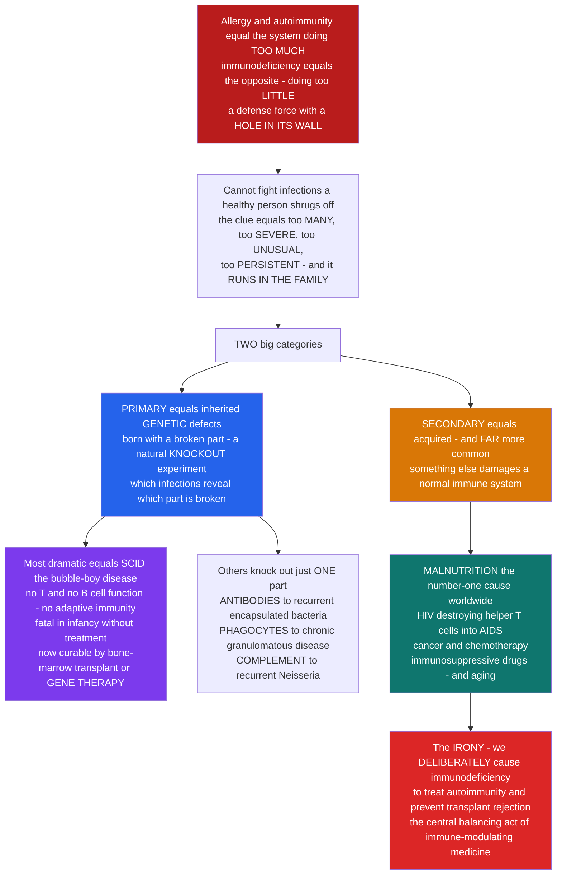

# 🛡️ Immunodeficiency Disorders

> [!abstract] TL;DR
> If **allergy** and **autoimmunity** are the immune system doing **too MUCH**, **immunodeficiency** is the mirror-image catastrophe — the immune system doing **too LITTLE**: a defense force with a **hole in its wall**. When a part of the system is missing or broken, the body can no longer fight off infections a healthy person shrugs off, producing infections that are **too many, too severe, too unusual, and too persistent** — the classic pattern doctors watch for (plus **"runs in the family"**). There are two categories. **PRIMARY** immunodeficiencies are inherited **genetic** defects — you are born with a broken component — and they act as **natural knockout experiments**: *which* infections you get tells you *which* part is broken. The most dramatic is **SCID** (Severe Combined Immunodeficiency), the **"bubble boy" disease**, where a single-gene defect wipes out **both T- and B-cell** function, leaving an infant with essentially **no adaptive immunity** — fatal without treatment, but now sometimes **curable by bone-marrow transplant or gene therapy** (ADA-SCID was one of gene therapy's first triumphs). Other primary defects knock out **antibodies** (recurrent encapsulated bacteria), **phagocytes** (chronic granulomatous disease), or **complement** (recurrent *Neisseria*). **SECONDARY (acquired)** immunodeficiencies are far more common and develop *during* life: **malnutrition** (the #1 cause worldwide), **HIV** (which destroys CD4+ helper T cells → **AIDS**), cancer and **chemotherapy**, deliberate **immunosuppressive drugs**, and **aging**. And there is a cruel irony threaded through immunology — **we deliberately induce immunodeficiency with drugs** to treat autoimmunity and prevent transplant rejection, accepting infection risk as the price. Immunodeficiency is the view *from the opposite direction*: understanding how the defenses fail is understanding what each part of the immune system is truly for. *Educational science content, not medical advice.*

---

## Intuition

**Analogy first — a defense force with a hole in its wall.** Picture a walled city with a full garrison. Allergy and autoimmunity are what happens when that garrison is **too aggressive** — firing on visiting merchants, or on the city's own citizens. Immunodeficiency is the **opposite disaster**: a **section of the wall is simply missing, or a whole unit of the garrison never showed up.** Raiders who would bounce harmlessly off an intact defense now stroll straight through the gap. In the body, those "raiders" are ordinary microbes — bacteria, viruses, fungi — that a healthy immune system would crush without you ever noticing. In a person with a hole in their defenses, the same microbes cause infections that are **too frequent, too severe, too strange (organisms healthy people never get sick from), and too stubborn to clear.** When a doctor sees that pattern — especially if it **runs in the family** — they suspect the wall itself is broken.

Here is the beautiful, ruthless logic of it. **Which** raiders get in tells you **exactly which** part of the wall is missing. If the missing piece is the **antibody** factory, the invaders that pour through are **encapsulated bacteria** — the ones antibody normally coats so phagocytes can eat them (pneumococcus, *Haemophilus*). If the missing piece is the **T-cell command**, then **viruses, fungi, and bizarre opportunists** run wild, because cell-mediated immunity is gone. If the **phagocytes** — the cells that eat and burn microbes — are broken, then **catalase-positive bacteria and fungi** that survive being eaten cause festering, granuloma-forming infections. If the very last stage of **complement** is missing, one weirdly specific bug keeps coming back: ***Neisseria***. This is why immunologists love primary immunodeficiencies: each one is a **natural knockout experiment**, a clean deletion of a single part that reveals precisely what that part was for. The whole immune system was mapped, in part, by studying children in whom one piece of it had failed.

The most dramatic hole of all is **SCID — Severe Combined Immunodeficiency, the "bubble boy" disease.** A single broken gene can knock out **both** the T-cell **and** the B-cell arms at once, so a baby is born with **essentially no adaptive immunity at all.** The most famous case lived his entire short life inside a sterile plastic **bubble**, because the open air was lethal. Untreated, SCID kills in infancy. And yet SCID is also one of medicine's great redemption stories: it can now be **cured** by a **bone-marrow (hematopoietic stem-cell) transplant** — or, in some forms, by **gene therapy**, in which a corrected copy of the broken gene is put back into the child's own cells. ADA-SCID was one of the **very first diseases ever cured by gene therapy.** That single condition contains the whole arc of this note: the deepest failure of the immune system, and one of the most futuristic ways of fixing it.

But the immunodeficiencies you are statistically *most* likely to meet are not the rare inherited ones — they are **acquired** during life, and they are **everywhere**. The **single largest cause of immunodeficiency on Earth is malnutrition.** The most famous is **HIV**, a virus that infects and destroys the very **CD4+ helper T cells** that act as the immune system's generals; as their numbers collapse, the whole adaptive response falls with them, and the result is **AIDS** — the archetype of acquired immunodeficiency. **Cancer and its chemotherapy**, which poisons dividing immune cells; **immunosuppressive drugs**, given on purpose; **aging** itself (immunosenescence) — all of these punch new holes in the wall. And this is where immunology's central irony lives: to treat autoimmunity and to stop the body rejecting a transplanted organ, doctors must **deliberately weaken the immune system** — deliberately creating a controlled immunodeficiency — and then spend the rest of the treatment managing the infections that slip through the gap they made. Doing too much and doing too little are not separate problems; they are the two ends of one dial that all of immunology is spent trying to balance.

---

## How It Works

### Core Mechanics

1. **Definition.** **Immunodeficiency** is impaired or absent immune function, producing **increased susceptibility to infection** — and, secondarily, to some **cancers** (lost immune surveillance) and even **autoimmunity/dysregulation** (lost regulatory control). The hallmark is not one infection but a **pattern**.
2. **The warning-sign pattern.** Suspect an immunodeficiency when infections are **too many, too severe, too unusual (opportunistic organisms a healthy person never gets), too persistent (poor response to standard treatment)**, and when there is a **family history**. This "**S-P-U-R**" pattern — Serious, Persistent, Unusual, Recurrent — is the clinical tripwire.
3. **The diagnostic logic — pattern localizes the defect.** Because each immune component defends against a characteristic **class of organism**, the **spectrum of infections points back to the broken part**. This is immunodeficiency as an *experiment of nature*: recurrent **encapsulated bacteria** → antibody/complement problem; **viruses/fungi/opportunists** → T-cell problem; **catalase-positive organisms + granulomas** → phagocyte problem; **recurrent *Neisseria*** → terminal-complement problem.
4. **Two great categories.** **PRIMARY** = **inherited/congenital**, mostly single-gene **inborn errors of immunity** (now >450 recognized genes), usually presenting in infancy/childhood. **SECONDARY (acquired)** = the immune system was normal but is **damaged during life** by something else — and these are **far more common**.
5. **Primary, classified by the arm affected.** *Adaptive — combined:* **SCID** (T− B±, absent adaptive immunity). *Adaptive — antibody/B-cell:* agammaglobulinemia, CVID, IgA deficiency. *Adaptive — T-cell:* DiGeorge (thymic aplasia). *Innate — phagocyte:* chronic granulomatous disease, LAD, neutropenia. *Innate — complement:* terminal-component and early-component deficiencies. *Innate — NK/interferon:* severe viral disease.
6. **Secondary, by cause.** **Malnutrition** (global #1), **HIV/AIDS** (destroys CD4 helper T cells), **cancer + chemotherapy/radiation**, **immunosuppressive drugs** (deliberate), **splenectomy/asplenia**, **diabetes and chronic disease**, **aging (immunosenescence)**, and **stress**.
7. **Management, in brief.** **Infection prophylaxis**, **immunoglobulin replacement (IVIG/SCIG)** for antibody defects, **hematopoietic stem-cell transplant** and **gene therapy** for SCID, **antiretroviral therapy (ART)** for HIV, and careful **vaccination** decisions (live vaccines are dangerous in severe T-cell defects).
8. **The therapeutic irony.** Immune-modulating medicine is a permanent **balancing act**: **deliberately inducing immunodeficiency** (immunosuppression) to control autoimmunity and transplant rejection, while holding the resulting **infection risk** in check.

### Flow / Architecture



---

## Key Concepts

### Secondary — the big picture

- **Immunodeficiency = the immune system doing too little.** A part is **missing or broken**, so germs a healthy person defeats without noticing cause **serious, repeated, strange, and stubborn infections**. It is the exact opposite of allergy and autoimmunity, where the system does **too much**.
- **The give-away pattern.** Doctors get suspicious when infections are **too many, too severe, too unusual, too persistent** — and especially when they **run in the family**.
- **Which germs get in tells you what is broken.** Missing **antibodies** → certain **bacteria** keep coming back. Missing **T cells** → **viruses, fungi, and rare bugs** run wild. Broken **eating cells (phagocytes)** → infections that **fester**. This is why studying these disorders taught us what each immune part is *for*.
- **Two kinds.** **Primary** = you are **born** with the defect (a genetic problem). **Secondary** = something **damages** a normal immune system later in life.
- **The most famous primary one is SCID — the "bubble boy" disease.** A baby is born with **almost no adaptive immune system** and cannot survive normal life; one famous child lived inside a **sterile plastic bubble**. It can now be **cured** with a bone-marrow transplant or **gene therapy**.
- **The most famous secondary one is HIV/AIDS.** The HIV virus kills the **helper T cells** that run the immune response; when enough are gone, the defenses collapse and ordinary germs become deadly — that collapse **is AIDS**. Worldwide, though, the biggest single cause of weak immunity is **malnutrition**.
- **The twist:** doctors sometimes **weaken the immune system on purpose** — with drugs — to calm autoimmune disease or to stop the body rejecting a transplanted organ, then work hard to keep infections out.

### Undergraduate — mechanisms and distinctions

- **Consequences of a failed immune system.** The dominant one is **recurrent/severe/opportunistic infection**, but immunodeficiency also raises risk of certain **malignancies** (especially virus-driven cancers, from lost surveillance) and paradoxically of **autoimmunity/immune dysregulation** (lost regulatory circuits) — because "immune function" includes *control*, not just attack.
- **Primary immunodeficiency — the map by arm.**

| Component broken | Example disorder(s) | Gene(s) | Infection signature |
|---|---|---|---|
| **Combined T + B** | **SCID** ("bubble boy") | **IL2RG** (X-linked), **ADA**, **RAG1/2**, **JAK3** | everything — viruses, fungi, opportunists; fatal in infancy |
| **Antibody / B-cell** | **X-linked agammaglobulinemia** (Bruton), **CVID**, **selective IgA def.**, **hyper-IgM** | **BTK**; **CD40L/AID** | recurrent **encapsulated bacteria** (pneumococcus, *Haemophilus*), gut/sinopulmonary |
| **T-cell** | **DiGeorge** (thymic aplasia, 22q11 deletion) | **TBX1** region | viruses, fungi, *Pneumocystis*; tetany/cardiac defects |
| **Phagocyte** | **Chronic granulomatous disease (CGD)**, **LAD**, **neutropenia** | **NADPH oxidase (CYBB…)**; **ITGB2/CD18** | **catalase-positive** bacteria + fungi; abscesses, **granulomas** |
| **Complement** | **terminal (C5–C9/MAC) def.**; **early (C1–C4) def.** | complement genes | recurrent ***Neisseria*** (MAC); **SLE-like autoimmunity** (early) |
| **NK / interferon** | NK deficiency; IFN-pathway defects (**Mendelian susceptibility to mycobacterial disease**) | *STAT1*, *IFNGR*, etc. | severe **viral** (herpesviruses) and **mycobacterial** disease |

- **SCID in depth — "combined" means both arms.** Many genetic routes converge on the same catastrophe: **IL2RG** (common γ-chain, X-linked, the most common form — blocks multiple cytokine receptors), **ADA deficiency** (toxic metabolites kill lymphocytes), and **RAG1/RAG2** mutations (no **V(D)J recombination** → no antigen receptors). All produce an infant with absent, non-functional T cells (and often absent B/NK), lethal without reconstitution. **Newborn screening** (the **TREC assay**, counting T-cell-receptor excision circles) now catches SCID before infections start — a public-health triumph.
- **Antibody defects and IVIG.** With B-cell/antibody failure, patients lose **opsonization and neutralization** of encapsulated organisms; the mainstay is **immunoglobulin replacement (IVIG/SCIG)** — pooled donor **IgG** that substitutes for the antibody they cannot make.
- **Secondary immunodeficiency — the common world.** **Malnutrition** (protein-energy and micronutrient deficiency) is the **leading global cause**, impairing lymphocyte production and barrier integrity. **HIV** selectively infects **CD4+ helper T cells** via CD4 + a chemokine co-receptor, depleting the immune "generals" until adaptive immunity collapses. **Chemotherapy/radiation** kills dividing precursors (neutropenia, lymphopenia). **Immunosuppressive drugs** (steroids, calcineurin inhibitors, biologics) are given *deliberately*. **Asplenia** removes a key filter for encapsulated bacteria. **Aging (immunosenescence)** and **chronic disease/diabetes** erode function gradually.
- **HIV → AIDS, quantified by the CD4 count.** Clinicians **stage HIV by counting CD4 cells**. As the count falls, characteristic **opportunistic infections** appear at threshold levels — *Pneumocystis* pneumonia and others below ~**200 cells/µL** (the CD4 count that clinically defines **AIDS**), and still rarer opportunists below ~50. **ART** (antiretroviral therapy) suppresses viral replication and allows **immune reconstitution** — CD4 counts recover.
- **The therapeutic irony, mechanistically.** Every immunosuppressant that controls autoimmunity or protects a graft **creates a secondary immunodeficiency by design**; the art is titrating enough suppression to stop the unwanted response while leaving enough defense to survive infection — the central trade-off of transplantation and autoimmune medicine.

### Graduate — depth and consequences

- **Inborn errors of immunity as a genetic atlas.** The **IUIS classification** now catalogues **>450 monogenic** inborn errors of immunity, and the field increasingly frames "primary immunodeficiency" as one face of a broader spectrum that also includes **autoinflammation**, **autoimmunity**, **allergy**, and **malignancy** — because the same regulatory genes that, when lost, cause infection can, when dysregulated, cause the immune system to over-react. Loss-of-function reveals a component's *protective* role; the same locus often reveals its *regulatory* role too (e.g., early-complement deficiency → **SLE**; certain gene defects → both infection *and* autoimmunity).
- **SCID genetics and the reconstitution toolbox.** Genotype shapes phenotype and therapy: **X-linked IL2RG** and **JAK3** defects give a **T− B+ NK−** SCID (signaling failure); **RAG1/2** give **T− B− NK+** (recombination failure — the direct link to **V(D)J recombination**); **ADA** gives **T− B− NK−** (metabolic toxicity, and uniquely, treatable with **PEG-ADA enzyme replacement**). Curative options: **allogeneic HSCT** (best with an HLA-matched donor) and **gene therapy** — autologous stem cells transduced *ex vivo* with a corrected gene. **ADA-SCID and X-linked SCID** are landmark gene-therapy successes; early retroviral vectors caused **insertional-mutagenesis leukemias**, driving the shift to safer **self-inactivating lentiviral vectors** — a cautionary and instructive arc for the whole field.
- **Infection signatures as functional readouts.** The mapping *defect → organism* is mechanistic, not arbitrary: **antibody** opsonizes/neutralizes **encapsulated** bacteria, so its loss lets those through; **T-cell/IFN-γ–macrophage** axis controls **intracellular** pathogens (mycobacteria, *Pneumocystis*, viruses), so its loss unleashes them; the **phagocyte respiratory burst (NADPH oxidase)** kills **catalase-positive** organisms that neutralize host peroxide, so **CGD** presents with exactly those; the **membrane-attack complex** lyses **Neisseria**, so terminal-complement deficiency yields recurrent meningococcal/gonococcal disease. The pattern is a bedside functional assay.
- **HIV immunopathogenesis.** HIV's **gp120** binds **CD4** plus a chemokine co-receptor (**CCR5** or **CXCR4**), targeting helper T cells; depletion proceeds through direct cytopathic killing, immune clearance of infected cells, pyroptosis of bystander cells, and chronic **immune activation**. Because CD4 help underlies CTL priming, B-cell help, and macrophage activation simultaneously, its loss produces the **broad** opportunistic-infection and malignancy spectrum (Kaposi sarcoma, lymphomas) that defines **AIDS**. The **CCR5-Δ32** natural resistance allele inspired **CCR5-targeted** strategies, and the (rare) sterilizing cures via **CCR5-Δ32 stem-cell transplants** are proofs of concept.
- **Immunosenescence.** Aging remodels immunity: **thymic involution** shrinks naive T-cell output, the repertoire narrows, responses to **new** antigens and **vaccines** weaken, and a low-grade sterile **"inflammaging"** rises — explaining elevated infection/severity and blunted vaccine responses in the elderly, and motivating high-dose/adjuvanted geriatric vaccines.
- **Management nuances.** **Live vaccines are contraindicated** in severe T-cell deficiency (risk of vaccine-strain disease — e.g., disseminated BCG or vaccine-derived polio). Antibody-deficient patients need **IVIG** (not vaccines, which they cannot respond to). SCID must avoid **non-irradiated cellular blood products** and **breast-milk CMV** exposure, and requires **infection prophylaxis** pending reconstitution. Asplenic patients need **anti-encapsulated vaccination + prophylaxis**.
- **The immunosuppression trade-off, formalized.** Transplant and autoimmune regimens deliberately create a **secondary immunodeficiency** and then defend against its consequences with **prophylaxis** (e.g., anti-*Pneumocystis*, antiviral) and **therapeutic drug monitoring**. The clinician is continuously solving a two-sided optimization: minimize **rejection/autoimmune activity** on one side and **opportunistic infection/malignancy** on the other — the quantitative embodiment of "too much vs too little."
- **Why the mirror matters.** Immunodeficiency completes the picture drawn by the rest of this vault. Hypersensitivity and autoimmunity show the immune system's **gain turned up**; immunodeficiency shows it **turned down** or **deleted**. Read together, they define the healthy immune system as a **regulated set-point**, and they explain why so much of modern immunotherapy — from checkpoint blockade to Treg therapy to immunosuppression to gene-corrected stem cells — is fundamentally about **moving that set-point in a controlled way**.

---

## Python Demo

```python
# Immunodeficiency Disorders, quantified two ways:
#   (1) DEFECT-to-INFECTION MAP (the "knockout" readout): model each primary
#       immunodeficiency as a clean deletion of one immune component, and map it
#       to the CLASS of infection that results. The heatmap's near-diagonal
#       structure is the whole diagnostic logic: the PATTERN of infections
#       localizes the broken part (antibody -> encapsulated bacteria;
#       T-cell/SCID -> viruses/fungi/opportunists; phagocyte -> catalase-positive;
#       complement -> Neisseria; NK/IFN -> severe viral/mycobacterial).
#   (2) HIV -> AIDS natural history + IMMUNE RECONSTITUTION: the archetypal
#       ACQUIRED immunodeficiency. CD4+ helper T cells decline over years while
#       viral load sets in; opportunistic-infection risk rises sharply below the
#       ~200 cells/uL AIDS threshold; then ART (or, for SCID, gene therapy/HSCT)
#       drives immune reconstitution and CD4 recovery.
import numpy as np
import matplotlib.pyplot as plt

fig, ax = plt.subplots(2, 2, figsize=(14, 10))

# ---- (1) DEFECT -> INFECTION susceptibility matrix (the knockout readout) ----
defects = ["Antibody /\nB-cell", "T-cell /\nSCID", "Phagocyte", "Complement", "NK /\ninterferon"]
infections = ["Encapsulated\nbacteria", "Viruses", "Fungi /\nopportunists",
              "Catalase-pos\norganisms", "Neisseria", "Intracellular\nbacteria"]
#  rows = broken component, cols = infection class, entries = susceptibility 0..1
S = np.array([
    [1.00, 0.20, 0.10, 0.10, 0.40, 0.10],   # Antibody / B-cell
    [0.55, 1.00, 0.95, 0.35, 0.20, 0.90],   # T-cell / SCID (combined -> broad)
    [0.45, 0.10, 0.85, 1.00, 0.10, 0.55],   # Phagocyte (CGD)
    [0.60, 0.10, 0.10, 0.10, 1.00, 0.20],   # Complement (terminal -> Neisseria)
    [0.10, 1.00, 0.25, 0.10, 0.10, 0.55],   # NK / interferon
])
im = ax[0, 0].imshow(S, cmap="magma", aspect="auto", vmin=0, vmax=1)
ax[0, 0].set_xticks(range(len(infections))); ax[0, 0].set_xticklabels(infections, fontsize=7)
ax[0, 0].set_yticks(range(len(defects)));    ax[0, 0].set_yticklabels(defects, fontsize=8)
for i in range(S.shape[0]):
    for j in range(S.shape[1]):
        ax[0, 0].text(j, i, f"{S[i, j]:.1f}", ha="center", va="center",
                      color="white" if S[i, j] < 0.6 else "black", fontsize=7)
ax[0, 0].set_title("(1) DEFECT-to-INFECTION MAP\nthe pattern of infection localizes the broken part")
fig.colorbar(im, ax=ax[0, 0], fraction=0.046, pad=0.04, label="susceptibility")

# ---- (2) HIV -> AIDS natural history: CD4 decline + viral load ----
t = np.linspace(0, 11, 500)                              # years since infection
# CD4 helper T cells: acute dip, partial recovery, then relentless decline
cd4 = 900.0 - 70.0 * t - 320.0 * np.exp(-((t - 0.3) / 0.16) ** 2)
cd4 = np.clip(cd4, 20, None)
# viral load (log10 copies/mL): acute spike -> setpoint -> slow late rise
vl = 4.4 + 2.6 * np.exp(-((t - 0.3) / 0.18) ** 2) + 0.13 * t
ax2b = ax[0, 1].twinx()
l1, = ax[0, 1].plot(t, cd4, color="#2563eb", lw=2.6, label="CD4+ helper T cells")
l2, = ax2b.plot(t, vl, color="#b91c1c", lw=2.0, ls="--", label="viral load (log10)")
ax[0, 1].axhline(200, color="#d97706", lw=1.6, ls=":")
ax[0, 1].axhspan(0, 200, color="#dc2626", alpha=0.07)
ax[0, 1].text(6.2, 235, "AIDS threshold ~200 cells/uL", color="#b45309", fontsize=8)
ax[0, 1].text(7.5, 90, "AIDS zone\n(opportunistic infections)", color="#b91c1c", fontsize=8)
ax[0, 1].set_xlabel("years since HIV infection")
ax[0, 1].set_ylabel("CD4 count (cells/uL)", color="#2563eb")
ax2b.set_ylabel("HIV RNA (log10 copies/mL)", color="#b91c1c")
ax[0, 1].set_ylim(0, 950)
ax[0, 1].set_title("(2) HIV -> AIDS: helper-T-cell collapse\nthe archetypal ACQUIRED immunodeficiency")
ax[0, 1].legend(handles=[l1, l2], fontsize=8, loc="upper right")

# ---- (3) Opportunistic-infection risk vs CD4 count (threshold effect) ----
cd4_axis = np.linspace(0, 800, 400)
risk = 1.0 / (1.0 + np.exp((cd4_axis - 200.0) / 45.0))   # rises steeply below 200
ax[1, 0].plot(cd4_axis, risk, color="#7c3aed", lw=2.8)
ax[1, 0].axvline(200, color="#d97706", lw=1.6, ls=":")
ax[1, 0].axvline(50, color="#b91c1c", lw=1.4, ls=":")
ax[1, 0].fill_between(cd4_axis, 0, risk, where=(cd4_axis < 200), color="#dc2626", alpha=0.10)
ax[1, 0].text(210, 0.55, "PCP, opportunists\nbelow ~200", color="#b45309", fontsize=8)
ax[1, 0].text(55, 0.90, "MAC, CMV\nbelow ~50", color="#b91c1c", fontsize=8)
ax[1, 0].set_xlabel("CD4 count (cells/uL)")
ax[1, 0].set_ylabel("opportunistic-infection risk")
ax[1, 0].set_title("(3) THRESHOLD EFFECT\nrisk rises sharply as helper T cells fall")
ax[1, 0].set_ylim(0, 1.02)
ax[1, 0].invert_xaxis()                                   # decline reads left-to-right
ax[1, 0].grid(alpha=0.3)

# ---- (4) IMMUNE RECONSTITUTION: recovery after treatment ----
tr = np.linspace(0, 4, 400)                               # years on therapy
cd4_art = 150.0 + 380.0 * (1.0 - np.exp(-tr / 0.9))       # HIV: ART restores CD4
scid = 100.0 * (1.0 - np.exp(-tr / 0.55))                 # SCID: % normal T cells
ax4b = ax[1, 1].twinx()
m1, = ax[1, 1].plot(tr, cd4_art, color="#059669", lw=2.6,
                    label="HIV: CD4 recovery on ART")
m2, = ax4b.plot(tr, scid, color="#0369a1", lw=2.4, ls="--",
                label="SCID: T-cell recovery after gene therapy / HSCT")
ax[1, 1].axhline(500, color="#059669", lw=1.0, ls=":")
ax[1, 1].text(1.4, 515, "normal-range floor ~500", color="#047857", fontsize=8)
ax[1, 1].set_xlabel("years since treatment start")
ax[1, 1].set_ylabel("CD4 count (cells/uL)", color="#059669")
ax4b.set_ylabel("SCID T cells (% of normal)", color="#0369a1")
ax[1, 1].set_ylim(0, 600)
ax4b.set_ylim(0, 105)
ax[1, 1].set_title("(4) IMMUNE RECONSTITUTION\nrebuilding the wall: ART, gene therapy, transplant")
ax[1, 1].legend(handles=[m1, m2], fontsize=8, loc="lower right")

plt.tight_layout()
plt.savefig("immunodeficiency_disorders.png", dpi=130)

# ---- quantify the lessons ----
for i, d in enumerate(["Antibody", "T-cell/SCID", "Phagocyte", "Complement", "NK/IFN"]):
    j = int(np.argmax(S[i]))
    print(f"(1) Defect {d:12s} -> top susceptibility: "
          f"{infections[j].replace(chr(10), ' ')}  (score {S[i, j]:.2f})")
i_aids = np.argmax(cd4 < 200)
print(f"(2) CD4 falls below the AIDS threshold (200) at ~{t[i_aids]:.1f} years "
      f"post-infection.")
print(f"(3) Opportunistic-infection risk at CD4=500: {1/(1+np.exp((500-200)/45)):.2f}; "
      f"at CD4=100: {1/(1+np.exp((100-200)/45)):.2f} -> a steep threshold near 200.")
print(f"(4) On ART, CD4 recovers from 150 toward ~{cd4_art[-1]:.0f} cells/uL; "
      f"SCID T cells reconstitute to ~{scid[-1]:.0f}% of normal after gene therapy/HSCT.")
```

**What the plots show.** Panel **(1)** is immunodeficiency as a **knockout readout**: each broken component lights up a **characteristic column** of infections — antibody loss → **encapsulated bacteria**, T-cell/SCID loss → **viruses, fungi, and opportunists** (a broad row, because "combined" hits everything), phagocyte loss → **catalase-positive** organisms, complement loss → ***Neisseria***. The near-diagonal structure *is* the diagnostic logic: the **pattern of infection localizes the defect**. Panel **(2)** is the archetypal **acquired** immunodeficiency — HIV — with **CD4+ helper T cells** declining over years while viral load persists; crossing the **~200 cells/µL** line marks **AIDS**. Panel **(3)** makes the **threshold** explicit: opportunistic-infection risk stays low while helper T cells are plentiful and then **rises steeply** as the count falls below ~200 (and again below ~50), which is exactly why clinicians stage HIV by the **CD4 count**. Panel **(4)** is the hopeful mirror image — **immune reconstitution**: **ART** restores CD4 counts in HIV, and **gene therapy or stem-cell transplant** rebuilds T cells from near-zero in **SCID** — the wall being repaired.

---

## Real-World Applications

> **Newborn screening for SCID (the TREC assay).** Because untreated SCID is fatal but curable *if caught before infections start*, most high-income countries now screen every newborn's dried blood spot for **T-cell-receptor excision circles (TRECs)** — a marker of new T-cell output. A near-absent TREC count flags SCID in the first days of life, enabling **transplant or gene therapy** before the first serious infection. It is one of immunology's clearest public-health wins, built directly on understanding what SCID deletes (see [[Generation_of_Receptor_Diversity_VDJ_Recombination]]).

> **Gene therapy for ADA-SCID and X-linked SCID.** Correcting a child's own hematopoietic stem cells *ex vivo* with a working copy of the broken gene turned a lethal diagnosis into a curable one — among the first human diseases ever cured by gene therapy. Early vectors caused **insertional-mutagenesis leukemias**, driving the field to safer **self-inactivating lentiviral vectors**; the SCID story shaped modern gene-therapy safety practice (see [[Gene_Therapy_and_CRISPR]]).

> **Antiretroviral therapy and the CD4 count.** HIV medicine is organized around the **CD4 count** and **viral load**: ART suppresses viral replication, CD4 counts recover (**immune reconstitution**), and patients avoid the opportunistic-infection threshold. Prophylaxis (e.g., anti-*Pneumocystis*) is added below CD4 ~200 — a direct clinical application of the threshold curve above (see [[Helper_T_Cells_and_T_Cell_Subsets]]).

> **Immunoglobulin (IVIG/SCIG) replacement.** For antibody-deficiency disorders (agammaglobulinemia, CVID, hyper-IgM), pooled donor **IgG** is infused to substitute for antibody the patient cannot make — restoring opsonization and neutralization against encapsulated bacteria. It is lifelong "borrowed immunity" that turns a once-lethal condition into a managed one (see [[Antibody_Structure_and_Function]]).

> **Chronic granulomatous disease and the burst test.** Children with **NADPH-oxidase** mutations cannot mount a respiratory burst, so catalase-positive organisms survive being eaten, causing recurrent abscesses and granulomas. The diagnosis is made with a **dihydrorhodamine (DHR)** flow assay that measures the missing oxidative burst — the phagocyte defect made visible (see [[Phagocytes_and_Phagocytosis]]).

> **Deliberate immunosuppression in transplantation and autoimmunity.** Calcineurin inhibitors, steroids, antiproliferatives, and biologics create a **controlled secondary immunodeficiency** to prevent graft rejection or calm autoimmune disease — paired with **infection prophylaxis** and drug monitoring. This is the therapeutic irony in daily clinical practice: inducing "too little" to fix "too much."

---

## Common Pitfalls

- **Diagnosing on a single infection instead of a pattern.** Everyone gets infections; immunodeficiency is suggested by the **pattern** — too many, too severe, too unusual, too persistent, plus family history. Chasing one ordinary infection misses the forest; missing the pattern delays a life-saving diagnosis (especially in SCID, where time is measured in weeks).
- **Forgetting that the infection type points to the defect.** Recurrent ***Neisseria*** is a complement work-up, not a random coincidence; catalase-positive abscesses point to **phagocytes (CGD)**; opportunistic viruses/fungi point to **T cells**. Ordering a blanket "immune panel" without reading the infection signature wastes the single most informative clue.
- **Thinking primary immunodeficiency is common and secondary is rare.** It is the reverse: **secondary (acquired)** immunodeficiency — malnutrition, HIV, chemotherapy, immunosuppressants, aging — is **far more common** than the inherited disorders. Globally, **malnutrition** is the number-one cause.
- **Assuming "SCID" is one disease.** SCID is a **shared phenotype** with many genetic causes (IL2RG, ADA, RAG1/2, JAK3, and more), and the genotype dictates the cell pattern (T− B±, NK±) and the best therapy (HSCT, gene therapy, or PEG-ADA). "One disease, one fix" is wrong.
- **Giving live vaccines to severely immunodeficient patients.** In severe T-cell defects, **live** vaccines (BCG, oral polio, MMR, varicella) can cause **disseminated vaccine-strain disease**. This is a critical, and preventable, iatrogenic harm — screen before vaccinating infants at risk.
- **Reading immunosuppression as an accident rather than a design.** In transplant and autoimmune care we **intend** to create immunodeficiency; the resulting infections are an anticipated trade-off managed with prophylaxis — not a treatment failure. Framing it as "the drug isn't working" misunderstands the goal.
- **Ignoring the non-infectious consequences.** Immunodeficiency also raises risk of certain **cancers** (lost surveillance, e.g., virus-driven malignancies) and, for some defects, **autoimmunity/dysregulation** (lost regulation). Equating "immunodeficiency" with "infections only" misses half the picture.
- **Confusing HIV with AIDS.** **HIV** is the infection; **AIDS** is the late stage defined by profound CD4 depletion (below ~200) and opportunistic disease. With effective ART, an HIV-positive person may **never** progress to AIDS — the collapse is preventable, not inevitable.

---

## Related Concepts

- [[Generation_of_Receptor_Diversity_VDJ_Recombination]] — **RAG1/RAG2** mutations abolish **V(D)J recombination**, so no antigen receptors form: a direct molecular cause of **SCID**, and the reason antibody/TCR diversity is a single point of failure.
- [[Helper_T_Cells_and_T_Cell_Subsets]] — **HIV** destroys exactly these **CD4+ helper** cells; their collapse removes help for CTLs, B cells, and macrophages at once — the mechanism of **AIDS**.
- [[Phagocytes_and_Phagocytosis]] — **chronic granulomatous disease** breaks the phagocyte **respiratory burst (NADPH oxidase)**, letting catalase-positive organisms survive being eaten.
- [[The_Complement_System]] — **terminal-component (MAC) deficiency** yields recurrent ***Neisseria***; **early-component** deficiency yields **SLE-like** autoimmunity — complement failure as an infection signature.
- [[Interferons_and_Antiviral_Defense]] — defects in the **interferon/STAT1** axis cause severe **viral** and **mycobacterial** disease (Mendelian susceptibility to mycobacterial disease).
- [[Natural_Killer_Cells_and_Innate_Lymphoid_Cells]] — **NK-cell deficiency** produces severe **herpesvirus** disease, showing the innate-lymphoid contribution to antiviral defense.
- [[T_Cell_Development_and_Thymic_Selection]] — **DiGeorge syndrome** (thymic aplasia) is a T-cell immunodeficiency of failed thymic development — the "factory," not the gene, is missing.
- [[Antibody_Structure_and_Function]] — antibody/B-cell defects lose **opsonization and neutralization** of encapsulated bacteria; **IVIG** replaces the missing IgG.
- [[Innate_versus_Adaptive_Immunity]] — immunodeficiencies are classified by **which arm** fails; combined defects (SCID) hit the adaptive arm wholesale, phagocyte/complement defects hit the innate arm.
- [[Cells_of_the_Immune_System]] — the roster of cells any one of which can be **missing or broken**, and whose absence defines each disorder.
- [[Hypersensitivity_Allergy_and_Immunodeficiency]] — the Clinical_Medicine companion pairing allergy (too much) with immunodeficiency (too little) — the same mirror this note draws.
- [[Infectious_Disease_and_Host_Pathogen_Interaction]] — the host-defense/pathogen framework immunodeficiency exposes: remove a defense, and the corresponding pathogen wins.
- [[The_Adaptive_Immune_System]] — the Biology/11 overview of the B/T-cell system whose **loss** (SCID, HIV) this note characterizes from the failure side.
- [[Viruses]] — the virology behind **HIV**, the archetypal acquired immunodeficiency, and the herpes/opportunistic viruses that exploit T-cell loss.
- [[Gene_Therapy_and_CRISPR]] — the technology that **cures** ADA-SCID and X-linked SCID by correcting the patient's own stem cells — one of gene therapy's first triumphs.
- [[Mendelian_Genetic_Disorders]] — primary immunodeficiencies are largely **single-gene (Mendelian)** inborn errors, inherited exactly as this note's genetics describe.

*Siblings in this section (05 — Immune System in Disease), referenced in prose until written: **Hypersensitivity and Allergy** (the immune system doing too much via misdirected effector responses), **Autoimmunity and Loss of Tolerance** (attacking self — the other "too much" failure), **Transplantation Immunology and Rejection** (where immunodeficiency is deliberately induced to protect a graft), and **Immunoengineering and CAR-T Cells** (the engineered end of the same reconstitution/repair story as SCID gene therapy).*

---

## Review Questions

**Secondary.** Using the "defense force with a hole in its wall" picture, explain how immunodeficiency differs from allergy and autoimmunity. What four features of a person's infections make a doctor suspect their immune system is broken? Explain what **SCID** ("bubble boy" disease") is, why it is so dangerous, and one way it can now be cured. Finally, name the world's most common *acquired* cause of weak immunity, and the virus that causes **AIDS** by killing helper T cells.

**Undergraduate.** A patient presents with recurrent infections. (a) For each of these infection patterns, state which immune component is most likely defective: recurrent **encapsulated bacteria**; recurrent ***Neisseria***; **catalase-positive** abscesses with granulomas; disseminated **viruses/fungi/opportunists** from infancy. (b) Explain *why* SCID is called "combined," name two distinct genetic causes, and state how it is detected in newborns. (c) Distinguish **primary** from **secondary** immunodeficiency and give three examples of each.

**Graduate.** (a) Explain, mechanistically, why the *spectrum of infections* localizes the defective immune component — walk through the antibody, T-cell/IFN-γ, phagocyte-oxidase, and terminal-complement cases. (b) Trace HIV immunopathogenesis from **gp120–CD4/co-receptor** binding to the broad opportunistic-infection spectrum of AIDS, and explain why the **CD4 count** stages disease and why risk is a **threshold** rather than linear function of that count. (c) Discuss the "therapeutic irony": why do transplantation and autoimmune therapy *deliberately induce* a secondary immunodeficiency, what two-sided optimization does the clinician then solve, and how do **gene therapy for SCID** and **ART for HIV** represent the reconstitution side of the same balance?

---

## Sources

- Murphy, K. & Weaver, C. — *Janeway's Immunobiology*, 9th/10th ed. (Garland Science / W. W. Norton). Ch. 13: Failures of host defense mechanisms — inherited and acquired immunodeficiencies, and HIV/AIDS.
- Notarangelo, L. D. — "Primary immunodeficiencies." *Journal of Allergy and Clinical Immunology* 125(2 Suppl 2):S182–S194 (2010). https://doi.org/10.1016/j.jaci.2009.07.053
- Fischer, A., Hacein-Bey-Abina, S. & Cavazzana-Calvo, M. — "Gene therapy for severe combined immunodeficiencies and beyond." *Journal of Experimental Medicine* 217(2):e20190607 (2020). https://doi.org/10.1084/jem.20190607
- Deeks, S. G., Overbaugh, J., Phillips, A. & Buchbinder, S. — "HIV infection." *Nature Reviews Disease Primers* 1:15035 (2015). https://doi.org/10.1038/nrdp.2015.35
- Tangye, S. G. et al. (IUIS Expert Committee) — "Human inborn errors of immunity: 2022 update on the classification from the IUIS." *Journal of Clinical Immunology* 42:1473–1507 (2022). https://doi.org/10.1007/s10875-022-01289-3

---

#immunology #immunodeficiency #scid #hiv-aids #primary-immunodeficiency
