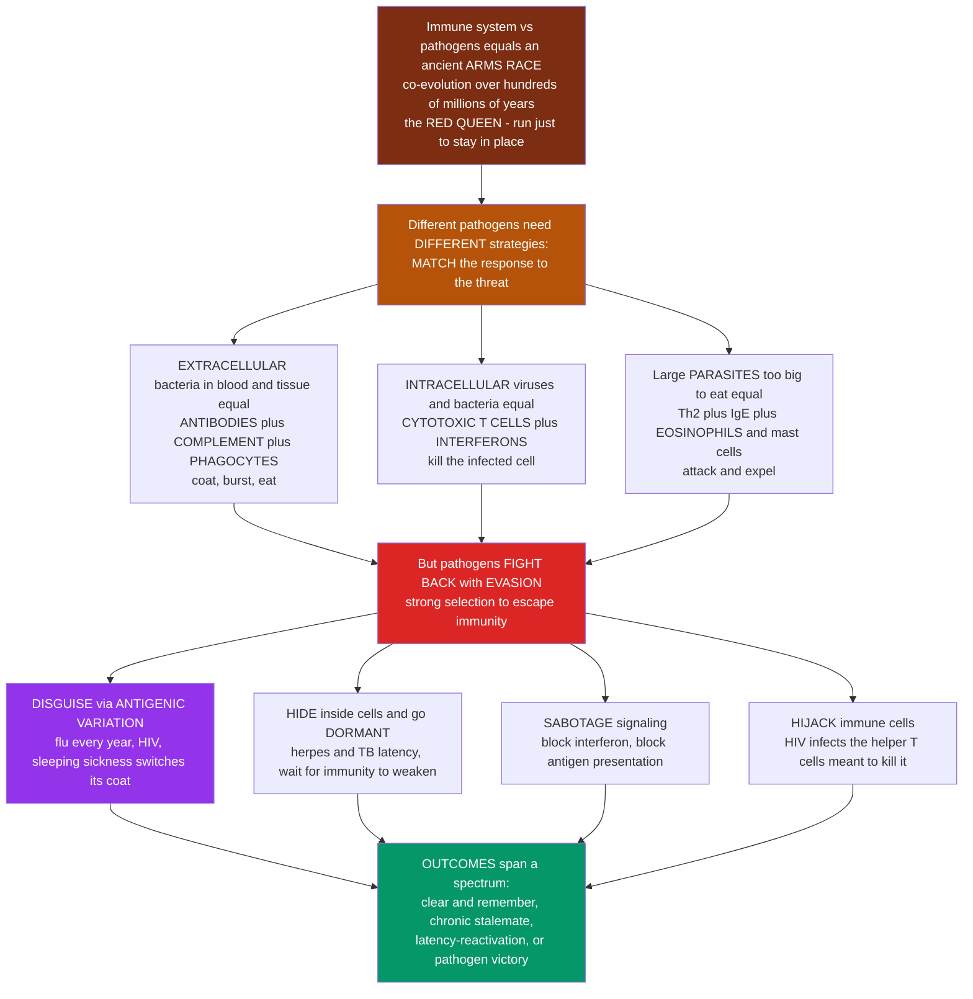

# ⚔️ Infection and Host-Pathogen Immune Strategies

> [!abstract] TL;DR
> The relationship between your immune system and the microbes that infect you is not a static shield but an **ancient evolutionary arms race** — a co-evolutionary battle running for hundreds of millions of years, in which each side endlessly evolves new weapons and the other new defenses. This is the **Red Queen** race: both sides must keep running just to stay in place. Two big ideas organize the whole subject. First, **the immune system matches its strategy to the threat**: against **extracellular bacteria** living in blood and tissue it deploys **antibodies, complement, and phagocytes** (coat them, burst them, eat them); against pathogens **hiding inside cells** — viruses and intracellular bacteria — antibodies are useless, so it unleashes **cytotoxic T cells and interferons** to kill the infected cell; against large **parasitic worms** too big to phagocytose, it uses a specialized **Th2 / IgE / eosinophil / mast-cell** response to attack and expel them. Second, **pathogens fight back** with a dazzling arsenal of **evasion tactics**, because escaping immunity carries enormous fitness reward. Some **disguise** themselves by constantly changing surface molecules (**antigenic variation** — why you catch a new flu each year, why HIV resists a vaccine, how sleeping-sickness trypanosomes endlessly switch their coat). Others **hide** inside cells or immune-privileged sites and go **dormant** (herpes and TB **latency**, waiting for immunity to weaken), actively **sabotage** immune signaling (viral proteins that block interferon or antigen presentation), or even **hijack the immune cells themselves** (HIV infecting the very helper T cells meant to coordinate its destruction). Understanding these strategies explains the whole range of outcomes — infections we clear and remember forever, ones that smolder chronically, and ones that outwit us entirely — and it is the living evolutionary context for every other topic in this vault.

---

## Intuition

**Analogy first — an ancient arms race where both armies must keep re-inventing their weapons.**

Imagine two rival empires that have been at war not for years but for **hundreds of millions of years**. Every time one empire invents a new weapon, the other is under crushing pressure to invent a defense — and every new defense pressures the first empire to invent a better weapon. Neither side ever "wins" permanently; the war itself is the permanent condition. Biologists call this the **Red Queen** effect, after the character in *Through the Looking-Glass* who tells Alice, "it takes all the running you can do, to keep in the same place." Your immune system and the world's pathogens are exactly these two empires. The staggering diversity and complexity of immunity — antibodies, T cells, complement, interferons, an entire hyper-variable recognition system — exists **because** pathogens are relentlessly clever adversaries, and the staggering cleverness of pathogens exists **because** immunity is a relentless killer. Each side is the reason the other is so elaborate.

Now, a good general does not fight every enemy the same way, and neither does the immune system. Think of **three completely different kinds of invader**, each demanding a different battle plan. A bacterium swimming in your blood and tissue fluid is an enemy **out in the open field** — so you use ranged and area weapons: **antibodies** that coat it like paint marking a target, **complement** proteins that punch holes and burst it, and **phagocytes** that march up and eat it. A virus is a **saboteur who has slipped inside one of your own buildings** (a cell) and locked the door — your field weapons are useless because the enemy is now hidden behind your own walls, so you switch tactics entirely: **cytotoxic T cells** that inspect buildings and demolish any that have been infiltrated, and **interferons** that warn the whole block to go "fireproof." A parasitic worm is a **siege engine too enormous to eat** — so you deploy a special anti-siege response (**Th2, IgE, eosinophils, mast cells**) that coats it in caustic chemicals and floods the area to physically flush it out. Matching the response to the threat is the whole art of immunity; a mismatched response either fails to clear the infection or, worse, tears up the host's own territory.

But here is what makes the war endless: **the pathogens fight back, and they are brilliant at it.** Because any mutant microbe that escapes immunity leaves vastly more descendants, evolution has equipped pathogens with an astonishing playbook of evasion. Some are **masters of disguise** — they continuously change the surface molecules the immune system learned to recognize, so your hard-won immunity is always aimed at *last season's* uniform. This is **antigenic variation**, and it is why you catch a fresh strain of influenza every winter despite being immune to last year's, why HIV mutates its coat faster than antibodies can pin it down, and how the African sleeping-sickness parasite switches to an entirely new surface coat wave after wave, staying one step ahead until it kills its host. Others don't disguise — they **hide**: they live inside your cells, retreat to sites the immune system barely patrols, or go **dormant** for years (herpesviruses and tuberculosis lie latent, silently waiting for the day your immunity dips — from age, stress, or another illness — to erupt again). Others **sabotage the alarm system directly**, manufacturing proteins that jam interferon signaling or shut down the display of antigens on infected cells so cytotoxic T cells go blind. And in the most audacious move of all, some pathogens **hijack the immune cells themselves** — HIV infects and destroys the very helper T cells that are supposed to orchestrate its elimination, turning the command center into a factory for the enemy. To understand host-pathogen immune strategies is to see immunity for what it truly is: not a wall, but a **dynamic, unfinished, co-evolutionary battle** — which is precisely why some infections we clear and remember for life, others settle into an uneasy chronic stalemate, and a few outmaneuver us completely.

---

## How It Works

### Core Mechanics

1. **Immunity is a co-evolutionary arms race, not a fixed defense.** Host and pathogen are locked in **reciprocal adaptation**: a pathogen adaptation that escapes immunity spreads because it raises pathogen fitness, which selects for a host adaptation that re-recognizes it, which selects for a new escape, and so on. This is the **Red Queen dynamic** — perpetual change with no stable endpoint. It is the deep evolutionary reason the immune system is so elaborate and so diverse, and it drives ongoing diversification on *both* sides (host recognition genes and pathogen surface molecules alike).

2. **Strategy is matched to the pathogen's niche and lifestyle.** The single most useful organizing principle in infection immunology is that **where a pathogen lives dictates which weapons work.** The effector arm that clears an extracellular bacterium is powerless against a virus replicating in the cytosol, and vice versa. The immune system therefore reads cues about the threat (its molecular patterns, its location, the cytokines dendritic cells release) and commits to one of a few broad **effector programs**.

3. **Program 1 — extracellular bacteria and toxins → antibodies, complement, phagocytes.** Pathogens in blood, tissue fluid, and mucosal surfaces are accessible to soluble and cellular weapons. **Antibodies** neutralize toxins and adhesins and **opsonize** microbes (tag them for eating); **complement** opsonizes, recruits inflammation, and directly lyses some bacteria with the membrane-attack complex; **neutrophils and macrophages** phagocytose the opsonized targets. Helper cues here favor **Th17** (mucosal neutrophil recruitment, antimicrobial peptides) and antibody-promoting help. The mantra: **coat, burst, eat.**

4. **Program 2 — intracellular pathogens (viruses, intracellular bacteria like *Mycobacterium* and *Listeria*, some protozoa) → cytotoxic T cells, Th1/macrophage activation, NK cells, interferons.** Once a pathogen is inside a host cell, antibodies cannot reach it. The system pivots to **cell-mediated** and **cell-intrinsic** defense: **CD8 cytotoxic T lymphocytes** recognize pathogen peptides on MHC class I and kill infected cells; **Th1** cells secrete **IFN-γ** to hyper-activate macrophages to destroy the microbes they harbor; **NK cells** kill stressed or MHC-low cells; and **type I interferons** convert neighboring cells into an antiviral state. The mantra: **kill the infected cell.**

5. **Program 3 — large parasites / helminths → Th2, IgE, eosinophils, mast cells.** A parasitic worm is far too large to phagocytose. The **Th2** program drives class-switching to **IgE**, arms **mast cells** and **basophils**, recruits and activates **eosinophils** (which release toxic granule proteins onto the worm's surface), and triggers a **"weep-and-sweep"** mucosal response — mucus, fluid secretion, and smooth-muscle contraction to physically expel the parasite. The mantra: **attack and expel.** (Fungi lean on a Th17/neutrophil-dominated response.)

6. **Appropriate vs mismatched responses decide the outcome.** When the program matches the pathogen, infection is controlled; when it is **mismatched**, the host loses control (e.g. a Th2-skewed response to an intracellular pathogen that needs Th1 permits progressive disease — the classic lepromatous-vs-tuberculoid leprosy spectrum), or an over-exuberant response damages the host (**immunopathology**).

7. **Pathogens counter-attack with evasion — the four families of tricks.** Because selection to escape immunity is so strong, essentially every successful pathogen encodes evasion machinery, which sorts into four themes:
   - **Disguise (antigenic variation):** change the surface antigens so existing immunity no longer recognizes you.
   - **Hiding:** live intracellularly, retreat to immune-privileged sites, or go **latent/dormant**.
   - **Sabotage:** produce molecules that jam immune signaling and recognition.
   - **Subversion/hijacking:** infect, disable, or exploit immune cells themselves.

8. **Disguise in detail — antigenic variation.** Influenza uses **antigenic drift** (steady point mutations in hemagglutinin/neuraminidase that erode existing antibody binding) and **antigenic shift** (reassortment producing a radically new subtype and pandemic potential). *Trypanosoma brucei* (sleeping sickness) sequentially expresses different **variant surface glycoproteins (VSGs)** from a huge silent archive, producing successive waves of parasitemia that each escape the lagging antibody response. **HIV** mutates so fast (error-prone reverse transcriptase, no proofreading) that it becomes a moving target within a single patient. **Pneumococcus and rhinovirus** present dozens to hundreds of **serotypes**, so immunity to one barely protects against the next. All of these are notoriously **hard to vaccinate against** for exactly this reason.

9. **Hiding in detail — latency and privileged sites.** Herpesviruses establish **lifelong latency** (HSV in neurons, EBV/CMV in lymphocytes) and reactivate when immunity dips; *Mycobacterium tuberculosis* persists in granulomas and reactivates on immunosuppression; HIV integrates into long-lived **reservoir** cells that current drugs cannot flush. Latency is an evolutionary bet: **wait out the immune response and re-emerge when surveillance falls.**

10. **Sabotage and subversion in detail.** Viruses and bacteria encode inhibitors that **block interferon induction and signaling**, **down-regulate MHC** to blind cytotoxic T cells (herpesviruses are experts), **inhibit complement**, secrete **cytokine mimics/decoys**, block **apoptosis** or **phagosome maturation** (so the phagocyte becomes a safe home, as for *Mtb* and *Listeria*), and use **molecular mimicry** to look like self. In the ultimate subversion, **HIV infects CD4 helper T cells** — the coordinators of the whole adaptive response — causing the progressive immunodeficiency of AIDS.

11. **The host's counter-counter-measures and the spectrum of outcomes.** The immune system's answer to evasion is **layering and redundancy** (many overlapping effectors so no single pathogen trick is decisive), plus **immunological memory** for durable recall. Outcomes span a spectrum: **acute clearance with lifelong immunity** (measles), **chronic/persistent stalemate** (hepatitis B/C, TB — immune control without elimination), **latency with reactivation**, and **pathogen victory / progressive disease** (untreated HIV). Layered over all of this is **immunopathology**: much of the damage in hepatitis, cytokine storms, and sepsis is inflicted by the *response itself*, not the microbe.

12. **Co-evolutionary consequences at the population scale.** Pathogen pressure leaves fingerprints on host genomes — the extreme polymorphism of the **MHC** reflects **pathogen-driven balancing selection** (a diverse population presents more peptides, so no single pathogen escape sweeps everyone). It shapes the evolution of pattern-recognition receptors and effectors, drives pathogen **host-range and virulence** evolution, and underlies the **emergence of new pathogens** — the province of epidemiology and pandemic preparedness.

### Flow / Architecture



---

## Key Concepts

### Secondary (the big picture)

- **Immunity is an arms race, not a wall.** Your immune system and pathogens have been evolving against each other for hundreds of millions of years. Every new immune weapon pushes pathogens to evolve a new trick, and every new trick pushes immunity to evolve a new weapon. Neither side ever finishes — the **Red Queen** keeps both running.
- **Match the response to the threat.** A good general fights different enemies differently. **Bacteria out in the open** get antibodies, complement, and cell-eating phagocytes (coat, burst, eat). **Viruses hiding inside cells** get killer T cells and interferons (destroy the infected cell). **Big parasitic worms** get a special response that coats them in caustic chemicals and flushes them out (attack and expel).
- **Pathogens fight back by disguising, hiding, sabotaging, and hijacking.** Some constantly **change their disguise** so your immunity is always aimed at last year's version (why you catch a new flu each year). Some **hide and go dormant** for years (herpes, TB). Some **jam the alarm system**. And some **take over the very immune cells** meant to kill them (HIV).
- **This explains why infections end differently.** Some we clear and are immune to forever; some smolder as long-term chronic infections; some hide and flare up later; and a few beat us entirely. The difference is who is winning the arms race.

### Undergraduate (the mechanisms)

- **The three effector programs, mapped to niche:**

| Pathogen type | Where it lives | Dominant response | Key effectors | Mantra |
|---|---|---|---|---|
| Extracellular bacteria, toxins | blood, tissue, mucosa | antibody + complement + phagocyte; Th17 | IgG/IgA, C3b/MAC, neutrophils, macrophages | coat, burst, eat |
| Viruses, intracellular bacteria, protozoa | inside host cells | cell-mediated + cell-intrinsic; Th1 | CD8 CTL, IFN-γ macrophage activation, NK, type I IFN | kill the infected cell |
| Helminths (large parasites) | tissue/gut lumen | Th2 | IgE, eosinophils, mast cells, "weep-and-sweep" | attack and expel |
| Fungi | mucosa/tissue | Th17 + neutrophils | neutrophils, antimicrobial peptides | recruit and contain |

- **Why antibodies fail against intracellular pathogens.** Antibodies act **extracellularly**; a genome being copied in the cytosol is untouchable by them. Intracellular life is itself an evasion strategy, forcing the host to detect and destroy the *infected cell* rather than the microbe directly.
- **Antigenic variation — the mechanisms:** **drift** (gradual point mutation eroding antibody epitopes, e.g. seasonal flu), **shift** (reassortment producing a new subtype, pandemic flu), **programmed switching from a silent gene archive** (trypanosome VSGs, malaria *var*/PfEMP1), **high mutation rate** (HIV), and **standing serotype diversity** (pneumococcus, rhinovirus). Each defeats immunity by making the current immune memory the *wrong* memory.
- **Latency vs chronic active infection.** **Latency** = the pathogen is present but silent (little/no replication, minimal antigen), invisible to immunity, poised to **reactivate** when surveillance drops (herpesviruses, *Mtb*). **Chronic active** = ongoing replication held in an immune **stalemate** (hepatitis B/C). Both are strategies for persistence.
- **The four evasion families, with examples:**

| Strategy | How it works | Examples |
|---|---|---|
| Disguise | change/vary surface antigens | influenza, HIV, trypanosomes, *Plasmodium* |
| Hide | intracellular life, privileged sites, latency | herpesviruses, TB, HIV reservoirs |
| Sabotage | block IFN, down-regulate MHC, inhibit complement, cytokine decoys, block apoptosis/phagosome maturation | herpesviruses, poxviruses, *Listeria*, *Mtb* |
| Subvert/hijack | infect or exploit immune cells, molecular mimicry | HIV (CD4 T cells), intracellular macrophage survival |

- **Appropriate vs mismatched Th response.** The Th1/Th2/Th17 choice must fit the pathogen. The **leprosy spectrum** is the textbook case: a protective **Th1** response gives contained tuberculoid disease, whereas a mismatched **Th2** response gives disseminated lepromatous disease with high bacterial loads — same microbe, opposite outcome, decided by the immune program.

### Graduate (the depth and subtleties)

- **Red Queen dynamics, formally.** Host-pathogen coevolution is a canonical setting for **negative frequency-dependent selection**: a pathogen escape variant is favored precisely *because* it is rare and unrecognized, and it loses advantage as host immunity catches up — producing **cyclic** allele/variant dynamics rather than a stable equilibrium. This is the immunological engine behind the [[Host_Pathogen_and_Coevolution]] models in evolutionary game theory, and it explains why *diversity itself* (in both host recognition and pathogen antigens) is maintained rather than eroded.
- **MHC polymorphism as a coevolutionary signature.** The MHC is the most polymorphic locus set in vertebrates. **Balancing selection** — driven by pathogen pressure and possibly by heterozygote advantage and rare-allele advantage — maintains this diversity: a genetically diverse host population presents a wider peptide repertoire, so no single pathogen escape mutation can sweep through everyone. Trans-species polymorphism (alleles older than the species carrying them) is direct evidence of ancient, sustained selection.
- **The kinetics of antigenic-variation waves.** Sequential VSG switching in trypanosomes produces **recurrent parasitemia waves** because each new variant grows while the antibody response to it lags by days; the *ordered* (semi-predictable) hierarchy of switching, plus a vast silent VSG archive, lets the parasite outlast the host's antibody diversity. The same lag-and-escape logic, at the population scale and on a seasonal clock, drives influenza's **antigenic drift** and the annual reformulation of the vaccine.
- **Original antigenic sin and immune imprinting.** A subtlety of variation: prior exposure can **bias** the response toward earlier variants (recalling cross-reactive memory to conserved-but-nonprotective epitopes instead of mounting a fresh response to the new variant), sometimes *hindering* protection. This "imprinting" is central to influenza immunology and to universal-vaccine strategy.
- **Sabotage at the molecular level.** Herpesviruses encode a toolkit against antigen presentation: ICP47 (HSV) blocks TAP peptide transport; US2/US11 (HCMV) dislocate MHC-I for degradation; US6 blocks TAP; and viral MHC-I decoys inhibit NK "missing-self" killing — a layered defeat of both CTL and NK recognition. Poxviruses secrete soluble decoy cytokine and IFN receptors. Reading these genomes is effectively reading a map of which host defenses matter most.
- **Persistence and T-cell exhaustion.** Chronic antigen exposure drives **CD8 T-cell exhaustion** (progressive loss of function, up-regulation of inhibitory receptors like PD-1) — a host adaptation that limits immunopathology but also permits persistence, and the biology that **checkpoint-blockade immunotherapy** reverses. This reframes chronic infection as a negotiated, dynamic equilibrium rather than simple immune failure (the "redefining chronic viral infection" view).
- **Immunopathology as a coevolutionary cost.** Much infection damage is self-inflicted: fulminant **hepatitis** is largely CTL-mediated killing of infected hepatocytes; **cytokine storm** and **sepsis** are dysregulated inflammatory cascades; some pathogens (superantigens) even *provoke* damaging over-responses. Coevolution selects the host for responses that are aggressive enough to control the pathogen but restrained enough not to be lethal — a hard optimization, and tolerance/regulatory mechanisms (and tolerance to commensals at mucosal surfaces) are part of the answer.
- **Vaccine design against variable pathogens.** The central strategic problem: immunodominant epitopes are often the **most variable** (they are under the strongest escape selection), while **conserved** epitopes (essential functional sites) are often poorly immunogenic or hidden. Rational strategies target conserved sites (e.g. the influenza HA stem, broadly neutralizing HIV epitopes), engineer immunogens to focus responses there, and confront the reality that antigenic variation is *the* reason universal flu and HIV vaccines remain so hard.

---

## Python Demo

```python
# Host-pathogen immune strategies, quantified two ways:
#   (a) ANTIGENIC VARIATION as an immune-escape ARMS RACE. A pathogen expresses one
#       surface antigen at a time; a variant-SPECIFIC immune response builds up and
#       suppresses it, but the pathogen switches/evolves to a NEW variant that the
#       existing immunity does not recognize -- producing successive WAVES of infection
#       (trypanosome VSG switching, influenza antigenic drift). Each wave is a fresh
#       escape from the lagging, wrongly-aimed immune response.
#   (b) LATENCY and REACTIVATION. A dormant pathogen is held in check while immune
#       SURVEILLANCE is high, but REACTIVATES and surges once surveillance falls below
#       a threshold (e.g. as CD4 T-cell counts drop in untreated HIV, or under
#       immunosuppression) -- the herpes/TB/HIV-reservoir logic made quantitative.
import numpy as np
import matplotlib.pyplot as plt

# ===========================================================================
# (a) ANTIGENIC VARIATION: successive immune-escape waves
# ===========================================================================
T, dt = 60.0, 0.01
n = int(T / dt)
t = np.linspace(0, T, n)

n_var = 5                                  # number of antigenic variants
t_on  = np.array([0., 10., 20., 30., 40.]) # each new variant emerges (escapes) later
r     = 1.6      # pathogen replication rate
K     = 1.0      # total carrying capacity (shared resource / host)
kill  = 3.0      # strength of variant-specific immune killing
a_up  = 0.7      # rate the immune response ramps up against a present variant
a_dn  = 0.04     # slow decay of variant-specific immunity (memory lingers)
seed  = 1e-3     # size at which each new variant appears

N = np.zeros((n_var, n))   # population of each antigenic variant
A = np.zeros((n_var, n))   # variant-SPECIFIC immune response (only kills its own variant)
for i in range(n_var):
    N[i, int(t_on[i] / dt)] = seed         # variant i appears at its switch-on time

for k in range(n - 1):
    total = N[:, k].sum()
    for i in range(n_var):
        Ni, Ai = N[i, k], A[i, k]
        dA = a_up * Ni - a_dn * Ai                          # immunity tracks its variant
        dN = r * Ni * (1 - total / K) - kill * Ai * Ni      # grow, then get suppressed
        N[i, k + 1] = max(Ni + dN * dt, 0.0)
        A[i, k + 1] = max(Ai + dA * dt, 0.0)

total_load = N.sum(axis=0)

# ===========================================================================
# (b) LATENCY -> REACTIVATION: pathogen surges as immune surveillance falls
# ===========================================================================
T2, dt2 = 120.0, 0.01
n2 = int(T2 / dt2)
t2 = np.linspace(0, T2, n2)

S0, decline = 1000.0, 10.0                  # immune surveillance (e.g. CD4 count) declines
S = np.maximum(S0 - decline * t2, 0.0)      # linear decline (untreated HIV-like)
growth, control = 0.30, 0.30 / 200.0        # net growth = growth - control*S
threshold = growth / control                # surveillance level where control is lost (=200)

P = np.zeros(n2)
P[0] = 1.0                                   # small latent reservoir
for k in range(n2 - 1):
    dP = (growth - control * S[k]) * P[k]    # suppressed while S high; grows once S<threshold
    P[k + 1] = max(P[k] + dP * dt2, 1e-9)

t_react = (S0 - threshold) / decline         # time surveillance crosses the threshold

# ===========================================================================
# Plot
# ===========================================================================
fig, (axA, axB) = plt.subplots(1, 2, figsize=(15, 6))

colors = plt.cm.viridis(np.linspace(0.1, 0.9, n_var))
for i in range(n_var):
    axA.plot(t, N[i], color=colors[i], lw=1.6, alpha=0.9, label=f"variant {i + 1}")
axA.plot(t, total_load, color="#dc2626", lw=2.8, label="total pathogen load")
axA.fill_between(t, total_load, color="#dc2626", alpha=0.06)
axA.set_xlabel("time")
axA.set_ylabel("pathogen abundance")
axA.set_title("(a) Antigenic variation: successive immune-escape waves")
axA.legend(loc="upper right", fontsize=8, ncol=2)
axA.grid(alpha=0.25)
axA.text(1, 0.9 * total_load.max(),
         "each new variant ESCAPES the\nlagging, wrongly-aimed immunity",
         fontsize=9, color="#7f1d1d")

axB.plot(t2, S, color="#2563eb", lw=2.6, label="immune surveillance (e.g. CD4)")
axB.axhline(threshold, color="#334155", ls="--", lw=1.3)
axB.text(2, threshold + 20, f"loss-of-control threshold approx {threshold:.0f}",
         fontsize=9, color="#334155")
axB.axvline(t_react, color="#9333ea", ls=":", lw=1.6)
axB.set_xlabel("time")
axB.set_ylabel("immune surveillance level", color="#2563eb")
axB.tick_params(axis="y", labelcolor="#2563eb")
axB.set_title("(b) Latency then reactivation as surveillance falls")

axP = axB.twinx()
axP.semilogy(t2, P, color="#dc2626", lw=2.8, label="latent pathogen load")
axP.set_ylabel("pathogen load (log scale)", color="#dc2626")
axP.tick_params(axis="y", labelcolor="#dc2626")
axP.axvspan(0, t_react, color="#22c55e", alpha=0.08)
axP.axvspan(t_react, T2, color="#dc2626", alpha=0.08)
axP.text(t_react * 0.25, P.max() * 0.02, "DORMANT\n(controlled)", fontsize=9, color="#166534")
axP.text(t_react + 3, P.max() * 0.2, "REACTIVATION\n(surge)", fontsize=9, color="#7f1d1d")

plt.tight_layout()
plt.savefig("host_pathogen_immune_strategies.png", dpi=120)
plt.show()

# ---- Quantify ----
print("(a) ANTIGENIC VARIATION")
print(f"  number of escape waves seeded:        {n_var}")
print(f"  peak total load:                      {total_load.max():.3f}")
print(f"  load never clears while variants keep switching (recurrent waves)")
print("(b) LATENCY / REACTIVATION")
print(f"  loss-of-control threshold:            {threshold:.0f}")
print(f"  reactivation begins at time:          {t_react:.1f}")
print(f"  latent load at t=0 vs end:            {P[0]:.2e}  ->  {P[-1]:.2e}")
print(f"  fold expansion after reactivation:    {P[-1] / P[np.argmin(P)]:.1e}x")
```

Panel **(a)** reproduces the signature of **antigenic variation**: because each immune response is aimed only at the variant that raised it, and because a fresh variant emerges just as the previous one is being suppressed, the pathogen produces **recurrent waves** of infection that the lagging immunity can never fully extinguish — the trypanosome-parasitemia / seasonal-flu-drift pattern, and the reason such pathogens are so hard to vaccinate against. Panel **(b)** makes **latency and reactivation** quantitative: while immune surveillance stays above the loss-of-control threshold the dormant pathogen is held near zero, but once surveillance falls below it (as CD4 counts drop, or under immunosuppression) the net growth rate turns positive and the reservoir **surges by many orders of magnitude** — the herpes/TB/HIV logic of a pathogen that simply waits for the guard to leave.

---

## Real-World Applications

> **Influenza and the annual vaccine.** Seasonal flu is the world's most visible antigenic-variation problem. **Antigenic drift** steadily erodes the match between circulating strains and existing immunity, which is why the vaccine is **reformulated almost every year** and why you can catch flu repeatedly. **Antigenic shift** (reassortment) can produce a novel subtype against which the population has little immunity — the substrate of pandemics. See [[Infectious_Disease_Epidemiology]] and [[Pandemics_and_Emerging_Infections]] for the population-scale dynamics.

> **HIV — evasion by mutation and by hijacking the command center.** HIV combines two devastating strategies: an extreme mutation rate that keeps its envelope a moving target (defeating antibodies and frustrating vaccine design), and the direct **subversion** of immunity — it infects and destroys the **CD4 helper T cells** that coordinate the entire adaptive response. Progressive CD4 loss is exactly the falling-surveillance curve modeled above, and it permits reactivation of latent co-infections (TB, CMV, PCP). The clinical management of this cascade is the domain of [[Infectious_Disease_and_Host_Pathogen_Interaction]].

> **African sleeping sickness — coat-switching in real time.** *Trypanosoma brucei* carries an archive of hundreds of **variant surface glycoprotein** genes and expresses one at a time, switching to a new coat whenever antibodies close in. The result is the textbook **waves of parasitemia** of panel (a) — the parasite literally out-runs the antibody repertoire until, untreated, it reaches the brain.

> **Tuberculosis and herpes — the patience of latency.** *Mycobacterium tuberculosis* persists silently in granulomas in roughly a quarter of humanity, **reactivating** when immunity wanes (HIV co-infection, aging, TNF-blocker therapy, malnutrition). Herpesviruses (HSV, VZV/shingles, EBV, CMV) do the same at the individual scale. Both are living demonstrations of the reactivation curve — dormancy as a strategy that simply waits out the immune response.

> **Vaccine design against conserved vs variable targets.** The evolutionary arms race sets the strategy for vaccinology: immunodominant epitopes tend to be the most **variable** (under escape selection), so next-generation vaccines aim at **conserved** functional sites — the influenza HA stem, broadly neutralizing HIV epitopes, conserved SARS-CoV-2 regions. Understanding which epitopes a pathogen *can* afford to vary and which it *cannot* is the heart of universal-vaccine research.

---

## Common Pitfalls

- **Thinking of immunity as a fixed wall rather than an ongoing arms race.** The immune system is not a finished fortress; it is one side of a **coevolutionary battle** that is still running. Framing infection statically misses why immunity is so elaborate, why old vaccines stop working, and why "solved" diseases re-emerge. Always ask: *what is the pathogen's counter-move?*
- **Applying one effector program to every pathogen.** A common error is to imagine "antibodies fight infection" full stop. Antibodies are near-useless against a virus replicating inside a cell; that job belongs to **cytotoxic T cells and interferons**. Match the effector arm to the pathogen's **niche** — extracellular vs intracellular vs large parasite — or the whole picture is wrong.
- **Confusing antigenic drift with antigenic shift.** **Drift** = gradual point mutation eroding existing immunity (annual flu); **shift** = abrupt reassortment creating a new subtype (pandemic potential). They differ in mechanism, tempo, and public-health consequence — mixing them up is a classic exam slip.
- **Confusing latency with chronic active infection.** **Latency** is near-silent persistence (little replication, little antigen, invisible to immunity) poised to **reactivate**; **chronic active** infection is ongoing replication held in an immune **stalemate**. Herpes latency and hepatitis-C chronicity are different biological strategies with different clinical behavior.
- **Believing a stronger immune response is always better.** Much of the damage in infection is **immunopathology** — self-inflicted by the response (fulminant hepatitis, cytokine storm, sepsis). Coevolution favors responses that are aggressive *and* restrained; "more immunity" can be worse, not better.
- **Assuming immune escape means the pathogen is "smart."** Antigenic variation and evasion are products of **blind selection**, not intent — variants that happen to escape leave more descendants. The apparent cleverness is the accumulated record of an arms race, which is why it is so relentless and so hard to defeat with a single fixed intervention.
- **Forgetting the host's own counter-counter-measures.** Evasion is only half the story. The immune system answers with **layered redundancy** (many overlapping effectors) and **memory**, which is why most pathogens are eventually controlled. Reading evasion in isolation overstates pathogen power and misses why chronic infection is usually a negotiated equilibrium, not a rout.

---

## Related Concepts

- [[Infectious_Disease_and_Host_Pathogen_Interaction]] — the **Clinical_Medicine** companion to this note: where this note takes the *immunology and coevolution* angle (which effector program fits which niche, and how pathogens evade it), that note takes the *clinical* angle (diagnosis, antimicrobials, and the treatment of the infections whose immune logic is described here). Distinct basename, deliberately linked as the two halves of one subject.
- [[Host_Pathogen_and_Coevolution]] — the **Evolutionary Game Theory** formalization of the very arms race this note describes: the **Red Queen** dynamic, negative frequency-dependent selection, and the maintenance of diversity on both sides — the mathematical backbone under "immunity as an evolutionary battle."
- [[Viruses]] — the **Biology/11** note on viral structure and replication; their obligate **intracellular** life cycle is *the* reason antibodies fail against them and the immune system must pivot to cytotoxic T cells and interferons, and is the substrate for antigenic variation and latency.
- [[Bacteria_and_Archaea]] — the **Biology/11** note on bacterial biology; distinguishing **extracellular** bacteria (cleared by antibody/complement/phagocytes) from **intracellular** bacteria like *Mycobacterium* and *Listeria* (requiring Th1/CTL responses) is central to matching the immune strategy to the threat.
- [[Infectious_Disease_Epidemiology]] — the **Epidemiology** view: antigenic drift/shift, serotype diversity, and reactivation play out at population scale as recurrent epidemics, seasonal reformulation, and emergence.
- [[Pandemics_and_Emerging_Infections]] — where the coevolutionary arms race becomes a global-health stake: antigenic shift, host-range jumps, and novel-pathogen emergence are the population-scale face of the strategies in this note.

**Sibling notes in this Immunology vault** (deep dives that surround this one): *Innate versus Adaptive Immunity* (the two-layer defense whose combined tempo determines whether an infection is cleared, held, or lost), *Cytotoxic T Cells and Cell-Mediated Immunity* (the anti-intracellular arm that kills virus-infected cells and is the target of MHC-down-regulation evasion), *Interferons and Antiviral Defense* (the cell-intrinsic antiviral state that viruses evolve dedicated antagonists to sabotage), *Immunodeficiency Disorders* (what happens when the arms race is lost — falling surveillance, reactivation, and the HIV-CD4 subversion), and *Vaccines and Vaccine Technology* (the applied answer to antigenic variation — targeting conserved vs variable epitopes). This note also draws on the complement, phagocyte, NK-cell, helper-T-subset, and MHC deep dives elsewhere in the vault.

---

## Review Questions

1. **(Secondary)** Using the arms-race analogy, explain why the immune system fights a bacterium floating in the blood differently from a virus hiding inside a cell, and give one everyday example of a pathogen that survives by constantly changing its disguise.
2. **(Undergraduate)** Name the dominant effector program the immune system uses against (a) an extracellular toxin-producing bacterium, (b) a virus replicating inside epithelial cells, and (c) a large intestinal helminth — and for each, name the key effector cells or molecules and the reason that program (and not the others) fits the pathogen's niche.
3. **(Undergraduate scenario)** A patient recovers from influenza and is immune to that strain, yet catches flu again the next winter. Explain mechanistically what happened using the terms **antigenic drift** and **immune memory**, and explain why this same phenomenon forces annual reformulation of the flu vaccine.
4. **(Graduate)** Compare **latency/reactivation** (e.g. herpesviruses, TB) with **chronic active infection** (e.g. hepatitis B/C) as pathogen persistence strategies: how does each relate to the level of immune surveillance, and why does falling CD4 count in untreated HIV precipitate reactivation of latent co-infections specifically?
5. **(Graduate trade-off)** Antigenic variation makes a pathogen hard to vaccinate against, but the most immunodominant epitopes are often the most variable while conserved epitopes are poorly immunogenic. Explain the evolutionary reason for this correlation, describe one rational vaccine strategy that exploits conserved sites, and explain how the concept of **immune imprinting / original antigenic sin** can complicate it.

---

## Sources

- Murphy, K. & Weaver, C. *Janeway's Immunobiology*, 9th/10th ed. Garland Science / W. W. Norton. (Ch. 11: The mucosal immune system & Ch. 13: Manipulation of the immune response by pathogens — matching responses to pathogens and immune evasion.)
- Finlay, B. B. & McFadden, G. "Anti-immunology: Evasion of the Host Immune System by Bacterial and Viral Pathogens." *Cell* 124(4):767–782 (2006). https://doi.org/10.1016/j.cell.2006.01.034
- Deitsch, K. W., Lukehart, S. A. & Stringer, J. R. "Common Strategies for Antigenic Variation by Bacterial, Fungal and Protozoan Pathogens." *Nature Reviews Microbiology* 7:493–503 (2009). https://doi.org/10.1038/nrmicro2145
- Virgin, H. W., Wherry, E. J. & Ahmed, R. "Redefining Chronic Viral Infection." *Cell* 138(1):30–50 (2009). https://doi.org/10.1016/j.cell.2009.06.036
- Frank, S. A. *Immunology and Evolution of Infectious Disease.* Princeton University Press (2002). (Open-access overview of antigenic variation, coevolution, and the Red Queen dynamic.)

---

#immunology #host-pathogen #antigenic-variation #immune-evasion #arms-race
