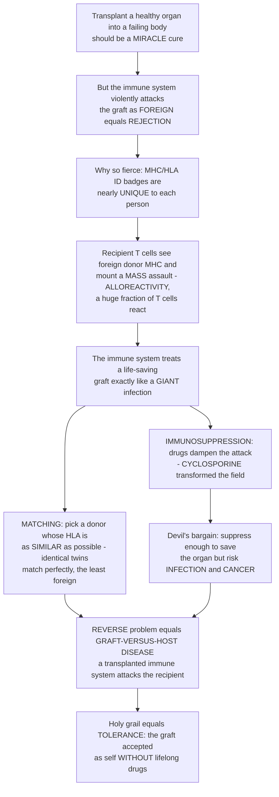

# 🫀 Transplantation Immunology and Rejection

> [!abstract] TL;DR
> Replacing a failing organ with a healthy one *should* be a straightforward miracle — but the recipient's immune system violently attacks the transplant because it **correctly recognizes it as foreign**. This is **rejection**, the central problem of transplantation, and it is fierce for one reason: every cell carries hyper-variable **MHC / HLA "ID badges"** that are **nearly unique to each person**. The recipient's **T cells** inspect the donor organ, see an MHC they were never tolerized to, and mount a massive assault — and, remarkably, an **unusually large fraction of T cells (~1–10%)** can react against a single foreign MHC (**alloreactivity**). So the immune system treats a life-saving **graft** like a giant infection. The whole field therefore rests on two pillars: **matching** (find a donor whose HLA badges resemble the recipient's as closely as possible — identical twins match perfectly, which is why the first successful transplant was between twins) and **immunosuppression** (drugs that dampen the attack — the discovery of **cyclosporine** transformed medicine). But immunosuppression is a **devil's bargain**: suppress enough to save the organ and you leave the patient vulnerable to **infection and cancer**. There is also a mirror-image problem: in **bone-marrow transplants** you are transplanting an *immune system*, so the **donor's** cells attack the **recipient's** body — **graft-versus-host disease**. The field's holy grail is **tolerance**: getting the immune system to accept the graft as "self" without lifelong drugs. *(Educational immunology at textbook level — not individual medical advice.)*

---

## Intuition

**Analogy — a life-saving organ arrives wearing the wrong ID badge, so the security force treats the rescue like an invasion.** Picture your body as a heavily guarded nation where every citizen (cell) wears a photo-ID badge that is **nearly unique to your nation alone** — the **MHC / HLA molecule**. Your border guards (**T cells**) grew up memorizing exactly what a legitimate badge looks like; anything else is, by definition, a hostile intruder. Now a surgeon rushes in a **brand-new heart** to replace your failing one. It is healthy, it works, it will save your life — but every cell of that heart wears a **stranger's badge**. Your guards do not care that the newcomer came to help. They see foreign IDs by the millions and conclude the nation is being **invaded**, so they swarm the transplant and try to destroy it. That reaction *is* **rejection**, and it is astonishingly violent because a **huge fraction of your guards** happen to cross-react with any single foreign badge — a quirk called **alloreactivity**. The immune system, superb at defending "self," has turned its greatest strength into medicine's greatest obstacle.

Because the badges are the whole problem, there are only two ways to smuggle the graft past the guards. The first is **matching**: find a donor whose badges look **as close to yours as possible**, so the guards barely notice the difference — and the *perfect* match is an **identical twin**, whose badges are literally identical (the very first successful human transplant, in 1954, was a kidney between twins). The second is **immunosuppression**: hand the guards a sedative so they stop attacking — the drug **cyclosporine** did exactly this and transformed transplantation from a gamble into routine surgery. But sedating the guards is a **devil's bargain**: dose too little and they wake up and reject the organ; dose too much and *real* invaders — bacteria, viruses, budding cancers — walk in unchallenged.

And there is a haunting **reverse** version. In a **bone-marrow transplant** you are not replacing a heart or a kidney — you are transplanting the **entire security force itself**. Now the *donor's* guards move into a recipient whose own defenses have been wiped out, look around at their new home, and conclude that **the whole country is foreign** — so they attack the patient's own skin, gut, and liver. This is **graft-versus-host disease**: not the patient rejecting the graft, but *the graft rejecting the patient*. The dream that ends all of this is **tolerance** — persuading the guards to genuinely accept the newcomer's badge as one of their own, so the patient needs no lifelong sedatives at all. To understand transplantation is to watch the immune system's fierce, precise loyalty to "self" become both the barrier we must overcome and the deepest lesson in how self/non-self recognition works.

---

## How It Works

### Core mechanics — the alloantigen barrier, recognition, and the two directions of attack

1. **The graft types define whether rejection even happens.** An **autograft** moves tissue from one part of a body to another part of the *same* body (a skin graft from thigh to face) — **no foreign badges, no rejection**. An **isograft** (syngeneic graft) is between **genetically identical individuals** — **identical twins** or inbred mice — also **not rejected**. An **allograft** is between **two individuals of the same species** with different genes — the ordinary clinical situation (a donor kidney to an unrelated recipient) — and it *is* rejected. A **xenograft** crosses **species** (pig to human) and faces the most violent, immediate rejection of all. Grafts split further into **solid-organ** (kidney, liver, heart, lung) and **hematopoietic stem-cell / bone-marrow** transplants — a distinction that turns out to control the *direction* of the immune attack.
2. **The foreign targets are alloantigens — chiefly the MHC.** The molecules the recipient reacts against are the graft's **alloantigens**. The dominant ones are the **MHC / HLA molecules** (the *major* histocompatibility antigens — history named them for exactly this), because they are the most polymorphic proteins in the genome and thus almost always differ between donor and recipient. Secondary targets are **minor histocompatibility antigens** (self-peptides that differ by ordinary sequence variation between people) and the **ABO blood-group antigens** on graft endothelium (which is why blood-type compatibility is checked first).
3. **Allorecognition — how recipient T cells "see" the foreign MHC.** There are two main pathways. In the **direct pathway**, recipient T cells recognize **intact donor MHC** displayed on the surface of **donor** antigen-presenting cells that travelled inside the graft — this drives the **strong, early** response and depends on **alloreactivity**, the strikingly high precursor frequency (~1–10% of all T cells) that cross-react with a single foreign MHC because a stranger's MHC-plus-its-peptides mimics the peptide-MHC surfaces the TCR is tuned to. In the **indirect pathway**, **recipient** antigen-presenting cells engulf shed donor material and present **processed donor peptides** on **self**-MHC — a slower, longer-lasting response that dominates **chronic** rejection. A hybrid **semi-direct pathway** (recipient cells acquiring intact donor MHC) also contributes.
4. **Rejection sorted by tempo and mechanism.** **Hyperacute rejection** strikes in **minutes to hours**: **pre-existing antibodies** (anti-ABO or anti-HLA from prior pregnancy, transfusion, or transplant) bind graft endothelium, fix **complement**, and trigger **thrombosis** that infarcts the organ on the operating table — now largely *prevented* by ABO checks and the pre-transplant **crossmatch**. **Acute rejection** unfolds over **days to weeks**: **T-cell-mediated rejection** (CD8 cytotoxic T cells killing graft cells plus CD4 helpers driving inflammation) and/or **antibody-mediated rejection** (newly formed anti-donor-HLA antibodies attacking the microvasculature). **Chronic rejection** develops over **months to years**: progressive **fibrosis**, **transplant vasculopathy** (thickened, narrowing graft vessels), and slow functional decline — the **main long-term limit** on graft survival, and the hardest to treat.
5. **The mirror image — graft-versus-host disease.** In **bone-marrow / hematopoietic stem-cell transplants**, you transplant an *immune system*. The recipient has been **immunosuppressed or irradiated** so their own defenses cannot reject the graft — but the graft contains mature **donor T cells** that now perceive the **recipient's whole body as foreign** and attack the classic target tissues: **skin** (rash), **gut** (diarrhea), and **liver** (jaundice). This is **GVHD** — the *graft rejecting the host*, the exact reverse of ordinary rejection. It carries a silver lining in leukemia patients: the same donor T cells also attack residual tumor — the beneficial **graft-versus-leukemia** effect — which is why abolishing GVHD entirely is not always desirable.
6. **Overcoming the barrier — pillar one, matching.** **HLA typing** identifies donor and recipient alleles (classically HLA-A, -B, -C, -DR, -DQ); the **closer the match, the better the graft survives**, because a more similar badge looks less foreign. A **crossmatch** test checks whether the recipient already has **antibodies against this specific donor** (which would cause hyperacute rejection). The catch is **scarcity**: because HLA is the most polymorphic region of the genome, a fully matched *unrelated* donor is astronomically rare — hence the need for large **donor registries**.
7. **Overcoming the barrier — pillar two, immunosuppression.** Drugs dampen the attack at multiple points: **corticosteroids** (broad anti-inflammatory), **calcineurin inhibitors** — **cyclosporine** (the 1980s breakthrough that made transplantation routine) and **tacrolimus** — which block T-cell activation signaling, **antiproliferatives** like **mycophenolate** that starve dividing lymphocytes, **mTOR inhibitors** (sirolimus), and **biologic antibodies** (anti-CD3, anti-CD25/basiliximab, anti-thymocyte globulin). This yields the field's defining **trade-off**: suppress too little and the organ is **rejected**; suppress too much and the patient succumbs to **infection, malignancy, and drug toxicity** — a **therapeutic window** the demo below makes explicit.
8. **The escape hatches and the holy grail.** Some sites are **immune-privileged** — the **cornea**, for instance, tolerates grafts with minimal matching because of physical and molecular barriers to immune surveillance. The frontier goal is genuine **transplant tolerance**: donor-specific unresponsiveness *without* lifelong drugs, pursued through **mixed chimerism** (co-transplanting donor marrow so the recipient's immune system is re-educated to see donor cells as self), **regulatory-T-cell therapy**, and **costimulation blockade**. Alongside it sit **xenotransplantation** (gene-edited pig organs engineered to evade human rejection) and **organ engineering** — echoing the field's origin in **Medawar's** Nobel-winning demonstration that tolerance can be *induced*.

### The transplant barrier, end to end



---

## Key Concepts

### Secondary (intuitive foundation)

- **Rejection is the immune system doing its job.** A transplanted organ carries a **stranger's cell-ID badges (MHC/HLA)**, so the recipient's **T cells** attack it as **foreign** — exactly as they would attack an infection. Nothing has "gone wrong"; the immune system is working *too well*.
- **Two ways past the guards.** **Matching** finds a donor whose badges look as similar as possible (an **identical twin** matches perfectly). **Immunosuppression** gives the immune system drugs so it stops attacking — the drug **cyclosporine** made transplants routine.
- **The reverse problem.** In a **bone-marrow transplant** you transplant an *immune system*, so the **donor's** cells can attack the **patient's** body — **graft-versus-host disease**, the graft rejecting the patient.
- **The catch.** Too *little* immunosuppression and the organ is rejected; too *much* and the patient catches **infections** or **cancer**. The dream is **tolerance** — the body accepting the organ with no drugs at all.

### Undergraduate (mechanistic detail)

- **Graft terminology.** **Autograft** (self→self, not rejected), **isograft/syngeneic** (identical twins, not rejected), **allograft** (same species, different genes — the clinical case, rejected), **xenograft** (across species — hyperacute rejection). **Solid-organ** vs **hematopoietic stem-cell** transplants.
- **Alloantigens.** Primary = **MHC/HLA**; secondary = **minor histocompatibility antigens** and **ABO blood groups** on endothelium.
- **Allorecognition pathways.** **Direct** (recipient T cells see intact donor MHC on donor APCs — strong, early, drives acute rejection; the engine of **alloreactivity**), **indirect** (recipient APCs present processed donor peptides — drives chronic rejection), and **semi-direct**.
- **Rejection by tempo.** **Hyperacute** (minutes–hours; pre-formed antibody → complement → thrombosis; prevented by crossmatch), **acute** (days–weeks; T-cell-mediated and/or antibody-mediated), **chronic** (months–years; fibrosis, vasculopathy — the main long-term limit).
- **Mapping to effector arms.** Rejection recruits the same weapons as anti-pathogen immunity: **CD8 cytotoxic T cells** (cell-mediated killing), **CD4 helpers**, and **antibody + complement** (a transplant analogue of type II/III hypersensitivity).
- **GVHD.** Donor T cells attack the immunocompromised recipient's **skin, gut, liver**; the **graft-versus-leukemia** benefit means some GVHD activity can be therapeutic.

### Graduate (systems, quantitation, and frontiers)

- **Why alloreactivity is so strong.** The **precursor frequency** of T cells reactive to a single foreign MHC is **~100–1000×** higher than for a conventional peptide antigen, because a foreign MHC presents a *large diverse array* of self-peptides, many of which cross-react with TCRs positively selected on self-MHC. This high frequency is precisely what makes rejection more violent than an ordinary infection response.
- **Matching arithmetic.** Graft survival scales with **HLA compatibility**; each additional mismatched locus raises the hazard of rejection. Because HLA polymorphism is extreme (thousands of alleles, co-dominant expression), the probability that an unrelated pair is fully matched is vanishingly small — driving the logic of **paired-exchange programs** and large registries. (The linked MHC note quantifies the polymorphism itself.)
- **The immunosuppression optimization.** Total risk is a **U-shaped** sum of a **falling rejection risk** and a **rising infection/malignancy/toxicity risk** in the dose; the clinical target is the **minimum** of that curve — a moving optimum that is highest right after surgery and relaxes over time as the graft is "accommodated."
- **Antibody-mediated rejection and DSA.** **Donor-specific antibodies (DSA)** against donor HLA are a major modern cause of graft loss; **C4d** staining on biopsy marks complement fixation. **Desensitization** protocols (plasmapheresis, IVIG, anti-CD20, proteasome inhibitors) exist to transplant across DSA barriers.
- **Tolerance strategies.** **Mixed hematopoietic chimerism** (re-educating the recipient's developing repertoire), **regulatory-T-cell (Treg) adoptive therapy**, and **costimulation blockade** (e.g., CTLA-4-Ig / belatacept interrupting signal 2) all aim at **donor-specific unresponsiveness without global immunosuppression** — the field's holy grail, tracing to **Medawar's** actively-acquired-tolerance work (Nobel 1960).
- **Xenotransplantation.** Multiplex **gene-edited pigs** (knocking out the α-Gal and other carbohydrate xenoantigens, adding human complement- and coagulation-regulatory transgenes) have reached first-in-human heart and kidney xenografts — engineering the badge problem away rather than suppressing the response.

---

## Python Demo

Two panels capture the two pillars. **(A) Matching → graft survival:** better-matched grafts face a lower rejection hazard, so their **survival curves** decline more slowly — we plot exponential graft-survival over 10 years for 0, 2, 4, and 6 HLA mismatches, and print each 5-year survival. **(B) The immunosuppression trade-off:** rejection risk **falls** with dose while infection/malignancy/toxicity risk **rises**, so the **total risk is U-shaped** with an **optimal therapeutic window** — we plot both components, their sum, and the minimizing dose.

```python
# Transplantation immunology: (A) HLA match -> graft survival, (B) the immunosuppression trade-off
import numpy as np
import matplotlib.pyplot as plt

# =====================================================================
# PANEL A -- HLA matching and graft survival
# Model: rejection is a constant-hazard (exponential) process whose
# hazard rises with the number of mismatched HLA loci.
#   S(t) = exp(-lambda(m) * t),  lambda(m) = base + slope * m
# =====================================================================
years      = np.linspace(0, 10, 200)     # follow-up in years
mismatches = [0, 2, 4, 6]                 # number of mismatched HLA loci
base_haz   = 0.015                        # baseline yearly hazard (a perfect match still fails slowly)
slope_haz  = 0.028                        # extra yearly hazard per mismatched locus

def survival(t, m):
    lam = base_haz + slope_haz * m
    return np.exp(-lam * t)

print("5-year graft survival by HLA mismatch:")
for m in mismatches:
    print(f"  {m} mismatches -> {survival(5.0, m):.0%}")

# =====================================================================
# PANEL B -- the immunosuppression therapeutic window
# Rejection risk falls with dose; infection/malignancy/toxicity rises.
# Total = rejection + toxicity  ->  a U-shaped curve with an optimum.
# =====================================================================
dose = np.linspace(0, 1, 400)                     # normalized immunosuppression intensity
risk_reject = 0.9 * np.exp(-5.0 * dose)           # high when undersuppressed, decays with dose
risk_toxic  = 0.05 * (np.exp(3.2 * dose) - 1)     # infection/cancer/toxicity, rises with dose
risk_total  = risk_reject + risk_toxic
opt_i       = int(np.argmin(risk_total))          # the minimizing dose = therapeutic optimum
opt_dose    = dose[opt_i]
print(f"\nOptimal immunosuppression dose (min total risk): {opt_dose:.2f} of max")
print(f"Total risk at optimum                          : {risk_total[opt_i]:.2f}")

# ---- Plots ----
fig, (ax1, ax2) = plt.subplots(1, 2, figsize=(13, 5))

colors = plt.cm.viridis(np.linspace(0, 0.85, len(mismatches)))
for m, c in zip(mismatches, colors):
    ax1.plot(years, 100 * survival(years, m), lw=2.2, color=c,
             label=f"{m} HLA mismatches")
ax1.set_title("A. HLA matching -> graft survival\n(fewer mismatches survive longer)")
ax1.set_xlabel("years after transplant")
ax1.set_ylabel("% grafts surviving")
ax1.set_ylim(0, 100); ax1.legend(); ax1.grid(alpha=0.3)

ax2.plot(dose, risk_reject, "--", color="#b91c1c", lw=2, label="rejection risk (too little)")
ax2.plot(dose, risk_toxic,  "--", color="#2563eb", lw=2, label="infection / cancer (too much)")
ax2.plot(dose, risk_total,  "-",  color="#111827", lw=2.6, label="total risk")
ax2.axvline(opt_dose, color="#059669", lw=2, label=f"optimal window (dose={opt_dose:.2f})")
ax2.set_title("B. The immunosuppression devil's bargain\n(U-shaped total risk)")
ax2.set_xlabel("immunosuppression dose (normalized)")
ax2.set_ylabel("risk (arbitrary units)")
ax2.set_ylim(0, 1.2); ax2.legend(); ax2.grid(alpha=0.3)

plt.tight_layout()
plt.savefig("transplant_immunology.png", dpi=120)
plt.show()
```

**What it shows.** Panel A: a **perfectly matched** graft (0 mismatches) retains ~93% survival at 5 years, while a **6-mismatch** graft falls toward ~45% — the quantitative reason **HLA matching** dominates allocation policy. Panel B: because rejection risk **falls** and toxicity risk **rises** with dose, the **total risk is U-shaped**; the clinician aims for the **green optimum**, and *any* deviation — under- or over-suppression — worsens outcomes. Together the panels encode the field's two levers and their unavoidable trade-off.

---

## Real-World Applications

> **Kidney transplantation and allocation policy.** The kidney is the most-transplanted solid organ, and national allocation systems weight **HLA matching** and pre-transplant **crossmatch** precisely because mismatch predicts rejection and graft loss (Panel A made real). **Kidney paired-donation** exchanges swap incompatible donor-recipient pairs to manufacture better HLA and crossmatch matches — a logistics answer to HLA scarcity.

> **Hematopoietic stem-cell transplantation for leukemia.** Bone-marrow / HSC transplants cure blood cancers but hinge on the **GVHD ↔ graft-versus-leukemia** balance: enough donor T-cell activity to eradicate residual tumor, not so much that the patient suffers lethal GVHD. Registries like **Be The Match / WMDA** exist because a matched unrelated donor is rare; **T-cell depletion**, **post-transplant cyclophosphamide**, and **haploidentical** protocols are engineered compromises around this balance.

> **The cyclosporine revolution.** Before **cyclosporine** (clinically transformative in the early 1980s), transplant survival was poor and reliant on crude, toxic immunosuppression. This single **calcineurin inhibitor** — and its successor **tacrolimus** — converted transplantation from an experimental gamble into standard care, the pharmacological embodiment of Panel B's therapeutic window.

> **Xenotransplantation and the organ shortage.** With far more patients on waiting lists than donor organs, **gene-edited pig** hearts and kidneys — engineered to delete xenoantigens and add human complement/coagulation regulators — have reached first-in-human procedures, attacking the badge-mismatch problem at its genetic root rather than only suppressing the response.

> **Sensitized patients and antibody-mediated rejection.** Patients with **donor-specific anti-HLA antibodies** (from pregnancy, transfusion, or prior grafts) face hyperacute or antibody-mediated rejection; **desensitization** (plasmapheresis, IVIG, anti-CD20, proteasome inhibitors) and **C4d**-guided biopsy diagnosis are the clinical response to this humoral arm of rejection.

---

## Common Pitfalls

- **"Rejection means the surgeon did something wrong."** Rejection is the immune system functioning **correctly** — it detects genuinely foreign MHC. The challenge is not a surgical error but an *immunological* fact of self/non-self recognition.
- **"Rejection and graft-versus-host disease are the same thing."** They are **opposite directions**. Rejection is **host-versus-graft** (the recipient attacks the organ). **GVHD** is **graft-versus-host** (donor immune cells attack the recipient) and occurs mainly when you transplant an *immune system* — a bone-marrow/HSC graft.
- **"More immunosuppression is always safer."** No — the total-risk curve is **U-shaped**. Over-suppression trades rejection for **opportunistic infection, PTLD/other malignancies, and drug toxicity**. The goal is the **window**, not the maximum dose.
- **"A perfect HLA match means no rejection and no drugs."** Only an **isograft (identical twin)** is genetically identical. HLA-matched *unrelated* grafts still differ at **minor histocompatibility antigens** and still require immunosuppression; matching **reduces** but does not abolish alloreactivity.
- **"T cells react to foreign MHC no more strongly than to any germ."** The reverse: **alloreactivity** gives a **~100–1000× higher precursor frequency** of reactive T cells, which is exactly *why* rejection is so ferocious — the graft is seen as a *giant* antigen load.
- **"Hyperacute rejection is a T-cell problem you fix with more drugs."** Hyperacute rejection is driven by **pre-existing antibodies** and **complement**, strikes within hours, and is **not** salvageable by immunosuppression — it is **prevented** upstream by ABO checks and the crossmatch.
- **"Eliminating GVHD entirely is the goal in leukemia transplants."** Some donor-cell reactivity delivers the beneficial **graft-versus-leukemia** effect; abolishing it can raise **relapse**. The aim is *balance*, not zero.

---

## Related Concepts

- [[Biology/11_Microbiology_and_Immunology/The_Adaptive_Immune_System|The Adaptive Immune System]] — rejection is the adaptive response (T cells, antibodies, memory) redirected against a graft instead of a pathogen; the same clonal machinery, a different target.
- [[Genetics/05_Human_and_Medical_Genetics/Human_Genome_and_Genetic_Variation|Human Genome and Genetic Variation]] — the extreme **HLA polymorphism** that makes each person's badges nearly unique (and matched donors scarce) is the most variable stretch of the human genome.
- [[Clinical_Medicine/05_Immune_Infectious_and_Hematologic/Immune_Dysfunction_and_Autoimmunity|Immune Dysfunction and Autoimmunity]] — transplant tolerance and autoimmune tolerance are two faces of the same problem: teaching T cells what counts as "self," and what happens when that line is drawn wrongly.
- [[Pharmacology/03_Drug_Classes_and_Therapeutics/Anticancer_and_Immunomodulatory_Drugs|Anticancer and Immunomodulatory Drugs]] — the calcineurin inhibitors, antiproliferatives, mTOR inhibitors, and biologic antibodies that constitute the immunosuppression pillar and define the therapeutic-window trade-off.

*Within the Immunology vault, this note sits alongside siblings developed separately:* **The Major Histocompatibility Complex** (the MHC/HLA badges that are the primary transplant alloantigens and the entire reason rejection is so fierce), **Cytotoxic T Cells and Cell-Mediated Immunity** (the CD8 killers that mediate acute cellular rejection and GVHD), **Autoimmunity and Loss of Tolerance** (the mirror-image failure of self-recognition, sharing the tolerance machinery this field tries to co-opt), **Immunodeficiency Disorders** (the state deliberately induced by immunosuppression, with its infection and malignancy costs), and **Immunoengineering and CAR-T Cells** (the engineering frontier — Treg therapy, gene-edited xenografts, and cellular therapies aimed at tolerance).

---

## Review Questions

1. **(Secondary)** A patient receives a healthy donor kidney, yet within two weeks their body begins destroying it. Using the "ID badge" idea, explain *why* the immune system attacks a life-saving organ, and describe the **two** general strategies doctors use to prevent this. Why is an identical twin the ideal donor?
2. **(Undergraduate)** Distinguish **hyperacute**, **acute**, and **chronic** rejection by *timescale*, *dominant mechanism* (antibody vs T-cell vs fibrosis), and *whether immunosuppression can treat it*. Then contrast **host-versus-graft rejection** with **graft-versus-host disease**: in which transplant setting does each arise, and why does GVHD require transplanting an *immune system*?
3. **(Graduate)** **Alloreactivity** gives a T-cell precursor frequency 100–1000× higher than for a conventional antigen. Explain the mechanistic origin of this (direct allorecognition of foreign MHC-plus-self-peptide), and connect it to why rejection behaves like a *giant* infection. Then, using the U-shaped total-risk model from the demo, argue why **transplant tolerance** — donor-specific unresponsiveness without global immunosuppression — would be categorically superior to optimizing the immunosuppression dose, and name two strategies (e.g., mixed chimerism, Treg therapy, costimulation blockade) being pursued to achieve it.

---

## Sources

- Murphy, K. & Weaver, C. (2022). *Janeway's Immunobiology*, 10th ed. Garland Science — chapter on transplantation, allorecognition, and rejection mechanisms.
- Abbas, A.K., Lichtman, A.H. & Pillai, S. (2021). *Cellular and Molecular Immunology*, 10th ed. Elsevier — transplantation immunology, alloantigens, and immunosuppression.
- Nankivell, B.J. & Alexander, S.I. (2010). "Rejection of the Kidney Allograft." *New England Journal of Medicine* 363: 1451–1462 — clinical mechanisms and classification of allograft rejection.
- Billingham, R.E., Brent, L. & Medawar, P.B. (1953). "Actively Acquired Tolerance of Foreign Cells." *Nature* 172: 603–606 — Medawar's foundational tolerance work (Nobel Prize, 1960).
- Murphy, S.P., Porrett, P.M. & Turka, L.A. (2011). "Innate immunity in transplant tolerance and rejection." *Immunological Reviews* 241: 39–48 — a modern review bridging rejection mechanisms and the pursuit of tolerance.

---

#immunology #transplantation #graft-rejection #hla-matching #graft-versus-host
