# 🛡️ Tumor Immunology and Immune Evasion

> [!abstract] TL;DR
> **Cancer is a uniquely tricky enemy because a tumor is not a foreign invader — it is made of your own cells gone rogue, a traitor from within.** Mutations turn cells malignant constantly, yet most never become tumors: the immune system silently finds and destroys these nascent cancers, a process called **immunosurveillance**. The tumors that *do* grow are the rare survivors that learned to **hide from or shut down** the immune system. This is captured by **cancer immunoediting**, a three-phase drama: **Elimination** (the immune system spots and kills transformed cells, mostly winning invisibly), **Equilibrium** (a stalemate in which immune pressure acts like antibiotics on bacteria — killing the visible cells but *selecting* for sneaky, low-immunogenicity variants), and **Escape** (the immune-sculpted, immunosuppressive tumor breaks free and grows into clinical cancer). Tumors escape with a bag of tricks: they **downregulate their MHC "ID badges"** (which paradoxically exposes them to NK cells), they build an **immunosuppressive microenvironment** (regulatory T cells, MDSCs, TGF-β), and — most importantly — they **hijack the immune system's own "off switches,"** the **checkpoints** PD-1 and CTLA-4, displaying ligands like **PD-L1** to paralyze the very T cells trying to kill them, like a criminal flashing a fake "friend" badge. The revolutionary, Nobel-winning insight was that **blocking those brakes with checkpoint inhibitors unleashes the patient's own T cells** against the cancer — launching the immunotherapy revolution. *(Educational immunology at textbook level — not individual medical advice.)*

---

## Intuition

**Analogy first — the enemy is a traitor from within, not an invader from without.** Most of immunology is about detecting *foreign* things: a bacterium, a virus, a splinter. Cancer breaks that rule. A tumor is built from **your own cells**, carrying your own DNA, wearing your own molecular uniform. The challenge is not spotting a foreigner but spotting a **traitor** — a citizen who looks almost exactly like everyone else but has quietly turned rogue.

Here is the remarkable part. Cells become cancerous **all the time** — mutations happen constantly in the trillions of dividing cells in your body — and yet you are (usually) not riddled with tumors. Why? Because a silent police force is **constantly finding and destroying these nascent cancers before they ever become tumors**. This continuous, invisible patrol is called **immunosurveillance**. The logical twist is profound: if the immune system catches almost all budding cancers, then the tumors that actually grow into clinical cancer are precisely the **rare escapees** — the ones that figured out how to hide from, or shut down, the immune attack.

Modern immunology captures this hidden war in one of its greatest ideas: **immunoediting**, a three-act drama. **Act One — Elimination:** the immune system spots and kills the transformed cells, winning invisibly, over and over. **Act Two — Equilibrium:** sometimes it cannot fully clear the cancer, so it reaches a stalemate — holding the tumor in check for years. But here is the sting: that stalemate acts as a **brutal selective pressure**, exactly like antibiotics selecting for resistant bacteria. The immune system kills the visible, immunogenic cancer cells, but in doing so it **selects for the sneaky variants** that happen to be invisible or suppressive. **Act Three — Escape:** the tumor — now *edited*, sculpted by the immune system itself into an immunosuppressive, hard-to-see form — finally breaks free and grows into clinical cancer.

*How* do tumors escape? With a whole bag of tricks. They **hide their ID badges** by downregulating **MHC** — though that exposes them to **NK cells**, which kill exactly the cells that stop showing a badge. They **stop displaying** anything incriminating. And, most importantly, they **actively suppress** the attack by exploiting the immune system's own built-in **brakes**. Immune cells carry **checkpoints** — molecules like **PD-1** and **CTLA-4** that normally exist to prevent autoimmunity, to stop the immune system from attacking the body. Tumors cynically **activate these brakes**: a tumor displaying **PD-L1** engages the PD-1 brake on an attacking T cell and *paralyzes* it — like a criminal flashing a fake "friend" badge to make the guards stand down. The revolutionary insight — worthy of a Nobel Prize — was that if we **block these brakes** with **checkpoint inhibitors**, we can **unleash the patient's own T cells** to destroy the cancer. That launched the immunotherapy revolution. To understand tumor immunology is to understand the hidden war between cancer and the immune system — and how learning its rules transformed cancer treatment.

---

## How It Works

### Core Mechanics

1. **The problem — recognizing "altered self."** Cancer cells are transformed *self* cells, not foreign organisms. The immune system must therefore distinguish a subtly abnormal own-cell from a normal one — recognition of **altered self**, not classic foreign-versus-self. Remarkably, it can: tumors *do* provoke immune responses.
2. **What the immune system actually sees — tumor antigens.** Recognition hangs on peptides displayed on the tumor's **MHC class I**. The key targets are **neoantigens** — peptides from the tumor's own mutations, genuinely *not-self* and never seen during tolerance, which is why **high-mutation-burden tumors** tend to respond better to immunotherapy. Other targets include **tumor-associated antigens** (overexpressed or aberrant self — cancer-testis and differentiation antigens), **oncoviral antigens** (HPV, EBV proteins), and **stress ligands** read by NK cells.
3. **Immunosurveillance (Burnet & Thomas).** The immune system continuously detects and eliminates nascent transformed cells. Evidence: **immunosuppressed transplant and HIV patients** have markedly higher cancer rates; dense **tumor-infiltrating lymphocytes** predict better prognosis; and immunodeficient animals develop more tumors.
4. **Immunoediting — the modern framework (Schreiber, Dunn, Old): the three E's.**
   - **Elimination** — immunosurveillance in action: **cytotoxic (CD8) T cells** and **NK cells**, amplified by **IFN-γ**, destroy transformed cells. Most nascent cancers die here, invisibly.
   - **Equilibrium** — the immune system controls but cannot clear the tumor, holding it in a dormant, subclinical state. Crucially, sustained immune pressure acts as **Darwinian selection**, killing immunogenic clones and *sculpting* the surviving population toward reduced immunogenicity.
   - **Escape** — the immune-edited tumor, now poorly immunogenic and actively immunosuppressive, outgrows control and becomes clinical cancer.
5. **Evasion mechanism 1 — reduced antigenicity.** Tumors **downregulate MHC class I** and antigen-processing machinery (e.g., **TAP** loss), and lose or vary antigens under selection (**antigen heterogeneity**), so CD8 T cells have nothing to read. The catch: MHC-I loss removes the "self" signal that inhibits **NK cells**, betraying the tumor to missing-self killing.
6. **Evasion mechanism 2 — an immunosuppressive microenvironment.** Tumors recruit **regulatory T cells (Tregs)**, **myeloid-derived suppressor cells (MDSCs)**, and **M2 tumor-associated macrophages**; secrete suppressive cytokines (**TGF-β, IL-10**); and rewire metabolism (**adenosine, IDO-driven tryptophan depletion, hypoxia, low pH**) to starve and blunt effector cells.
7. **Evasion mechanism 3 — hijacking immune checkpoints (the decisive trick).** T cells carry co-inhibitory "brakes" — **PD-1** and **CTLA-4** — that normally prevent autoimmunity. Tumors and their microenvironment express the ligand **PD-L1**; PD-L1 engaging PD-1 drives infiltrating T cells into **exhaustion/anergy**, switching off their killing. This is Hanahan & Weinberg's hallmark **"avoiding immune destruction."**
8. **Turning the tables — the therapeutic revolution (foreshadowed here; detailed in the immunotherapy note).** Blocking the brakes with **checkpoint inhibitors** (anti-PD-1/PD-L1, anti-CTLA-4) **releases exhausted T cells** to attack the tumor — the 2018 Nobel to **Allison and Honjo**. Companion strategies include **adoptive cell therapy and CAR-T**, **cancer/neoantigen vaccines**, and **oncolytic viruses**.

### Flow / Architecture

```mermaid
graph TD
    ROGUE["Cancer is YOUR OWN cells gone ROGUE<br/>a traitor within, not a foreign invader"]
    SURV["The immune system CONSTANTLY finds and<br/>destroys nascent cancers equals IMMUNOSURVEILLANCE"]
    RARE["Tumors that GROW are the rare ones<br/>that HIDE or SHUT DOWN immunity"]
    EDIT["CANCER IMMUNOEDITING - three phases"]
    ELIM["ELIMINATION<br/>the immune system kills cancer cells,<br/>invisibly winning"]
    EQUIL["EQUILIBRIUM<br/>a stalemate that SELECTS for sneaky<br/>evasive variants, like antibiotics<br/>select for resistant bacteria"]
    ESC["ESCAPE<br/>the edited, invisible, immunosuppressive<br/>tumor breaks free and grows out"]
    TRICKS["Escape tricks: hide MHC ID badges<br/>but NK cells see the missing badge,<br/>and stop displaying anything incriminating"]
    CHECK["and SUPPRESS via the immune system's own<br/>CHECKPOINTS - PD-1 and CTLA-4"]
    PDL1["Tumors flash PD-L1 to PARALYZE T cells<br/>a fake friend badge that says stand down"]
    BLOCK["BLOCK the brakes equals CHECKPOINT INHIBITORS<br/>unleash the patient's own T cells<br/>a Nobel Prize, the immunotherapy revolution"]

    ROGUE --> SURV --> RARE --> EDIT
    EDIT --> ELIM --> EQUIL --> ESC
    ESC --> TRICKS --> CHECK --> PDL1 --> BLOCK
    style ROGUE fill:#dc2626,color:#fff
    style SURV fill:#2563eb,color:#fff
    style EDIT fill:#7c3aed,color:#fff
    style ELIM fill:#059669,color:#fff
    style EQUIL fill:#b45309,color:#fff
    style ESC fill:#dc2626,color:#fff
    style CHECK fill:#7c3aed,color:#fff
    style PDL1 fill:#b45309,color:#fff
    style BLOCK fill:#059669,color:#fff
```



---

## Key Concepts

### Secondary (the big picture)

- **The enemy is a traitor, not an invader.** A tumor is your own cells gone rogue. The hard part is recognizing "altered self" — a cell that looks almost normal but has turned malignant.
- **A silent police force.** Cells turn cancerous constantly, but the immune system finds and kills most of them before they grow — **immunosurveillance**. The tumors you see are the rare escapees.
- **The three E's of immunoediting.** **Elimination** (immune system kills the cancer), **Equilibrium** (a stalemate that quietly *selects* for sneaky, hard-to-see variants), **Escape** (the edited, invisible tumor breaks free).
- **The escape tricks.** Tumors hide their **ID badge** (MHC), stop showing incriminating evidence, and — cleverest of all — **press the immune system's own brakes** to paralyze the attacking cells.
- **The breakthrough.** If tumors win by pressing the brakes, then **releasing the brakes** (checkpoint inhibitors) lets the patient's own immune system win. That idea transformed cancer treatment.

### Undergraduate (the mechanisms)

- **Tumor antigens — a hierarchy of "seeability."**

| Antigen type | Source | Immunological weight |
|---|---|---|
| **Neoantigens** | tumor-specific mutations | strongest, truly not-self; predict immunotherapy response |
| **Tumor-associated (TAAs)** | overexpressed/aberrant self (cancer-testis, differentiation) | present but tolerance-limited |
| **Oncoviral antigens** | HPV, EBV proteins | strong, foreign-derived |
| **Stress ligands** | MICA/MICB, induced by transformation | read by **NK cells**, not T cells |

- **Immunoediting as sculpting.** Immune pressure is not just a filter that removes cells; it **shapes the tumor's immunogenicity** over time. The clinical tumor is the *product* of that editing — an immune-adapted survivor.
- **Antigenicity loss.** **MHC-I downregulation**, **TAP/antigen-processing defects**, and **antigen heterogeneity/loss** blind CD8 T cells — but MHC-I loss unmasks the tumor to **NK missing-self** killing (a fail-safe the tumor cannot fully dodge).
- **The immunosuppressive microenvironment (TME).** Recruited **Tregs**, **MDSCs**, and **M2 macrophages**; suppressive cytokines **TGF-β / IL-10**; metabolic brakes (**adenosine, IDO, hypoxia**) collectively disarm effectors within the tumor.
- **Checkpoint exploitation.** Chronic antigen plus **PD-L1** on tumor/TME drives T-cell **exhaustion** via **PD-1**; **CTLA-4** raises the threshold for T-cell priming in lymph nodes. Tumors co-opt both physiological brakes.

### Graduate (the integration and its subtleties)

- **Equilibrium is genuine Darwinian selection.** The parallel to antibiotic resistance is exact: a heterogeneous clonal population under a killing pressure loses its sensitive (immunogenic) clones and enriches resistant (low-immunogenicity/immunosuppressive) clones. Immunoediting is **cancer evolution under an immune selective agent** — the logic explored in the demo.
- **The cancer-immunity cycle (Chen & Mellman).** Effective anti-tumor immunity is a self-amplifying loop: antigen release → dendritic-cell presentation → T-cell priming → trafficking → infiltration → recognition → killing → *more* antigen release. Tumors break the cycle at specific, druggable nodes (priming → CTLA-4 blockade; effector phase → PD-1/PD-L1 blockade).
- **"Hot" versus "cold" tumors.** Inflamed, T-cell-infiltrated ("hot") tumors respond to checkpoint blockade; immune-excluded or "cold" tumors do not — reframing therapy as *converting cold to hot*.
- **Biomarkers of response.** **Tumor mutational burden (TMB)**, **mismatch-repair deficiency / microsatellite instability (MSI-high)**, **PD-L1 expression**, and an **interferon-γ gene signature** correlate with checkpoint-inhibitor benefit — because more mutations mean more neoantigens to see.
- **The trade-off — immune-related adverse events.** Releasing checkpoint brakes systemically also releases the brakes on **self-tolerance**, provoking autoimmune-like toxicities (colitis, dermatitis, endocrinopathies). The same brakes that tumors exploit are the ones that normally prevent autoimmunity — a direct link to loss-of-tolerance biology.
- **Editing after therapy.** Checkpoint therapy imposes *new* selection: acquired resistance via **β2-microglobulin/JAK-STAT mutations** (further MHC-I or IFN-γ-signaling loss) recapitulates escape at the therapeutic scale.

---

## Python Demo

Two ideas define tumor immunology, and this simulation models both: **(a) immunoediting — Elimination → Equilibrium → Escape** — a heterogeneous tumor of *immunogenic* and *evasive* cells under immune pressure, where the immune system kills the visible immunogenic cells (Elimination), producing a low-burden stalemate (Equilibrium) that *selects* for low-immunogenicity variants, which eventually dominate and grow out (Escape) — Darwinian immune selection sculpting the tumor; and **(b) checkpoint blockade** — a tumor whose PD-L1 engages PD-1 to *suppress* T-cell killing (killing rate below tumor growth → escape), compared with **checkpoint-blockade-unleashed** T cells whose restored killing controls the tumor.

```python
# Tumor immunology, two ways:
#   (a) IMMUNOEDITING: Elimination -> Equilibrium -> Escape as Darwinian
#       immune selection on a mixed immunogenic/evasive tumor population.
#   (b) CHECKPOINT BLOCKADE: PD-L1-suppressed T-cell killing (tumor escapes)
#       vs checkpoint-blockade-unleashed killing (tumor controlled).
import numpy as np
import matplotlib.pyplot as plt

# ============================================================
# (a) IMMUNOEDITING: two clones under immune killing + mutation
# ============================================================
steps = 160
r      = 0.20        # intrinsic proliferation rate (both clones)
K      = 1.0e6       # total carrying capacity
kill_I = 0.35        # immune kill rate on IMMUNOGENIC cells (strong: net decline)
kill_E = 0.05        # immune kill rate on EVASIVE cells   (weak: net growth)
mu     = 1.0e-3      # mutation immunogenic -> evasive per step

I = np.zeros(steps + 1)   # immunogenic (visible) cells
E = np.zeros(steps + 1)   # evasive (low-immunogenicity) variants
I[0], E[0] = 1000.0, 5.0  # tumor starts almost entirely immunogenic

for t in range(steps):
    total = I[t] + E[t]
    growth = 1.0 - total / K                      # logistic density limit
    dI = r * I[t] * growth - kill_I * I[t] - mu * I[t]
    dE = r * E[t] * growth - kill_E * E[t] + mu * I[t]
    I[t + 1] = max(I[t] + dI, 0.0)
    E[t + 1] = max(E[t] + dE, 0.0)

burden = I + E
# Detect the three phases from the burden trajectory
t_elim = int(np.argmin(burden))                          # end of Elimination (burden minimum)
after  = np.where(np.arange(steps + 1) > t_elim)[0]
esc_hits = after[burden[after] > burden[0]]              # burden recovers past baseline
t_esc  = int(esc_hits[0]) if esc_hits.size else steps    # start of Escape

# ============================================================
# (b) CHECKPOINT BLOCKADE: tumor growth vs T-cell killing rate
# ============================================================
def tumor_growth(kill, r=0.15, K=1.0e6, T0=5000.0, steps=140):
    T = np.zeros(steps + 1); T[0] = T0
    for t in range(steps):
        T[t + 1] = max(T[t] + r * T[t] * (1 - T[t] / K) - kill * T[t], 1.0)
    return T

kill_max      = 0.30                       # max T-cell kill rate when fully active
pdl1_suppress = 0.85                       # PD-L1/PD-1 paralyzes 85% of killing
kill_suppressed = kill_max * (1 - pdl1_suppress)   # ~0.045 < growth -> escape
kill_blockade   = kill_max * (1 - 0.10)            # ~0.27  > growth -> control
T_suppressed = tumor_growth(kill_suppressed)
T_blockade   = tumor_growth(kill_blockade)

# ============================================================
# Plots
# ============================================================
fig, (axA, axB) = plt.subplots(1, 2, figsize=(14, 6))

# --- Panel A: immunoediting three phases ---
axA.axvspan(0,      t_elim, color="#059669", alpha=0.08)
axA.axvspan(t_elim, t_esc,  color="#b45309", alpha=0.08)
axA.axvspan(t_esc,  steps,  color="#dc2626", alpha=0.08)
axA.plot(burden, color="#111827", lw=2.8, label="Total tumor burden")
axA.plot(I,      color="#059669", lw=2.2, label="Immunogenic (visible) cells")
axA.plot(E,      color="#dc2626", lw=2.2, ls="--", label="Evasive variants (selected)")
ymax = K * 1.05
for x, name in [((t_elim) / 2, "ELIMINATION"),
                ((t_elim + t_esc) / 2, "EQUILIBRIUM"),
                ((t_esc + steps) / 2, "ESCAPE")]:
    axA.text(x, ymax * 0.9, name, ha="center", fontsize=10, weight="bold",
             color="#374151")
axA.set_title("(a) Immunoediting: immune pressure purges visible cells,\nselects evasive variants that escape")
axA.set_xlabel("time step"); axA.set_ylabel("tumor cells")
axA.set_ylim(0, ymax); axA.legend(loc="center left", fontsize=9); axA.grid(alpha=0.25)

# --- Panel B: checkpoint blockade ---
axB.plot(T_suppressed, color="#dc2626", lw=2.8,
         label=f"PD-L1-suppressed T cells (kill={kill_suppressed:.3f}) -> ESCAPE")
axB.plot(T_blockade, color="#059669", lw=2.8,
         label=f"Checkpoint-blockade-unleashed (kill={kill_blockade:.3f}) -> CONTROL")
axB.axhline(5000, color="#6b7280", ls=":", lw=1, label="initial tumor size")
axB.annotate("brakes ON:\ntumor paralyzes T cells,\ngrows to capacity",
             xy=(90, T_suppressed[90]), xytext=(60, 0.55 * K),
             arrowprops=dict(arrowstyle="->", color="#dc2626"),
             color="#dc2626", fontsize=9)
axB.annotate("brakes OFF:\nunleashed T cells\nregress the tumor",
             xy=(60, T_blockade[60]), xytext=(70, 0.18 * K),
             arrowprops=dict(arrowstyle="->", color="#059669"),
             color="#065f46", fontsize=9)
axB.set_title("(b) Checkpoint blockade: releasing the PD-1 brake\nrestores T-cell control of the tumor")
axB.set_xlabel("time step"); axB.set_ylabel("tumor cells")
axB.legend(loc="upper left", fontsize=8); axB.grid(alpha=0.25)

plt.tight_layout()
plt.savefig("tumor_immunology.png", dpi=120)
plt.show()

# ============================================================
# Quantify
# ============================================================
print("IMMUNOEDITING")
print(f"  Elimination ends at step {t_elim} (burden minimum = {burden[t_elim]:,.0f})")
print(f"  Escape begins at step {t_esc} (burden recovers past baseline)")
print(f"  Evasive fraction:  start = {E[0]/(I[0]+E[0]):.4f}  end = {E[-1]/(I[-1]+E[-1]):.4f}")
print("\nCHECKPOINT BLOCKADE")
print(f"  PD-L1-suppressed final burden: {T_suppressed[-1]:,.0f}  (escape)")
print(f"  Checkpoint-blockade final burden: {T_blockade[-1]:,.0f}  (control)")
```

**What it shows.** In **Panel (a)**, the total burden first **falls** as the immune system purges immunogenic cells (**Elimination**, green band), flattens into a low-level **stalemate** while the tiny evasive clone is slowly selected upward (**Equilibrium**, amber band), then **climbs to carrying capacity** as the now-dominant evasive variants grow out (**Escape**, red band). The green (immunogenic) curve is driven toward zero while the dashed red (evasive) curve is *selected* from near-invisibility to dominance — Darwinian immune sculpting of the tumor, exactly the antibiotic-resistance parallel. In **Panel (b)**, when **PD-L1 paralyzes the T cells**, their killing rate falls below the tumor's growth rate and the tumor escapes to full burden; **releasing the brake** with checkpoint blockade restores killing above the growth rate, and the same tumor **regresses toward control** — the mechanistic heart of the immunotherapy revolution.

---

## Real-World Applications

> **Checkpoint inhibitors — the flagship of immuno-oncology.** Antibodies that block **PD-1** (nivolumab, pembrolizumab), **PD-L1** (atezolizumab), and **CTLA-4** (ipilimumab) release exhausted T cells and produce durable responses in **melanoma, non-small-cell lung cancer, renal, bladder,** and **MSI-high** cancers. The mechanism is a direct application of this note: the tumor exploited a brake, so the drug removes it. The 2018 Nobel Prize (Allison & Honjo) recognized the underlying biology.

> **Tumor mutational burden and "hot" tumors.** Cancers with many mutations — **melanoma, lung, MSI-high colorectal** — generate abundant **neoantigens**, are more heavily T-cell-infiltrated, and respond best to checkpoint blockade. TMB and PD-L1 staining are used clinically as **biomarkers** to select patients, a direct readout of the antigen-recognition principles above.

> **Adoptive cell therapy and CAR-T.** When a tumor hides its antigens on MHC, engineered **CAR-T cells** bypass MHC entirely by recognizing surface antigen directly (e.g., CD19 in B-cell leukemia/lymphoma) — weaponizing the T-cell killing machinery against the escape strategy of antigen presentation loss. Tumor-infiltrating-lymphocyte (TIL) therapy expands a patient's own tumor-reactive T cells.

> **Cancer vaccines and oncolytic viruses.** **Neoantigen vaccines** prime T cells against a patient's specific mutations; the **HPV vaccine** prevents oncoviral cancers by targeting viral antigens; **oncolytic viruses** (e.g., T-VEC) lyse tumor cells and turn "cold" tumors "hot." Each attacks a different node of the cancer-immunity cycle.

> **Prognosis from immune infiltrate.** In colorectal and many other cancers, the density and location of **tumor-infiltrating lymphocytes** (the "Immunoscore") predict outcome better than classical staging in some settings — clinical proof that immunosurveillance is real and ongoing inside human tumors.

---

## Common Pitfalls

- **"The immune system ignores cancer because it's self."** The opposite: immunosurveillance is *continuous* and eliminates most nascent cancers. Clinical tumors are the rare **escapees** that were edited into invisibility — absence of a visible response reflects *successful evasion*, not immune indifference.
- **"Losing MHC-I makes a tumor totally invisible."** It blinds **CD8 T cells** but exposes the tumor to **NK cells**, which kill cells showing *missing self*. Evasion is a balancing act, not a free pass — the two killer systems form a fail-safe.
- **"Immunoediting is just filtering out weak cells."** Equilibrium is genuine **Darwinian selection**: the immune system actively *sculpts* tumor immunogenicity, enriching evasive and immunosuppressive clones. It changes what the tumor *becomes*, not merely how many cells survive.
- **"Checkpoints are tumor molecules."** PD-1 and CTLA-4 are **normal, physiological brakes** that exist to prevent autoimmunity. Tumors merely **hijack** them (e.g., via PD-L1). That is exactly why checkpoint therapy can trigger **autoimmune-like adverse events** — you are loosening the body's own self-tolerance.
- **"Any tumor will respond to checkpoint inhibitors."** Only **immunogenic, T-cell-infiltrated ("hot")** tumors with enough neoantigens tend to respond. **Low-TMB, "cold"** tumors often need combination or conversion strategies. High response requires something for the unleashed T cells to *see*.
- **"More antigen loss always helps the tumor."** Antigen and MHC loss reduce T-cell recognition but can invite NK killing and reduce fitness; tumors face **counter-pressures**, which is why escape is a narrow, hard-won evolutionary path rather than an inevitability.

---

## Related Concepts

This note lives in the **Immunology** vault's *Immune System in Disease* section and develops the **immune angle** on cancer. Its sibling notes — developed elsewhere in this vault and referenced here **in prose** — include *Cytotoxic T Cells and Cell-Mediated Immunity* (the CD8 killers that carry out Elimination and whose exhaustion checkpoint therapy reverses), *Natural Killer Cells and Innate Lymphoid Cells* (the missing-self fail-safe that catches MHC-low tumors), *Cancer Immunotherapy and Checkpoint Inhibitors* (the therapeutic revolution foreshadowed here and detailed there), *Immunoengineering and CAR-T Cells* (engineered killers that bypass antigen-presentation evasion), and *Autoimmunity and Loss of Tolerance* (the flip side — checkpoints exist to prevent autoimmunity, which is why blocking them causes immune-related toxicity). The foundational siblings *The Major Histocompatibility Complex* and *Antigens, Epitopes and Immunogenicity* underpin the neoantigen and MHC-loss story.

Cross-vault connections (Glob-verified to exist):

- [[Clinical_Medicine/01_Foundations_of_Disease_and_Pathophysiology/Neoplasia_and_Cancer_Biology|Neoplasia and Cancer Biology]] — the pathology/genetics of cancer (oncogenes, hallmarks, metastasis); this note is its **immune counterpart**, where "avoiding immune destruction" is one of those hallmarks.
- [[Biology/11_Microbiology_and_Immunology/The_Adaptive_Immune_System|The Adaptive Immune System]] — the clonal-selection T-cell framework whose CD8 effectors and antigen recognition tumor immunology depends on.
- [[Pharmacology/03_Drug_Classes_and_Therapeutics/Anticancer_and_Immunomodulatory_Drugs|Anticancer and Immunomodulatory Drugs]] — the pharmacology of checkpoint-inhibitor antibodies and immunomodulators that translate this biology into therapy.
- [[Biology/07_Evolution/Natural_Selection_and_Adaptation|Natural Selection and Adaptation]] — the selection principle that makes immunoediting's Equilibrium phase behave exactly like antibiotics selecting for resistant bacteria.

---

## Review Questions

1. **(Secondary)** Cells become cancerous constantly, yet most people are not riddled with tumors. Explain, using the idea of **immunosurveillance**, why this is — and why it follows that the tumors which *do* grow into cancer are the ones that learned to hide from or shut down the immune system.
2. **(Undergraduate)** State the **three phases of immunoediting** and what happens in each. Then explain why the **Equilibrium** phase is described as a "brutal selective pressure" and why the analogy to **antibiotics selecting for resistant bacteria** is accurate rather than loose.
3. **(Undergraduate scenario)** A tumor downregulates its **MHC class I** to hide from cytotoxic T cells. Explain (a) why this helps it evade CD8 T cells, and (b) why it does *not* make the tumor fully invisible — which other immune cell now targets it, and by what rule?
4. **(Graduate)** PD-1 and CTLA-4 are physiological brakes that prevent autoimmunity, yet tumors exploit them (e.g., via PD-L1) to paralyze T cells. Explain the therapeutic logic of **checkpoint inhibitors**, and then explain why the very same mechanism that makes them work also causes their characteristic **immune-related adverse events**.
5. **(Graduate trade-off)** Two tumors present for checkpoint-inhibitor therapy: one is **MSI-high with high tumor mutational burden and dense T-cell infiltrate**, the other is a **low-mutation, immune-excluded ("cold")** tumor. Predict which is more likely to respond and why, invoking **neoantigens**, the **cancer-immunity cycle**, and the "hot versus cold" distinction. What strategy might convert the cold tumor?

---

## Sources

- Dunn, G.P., Old, L.J. & Schreiber, R.D. (2004). "The three Es of cancer immunoediting." *Annual Review of Immunology* 22: 329–360. https://doi.org/10.1146/annurev.immunol.22.012703.104803
- Murphy, K. & Weaver, C. (2022). *Janeway's Immunobiology*, 10th ed. Garland Science / W. W. Norton — chapters on tumor immunology and immune evasion.
- Chen, D.S. & Mellman, I. (2013). "Oncology meets immunology: the cancer-immunity cycle." *Immunity* 39(1): 1–10. https://doi.org/10.1016/j.immuni.2013.07.012
- Hanahan, D. & Weinberg, R.A. (2011). "Hallmarks of cancer: the next generation." *Cell* 144(5): 646–674 — "avoiding immune destruction." https://doi.org/10.1016/j.cell.2011.02.013
- Schreiber, R.D., Old, L.J. & Smyth, M.J. (2011). "Cancer immunoediting: integrating immunity's roles in cancer suppression and promotion." *Science* 331(6024): 1565–1570. https://doi.org/10.1126/science.1203486

---

#immunology #tumor-immunology #immunoediting #immune-evasion #immune-checkpoints
