# 🛡️ Cancer Immunotherapy and Checkpoint Inhibitors

> [!abstract] TL;DR
> For a century, we fought cancer with three brutal, direct weapons — **cut it out** (surgery), **burn it** (radiation), or **poison it** (chemotherapy) — all of which attack the tumor *directly* and damage healthy tissue in the process. **Cancer immunotherapy** is a completely different and revolutionary idea: instead of attacking the cancer yourself, you **unleash the patient's own immune system to do it**, turning the body's natural cancer-killing machinery against the tumor. It is now called the **"fourth pillar"** of cancer treatment. The breakthrough that made it work — worthy of the **2018 Nobel Prize** (James Allison and Tasuku Honjo) — came from understanding how tumors *hide*. **T cells carry built-in "brakes" called immune checkpoints** (notably **CTLA-4** and **PD-1**), safety switches that normally stop the immune system from over-reacting and attacking your own body. Tumors are cunning: they learned to **press these brakes**, flashing "don't attack me" signals (like **PD-L1**) that paralyze the very T cells trying to kill them and drive those T cells into **exhaustion**. The revolutionary insight was almost absurdly simple: **what if we just release the brakes?** **Checkpoint-inhibitor drugs** — monoclonal antibodies that block **CTLA-4** (ipilimumab) or **PD-1** (nivolumab, pembrolizumab) or **PD-L1** (atezolizumab) — take the brakes *off* the T cells, freeing pre-existing anti-tumor T cells to attack cancer they were already trying to kill. The results have been transformative: patients with advanced, previously-untreatable cancers like **metastatic melanoma** achieving *long-lasting* remissions, sometimes functional cures. But it is not magic — checkpoint blockade works in only a **fraction of patients** (those with **"hot," mutation-rich tumors** whose many neoantigens give T cells something to see), and taking the brakes off immunity carries a predictable cost: sometimes the unleashed immune system attacks **healthy tissue too**, causing **immune-related adverse events** — essentially *induced autoimmunity*. *(This is the immunology view of the mechanism — educational, not medical advice; the drug/treatment complement lives in Pharmacology's Anticancer and Immunomodulatory Drugs.)*

---

## Intuition

**Analogy — you were fighting the fire with hoses; then you realized the building already had a sprinkler system someone had switched off.** For a hundred years, cancer medicine had exactly three tools, and every one of them attacked the tumor *directly from the outside*: the surgeon **cuts it out**, the radiation oncologist **burns it**, the chemotherapist **poisons it**. All three work, and all three are blunt — they damage healthy tissue right alongside the cancer, because a scalpel, an X-ray beam, and a cytotoxic drug cannot perfectly tell tumor from bystander. Cancer immunotherapy throws out the whole premise. It says: *stop trying to kill the tumor yourself.* The patient already owns the most precise, self-renewing, tumor-seeking weapon ever built — the **immune system**, and specifically the **killer T cells** that spend every day inspecting cells and destroying the ones that look wrong. The tumor is not invisible to them; it is being actively *watched*. So the job is not to build a better weapon. The job is to **free the weapon that is already aimed**.

Why was it not already firing? Here is the beautiful, almost cynical twist that won the Nobel Prize. T cells are dangerous — a T cell that attacks the wrong thing causes **autoimmunity** — so evolution wired them with **brakes**: molecular "off switches" called **immune checkpoints** (**CTLA-4** dampens the initial *arming* of a T cell; **PD-1** shuts down a T cell once it is out in the tissue). These brakes exist to protect *you* from your own immune system. Tumors, under relentless natural selection, discovered the brakes and learned to **step on them**. A tumor cell drapes itself in **PD-L1** — a molecule that plugs straight into the T cell's **PD-1** brake and whispers "stand down, I'm friendly" — and the killer T cell, still specific, still present, still *right there touching the cancer*, goes limp and **exhausted**. The tumor is not hiding from the immune system so much as **holding down its off switch**.

Once you see it that way, the therapy is obvious. Don't add a weapon — **jam the brake pedal so it can't be pressed**. A **checkpoint inhibitor** is an antibody that clamps onto CTLA-4, or PD-1, or PD-L1, and physically blocks the "stand down" signal from ever connecting. The brake releases; the pre-existing anti-tumor T cell, no longer paralyzed, does what it always wanted to do and kills the cancer. In advanced melanoma — a disease that used to kill within months — this has produced **durable remissions lasting years**, a flat "tail" on the survival curve that oncology had essentially never seen. But the same logic tells you exactly where it fails and what it costs. It only works if there *is* a T cell already recognizing the tumor, which means **mutation-rich "hot" tumors** (more mutations → more foreign-looking **neoantigens** → more T cells that can see the cancer) respond, while quiet **"cold"** tumors do not. And releasing the brakes everywhere means some now-unleashed T cells attack **healthy tissue** — colitis, thyroiditis, pneumonitis, skin rash — **induced autoimmunity**, the flip side of switching off self-tolerance. To understand cancer immunotherapy is to understand that the cure was not a new poison but a *release*: freeing the immune system to fight the cancer it was already trying to fight.

---

## How It Works

### Core mechanics — the paradigm shift, the brakes, and their release

1. **The three classic pillars, and why they are limited.** Surgery, radiation, and chemotherapy all target the **tumor cell directly**. They are effective for localized or bulk disease but share three weaknesses: they **damage healthy tissue** (no perfect tumor-vs-self discrimination), they struggle with **disseminated/metastatic** disease, and the tumor frequently evolves **resistance**. None of them recruits the body's own specificity.
2. **The fourth pillar — harness the immune system.** Cancer immunotherapy shifts the target from the *tumor* to the *immune response against the tumor*. This builds directly on **tumor immunology** and **immunoediting**: T cells continuously survey cells for abnormal peptides on MHC class I and destroy nascent tumors (immunosurveillance), so clinically apparent cancers are, by definition, the ones that **escaped** — often precisely by suppressing that T-cell attack. Immunotherapy reverses the escape.
3. **The immune checkpoints — brakes that maintain self-tolerance.** T-cell activation is not a single "on" switch; it is a balance of **co-stimulatory** ("go") and **co-inhibitory** ("stop") receptors. The co-inhibitory receptors are the **checkpoints**, and they exist to **prevent over-activation and autoimmunity**. Two are central:
   - **CTLA-4** — the *priming-phase* brake. When a naïve T cell meets antigen in a lymph node, it needs **signal 2** (co-stimulation) delivered by **CD28** binding **B7 (CD80/CD86)** on the antigen-presenting cell. **CTLA-4** is a higher-affinity competitor for the same **B7** ligands: as the T cell activates, it up-regulates CTLA-4, which outcompetes CD28 and **dampens the arming step**. (This was **Allison's** target.)
   - **PD-1** — the *effector-phase* brake. Out in the tissue (and the tumor), an activated T cell up-regulates **PD-1**; when PD-1 engages its ligand **PD-L1** (or PD-L2), it delivers an inhibitory signal that **shuts the T cell down**. This brake normally limits collateral damage during a response. (This was **Honjo's** target.)
4. **How tumors exploit the checkpoints.** Tumors and their microenvironment **weaponize** these brakes. Many tumors **over-express PD-L1** (constitutively, or *adaptively* in response to the very interferon-γ that infiltrating T cells secrete — "adaptive immune resistance"), engaging PD-1 to paralyze tumor-specific T cells. Chronic antigen exposure in the tumor drives those T cells into **exhaustion** — a dysfunctional state marked by high, sustained PD-1/LAG-3/TIM-3 and progressive loss of killing. The tumor thus survives not by being invisible, but by **holding down the T cell's off switch**.
5. **The breakthrough — block the brake.** A **checkpoint inhibitor** is a **monoclonal antibody** engineered to bind a checkpoint molecule and **physically block** the inhibitory interaction. Anti-CTLA-4 (**ipilimumab**) frees CD28 co-stimulation and broadens T-cell priming; anti-PD-1 (**nivolumab, pembrolizumab**) and anti-PD-L1 (**atezolizumab, durvalumab**) sever the PD-1/PD-L1 handshake in the tumor, **re-invigorating exhausted, pre-existing anti-tumor T cells**. Note what the drug does *not* do: it adds no new specificity and injects no killer cells. It **removes a suppression**, so the outcome depends entirely on there already being a tumor-reactive T cell to unleash.
6. **The other immunotherapy modalities (the broader field).** Checkpoint blockade is one arm of immuno-oncology. Others include **adoptive cell therapy** (CAR-T and TCR-engineered T cells, and tumor-infiltrating lymphocytes — TILs); **cancer vaccines** (shared tumor-antigen and personalized **neoantigen** vaccines, including **mRNA** platforms); historic **cytokine therapy** (high-dose **IL-2**, **interferon-α**); **oncolytic viruses**; and **bispecific antibodies / BiTEs** that physically bridge a T cell to a tumor cell. Combinations (e.g., anti-CTLA-4 + anti-PD-1) and "cold-to-hot" strategies aim to widen who benefits.
7. **The determinants of response — why it works for some.** Response tracks with a **T-cell-inflamed ("hot") tumor**: high **tumor mutational burden (TMB)** and **neoantigen load** (more mutations → more foreign peptides → more T cells that can recognize the tumor), **PD-L1 expression**, **mismatch-repair deficiency / MSI-high** status, and pre-existing **T-cell infiltration**. "Cold" tumors (few mutations, no infiltrate) respond poorly, and turning **cold tumors hot** is a central research goal.
8. **The cost — releasing tolerance causes autoimmunity.** Because checkpoints exist to protect *self*, blocking them predictably unmasks **immune-related adverse events (irAEs)**: colitis, dermatitis, hepatitis, pneumonitis, and endocrinopathies (thyroiditis, hypophysitis, checkpoint-induced type-1-diabetes). irAEs are **iatrogenic autoimmunity** — the direct, mechanistic flip side of switching off self-tolerance, more frequent and severe with anti-CTLA-4 and with combinations.

### From three pillars to releasing the brakes

```mermaid
flowchart TD
    CENT["For a century: cut it out, burn it, poison it<br/>- surgery, radiation, chemo attack the cancer DIRECTLY<br/>and damage healthy tissue too"]
    IMMUNO["CANCER IMMUNOTHERAPY equals a different idea:<br/>UNLEASH the patient's OWN immune system instead<br/>- the fourth pillar of cancer treatment"]
    HIDE["The breakthrough came from understanding<br/>how tumors HIDE from the immune system"]
    BRAKES["T cells carry built-in BRAKES equals immune CHECKPOINTS<br/>CTLA-4 and PD-1 - safety switches that normally<br/>prevent over-reaction and autoimmunity"]
    PRESS["Tumors cunningly PRESS the brakes -<br/>flashing PD-L1 do-not-attack-me signals -<br/>to paralyze and EXHAUST the killer T cells"]
    INSIGHT["The revolutionary insight: just RELEASE the brakes"]
    DRUG["CHECKPOINT INHIBITOR antibodies BLOCK CTLA-4 or PD-1<br/>equals unleash pre-existing anti-tumor T cells<br/>- Allison and Honjo, 2018 Nobel Prize"]
    WIN["Transformative: DURABLE remissions in<br/>metastatic melanoma, lung, kidney, bladder and more<br/>- a long tail on the survival curve"]
    COST["But only a FRACTION respond - hot high-mutation tumors -<br/>and the cost equals attacking HEALTHY tissue too<br/>equals induced autoimmunity, immune-related adverse events"]

    CENT --> IMMUNO --> HIDE --> BRAKES --> PRESS --> INSIGHT --> DRUG --> WIN --> COST
```



*Read top to bottom: the three classic pillars attack the tumor directly; immunotherapy instead frees the patient's own immune system; the Nobel-winning route was to notice that T cells have checkpoint brakes which tumors press to escape, so blocking those brakes with antibodies unleashes pre-existing anti-tumor T cells — producing durable remissions in a responsive subset, at the predictable cost of induced autoimmunity.*

---

## Key Concepts

### Secondary (intuitive foundation)

- **Three old weapons, all direct.** Surgery, radiation, and chemotherapy attack the cancer itself — and hurt healthy tissue too. Immunotherapy is a different idea: **let the body's own immune system attack the cancer**.
- **The immune system can already see the cancer.** Killer **T cells** patrol the body destroying abnormal cells. The tumor is not truly invisible — it is being watched.
- **Tumors press the "off switch."** T cells have **brakes** (checkpoints) that normally stop them from attacking your own body. Tumors learn to **hold those brakes down** so the T cells go limp and cannot kill.
- **The cure is to release the brake.** **Checkpoint-inhibitor** drugs block the off switch, freeing the T cells that were already trying to kill the cancer. This won the **2018 Nobel Prize**.
- **Powerful but not universal.** It produces **long-lasting remissions** in some previously-untreatable cancers (like advanced melanoma), but only works well when the tumor has **lots of mutations** ("hot" tumors) — and freeing the immune system can make it attack **healthy tissue** too.

### Undergraduate (mechanistic detail)

- **Two-signal model and the checkpoints.** T-cell activation requires **signal 1** (TCR–peptide-MHC) plus **signal 2** (co-stimulation, **CD28–B7**). **CTLA-4** is the co-inhibitory counterweight at *priming* — it outcompetes CD28 for **B7 (CD80/CD86)**; **PD-1** is the co-inhibitory brake at the *effector* phase in tissue, triggered by **PD-L1/PD-L2**. Checkpoints enforce **peripheral self-tolerance**.
- **Tumor exploitation.** **PD-L1 up-regulation** (constitutive or IFN-γ-driven "adaptive immune resistance") plus chronic antigen drives **T-cell exhaustion** (sustained PD-1/LAG-3/TIM-3, transcriptional dysfunction, loss of cytotoxicity). The tumor microenvironment adds Tregs, MDSCs, and inhibitory metabolites.
- **The drugs.** **Ipilimumab** (anti-CTLA-4); **nivolumab, pembrolizumab, cemiplimab** (anti-PD-1); **atezolizumab, durvalumab, avelumab** (anti-PD-L1). Mechanism: **block the inhibitory interaction → de-repress pre-existing anti-tumor T cells**. Approved across **melanoma, non-small-cell lung, renal, urothelial (bladder), head-and-neck, Hodgkin lymphoma, and MSI-high/mismatch-repair-deficient** tumors.
- **CTLA-4 vs PD-1 axis.** Anti-CTLA-4 acts largely in **lymphoid tissue at priming** (broadens the repertoire, may also deplete intratumoral Tregs); anti-PD-1/PD-L1 acts at the **tumor site on effector T cells**. This difference explains their complementary combination and CTLA-4's higher toxicity.
- **Biomarkers of response.** **PD-L1 expression** (imperfect), **tumor mutational burden / neoantigen load**, **MSI-high / mismatch-repair deficiency** (a tissue-agnostic approval), and a pre-existing **T-cell-inflamed gene-expression profile** ("hot" vs "cold").
- **Immune-related adverse events (irAEs).** Predictable *induced autoimmunity*: colitis, dermatitis, hepatitis, pneumonitis, endocrinopathies; managed by immunosuppression (corticosteroids), often reversible, more common with CTLA-4 blockade and combinations.

### Graduate (systems, resistance, and frontiers)

- **The cancer-immunity cycle framing (Chen & Mellman).** Response depends on a self-amplifying loop: antigen release → dendritic-cell presentation → T-cell priming → trafficking → tumor infiltration → recognition → killing → more antigen release. Each step can be rate-limiting; checkpoint blockade releases a brake at the **recognition/killing** step but cannot help if an *earlier* step (e.g., no neoantigens, no priming, no infiltration) is broken — the mechanistic reason "cold" tumors fail.
- **The cancer-immune set point.** Response is the net of **stimulators vs inhibitors**; TMB/neoantigen load raises the stimulatory side while PD-L1/Tregs/exhaustion raise the inhibitory side. Predicting response means estimating *where a given tumor sits on this balance*, not any single biomarker.
- **Primary vs acquired resistance.** *Primary*: no neoantigens (low TMB), **defective antigen presentation** (β2-microglobulin / MHC-I loss, **JAK1/2 loss** abolishing IFN-γ signaling), non-inflamed microenvironment. *Acquired*: outgrowth of antigen-loss or MHC-loss variants, up-regulation of alternative checkpoints (LAG-3, TIM-3, TIGIT), and T-cell exhaustion that reinvigoration cannot fully reverse (epigenetically "fixed" exhausted states).
- **Turning cold tumors hot.** Combining checkpoint blockade with agents that raise antigenicity or infiltration: **radiation/chemo** (immunogenic cell death, abscopal effect), **oncolytic viruses**, **neoantigen vaccines** (including personalized mRNA), **innate agonists** (STING, TLR), and **co-stimulation agonists** — the strategic frontier of the field.
- **The efficacy–toxicity coupling.** Because the *same* checkpoints enforce anti-tumor restraint and self-tolerance, efficacy and irAE risk are **mechanistically linked**, not independent: the very de-repression that attacks the tumor can attack self. Combination (anti-CTLA-4 + anti-PD-1) raises response *and* Grade 3–4 irAE rates together — the central risk-benefit tension of the field, explored in the demo.
- **Durability and the survival "tail."** Immunotherapy's signature is not just response *rate* but **durability** — a subset of responders enters years-long, sometimes treatment-free remission, flattening the tail of the survival curve. This durability, plausibly underwritten by **immunological memory**, is what distinguishes it from most targeted and cytotoxic therapies and reframes the goal of oncology toward long-term disease control.

---

## Python Demo

Two ideas define checkpoint immunotherapy, and this simulation models both. **(a) Checkpoint blockade restores tumor control:** a tumor grows under immune pressure, but its **PD-L1 engaging T-cell PD-1 suppresses killing** so the tumor *escapes* and grows; a checkpoint inhibitor **blocks that interaction**, restoring T-cell killing and driving **regression** — and whether the tumor is controlled or escapes depends on the **killing-vs-growth balance** (a threshold). **(b) Who responds, and at what cost:** response probability **rises with tumor mutational burden** (more neoantigens → "hot," responsive tumors), while releasing the brakes trades **anti-tumor efficacy against immune-related toxicity**.

```python
# Cancer immunotherapy / checkpoint blockade, in four pictures. numpy + matplotlib.
#   (a1) TUMOR CONTROL over time: untreated (PD-L1 suppresses T-cell killing -> escape)
#        vs checkpoint blockade (brakes released -> killing restored -> regression).
#   (a2) KILLING-vs-GROWTH BALANCE: steady-state tumor burden as a function of the
#        effective T-cell kill rate. Below a threshold the tumor escapes; above it the
#        tumor is controlled. Checkpoint blockade shifts the kill rate across the line.
#   (b1) RESPONSE PREDICTOR: response probability rises with tumor mutational burden
#        (more neoantigens -> "hot" tumor -> more T-cell targets -> better response).
#   (b2) EFFICACY-vs-irAE TRADE-OFF: releasing more brake raises anti-tumor efficacy but
#        also raises immune-related adverse events -- a benefit-vs-toxicity window.
import numpy as np
import matplotlib.pyplot as plt

# --- Tumor-immune model parameters (illustrative, normalized units) -------------------
r      = 0.15      # tumor intrinsic growth rate (per day)
K      = 1.0       # carrying capacity (normalized tumor burden)
k_max  = 0.28      # maximum T-cell kill rate when brakes are fully OFF (per day)
T0     = 0.02      # initial tumor burden
days   = 160
dt     = 0.5
t      = np.arange(0, days, dt)

def simulate(suppression):
    """Logistic tumor growth minus immune killing. 'suppression' in [0,1] is the fraction
    of T-cell killing switched off by PD-L1/PD-1 (0 = brakes fully released)."""
    k_eff = k_max * (1.0 - suppression)          # effective kill rate after the brake
    T = np.empty_like(t); T[0] = T0
    for i in range(1, len(t)):
        growth = r * T[i-1] * (1 - T[i-1] / K)
        kill   = k_eff * T[i-1]
        T[i]   = max(T[i-1] + dt * (growth - kill), 0.0)
    return T

# (a1) untreated tumor is heavily suppressed (brakes pressed); blockade releases them
T_untreated = simulate(suppression=0.85)   # PD-L1 paralyzes T cells -> immune escape
T_blockade  = simulate(suppression=0.15)   # checkpoint inhibitor -> killing restored
T_partial   = simulate(suppression=0.55)   # partial de-repression -> stable disease

# (a2) killing-vs-growth balance: analytic steady state T* = K*(1 - k_eff/r), floored at 0
k_eff_axis = np.linspace(0, k_max, 300)
T_star     = np.clip(K * (1 - k_eff_axis / r), 0, None)
k_untr, k_blk = k_max * 0.15, k_max * 0.85     # effective kill rates of the two arms

# (b1) response probability vs tumor mutational burden (TMB, mutations/Mb)
tmb   = np.linspace(0, 40, 300)
tmb50 = 10.0                                   # ~clinical TMB-high cutoff (10 mut/Mb)
p_resp = 1.0 / (1.0 + np.exp(-0.35 * (tmb - tmb50)))

# (b2) efficacy vs immune-related toxicity as the brake is released (fraction 0..1)
b        = np.linspace(0, 1, 300)              # fraction of checkpoint brake blocked
efficacy = 1.0 / (1.0 + np.exp(-8.0 * (b - 0.45)))   # saturating anti-tumor benefit
irae     = b ** 2.3                                   # toxicity accelerates as brakes lift
net      = efficacy - 0.9 * irae                      # illustrative net clinical benefit
b_opt    = b[np.argmax(net)]

# ---------------------------------- plots --------------------------------------------
fig, ax = plt.subplots(2, 2, figsize=(13, 9))

# (a1)
ax[0, 0].plot(t, T_untreated, color="#b91c1c", lw=2.4, label="untreated: PD-L1 suppresses killing -> ESCAPE")
ax[0, 0].plot(t, T_partial,   color="#f59e0b", lw=2.2, label="partial de-repression -> stable")
ax[0, 0].plot(t, T_blockade,  color="#2563eb", lw=2.4, label="checkpoint blockade -> REGRESSION")
ax[0, 0].set(title="(a1) Checkpoint blockade restores tumor control",
             xlabel="time (days)", ylabel="tumor burden (normalized)")
ax[0, 0].legend(fontsize=8); ax[0, 0].grid(alpha=0.3)

# (a2)
ax[0, 1].plot(k_eff_axis, T_star, color="#111827", lw=2.4)
ax[0, 1].axvline(r, ls="--", color="#6b7280", label="threshold: kill rate = growth rate")
ax[0, 1].fill_between(k_eff_axis, T_star, where=k_eff_axis < r, color="#b91c1c", alpha=0.18,
                      label="escape (tumor persists)")
ax[0, 1].fill_between(k_eff_axis, 0, where=k_eff_axis >= r, color="#2563eb", alpha=0.12,
                      label="control (tumor -> 0)")
ax[0, 1].scatter([k_untr], [np.clip(K*(1-k_untr/r),0,None)], color="#b91c1c", s=70,
                 edgecolor="k", zorder=5, label="untreated")
ax[0, 1].scatter([k_blk], [np.clip(K*(1-k_blk/r),0,None)], color="#2563eb", s=70,
                 edgecolor="k", zorder=5, label="checkpoint blockade")
ax[0, 1].set(title="(a2) Killing-vs-growth balance sets the outcome",
             xlabel="effective T-cell kill rate (per day)", ylabel="steady-state tumor burden")
ax[0, 1].legend(fontsize=8); ax[0, 1].grid(alpha=0.3)

# (b1)
ax[1, 0].plot(tmb, p_resp, color="#7c3aed", lw=2.6)
ax[1, 0].axvline(tmb50, ls="--", color="#6b7280", label="TMB-high cutoff (~10 mut/Mb)")
ax[1, 0].fill_between(tmb, p_resp, where=tmb < tmb50, color="#3b82f6", alpha=0.15,
                      label='"cold" tumor -> poor response')
ax[1, 0].fill_between(tmb, p_resp, where=tmb >= tmb50, color="#dc2626", alpha=0.15,
                      label='"hot" tumor -> better response')
ax[1, 0].set(title="(b1) Response rises with tumor mutational burden",
             xlabel="tumor mutational burden (mutations / Mb)",
             ylabel="probability of response", ylim=(-0.03, 1.03))
ax[1, 0].legend(fontsize=8); ax[1, 0].grid(alpha=0.3)

# (b2)
ax[1, 1].plot(b, efficacy, color="#2563eb", lw=2.4, label="anti-tumor efficacy")
ax[1, 1].plot(b, irae,     color="#b91c1c", lw=2.4, label="immune-related toxicity (irAE)")
ax[1, 1].plot(b, net,      color="#111827", lw=2.2, ls="--", label="net clinical benefit")
ax[1, 1].axvline(b_opt, color="#16a34a", lw=1.8, label=f"optimal window (b~{b_opt:.2f})")
ax[1, 1].set(title="(b2) Efficacy-vs-irAE trade-off of releasing the brakes",
             xlabel="fraction of checkpoint brake blocked", ylabel="relative magnitude")
ax[1, 1].legend(fontsize=8); ax[1, 1].grid(alpha=0.3)

fig.suptitle("Checkpoint immunotherapy: restoring tumor control, and who responds at what cost",
             fontsize=13)
fig.tight_layout()
plt.savefig("cancer_immunotherapy_checkpoint.png", dpi=120)
plt.show()

# ---- printed summary ----
print(f"Untreated effective kill rate {k_untr:.3f} < growth {r:.3f} -> tumor escapes")
print(f"Blockade  effective kill rate {k_blk:.3f} > growth {r:.3f} -> tumor controlled")
print(f"Optimal brake-release fraction (max net benefit): {b_opt:.2f}")
```

**What the plots show.** *Panel (a1)* is the therapy in one picture: under PD-L1 suppression the untreated tumor's killing is too weak to matter and it **escapes to carrying capacity**, whereas checkpoint blockade releases the brake, restores killing, and drives **regression toward zero** — with partial de-repression giving intermediate "stable disease." *Panel (a2)* exposes *why*: the outcome is a **threshold** in the killing-vs-growth balance — below `kill = growth` the tumor persists at a nonzero steady state (escape), above it the tumor is driven to zero (control), and the whole point of a checkpoint inhibitor is to **push the effective kill rate across that line**. *Panel (b1)* models the leading response biomarker: response probability climbs a sigmoid in **tumor mutational burden**, so mutation-poor **"cold"** tumors respond poorly while mutation-rich **"hot"** tumors (many neoantigens) respond well — the biology behind the clinical **TMB-high** cutoff. *Panel (b2)* captures the field's central tension: releasing more brake raises **efficacy** but raises **immune-related toxicity** faster, so **net clinical benefit peaks in a window** rather than at maximal blockade — the mechanistic reason efficacy and autoimmunity are coupled. *(All curves are illustrative, textbook-level models — not fitted clinical data.)*

---

## Real-World Applications

> **Example — metastatic melanoma, the disease that proved the concept.** Before checkpoint blockade, metastatic melanoma was almost uniformly fatal within months and essentially chemo-resistant. **Ipilimumab** (anti-CTLA-4) was the first therapy ever shown to extend overall survival in this disease, and the combination of **nivolumab + ipilimumab** (anti-PD-1 + anti-CTLA-4) now yields **durable, multi-year survival in a large minority of patients** — a flat "tail" on the survival curve unheard of in the chemotherapy era. Melanoma is the textbook responder precisely because UV-driven mutagenesis gives it a **very high mutational burden** and thus abundant neoantigens for freed T cells to see.

- **Tissue-agnostic MSI-high approval.** **Pembrolizumab** was the first cancer drug ever approved by **biomarker rather than tumor site**: any **mismatch-repair-deficient / MSI-high** solid tumor qualifies, because MMR deficiency generates enormous neoantigen loads. It is the clearest clinical proof of the "mutations → neoantigens → response" logic modeled in the demo.
- **Lung, kidney, bladder, and Hodgkin lymphoma.** Anti-PD-1/PD-L1 agents are now standard (often first-line, sometimes with chemotherapy) in **non-small-cell lung cancer**, **renal cell carcinoma**, **urothelial (bladder) cancer**, **head-and-neck cancer**, and **classical Hodgkin lymphoma** — the last driven by genetic amplification of the PD-L1 locus, making it exquisitely PD-1-dependent.
- **Combination and "cold-to-hot" strategies.** Because many tumors are "cold," trials combine checkpoint blockade with **radiation/chemotherapy** (immunogenic cell death, abscopal effects), **oncolytic viruses**, **neoantigen mRNA vaccines**, and next-generation checkpoints (**LAG-3** blockade, relatlimab, is now approved with nivolumab in melanoma) to raise antigenicity and infiltration.
- **Managing immune-related adverse events.** irAEs (colitis, dermatitis, pneumonitis, endocrinopathies) are managed as *induced autoimmunity*: hold the drug and give **corticosteroids** or other immunosuppression; endocrine irAEs (e.g., thyroiditis) often require lifelong hormone replacement. Intriguingly, developing an irAE frequently **correlates with better anti-tumor response** — the same de-repression driving both.
- **Beyond checkpoints — the wider immuno-oncology toolkit.** The same "harness the immune system" logic powers **CAR-T** and TCR-engineered cell therapies, **bispecific antibodies / BiTEs**, therapeutic **cancer vaccines**, and historic **cytokine** therapy — together constituting the fourth pillar. The *drug-development and pharmacology* view of these agents is detailed in Pharmacology's **Anticancer and Immunomodulatory Drugs**.

---

## Common Pitfalls

- **"Checkpoint inhibitors attack the tumor."** They do **not** touch the tumor directly. They block an inhibitory receptor on the patient's **T cells**, *de-repressing* a pre-existing anti-tumor response. The killing is done by the immune system — which is exactly why the drug fails if there is no tumor-reactive T cell to unleash.
- **"If it cures melanoma, it should cure any cancer."** Response requires a **T-cell-inflamed, mutation-rich ("hot")** tumor. Mutation-poor **"cold"** tumors (many pancreatic and prostate cancers) respond poorly because there is little for the freed T cells to recognize — no amount of brake-release helps if an earlier step of the cancer-immunity cycle is broken.
- **"Higher PD-L1 always means response; negative means no response."** **PD-L1 is an imperfect biomarker.** Some PD-L1-high tumors don't respond and some PD-L1-low tumors do; response depends on the *whole* balance (TMB, MSI status, infiltration, antigen presentation), not one stain.
- **"irAEs are just ordinary drug side effects."** They are **induced autoimmunity** — the mechanistic flip side of switching off self-tolerance — and are managed with **immunosuppression**, the opposite of most toxicities. Missing an immune colitis or hypophysitis (treating it as routine GI upset) can be dangerous.
- **"Response is immediate, like chemo shrinkage."** Immunotherapy can show **delayed responses** and even **pseudoprogression** (transient apparent growth from T-cell infiltration before shrinkage), which is why response is assessed with immune-specific criteria and why premature discontinuation is a real pitfall.
- **"Checkpoint blockade and CAR-T are the same thing."** No. Checkpoint blockade **removes a brake** from the patient's *natural* T cells; **CAR-T** *engineers new specificity* into T cells ex vivo. Distinct mechanisms, distinct toxicities (irAEs vs cytokine release syndrome).
- **"More brake-release is always better."** Combining checkpoints raises efficacy **and** Grade 3–4 toxicity together; because the two are mechanistically coupled, net benefit lives in a **window**, not at maximal blockade — the core risk-benefit judgment of the field.

---

## Related Concepts

**Within this Immunology vault (Section 06 and neighbors).** This note is the checkpoint-immunotherapy anchor and sits alongside several siblings developed in the same vault, referenced here in prose. *Tumor Immunology and Immune Evasion* is the upstream foundation — immunosurveillance, immunoediting, and the escape mechanisms (PD-L1, exhaustion) that this therapy reverses. *Cytotoxic T Cells and Cell-Mediated Immunity* supplies the effector biology: checkpoint blockade works by **re-invigorating the exhausted CD8⁺ killer T cells** whose perforin/granzyme machinery does the actual killing. *Monoclonal Antibodies and Biologics* is the molecular format — every checkpoint inhibitor **is** an engineered monoclonal antibody. *Immunoengineering and CAR-T Cells* is the adoptive-cell-therapy arm of the same fourth pillar — *engineering* T-cell specificity rather than *releasing* a brake. And *Autoimmunity and Loss of Tolerance* is the mirror image: checkpoints exist to maintain self-tolerance, so blocking them produces **immune-related adverse events** — deliberately induced autoimmunity.

**Across the vault (Glob-verified links).**

- [[Pharmacology/03_Drug_Classes_and_Therapeutics/Anticancer_and_Immunomodulatory_Drugs|Anticancer and Immunomodulatory Drugs]] — the *drug/treatment* complement to this *immunology* view: checkpoint inhibitors, cytokines, and cell therapies as pharmacologic agents, with dosing, resistance, and toxicity from the drug-development angle.
- [[Clinical_Medicine/01_Foundations_of_Disease_and_Pathophysiology/Neoplasia_and_Cancer_Biology|Neoplasia and Cancer Biology]] — the tumor side of the story: mutation, neoantigens, the tumor microenvironment, and immune escape as a cancer hallmark that checkpoint blockade targets.
- [[Biology/11_Microbiology_and_Immunology/The_Adaptive_Immune_System|The Adaptive Immune System]] — the T-cell, MHC, and co-stimulation framework whose "brakes" (CTLA-4, PD-1) are the very targets of checkpoint therapy.
- [[Pharmacology/02_Molecular_Targets_and_Mechanisms/Antibodies_and_Biologics|Antibodies and Biologics]] — how the monoclonal antibodies that constitute every checkpoint inhibitor are engineered, formatted, and made to block a receptor–ligand interaction.

---

## Review Questions

**Secondary.** Using the "someone switched off the building's sprinkler system" analogy, explain how cancer immunotherapy differs from surgery, radiation, and chemotherapy. What is an immune "checkpoint," how do tumors use it to survive, and what does a checkpoint-inhibitor drug do about it? Why does freeing the immune system sometimes make it attack healthy tissue?

**Undergraduate.** Distinguish **CTLA-4** from **PD-1/PD-L1** by *where in the T-cell response* each acts (priming vs effector phase) and *what interaction* each blocks. Explain how tumors exploit PD-L1 to drive **T-cell exhaustion**, and why a checkpoint inhibitor requires a **pre-existing** tumor-reactive T cell to work. Finally, explain why **tumor mutational burden** predicts response, using the idea of neoantigens and "hot" vs "cold" tumors.

**Graduate.** Checkpoint efficacy and immune-related toxicity are described as *mechanistically coupled* rather than independent. Explain why, and connect it to the concept of self-tolerance being an *active, checkpoint-dependent* process. Then, given a patient whose tumor is "cold" (low TMB, no T-cell infiltrate) and PD-L1-negative, predict the likely response to single-agent anti-PD-1 and propose two *distinct* mechanistic strategies to "turn the tumor hot," naming the step of the cancer-immunity cycle each strategy targets. Finally, distinguish **primary** from **acquired** resistance and give one molecular mechanism of each.

---

## Sources

- Ribas, A., & Wolchok, J. D. (2018). "Cancer immunotherapy using checkpoint blockade." *Science*, 359(6382), 1350–1355 — authoritative review of anti-CTLA-4 and anti-PD-1/PD-L1 therapy following the 2018 Nobel Prize to Allison and Honjo.
- Sharma, P., & Allison, J. P. (2015). "The future of immune checkpoint therapy." *Science*, 348(6230), 56–61 — mechanism, combinations, and the trajectory of checkpoint blockade.
- Chen, D. S., & Mellman, I. (2017). "Elements of cancer immunity and the cancer-immune set point." *Nature*, 541(7637), 321–330 — the stimulator-vs-inhibitor balance governing who responds.
- Chen, D. S., & Mellman, I. (2013). "Oncology meets immunology: the cancer-immunity cycle." *Immunity*, 39(1), 1–10 — the step-wise framework explaining response and "cold" tumor failure.
- Pardoll, D. M. (2012). "The blockade of immune checkpoints in cancer immunotherapy." *Nature Reviews Cancer*, 12(4), 252–264 — foundational review of CTLA-4/PD-1 biology and tumor exploitation of checkpoints.

---

#immunology #cancer-immunotherapy #checkpoint-inhibitors #pd-1 #ctla-4
