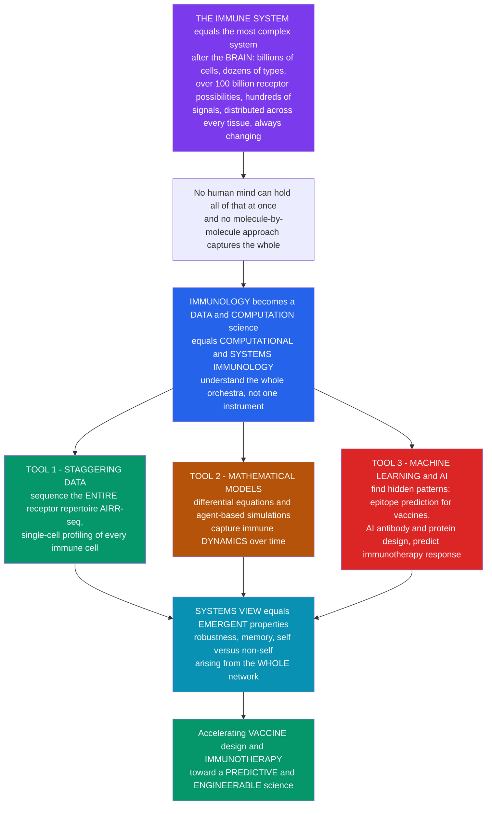

# 🖥️ Computational and Systems Immunology

> [!abstract] TL;DR
> The immune system is arguably **the most complex system in the body after the brain**: billions of cells of dozens of types, each carrying one receptor drawn from a repertoire of **over a hundred billion possibilities**, all talking through hundreds of signals, spread across every tissue, and constantly changing. **No human mind can hold all of that at once**, and no molecule-by-molecule, reductionist approach can capture how it behaves as a whole — so immunology has increasingly become a **data and computation science**. **Computational and systems immunology** uses three tools to understand immunity as an integrated whole: (1) **staggering data** — we can now sequence a person's *entire* antibody/T-cell receptor repertoire (**AIRR-seq**, millions of receptors) and profile every gene in single immune cells; (2) **mathematical models** — differential equations and agent-based simulations that capture immune *dynamics* — how an infection unfolds, how memory forms, how tolerance is held; and (3), increasingly dominant, **machine learning and AI** that find patterns humans cannot — predicting which viral peptides will be presented and make good vaccine targets (**epitope prediction**), designing better antibodies and immunogens (AlphaFold-era protein design), and forecasting who will respond to immunotherapy. "Systems" also means studying **emergent** behavior — how robustness, memory, and self/non-self discrimination arise from the *network as a whole*, not any single part. This computational turn already powered the mRNA vaccine revolution and is transforming immunology from a descriptive into a **predictive, engineerable** science. *(Educational overview at textbook level — not individual medical advice.)*

---

## Intuition

**Analogy first — from studying one instrument to hearing the whole orchestra.** For a century immunology advanced the way a curious listener might learn music by studying one instrument at a time: isolate a cell type, characterize a single molecule, work out one pathway. That reductionist approach built the field — but it runs into a wall. The immune system is not a violin; it is a **full symphony orchestra of billions of players**. There are dozens of cell types, and every B or T cell carries a *different* antigen receptor pulled from a repertoire of **over a hundred billion** possible shapes. Those cells communicate through **hundreds of signaling molecules**, they are **distributed** across every tissue in the body, and the whole ensemble is **constantly changing** — expanding, contracting, differentiating, remembering. No human mind can hold that in view at once. You cannot understand a symphony by describing one oboe.

So immunology has quietly become a **data and computation science**. **Computational and systems immunology** is the discipline that studies the immune system as an *integrated whole* using mathematics, big data, and artificial intelligence — an attempt to hear the whole orchestra rather than transcribe a single part. Three tools drive it. **First, staggering data.** We can now read out the immune system's full state: sequence the *entire* antibody and T-cell receptor repertoire of a person — millions of receptors, a technique called **AIRR-seq** — and profile every expressed gene in *single* immune cells, measuring hundreds of features per cell. **Second, mathematical models.** Differential equations and agent-based simulations capture immune *dynamics*: how a pathogen and the response chase each other over time, how a response is regulated, how memory is laid down, how tolerance is maintained. **Third — and increasingly the loudest instrument — machine learning and AI.** These find patterns no human could: predicting which viral peptides will be **presented on MHC** and become good vaccine targets (**epitope prediction**), designing better antibodies and immunogens (AlphaFold-era protein design), predicting who will respond to a checkpoint inhibitor, and even engineering entirely new immune therapies.

"**Systems** immunology" carries one more idea: **emergence**. Properties like robustness, immunological memory, and self/non-self discrimination are not stored in any single molecule — they *emerge* from the interactions of the whole network, the same way a flock's shape emerges from simple rules followed by many birds. This computational turn is accelerating everything downstream — the mRNA COVID vaccines leaned heavily on it — and it is edging the field toward its long-standing dream: to *predict and control* immune responses. To understand computational and systems immunology is to understand how immunology is being transformed, by data and AI, from a science that *describes* the immune system into one that can *predict and engineer* it.

---

## How It Works

### Core Mechanics

1. **The motivation — complexity beyond intuition.** The immune system spans multiple scales (molecular → cellular → tissue → organism → population), holds a receptor repertoire greater than **10¹¹** specificities generated by V(D)J recombination, uses **combinatorial cytokine signaling**, is **spatially distributed**, and is **temporally dynamic**. This multi-scale, high-dimensional character exceeds what one-molecule-at-a-time reasoning can integrate — motivating **quantitative, data-driven, systems** approaches.
2. **Tool 1 — the data revolution (high-throughput immune profiling).** **AIRR-seq** sequences the rearranged BCR/TCR loci to read out **millions of receptors** at once (clonality, diversity, clone tracking). **Single-cell sequencing** (scRNA-seq, CITE-seq) resolves immune-cell *states* and heterogeneity. **Mass and flow cytometry** (CyTOF) measure dozens of markers per cell. **Spatial transcriptomics** and **multiplexed imaging** preserve tissue architecture, and **systems serology** profiles antibody function — collectively the *Human Immunology Project's* vision of immune "phenotyping."
3. **Tool 2 — mathematical and computational modeling.** **Differential-equation** models capture infection kinetics, response magnitude, and memory decay. **Agent-based and stochastic** models simulate individual cells and their local interactions. **Network and pathway** models describe signaling and regulation. These formalize clonal selection, affinity maturation, tolerance, and host-pathogen dynamics as *equations you can run*.
4. **Tool 3 — machine learning and AI (the accelerating frontier).** **Epitope / MHC-binding prediction** (immunoinformatics, e.g., NetMHCpan) ranks which peptides are presented — the workhorse behind vaccine and neoantigen design. **Antibody and protein design** uses structure prediction (**AlphaFold**) and generative models to engineer immunogens and antibodies. **Response prediction** stratifies who benefits from immunotherapy. Deep models also classify cell states, deconvolve bulk data, and predict TCR-antigen specificity.
5. **The systems view — emergence.** Robustness, memory, homeostasis, and self/non-self discrimination are **emergent properties** of the interacting network, not of any single component. Systems immunology asks how these arise from feedback, redundancy, and multi-scale organization — the immune system studied as a **complex adaptive system**.
6. **The payoff and the challenges.** Applications include reverse/structural vaccinology (and the mRNA era), precision immunotherapy, disease modeling, and pandemic response. The open problems are **data integration and standardization**, **model validation and interpretability**, distinguishing **causation from correlation**, and closing the gap between elegant models and messy biology — en route to a predictive, engineerable immunology.

### Flow / Architecture



---

## Key Concepts

### Secondary (the big picture)

- **Too complex to hold in your head.** After the brain, the immune system is the body's most complicated system — billions of cells, each with its own unique receptor out of more than a hundred billion possibilities. You cannot understand it one molecule at a time, so scientists now use **computers, big data, and AI**.
- **Three tools.** (1) **Read the whole thing** — sequence a person's entire receptor library and profile single cells; (2) **model it** — use math to simulate how an infection and the response play out over time; (3) **learn from it** — let AI spot patterns humans miss, like which virus pieces make good **vaccine** targets.
- **The whole is more than the parts.** Memory, robustness, and the ability to tell "self" from "invader" are not written in any one cell — they **emerge** from the whole network working together, like a flock's shape emerging from many birds.
- **Why it matters.** This is how the **mRNA COVID vaccines** were designed so fast, and it is turning immunology into a science that can *predict* what the immune system will do.

### Undergraduate (the tools and methods)

- **The data layer.**

| Technology | What it measures | Systems use |
|---|---|---|
| **AIRR-seq** | millions of BCR/TCR sequences (CDR3) | clonality, diversity, clone tracking |
| **scRNA-seq / CITE-seq** | whole transcriptome + surface protein, per cell | cell states, heterogeneity |
| **CyTOF / flow** | dozens of markers per cell | immune phenotyping |
| **Spatial / multiplexed imaging** | gene/protein expression *in situ* | tissue architecture |

- **Modeling immune dynamics.** A within-host model tracks **pathogen ↔ effector ↔ memory** as coupled differential equations, reproducing the spike-and-clear of a primary response, the slow accumulation of memory, and the faster, larger **secondary response** on re-challenge — the quantitative face of immunological memory.
- **Epitope prediction is a classifier.** Given a peptide's features (anchor residues at key positions, hydrophobicity), a model predicts the probability it **binds MHC and is presented**. Performance is judged by an **ROC curve** and its area (AUC) — the same evaluation used across machine-learning classification.
- **Repertoire diversity metrics.** From AIRR-seq clone frequencies you compute **Shannon diversity** and **clonality** (`1 − normalized entropy`): a healthy repertoire is broad and polyclonal; a **lymphoma** collapses to a dominant clone (high clonality) — a diagnostic read-out.
- **AI protein design.** Structure predictors (**AlphaFold**) and generative models design antibodies and stabilized immunogens *in silico*, compressing what used to take years of wet-lab iteration.

### Graduate (the integration and its subtleties)

- **Multi-scale integration.** The hard problem is *linking* scales: molecular binding affinities → single-cell states → clonal population dynamics → tissue-level responses → population immunity. No single model spans all scales; the field stitches together specialized models and multi-omics data, which raises acute **data-integration and standardization** problems.
- **Diversity estimation is statistically deep.** A blood draw samples only a fraction of a >10¹¹ repertoire, so measured diversity is a **rarefaction/undersampling** estimate; naive clone counts are biased by sequencing depth and PCR/UMI artifacts. Diversity indices (Shannon, Simpson, Hill numbers) and clonality must be interpreted against sampling.
- **Epitope prediction, honestly.** Binding to MHC is *necessary but not sufficient* for immunogenicity: presentation, TCR recognition, precursor frequency, and tolerance all intervene. High MHC-binding AUC does not equal a protective epitope — a core reason vaccine candidates still need experimental validation.
- **Emergence versus reductionism.** Robustness and self/non-self discrimination are **network-level** properties; perturbing one node rarely reproduces the systemic phenotype (degeneracy and redundancy). This is why systems immunology borrows from **complex-adaptive-systems** theory rather than pathway diagrams alone.
- **Causality versus correlation.** High-dimensional immune data are riddled with confounding (age, prior exposure, batch). Predictive models can be accurate yet non-causal; translating a biomarker into a *mechanism* or *intervention* demands perturbation experiments and causal-inference discipline.
- **Toward engineerable immunity.** The endgame is *design*: computationally specify a repertoire, an immunogen, or a cell therapy and predict the response — the bridge from systems immunology to **immunoengineering**, where CAR-T constructs and designed vaccines are treated as engineering problems.

---

## Python Demo

Three faces of computational immunology in one figure: **(a) an epitope-prediction / MHC-binding classifier** — a hand-rolled logistic-regression model that, from peptide anchor-residue features, predicts which peptides bind MHC and are presented, evaluated with a hand-computed **ROC curve and AUC** (the workhorse behind computational vaccine and neoantigen design); **(b) an immune-dynamics ODE** — a within-host **pathogen ↔ effector ↔ memory** model integrated by hand, showing a primary infection cleared slowly and a **faster, smaller secondary response** when memory is present; and **(c) an immune-repertoire diversity analysis** — a rank-abundance plot with **Shannon diversity** and **clonality** contrasting a healthy polyclonal repertoire against a lymphoma-like clonal one.

```python
# Computational & systems immunology in three panels (numpy + matplotlib only):
#   (a) EPITOPE PREDICTION: hand-rolled logistic-regression MHC-binding
#       classifier on synthetic peptides, evaluated by a hand-built ROC/AUC.
#   (b) IMMUNE DYNAMICS: a within-host pathogen/effector/memory ODE (Euler),
#       primary vs faster secondary response (immunological memory).
#   (c) REPERTOIRE DIVERSITY: rank-abundance + Shannon diversity & clonality
#       for a healthy polyclonal vs a lymphoma-like clonal repertoire.
import numpy as np
import matplotlib.pyplot as plt

rng = np.random.default_rng(7)
sigmoid = lambda z: 1.0 / (1.0 + np.exp(-z))

# ============================================================
# (a) EPITOPE / MHC-BINDING PREDICTION
# Peptides are 9-mers; MHC class I likes a hydrophobic anchor at position 2
# and a specific C-terminal (position 9) anchor. Features: P2 anchor match,
# P9 anchor match, mean hydrophobicity. "True" binding follows a ground-truth
# logistic rule (+noise); we then TRAIN a classifier and score it with ROC/AUC.
# ============================================================
amino = list("ACDEFGHIKLMNPQRSTVWY")
p2_anchor = set("LMIV")                 # favoured residues at position 2
p9_anchor = set("VLIK")                 # favoured residues at C-terminus
hydro = {a: h for a, h in zip(amino,    # crude hydrophobicity scale
         rng.uniform(-1, 1, size=len(amino)))}
for a in "AILMFVWY": hydro[a] = abs(hydro[a]) + 0.5   # make these hydrophobic

def make_peptides(n):
    peps = ["".join(rng.choice(amino, size=9)) for _ in range(n)]
    x1 = np.array([1.0 if p[1] in p2_anchor else 0.0 for p in peps])   # P2 anchor
    x2 = np.array([1.0 if p[8] in p9_anchor else 0.0 for p in peps])   # P9 anchor
    x3 = np.array([np.mean([hydro[r] for r in p]) for p in peps])      # hydrophobicity
    X = np.column_stack([x1, x2, x3])
    # ground-truth immunogenicity: anchors dominate, hydrophobicity helps
    true_logit = 2.6 * x1 + 2.2 * x2 + 1.2 * x3 - 3.2
    y = (rng.random(n) < sigmoid(true_logit)).astype(float)            # noisy labels
    return X, y

Xtr, ytr = make_peptides(1500)
Xte, yte = make_peptides(1500)

# standardise features, then hand-rolled logistic regression via gradient descent
mu, sd = Xtr.mean(0), Xtr.std(0) + 1e-9
Xtr_s, Xte_s = (Xtr - mu) / sd, (Xte - mu) / sd
Xb = np.column_stack([np.ones(len(Xtr_s)), Xtr_s])
w = np.zeros(Xb.shape[1])
for _ in range(4000):
    grad = Xb.T @ (sigmoid(Xb @ w) - ytr) / len(ytr)
    w -= 0.3 * grad

scores = sigmoid(np.column_stack([np.ones(len(Xte_s)), Xte_s]) @ w)

# hand-built ROC curve and AUC (trapezoid), no sklearn
ths = np.linspace(1, 0, 200)
P, Nneg = yte.sum(), (1 - yte).sum()
tpr = np.array([np.sum((scores >= t) & (yte == 1)) / P    for t in ths])
fpr = np.array([np.sum((scores >= t) & (yte == 0)) / Nneg for t in ths])
auc = np.trapz(tpr, fpr)

# ============================================================
# (b) IMMUNE DYNAMICS: pathogen (P), effector (E), memory (M)
# dP = rP(1-P/Kp) - k E P         pathogen grows, killed by effectors
# dE = a P/(P+h) (E + boost) - dE + s   effectors expand on antigen, decay
# dM = c E - m M                  memory accumulates from effectors, long-lived
# "boost" = gamma*M only if memory participates -> faster secondary response.
# ============================================================
def run(with_memory):
    steps, dt = 4000, 0.05
    P, E, M = (np.zeros(steps) for _ in range(3))
    P[0], E[0], M[0] = 1.0, 1.0, 0.0
    r, Kp, k = 0.9, 1.0e4, 0.05
    a, h, d, s = 0.8, 100.0, 0.20, 0.10
    c, m, gamma = 0.03, 0.003, 3.0
    rechallenge = 2000                         # second identical inoculation
    for t in range(steps - 1):
        boost = gamma * M[t] if with_memory else 0.0
        dP = r * P[t] * (1 - P[t] / Kp) - k * E[t] * P[t]
        dE = a * P[t] / (P[t] + h) * (E[t] + boost) - d * E[t] + s
        dM = c * E[t] - m * M[t]
        P[t + 1] = max(P[t] + dP * dt, 0.0)
        E[t + 1] = max(E[t] + dE * dt, 0.0)
        M[t + 1] = max(M[t] + dM * dt, 0.0)
        if t == rechallenge:
            P[t + 1] += 1.0
    return np.linspace(0, steps * dt, steps), P, E, M

tt, P_mem, E_mem, M_mem = run(with_memory=True)
_,  P_nai, _,     _     = run(with_memory=False)

# ============================================================
# (c) REPERTOIRE DIVERSITY: healthy polyclonal vs lymphoma-like clonal
# ============================================================
def diversity(freq):
    p = freq[freq > 0] / freq.sum()
    H = -np.sum(p * np.log(p))                 # Shannon entropy
    return H, 1 - H / np.log(len(p))           # (diversity, clonality)

healthy = rng.lognormal(0.0, 1.0, size=2000)   # many clones, fairly even
clonal  = rng.lognormal(0.0, 1.0, size=2000)
clonal[0] *= 250.0                             # one dominant malignant clone
H_h, C_h = diversity(healthy)
H_c, C_c = diversity(clonal)
rank_h = np.sort(healthy / healthy.sum())[::-1]
rank_c = np.sort(clonal  / clonal.sum())[::-1]

# ============================================================
# Plots
# ============================================================
fig, (axA, axB, axC) = plt.subplots(1, 3, figsize=(18, 5.4))

# (a) ROC
axA.plot(fpr, tpr, color="#2563eb", lw=2.6, label=f"epitope classifier (AUC={auc:.2f})")
axA.plot([0, 1], [0, 1], color="#9ca3af", ls="--", lw=1.2, label="random (AUC=0.50)")
axA.set_xlabel("false positive rate"); axA.set_ylabel("true positive rate")
axA.set_title("(a) Epitope / MHC-binding prediction\nhand-rolled classifier, ROC evaluation")
axA.legend(loc="lower right", fontsize=9); axA.grid(alpha=0.25)

# (b) immune dynamics
axB.plot(tt, P_mem, color="#dc2626", lw=2.4, label="pathogen (with memory)")
axB.plot(tt, P_nai, color="#f59e0b", lw=2.0, ls="--", label="pathogen (no memory, naive)")
axB.plot(tt, M_mem, color="#2563eb", lw=2.0, label="memory cells")
axB.axvline(2000 * 0.05, color="#6b7280", ls=":", lw=1)
axB.text(2000 * 0.05 + 1, axB.get_ylim()[1] * 0.9, "re-challenge",
         fontsize=8, color="#374151")
axB.set_xlabel("time"); axB.set_ylabel("population (a.u.)")
axB.set_title("(b) Within-host dynamics: memory drives a\nfaster, smaller secondary response")
axB.legend(loc="upper right", fontsize=8); axB.grid(alpha=0.25)

# (c) repertoire rank-abundance
axC.loglog(np.arange(1, len(rank_h) + 1), rank_h, color="#059669", lw=2.2,
           label=f"healthy: diversity={H_h:.2f}, clonality={C_h:.2f}")
axC.loglog(np.arange(1, len(rank_c) + 1), rank_c, color="#dc2626", lw=2.2,
           label=f"lymphoma-like: diversity={H_c:.2f}, clonality={C_c:.2f}")
axC.set_xlabel("clone rank"); axC.set_ylabel("clone frequency")
axC.set_title("(c) Immune-repertoire diversity (AIRR-seq)\nrank-abundance, Shannon & clonality")
axC.legend(loc="lower left", fontsize=8); axC.grid(alpha=0.25, which="both")

plt.tight_layout()
plt.savefig("computational_systems_immunology.png", dpi=120)
plt.show()

# ============================================================
# Quantify
# ============================================================
print("EPITOPE PREDICTION")
print(f"  learned weights [bias, P2, P9, hydro] = {w.round(2)}")
print(f"  test AUC = {auc:.3f}")
print("\nIMMUNE DYNAMICS (peak pathogen load)")
print(f"  primary peak   = {P_mem[:2000].max():,.0f}")
print(f"  secondary peak (with memory) = {P_mem[2000:].max():,.0f}")
print(f"  secondary peak (no memory)   = {P_nai[2000:].max():,.0f}")
print("\nREPERTOIRE DIVERSITY")
print(f"  healthy:  Shannon={H_h:.2f}  clonality={C_h:.2f}")
print(f"  lymphoma: Shannon={H_c:.2f}  clonality={C_c:.2f}")
```

**What it shows.** Panel **(a)** is computational vaccine design in miniature: from three interpretable peptide features the classifier learns that the **anchor residues dominate** (largest weights), and the **ROC curve bows toward the top-left** with an AUC well above the 0.50 diagonal — exactly how tools like NetMHCpan are benchmarked. Panel **(b)** is immunological memory made quantitative: the naive secondary response (dashed) mounts a large pathogen peak again, while the **memory-equipped** response (solid red) is **smaller and cleared faster** because pre-existing memory cells (blue) boost effector recruitment — the integrated system behavior that no single molecule encodes. Panel **(c)** turns AIRR-seq into a diagnostic: the healthy repertoire is **broad and even** (high Shannon diversity, low clonality), whereas the **lymphoma-like** repertoire is dominated by one clone (a flat top-rank, **low diversity, high clonality**) — the collapse a clinician reads as clonality.

---

## Real-World Applications

> **Epitope prediction for vaccine and neoantigen design.** Tools such as **NetMHCpan** predict which peptides bind a person's MHC alleles and get presented — narrowing millions of candidate peptides to a shortlist of likely T-cell targets. This is the computational backbone of **cancer neoantigen vaccines** (predicting patient-specific mutated epitopes) and rational vaccine antigen selection, exactly the classifier logic of Panel (a) at genome scale.

> **The mRNA vaccine revolution.** The speed of the COVID-19 mRNA vaccines rested on computation: the SARS-CoV-2 sequence was published, the spike antigen was chosen and **stabilized by structural/computational design** (the proline "2P" mutations), and the mRNA was designed *in silico* — no pathogen needed to be cultured. Computational immunology compressed antigen design from years to days.

> **AI antibody and protein design.** **AlphaFold** and generative protein models predict and design antibody structures, engineer stabilized immunogens, and propose binders — accelerating therapeutic **monoclonal antibody** discovery and structure-based ("reverse/structural") vaccinology, and feeding directly into immunoengineering pipelines.

> **Immune-repertoire sequencing in the clinic.** **AIRR-seq** of the BCR/TCR loci detects the dominant clone in **lymphoma/leukemia**, tracks **minimal residual disease** after therapy, and quantifies how a vaccine or infection reshapes the repertoire — the diversity/clonality analysis of Panel (c) applied to real patients.

> **Predicting immunotherapy response.** Machine-learning models integrating tumor mutational burden, an interferon-γ gene signature, single-cell states, and TCR features aim to forecast which patients will respond to **checkpoint inhibitors** — stratifying therapy and sparing non-responders toxicity.

> **Pandemic response and systems serology.** During COVID-19, systems-immunology pipelines profiled antibody function (systems serology), mapped single-cell immune states across severity, and modeled within-host and population dynamics — feeding both therapeutic and public-health decisions.

---

## Common Pitfalls

- **"MHC binding equals a good vaccine epitope."** Binding is *necessary but not sufficient*. Presentation, TCR recognition, precursor frequency, and tolerance all intervene, so a high-AUC binding predictor still yields many non-immunogenic hits. Computational shortlists must be **experimentally validated** — the model narrows the search, it does not end it.
- **"Measured repertoire diversity is the true diversity."** A blood sample captures a tiny fraction of a >10¹¹ repertoire, and depth, PCR bias, and UMI handling distort clone counts. Diversity and clonality are **sampling-dependent estimates**; compare only like-processed data and account for rarefaction.
- **"More features and a bigger model always win."** High-dimensional immune data are small-n, large-p and full of **batch effects and confounders** (age, prior exposure, processing site). Without careful validation, models overfit and learn the batch, not the biology — accuracy without generalization.
- **"A predictive biomarker is a mechanism."** ML can be accurate yet **non-causal**. An immune signature that predicts response may be a bystander; turning correlation into a druggable mechanism needs perturbation and causal-inference discipline, not just AUC.
- **"Systems immunology replaces experiments."** It **reprioritizes** them. Models and predictions generate hypotheses that still require wet-lab and clinical validation; the value is a tighter, faster loop between computation and experiment, not the removal of the bench.
- **"Emergent properties can be read off single molecules."** Robustness, memory, and self/non-self discrimination arise from the **network**; knocking out one node rarely reproduces the systemic phenotype because of redundancy and degeneracy. Reductionist intuition systematically underestimates emergence.

---

## Related Concepts

This note sits in the **Immunology** vault's *Vaccines, Immunotherapy and Frontiers* section and frames how the whole field is being reshaped by data and AI. Its sibling notes — referenced here **in prose** — supply the biology it computes on: *Generation of Receptor Diversity (V(D)J Recombination)* explains the >10¹¹ repertoire that AIRR-seq reads out; *Antigen Processing and Presentation* is the biology that **epitope-prediction** models approximate; *Vaccines and Vaccine Technology* is the primary beneficiary of computational antigen design and the mRNA era; *Immunoengineering and CAR-T Cells* is where prediction becomes **design**; and *The Reach and Future of Immunology* places this computational turn in the arc of the field. The dynamics model draws on *Clonal Selection and Immunological Memory* and *Cytokines and Immune Signaling*, and the immunotherapy-response application connects to *Tumor Immunology and Immune Evasion*.

Cross-vault connections (Glob-verified to exist):

- [[AI-ML/01_Classical_ML/Supervised/Logistic_Regression|Logistic Regression]] — the exact classifier hand-rolled in Panel (a); epitope prediction is a supervised classification problem.
- [[AI-ML/01_Classical_ML/Evaluation/ROC_and_AUC|ROC and AUC]] — how binding/immunogenicity predictors are benchmarked, the evaluation built by hand in the demo.
- [[Systems_Thinking_and_Complexity/02_Complexity_and_Emergence/Complex_Adaptive_Systems|Complex Adaptive Systems]] — the framework for treating the immune system as an integrated, adaptive whole rather than a parts list.
- [[Systems_Thinking_and_Complexity/02_Complexity_and_Emergence/Emergence_and_Self_Organization|Emergence and Self-Organization]] — why robustness, memory, and self/non-self discrimination are network-level, not molecular, properties.
- [[Systems_Thinking_and_Complexity/04_Dynamics_and_Modeling/Agent_Based_Modeling|Agent-Based Modeling]] — the cell-level simulation approach complementary to the ODE model in Panel (b).
- [[Genetics/06_Evolutionary_and_Systems_Genetics/Single_Cell_Genomics_and_Multi_Omics|Single-Cell Genomics and Multi-Omics]] — the single-cell profiling that captures immune-cell states and heterogeneity.
- [[Genetics/03_Genomics_and_Bioinformatics/DNA_Sequencing_Technologies|DNA Sequencing Technologies]] — the high-throughput sequencing that makes AIRR-seq and repertoire analysis possible.
- [[Genetics/03_Genomics_and_Bioinformatics/Bioinformatics_Algorithms_and_Sequence_Analysis|Bioinformatics Algorithms and Sequence Analysis]] — the sequence-analysis toolkit underlying immunoinformatics.
- [[Biophysics/02_Molecular_Biophysics/Protein_Structure_and_Folding|Protein Structure and Folding]] — the structural biology that AlphaFold-era AI predicts, enabling antibody and immunogen design.

---

## Review Questions

1. **(Secondary)** The immune system has billions of cells and a receptor repertoire of over a hundred billion possibilities. Explain, in your own words, why studying it "one molecule at a time" is not enough, and name the three tools computational and systems immunology uses instead.
2. **(Undergraduate)** Epitope prediction is set up as a classification problem. What are the inputs (features) and the output, and why is an **ROC curve / AUC** the right way to judge such a model rather than plain accuracy?
3. **(Undergraduate scenario)** An AIRR-seq run on a patient's blood returns a repertoire with **very low Shannon diversity and very high clonality** — one clone accounts for most sequences. What does this pattern suggest clinically, and how does it differ from a healthy polyclonal repertoire on a rank-abundance plot?
4. **(Graduate)** A deep-learning model predicts checkpoint-inhibitor response with high AUC on one hospital's data but fails at another. List two reasons rooted in the nature of high-dimensional immune data, and explain why a **predictive biomarker is not automatically a mechanism**.
5. **(Graduate trade-off)** "Systems immunology will make wet-lab immunology obsolete." Argue against this. In your answer, distinguish what computation does well (hypothesis generation, prioritization, design) from where experiments remain essential (validation, causality, emergent behavior), using **epitope prediction** and **emergence** as examples.

---

## Sources

- Davis, M.M., Tato, C.M. & Furman, D. (2017). "Systems immunology: just getting started." *Nature Immunology* 18(7): 725–732. https://doi.org/10.1038/ni.3768
- Germain, R.N., Meier-Schellersheim, M., Nita-Lazar, A. & Fraser, I.D.C. (2011). "Systems biology in immunology: a computational modeling perspective." *Annual Review of Immunology* 29: 527–585. https://doi.org/10.1146/annurev-immunol-030409-101317
- Reynisson, B., Alvarez, B., Paul, S., Peters, B. & Nielsen, M. (2020). "NetMHCpan-4.1 and NetMHCIIpan-4.0: improved predictions of MHC antigen presentation." *Nucleic Acids Research* 48(W1): W449–W454. https://doi.org/10.1093/nar/gkaa379
- Greiff, V., Miho, E., Menzel, U. & Reddy, S.T. (2015). "Bioinformatic and statistical analysis of adaptive immune repertoires." *Trends in Immunology* 36(11): 738–749. https://doi.org/10.1016/j.it.2015.09.006
- Jumper, J. et al. (2021). "Highly accurate protein structure prediction with AlphaFold." *Nature* 596: 583–589. https://doi.org/10.1038/s41586-021-03819-2

---

#immunology #systems-immunology #computational-immunology #epitope-prediction #immune-repertoire
