# 🧬 Immunoengineering and CAR-T Cells

> [!abstract] TL;DR
> **What if, instead of merely *unleashing* a patient's immune cells with checkpoint inhibitors or *handing* them antibodies, we could genetically REPROGRAM their own immune cells into custom-built living drugs that hunt and kill cancer?** That is **immunoengineering** — the application of synthetic biology and engineering to redesign immune cells and molecules — and its flagship triumph is **CAR-T cell therapy**. Doctors extract a patient's own **T cells**, then in the lab insert a synthetic gene for a **chimeric antigen receptor (CAR)**: a fusion molecule that is *part antibody* (a single-chain fragment, or **scFv**, that recognizes a specific surface molecule on the cancer cell — classically **CD19** on B-cell leukemias) and *part T-cell activation machinery* (the **CD3ζ** signaling chain plus a costimulatory domain like **CD28** or **4-1BB** that commands the cell to KILL). It is a genetically installed guided-missile targeting system bolted onto the patient's own killer cells — and, crucially, the CAR recognizes its target **directly**, bypassing the **MHC restriction** that tumors love to escape by downregulating their MHC. These engineered cells are expanded into an army of millions and reinfused, where — being *living* cells — they **multiply, kill, and persist for years**, offering potential one-time cures. In refractory blood cancers (B-cell **ALL**, lymphomas, and — via **BCMA** — multiple myeloma) the remissions have been miraculous. But the dangers are real: a proliferating army of activated killers can trigger a massive **cytokine release syndrome (CRS)** or **neurotoxicity (ICANS)**, the therapy is astronomically expensive and bespoke, and **solid tumors** remain largely unconquered. The frontier pushes toward solid tumors, "off-the-shelf" allogeneic products, and even **autoimmunity**. Immunoengineering is the cutting edge where we no longer merely *use* the immune system — we *redesign* it. *(Educational immunology at textbook level — not individual medical advice.)*

---

## Intuition

**Analogy first — from *unleashing* soldiers to *building custom war machines*.** Two earlier chapters of immunotherapy each borrow the immune system as-is. **Checkpoint inhibitors** *release the brakes* on a patient's existing T cells — you unleash the soldiers you already have. **Monoclonal antibodies** *hand the patient a weapon* — a factory-made targeting molecule that flags cancer cells for destruction. Immunoengineering asks a bolder question: what if, instead of unleashing or supplying, we **genetically rebuild the soldier itself** — take a patient's own T cell and weld a custom-designed targeting system directly into its DNA, turning it into a living, self-replicating guided missile?

Here is the astonishing procedure that answers it. Doctors draw blood and **extract the patient's own T cells**. In the lab, they insert a synthetic gene encoding a **chimeric antigen receptor** — a *chimera* because it fuses two things that never naturally occur together. The outward-facing half is borrowed from an **antibody**: a small fragment that clamps onto one specific molecule on the cancer's surface, say **CD19**, a protein studded across B-cell leukemia cells. The inward-facing half is the T cell's own **activation machinery**: the signaling wiring that, when the outer half grabs its target, screams *KILL*. Bolt those two halves together across the cell membrane and you have installed a molecular guided-missile system into a living killer cell.

The genius of the design is what it *skips*. A normal T cell can only see its target as a peptide displayed inside an **MHC** molecule — the cell's "ID badge holder." Tumors exploit this by **downregulating their MHC**, hiding the incriminating evidence so no T cell can read it. The CAR **bypasses MHC entirely**: like an antibody, it binds the intact surface molecule *directly*, no badge required. This is an elegant end-run around one of the tumor's favorite escape tricks.

These engineered CAR-T cells are then grown into an **army of millions** and infused back into the patient — and because they are *living cells*, the story does not end at the dose. They **multiply** in response to the cancer, **kill**, and then a subset **persists** for years as memory cells, a self-amplifying "living drug" that can act as a potential *one-time cure*. In certain blood cancers the results have been the stuff of miracles: patients with weeks to live achieving complete, durable remissions. But unleashing a proliferating army of activated killers is not without peril — the sudden mass killing and expansion can ignite a systemic **cytokine storm** or brain-swelling **neurotoxicity**, and manufacturing a bespoke therapy for each individual patient is staggeringly complex and expensive. The unsolved frontier is the **solid tumor**, along with cheaper "off-the-shelf" versions and applications far beyond cancer. To understand immunoengineering and CAR-T is to understand the frontier of medicine — where we stop merely borrowing the immune system and start *rebuilding* it.

---

## How It Works

### Core Mechanics

1. **Immunoengineering — the framing.** Immunoengineering applies **engineering and synthetic biology** to *design, build, and control* immune cells and molecules for therapy: "living drugs," engineered receptors, synthetic immune circuits. Rather than modulating the immune system pharmacologically, it **rewires the cells themselves** at the genetic level.
2. **Adoptive cell therapy — the broader category.** CAR-T sits inside **adoptive cell transfer (ACT)**: harvesting immune cells, manipulating or expanding them *ex vivo*, and transferring them into a patient. The family spans **tumor-infiltrating lymphocytes (TILs)** — a patient's own tumor-reactive T cells grown to huge numbers — **TCR-engineered T cells** (given a new *natural* T-cell receptor against a chosen antigen), and **CAR-T** (given a fully *synthetic* receptor).
3. **The chimeric antigen receptor — anatomy of a fusion.** A CAR is a single synthetic protein with three parts:
   - **Extracellular antigen-binding domain** — an antibody-derived **single-chain variable fragment (scFv)** that recognizes a chosen **tumor surface antigen** (e.g., **CD19** for B-cell malignancies, **BCMA** for myeloma).
   - **Transmembrane / hinge domain** — anchors the receptor in the membrane and sets its geometry.
   - **Intracellular signaling domains** — the **CD3ζ** chain (the T cell's core "activate" signal, *Signal 1*) plus one or more **costimulatory domains** — **CD28** or **4-1BB** (*Signal 2*, driving proliferation and persistence).
4. **The "generations" of CARs.** *First generation* had **CD3ζ only** — poor persistence. *Second generation* added **one costimulatory domain (CD28 or 4-1BB)** — the current clinical workhorse; CD28 gives faster, more explosive killing, 4-1BB gives slower onset but longer persistence. *Third generation* combines **two** costimulatory domains; *fourth generation* ("armored"/TRUCK) CARs also secrete cytokines or carry logic gates.
5. **The key advantage — MHC-independent recognition.** A natural TCR only sees **peptide presented on MHC**. The CAR's scFv binds **intact surface antigen directly**, like an antibody — so it **bypasses MHC restriction and antigen processing entirely**. This defeats the common tumor escape strategy of **MHC-I downregulation**, and it lets one CAR construct work across all patients regardless of their MHC (HLA) type.
6. **The procedure — an end-to-end manufacturing pipeline.**
   - **Leukapheresis** — collect the patient's T cells from blood.
   - **Genetic engineering** — transduce the CAR gene, usually with a **lentiviral/retroviral vector** or increasingly non-viral / transposon / CRISPR-knock-in methods.
   - **Ex-vivo expansion** — grow the engineered cells into hundreds of millions.
   - **Lymphodepletion** — a brief chemotherapy that empties the host niche and removes suppressive cells so the graft can expand.
   - **Infusion** — the CAR-T product is returned to the patient.
   - **In-vivo expansion, killing, and persistence** — the cells proliferate against antigen, clear the tumor, then contract to a persisting memory pool. This *self-amplification* is what makes CAR-T a "living drug," not a fixed dose.
7. **The results and approvals.** Dramatic, **durable remissions** in refractory **B-cell acute lymphoblastic leukemia (ALL)**, aggressive **B-cell lymphomas**, and — targeting **BCMA** — **multiple myeloma**. Multiple **CD19** and **BCMA** CAR-T products are FDA-approved, with a genuine prospect of **one-time cures** in patients who had exhausted every other option.
8. **The toxicities and challenges.**
   - **Cytokine release syndrome (CRS)** — a massive **cytokine storm** driven by CAR-T activation, expansion, and tumor lysis; correlated with **tumor burden**; managed by blocking **IL-6** with **tocilizumab** and by steroids.
   - **Immune-effector-cell-associated neurotoxicity syndrome (ICANS)** — confusion, aphasia, seizures, cerebral edema.
   - **On-target/off-tumor toxicity** — the antigen is also on some healthy tissue (e.g., CD19 on normal B cells → **B-cell aplasia**).
   - **Antigen-escape relapse** — the tumor loses the target antigen (e.g., **CD19-negative** variants) under selective pressure.
   - **Limited persistence** and **manufacturing complexity/cost** — a bespoke, autologous, weeks-long, six-figure product.
9. **The frontiers.** Extending to **solid tumors** (the hard problem: antigen heterogeneity, the immunosuppressive microenvironment, poor trafficking); **"off-the-shelf" allogeneic** (universal-donor, gene-edited) CAR-T; **CRISPR-engineered**, **"armored,"** and **logic-gated (AND/NOT)** CARs; **CAR-NK** and **CAR-macrophages**; **safety switches** (suicide genes); **in-vivo** CAR generation; and CAR-T **beyond cancer** — resetting the immune system in **autoimmunity** (CD19 CAR-T inducing drug-free remission in lupus), plus fibrosis, infection, and senescence.

### Flow / Architecture

```mermaid
graph TD
    REPROG["Do not just UNLEASH or SUPPLY immune cells -<br/>genetically REPROGRAM them into LIVING DRUGS<br/>equals IMMUNOENGINEERING"]
    FLAG["Flagship equals CAR-T CELL THERAPY"]
    EXTRACT["Extract the patient's OWN T cells from blood<br/>via leukapheresis"]
    ENG["ENGINEER them - insert a synthetic gene for a<br/>CHIMERIC ANTIGEN RECEPTOR - the CAR"]
    CAR["CAR equals part ANTIBODY - an scFv that recognizes a<br/>cancer molecule like CD19 - plus part T-CELL<br/>ACTIVATION machinery - CD3-zeta plus CD28 or 4-1BB<br/>that says KILL"]
    MISSILE["A genetically-installed guided-missile<br/>targeting system bolted onto killer cells"]
    MHC["CAR recognizes the target DIRECTLY,<br/>BYPASSING MHC restriction -<br/>an end-run around a favorite tumor escape trick"]
    GROW["Expand into MILLIONS, then infuse<br/>back into the patient"]
    LIVING["Seek and DESTROY - and being LIVING cells they<br/>MULTIPLY and persist for years -<br/>a potential ONE-TIME CURE"]
    MIRACLE["Miraculous, durable remissions in BLOOD cancers -<br/>leukemia, lymphoma, and myeloma"]
    DANGER["But DANGERS equal CYTOKINE STORM and<br/>NEUROTOXICITY, plus astronomical cost and complexity"]
    FRONTIER["FRONTIER equals solid tumors, off-the-shelf<br/>allogeneic, and beyond cancer to AUTOIMMUNITY"]

    REPROG --> FLAG --> EXTRACT --> ENG --> CAR --> MISSILE
    MISSILE --> MHC --> GROW --> LIVING --> MIRACLE --> DANGER --> FRONTIER
    style REPROG fill:#7c3aed,color:#fff
    style FLAG fill:#2563eb,color:#fff
    style CAR fill:#2563eb,color:#fff
    style MHC fill:#059669,color:#fff
    style LIVING fill:#059669,color:#fff
    style MIRACLE fill:#059669,color:#fff
    style DANGER fill:#dc2626,color:#fff
    style FRONTIER fill:#b45309,color:#fff
```



---

## Key Concepts

### Secondary (the big picture)

- **Three ways to fight cancer with immunity.** *Unleash* the soldiers you have (**checkpoint inhibitors**), *hand* the patient a weapon (**monoclonal antibodies**), or *rebuild the soldier itself* (**CAR-T**). CAR-T is the most futuristic: a living, self-replicating drug.
- **What a CAR is.** A **chimeric** (fused) receptor that is *part antibody* — the piece that recognizes a molecule on the cancer cell — and *part T-cell trigger* — the piece that commands killing when it binds. A guided-missile targeting system installed into a killer cell's genes.
- **Why "living drug" matters.** Unlike a pill or an antibody that only decays over time, CAR-T cells **multiply** when they meet the cancer and **persist** afterward. One infusion can act like a cure.
- **The clever trick.** Normal T cells need the tumor to *show* them evidence (on MHC), which tumors hide. The CAR recognizes the target **directly**, so the tumor can't hide that way.
- **The catch.** Waking up a proliferating army of killers can cause a dangerous **cytokine storm** and brain toxicity, it is enormously expensive, and it works far better in **blood** cancers than in **solid** tumors.

### Undergraduate (the mechanisms)

- **CAR anatomy, part by part.**

| Domain | Origin | Job |
|---|---|---|
| **scFv (antigen-binding)** | antibody variable regions | recognizes the tumor surface antigen (CD19, BCMA...) |
| **Hinge + transmembrane** | IgG/CD8/CD28 | flexibility, membrane anchoring, geometry |
| **CD3ζ** | TCR complex | Signal 1 — the core "activate/kill" signal |
| **Costimulatory (CD28 or 4-1BB)** | T-cell costimulators | Signal 2 — proliferation, metabolic fitness, persistence |

- **The generations.** 1st gen (CD3ζ only, weak) → 2nd gen (one costim domain, the clinical standard) → 3rd gen (two costim domains) → 4th gen "armored"/TRUCK CARs (also deliver cytokines or logic). **CD28 = fast and explosive; 4-1BB = slower onset, longer persistence.**
- **MHC-independent recognition — the pivotal advantage.** The scFv binds native surface protein directly, so CAR-T **needs no antigen processing and no MHC** — sidestepping the tumor's MHC-downregulation escape route and working across all HLA types (one product for everyone).
- **The pipeline is the product.** Leukapheresis → viral/non-viral transduction → ex-vivo expansion → **lymphodepleting** chemotherapy (empties the niche, boosts engraftment) → infusion → **in-vivo expansion**. The graft's ability to self-amplify against antigen is central, not incidental.
- **CRS mechanism.** CAR-T activation and tumor killing release **IFN-γ, TNF, GM-CSF**, activating **macrophages** that pour out **IL-6** — a **positive-feedback** loop. Severity tracks **tumor burden**. **Tocilizumab** (anti-IL-6 receptor) interrupts the loop.
- **Antigen escape.** Under CAR-T selective pressure the tumor can outgrow as **antigen-negative** variants (e.g., **CD19-loss** relapse) — a Darwinian evasion; motivates **dual-target (CD19/CD22)** CARs.

### Graduate (the integration and its subtleties)

- **CAR-T obeys predator–prey / immune-dynamics logic.** The infusion is not a fixed pharmacokinetic dose but a **replicating population** whose expansion is driven by antigen (tumor) abundance and whose contraction follows clearance — a self-amplifying controller, quantified in the demo. Peak expansion, persistence, and the memory set-point are the true "dose."
- **Costimulation shapes fate and metabolism.** **CD28** CARs drive glycolytic, effector-skewed, rapidly exhausting cells; **4-1BB** CARs favor oxidative metabolism, central-memory phenotypes, and durable persistence — a receptor-design choice that tunes the entire *in-vivo* trajectory and the exhaustion timeline.
- **CRS as an excitable/tipping system.** Because IL-6 amplification is a positive-feedback loop whose drive scales with tumor burden, the cytokine response can behave like a **tipping point**: below a burden threshold, a controlled response; above it, a runaway storm — which is why **high tumor burden is the dominant CRS risk factor** and why **debulking** before infusion matters. The demo makes this threshold explicit.
- **The solid-tumor wall — three compounding barriers.** (1) **Antigen heterogeneity** — no single clean, uniform target like CD19, inviting escape; (2) the **immunosuppressive microenvironment** — Tregs, MDSCs, TGF-β, hypoxia, adenosine, checkpoint ligands blunt infiltrating CAR-T; (3) **trafficking and infiltration** — reaching and penetrating a dense stroma. "Armored," logic-gated, and combination approaches target each barrier.
- **Allogeneic / off-the-shelf engineering.** Universal donor CAR-T requires **gene editing** (CRISPR/TALEN) to knock out the endogenous **TCR** (to prevent graft-versus-host disease) and **MHC/HLA** or add cloaking (to evade host rejection) — turning a bespoke therapy into a manufacturable product.
- **Logic-gated and safety-switched CARs.** **AND-gate** (requires two antigens → tumor specificity), **NOT-gate** (inhibitory CAR sparing normal tissue), and **suicide switches** (iCasp9) that let clinicians delete the cells if toxicity runs away — synthetic-biology control theory applied to living therapeutics.
- **Beyond cancer — resetting immunity.** In **autoimmunity**, transient **CD19 CAR-T** deep-depletes autoreactive B cells and, on B-cell reconstitution, appears to "reboot" tolerance — drug-free remission reported in **lupus** — a paradigm shift from *chronic suppression* to *one-time immune reset*.

---

## Python Demo

Two dynamics define CAR-T therapy, and this simulation models both. **(a) The "living drug" — expansion → tumor clearance → persistence:** after infusion the CAR-T cells *proliferate* in response to antigen, expanding into a large population that clears the tumor, then *contract* to a persisting memory pool that guards against relapse — a self-amplifying therapy that a **non-expanding drug** (a decaying fixed dose) cannot match, so the tumor **relapses** under the conventional drug. **(b) Cytokine release syndrome as a tipping point:** because the IL-6 cytokine surge is a *positive-feedback* loop whose drive scales with **tumor burden**, the peak cytokine level rises super-linearly and crosses a **severe-CRS threshold** above a critical burden — the mechanistic reason high tumor burden is the dominant CRS risk factor.

```python
# Immunoengineering & CAR-T, two dynamics:
#   (a) LIVING DRUG: CAR-T expansion -> tumor clearance -> persistence,
#       vs a NON-EXPANDING drug (decaying dose) that lets the tumor relapse.
#   (b) CYTOKINE RELEASE SYNDROME (CRS) as a positive-feedback TIPPING POINT:
#       peak cytokine vs tumor burden, crossing a severe-CRS threshold.
import numpy as np
import matplotlib.pyplot as plt

# ============================================================
# (a) LIVING DRUG vs NON-EXPANDING DRUG  (normalized units)
# ============================================================
steps = 120
r_T   = 0.15     # tumor intrinsic growth rate
h_ag  = 0.10     # antigen half-saturation (tumor level for half stimulation)
kill  = 3.0      # per-effector-per-tumor kill coefficient
p_car = 0.50     # antigen-driven CAR-T proliferation
d_car = 0.20     # CAR-T contraction when antigen is cleared
C_mem = 0.010    # persisting memory floor (living drug never fully vanishes)

# --- CAR-T (self-amplifying living drug) ---
C = np.zeros(steps + 1); Tc = np.zeros(steps + 1)
C[0], Tc[0] = 0.05, 0.80          # infused dose; tumor burden at infusion
for t in range(steps):
    ag = Tc[t] / (Tc[t] + h_ag)                       # antigen availability 0..1
    C[t + 1] = max(C[t] + p_car * C[t] * ag           # expand against antigen
                        - d_car * C[t] * (1 - ag),     # contract when cleared
                   C_mem)                              # ...to a memory floor
    Tc[t + 1] = max(Tc[t] + r_T * Tc[t] * (1 - Tc[t]) - kill * C[t] * Tc[t], 0.0)

# --- Non-expanding drug (fixed dose that only decays) ---
D = np.zeros(steps + 1); Td = np.zeros(steps + 1)
D[0], Td[0] = 0.05, 0.80
lam = 0.10                                            # drug clearance per step
for t in range(steps):
    D[t + 1] = D[t] * np.exp(-lam)                    # decays, never amplifies
    Td[t + 1] = max(Td[t] + r_T * Td[t] * (1 - Td[t]) - kill * D[t] * Td[t], 0.0)

# ============================================================
# (b) CRS TIPPING POINT: peak cytokine vs tumor burden
# ============================================================
def crs_peak(B, g0=1.2, c=0.5, a=0.15, Ymax=1.0, n=400, dt=0.05):
    """Positive-feedback cytokine surge; feedback gain grows with tumor burden."""
    g_eff = g0 * B / (B + 0.20)      # more tumor -> more killing -> stronger IL-6 loop
    drive = a * B                    # baseline activation scales with burden
    Y, peak = 1e-3, 1e-3
    for _ in range(n):
        Y = min(max(Y + (drive + g_eff * Y * (1 - Y / Ymax) - c * Y) * dt, 0.0), Ymax)
        peak = max(peak, Y)
    return peak

burdens   = np.linspace(0.02, 1.0, 80)
peaks     = np.array([crs_peak(B) for B in burdens])
severe    = 0.40                                      # "severe CRS (grade >= 3)" threshold
crossers  = burdens[peaks >= severe]
B_crit    = crossers[0] if crossers.size else np.nan  # critical (tipping) burden

# ============================================================
# Plots
# ============================================================
fig, (axA, axB) = plt.subplots(1, 2, figsize=(14, 6))

# --- Panel A: living drug vs non-expanding drug ---
axA.plot(C,  color="#2563eb", lw=2.6, label="CAR-T cells (living drug): expand -> contract -> persist")
axA.plot(Tc, color="#059669", lw=2.6, label="Tumor under CAR-T: cleared, durable")
axA.plot(Td, color="#dc2626", lw=2.4, ls="--", label="Tumor under non-expanding drug: RELAPSE")
axA.plot(D,  color="#b45309", lw=1.8, ls=":", label="Non-expanding drug level (decays)")
axA.axhline(C_mem, color="#6b7280", lw=1, ls=":")
axA.annotate("expansion\n(antigen-driven)", xy=(8, C[8]), xytext=(14, 0.55),
             arrowprops=dict(arrowstyle="->", color="#2563eb"), color="#1e40af", fontsize=9)
axA.annotate("persistence\n(memory pool)", xy=(100, C_mem), xytext=(70, 0.20),
             arrowprops=dict(arrowstyle="->", color="#2563eb"), color="#1e40af", fontsize=9)
axA.set_title("(a) The living drug: CAR-T self-amplifies to clear the tumor\nand persists — a non-expanding drug lets it relapse")
axA.set_xlabel("time step"); axA.set_ylabel("normalized cells / burden")
axA.set_ylim(0, 1.0); axA.legend(loc="upper right", fontsize=8); axA.grid(alpha=0.25)

# --- Panel B: CRS tipping point ---
axB.plot(burdens, peaks, color="#dc2626", lw=2.8, label="Peak cytokine level")
axB.axhline(severe, color="#7c3aed", ls="--", lw=1.6, label=f"severe CRS threshold ({severe:.2f})")
if not np.isnan(B_crit):
    axB.axvline(B_crit, color="#111827", ls=":", lw=1.4)
    axB.annotate(f"tipping point\ncritical burden ~ {B_crit:.2f}",
                 xy=(B_crit, severe), xytext=(B_crit + 0.10, 0.20),
                 arrowprops=dict(arrowstyle="->", color="#111827"), fontsize=9)
axB.fill_between(burdens, severe, peaks, where=(peaks >= severe),
                 color="#dc2626", alpha=0.12)
axB.set_title("(b) CRS as a positive-feedback tipping point:\nhigh tumor burden -> runaway cytokine storm")
axB.set_xlabel("tumor burden at infusion"); axB.set_ylabel("peak cytokine (normalized)")
axB.set_ylim(0, 1.0); axB.legend(loc="upper left", fontsize=9); axB.grid(alpha=0.25)

plt.tight_layout()
plt.savefig("car_t_dynamics.png", dpi=120)
plt.show()

# ============================================================
# Quantify
# ============================================================
print("LIVING DRUG vs NON-EXPANDING DRUG")
print(f"  CAR-T peak expansion:      {C.max():.3f}  (from dose {C[0]:.3f})")
print(f"  CAR-T persisting level:    {C[-1]:.3f}  (memory pool)")
print(f"  Tumor under CAR-T (final): {Tc[-1]:.4f}  (cleared)")
print(f"  Tumor under fixed drug:    {Td[-1]:.4f}  (relapsed)")
print("\nCRS TIPPING POINT")
print(f"  Critical tumor burden for severe CRS: {B_crit:.2f}")
print(f"  Peak cytokine at low burden (0.05):   {crs_peak(0.05):.3f}")
print(f"  Peak cytokine at high burden (0.80):  {crs_peak(0.80):.3f}")
```

**What it shows.** In **Panel (a)**, the CAR-T population (blue) **expands** sharply as it meets antigen, drives the tumor (green) to clearance, then **contracts** to a persisting **memory floor** — a self-amplifying "living drug" delivering a durable, potentially one-time cure. The *same* initial dose given as a **non-expanding drug** (amber, decaying) cannot keep up: it dents the tumor briefly, but as the drug clears the tumor **relapses** (red dashed) — the qualitative difference between a fixed dose and a replicating therapy. In **Panel (b)**, because the cytokine surge is a **positive-feedback loop whose gain grows with tumor burden**, the peak cytokine level stays low for small tumors but climbs **super-linearly** and crosses the **severe-CRS threshold** above a critical burden — the tipping point that explains why *high tumor burden is the dominant risk factor for cytokine release syndrome*, and why clinicians debulk disease and pre-position **tocilizumab** before infusing.

---

## Real-World Applications

> **CD19 CAR-T in B-cell leukemia and lymphoma — the flagship.** Products such as **tisagenlecleucel** and **axicabtagene ciloleucel** target **CD19** on B-cell **ALL** and aggressive **lymphomas**, producing complete, durable remissions in patients who had failed all prior therapy. CD19 is the ideal proof-of-concept antigen: uniformly expressed on the malignant B cells, and its presence on *normal* B cells (causing manageable **B-cell aplasia**) is a tolerable off-tumor cost. This is the direct clinical embodiment of the note's core mechanism — a synthetic receptor bypassing MHC to kill directly.

> **BCMA CAR-T in multiple myeloma.** Targeting **B-cell maturation antigen (BCMA)** on malignant plasma cells, products like **idecabtagene vicleucel** and **ciltacabtagene autoleucel** extended the CAR-T paradigm to a second blood cancer — showing that the platform generalizes once a clean, uniformly expressed surface antigen is available.

> **Tocilizumab and the management of cytokine release syndrome.** The recognition that CRS is an **IL-6-driven** storm turned a once-lethal toxicity into a manageable one: **tocilizumab**, an anti-IL-6-receptor antibody, is now co-stocked wherever CAR-T is given. This is Panel (b) in the clinic — interrupting the positive-feedback loop before it crosses the severe threshold.

> **Allogeneic / "off-the-shelf" CAR-T via gene editing.** Companies use **CRISPR/TALEN** to knock out the endogenous **TCR** (preventing graft-versus-host disease) and disrupt **HLA** (evading rejection), converting a bespoke, weeks-long autologous product into a bankable universal-donor therapy — the manufacturing frontier that could slash cost and turnaround.

> **CD19 CAR-T beyond cancer — resetting autoimmunity.** In refractory **systemic lupus erythematosus**, a single course of CD19 CAR-T deep-depleted autoreactive B cells; on reconstitution with *naive* B cells, patients achieved **drug-free remission** — reframing immunoengineering from "kill the tumor" to "**reboot** a broken immune system."

---

## Common Pitfalls

- **"CAR-T is just another drug you dose."** It is a **living, replicating population** whose real potency comes from *in-vivo expansion and persistence*, not the number of cells infused. A small dose that expands well beats a large dose that fizzles — the "dose" is the trajectory, not the vial. Panel (a) is precisely this distinction.
- **"The CAR is basically a T-cell receptor."** A CAR is **MHC-independent**: it binds intact surface antigen like an **antibody**, needing no antigen processing and no MHC match. That is *why* it defeats MHC-downregulation escape and works across all HLA types — a genuinely different recognition mode from a natural TCR.
- **"Cytokine release syndrome means the therapy failed."** CRS is often a sign the CAR-T cells are **working** — expanding and killing. It is a *dangerous side effect of efficacy*, tracks with **tumor burden**, and is managed (tocilizumab, steroids), not a marker of failure.
- **"If it cures blood cancers, solid tumors are next."** Solid tumors impose three barriers absent in leukemia — **antigen heterogeneity**, an **immunosuppressive microenvironment**, and **trafficking/infiltration** problems — which is why decades of blood-cancer success have *not* yet translated. Assuming a clean generalization is the field's most common error.
- **"Antigen-negative relapse means the cells stopped working."** The cells often still work — the **tumor changed**. Under selective pressure the cancer outgrows as **antigen-loss** (e.g., CD19-negative) variants; the CAR simply has nothing left to grab. It is a Darwinian escape, motivating **dual-target** CARs.
- **"On-target/off-tumor toxicity is a manufacturing defect."** It is **biology**: the chosen antigen is rarely tumor-*exclusive*. CD19 CAR-T predictably ablates normal B cells because they, too, carry CD19. Antigen choice is a fundamental design trade-off, not a fixable flaw.

---

## Related Concepts

This note is the **frontier capstone** of the Immunology vault's *Vaccines, Immunotherapy and Frontiers* section, and it completes the immunotherapy arc built across the vault. Its sibling notes — developed elsewhere in this vault and referenced here **in prose** — include *Cytotoxic T Cells and Cell-Mediated Immunity* (the natural CD8 killers whose killing machinery the CAR hijacks and redirects), *Cancer Immunotherapy and Checkpoint Inhibitors* (the *unleash-the-brakes* strategy that CAR-T's *rebuild-the-cell* strategy complements), *Monoclonal Antibodies and Biologics* (the antibody engineering that supplies the CAR's antigen-binding **scFv**), *Cytokines and Immune Signaling* (the IL-6-driven cytokine biology behind CRS and its tocilizumab management), and *The Major Histocompatibility Complex* (the antigen-presentation system the CAR deliberately **bypasses**, defeating MHC-downregulation escape). It also builds directly on the *Tumor Immunology and Immune Evasion* sibling, where antigen-presentation loss is one of the escape tricks CAR-T circumvents, and points toward *Autoimmunity and Loss of Tolerance* as CAR-T's newest, non-cancer application.

Cross-vault connections (Glob-verified to exist):

- [[Biology/11_Microbiology_and_Immunology/The_Adaptive_Immune_System|The Adaptive Immune System]] — the T-cell clonal-selection framework whose activation machinery (CD3ζ, costimulation) the CAR reuses; CAR-T is that biology re-engineered.
- [[Genetics/05_Human_and_Medical_Genetics/Gene_Therapy_and_CRISPR|Gene Therapy and CRISPR]] — the viral-vector and gene-editing toolkit that installs the CAR gene and enables allogeneic, TCR/HLA-knockout, "off-the-shelf" products.
- [[Genetics/06_Evolutionary_and_Systems_Genetics/Synthetic_Biology_and_Metabolic_Engineering|Synthetic Biology and Metabolic Engineering]] — the design-build-test paradigm behind logic-gated, armored, and safety-switched CARs; immunoengineering *is* synthetic biology applied to immune cells.
- [[Pharmacology/03_Drug_Classes_and_Therapeutics/Anticancer_and_Immunomodulatory_Drugs|Anticancer and Immunomodulatory Drugs]] — the broader anticancer/immunomodulatory pharmacology (including the lymphodepleting chemo and tocilizumab) that surrounds and enables CAR-T.
- [[Clinical_Medicine/01_Foundations_of_Disease_and_Pathophysiology/Neoplasia_and_Cancer_Biology|Neoplasia and Cancer Biology]] — the cancer biology (surface antigens, clonal evolution) that CAR-T targets and that antigen-escape relapse exploits.

---

## Review Questions

1. **(Secondary)** Checkpoint inhibitors *unleash* existing T cells and monoclonal antibodies *supply* a targeting molecule. Explain in plain terms how CAR-T therapy is different from *both* — what exactly is done to the patient's own cells, and why does being a "living drug" allow a single infusion to act like a cure?
2. **(Undergraduate)** A CAR has an **scFv** on the outside and **CD3ζ plus a costimulatory domain** on the inside. Name what each part does, and explain why binding intact surface antigen directly (rather than a peptide on MHC) lets CAR-T defeat a tumor that has **downregulated its MHC**.
3. **(Undergraduate scenario)** A leukemia patient enters complete remission after CD19 CAR-T, then relapses months later — but the relapsed cells are **CD19-negative**. Explain what happened, why it is a *selection* phenomenon rather than the CAR-T cells "wearing out," and one engineering strategy that addresses it.
4. **(Graduate)** Cytokine release syndrome is described as a positive-feedback "tipping point" that scales with tumor burden. Using the IL-6 amplification loop, explain (a) why *high tumor burden* is the dominant CRS risk factor, (b) why CRS can paradoxically signal that the therapy is *working*, and (c) how tocilizumab intervenes in the loop.
5. **(Graduate trade-off)** CD19 CAR-T has largely cured some B-cell leukemias, yet the same platform has struggled against solid tumors like pancreatic cancer. Identify the **three** barriers unique to solid tumors, and for each, name one engineering approach (armored CARs, logic gates, combination with checkpoint blockade, etc.) designed to overcome it. Why does antigen *heterogeneity* make solid tumors especially prone to escape?

---

## Sources

- June, C.H., O'Connor, R.S., Kawalekar, O.U., Ghassemi, S. & Milone, M.C. (2018). "CAR T cell immunotherapy for human cancer." *Science* 359(6382): 1361–1365. https://doi.org/10.1126/science.aar6711
- Sadelain, M., Brentjens, R. & Rivière, I. (2013). "The basic principles of chimeric antigen receptor design." *Cancer Discovery* 3(4): 388–398. https://doi.org/10.1158/2159-8290.CD-12-0548
- Rosenberg, S.A. & Restifo, N.P. (2015). "Adoptive cell transfer as personalized immunotherapy for human cancer." *Science* 348(6230): 62–68. https://doi.org/10.1126/science.aaa4967
- June, C.H. & Sadelain, M. (2018). "Chimeric antigen receptor therapy." *New England Journal of Medicine* 379(1): 64–73. https://doi.org/10.1056/NEJMra1706169
- Murphy, K. & Weaver, C. (2022). *Janeway's Immunobiology*, 10th ed. Garland Science / W. W. Norton — chapters on adoptive cell therapy and engineered T cells.

---

#immunology #car-t #immunoengineering #adoptive-cell-therapy #living-drugs
