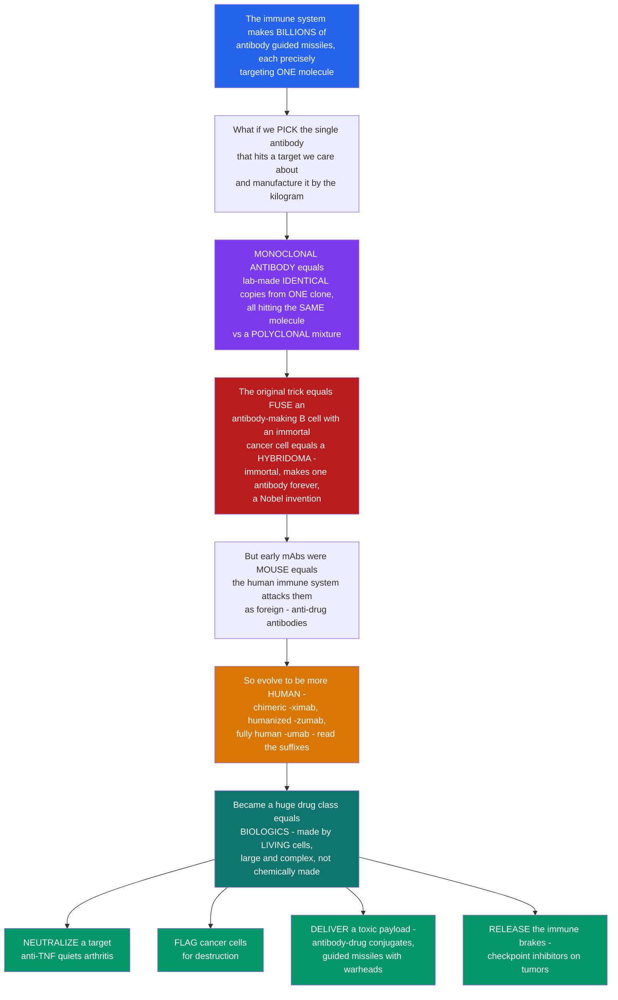

# 🧬 Monoclonal Antibodies and Biologics

> [!abstract] TL;DR
> Your immune system naturally makes **billions of different antibodies**, each a **guided missile** precisely targeting one molecule. A **monoclonal antibody (mAb)** is what happens when we **pick the single antibody** that hits a target we care about — a cancer cell, an inflammatory cytokine, a virus — and **manufacture it by the kilogram** as a drug: "mono-clonal" means *from one clone*, so every molecule is an **identical copy** binding the **exact same epitope** with the **same specificity and affinity** (in contrast to natural **polyclonal** antisera, a messy mixture). The original trick — the Nobel-winning **hybridoma** method of **Köhler and Milstein** — was to **fuse a single antibody-making B cell** (which has the specificity you want but dies quickly) with an **immortal myeloma cell** (immortal but useless), creating an **immortal antibody-factory cell line** that pumps out one antibody forever. Early mAbs were made in **mice**, so the human immune system attacked them as foreign; the technology therefore evolved to make antibodies **progressively more human** — a story you can literally read in the drug-name suffixes: **-omab** (mouse) → **-ximab** (chimeric) → **-zumab** (humanized) → **-umab** (fully human). Because they are made by **living cells** rather than chemically synthesized, mAbs are **biologics** — large, complex, and expensive to produce. As drugs they exploit antibodies' natural talents four ways: **NEUTRALIZE** a target (anti-TNF drugs revolutionized rheumatoid arthritis), **FLAG** cancer cells for destruction (anti-CD20, anti-HER2), **DELIVER** a cytotoxic payload straight to a tumor (**antibody-drug conjugates** — guided missiles with warheads), or **RELEASE** the immune brakes on tumors (checkpoint inhibitors). Monoclonal antibodies turned immunology's core molecule into a **therapeutic superpower** and one of the largest, best-selling drug classes in modern medicine. *Educational science content, not medical advice.*

---

## Intuition

**Analogy first — nature already built the world's best precision-targeting technology; we just learned to mass-produce one missile at a time.** Your body's B cells collectively make **billions of different antibodies**, and each one is a **guided missile** shaped to grip exactly **one** molecule out of everything in the universe. That is an astonishing library of precision — somewhere in you is an antibody for almost any target you could name. Now ask the money question: what if you could reach into that library, **pick the single missile** that homes in on a target you care about — the protein studding a cancer cell, the inflammatory signal inflaming a joint, the spike on a virus — and then **manufacture that one missile by the kilogram** and give it as a drug? That is a **monoclonal antibody**. "Mono-clonal" means *from one clone*: every molecule in the vial is an **identical copy**, all aimed at the **same** target with the **same** grip. Compare that with the antibodies your body makes during an infection — a **polyclonal** mob of many *different* antibodies clamping many *different* spots with a *range* of grip strengths. A polyclonal mixture is a shotgun; a monoclonal is a **single, reproducible, purified rifle shot** — and reproducibility is exactly what a drug needs.

The genius was in the manufacturing, and it earned a Nobel Prize. A B cell that makes the antibody you want has the perfect aim but a fatal flaw: **it dies in culture within days.** A cancer cell has the opposite problem: it is **immortal** but makes nothing useful. **Köhler and Milstein** fused the two into a **hybridoma** — a chimera that inherits the B cell's **specificity** and the cancer cell's **immortality**, an undying factory that spits out one exact antibody **forever.** Pick the right hybridoma and you have an endless, uniform supply. But there was a catch: those first antibodies were grown in **mice**, and to a human immune system a mouse protein looks like an invader — patients' bodies made **anti-drug antibodies** that neutralized the therapy and could cause reactions. So the field spent decades making antibodies **look more and more human**, swapping out mouse parts for human ones until only the tiny gripping loops remained foreign, and finally making **fully human** antibodies. You can read this evolution right off the label: a drug ending in **-ximab** is part-mouse (**chimeric**), **-zumab** is mostly human (**humanized**), and **-umab** is **fully human** — the suffix encodes the antibody's ancestry.

And once you can build any antibody you want, what do you *do* with it? Antibodies are naturally multi-talented, and every talent became a class of drug. You can **NEUTRALIZE** — clamp onto an inflammatory molecule or a virus so it can no longer act (anti-**TNF** antibodies quieted the fire of rheumatoid arthritis; neutralizing mAbs blunted COVID). You can **FLAG** a cell for destruction — coat a cancer cell so the immune system's killers and the complement cascade tear it apart (anti-CD20 wiping out malignant B cells). You can weld a **warhead** onto the missile — an **antibody-drug conjugate** carries a cytotoxin and delivers it *only* to cells bearing the target, sparing healthy tissue. Or you can **release the brakes** — checkpoint-inhibitor antibodies pull the "off switch" off exhausted anti-tumor T cells and let them attack. Because these molecules are grown in **living cells** rather than mixed in a chemistry flask, they are called **biologics**: big, intricate proteins that are harder to make, harder to copy, and pricier than small-molecule pills — but able to hit targets no small molecule can. Understanding monoclonal antibodies is understanding how the **precision-targeting technology at the heart of adaptive immunity** became **precision medicine embodied in a protein.**

---

## How It Works

### Core Mechanics

1. **Start from the polyclonal problem.** A natural immune response makes a **polyclonal** mixture — many B-cell clones, each secreting a *different* antibody against a *different* **epitope** with a *different* affinity. Useful for defense, useless as a **defined, reproducible drug**. A therapeutic needs **one** molecule of **one** specificity, made identically every batch — a **monoclonal**.
2. **The hybridoma trick (Köhler & Milstein, 1975; Nobel 1984).** Immunize an animal, harvest its antibody-secreting **B cells**, and **fuse** each to an immortal **myeloma** cell. The fusion inherits the B cell's **antigen specificity** and the myeloma's **immortality**. Screen the resulting clones to find the **one hybridoma** making the antibody you want; that clone is an **immortal factory** producing a single monoclonal antibody indefinitely.
3. **Modern discovery beyond hybridomas.** **Phage display** (Nobel 2018) puts huge libraries of antibody fragments on the surface of bacteriophage and **selects** the binders in vitro by panning against the target — a form of **directed evolution / affinity maturation** in a test tube. **Transgenic "human-antibody" mice** carry human immunoglobulin loci and make human antibodies directly. **Single-B-cell cloning** rescues the variable genes from an individual antigen-specific B cell. All are then produced by **recombinant expression** in cultured mammalian cells.
4. **Why they are "biologics."** The finished antibody is a ~150 kDa glycoprotein grown in **living cell cultures** (typically CHO cells), not synthesized chemically. It is **large, complex, and glycosylated**, so it cannot be exactly copied — generic versions are approximate **biosimilars**, not identical generics.
5. **The humanization ladder (reducing immunogenicity).** A mouse antibody triggers a **human anti-mouse antibody (HAMA)** response. Engineering progressively replaces mouse sequence with human: **murine** (all mouse, `-omab`) → **chimeric** (mouse variable domains on a human constant region, `-ximab`) → **humanized** (only the mouse **CDR** loops remain, `-zumab`) → **fully human** (`-umab`). More human sequence means **fewer anti-drug antibodies** and often a longer, more predictable half-life.
6. **Therapeutic mechanisms — what a mAb does as a drug.** (a) **Neutralization / blocking** — bind and inhibit a soluble target or receptor (anti-cytokine, anti-viral). (b) **Cell targeting for destruction** — coat a cell so **NK cells (ADCC)**, **complement (CDC)**, and phagocytes kill it. (c) **Payload delivery** — an **antibody-drug conjugate (ADC)** or radioimmunoconjugate carries a toxin only to target-bearing cells. (d) **Immune modulation** — **checkpoint inhibitors**, **bispecifics/BiTEs** that bridge a T cell to a tumor cell, and receptor agonists.
7. **Fc engineering tunes the "handle."** The constant **Fc** region governs effector function and lifespan. **Afucosylating** the Fc glycan boosts **ADCC**; engineering **Fc–FcRn** affinity extends serum half-life; **Fc-silencing** removes effector function when only blocking is wanted.
8. **The payoff — pharmacokinetics.** Full-length **IgG** is recycled by the **neonatal Fc receptor (FcRn)**, giving a serum half-life of ~3 weeks. That long persistence is why many antibody drugs are dosed only **every few weeks**, unlike small molecules taken daily.

### Flow / Architecture



---

## Key Concepts

### Secondary — the big picture

- **Your body makes billions of antibodies, each grabbing one specific target.** A **monoclonal antibody** is what you get when scientists **pick one** of those antibodies against a target they care about and **make identical copies** of it as a drug. "Monoclonal" means *all the same, from one clone.*
- **Polyclonal vs monoclonal.** During an infection your body makes a **mixture** (polyclonal) of many different antibodies. A monoclonal drug is a **single, pure, reproducible** antibody — the same molecule every time.
- **The Nobel-winning factory — the hybridoma.** A useful antibody-making cell dies quickly; a cancer cell lives forever but is useless. **Fuse them** and you get an **immortal cell that makes one antibody forever.**
- **Making them human.** The first ones were made in **mice**, so people's immune systems attacked them. Scientists slowly made antibodies **more human** — you can tell how human a drug is from the end of its name: **-ximab** (part mouse), **-zumab** (mostly human), **-umab** (fully human).
- **"Biologics" are grown, not mixed.** Because they are made by **living cells** (not chemistry), they are big, complex, and costly — a class of drugs called **biologics**.
- **What they do:** **block** a harmful signal (anti-TNF for arthritis), **tag** cancer cells to be destroyed, **deliver a poison** straight to a tumor, or **take the brakes off** the immune system.

### Undergraduate — mechanisms and distinctions

- **Monoclonal = one clone, one epitope, one affinity.** Every molecule is derived from a single B-cell clone, so all share the identical **paratope** and bind the **same epitope** with the same `Kd`. **Polyclonal antisera** (e.g., a rabbit anti-serum, IVIG, antivenom) are heterogeneous mixtures targeting **many epitopes** with a spread of affinities — more robust to antigen variation, but undefined and non-reproducible.
- **The hybridoma workflow.** Immunize → isolate splenic **B cells** → **PEG-fuse** with a HGPRT-deficient **myeloma** → select survivors in **HAT medium** (only fused cells survive) → screen supernatants → **subclone** the positive well by limiting dilution → expand the single clone. The output is a defined, immortal, single-specificity antibody source.
- **Modern discovery platforms:**
  - **Phage display** — antibody-fragment (scFv/Fab) libraries fused to phage coat protein; iterative **panning + amplification** selects and matures binders entirely in vitro (in-vitro affinity maturation / directed evolution).
  - **Transgenic mice** with humanized Ig loci (e.g., XenoMouse-type) generate **fully human** antibodies via normal immunization.
  - **Single-B-cell cloning** from immune donors or convalescent patients (used for many anti-viral mAbs).
  - **Recombinant expression** in **CHO / HEK** cell lines scales manufacturing.
- **The humanization ladder and INN nomenclature.** The suffix historically encoded origin:

| Type | Composition | Suffix | Immunogenicity (ADA) | Example |
|---|---|---|---|---|
| **Murine** | 100% mouse | `-omab` | high (**HAMA**) | muromonab-CD3 |
| **Chimeric** | mouse **V** + human **C** (~65% human) | `-ximab` | intermediate | rituximab, infliximab |
| **Humanized** | human framework, mouse **CDRs** (~90–95% human) | `-zumab` | low | trastuzumab, omalizumab |
| **Fully human** | 100% human | `-umab` | lowest | adalimumab, ipilimumab |

  *(The WHO revised the scheme in 2021 — new INNs use `-tug/-bart/-mig/-ment` stems — but the classic `-ximab/-zumab/-umab` pattern is embedded in most marketed drugs.)*
- **Therapeutic mechanisms, mapped to antibody biology:**
  1. **Neutralization / blocking** — anti-cytokine (**anti-TNF**: infliximab, adalimumab; **anti-IL-6**, **anti-IL-17**, **anti-IL-23**), anti-viral neutralizers, receptor blockade. Uses the **Fab** end only.
  2. **Cell depletion** — **anti-CD20 (rituximab)** kills B cells via **ADCC**, **complement (CDC)**, and apoptosis; **anti-HER2 (trastuzumab)** in breast cancer. Uses the **Fc** to recruit **NK cells** and **complement**.
  3. **Payload delivery** — **antibody-drug conjugates (ADCs)** = antibody + linker + cytotoxic warhead = targeted chemotherapy (trastuzumab emtansine, brentuximab vedotin); radioimmunoconjugates.
  4. **Immune modulation** — **checkpoint inhibitors** (anti-PD-1/PD-L1, anti-CTLA-4), **bispecifics / BiTEs** that physically bridge a **CD3⁺ T cell** to a tumor antigen, and agonist antibodies.
- **Why "biologic" matters clinically.** Large, glycosylated, parenterally dosed (injection/infusion), sensitive to manufacturing, and only approximately copyable as **biosimilars** — a fundamentally different regulatory and economic category from small-molecule generics.

### Graduate — depth and consequences

- **Fc engineering as a design axis.** The `CH2`–`CH3` **Fc** independently governs effector function and half-life. **Afucosylation** of the Asn297 glycan increases FcγRIIIa affinity and **ADCC** (obinutuzumab, mogamulizumab). Point mutations tune **FcγR** and **C1q** engagement up (to enhance ADCC/CDC/ADCP) or **down** ("Fc-silent"/effector-null formats, e.g., for pure blockers or agonists where cytotoxicity is unwanted). **FcRn-affinity–enhancing** mutations (e.g., YTE, LS) extend half-life from ~3 weeks toward months, enabling twice-yearly dosing of some anti-viral prophylactics.
- **ADC pharmacology.** An ADC's therapeutic index depends on **antigen selectivity**, **internalization** rate, **linker stability** (cleavable vs non-cleavable), **payload potency** (auristatins, maytansinoids, calicheamicin, topoisomerase inhibitors), and **drug-to-antibody ratio (DAR)**. The **bystander effect** (membrane-permeable released payload killing neighboring antigen-low cells) can be a feature or a toxicity. Site-specific conjugation improves homogeneity over stochastic lysine/cysteine coupling.
- **Bispecifics and T-cell engagers.** **BiTEs** (e.g., blinatumomab) and IgG-like bispecifics link one arm to **CD3** and another to a tumor antigen, forcing an immune synapse independent of TCR specificity — powerful but constrained by **cytokine-release syndrome**, short half-life (for small formats), and the "on-target/off-tumor" problem. Multispecific and "2+1" geometries tune avidity to favor tumor cells that co-express antigens.
- **Immunogenicity is not solved by humanization alone.** Even fully human antibodies elicit **anti-drug antibodies (ADAs)** via **T-cell epitopes**, aggregation, and neo-epitopes from manufacturing; ADAs can neutralize efficacy or alter PK. **Deimmunization** (T-cell-epitope removal) and formulation control aggregation. Idiotype and allotype differences still matter.
- **Manufacturing and the biosimilar landscape.** Product quality is defined by **critical quality attributes** — glycosylation profile, charge variants, aggregation, oxidation — because these shift PK and effector function. Biosimilars must demonstrate analytical and clinical **similarity**, not identity, which is why they reduce but do not eliminate cost the way small-molecule generics do.
- **Half-life engineering and the PK/PD envelope.** IgG's mono-exponential terminal decay (post-distribution) reflects FcRn recycling saturable at high dose (**target-mediated drug disposition**, TMDD — antigen sink accelerates clearance at low concentrations). Dosing regimens are built around keeping trough concentrations above the target-saturating threshold.
- **Frontiers.** **Nanobodies / single-domain antibodies (VHH)** from camelids penetrate tissue and bind cryptic epitopes; **engineered Fc** and glyco-optimization; **in-vivo antibody production** (mRNA- or vector-encoded mAbs made by the patient's own cells); **CNS delivery** via transferrin-receptor "molecular Trojan horses"; and convergence with **cell therapy** (the antibody-derived scFv is the antigen-recognition module of a **CAR**).
- **Scope and impact.** mAbs are among the **best-selling drugs on Earth**, spanning **oncology** (anti-HER2, anti-CD20, checkpoint inhibitors, ADCs, bispecifics), **autoimmune/inflammatory** disease (anti-TNF, anti-IL-6/17/23, anti-integrin), **infectious disease** (COVID and RSV mAbs), **asthma/allergy** (anti-IgE omalizumab, anti-IL-5), **migraine** (anti-CGRP), **cardiovascular** (anti-PCSK9), and **transplantation** (anti-CD3, anti-IL-2R).

---

## Python Demo

```python
# Monoclonal antibodies as drugs, quantified four ways:
#   (1) POLYCLONAL vs MONOCLONAL SPECIFICITY: a natural polyclonal response
#       spreads binding across MANY epitopes with a RANGE of affinities;
#       a monoclonal is a SINGLE sharp specificity -> the purity/consistency
#       that makes mAbs reproducible drugs.
#   (2) mAb DOSE-RESPONSE: target engagement vs concentration is a saturating
#       Langmuir curve; half-maximal engagement occurs at C = Kd (the EC50).
#   (3) HUMANIZATION vs IMMUNOGENICITY: as antibodies go mouse -> chimeric ->
#       humanized -> fully human, percent-human sequence RISES and the
#       anti-drug-antibody (immunogenicity) response FALLS.
#   (4) ANTIBODY PHARMACOKINETICS: full-length IgG is recycled by FcRn, giving
#       a ~21-day half-life -> serum stays above target-saturating levels for
#       weeks, enabling INFREQUENT dosing vs a non-recycled protein.
import numpy as np
import matplotlib.pyplot as plt

fig, ax = plt.subplots(2, 2, figsize=(13, 9))

# ---- (1) Polyclonal vs monoclonal specificity across the epitope map ----
epitopes = np.arange(1, 13)                     # 12 candidate epitopes on an antigen
rng = np.random.default_rng(7)
poly = rng.uniform(0.25, 1.0, size=epitopes.size)   # many clones, mixed affinities
poly[rng.uniform(size=epitopes.size) < 0.30] *= 0.3  # some weak/absent clones
mono = np.zeros_like(epitopes, dtype=float)
mono[5] = 1.0                                   # ONE clone, one epitope, defined affinity
w = 0.4
ax[0, 0].bar(epitopes - w/2, poly, width=w, color="#dc2626", alpha=0.85,
             label="POLYCLONAL (a mixture)")
ax[0, 0].bar(epitopes + w/2, mono, width=w, color="#7c3aed",
             label="MONOCLONAL (one clone)")
ax[0, 0].set_xlabel("epitope on the target antigen")
ax[0, 0].set_ylabel("relative binding / affinity")
ax[0, 0].set_title("(1) POLYCLONAL mob vs MONOCLONAL rifle shot\n"
                   "one clone, one epitope, one affinity = reproducible drug")
ax[0, 0].set_xticks(epitopes)
ax[0, 0].legend(fontsize=8)
ax[0, 0].grid(alpha=0.3, axis="y")

# ---- (2) Therapeutic mAb dose-response (target engagement) ----
C = np.logspace(-1, 3, 400)                     # antibody concentration (nM)
Kd = 5.0                                        # therapeutic mAb, high affinity (nM)
engaged = C / (Kd + C)                          # Langmuir target occupancy
ax[0, 1].plot(C, engaged, color="#2563eb", lw=2.6)
ax[0, 1].scatter([Kd], [0.5], color="#2563eb", zorder=5)
ax[0, 1].axhline(0.5, ls=":", color="gray", lw=1)
ax[0, 1].axvline(Kd, ls="--", color="#2563eb", lw=1)
ax[0, 1].annotate("EC50 = Kd = 5 nM\n(half of target engaged)", (Kd, 0.5),
                  textcoords="offset points", xytext=(12, -28), fontsize=8,
                  color="#2563eb")
ax[0, 1].axhline(0.9, ls=":", color="#059669", lw=1)
ax[0, 1].annotate("~90% target saturation\n(the therapeutic goal)", (C[-1], 0.9),
                  textcoords="offset points", xytext=(-150, 8), fontsize=8,
                  color="#059669")
ax[0, 1].set_xscale("log")
ax[0, 1].set_xlabel("mAb concentration (nM, log)")
ax[0, 1].set_ylabel("fraction of target engaged")
ax[0, 1].set_title("(2) mAb DOSE-RESPONSE: target engagement\nsaturates; half-max at C = Kd")
ax[0, 1].grid(alpha=0.3)

# ---- (3) Humanization ladder vs immunogenicity ----
gens = ["Murine\n-omab", "Chimeric\n-ximab", "Humanized\n-zumab", "Human\n-umab"]
pct_human = np.array([0, 65, 92, 100])          # approx % human sequence
ada = np.array([80, 40, 15, 8])                 # approx relative immunogenicity (% ADA)
x = np.arange(len(gens))
bars = ax[1, 0].bar(x, pct_human, color="#0f766e", alpha=0.85, label="% human sequence")
ax[1, 0].set_ylabel("% human sequence", color="#0f766e")
ax[1, 0].set_ylim(0, 110)
ax[1, 0].set_xticks(x)
ax[1, 0].set_xticklabels(gens, fontsize=8)
for b, v in zip(bars, pct_human):
    ax[1, 0].text(b.get_x() + b.get_width()/2, v + 2, f"{v}%", ha="center",
                  fontsize=8, color="#0f766e")
ax2 = ax[1, 0].twinx()
ax2.plot(x, ada, "o-", color="#dc2626", lw=2.4, ms=8, label="immunogenicity (ADA)")
ax2.set_ylabel("relative immunogenicity, % ADA", color="#dc2626")
ax2.set_ylim(0, 100)
ax[1, 0].set_title("(3) HUMANIZATION: more human sequence ->\nfewer anti-drug antibodies")

# ---- (4) Antibody pharmacokinetics: FcRn recycling -> long half-life ----
t = np.linspace(0, 84, 400)                     # days
C0 = 100.0                                       # initial serum concentration (arb.)
t_half_IgG = 21.0                                # FcRn-recycled IgG
t_half_ref = 3.0                                 # non-recycled protein (no FcRn rescue)
C_IgG = C0 * 0.5 ** (t / t_half_IgG)
C_ref = C0 * 0.5 ** (t / t_half_ref)
thr = 10.0                                       # target-saturating trough threshold
ax[1, 1].plot(t, C_IgG, color="#7c3aed", lw=2.6,
              label="IgG mAb (FcRn-recycled, t½ ~ 21 d)")
ax[1, 1].plot(t, C_ref, color="#d97706", lw=2.2, ls="--",
              label="no FcRn rescue (t½ ~ 3 d)")
ax[1, 1].axhline(thr, ls=":", color="#059669", lw=1.5)
ax[1, 1].annotate("target-saturating trough", (t[-1], thr),
                  textcoords="offset points", xytext=(-150, 6), fontsize=8,
                  color="#059669")
days_above = t[C_IgG >= thr][-1]
ax[1, 1].axvline(days_above, ls="--", color="#7c3aed", lw=1)
ax[1, 1].set_yscale("log")
ax[1, 1].set_xlabel("time since dose (days)")
ax[1, 1].set_ylabel("serum concentration (arb., log)")
ax[1, 1].set_title("(4) PHARMACOKINETICS: FcRn recycling ->\nweeks of coverage -> infrequent dosing")
ax[1, 1].legend(fontsize=8)
ax[1, 1].grid(alpha=0.3, which="both")

plt.tight_layout()
plt.savefig("monoclonal_antibodies_and_biologics.png", dpi=130)

# ---- quantify the lessons ----
print(f"(1) Polyclonal spreads binding across {int((poly > 0.1).sum())} epitopes; "
      f"the monoclonal hits exactly 1 -> defined, reproducible specificity.")
print(f"(2) Dose-response: half-maximal target engagement at C = Kd = {Kd:.0f} nM.")
print(f"(3) Humanization: % human rises 0 -> 100 while immunogenicity falls "
      f"{ada[0]}% -> {ada[-1]}% ADA across the mouse->human ladder.")
print(f"(4) PK: FcRn-recycled IgG stays above the target-saturating trough for "
      f"~{days_above:.0f} days vs only "
      f"~{t[C_ref >= thr][-1]:.0f} days without FcRn rescue.")
```

**What the plots show.** Panel (1) contrasts the two worlds of antibody binding: a **polyclonal** response scatters its grip across **many epitopes** with a **range of affinities** (a mob), while a **monoclonal** antibody is a **single sharp spike** at one epitope — the **purity and consistency** that let a mAb be manufactured as an identical, reproducible drug. Panel (2) turns a therapeutic antibody into a **dose-response curve**: **target engagement** saturates with concentration, half-maximal engagement sits at `C = Kd`, and clinical dosing aims to push serum levels into the **~90% target-saturation** plateau. Panel (3) is the **humanization story** in one chart — as antibodies climb the ladder from **mouse (-omab)** to **fully human (-umab)**, the **percent human sequence** rises and the **anti-drug-antibody (immunogenicity)** response falls, which is exactly why the field spent decades making antibodies more human. Panel (4) shows the **pharmacokinetic payoff**: because **FcRn** recycles IgG, an antibody drug's serum concentration stays above the **target-saturating trough** for **weeks**, so it can be dosed every few weeks — whereas an otherwise identical protein without FcRn rescue would clear in days.

---

## Real-World Applications

> **Anti-TNF biologics transformed autoimmune disease (NEUTRALIZATION).** **Infliximab** (chimeric, `-ximab`) and **adalimumab** (fully human, `-umab`) bind and **neutralize TNF-α**, the master inflammatory cytokine driving **rheumatoid arthritis**, Crohn's disease, psoriasis, and ankylosing spondylitis. Adalimumab became for years the **best-selling drug in the world**. These are pure blockers — the antibody grips a soluble cytokine and stops it from firing its receptor — and their arrival redefined the treatment of inflammatory disease (see [[Anticancer_and_Immunomodulatory_Drugs]] for the broader immunomodulatory class).

> **Anti-CD20 and anti-HER2 in cancer (FLAGGING cells for destruction).** **Rituximab** (anti-CD20) coats malignant and normal **B cells** and kills them via **ADCC**, **complement**, and apoptosis, treating lymphomas and — by depleting autoreactive B cells — several autoimmune diseases. **Trastuzumab** (anti-HER2, humanized `-zumab`) targets HER2-amplified **breast cancer**, both blocking a growth-signal receptor and recruiting NK-cell killing. Both illustrate the **Fc handle** recruiting the innate immune system against a marked cell.

> **Antibody-drug conjugates as guided missiles with warheads (PAYLOAD DELIVERY).** **Trastuzumab emtansine (T-DM1)** and **brentuximab vedotin** weld a **cytotoxic payload** to a targeting antibody, delivering chemotherapy **only** to cells bearing the antigen and sparing healthy tissue — turning the antibody's exquisite specificity into a targeting system for a poison too toxic to give systemically. ADCs are one of the fastest-growing oncology segments.

> **Checkpoint inhibitors release the immune brakes (IMMUNE MODULATION).** Antibodies against **PD-1/PD-L1** (nivolumab, pembrolizumab) and **CTLA-4** (ipilimumab) do not attack the tumor directly; they **block inhibitory receptors** on exhausted T cells, unleashing the patient's own anti-tumor response — a Nobel-winning strategy (Allison & Honjo, 2018) that produced durable remissions in melanoma and lung cancer.

> **Rapid-response and everyday mAbs.** **Omalizumab** (anti-IgE) strips IgE off mast cells in severe allergic asthma; **anti-CGRP** antibodies prevent migraine; **anti-PCSK9** antibodies (evolocumab, alirocumab) slash LDL cholesterol; **anti-RSV** and **COVID-19 neutralizing mAbs** provided passive protection during outbreaks. The **modularity** of the platform — pick a target, engineer an antibody — is why mAbs now span nearly every therapeutic area (see [[Antibodies_and_Biologics]] for the pharmacology-side treatment).

---

## Common Pitfalls

- **Confusing monoclonal with polyclonal.** A **monoclonal** antibody is a **single, defined specificity** from one clone; **polyclonal** antisera (IVIG, antivenom, rabbit anti-sera) are **mixtures** of many specificities. The reproducibility that makes a molecule a **drug** comes from monoclonality — but polyclonal breadth can be an advantage against variable antigens.
- **Reading the suffix as efficacy, not origin.** `-ximab`/`-zumab`/`-umab` encode **how human** the antibody is (chimeric/humanized/fully human), **not** how well it works. A humanized antibody is not "better" than a chimeric one — it is less **immunogenic**, all else equal.
- **Assuming "fully human" means zero immunogenicity.** Even fully human mAbs can raise **anti-drug antibodies** (via T-cell epitopes, aggregation, or manufacturing neo-epitopes). Humanization **reduces** but does not eliminate immunogenicity.
- **Forgetting that biologics cannot be exactly copied.** Because they are grown in **living cells** and heavily **glycosylated**, generic equivalents are **biosimilars** (highly similar, not identical), with their own regulatory and clinical-comparability requirements — unlike a small-molecule generic.
- **Ignoring the Fc when only the Fab seems relevant.** For a pure **blocker** you may **not want** effector function (avoid needless ADCC/CDC), so antibodies are often **Fc-silenced**; for a **cell-killer** you want effector function **maximized** (e.g., afucosylation). The same variable region on different Fc backbones behaves very differently.
- **Treating glycosylation as a detail.** The Asn297 Fc glycan controls **ADCC/complement** engagement and can shift PK; two antibodies with identical amino-acid sequence can differ in potency purely by **glycoform** — a recurring surprise in manufacturing and biosimilar development.
- **Overlooking target-mediated drug disposition.** Antibody PK is **not** always simple first-order clearance: when the antigen acts as a **sink**, clearance accelerates at low concentrations (TMDD), complicating dose selection. Assuming clean exponential decay can badly misestimate dosing.
- **Equating a mAb target with clinical success.** Binding a target with high affinity is necessary but not sufficient — **on-target/off-tumor** toxicity, poor tissue/CNS penetration, resistance, and cost/access frequently limit real-world benefit even for perfectly specific antibodies.

---

## Related Concepts

- [[Antibodies_and_Biologics]] — the **Pharmacology/02** companion: antibodies viewed as a **drug modality** (PK/PD, formats, Fab/Fc engineering). This note is the **immunology-side** view — how the immune system's own molecule and its production biology (hybridoma, humanization, effector functions) became that drug modality. Distinct, complementary angles.
- [[Anticancer_and_Immunomodulatory_Drugs]] — the **Pharmacology/03** drug-class note where anti-TNF, anti-cytokine, checkpoint-inhibitor, and anti-tumor antibodies sit alongside small-molecule immunomodulators; this note supplies the antibody-engineering mechanism behind those therapeutics.
- [[The_Adaptive_Immune_System]] — the **Biology/11** overview of B/T cells and clonal selection; monoclonal antibodies **harness** the clonal, one-specificity-per-B-cell logic described there and freeze a single clone's product into a manufacturable drug.
- [[Precision_Medicine_and_Genomics_in_the_Clinic]] — the **Clinical_Medicine/06** note on tailoring therapy to a patient's molecular profile; mAbs (anti-HER2 for HER2⁺ tumors, checkpoint inhibitors guided by biomarkers) are precision medicine **embodied in a protein**.

*Siblings and near-neighbors in this Immunology vault, referenced in prose until cross-linked: **Antibody Structure and Function** (the Fab/Fc, isotype, and affinity/avidity biology this note exploits as a drug), **B-Cell Activation and the Germinal Center** (where the single antibody-secreting clone and its affinity-matured specificity originate before a hybridoma captures it), **Cytokines and Immune Signaling** (the TNF/IL-6/IL-17/IL-23 targets that neutralizing biologics block), **Cancer Immunotherapy and Checkpoint Inhibitors** (the "release the brakes" mechanism, an antibody class in its own right), and **Immunoengineering and CAR-T Cells** (where an antibody-derived scFv becomes the antigen-recognition module of an engineered cell).*

---

## Review Questions

**Secondary.** Using the "billions of guided missiles" picture, explain what makes an antibody **monoclonal** and why that matters for using it as a drug. What was the clever **hybridoma** trick that let scientists make one antibody forever, and why were the earliest monoclonal antibodies (made in mice) a problem for patients?

**Undergraduate.** A drug's name ends in **-ximab**; a competitor's ends in **-umab**. (a) What does each suffix tell you about the antibody's **origin** and its likely **immunogenicity**? (b) Describe two different **therapeutic mechanisms** a monoclonal antibody can use against cancer — one that **flags a cell for destruction** and one that **delivers a payload** — and name which part of the antibody (Fab vs Fc) each mechanism depends on. (c) Why are monoclonal antibodies called **biologics**, and why can't they be copied as ordinary generics?

**Graduate.** You are engineering a therapeutic IgG. (a) Explain how you would **modify the Fc** differently depending on whether the antibody's job is **pure blockade** of a soluble cytokine versus **antibody-dependent killing** of a target cell, naming the specific effector functions and at least one glyco- or sequence-engineering strategy for each. (b) Explain how **FcRn** recycling sets the antibody's half-life and how you would engineer it to enable less-frequent dosing. (c) Even a **fully human** antibody can provoke **anti-drug antibodies** — give two molecular reasons why, and one consequence for pharmacokinetics or efficacy. (d) Briefly contrast an **antibody-drug conjugate** and a **CD3 bispecific** as two ways to convert antibody specificity into tumor cell death, and name a key toxicity of each.

---

## Sources

- Köhler, G. & Milstein, C. — "Continuous cultures of fused cells secreting antibody of predefined specificity." *Nature* 256(5517):495–497 (1975). The founding hybridoma paper (Nobel Prize in Physiology or Medicine, 1984). https://doi.org/10.1038/256495a0
- Carter, P. J. — "Potent antibody therapeutics by design." *Nature Reviews Immunology* 6(5):343–357 (2006). https://doi.org/10.1038/nri1837
- Chames, P., Van Regenmortel, M., Weiss, E. & Baty, D. — "Therapeutic antibodies: successes, limitations and hopes for the future." *British Journal of Pharmacology* 157(2):220–233 (2009). https://doi.org/10.1111/j.1476-5381.2009.00190.x
- Lu, R.-M., Hwang, Y.-C., Liu, I.-J., et al. — "Development of therapeutic antibodies for the treatment of diseases." *Journal of Biomedical Science* 27:1 (2020). https://doi.org/10.1186/s12929-019-0592-z
- Murphy, K. & Weaver, C. — *Janeway's Immunobiology*, 9th/10th ed. (Garland Science / W. W. Norton). Appendix on the manipulation of the immune response; monoclonal antibodies, humanization, and antibody-based therapeutics.

---

#immunology #monoclonal-antibodies #biologics #hybridoma #antibody-engineering
