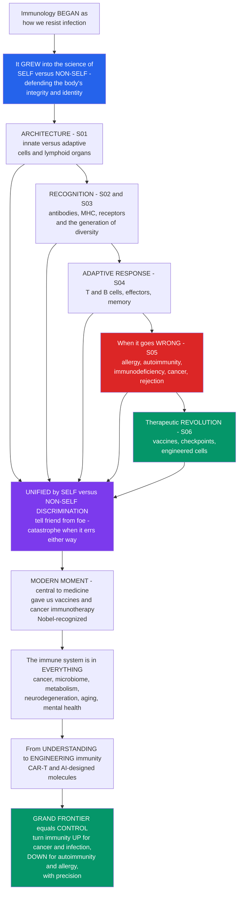

# 🛡️ The Reach and Future of Immunology

> [!abstract] TL;DR
> This is the **capstone** of the Immunology vault — the synthesis that ties every section into one science. Immunology began as the study of **how we resist infection**, but it has grown into something far larger: the science of how the body distinguishes **self from non-self**, defends its integrity, and maintains its very identity — and it now sits at the **center of medicine**. Read as one arc, the vault runs from the immune system's **architecture** (innate vs adaptive, cells, lymphoid organs — S01) through its **recognition machinery** (antibodies, MHC, receptors, and the astonishing generation of diversity — S02–S03), its **adaptive response** (T and B cell effectors and memory — S04), what happens when it goes **wrong** (allergy, autoimmunity, immunodeficiency, cancer, rejection — S05), and finally the **therapeutic revolution** (vaccines, checkpoint inhibitors, engineered cells — S06). The unifying thread is the profound, life-or-death problem of **self/non-self (and danger) discrimination** — and the catastrophes that follow when the system errs in **either direction** (too little → infection, cancer, immunodeficiency; too much or misdirected → autoimmunity, allergy, transplant rejection). Immunology's modern moment is remarkable: it gave us **vaccines** (the greatest lifesaver in history) and now cancer **immunotherapy** (a Nobel-honored fourth pillar of oncology); it is being recognized as involved in nearly **everything** (the microbiome, metabolism, neurodegeneration, aging, mental health); and we have moved from merely **understanding** immunity to **engineering** it (CAR-T, AI-designed molecules). The grand frontier is exactly this **control** — turning immunity **up** where we need it and **down** where it harms, with precision. *(Educational synthesis, not individual medical advice.)*

---

## Intuition

**Analogy first — the field that started as a fortress and became the whole science of who you are.** Picture immunology's origin as a narrow, urgent question asked at a fortress wall: *how do we keep the invaders out?* For a century that was the whole game — germs, antibodies, vaccines, resistance to infection. But as immunologists studied the defenders, they realized the wall was never really about *foreigners* at all. Its deepest job is to answer a single, continuous, life-or-death question: **is this me, or not-me?** Every cell, every molecule, every scrap of debris in your body is silently interrogated against that question, billions of times a second. The immune system is the organ of your biological **identity** — the thing that decides what belongs to the integrated whole that is *you* and what must be destroyed to protect it.

Now step back and see the whole arc of this vault as one story about that question. We began with the system's basic **architecture** — the fast, generic innate guards and the slow, specific adaptive special forces, the cells that fight and the organs that stage the battles. We learned its **recognition** machinery — antibodies, MHC molecules, receptors, and the near-miraculous trick of cutting and pasting genes to generate enough diversity to recognize almost any molecular shape in the universe. We watched the **adaptive response** unfold — T cells and B cells expanding, killing, remembering. We saw what happens when the system **errs**: attack the wrong target and you get autoimmunity and allergy; fail to attack and you get infection and cancer; attack a lifesaving transplant and you get rejection. And we reached the **therapeutic revolution** — vaccines that train the memory, checkpoint inhibitors that release the brakes, engineered cells built to order. The single thread running through all of it is **self/non-self discrimination** — friend from foe — and the four great catastrophes (infection, autoimmunity, cancer, rejection) that are nothing but errors in one direction or the other.

Here is immunology's extraordinary present tense. It has become one of the most consequential and fast-moving fields in all of science and medicine. It gave us **vaccines** — the single greatest lifesaver in human history — and now cancer **immunotherapy**, worthy of Nobel Prizes and hailed as a fourth pillar of oncology beside surgery, radiation, and chemotherapy. We are discovering that the immune system is quietly involved in nearly **everything**: not just infection but cancer, the **microbiome**, **metabolism** and obesity, **neurodegeneration** and even mental health, **aging** itself (the low-grade "inflammaging" that accompanies growing old), tissue repair, and cardiovascular disease. And we have crossed a threshold — from *understanding* the immune system to **engineering** it: reprogramming a patient's own cells into cancer-hunting CAR-T missiles, designing antibodies and vaccines with AI, and beginning to dream of dialing immune responses precisely up or down at will. The grand frontier is exactly that dial: switching immunity **up** where we need it (cancer, chronic infection, vaccines, immunodeficiency) and **down** where it is harmful (autoimmunity, allergy, transplantation) — selectively, safely, and without today's crude trade-offs. To understand the reach and future of immunology is to understand a science that has become central to human health, and whose power to **defend** — and to be **redesigned** — is only beginning to be realized.

---

## How It Works

The best way to hold the whole field in one view is as a **dial of immune activity** with a healthy balance in the middle. The vault's arc builds the machinery; the diseases are deviations from the balance in one direction or the other; and the therapies are corrective nudges that turn the dial back — the grand goal being to do so with **precision**.



**The grand synthesis in one sentence.** The immune system exists to preserve organismal **integrity and identity** through continuous self/non-self (and danger) discrimination; every immune disease is an **error** in that discrimination — too little activity opens the door to infection, cancer, and immunodeficiency, while too much or misdirected activity produces autoimmunity, allergy, and rejection — and every immune therapy is an attempt to **restore or redirect** the balance. The recurring principles the vault has built up — the **innate–adaptive partnership**, **clonal selection** and **memory**, **layered defense-in-depth**, the **recognition-then-effector** logic, and the **double-edged** trade-off between defense and immunopathology — are all facets of that single homeostatic problem, the **immune set-point**.

---

## Key Concepts

### 🟢 Secondary (the big picture)

- **From fortress to identity.** Immunology started as "how we fight germs" and grew into the science of how the body tells **self** from **non-self** and defends who you are.
- **The whole vault is one arc.** Architecture → recognition → adaptive response → what goes wrong → how we treat it. Every section is a chapter in the same story.
- **Health is a balance.** Too **little** immunity means infection and cancer; too **much** means allergy and autoimmunity. Staying healthy is keeping the dial in the middle.
- **Two gifts to humanity.** Immunology gave us **vaccines** (the greatest lifesaver ever) and now **cancer immunotherapy** — both Nobel-honored.
- **The immune system is everywhere.** It is now known to shape not just infection but cancer, the gut microbiome, metabolism, the brain, and even aging.
- **From understanding to building.** We have gone from studying immunity to **engineering** it — rebuilding a patient's own cells to hunt cancer.

### 🟡 Undergraduate (the integrating principles)

- **The unifying problem: self/non-self and danger discrimination.** Central tolerance (thymus, marrow) plus peripheral tolerance (Tregs, anergy, checkpoints) keep the system from attacking self; the classic framework is refined by the **danger/damage model** and recognition of **altered-self** (stressed and cancerous cells). Nearly every immune disease is a failure of this discrimination.
- **The recurring design principles.** **Innate–adaptive partnership** (innate detects and instructs; adaptive is specific and remembers); **clonal selection** (antigen expands rare pre-fitted clones); **immunological memory** (the basis of vaccination); **layered defense-in-depth**; and the **recognition → effector** two-step common to every response.
- **The immune set-point / homeostasis.** The field increasingly frames immunity as a tunable **set-point** — a balance whose deviations, in either direction, define the whole disease spectrum, and whose deliberate adjustment is the aim of therapy.
- **The expanding reach — immunity in "everything."** **Immunometabolism** (adipose-tissue inflammation in obesity and type 2 diabetes), **neuroimmunology** (microglia, the meningeal lymphatics, the immune–brain axis in neurodegeneration and mood), **mucosal/microbiome homeostasis** (the gut immune system training tolerance to trillions of commensals), **inflammaging** (chronic low-grade inflammation as a hallmark of aging), tissue repair, reproduction, and atherosclerosis as an inflammatory disease.
- **The therapeutic revolution.** **Vaccines** and the **mRNA/platform** revolution; cancer **immunotherapy** (checkpoint inhibitors releasing the brakes, CAR-T cells built to kill); **biologics** (anti-TNF, anti-IL-17/23, anti-IL-4/13) transforming autoimmune and allergic disease; and the shift from broad **immunosuppression** toward **precision immunomodulation**.

### 🔴 Graduate (frontiers, control, and open problems)

- **The cancer-immune set-point (Chen & Mellman).** Anti-tumor immunity is a self-amplifying **cancer-immunity cycle** whose net output is governed by a balance of stimulatory and inhibitory factors — a per-patient set-point that therapy aims to shift. The same "set-point" logic generalizes to autoimmunity and transplantation with the sign reversed.
- **The grand challenge — antigen-specific control.** Today we mostly turn immunity up or down **globally**: checkpoint inhibitors risk systemic autoimmunity; immunosuppressants risk infection and cancer. The holy grail is **selective, antigen-specific** control — restoring tolerance to *one* self-antigen without immunosuppression (inverse vaccines, tolerogenic dendritic cells, **Treg cell therapy**, antigen-specific CAR-Tregs) and unleashing immunity against *one* tumor without collateral autoimmunity.
- **Engineering immunity — synthetic immunology.** **CAR-everything** (CAR-T for solid tumors, CAR-NK, in-vivo CAR generation, CAR-Tregs for tolerance), logic-gated and armored cells, engineered "smart" biologics, and designer cytokines that decouple efficacy from toxicity.
- **Computational, predictive, systems immunology.** High-dimensional single-cell and repertoire data, systems-vaccinology signatures that predict who will respond, and **AI-designed** antibodies, epitopes, and vaccine immunogens — moving immunology from descriptive to predictive and generative.
- **Universal and broadly protective vaccines.** The unsolved targets — **HIV**, universal **influenza**, and **pan-coronavirus** vaccines — plus the microbiome as a therapeutic and immunomodulatory target.
- **The enduring lessons.** The **elegance** of clonal selection and self/non-self discrimination; the irreducibly **double-edged** nature of immunity (every gain in defense risks immunopathology); immunology as **central to medicine**; and the epochal transition **from understanding the immune system to engineering it**.

---

## Python Demo

The reach and future of immunology, as a **synthesis** in two pictures. **Panel (a) — the immune set-point dial:** the vault's grand unifying idea rendered as a single landscape. Immune activity runs from *too little* (immunodeficiency, infection, cancer escape) through a *healthy balanced zone* (effective defense **and** self-tolerance) to *too much* (autoimmunity, allergy, cytokine storm, transplant rejection). Two opposing risk curves sum to a U-shaped total risk whose minimum **is** health; the vault's diseases sit as deviations from that minimum, and its therapies are **corrective nudges** that turn the dial back toward balance. **Panel (b) — immunology's expanding reach:** the explosive rise of approved immunotherapies over the past decade and a projection of immune control spreading from infection and cancer into new domains (autoimmunity, aging, the microbiome, neuro-immunology).

```python
# The reach and future of immunology, as a SYNTHESIS in two pictures.
#   (a) THE IMMUNE SET-POINT DIAL - health is a BALANCE of immune activity;
#       every disease is a deviation, every therapy a corrective NUDGE (up or down).
#   (b) IMMUNOLOGY'S EXPANDING REACH - the rise of approved immunotherapies and
#       the projected spread of immune control into new domains.
import numpy as np
import matplotlib.pyplot as plt

# ============================================================
# (a) THE IMMUNE SET-POINT DIAL
# ============================================================
x = np.linspace(0.0, 1.0, 600)               # immune activity: 0 = too little, 1 = too much
risk_too_little = np.exp(-5.0 * x)            # infection, cancer escape, immunodeficiency
risk_too_much   = np.exp(-5.0 * (1.0 - x))   # autoimmunity, allergy, cytokine storm, rejection
total_risk      = risk_too_little + risk_too_much
x_health        = x[np.argmin(total_risk)]   # healthy set-point (balance) ~ 0.5

# disease positions along the dial: (activity, label, vertical offset)
diseases = [
    (0.06, "Immunodeficiency",            0.16),
    (0.22, "Cancer immune\nescape",       0.20),
    (0.50, "Healthy\nbalance",           -0.20),
    (0.78, "Autoimmunity /\nallergy",     0.20),
    (0.94, "Cytokine storm /\nrejection", 0.16),
]

# ============================================================
# (b) IMMUNOLOGY'S EXPANDING REACH (illustrative, approximate)
# ============================================================
years     = np.arange(2011, 2026)
# cumulative FDA immuno-oncology + engineered-cell approvals (approximate, illustrative)
approvals = np.array([1, 1, 2, 4, 6, 9, 14, 20, 28, 37, 47, 58, 70, 83, 97])
fut_years = np.arange(2025, 2036)            # projection as reach expands
fut       = approvals[-1] * np.exp(0.10 * (fut_years - 2025))

# ============================================================
# PLOTS
# ============================================================
fig, (axA, axB) = plt.subplots(1, 2, figsize=(15, 6))

# ---- Panel A: the immune set-point dial ----
axA.axvspan(x_health - 0.10, x_health + 0.10, color="#059669", alpha=0.12)
axA.plot(x, risk_too_little, color="#2563eb", lw=2, ls="--",
         label="Risk of too LITTLE immunity\n(infection, cancer, immunodeficiency)")
axA.plot(x, risk_too_much, color="#dc2626", lw=2, ls="--",
         label="Risk of too MUCH immunity\n(autoimmunity, allergy, rejection)")
axA.plot(x, total_risk, color="#111827", lw=3, label="Total risk (disease burden)")
axA.axvline(x_health, color="#059669", lw=1.5, ls=":")

for xd, name, dy in diseases:
    yd = float(np.interp(xd, x, total_risk))
    axA.plot(xd, yd, "o", color="#374151", ms=7, zorder=5)
    axA.annotate(name, xy=(xd, yd), xytext=(xd, yd + dy), ha="center",
                 fontsize=8, weight="bold", color="#1f2937")

# therapy nudges: turn the dial UP (cancer -> center) and DOWN (autoimmunity -> center)
y_up = float(np.interp(0.22, x, total_risk))
axA.annotate("", xy=(x_health - 0.07, float(np.interp(x_health - 0.07, x, total_risk))),
             xytext=(0.26, y_up),
             arrowprops=dict(arrowstyle="->", color="#059669", lw=2.5))
axA.text(0.30, 0.78, "turn UP\ncheckpoint inhibitors,\nCAR-T, vaccines",
         color="#065f46", fontsize=8, ha="center")
y_dn = float(np.interp(0.78, x, total_risk))
axA.annotate("", xy=(x_health + 0.07, float(np.interp(x_health + 0.07, x, total_risk))),
             xytext=(0.74, y_dn),
             arrowprops=dict(arrowstyle="->", color="#b45309", lw=2.5))
axA.text(0.70, 0.78, "turn DOWN\nbiologics, tolerance /\nTreg therapy",
         color="#7c2d12", fontsize=8, ha="center")

axA.set_title("(a) The immune set-point dial:\nevery disease a deviation, every therapy a corrective nudge")
axA.set_xlabel("Immune activity  (too little  <--   balance   -->  too much)")
axA.set_ylabel("Risk / disease burden (arb. units)")
axA.set_ylim(0, 1.25); axA.set_xlim(0, 1)
axA.legend(loc="upper center", fontsize=7.5, ncol=1); axA.grid(alpha=0.25)

# ---- Panel B: immunology's expanding reach ----
axB.plot(years, approvals, "o-", color="#7c3aed", lw=2.6, ms=5,
         label="Cumulative immuno-oncology & cell-therapy approvals")
axB.plot(fut_years, fut, ls="--", color="#7c3aed", lw=2, label="Projected trajectory")
axB.fill_between(fut_years, fut * 0.8, fut * 1.25, color="#7c3aed", alpha=0.12)

for yr, txt in [(2011, "2011: first\ncheckpoint inhibitor"), (2017, "2017: first\nCAR-T therapy")]:
    axB.axvline(yr, color="#9ca3af", ls=":", lw=1)
    axB.text(yr + 0.15, 8, txt, rotation=90, va="bottom", fontsize=7.5, color="#4b5563")

axB.annotate("Reach expands into new domains:\nautoimmunity, aging, microbiome,\nneuro-immunology",
             xy=(2033, float(fut[-3])), xytext=(2025.5, 150),
             fontsize=8, color="#5b21b6",
             arrowprops=dict(arrowstyle="->", color="#7c3aed"))
axB.set_title("(b) Immunology's expanding reach:\nfrom infection & cancer into everything")
axB.set_xlabel("Year"); axB.set_ylabel("Cumulative approvals (approx., illustrative)")
axB.legend(loc="upper left", fontsize=8); axB.grid(alpha=0.25)

plt.tight_layout()
plt.savefig("reach_and_future_of_immunology.png", dpi=120)
plt.show()

# ============================================================
# QUANTIFY
# ============================================================
print("THE IMMUNE SET-POINT DIAL")
print(f"  Healthy set-point (minimum total risk) at activity = {x_health:.2f}")
print(f"  Risk at balance = {total_risk.min():.3f}  vs  at extremes ~ {total_risk[0]:.3f}")
print("  Too little -> infection, cancer, immunodeficiency | Too much -> autoimmunity, allergy, rejection")
print("\nEXPANDING REACH")
print(f"  Approvals 2011 -> 2025: {approvals[0]} -> {approvals[-1]}  ({approvals[-1]//approvals[0]}x growth)")
print(f"  Projected by 2035 (central estimate): {fut[-1]:.0f}")
```

**What it shows.** Panel (a) compresses the entire vault into one landscape: the blue curve is the risk of doing *too little* (infection, cancer escape, immunodeficiency), the red curve the risk of doing *too much* (autoimmunity, allergy, rejection), and their sum is a **U-shaped total-risk** curve whose minimum — the green **healthy set-point** — is the state of effective defense *plus* intact self-tolerance. Every disease category the vault studied sits somewhere on that curve as a deviation from balance, and every therapy is an arrow that **nudges the dial back**: checkpoint inhibitors, CAR-T, and vaccines turn immunity **up** toward the center from the deficient side; biologics, immunosuppression, and tolerance/Treg therapy turn it **down** toward the center from the excessive side. Panel (b) captures immunology's modern moment quantitatively — the near-exponential rise of approved immunotherapies since the first checkpoint inhibitor (2011) and CAR-T (2017), and a projection of that reach expanding beyond infection and cancer into autoimmunity, aging, the microbiome, and neuro-immunology. The two panels are the whole capstone: *what* immunology is (a balance to be maintained) and *where* it is going (a dial we are learning to control, applied to ever more of medicine).

---

## Real-World Applications

> **Vaccines — the greatest lifesaver in history, reinvented.** From Jenner's cowpox (1796) to the **mRNA/platform** revolution of the 2020s, every vaccine exploits **immunological memory** — turning the dial *up* preemptively and safely. The frontier is **universal** and broadly protective vaccines (universal flu, pan-coronavirus, an effective HIV vaccine) and rapid programmable platforms for the next pandemic. *(Sibling note in prose: Vaccines and Vaccine Technology.)*

> **Cancer immunotherapy — a fourth pillar of oncology.** **Checkpoint inhibitors** (anti-PD-1/PD-L1, anti-CTLA-4) release the brakes of peripheral tolerance so T cells attack tumors, and **CAR-T** cells are a patient's own T cells re-engineered to recognize a cancer antigen — the 2018 Nobel Prize recognized the underlying biology. This is the dial turned *up* against cancer, and its trade-off (immune-related adverse events) is exactly the dial overshooting into autoimmunity. *(Sibling notes in prose: Cancer Immunotherapy and Checkpoint Inhibitors; Immunoengineering and CAR-T Cells.)*

> **Biologics for autoimmune and allergic disease.** Anti-TNF, anti-IL-17/23, anti-IL-4/13, and B-cell-depleting antibodies have transformed rheumatoid arthritis, psoriasis, IBD, and severe asthma — the dial turned *down*, but still fairly bluntly. The next step is **antigen-specific** tolerance (inverse vaccines, tolerogenic dendritic cells, Treg therapy) that restores tolerance to one self-antigen without global immunosuppression.

> **Transplantation and the tolerance holy grail.** Rejection is the immune system doing its job *too well* against non-self tissue; matching donor **MHC/HLA** and lifelong immunosuppression is applied self/non-self immunology. The dream is **operational tolerance** — a graft accepted as self without chronic drugs.

> **Immunology in "everything."** Immunometabolism links adipose inflammation to type 2 diabetes; neuroimmunology implicates microglia and the meningeal lymphatics in neurodegeneration; the **microbiome** is emerging as a target that trains and tunes immunity; and **inflammaging** ties chronic immune activation to the biology of aging — a direct bridge from this field into longevity science.

---

## Common Pitfalls

- **"Immunology is just about fighting infection."** That was the starting point, not the destination. The field's deepest subject is **self/non-self discrimination** — the maintenance of biological identity — which is why it now reaches into cancer, autoimmunity, transplantation, the microbiome, metabolism, the brain, and aging.
- **"Boost your immune system."** The single most persistent error. Immunity is a **balance**, not a slider to max out — an over-active response *is* allergy, autoimmunity, and cytokine storm, not health. The goal is the right set-point, not maximum activity.
- **"More immunotherapy is always better."** Every therapy that turns the dial has a symmetric cost: checkpoint inhibitors can trigger **autoimmune-like toxicity** (the dial overshooting), and immunosuppression raises **infection and cancer** risk (the dial undershooting). The whole frontier is escaping these trade-offs through **precision**.
- **"We can already control immunity precisely."** Mostly we still turn it up or down **globally**. The genuine grand challenge — **antigen-specific** control that tolerizes one self-antigen or targets one tumor without collateral damage — is largely unsolved.
- **"Vaccines and immunotherapy are unrelated triumphs."** They are the *same* principle in opposite directions along the same dial: both are deliberate, engineered manipulations of the immune set-point — one preemptive and protective, the other therapeutic and unleashing.
- **"Self/non-self is the whole theory."** The classic framework is essential but incomplete; the **danger/damage model** and recognition of **altered-self** (stressed and cancerous cells, commensal tolerance, fetal tolerance) are needed to explain the cases pure self/non-self cannot.

---

## Related Concepts

This is the **capstone** of the Immunology vault, so it synthesizes rather than introduces. Its **S06 siblings** — referenced here **in prose** because they develop these threads in depth — are *Vaccines and Vaccine Technology* (the greatest lifesaver and the mRNA/platform revolution), *Cancer Immunotherapy and Checkpoint Inhibitors* (turning the dial up against cancer), *Immunoengineering and CAR-T Cells* (from understanding to building immunity), and *Computational and Systems Immunology* (the predictive, AI-driven future). It also gathers the whole arc: the **architecture** and **recognition** and **adaptive-response** foundations, the **immune-mediated diseases** as deviations from balance, and the **therapeutic revolution** that restores it.

**Within this vault (Glob-verified anchors of the arc):**
- [[Immunology/01_Foundations_of_Immunology/Immunology_Overview_and_the_Immune_System|Immunology Overview and the Immune System]] — the vault's opening hub; this capstone is its bookend, closing the frame it opened.
- [[Immunology/01_Foundations_of_Immunology/Innate_versus_Adaptive_Immunity|Innate versus Adaptive Immunity]] — the core dichotomy and the innate–adaptive partnership that recurs throughout the synthesis.
- [[Immunology/01_Foundations_of_Immunology/Clonal_Selection_and_Immunological_Memory|Clonal Selection and Immunological Memory]] — the elegant organizing principle and the basis of vaccination this note calls an enduring lesson.
- [[Immunology/03_Antigen_Recognition_and_Presentation/The_Major_Histocompatibility_Complex|The Major Histocompatibility Complex]] — the self/non-self hardware whose loss and matching drive tumor escape and transplant rejection.
- [[Immunology/03_Antigen_Recognition_and_Presentation/Generation_of_Receptor_Diversity_VDJ_Recombination|Generation of Receptor Diversity: V(D)J Recombination]] — the diversity-generating mechanism that makes near-universal recognition possible.
- [[Immunology/05_Immune_System_in_Disease/Autoimmunity_and_Loss_of_Tolerance|Autoimmunity and Loss of Tolerance]] — the dial turned too far *up*; the antigen-specific-tolerance holy grail lives here.
- [[Immunology/05_Immune_System_in_Disease/Tumor_Immunology_and_Immune_Evasion|Tumor Immunology and Immune Evasion]] — the dial too far *down* against cancer; the cancer-immune set-point the demo generalizes.
- [[Immunology/05_Immune_System_in_Disease/Transplantation_Immunology_and_Rejection|Transplantation Immunology and Rejection]] — self/non-self applied to grafts, and the tolerance frontier.

**Cross-vault connections (Glob-verified to exist):**
- [[Biology/11_Microbiology_and_Immunology/The_Adaptive_Immune_System|The Adaptive Immune System]] — the clonal-selection and memory foundation the whole synthesis rests on.
- [[Biology/11_Microbiology_and_Immunology/The_Innate_Immune_System|The Innate Immune System]] — the fast, instructive arm that partners with adaptive immunity throughout.
- [[Clinical_Medicine/05_Immune_Infectious_and_Hematologic/Immune_Dysfunction_and_Autoimmunity|Immune Dysfunction and Autoimmunity]] — the clinical face of the dial's deviations, where this biology meets patient care.
- [[Health_Nutrition_and_Longevity/05_Aging_and_Longevity/Hallmarks_of_Aging|Hallmarks of Aging]] — "inflammaging" and immune decline as a hallmark of aging; immunology's reach into longevity.
- [[Systems_Thinking_and_Complexity/02_Complexity_and_Emergence/Complex_Adaptive_Systems|Complex Adaptive Systems]] — the immune system as a canonical complex adaptive system: distributed, learning, self-regulating around a set-point.

---

## Review Questions

**🟢 Secondary.** Immunology began as the study of how we resist infection but grew into something larger. In two or three sentences, explain what that larger science is, and why "boost your immune system" is a misleading goal once you understand health as a **balance**.

**🟡 Undergraduate.** The vault's five disease categories — immunodeficiency, cancer immune escape, autoimmunity, allergy, and transplant rejection — can all be placed on a single **immune set-point dial**. Place each on the dial (too little vs too much immune activity), name one therapy that nudges it back toward balance, and explain why every such therapy carries a symmetric risk of overshooting.

**🔴 Graduate.** Immunology has moved "from understanding to engineering," and its grand challenge is described as **precise, antigen-specific control**. Using cancer immunotherapy (turning immunity up) and autoimmunity/transplantation (turning it down) as your two examples, explain (a) why today's global immunomodulation forces a trade-off between efficacy and immunopathology, (b) what "antigen-specific control" would achieve differently, and (c) one concrete engineering or computational strategy (e.g., CAR-Tregs, inverse vaccines, or AI-designed immunogens) that aims to deliver it.

---

## Sources

- Murphy, K. & Weaver, C. (2022). *Janeway's Immunobiology*, 10th ed. Garland Science / W. W. Norton — the standard mechanistic reference synthesized across this vault.
- Abbas, A. K., Lichtman, A. H. & Pillai, S. (2021). *Cellular and Molecular Immunology*, 10th ed. Elsevier — clinically oriented core text.
- Chen, D. S. & Mellman, I. (2017). "Elements of cancer immunity and the cancer-immune set point." *Nature* 541(7637): 321–330. https://doi.org/10.1038/nature21349
- Davis, M. M. (2008). "A prescription for human immunology." *Immunity* 29(6): 835–838. https://doi.org/10.1016/j.immuni.2008.12.003
- Pulendran, B. & Davis, M. M. (2020). "The science and medicine of human immunology." *Science* 369(6511): eaay4014. https://doi.org/10.1126/science.aay4014

---

#immunology #synthesis #self-nonself #immunotherapy #future-of-immunology
