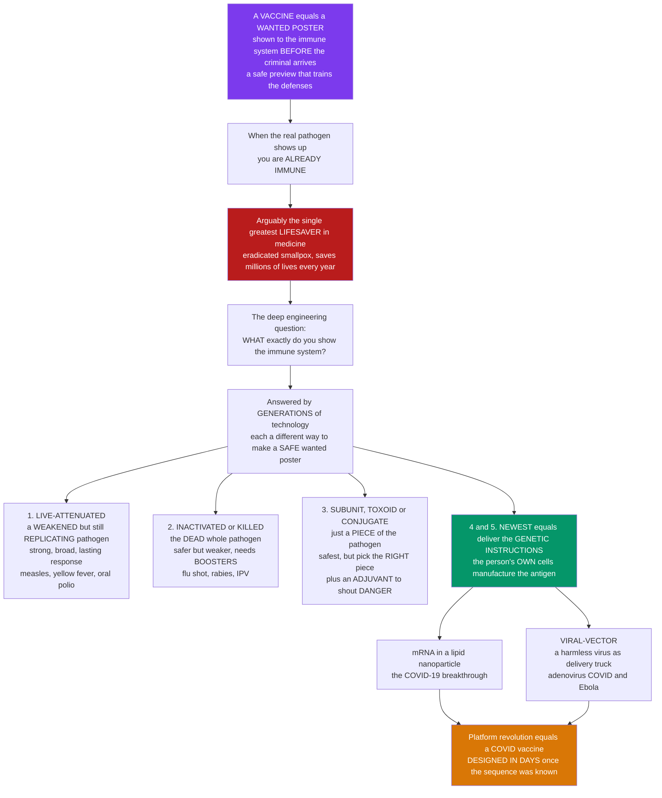

# 💉 Vaccines and Vaccine Technology

> [!abstract] TL;DR
> A **vaccine** is a safe **"wanted poster"** you show your immune system *before* the criminal ever arrives — a harmless preview of a pathogen that trains your defences to recognise and destroy it, so that if the real thing shows up you are **already immune**. It is arguably the **single greatest lifesaver in the history of medicine**: it eradicated **smallpox**, drove **polio** to the brink, and saves an estimated **several million lives a year**. This note is the applied companion to the *immunology* of memory (which explains *why* a preview works) and to *herd immunity* (the population payoff); its own subject is the **engineering** question — **what exactly do you show the immune system?** Over two centuries the answer evolved through **generations of technology**, each a different way to build a safe wanted poster: **(1) live-attenuated** — a *weakened but still replicating* pathogen (measles, yellow fever, oral polio) giving strong, broad, durable immunity from few doses; **(2) inactivated/killed** — the *dead* whole pathogen (flu, rabies, IPV), safe and stable but weaker, needing boosters and adjuvant; **(3) subunit / recombinant / toxoid / conjugate** — just a *piece* (a protein, sugar, or disarmed toxin: hepatitis B, HPV, Hib, tetanus), the safest but least immunogenic, so it needs an **adjuvant** to shout "danger"; **(4) nucleic-acid** — deliver the *genetic instructions* (mRNA in lipid nanoparticles) so the person's **own cells manufacture the antigen** (the COVID-19 breakthrough; Karikó & Weissman, Nobel 2023); and **(5) viral-vector** — a harmless virus as a delivery truck for the antigen gene (adenovirus-vectored COVID and Ebola). The platform revolution meant a COVID vaccine could be **designed within days** of the virus being sequenced. Understanding vaccine technology — the platforms, their trade-offs, the role of **adjuvants**, and the art of **antigen selection** — is understanding how immunology's principles become humanity's most powerful preventive tool. *Educational science content, not medical advice.*

---

## Intuition

**Analogy first — a wanted poster shown before the criminal arrives.** Imagine your immune system as a city's police force. Its problem is that it is dangerously *slow the first time* it meets a new criminal: it has to work out who the enemy is, sketch a likeness, and train officers to recognise them — and while it scrambles, the criminal runs wild (you get sick, or worse). But suppose you could hand the police a **wanted poster** *before the criminal ever set foot in the city* — a safe likeness of the enemy's face. The officers study it, memorise it, and post lookouts. Now when the real criminal finally arrives, there is no scramble: he is spotted and arrested on sight. That poster is a **vaccine**, and the memorising is **immunological memory** — the reason the whole trick works is explained in the memory-and-vaccination-principles note; here we ask the *engineering* question the poster raises.

Because the deep question is: **what exactly do you print on the poster?** You cannot use the real, dangerous criminal. So over two centuries humanity invented **generations** of ways to make a *safe* likeness. The oldest is **live-attenuated**: use the *real* criminal but **crippled** — weakened so badly he cannot commit crimes, yet still *alive and moving*, so the police get a vivid, complete, lasting picture (measles, yellow fever). **Inactivated (killed)** vaccines use a *dead* criminal — perfectly safe, but a lifeless mugshot is less memorable, so you need **booster** postings (the flu shot, rabies). **Subunit** vaccines are cleverer still: don't show the whole criminal at all, just **one distinctive feature** — a scar, a tattoo, a face (a single protein or sugar). Safest of all, but now you must pick the *right* feature, and a lone photo of a tattoo looks so harmless that the police shrug — so you staple on an **adjuvant**, an irritant that shouts *"this is DANGEROUS — pay attention!"* and wakes the force up.

The newest generation is a genuine revolution. Instead of printing the poster at all, you hand the city's own print shop the **digital file** and let it print the poster itself: **mRNA vaccines** inject the genetic *recipe* for the criminal's face, and your **own cells** manufacture and display it (the COVID-19 breakthrough); **viral-vector** vaccines use a harmless virus as the courier that delivers that gene. The payoff is staggering: because you only need the enemy's *sequence*, a COVID-19 vaccine could be **designed in days** once the virus was read. Understanding these platforms — weakened live pathogens, killed whole organisms, purified pieces with adjuvants, and genetic instructions — is understanding the art of **safely teaching immunity**.

---

## How It Works

### Core mechanics

1. **The goal is protective memory, not the disease.** Every platform tries to do one thing: trigger a real **primary immune response** — antigen presentation, T-cell help, B-cell activation, affinity maturation — that leaves behind durable **memory** (and often **neutralising antibody**), *without* the danger of the actual infection. The immunology of that memory is identical across platforms; they differ only in **how the antigen and the danger signal are delivered**.
2. **The two design decisions.** A vaccine is defined by (a) **what antigen** it presents — the whole pathogen, a piece, or the genetic instructions to build a piece — and (b) **how strongly it alarms innate immunity** — either intrinsically (a replicating microbe is full of danger signals) or via an added **adjuvant**.
3. **Live-attenuated — the real pathogen, crippled.** A weakened strain still **replicates** in the host, so a tiny dose *amplifies itself* into abundant antigen and presents the full natural repertoire of epitopes in the right context. Result: strong, broad, **durable** immunity (often lifelong from one or two doses) engaging **both antibody and cytotoxic T cells**. Cost: a small risk of **reversion** to virulence and unsuitability for the **immunocompromised** or pregnant.
4. **Inactivated/killed — the pathogen, dead.** Chemical or heat treatment destroys the ability to replicate. It **cannot revert** and is stable, but a non-replicating, dead antigen is a weaker stimulus — so it needs **higher doses, adjuvant, and boosters**, and tends to favour antibody over strong T-cell responses.
5. **Subunit / recombinant / toxoid / conjugate — just the essential piece.** Present only a defined component: a **recombinant protein** (hepatitis B surface antigen), a **virus-like particle** (HPV), a chemically inactivated **toxin** = **toxoid** (tetanus, diphtheria), or a bacterial **polysaccharide**. Safest and most defined, but **least immunogenic**, so an **adjuvant** is usually essential. **Conjugate** vaccines solve a special problem — plain polysaccharides can't recruit **T-cell help** (they engage B cells only), so they are **chemically linked to a carrier protein**, converting a weak, memoryless response into a strong, T-dependent, memory-forming one (the innovation that made **Hib, pneumococcal, and meningococcal** vaccines work in infants).
6. **Nucleic-acid — deliver the recipe, not the dish.** An **mRNA** encoding the antigen is packaged in a **lipid nanoparticle** (LNP) that carries it into host cells; the cell's own **ribosomes translate** it, and the freshly made antigen is displayed to the immune system exactly as in a natural infection. No live pathogen, no egg-based growth, and design reduces to **typing a sequence** — enabling near-instant redesign. **DNA** vaccines work similarly but must reach the nucleus.
7. **Viral-vector — a harmless courier.** The antigen gene is inserted into a **replication-defective** (or harmless) virus — commonly an **adenovirus** — which infects cells and delivers the gene, again letting the host manufacture the antigen. Strong T-cell responses, but **pre-existing immunity to the vector** can blunt boosting.
8. **Adjuvants — the "danger" amplifier.** Purified antigens often look *boringly harmless* to innate immunity. **Adjuvants** (aluminium salts, oil-in-water emulsions like MF59/AS03, **TLR agonists**, saponins like QS-21) supply the **innate pattern-recognition / danger signal** that licenses a strong, durable, higher-quality response. They are why subunit vaccines work at all.
9. **From bench to arm.** A candidate moves through **preclinical** studies → **phased clinical trials** (Phase I safety, II immunogenicity/dose, III efficacy) → **regulatory approval** → deployment and ongoing **pharmacovigilance** — the same evaluation machinery as any drug, compressed dramatically for COVID-19 without skipping the safety steps.

### The technology arc — one poster, five ways to print it



---

## Key Concepts

### Secondary — the big picture

- **What a vaccine is.** A safe "wanted poster" of a germ. It shows your immune system a harmless version of the enemy so your body builds **memory** and is **ready** before the real germ ever arrives. This is **active** immunisation — *your own* body does the learning.
- **Why it is the greatest lifesaver.** Vaccines **wiped out smallpox** worldwide, nearly ended **polio**, and save **millions of lives every year**. When enough people are vaccinated, a disease can't spread at all — **herd immunity**.
- **The big idea in each generation:**
  - **Live but weakened** — the real germ, crippled so it can't make you sick (measles, yellow fever). Strong and long-lasting.
  - **Killed** — the dead germ. Safe, but weaker, so you need booster shots (flu, rabies).
  - **Just a piece** — only one part of the germ (hepatitis B, HPV). Safest, but usually needs an **adjuvant**, a helper that shouts "danger!" to wake up the immune system.
  - **Genetic instructions** — the newest kind. You inject the *recipe* (mRNA) and **your own cells build the germ's protein** and show it off. This is how the COVID-19 vaccines work, and why they could be made so fast.
- **Adjuvants** are helpers that make a vaccine work better by making the immune system take the threat seriously.

### Undergraduate — the platforms and their trade-offs

- **The five platform families (the core of this note):**

| Platform | What is delivered | Immunogenicity | Safety | Durability | Adjuvant? | Examples |
|---|---|---|---|---|---|---|
| **Live-attenuated** | weakened replicating pathogen | very high, broad B+T | lower (reversion; not for immunocompromised) | high, often 1–2 doses | usually **no** (self-amplifying) | MMR, varicella, yellow fever, **BCG**, oral polio (OPV), rotavirus |
| **Inactivated / killed** | dead whole pathogen | moderate, antibody-biased | high, cannot revert | moderate, needs boosters | often **yes** | inactivated polio (IPV), rabies, hepatitis A, most flu |
| **Subunit / recombinant / toxoid / conjugate** | a protein, VLP, sugar, or disarmed toxin | lowest, most defined | highest | moderate | **yes, essential** | hepatitis B, **HPV** (VLP), acellular pertussis, tetanus/diphtheria toxoids, **Hib / pneumococcal / meningococcal conjugates** |
| **mRNA (nucleic-acid)** | mRNA in a lipid nanoparticle; host cell makes antigen | high, strong T + antibody | high, no live pathogen | moderate (waning studied) | LNP is intrinsically **self-adjuvanting** | COVID-19 (BNT162b2, mRNA-1273) |
| **Viral-vector** | antigen gene in a harmless/defective virus | high, strong T-cell | good | good | vector supplies danger signals | adenovirus COVID-19, **Ebola** (rVSV-ZEBOV) |

- **Why live-attenuated is strong.** Replication *amplifies* the antigen dose from a tiny inoculum and presents the pathogen's full epitope set in its native context, engaging **CD8 cytotoxic T cells** and **CD4 helpers** and generating durable memory — often lifelong from one or two doses.
- **The conjugate innovation.** Polysaccharides are **T-independent** antigens: B cells bind them but get no **T-cell help**, so the response is weak, IgM-dominated, and *memoryless* — and infants respond especially poorly. **Conjugating** the sugar to a **carrier protein** (the hapten–carrier principle, see *Antigens, Epitopes and Immunogenicity*) recruits T-helper cells, converting it into a strong, class-switched, **memory-forming** T-dependent response. This slashed childhood meningitis.
- **Toxoids.** For diseases caused by a **toxin** (tetanus, diphtheria), you don't need immunity to the whole bacterium — just to the toxin. A chemically **inactivated toxin (toxoid)** raises neutralising antibody that mops up the real toxin.
- **The mRNA workflow.** Sequence the pathogen → design an mRNA encoding the chosen antigen (e.g. the **prefusion-stabilised spike**) → encapsulate in a **lipid nanoparticle** → the LNP delivers mRNA into cells → **ribosomes translate** it → antigen is displayed → immune response. Key enabler: **nucleoside modification** (pseudouridine) by **Karikó & Weissman** that tamed the innate over-reaction to foreign RNA, making it safe and translatable (2023 Nobel Prize).
- **Adjuvants, catalogued.** **Alum** (classic, antibody/Th2-biased), **oil-in-water emulsions** (MF59, AS03), **TLR-agonist systems** (AS04 = alum + MPL; CpG), and **saponins** (QS-21, in AS01 for shingles and malaria). Each shapes not just the *magnitude* but the *type* (Th1 vs Th2) and *durability* of the response.
- **Route matters.** Most vaccines are **intramuscular**, but **mucosal** routes (oral OPV, intranasal flu) can raise **secretory IgA** at the entry surface — see *Mucosal and Regional Immunity* — the frontier for stopping transmission, not just disease.

### Graduate — design, evaluation, and frontiers

- **Antigen selection is the hardest problem.** You must pick an epitope that is **conserved** (so the pathogen cannot mutate away from it — link to antigenic variation), **surface-exposed and neutralisation-sensitive**, and correctly **folded**. Structure-based design (e.g. **prefusion stabilisation** of the RSV F and SARS-CoV-2 spike proteins) locks the antigen into the conformation that elicits the best **neutralising** antibodies.
- **Reverse vaccinology (Rappuoli).** Instead of culturing a pathogen and testing its proteins one by one, start from its **genome**, computationally predict every surface/secreted protein, and screen those as candidates. This delivered the **meningococcus B (4CMenB / Bexsero)** vaccine against a pathogen that resisted classical approaches, and it is the paradigm behind rapid modern design.
- **Correlates of protection.** Licensure often rests on a measurable **immune marker** (usually a neutralising antibody titer) that predicts protection — anti-HBs for hepatitis B, HAI titer for influenza — letting regulators bridge to efficacy without always running a full field trial (see the memory-and-vaccination note for the formal distinction of mechanistic vs non-mechanistic correlates).
- **Prime-boost logic.** Vaccination deliberately engineers a **secondary response**: the prime seeds memory, the boost recalls and matures it to higher, more durable titers. **Heterologous** prime-boost (e.g. viral-vector prime + protein boost) can broaden responses and dodge anti-vector immunity.
- **The response type must match the pathogen.** Extracellular toxins and viruses → **neutralising antibody**; intracellular pathogens and tumours → **cytotoxic T cells / Th1**. Adjuvant and platform choice steer **Th1/Th2/Th17** polarisation to fit.
- **Manufacturing, stability, and equity.** Egg-based flu manufacture takes ~6 months; **mRNA** is cell-free and fast but historically needed **ultra-cold chain** (a deployment barrier in low-resource settings). Scalability, thermostability, and cost are as decisive for global impact as immunogenicity — the reason vaccine **equity** is a core public-health problem.
- **Hard targets and immune evasion.** **HIV** (glycan-shielded, hypervariable, latent), **influenza** (antigenic drift/shift → the quest for a **universal** vaccine against the conserved stalk), **malaria** (multistage, antigenically variable; RTS,S and R21 are hard-won partial successes), and **TB** all defeat single-antigen strategies — the immune-evasion problem covered in the host–pathogen strategies note.
- **Therapeutic and next-generation frontiers.** Vaccines are no longer only preventive: **therapeutic cancer vaccines** present **neoantigens** (increasingly as personalised **mRNA**) to steer T cells against a tumour — the bridge to checkpoint-inhibitor immunotherapy. Add **mucosal / needle-free** delivery, **self-amplifying mRNA**, thermostable formulations, and **rapid-response** platforms for pandemic preparedness, and vaccinology becomes a programmable technology.
- **Vaccine hesitancy.** A technical triumph can still fail at the **social** layer; misinformation and eroded trust are now among the largest barriers to the tool's impact, making risk communication part of vaccine science.

---

## Python Demo

```python
# Vaccine technology, quantified four ways:
#   (1) PLATFORM COMPARISON: score the five platform families across the key
#       design properties (response strength, safety, durability, adjuvant-free,
#       cold-chain-free, dev speed) as a heatmap -- every platform trades one
#       property for another; there is no free lunch.
#   (2) WHY LIVE > INACTIVATED: a live-attenuated vaccine REPLICATES, amplifying
#       a tiny inoculum into abundant antigen (large cumulative exposure), while
#       an inactivated dose only decays -> stronger, broader response.
#   (3) ADJUVANT BOOST: antibody titer over time for antigen ALONE vs
#       antigen + ADJUVANT. The adjuvant provides the innate "danger" signal,
#       raising both the PEAK and the DURABILITY of the response.
#   (4) DEVELOPMENT SPEED: days from pathogen sequence to a ready candidate,
#       traditional platforms vs the mRNA platform (design = typing a sequence).
import numpy as np
import matplotlib.pyplot as plt

fig, ax = plt.subplots(2, 2, figsize=(14, 10))

# ---------- (1) PLATFORM COMPARISON heatmap ----------
platforms = ["Live-\nattenuated", "Inactivated", "Subunit /\nconjugate", "mRNA", "Viral-\nvector"]
props = ["Response\nstrength", "Safety", "Durability",
         "Adjuvant-\nfree", "Cold-chain-\nfree", "Dev\nspeed"]
# scores 1 (unfavorable) .. 5 (favorable); all oriented so HIGHER = better
scores = np.array([
    [5, 2, 5, 5, 2, 2],   # live-attenuated
    [3, 4, 3, 3, 4, 3],   # inactivated
    [3, 5, 3, 1, 4, 2],   # subunit/conjugate
    [4, 4, 3, 4, 1, 5],   # mRNA
    [4, 3, 4, 4, 3, 4],   # viral-vector
])
im = ax[0, 0].imshow(scores, cmap="RdYlGn", vmin=1, vmax=5, aspect="auto")
ax[0, 0].set_xticks(range(len(props)));      ax[0, 0].set_xticklabels(props, fontsize=8)
ax[0, 0].set_yticks(range(len(platforms)));  ax[0, 0].set_yticklabels(platforms, fontsize=8)
for i in range(scores.shape[0]):
    for j in range(scores.shape[1]):
        ax[0, 0].text(j, i, scores[i, j], ha="center", va="center",
                      color="black", fontsize=10, fontweight="bold")
ax[0, 0].set_title("(1) PLATFORM TRADE-OFFS  (5 = favorable, 1 = unfavorable)\n"
                   "no platform wins on every axis")
cb = fig.colorbar(im, ax=ax[0, 0], fraction=0.046, pad=0.04)
cb.set_label("favorability", fontsize=8)

# ---------- (2) WHY LIVE-ATTENUATED BEATS INACTIVATED ----------
t = np.linspace(0, 14, 400)                       # days after a single dose
# inactivated: fixed inoculum that only decays (no replication)
inact = 1.0 * np.exp(-t / 3.0)
# live-attenuated: tiny inoculum REPLICATES (logistic growth) then is cleared
r, cap, clear = 1.6, 40.0, 0.35
grow = 0.3 * np.exp(r * t)
live = cap * grow / (cap + grow) * np.exp(-clear * np.clip(t - 6, 0, None))
ax[0, 1].plot(t, inact, color="#2563eb", lw=2.6, label="inactivated (decays only)")
ax[0, 1].plot(t, live,  color="#059669", lw=2.6, label="live-attenuated (replicates)")
ax[0, 1].fill_between(t, live, alpha=0.15, color="#059669")
ax[0, 1].fill_between(t, inact, alpha=0.15, color="#2563eb")
auc_live = np.trapz(live, t);  auc_inact = np.trapz(inact, t)
ax[0, 1].set_xlabel("days after a single dose")
ax[0, 1].set_ylabel("antigen available to immune system")
ax[0, 1].set_title(f"(2) WHY LIVE > INACTIVATED:\nreplication amplifies antigen "
                   f"({auc_live/auc_inact:.0f}x more cumulative exposure)")
ax[0, 1].legend(fontsize=9)
ax[0, 1].grid(alpha=0.3)

# ---------- (3) ADJUVANT BOOST: antigen alone vs antigen + adjuvant ----------
tt = np.linspace(0, 180, 600)                     # days
def response(peak, lag, rise, half_life):
    """Rise to a peak, then exponential contraction to a memory setpoint."""
    up = 1.0 / (1.0 + np.exp(-(tt - lag) / rise))
    down = np.where(tt > lag + 14, np.exp(-np.log(2) * (tt - (lag + 14)) / half_life), 1.0)
    return peak * up * down
alone     = response(peak=1.0, lag=10, rise=2.5, half_life=25)   # weak, fast decay
adjuvant  = response(peak=3.2, lag=8,  rise=2.5, half_life=70)   # higher + durable
prot = 0.7
ax[1, 0].plot(tt, alone,    color="#94a3b8", lw=2.6, label="antigen alone (poorly immunogenic)")
ax[1, 0].plot(tt, adjuvant, color="#d97706", lw=2.8, label="antigen + ADJUVANT (danger signal)")
ax[1, 0].axhline(prot, ls="--", color="0.5", lw=1, label="protective threshold")
ax[1, 0].set_xlabel("days after vaccination")
ax[1, 0].set_ylabel("antibody titer")
ax[1, 0].set_title("(3) ADJUVANTS supply the 'DANGER' signal:\n"
                   "higher peak AND longer-lasting protection")
ax[1, 0].legend(fontsize=8)
ax[1, 0].grid(alpha=0.3)

# ---------- (4) DEVELOPMENT SPEED: sequence -> ready candidate ----------
labels = ["Egg-based\nflu", "Classical\nsubunit", "Viral-\nvector", "mRNA\nplatform"]
days_to_candidate = [180, 150, 60, 3]             # illustrative days sequence -> candidate
colors = ["#b91c1c", "#d97706", "#2563eb", "#059669"]
bars = ax[1, 1].barh(labels, days_to_candidate, color=colors, edgecolor="black")
for b, d in zip(bars, days_to_candidate):
    ax[1, 1].text(d + 3, b.get_y() + b.get_height() / 2, f"{d} d",
                  va="center", fontsize=9, fontweight="bold")
ax[1, 1].set_xlabel("days from pathogen SEQUENCE to a ready vaccine candidate")
ax[1, 1].set_title("(4) DEVELOPMENT SPEED:\nmRNA design = typing a sequence -> a COVID vaccine in DAYS")
ax[1, 1].set_xlim(0, 210)
ax[1, 1].grid(alpha=0.3, axis="x")

plt.tight_layout()
plt.savefig("vaccines_and_vaccine_technology.png", dpi=130)

# ---------- quantify the lessons ----------
print("(1) Platform trade-offs (higher = more favorable):")
for name, row in zip([p.replace(chr(10), ' ') for p in platforms], scores):
    print(f"    {name:22s} {row}")
print(f"(2) Live-attenuated delivers ~{auc_live/auc_inact:.0f}x the cumulative antigen "
      f"exposure of an inactivated dose (replication amplifies).")
print(f"(3) Adjuvant raises peak titer {adjuvant.max()/alone.max():.1f}x and keeps titer "
      f"above threshold far longer.")
print(f"(4) mRNA reaches a candidate in ~{days_to_candidate[-1]} days vs "
      f"~{days_to_candidate[0]} days for egg-based flu.")
```

**What the plots show.** Panel (1) is the **central lesson of the whole note**: a heatmap scoring each platform across six design axes shows there is **no free lunch** — live-attenuated is strong and durable but less safe and hard to store; subunit is the safest but needs an adjuvant and is weakly immunogenic; mRNA designs fastest but historically demanded an ultra-cold chain. Every platform **trades one property for another**. Panel (2) explains *why* a **live-attenuated** vaccine beats an **inactivated** one from the same tiny inoculum: because the live strain **replicates**, it amplifies the antigen into a far larger cumulative exposure (the shaded area), presenting more antigen for longer and engaging a broader response — while the inactivated dose only decays. Panel (3) is the **adjuvant effect**: a purified antigen alone barely crosses the protective threshold and fades fast, but **antigen + adjuvant** — the innate "danger" signal — reaches a much higher peak *and* stays protective far longer. Panel (4) captures the **platform revolution**: the number of days from reading a pathogen's sequence to a ready candidate collapses from ~6 months for egg-based flu to a handful of days for **mRNA**, because design has been reduced to typing a sequence.

---

## Real-World Applications

- **Smallpox eradication — the founding proof.** Jenner's 1796 use of **cowpox** (a live cross-reactive orthopoxvirus) to protect against smallpox was the first vaccine; two centuries later a global live-vaccine campaign broke every transmission chain and the WHO declared smallpox **eradicated in 1980** — the only human disease ever eliminated, and the ultimate demonstration of the wanted-poster principle at species scale (see *Vaccination, Herd Immunity and Elimination* for the epidemiology).
- **The COVID-19 mRNA breakthrough.** Within **days** of the SARS-CoV-2 sequence being published in January 2020, mRNA candidates encoding the **prefusion-stabilised spike** were designed; two (BNT162b2, mRNA-1273) reached emergency authorisation the same year. This validated the **nucleic-acid platform** at planetary scale and rested directly on Karikó & Weissman's **nucleoside-modified mRNA** (2023 Nobel Prize) and on decades of LNP delivery work.
- **Conjugate vaccines and childhood meningitis.** **Hib**, **pneumococcal (PCV)**, and **meningococcal** conjugate vaccines link bacterial polysaccharides to carrier proteins to recruit **T-cell help**, converting a weak infant response into durable memory. Hib disease in children fell by more than 90% where introduced — the hapten–carrier principle turned into public-health infrastructure.
- **HPV virus-like particles preventing cancer.** The **HPV** vaccine self-assembles the viral L1 capsid protein into empty **virus-like particles** — no genome, no infection — that are potently immunogenic. It is the first vaccine to **prevent a cancer** (cervical and others), a preventive tool with an oncology payoff.
- **Ebola and rapid outbreak response.** The **rVSV-ZEBOV** viral-vector vaccine (a live recombinant vesicular stomatitis virus carrying the Ebola glycoprotein) was deployed in **ring-vaccination** outbreak response in West and Central Africa, showing how vector platforms enable rapid answers to emerging threats.
- **Therapeutic cancer vaccines.** Personalised **neoantigen mRNA** vaccines (e.g. individualised melanoma and pancreatic-cancer candidates, often combined with checkpoint inhibitors) turn the preventive platform into a **treatment**, teaching T cells to attack tumour-specific mutations — the frontier that connects vaccinology to cancer immunotherapy.

---

## Common Pitfalls

- **"A vaccine gives you a mild version of the disease."** A well-designed vaccine gives the immune **stimulus** without the **illness**. Even live-attenuated strains are crippled to replicate too weakly to cause disease in an immunocompetent host; subunit and mRNA vaccines contain no infectious agent at all.
- **"mRNA vaccines change your DNA."** mRNA acts in the **cytoplasm**, is **translated by ribosomes** like any cellular mRNA, and is degraded within days — it never enters the nucleus and cannot integrate into the genome (see *Nucleic Acid Therapeutics* and the genetics of transcription/translation). The cell simply **manufactures the antigen** and then clears the instructions.
- **"Live-attenuated is always best because it's strongest."** Its strength comes from replication, which is exactly why it carries **reversion** risk and is **contraindicated** in the immunocompromised and pregnancy. Safety, storage, and population context often make an inactivated or subunit platform the right choice.
- **"Subunit vaccines fail because the antigen is weak."** The antigen is *defined and safe* — its weakness is by design, and the fix is a well-matched **adjuvant**. Blaming the antigen misses that immunogenicity is **contextual**: the same protein is inert alone and protective with a danger signal.
- **"Polysaccharide and conjugate vaccines are the same thing."** Plain polysaccharide vaccines are **T-independent** — weak, IgM-biased, and poor in infants. **Conjugating** the sugar to a carrier protein recruits **T-cell help**, producing class-switched, high-affinity, **memory** responses. The conjugation is the whole innovation.
- **"Once a vaccine exists, the problem is solved."** Antigenically variable pathogens (**flu, HIV, malaria**) require constant redesign or resist vaccines entirely; **waning immunity** needs boosters; and **hesitancy, equity, and cold-chain** logistics can defeat a technically excellent vaccine at the social and delivery layer.
- **"Adjuvants are just fillers."** Adjuvants are **active immunological agents** that determine the magnitude, **quality (Th1 vs Th2)**, and durability of the response by engaging innate pattern-recognition (see *Innate Immune Recognition and Pattern Receptors*). Choosing the adjuvant is choosing the kind of immunity you get.

---

## Related Concepts

- [[Immunological_Memory_and_Vaccination_Principles]] — the S04 companion explaining *why* a preview works: primary vs secondary responses, memory cells, boosters, and correlates of protection. This note supplies the **platforms**; that note supplies the **principle** — the two are deliberately non-overlapping.
- [[Antigens_Epitopes_and_Immunogenicity]] — the target-selection problem: which epitope to put on the "poster," why conformation matters, and the **hapten–carrier** logic that conjugate vaccines exploit.
- [[Innate_Immune_Recognition_and_Pattern_Receptors]] — the innate "danger"/pattern-recognition signalling that **adjuvants** hijack to license a strong, durable response to an otherwise inert antigen.
- [[Vaccines_and_Antibiotics]] — the Biology/11 introduction to how vaccines and antibiotics prevent and treat infection; this note is the immunology-vault deep dive into the vaccine **technology** it introduces.
- [[Vaccination_Herd_Immunity_and_Elimination]] — the Epidemiology/04 population-scale payoff: how individual vaccine-induced immunity aggregates into herd immunity, elimination, and eradication.
- [[Clinical_Trials_and_Drug_Approval]] — the Pharmacology/04 pipeline (Phase I–III, regulatory approval, pharmacovigilance) through which every vaccine candidate is evaluated for safety and efficacy.
- [[Nucleic_Acid_Therapeutics]] — the Pharmacology/02 view of mRNA/DNA/LNP technology that underlies the nucleic-acid vaccine platform.

*Siblings in this S06 section, referenced in prose until built: **Immunological_Memory_and_Vaccination_Principles** is the memory principle above; **Cancer_Immunotherapy_and_Checkpoint_Inhibitors** (therapeutic and neoantigen mRNA vaccines that turn this preventive platform into a treatment); **Monoclonal_Antibodies_and_Biologics** (the engineered-antibody counterpart — passive rather than active immunity); **Infection_and_Host_Pathogen_Immune_Strategies** (the antigenic variation and immune-evasion problem that makes HIV, flu, and malaria hard vaccine targets); and **The_Reach_and_Future_of_Immunology** (mucosal/needle-free delivery, self-amplifying mRNA, and pandemic preparedness).*

---

## Review Questions

**Secondary.** Using the "wanted poster" picture, explain what a vaccine shows your immune system and why that makes you immune *before* you ever meet the real germ. Then describe, in plain terms, the difference between a **live-attenuated**, a **killed**, and a "just a piece" (**subunit**) vaccine, and say what an **adjuvant** is for.

**Undergraduate.** A new bacterium causes disease mainly through a secreted **toxin**, and its protective surface antigen is a **polysaccharide** that infants respond to poorly. (a) Which platform would you choose to neutralise the toxin, and what is that preparation called? (b) How would you redesign the polysaccharide component so that infants build durable memory, and what immunological mechanism does your fix recruit? Justify each choice.

**Graduate.** Compare the **mRNA** and **live-attenuated** platforms across immunogenicity, safety, durability, speed of design, and cold-chain requirements, and explain the mechanistic reason each excels or struggles on each axis. Then explain (a) why **antigen conformation** (e.g. prefusion stabilisation) can matter more than antigen *identity* for eliciting neutralising antibody, and (b) why an antigenically variable pathogen such as influenza defeats a single-antigen strategy and what design approaches aim to overcome it.

---

## Sources

- Plotkin, S. A., Orenstein, W. A., Offit, P. A. & Edwards, K. M. (Eds.). *Plotkin's Vaccines*, 7th ed. (2018). Elsevier — the definitive reference on vaccine platforms, adjuvants, and correlates of protection.
- Pulendran, B. & Ahmed, R. (2011). "Immunological mechanisms of vaccination." *Nature Immunology* 12(6): 509–517. https://doi.org/10.1038/ni.2039
- Pardi, N., Hogan, M. J., Porter, F. W. & Weissman, D. (2018). "mRNA vaccines — a new era in vaccinology." *Nature Reviews Drug Discovery* 17(4): 261–279. https://doi.org/10.1038/nrd.2017.243
- Rappuoli, R. (2000). "Reverse vaccinology." *Current Opinion in Microbiology* 3(5): 445–450. https://doi.org/10.1016/S1369-5274(00)00119-3
- Pollard, A. J. & Bijker, E. M. (2021). "A guide to vaccinology: from basic principles to new developments." *Nature Reviews Immunology* 21: 83–100. https://doi.org/10.1038/s41577-020-00479-7

---

#immunology #vaccines #mrna-vaccines #adjuvants #vaccine-platforms
