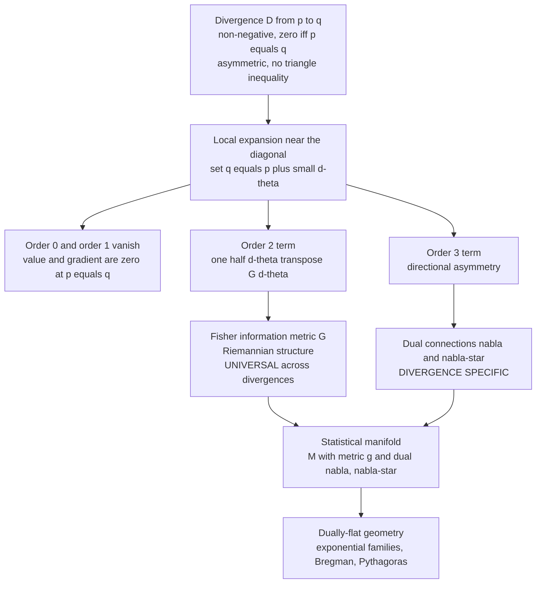

# 📐 Divergences as Geometric Structure

> [!abstract] TL;DR
> A **divergence** $D(p\,\|\,q)$ is a relaxed, one-way notion of separation between probability distributions: non-negative, zero exactly when $p=q$, but generally **asymmetric** and with **no triangle inequality** — a "directed squared-distance," not a true metric. The deep fact (Eguchi's theorem) is that the *local* behavior of any smooth divergence secretly encodes a full geometry: its **second-order** term gives a unique Riemannian metric — the **Fisher metric** — while its **third-order** asymmetry gives a **pair of dual connections**. So the divergence is the *primitive* from which the whole geometric structure $(M, g, \nabla, \nabla^{*})$ is derived. The metric is *universal* (every invariant divergence yields the same Fisher metric), but the connection is *divergence-specific*.

---

## Intuition

**Analogy — the effort to walk uphill.** How "far apart" are two distributions? Ordinary distance won't do. The gap between being "90% sure" and "99% sure" *feels* far larger than the gap between "50%" and "59%," even though both move by nine points — near certainty, small shifts carry huge evidential weight. And distinguishing one distribution from another can be genuinely *easier one direction than the other*: a sharp model is quickly refuted by broad data, while broad data is only weakly refuted by a sharp model. A **divergence** captures exactly this. It is like the **effort to walk between two points on a hillside** — going uphill costs more than coming down, so the "cost" from $p$ to $q$ need not equal the cost from $q$ to $p$. It is a relaxed, directional measure of dissimilarity, not a symmetric ruler.

Now the surprise. Stand at a point and take only *tiny* steps. On a hillside, the local rise-over-run — the tiny quadratic bowl you feel underfoot — is the same whether you eventually plan to climb or descend; the asymmetry only shows up over larger moves. Distributions behave identically: **zoom into any well-behaved divergence and its leading curvature is a genuine Riemannian metric (the Fisher metric), while the direction-dependence only appears at the next order (the connection).** The geometry is *hidden inside the divergence* — you recover a metric and a pair of dual connections just by Taylor-expanding.

---

## How It Works

### Core mechanics

A **divergence** (also called a **contrast function** or discrepancy) on a statistical manifold $M = \{p_\theta\}$ is a smooth $D(\cdot\,\|\,\cdot) \ge 0$ with $D(p\,\|\,q) = 0 \iff p = q$. Fix a point $\theta$ and probe a nearby point $\theta + d\theta$. Write $D(\theta) \equiv D(p_\theta \,\|\, p_{\theta+d\theta})$ and Taylor-expand in $d\theta$:

1. **Order 0 vanishes.** $D(p_\theta\,\|\,p_\theta) = 0$ — the divergence is zero on the diagonal.
2. **Order 1 vanishes.** Because $D \ge 0$ has a *minimum* of zero on the diagonal, its gradient there is zero: the diagonal is a valley floor in every direction.
3. **Order 2 is the metric.** The leading nonzero term is a quadratic form
$$D(p_\theta \,\|\, p_{\theta+d\theta}) \;=\; \tfrac{1}{2}\, d\theta^\top G(\theta)\, d\theta \;+\; O(\|d\theta\|^3),$$
and the matrix $G(\theta) = \big[\partial_i \partial'_j D\big]_{\theta'=\theta}$ turns out to be exactly the **Fisher information matrix**. This is the Riemannian metric. It is *symmetric* — forward and reverse agree to this order — which is why the asymmetry was invisible at small scale.
4. **Order 3 is the connection.** The first place $D(p\,\|\,q)$ and $D(q\,\|\,p)$ disagree is the cubic term. That third-order tensor defines a **connection** $\nabla$ (how to differentiate vectors as you move on the manifold), and the *reverse* divergence $\bar D(p\,\|\,q) = D(q\,\|\,p)$ defines its **dual** $\nabla^{*}$, tied together by the metric $g$. This is the **dually-flat** structure that underlies exponential families and Bregman geometry.

The punchline (Eguchi, 1983/1992): **one divergence generates the whole triple** $(g, \nabla, \nabla^{*})$. Different divergences that share the same $g$ can carry *different* connections — the metric is the universal skeleton, the connection is the divergence's fingerprint.

**Universality of the Fisher metric.** Any divergence that is *invariant* under sufficient statistics (the natural symmetry of statistics) must produce the same second-order term. This is the geometric shadow of Chentsov's uniqueness theorem: the Fisher metric is the *only* Riemannian metric on a statistical manifold invariant under sufficient statistics, up to scale. So KL, squared Hellinger, $\chi^2$, and every $f$-divergence all melt down to the same Fisher metric locally — they differ only in higher order.

**The canonical cast.**

- **KL / relative entropy** $D_{\mathrm{KL}}(p\,\|\,q) = \sum_x p\log\frac{p}{q}$ — the archetypal divergence; its dual connections are the flat $e$-connection and $m$-connection of exponential families.
- **Squared Hellinger** $H^2(p,q) = \tfrac12\sum_x(\sqrt p - \sqrt q)^2$ — symmetric, bounded; recovers the same Fisher metric at $\tfrac14$ the scale of KL.
- **$\chi^2$ divergence** $\sum_x \frac{(p-q)^2}{q}$ — the quadratic member; also Fisher locally.
- **$f$-divergences** $D_f(p\,\|\,q) = \sum_x q\, f\!\big(\tfrac{p}{q}\big)$ with $f$ convex, $f(1)=0$ — the whole invariant family; each yields Fisher $\times\, \tfrac{f''(1)}{2}$ locally.
- **Bregman divergences** $B_\phi(x,y) = \phi(x) - \phi(y) - \langle \nabla\phi(y), x-y\rangle$ — the *canonical divergence* of a **dually-flat** space; KL is the Bregman divergence of the log-partition function.
- **Symmetrized forms** — Jeffreys $J = D_{\mathrm{KL}}(p\|q) + D_{\mathrm{KL}}(q\|p)$ and **Jensen–Shannon** restore symmetry but sacrifice the clean dual-flat structure.

### Flow / architecture



---

## Key Concepts

**Secondary (plain-language core).**
A *divergence* scores how dissimilar two probability distributions are: always $\ge 0$, zero only when they match. Unlike ordinary distance it can be *one-way* — the score from $p$ to $q$ need not equal $q$ to $p$ — and it can skip the triangle inequality. Zoom in on small differences and it always looks like a smooth quadratic bowl; that bowl *is* the geometry.

**Undergraduate (working machinery).**
For a parametric family $p_\theta$, the second derivative of $D(p_\theta\,\|\,p_{\theta'})$ at $\theta' = \theta$ is the **Fisher information matrix**, so $D \approx \tfrac12 d\theta^\top G\, d\theta$ locally. KL, Hellinger, $\chi^2$, and every $f$-divergence give the *same* $G$ up to a constant $f''(1)/2$. The Fisher metric turns the family into a Riemannian manifold; the natural gradient, Cramér–Rao bound, and Jeffreys prior all live on it. Asymmetry lives strictly at third order and above.

**Graduate (structural payoff).**
Eguchi's construction assigns to a contrast function $D$ a triple $(g, \nabla, \nabla^{*})$ where $g$ is Fisher, and $\nabla, \nabla^{*}$ are torsion-free connections that are **dual with respect to $g$**: $X\,g(Y,Z) = g(\nabla_X Y, Z) + g(Y, \nabla^{*}_X Z)$. A divergence is a **canonical divergence** iff its space is **dually flat** (both connections have zero curvature), in which case $D$ is a **Bregman divergence** of a convex potential and a *generalized Pythagorean theorem* holds. Invariance under sufficient statistics forces $g$ to be Fisher (Chentsov) and forces $\nabla, \nabla^{*}$ into the **$\alpha$-connection** one-parameter family; KL sits at the $\alpha = \pm 1$ (e/m) extremes.

---

## Python Demo

```python
# Geometry emerges from a divergence:
#   (a) the leading (2nd-order) term of KL AND of squared Hellinger both
#       reconstruct the SAME Fisher metric -- they differ only at 3rd order;
#   (b) a divergence is one-way: D(p||q) != D(q||p), fixed by symmetrization.
# Family: Bernoulli(theta) on {0,1}, whose Fisher info is I(theta)=1/(theta(1-theta)).
import numpy as np
import matplotlib.pyplot as plt

def kl(a, b):
    """KL( Bern(a) || Bern(b) ) in nats."""
    return a*np.log(a/b) + (1 - a)*np.log((1 - a)/(1 - b))

def hellinger2(a, b):
    """Squared Hellinger H^2( Bern(a), Bern(b) ) = 1 - sum sqrt(p q)."""
    return 0.5*((np.sqrt(a) - np.sqrt(b))**2 + (np.sqrt(1 - a) - np.sqrt(1 - b))**2)

def fisher(theta):
    """Fisher information of the Bernoulli family."""
    return 1.0/(theta*(1 - theta))

theta = 0.35
I = fisher(theta)
print(f"Fisher information at theta={theta}:  I = {I:.5f}")

# --- (a) leading term of ANY divergence recovers the Fisher metric ----------
eps = 1e-3
c_kl   = kl(theta, theta + eps)         / eps**2   # D ~ c * eps^2
c_hell = hellinger2(theta, theta + eps) / eps**2
print(f"KL   quadratic coeff c_KL   = {c_kl:.5f}  ->  2 * c_KL  = {2*c_kl:.5f}")
print(f"Hell quadratic coeff c_Hell = {c_hell:.5f}  ->  8 * c_Hell = {8*c_hell:.5f}")
print("Both reconstruct the SAME Fisher metric (KL uses scale 1/2, Hellinger 1/8).")

# --- (b) asymmetry: forward != reverse, and its symmetrization ---------------
a, b = 0.30, 0.60
print(f"\nAsymmetry:  KL({a}||{b}) = {kl(a,b):.5f}   KL({b}||{a}) = {kl(b,a):.5f}")
print(f"Jeffreys symmetrization  J = KL(p||q)+KL(q||p) = {kl(a,b)+kl(b,a):.5f}")

# --- Plots ------------------------------------------------------------------
thp      = np.linspace(0.06, 0.72, 400)
D_kl_fwd = kl(theta, thp)
D_kl_rev = kl(thp, theta)
D_hell   = hellinger2(theta, thp)
parab    = 0.5*I*(thp - theta)**2                 # Fisher quadratic approximation

fig, ax = plt.subplots(1, 2, figsize=(13, 5))

# (a) geometry emerges: two different divergences, one Fisher parabola
ax[0].plot(thp, D_kl_fwd, 'b-',  lw=2, label=r"KL$(\theta\,\|\,\theta')$")
ax[0].plot(thp, 4*D_hell, 'g-',  lw=2, label=r"$4\times$ squared Hellinger")
ax[0].plot(thp, parab,    'r--', lw=2, label=r"Fisher parabola $\frac{1}{2} I\, d\theta^2$")
ax[0].axvline(theta, color='k', ls=':', alpha=0.5)
ax[0].set_title("Leading term of any divergence = Fisher metric")
ax[0].set_xlabel(r"$\theta'$"); ax[0].set_ylabel("divergence")
ax[0].set_ylim(0, 0.4); ax[0].legend()

# (b) a divergence is one-way
ax[1].plot(thp, D_kl_fwd, 'b-',  lw=2, label=r"KL$(\theta\,\|\,\theta')$  forward")
ax[1].plot(thp, D_kl_rev, 'm-',  lw=2, label=r"KL$(\theta'\,\|\,\theta)$  reverse")
ax[1].plot(thp, 0.5*(D_kl_fwd + D_kl_rev), 'k--', lw=1.5, label="Jeffreys / 2 (symmetrized)")
ax[1].axvline(theta, color='k', ls=':', alpha=0.5)
ax[1].set_title("Divergence is one-way: forward != reverse (3rd order)")
ax[1].set_xlabel(r"$\theta'$"); ax[1].set_ylabel("KL divergence")
ax[1].set_ylim(0, 0.6); ax[1].legend()

plt.tight_layout()
plt.savefig("divergence_geometry.png", dpi=120)
plt.show()
```

**What you see.** The printout shows `2 * c_KL` and `8 * c_Hell` both landing on the same $I(\theta) \approx 4.40$ — two structurally different divergences, one identical Fisher metric. In the left plot the KL curve, the (rescaled) Hellinger curve, and the red Fisher parabola are *indistinguishable near* $\theta$ and only peel apart farther out — that peeling-apart is the third-order term, the connection. The right plot shows the forward and reverse KL curves hugging each other at the bottom of the valley (equal to 2nd order) but splitting on the flanks (asymmetry), with Jeffreys sitting symmetrically between them.

---

## Real-World Applications

> **Natural gradient descent (Amari).** Optimizers like K-FAC and natural-gradient policy methods replace the raw gradient with $G^{-1}\nabla$, where $G$ is the Fisher metric read off from the *second-order* expansion of the KL divergence between successive models. Trust-region RL (TRPO) bounds the KL step directly — it is optimizing on the divergence-induced manifold, not in raw parameter space.

> **Variational inference and EM.** The ELBO gap is a KL divergence; EM and variational Bayes are alternating projections in the dually-flat geometry that KL induces, and the "e-step / m-step" names are literally the $e$- and $m$-connections of that geometry. See [[Variational_Inference_as_Free_Energy_Minimization]].

> **GANs and generative models.** Different GAN objectives correspond to different $f$-divergences (f-GAN), Jensen–Shannon (vanilla GAN), or leave the $f$-divergence family entirely for Wasserstein distance. They all share the same local Fisher metric but sculpt different global loss landscapes — a direct, practical consequence of "metric universal, connection specific."

> **Model selection and estimation.** The Fisher metric extracted from KL is exactly the curvature in the Cramér–Rao bound and Jeffreys' invariant prior, tying divergence geometry to classical statistics ([[Fisher_Information_and_the_Cramer_Rao_Bound]]).

---

## Common Pitfalls

- **Treating a divergence as a metric.** $D(p\,\|\,q)$ is generally *not symmetric* and *fails the triangle inequality*; $\sqrt{D}$ need not be a distance either. Only the *local* second-order term is metric-like. Design algorithms around $D$'s directionality, not around a distance intuition.
- **Assuming the direction doesn't matter.** Forward KL $D(p\,\|\,q)$ is mean-seeking (mass-covering); reverse KL $D(q\,\|\,p)$ is mode-seeking. Picking the wrong direction silently changes what your model does. The asymmetry is real information — it *is* the connection.
- **Thinking different divergences give different geometry.** Locally they don't: every invariant divergence yields the *same* Fisher metric. The universal part is the metric; only the **connection** (third order) distinguishes them. Do not expect Hellinger vs KL to change your Fisher information.
- **Forgetting these are contrast functions, not arbitrary losses.** Eguchi's theorem needs a *smooth* $D$ that is non-negative with a clean minimum on the diagonal and enough regularity to take three derivatives. Non-smooth or improperly normalized "divergences" (or ones with singular Fisher matrices at the boundary, like Bernoulli at $\theta \in \{0,1\}$) break the construction.
- **Confusing the metric's universality with the connection's.** Chentsov fixes the *metric* uniquely; it does **not** fix the connection. The $\alpha$-connections form a whole one-parameter family, all compatible with the same Fisher metric.

---

## Related Concepts

- [[Relative_Entropy_and_Cross_Entropy]] — the canonical KL divergence; its 2nd-order term *is* the Fisher metric worked out here, and its e/m dual connections make exponential families dually flat.
- [[Fisher_Information_and_the_Cramer_Rao_Bound]] — the Riemannian metric that *any* invariant divergence reproduces at second order; the estimation-theory face of this geometry.
- [[Statistical_Inference]] — parametric families $p_\theta$, likelihood, and sufficiency, the objects on which divergences and the induced geometry live.
- [[Variational_Inference_as_Free_Energy_Minimization]] — inference recast as KL minimization, i.e. projection in the divergence-induced dually-flat geometry.
- [[Convex_Functions]] — convexity is the engine behind Bregman divergences and $f$-divergences; a divergence is the canonical one of a dually-flat space exactly when it is Bregman from a convex potential.
- [[Jensen_and_Inequalities]] — Jensen's inequality is why every $f$-divergence with convex $f$ is non-negative, the defining property of a divergence.
- [[Maximum_Entropy_and_Exponential_Families]] — the dually-flat exponential-family geometry whose canonical divergence is KL / Bregman.
- [[Entropy_and_Information_Content]] — entropy is the potential whose Bregman divergence gives KL; the thermodynamic anchor of the geometry.
- [[Loss_Functions]] — cross-entropy and $f$-divergence losses are divergences in disguise, inheriting this local Fisher geometry during training.

*Sibling notes in this section (forthcoming):* The Fisher Information Metric, Dual Affine Connections, Bregman Divergences, Kullback–Leibler Divergence and Geometry, f-Divergences, and the Chentsov Uniqueness Theorem each expand one branch of the diagram above.

---

## Review Questions

**Secondary.** Give one everyday reason why "distance" is the wrong word for how far apart two probability distributions are. What two properties of ordinary distance does a divergence typically drop?

**Undergraduate.** Show, for a one-parameter family, that $D(p_\theta\,\|\,p_{\theta'})$ has zero value and zero first derivative at $\theta' = \theta$, and that the second derivative is the Fisher information. Why does this force the leading term of *any* smooth divergence to be $\tfrac12 I\, d\theta^2$?

**Graduate.** Two invariant divergences produce identical Fisher metrics but different dual connections. Explain precisely where in the Taylor expansion each structure is born, why Chentsov's theorem pins down the metric but *not* the connection, and what extra condition on the connections makes the divergence a *canonical* (Bregman) divergence with a Pythagorean theorem.

---

## Sources

- Amari, S. & Nagaoka, H. (2000). *Methods of Information Geometry*. AMS / Oxford University Press. [Publisher](https://bookstore.ams.org/mmono-191/)
- Eguchi, S. (1992). *Geometry of minimum contrast*. Hiroshima Mathematical Journal, 22(3), 631–647. [Project Euclid](https://projecteuclid.org/journals/hiroshima-mathematical-journal/volume-22/issue-3)
- Amari, S. (2016). *Information Geometry and Its Applications*. Springer, Applied Mathematical Sciences 194. [Springer](https://link.springer.com/book/10.1007/978-4-431-55978-8)
- Csiszár, I. (1975). *I-divergence geometry of probability distributions and minimization problems*. Annals of Probability, 3(1), 146–158. [Project Euclid](https://projecteuclid.org/journals/annals-of-probability/volume-3/issue-1)
- Nielsen, F. (2020). *An elementary introduction to information geometry*. Entropy, 22(10), 1100. [MDPI](https://www.mdpi.com/1099-4300/22/10/1100)

---

#information-geometry #divergences #kl-divergence #contrast-functions #fisher-metric
