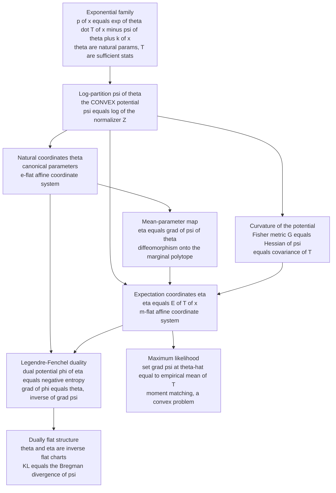

# 📐 Exponential Families and Their Geometry

> [!abstract] TL;DR
> The **exponential family** $p(x;\theta)=\exp\!\big(\theta\cdot T(x)-\psi(\theta)+k(x)\big)$ — Gaussians, Bernoullis, categoricals, Poissons, exponentials — is the crystalline heart of information geometry because a *single convex function*, the **log-partition** $\psi(\theta)$, generates its entire geometry. Its gradient $\nabla\psi(\theta)=\eta=\mathbb{E}[T(X)]$ maps the **natural parameters** $\theta$ to the **expectation parameters** $\eta$; its Hessian $\nabla^2\psi(\theta)$ *is* the **Fisher information metric**. Because $\psi$ is convex, its **Legendre-Fenchel transform** $\varphi(\eta)$ (the negative entropy) is a second potential with $\nabla\varphi(\eta)=\theta$, so $\nabla\psi$ and $\nabla\varphi$ are inverse maps. The upshot is a **dually flat** manifold: $\theta$ and $\eta$ are two *affine* (flat) coordinate systems — the **e-flat** and **m-flat** charts — and the KL divergence between two members is exactly the **Bregman divergence** of $\psi$. This is why estimation is convex, why maximum-likelihood is moment matching ($\nabla\psi(\hat\theta)=\bar T$), and why the whole toolbox of dual connections, geodesics, and Pythagorean projections has a place to live.

---

## Intuition

**Analogy.** Some problems are hard only because you are looking at them in the wrong coordinates. A tic-tac-toe grid is trivial in Cartesian $x,y$; the orbit of a planet is trivial in polar $r,\vartheta$. Choose the coordinate system that matches the *shape* of the problem and the messy calculus collapses into straight lines. Distributions have the same story. For the exponential family there is not one but **two** magical coordinate systems — the *natural* coordinates $\theta$ and the *expectation* coordinates $\eta$ — and in **either** of them the geometry of the family becomes perfectly **flat**, like peeling a curved map off a globe and laying it on a table with no wrinkles anywhere. Straight lines in $\theta$ are meaningful ("mixtures of log-densities"), straight lines in $\eta$ are meaningful ("mixtures of distributions"), and a single convex hill — the log-partition $\psi$ — is the elevation map that ties the two charts together.

Everything you would want to compute is a derivative of that one hill. Walk uphill (take the gradient) and you are transported from the $\theta$ chart to the $\eta$ chart. Measure the hill's curvature (take the Hessian) and you have read off the Fisher metric, the local ruler of statistical distinguishability. Flip the hill over with a Legendre transform and you get its mirror image $\varphi$, whose own gradient carries you back from $\eta$ to $\theta$. The exponential family is the **beautifully-behaved, non-pathological centerpiece** of information geometry precisely because this one convex function does all the work: the abstract machinery of metrics, dual connections, and divergences that looks intimidating in general is, here, just the elementary calculus of a convex potential.

---

## How It Works

### Core Mechanics

**1. The canonical form.** A family of densities is an **exponential family** if it can be written

$$
p(x;\theta) = \exp\!\big(\theta\cdot T(x) - \psi(\theta) + k(x)\big),
\qquad
\psi(\theta) = \log \int \exp\!\big(\theta\cdot T(x) + k(x)\big)\,dx .
$$

Here $\theta\in\mathbb{R}^d$ are the **natural** (canonical) **parameters**, $T(x)\in\mathbb{R}^d$ are the **sufficient statistics**, $k(x)$ is a base-measure carrier term, and $\psi(\theta)$ is the **log-partition** (cumulant) function that normalizes everything. The natural-parameter domain $\Theta=\{\theta:\psi(\theta)<\infty\}$ is convex. This is the *same* family that falls out of maximum-entropy inference — see [[Maximum_Entropy_and_Exponential_Families]] — but here we study its **geometry** rather than its derivation.

**2. $\psi$ is convex and generates the cumulants.** Differentiating $\psi$ pulls moments of $T$ out of the normalizer:

$$
\nabla\psi(\theta) = \mathbb{E}_\theta[T(X)] =: \eta,
\qquad
\nabla^2\psi(\theta) = \operatorname{Cov}_\theta\!\big(T(X)\big) \succeq 0 .
$$

The gradient is the vector of first cumulants (the mean of the sufficient statistics), and the Hessian is their covariance — automatically positive semidefinite, which is exactly why $\psi$ is **convex** (see [[Convex_Functions]]). For a *minimal* family the covariance is strictly positive definite and $\psi$ is **strictly** convex.

**3. The mean-parameter map $\theta\mapsto\eta$.** The gradient $\eta=\nabla\psi(\theta)$ is the **expectation-parameter** (or mean-parameter, or *moment*) map. Because $\psi$ is strictly convex in the minimal case, this map is a **diffeomorphism** onto the interior of the marginal polytope $\mathcal{M}=\{\eta:\eta=\mathbb{E}_p[T]\text{ for some }p\}$. So each distribution in the family has *two* addresses: its natural coordinate $\theta$ and its expectation coordinate $\eta$. Bernoulli's $\theta$ is the log-odds; its $\eta$ is the success probability $p$. Gaussian-with-known-variance has $\theta=\mu/\sigma^2$ and $\eta=\mu$.

**4. The Fisher metric is the Hessian of $\psi$.** The Fisher information matrix is $G(\theta)=\mathbb{E}_\theta[\nabla_\theta\log p\,\nabla_\theta\log p^\top]$. Because $\log p = \theta\cdot T-\psi+k$ has score $\nabla_\theta\log p = T-\nabla\psi=T-\eta$, the Fisher matrix is exactly

$$
G(\theta) = \operatorname{Cov}_\theta(T) = \nabla^2\psi(\theta).
$$

The metric that measures how *distinguishable* nearby distributions are is nothing more than the curvature of the log-partition. (The general treatment lives in the sibling note *The_Fisher_Information_Metric*; the estimation-theoretic angle is in [[Fisher_Information_and_the_Cramer_Rao_Bound]].)

**5. Legendre-Fenchel duality gives the second potential.** Convex $\psi$ has a **convex conjugate**

$$
\varphi(\eta) = \sup_{\theta}\big(\theta\cdot\eta - \psi(\theta)\big),
$$

and at the optimizing $\theta$ we have $\eta=\nabla\psi(\theta)$ and, dually, $\nabla\varphi(\eta)=\theta$. So $\nabla\psi$ and $\nabla\varphi$ are **inverse maps** between the two charts, and the **Fenchel-Young equality** $\psi(\theta)+\varphi(\eta)=\theta\cdot\eta$ holds precisely at dual pairs. The dual potential $\varphi(\eta)$ turns out to be the **negative (differential) entropy** of the corresponding distribution: $\varphi(\eta)=-H\big(p_\eta\big)+\text{const}$. Convex-duality background is in [[Duality_Theory]]; the potential-theory view is the sibling note *Legendre_Transform_and_Convex_Duality*.

**6. Dually flat structure.** Because both $\theta$ and $\eta$ are honest coordinate systems related by a Legendre transform, the manifold is **dually flat**: $\theta$ is an affine chart for one flat connection (the **e-flat** / exponential connection, whose geodesics are lines in $\theta$) and $\eta$ is an affine chart for its dual (the **m-flat** / mixture connection, whose geodesics are lines in $\eta$). This is the concrete seed of the whole theory of *Dual_Affine_Connections* and *Dually_Flat_Spaces* (both siblings, developed elsewhere in this section).

**7. KL divergence is the Bregman divergence of $\psi$.** The relative entropy between two members equals the **Bregman divergence** generated by the convex $\psi$ (equivalently by $\varphi$):

$$
D_{\mathrm{KL}}\!\big(p_{\theta_1}\,\|\,p_{\theta_2}\big)
= \psi(\theta_2)-\psi(\theta_1)-\nabla\psi(\theta_1)\cdot(\theta_2-\theta_1)
= B_\psi(\theta_2,\theta_1).
$$

The "distance" that governs inference is *literally* the gap between the convex hill and its tangent plane. This is why a **generalized Pythagorean theorem** and orthogonal projections work so cleanly here — foreshadowed for the sibling *Bregman_Divergences* note.

**8. MLE is moment matching.** Given data $x_1,\dots,x_N$, the log-likelihood $\sum_i(\theta\cdot T(x_i)-\psi(\theta)+k(x_i))$ is **concave** in $\theta$ (since $\psi$ is convex). Setting its gradient to zero gives

$$
\nabla\psi(\hat\theta) = \frac{1}{N}\sum_i T(x_i) = \bar T
\quad\Longleftrightarrow\quad
\hat\eta = \bar T .
$$

In expectation coordinates the maximum-likelihood estimate is *trivial* — just set the model's mean statistics equal to the empirical averages. Fitting is convex, and the "hard" nonlinearity is entirely inside the coordinate change $\eta=\nabla\psi(\theta)$.

**9. Curved exponential families.** If the parameter is constrained to a nonlinear submanifold $\theta=\theta(u)$ with $u\in\mathbb{R}^m$, $m<d$ (for example, a Gaussian pinned to the parabola $\sigma^2=\mu^2$), you get a **curved exponential family**. It inherits the ambient Fisher metric but is *not* flat in the induced coordinates — its embedding curvature is exactly what governs the higher-order efficiency of estimators. Flatness is the special gift of the *full* (non-curved) family.

### Flow / Architecture



---

## Key Concepts

### Secondary (intuitive)
- **Two coordinate systems, both flat.** An exponential-family distribution has two addresses — a "natural" one and an "average value" one — and in either the family lies flat, like an unwrinkled map.
- **One hill runs everything.** A single convex function, the log-partition $\psi$, is an elevation map; its slope carries you between the two coordinate systems and its curvature is a ruler for telling distributions apart.
- **Familiar distributions belong here.** Coin flips (Bernoulli), bell curves (Gaussian), counts (Poisson), waiting times (exponential), and multi-way choices (categorical) are all exponential families — the well-behaved core of statistics.
- **Fitting is easy in the right chart.** To fit the model you just match its average sufficient statistics to the data's averages — no local optima, no wandering.

### Undergraduate
- **Canonical form:** $p(x;\theta)=\exp(\theta\cdot T(x)-\psi(\theta)+k(x))$ with natural parameters $\theta$, sufficient statistics $T$, and log-partition $\psi(\theta)=\log Z(\theta)$ on a convex domain.
- **Cumulant bookkeeping:** $\nabla\psi=\mathbb{E}[T]=\eta$ and $\nabla^2\psi=\operatorname{Cov}(T)=G(\theta)$, the Fisher information; convexity of $\psi$ follows for free.
- **Mean vs natural parameters:** the map $\theta\mapsto\eta=\nabla\psi(\theta)$ is a bijection (minimal family); its inverse is $\eta\mapsto\theta=\nabla\varphi(\eta)$.
- **Legendre pair:** $\varphi=\psi^\star$ is the convex conjugate; $\varphi(\eta)$ is the negative entropy, and $\psi(\theta)+\varphi(\eta)=\theta\cdot\eta$ at dual points (Fenchel-Young).
- **MLE = moment matching:** $\nabla\psi(\hat\theta)=\bar T$; the log-likelihood is concave, so estimation is a convex program.
- **Worked coordinate maps:** Bernoulli ($\theta=$ log-odds, $\eta=p$); Gaussian known variance ($\theta=\mu/\sigma^2$, $\eta=\mu$); Poisson ($\theta=\log\lambda$, $\eta=\lambda$); exponential ($\theta=-\lambda$, $\eta=1/\lambda$).

### Graduate
- **Dually flat manifold:** $(\theta,\eta)$ are Legendre-dual affine coordinates for a dual pair of flat connections (e-connection / m-connection) sharing the Fisher metric $g=\nabla^2\psi$; the manifold has zero curvature under *both* dual connections.
- **Bregman = KL:** $D_{\mathrm{KL}}(p_{\theta_1}\|p_{\theta_2})=B_\psi(\theta_2,\theta_1)=B_\varphi(\eta_1,\eta_2)$; the generalized Pythagorean theorem and dual (e/m) geodesic projections follow, underpinning EM, mean-field, and I-projection algorithms.
- **Minimal vs overcomplete:** if the components of $T$ satisfy an affine dependency the representation is *overcomplete* — $\theta$ is non-identifiable and $\nabla^2\psi$ is singular; a *minimal* family removes the redundancy and makes $\psi$ strictly convex and the map a diffeomorphism.
- **Steepness and the mean domain:** a *steep* family has $\|\nabla\psi\|\to\infty$ at the boundary of $\Theta$, guaranteeing $\nabla\psi$ maps onto the interior of the convex support of $T$ (the marginal polytope) — the exact condition for the MLE to exist for interior data.
- **Curved families and higher-order efficiency:** curved exponential families are submanifolds carrying nonzero e-/m-embedding curvature; Amari's theory ties the curvature to the second-order deficiency (information loss) of first-order-efficient estimators.
- **Variational inference lens:** the log-partition is a **support function** of the marginal polytope, $\psi(\theta)=\sup_{\eta\in\mathcal{M}}\{\theta\cdot\eta-\varphi(\eta)\}$ (Wainwright-Jordan); graphical-model inference is optimization over $\mathcal{M}$, and mean-field/Bethe approximations relax either $\mathcal{M}$ or the entropy $-\varphi$.

---

## Python Demo

```python
# Exponential-family DUALITY, verified numerically, on the BERNOULLI family.
#   p(x; theta) = exp( theta * x - psi(theta) ),  x in {0,1}
#     natural parameter  theta = log( p / (1 - p) )        (the log-odds)
#     sufficient stat     T(x) = x
#     log-partition       psi(theta) = log(1 + e^theta)     (softplus)
# We verify the four pillars of the geometry:
#   (1) psi is CONVEX                       ->  psi''(theta) > 0 everywhere
#   (2) mean-parameter map  eta = E[T]      =   psi'(theta) = sigmoid(theta)
#   (3) Fisher metric  G(theta) = psi''(theta) = Var(T) = eta (1 - eta)
#   (4) Legendre dual  phi(eta) = eta*log eta + (1-eta)*log(1-eta)   (neg-entropy)
#         with  phi'(eta) = theta   (so grad-psi and grad-phi are inverse maps),
#         and the Fenchel-Young equality  psi(theta) + phi(eta) = theta * eta.
import numpy as np
import matplotlib.pyplot as plt

rng = np.random.default_rng(0)
h = 1e-4  # finite-difference step

def psi(theta):                       # log-partition (numerically stable softplus)
    return np.logaddexp(0.0, theta)

def sigmoid(theta):
    return 1.0 / (1.0 + np.exp(-theta))

def phi(eta):                         # dual potential = negative Shannon entropy
    eta = np.clip(eta, 1e-12, 1 - 1e-12)
    return eta * np.log(eta) + (1 - eta) * np.log(1 - eta)

theta = np.linspace(-6.0, 6.0, 400)

# ---- (2) gradient of psi is the mean parameter eta = E[T] ---------------------
grad_psi = (psi(theta + h) - psi(theta - h)) / (2 * h)      # numeric psi'
eta_analytic = sigmoid(theta)                               # analytic psi'
err_grad = np.max(np.abs(grad_psi - eta_analytic))
print(f"(2) max |psi'(theta) - sigmoid(theta)|        = {err_grad:.2e}")

# Monte-Carlo confirmation that eta really equals the mean of T(x)
print("    Monte-Carlo check  eta = E[T]:")
for th in (-2.0, 0.0, 1.5):
    samples = (rng.random(300_000) < sigmoid(th)).astype(float)
    print(f"      theta={th:+.1f}:  psi'={sigmoid(th):.4f}   sample mean of T={samples.mean():.4f}")

# ---- (3) Hessian of psi is the Fisher metric = Var(T) ------------------------
hess_psi = (psi(theta + h) - 2 * psi(theta) + psi(theta - h)) / h**2   # numeric psi''
G_analytic = eta_analytic * (1 - eta_analytic)             # eta(1-eta) = Var(Bernoulli)
err_hess = np.max(np.abs(hess_psi - G_analytic))
print(f"(3) max |psi''(theta) - eta(1-eta)| (Fisher)  = {err_hess:.2e}")
print(f"    psi'' minimum over grid = {hess_psi.min():.4e}  (> 0  ->  psi is convex)")

# ---- (4) Legendre duality: phi'(eta) = theta, and grad-psi, grad-phi invert --
eta = np.linspace(1e-3, 1 - 1e-3, 400)
grad_phi = (phi(eta + h) - phi(eta - h)) / (2 * h)         # numeric phi'
theta_from_eta = np.log(eta / (1 - eta))                   # analytic phi' = logit(eta)
err_dual = np.max(np.abs(grad_phi - theta_from_eta))
print(f"(4) max |phi'(eta) - logit(eta)|              = {err_dual:.2e}")

# inverse-map round trip:  theta -> eta = grad psi -> theta = grad phi
theta_probe = np.array([-3.0, -1.0, 0.0, 2.0, 4.0])
eta_probe = sigmoid(theta_probe)
theta_back = np.log(eta_probe / (1 - eta_probe))
print(f"    inverse-map round-trip max error          = {np.max(np.abs(theta_probe - theta_back)):.2e}")

# Fenchel-Young equality  psi(theta) + phi(eta) = theta * eta  at dual pairs
eta_dual = np.clip(sigmoid(theta), 1e-12, 1 - 1e-12)
fenchel_gap = psi(theta) + phi(eta_dual) - theta * eta_dual
print(f"(5) max |psi(theta) + phi(eta) - theta*eta|   = {np.max(np.abs(fenchel_gap)):.2e}")

# ============================ FIGURE ==========================================
fig, ax = plt.subplots(2, 2, figsize=(13, 9))

# (a) psi is convex: the curve lies ABOVE every tangent line
ax[0, 0].plot(theta, psi(theta), color="#c0392b", lw=3, label="psi(theta) = log(1+e^theta)")
for t0, c in ((-3.0, "#2980b9"), (2.5, "#27ae60")):
    tang = psi(t0) + sigmoid(t0) * (theta - t0)            # slope = eta = psi'(t0)
    ax[0, 0].plot(theta, tang, "--", color=c, lw=1.4,
                  label=f"tangent at theta={t0:+.1f}  slope=eta={sigmoid(t0):.2f}")
ax[0, 0].set_title("(a) log-partition psi is CONVEX  (lies above its tangents)")
ax[0, 0].set_xlabel("natural parameter  theta"); ax[0, 0].set_ylabel("psi(theta)")
ax[0, 0].set_ylim(-0.3, 6.5); ax[0, 0].legend(loc="upper left", fontsize=8)

# (b) the dual coordinate map: eta = grad psi (forward) and theta = grad phi (inverse)
ax[0, 1].plot(theta, sigmoid(theta), color="#c0392b", lw=3,
              label="forward  eta = grad psi(theta) = sigmoid")
ax[0, 1].plot(theta_from_eta[::12], eta[::12], "o", ms=6, mfc="none",
              color="#2980b9", label="inverse  theta = grad phi(eta) = logit")
ax[0, 1].set_title("(b) natural  <->  expectation coordinates are inverse maps")
ax[0, 1].set_xlabel("theta"); ax[0, 1].set_ylabel("eta")
ax[0, 1].set_xlim(-6, 6); ax[0, 1].legend(loc="upper left", fontsize=8)

# (c) Fisher metric G = psi'' matched three ways
ax[1, 0].plot(theta, hess_psi, color="#8e44ad", lw=3, label="numeric psi''(theta)")
ax[1, 0].plot(theta, G_analytic, "k--", lw=1.5, label="analytic eta(1-eta)")
mc_theta = np.linspace(-5, 5, 11)
mc_var = [((rng.random(200_000) < sigmoid(t)).astype(float)).var() for t in mc_theta]
ax[1, 0].plot(mc_theta, mc_var, "o", ms=7, color="#e67e22", label="Monte-Carlo Var(T)")
ax[1, 0].set_title("(c) Fisher metric  G(theta) = Hessian of psi = Var(T)")
ax[1, 0].set_xlabel("theta"); ax[1, 0].set_ylabel("G(theta)"); ax[1, 0].legend(fontsize=8)

# (d) the two dual convex potentials psi(theta) and phi(eta)
ax[1, 1].plot(theta, psi(theta), color="#c0392b", lw=3, label="psi(theta)  (log-partition)")
ax[1, 1].plot(6 * eta - 3, phi(eta), color="#16a085", lw=3,   # rescale eta->[-3,3] for shared axis
              label="phi(eta)  (negative entropy)")
ax[1, 1].set_title("(d) Legendre-dual convex potentials  (Fenchel gap ~ 1e-14)")
ax[1, 1].set_xlabel("theta   |   rescaled eta"); ax[1, 1].set_ylabel("potential value")
ax[1, 1].legend(fontsize=8)

plt.tight_layout(); plt.show()
```

**What you should see.** **(a)** The softplus $\psi(\theta)$ lies strictly *above* every tangent line — the visual signature of convexity — and each tangent's slope is precisely $\eta=\sigma(\theta)$, the mean parameter. **(b)** The forward map $\eta=\nabla\psi=\sigma$ (sigmoid) and the inverse map $\theta=\nabla\varphi=\operatorname{logit}$ (open circles) lie exactly on top of one another, confirming that the gradients of the two dual potentials are inverse coordinate transformations. **(c)** The numeric Hessian $\psi''$, the analytic $\eta(1-\eta)$, and the Monte-Carlo variance of $T$ coincide — the Fisher metric *is* the curvature of the log-partition. **(d)** Both potentials are convex, and the printed Fenchel-Young gap $\psi(\theta)+\varphi(\eta)-\theta\eta$ is zero to machine precision at every dual pair: the KL divergence built from this gap is the Bregman divergence of $\psi$.

---

## Real-World Applications

> **Example (variational inference on graphical models — the flagship use):** Wainwright and Jordan recast inference in Markov random fields as optimization in exactly this geometry. A discrete graphical model is an exponential family whose sufficient statistics are the node/edge indicator functions; the log-partition $\psi(\theta)$ is the **support function of the marginal polytope** $\mathcal{M}$, and computing marginals means evaluating the dual map $\eta=\nabla\psi(\theta)$. Mean-field, Bethe/loopy belief propagation, and TRW all become *relaxations* of the same variational problem — outer/inner bounds on $\mathcal{M}$ paired with approximations of the entropy $-\varphi(\eta)$. The intractable partition function of [[Partition_Functions_and_Free_Energy_in_ML]] is the very potential whose geometry this note describes.

- **Generalized linear models (GLMs).** Logistic, Poisson, and gamma regression are exponential-family response models; the "link function" is the inverse of the mean map $\eta=\nabla\psi(\theta)$, and IRLS is Newton's method on the concave exponential-family log-likelihood — convexity guaranteed by $\nabla^2\psi\succeq0$.
- **Natural-gradient and mirror descent.** Optimizing over exponential-family or Bayesian-posterior parameters, the natural gradient preconditions by $G^{-1}=(\nabla^2\psi)^{-1}$; mirror descent with mirror map $\psi$ is *literally* gradient descent carried out in the dual ($\eta$) coordinates — the backbone of many variational-inference and RL policy-optimization methods.
- **Statistical physics and energy-based models.** The Boltzmann-Gibbs distribution is the exponential family with $\theta=-\beta$ and $T=$ energy; $\psi$ is $-\beta$ times the free energy, and $\eta=\nabla\psi$ is the mean energy. Training RBMs and other energy-based models is moment matching, $\nabla\psi(\hat\theta)=\bar T$, with the model expectation approximated by MCMC.
- **Species distribution modeling (Maxent).** The widely used ecology tool fits a maximum-entropy / exponential-family model whose expected environmental features match presence-only observations — the $\hat\eta=\bar T$ moment-matching condition made operational.
- **Exponential-family PCA and embeddings.** Dimensionality reduction for binary/count data replaces squared error with the Bregman divergence of the appropriate $\psi$, generalizing PCA to the natural geometry of the data's exponential family.

---

## Common Pitfalls

- **Confusing natural, mean, and source parameters.** A Gaussian has *source* parameters $(\mu,\sigma^2)$, *natural* parameters $\theta=(\mu/\sigma^2,\,-1/2\sigma^2)$, and *expectation* parameters $\eta=(\mathbb{E}[x],\mathbb{E}[x^2])$. Formulas that are linear/affine in one chart are nonlinear in another; write down which chart you are in before differentiating. The mean map $\eta=\nabla\psi(\theta)$ is the bridge, not the identity.
- **Assuming every parametric family is flat.** Only the *full* (non-curved) exponential family is dually flat. A **curved** exponential family — parameters constrained to a nonlinear submanifold — has nonzero embedding curvature and is *not* flat in its own coordinates; you cannot use straight-line ($\theta$- or $\eta$-) geodesics inside it and expect them to stay in the family.
- **Overcomplete representations breaking identifiability.** If the sufficient statistics satisfy an affine dependency (e.g. one-hot indicators that sum to one for a categorical), $\theta$ is not unique and $\nabla^2\psi$ is singular — the metric degenerates. Reduce to a **minimal** representation (drop the redundant coordinate) to restore strict convexity and a well-defined Fisher metric.
- **Ignoring convexity/steepness conditions for the MLE.** The moment-matching equation $\nabla\psi(\hat\theta)=\bar T$ has a solution only when $\bar T$ lies in the *interior* of the mean domain (the marginal polytope). Boundary data — an all-heads coin, a category never observed — push $\hat\theta$ to $\pm\infty$; the family must be **steep** for $\nabla\psi$ to cover the interior, and regularization is needed at the boundary.
- **Forgetting the base measure $k(x)$.** The carrier term $k(x)$ (and the reference measure it encodes) is part of the model; on continuous spaces the log-partition, the entropy, and hence $\varphi$ are only well defined relative to it. Change the base measure and the "same" $\theta$ describes a different distribution.
- **Reading $\psi$ as merely a normalizer.** It is tempting to treat $\psi$ as bookkeeping to be divided away. It is instead the **potential that generates the entire geometry** — mean map, metric, entropy, and divergence are all its derivatives or its conjugate.

---

## Related Concepts

- [[Maximum_Entropy_and_Exponential_Families]] — the *derivation* companion: the same family arising as the least-biased maximum-entropy solution; this note supplies its geometric (dually-flat) reading.
- [[Fisher_Information_and_the_Cramer_Rao_Bound]] — the Fisher metric $G=\nabla^2\psi$ studied here is the very information matrix that bounds estimator variance.
- [[Convex_Functions]] — convexity of the log-partition $\psi$ (its PSD Hessian) is the single fact that makes estimation convex and the geometry flat.
- [[Duality_Theory]] — the Legendre-Fenchel conjugation relating $\psi$ and $\varphi$ is the convex-duality machinery specialized to distributions.
- [[Common_Probability_Distributions]] — Bernoulli, Gaussian, Poisson, exponential, and categorical are catalogued there; here each is an exponential family with explicit $\theta$ and $\eta$ coordinates.
- [[Statistical_Inference]] — maximum-likelihood as moment matching ($\hat\eta=\bar T$) and sufficiency are the inferential payoffs of the exponential-family structure.
- [[Partition_Functions_and_Free_Energy_in_ML]] — the log-partition is the ML/physics partition function; its intractability is the flip side of the elegant geometry.
- [[Variational_Autoencoders]] — the ELBO is a variational bound on $\psi$; VAEs optimize in exponential-family latent geometry, the applied face of $\psi(\theta)=\sup_\eta\{\theta\cdot\eta-\varphi(\eta)\}$.

Developed in sibling notes of this section (prose references, no links yet): *Legendre_Transform_and_Convex_Duality* (the $\psi\leftrightarrow\varphi$ conjugation in full), *The_Fisher_Information_Metric* (the metric $\nabla^2\psi$ as a Riemannian structure), *Dual_Affine_Connections* and *Dually_Flat_Spaces* (the e-flat/m-flat connection pair), and *Bregman_Divergences* (KL as $B_\psi$ with its Pythagorean projections).

---

## Review Questions

1. **(Secondary)** Explain, without heavy algebra, what the "natural" and "expectation" coordinates of a coin flip are, and why having *two* flat coordinate systems makes fitting a coin easy. What single quantity connects the two coordinates?
2. **(Undergraduate)** For the Bernoulli family $p(x;\theta)=\exp(\theta x-\psi(\theta))$ with $\psi(\theta)=\log(1+e^\theta)$, compute $\nabla\psi$ and $\nabla^2\psi$ and identify them as the mean parameter and the Fisher information. Then find the Legendre conjugate $\varphi(\eta)$, verify $\varphi'(\eta)=\theta$, and state the maximum-likelihood estimator of $\theta$ from data $x_1,\dots,x_N$ in one line.
3. **(Graduate)** Explain precisely why the full exponential family is *dually flat* while a *curved* exponential family is not. Address: (a) how $\theta$ and $\eta$ each serve as affine coordinates for a flat connection; (b) why $D_{\mathrm{KL}}=B_\psi$ and what the generalized Pythagorean theorem then buys you; (c) what goes wrong under an *overcomplete* representation; and (d) how the steepness of $\psi$ controls existence of the MLE at the boundary of the mean domain.

---

## Sources

- Amari, S., & Nagaoka, H. (2000). *Methods of Information Geometry*. AMS/Oxford University Press. (The dually-flat structure of exponential families; e-/m-connections.)
- Barndorff-Nielsen, O. (1978). *Information and Exponential Families in Statistical Theory*. Wiley. (Canonical form, minimality, steepness, and the mean-parameter map.)
- Wainwright, M. J., & Jordan, M. I. (2008). "Graphical Models, Exponential Families, and Variational Inference." *Foundations and Trends in Machine Learning* 1(1–2), 1–305.
- Brown, L. D. (1986). *Fundamentals of Statistical Exponential Families*. IMS Lecture Notes 9. (Rigorous convex-analytic treatment of $\psi$ and its conjugate.)
- Nielsen, F. (2020). "An Elementary Introduction to Information Geometry." *Entropy* 22(10), 1100. (Modern, accessible dually-flat / Bregman synthesis.)

---

#information-geometry #exponential-families #legendre-duality #natural-parameters #dually-flat
