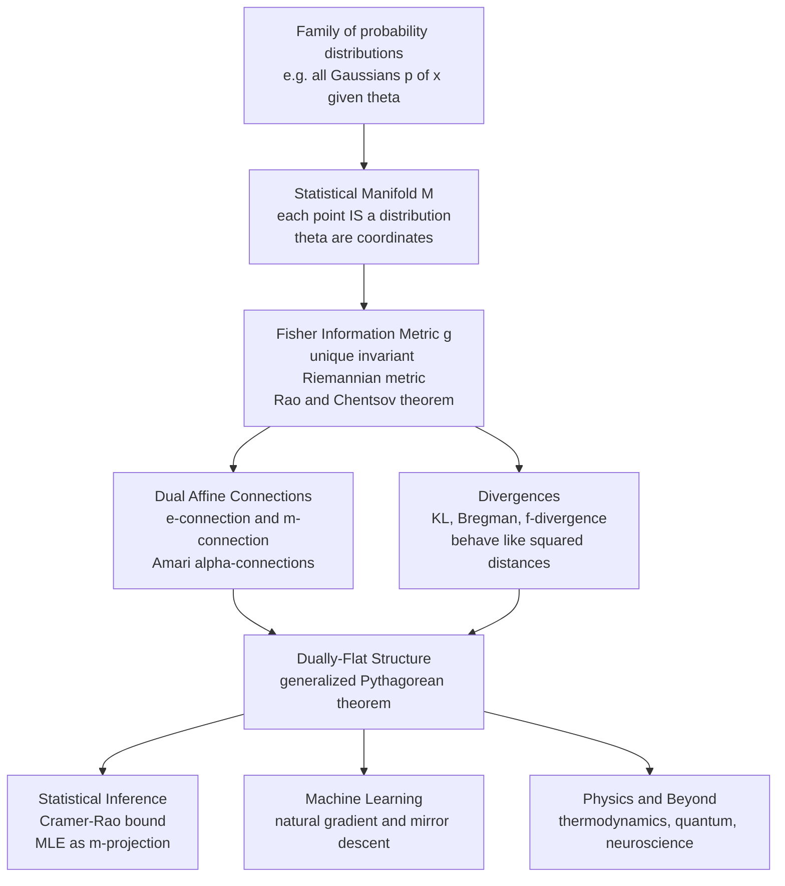

# 📐 Information Geometry Overview

> [!abstract] TL;DR
> **Information geometry** applies **differential geometry** to **probability and statistics**: it treats a *family* of probability distributions as a smooth curved surface — a **Riemannian manifold** — where each point *is* a distribution and "nearby" means "statistically hard to tell apart from data." The manifold carries a unique invariant metric, the **Fisher information metric** (Rao–Chentsov), plus a pair of **dual affine connections** (Amari's $e$- and $m$-connections) that make it **dually flat**. In this language, estimation becomes *finding a point*, learning becomes *moving along the surface*, the Cramér–Rao bound becomes a *statement about curvature*, and maximum likelihood becomes a *geometric projection* obeying a **Pythagorean theorem for information**. This note is the entry point to the vault; it maps the core objects — statistical manifolds, the Fisher metric, dual connections, divergences — and the applications in inference, machine learning, and physics.

---

## Intuition

**Analogy — a country of distributions, not a list of them.** Think of every Gaussian distribution $\mathcal{N}(\mu,\sigma^2)$ you could ever write down. The naive picture is a *table*: a row for each $(\mu,\sigma)$. Information geometry says that is the wrong picture. Those distributions form a **landscape** — a curved surface where each point is one specific bell curve, and the *terrain between points* has meaning. Two bell curves that are almost impossible to distinguish from samples sit *close together* on this surface; two that a handful of data points would instantly tell apart sit *far apart*. Crucially, this distance is **not** the ordinary Euclidean distance in the $(\mu,\sigma)$ plane: near $\sigma = 0.1$ a shift of the mean by $0.3$ is a huge, obvious change, while near $\sigma = 10$ the same shift is invisible. The *same* parameter step means *different* statistical distances depending on where you stand — that is exactly what "curved space" means.

Once you accept the landscape, statistics turns into geography. **Estimation** is asking "which point on the surface did the data come from?" **Learning** is *walking* across the surface toward lower loss, where the smart direction to step is the one that respects the local terrain (the natural gradient), not the one that looks steepest on the flat map. **Model comparison** is measuring how far apart two regions sit. **Asymptotic theory** — the fine print about how estimators behave with lots of data — becomes the study of the surface's **curvature**. Information geometry is the marriage of differential geometry and probability: it puts distance, angle, and curvature onto the space of probability distributions so that the hardest questions in statistics become questions about the *shape* of this space.

---

## How It Works

Information geometry is built by stacking four ideas, each adding structure to a set of distributions until it becomes a full geometric object.

1. **Turn a family of distributions into a manifold.** Pick a parametric family $p(x;\theta)$ — Gaussians, Poissons, an exponential family, or the outputs of a neural network. The parameter $\theta = (\theta^1,\dots,\theta^n)$ becomes a **coordinate system**, and the set of all such distributions becomes an $n$-dimensional **statistical manifold** $M$. Each *point* is a whole probability distribution.
2. **Measure local distance with the Fisher metric.** How far apart are two *nearby* distributions? Expand the **Kullback–Leibler divergence** for a small step $\Delta\theta$: the leading term is $\mathrm{KL}\big(p_\theta \,\|\, p_{\theta+\Delta\theta}\big) \approx \tfrac{1}{2}\,\Delta\theta^\top G(\theta)\,\Delta\theta$, where $G(\theta)$ is the **Fisher information matrix**. That quadratic form *is* a Riemannian metric $ds^2 = \sum_{ij} g_{ij}\,d\theta^i d\theta^j$. Chentsov's theorem says it is the **unique** metric invariant under sufficient statistics — the one honest choice.
3. **Add a pair of dual connections.** A metric alone lets you measure lengths; a **connection** tells you what a "straight line" (geodesic) and "parallel transport" are. Amari introduced a one-parameter family of **$\alpha$-connections**, the two extremes being the **exponential ($e$-) connection** and the **mixture ($m$-) connection**. They are **dual** with respect to the Fisher metric: transporting a vector by one and its partner by the other preserves inner products. For exponential families the manifold is **dually flat** — flat under *both* connections at once, in two different coordinate systems ($\theta$ natural parameters and $\eta$ expectation parameters) linked by a Legendre transform.
4. **Recover divergences and a Pythagorean theorem.** Dual flatness produces a **canonical Bregman divergence** — KL divergence for exponential families — that behaves like a *squared distance*. It obeys a **generalized Pythagorean theorem**: if the $m$-geodesic from $P$ to $Q$ meets the $e$-geodesic from $Q$ to $R$ at a right angle, then $D(P\|R) = D(P\|Q) + D(Q\|R)$. This single identity underlies the EM algorithm, maximum-likelihood-as-projection, and the geometry of the exponential family.

### Why geometry illuminates statistics

- **Invariance.** Reparameterize the model and the *numbers* $g_{ij}$ change, but the underlying geometric object does not — just as a mountain's shape is independent of your map's grid. This kills coordinate artifacts that plague raw parameter-space reasoning.
- **Curvature = higher-order asymptotics.** The Cramér–Rao bound is the *flat* first-order story ($\text{Var} \ge G^{-1}$). The manifold's **curvature** governs the next-order corrections — the bias, efficiency, and information loss of estimators (Efron's statistical curvature).
- **The right notion of "steepest."** Gradient descent in raw parameters follows the Euclidean map; **natural gradient** premultiplies by $G(\theta)^{-1}$ to follow the *terrain*, giving reparameterization-invariant, often dramatically faster learning.

### Flow / Architecture



The founders map onto this stack: **C. R. Rao** (1945) first noticed the Fisher metric turns parameter space into a Riemannian manifold; **N. N. Chentsov** proved its uniqueness via invariance; **Shun-ichi Amari** built the dual-connection / dually-flat theory that is the field's backbone; and **Bradley Efron** connected statistical **curvature** to the second-order efficiency of estimators.

---

## Key Concepts

### 🟢 Secondary (build the picture)

- **A distribution is a point.** A whole probability distribution — an entire bell curve — is *one dot* on a map. Change the settings and you slide to a neighboring dot.
- **Distance means "tell-apart-ability."** Two distributions are *close* if data can barely distinguish them, *far* if a few samples give them away. This distance is not the ruler distance between the knobs.
- **The map is curved.** The same twist of a knob matters a lot in some regions and almost nothing in others; that unevenness is exactly what makes the surface *curved* rather than flat.

### 🟡 Undergraduate (the machinery)

- **Statistical manifold.** A parametric family $\{p(x;\theta)\}$ viewed as a smooth $n$-dimensional surface with coordinates $\theta$.
- **Fisher information metric.** $g_{ij}(\theta) = \mathbb{E}\!\left[\partial_i \log p \,\partial_j \log p\right]$ — the local ruler. It is the Hessian of KL divergence and the curvature of the log-likelihood; it also equals $-\mathbb{E}[\partial_i\partial_j \log p]$.
- **KL divergence as squared distance.** For small steps, $\mathrm{KL} \approx \tfrac12 \Delta\theta^\top G\,\Delta\theta$: divergence is *locally* half the squared Fisher length. Globally KL is asymmetric and is **not** a true metric.
- **Exponential family.** Distributions of the form $p(x;\theta)=\exp(\theta^\top T(x) - \psi(\theta))$; their natural parameters $\theta$ and mean parameters $\eta=\nabla\psi(\theta)$ are dual coordinate charts.
- **Cramér–Rao bound.** $\mathrm{Cov}(\hat\theta) \succeq G(\theta)^{-1}$: the Fisher metric's inverse is a hard floor on estimator variance. (See the Information Theory vault.)

### 🔴 Graduate (the deep structure)

- **Dual affine connections and $\alpha$-geometry.** The $e$- and $m$-connections are torsion-free, mutually dual w.r.t. $g$, and interpolate through the $\alpha$-connections $\nabla^{(\alpha)}$; $\alpha=\pm1$ are the two flat extremes, $\alpha=0$ is the metric (Levi-Civita) connection.
- **Dually-flat manifolds and Bregman geometry.** A dually flat space carries a convex potential $\psi$ and its Legendre dual $\varphi$; the canonical divergence is the **Bregman divergence** $D_\psi$, with KL as the exponential-family case.
- **Generalized Pythagorean theorem and projections.** Orthogonal $e$/$m$ geodesic triangles satisfy $D(P\|R)=D(P\|Q)+D(Q\|R)$; MLE is the **$m$-projection** onto the model, EM alternates $e$- and $m$-projections.
- **$f$-divergences and Chentsov invariance.** Every $f$-divergence induces the *same* Fisher metric (up to scale) as its second-order term — the invariance that makes the Fisher metric canonical.
- **Statistical curvature and higher-order asymptotics.** Embedding curvature (Efron) controls second-order estimator efficiency and information loss; the exponential family is $e$-flat, hence "curvature-free" and asymptotically optimal.

---

## Python Demo

This demo makes the central claim concrete: on the family of Gaussians $\mathcal{N}(\mu,\sigma^2)$, the *natural* distance is **not** Euclidean in $(\mu,\sigma)$. We (a) compute the **Fisher information matrix** $G(\mu,\sigma)=\mathrm{diag}(1/\sigma^2,\,2/\sigma^2)$, (b) verify numerically that KL between nearby Gaussians $\approx \tfrac12 \Delta\theta^\top G\,\Delta\theta$, and (c) plot the **Fisher-metric ellipses** (indicatrices of equal statistical distance) across parameter space — they *grow with $\sigma$*, showing that a fixed parameter step covers *less* statistical ground as $\sigma$ increases. The manifold is curved.

```python
import numpy as np
import matplotlib.pyplot as plt

# ------------------------------------------------------------------
# Information geometry of the Gaussian family N(mu, sigma^2).
# Each point (mu, sigma) IS a probability distribution.
# Goal: show the natural distance is the Fisher metric, not Euclidean.
# ------------------------------------------------------------------

def fisher_matrix(mu, sigma):
    """Fisher information matrix of N(mu, sigma^2) in (mu, sigma) coords.
    Analytic result: G = diag(1/sigma^2, 2/sigma^2)."""
    return np.array([[1.0 / sigma**2, 0.0],
                     [0.0,            2.0 / sigma**2]])

def kl_gaussian(mu0, s0, mu1, s1):
    """Exact KL( N(mu0, s0^2) || N(mu1, s1^2) )."""
    return np.log(s1 / s0) + (s0**2 + (mu0 - mu1)**2) / (2.0 * s1**2) - 0.5

# --- (b) KL between nearby distributions ~ (1/2) dtheta^T G dtheta -------
mu, sigma = 0.0, 1.0
G0 = fisher_matrix(mu, sigma)
direction = np.array([1.0, 1.0]) / np.sqrt(2.0)   # a mixed (mu,sigma) direction

print("KL(exact) vs Fisher quadratic form as the step shrinks:")
print(f"{'|dtheta|':>10}{'KL exact':>16}{'0.5 dth G dth':>16}{'ratio':>9}")
eps_list = np.array([0.2, 0.1, 0.05, 0.025, 0.0125, 0.00625])
ratios = []
for eps in eps_list:
    dth = eps * direction
    kl = kl_gaussian(mu, sigma, mu + dth[0], sigma + dth[1])
    quad = 0.5 * dth @ G0 @ dth
    ratios.append(kl / quad)
    print(f"{eps:10.5f}{kl:16.3e}{quad:16.3e}{kl/quad:9.4f}")

# --- (c) Visualize the metric: unit-Fisher-distance ellipses -------------
def indicatrix(mu, sigma, r=0.30, n=120):
    """Points on { dtheta : dtheta^T G dtheta = r^2 } centered at (mu,sigma).
    Semi-axes = r / sqrt(eigenvalues of G), rotated by G's eigenvectors."""
    G = fisher_matrix(mu, sigma)
    vals, vecs = np.linalg.eigh(G)
    t = np.linspace(0, 2*np.pi, n)
    circle = np.stack([np.cos(t), np.sin(t)])          # unit circle
    axes = (r / np.sqrt(vals))[:, None] * circle       # stretch by 1/sqrt(eig)
    pts = vecs @ axes                                  # rotate into (mu,sigma)
    return mu + pts[0], sigma + pts[1]

fig, (ax1, ax2) = plt.subplots(1, 2, figsize=(13, 5.2))

mus = np.linspace(-3, 3, 5)
sigmas = np.array([0.4, 0.7, 1.1, 1.6, 2.2])
for s in sigmas:
    for m in mus:
        ex, ey = indicatrix(m, s)
        ax1.plot(ex, ey, color="tab:blue", lw=1.3)
        ax1.plot(m, s, ".", color="tab:red", ms=4)
ax1.set_xlabel("mean  mu")
ax1.set_ylabel("std  sigma")
ax1.set_title("Fisher-metric indicatrices on the Gaussian manifold\n"
              "each ellipse = equal statistical distance; they GROW with sigma")
ax1.set_aspect("equal")
ax1.grid(alpha=0.3)

ax2.plot(eps_list, ratios, "o-", color="tab:green")
ax2.axhline(1.0, ls="--", color="gray", label="quadratic limit = 1")
ax2.set_xscale("log")
ax2.set_xlabel("step size |dtheta|  (log scale)")
ax2.set_ylabel("KL / [ 0.5 dth^T G dth ]")
ax2.set_title("KL divergence approaches the Fisher quadratic form\n"
              "as nearby distributions get closer")
ax2.legend()
ax2.grid(alpha=0.3)

plt.tight_layout()
plt.savefig("gaussian_fisher_manifold.png", dpi=120)
print("\nSaved gaussian_fisher_manifold.png")
```

Reading the output: the printed **ratio KL / quadratic converges to 1** as the step shrinks — confirming the Fisher matrix is the metric that turns KL into a squared distance. In the plot, ellipses centered at large $\sigma$ are *bigger*: you must travel farther in parameter space to reach the same statistical separation, so the "grid" of the map is stretched — the manifold is genuinely curved (in fact the Gaussian family is the hyperbolic upper-half plane), never flat Euclidean $(\mu,\sigma)$ space.

---

## Real-World Applications

- **Statistical estimation theory.** The Cramér–Rao bound, asymptotic efficiency of the MLE, and Efron's curvature corrections are all statements about the Fisher metric and manifold curvature. MLE is an $m$-projection of the empirical distribution onto the model manifold.
- **Machine learning — natural gradient.** Amari's **natural gradient** $\tilde\nabla L = G^{-1}\nabla L$ replaces Euclidean steepest descent with descent that respects the Fisher metric, giving reparameterization-invariant updates. It underlies **K-FAC** and related second-order optimizers, and TRPO/natural policy gradient in reinforcement learning.
- **Optimization — mirror descent.** Mirror descent and the exponentiated-gradient family are Bregman-divergence (dually-flat) methods; information geometry explains *why* the right "mirror map" matches the geometry of the constraint set.
- **Variational inference and EM.** The EM algorithm alternates $e$- and $m$-projections between data and model manifolds; variational free-energy minimization is projection under the Fisher/KL geometry.
- **Quantum information geometry.** The quantum Fisher information (Bures / SLD metric) sets the ultimate precision of quantum metrology and phase estimation.
- **Thermodynamics and neuroscience.** Thermodynamic length and dissipation bounds use a Fisher-type metric on equilibrium states; in computational neuroscience, Fisher information quantifies how well neural population codes encode stimuli.

---

## Common Pitfalls

- **Treating parameter space as Euclidean.** Gradient descent, distances, and priors computed with the flat $\theta$-ruler are coordinate-dependent artifacts. Always ask whether the operation is invariant; the Fisher metric restores invariance.
- **Calling KL a distance.** KL divergence is asymmetric and violates the triangle inequality — it is only *locally* a squared distance via the Fisher metric. Do not treat $D(P\|Q)$ and $D(Q\|P)$ as interchangeable.
- **Confusing the two flatnesses.** "Dually flat" does **not** mean the Levi-Civita (metric, $\alpha=0$) curvature vanishes. It means flatness under the $e$- and $m$-connections *separately*; the metric connection can still be curved (Gaussians are dually flat yet metrically hyperbolic).
- **Assuming the Fisher metric always exists nicely.** It requires regularity (differentiable, well-defined support). Models with parameter-dependent support, non-identifiability, or singular points (e.g. neural nets, mixtures) have degenerate or singular Fisher matrices — the province of *singular* / algebraic information geometry (Watanabe).
- **Inverting a near-singular Fisher matrix.** Natural gradient needs $G^{-1}$; in high dimensions $G$ is huge and often ill-conditioned. Naive inversion is intractable or unstable, which is why practical methods use block/K-FAC approximations and damping.

---

## Related Concepts

- [[Fisher_Information_and_the_Cramer_Rao_Bound]] — the single most important bridge: Fisher information *is* the metric of this manifold, and Cramér–Rao is its flat, first-order geometry.
- [[Differential_Geometry]] — supplies the machinery (manifolds, metrics, connections, geodesics, curvature) that information geometry imports onto probability spaces.
- [[Statistical_Inference]] — estimation, MLE, and efficiency, which information geometry reinterprets as projection and curvature.
- [[Maximum_Entropy_and_Exponential_Families]] — exponential families are the dually-flat manifolds where the Pythagorean theorem and Legendre duality live.
- [[Relative_Entropy_and_Cross_Entropy]] — the KL divergence whose local Hessian *is* the Fisher metric and whose global form is the canonical Bregman divergence.
- [[Maximum_Likelihood_and_Information]] — MLE viewed information-theoretically, the natural companion to its geometric ($m$-projection) reading.
- [[Bayesian_Statistics]] — the Fisher metric induces Jeffreys' invariant prior, an information-geometric object.
- [[Probability_Theory]] — the underlying objects (distributions, densities, expectations) that become the points of the manifold.
- [[Optimization_Theory]] — natural gradient and mirror descent are the information-geometric face of optimization.
- [[Gradient_Descent_Variants]] — where the natural gradient sits relative to SGD, momentum, and adaptive methods.

This note is the section-opener for the Information Geometry vault. Sibling notes it introduces (in prose here, to be authored next) include **Statistical Manifolds**, **The Fisher Information Metric**, **Dual Affine Connections**, **Kullback–Leibler Divergence and Geometry**, **Natural Gradient Descent**, and **The Reach and Future of Information Geometry**.

---

## Review Questions

### 🟢 Secondary
1. In one sentence, why does information geometry say a single probability distribution should be pictured as a *point* rather than a curve? What does "distance" between two such points mean?

### 🟡 Undergraduate
2. Starting from the Kullback–Leibler divergence between $p_\theta$ and $p_{\theta+\Delta\theta}$, explain why the Fisher information matrix appears as the leading term and why this makes it a *metric*. Why is the ordinary Euclidean distance in $(\mu,\sigma)$ the *wrong* way to measure how different two Gaussians are?
3. Given a model where you can either optimize in raw parameters or use the natural gradient $G^{-1}\nabla L$, which would you choose and why? Name one concrete benefit and one concrete cost.

### 🔴 Graduate
4. Explain what "dually flat" means for an exponential family and how it produces the generalized Pythagorean theorem. Show how this recasts the MLE as an $m$-projection, and contrast the two flatnesses with the Levi-Civita curvature of the same manifold.
5. Chentsov's theorem singles out the Fisher metric as *unique*. Uniqueness under what invariance, and why does that invariance matter for statistics? What breaks when a model is *singular* (non-invertible Fisher matrix), and how does that reshape the geometry?

---

## Sources

- Amari, S. & Nagaoka, H. — *Methods of Information Geometry* (AMS/Oxford, 2000). The foundational monograph on dual connections and dually-flat manifolds.
- Amari, S. — *Information Geometry and Its Applications* (Springer, 2016). Modern, application-oriented treatment (natural gradient, ML, neuroscience).
- Ay, N., Jost, J., Lê, H. V. & Schwachhöfer, L. — *Information Geometry* (Springer, 2017). Rigorous measure-theoretic and infinite-dimensional foundations.
- Nielsen, F. — "An Elementary Introduction to Information Geometry," *Entropy* 22(10):1100 (2020). Accessible modern survey with worked examples.
- Rao, C. R. — "Information and the accuracy attainable in the estimation of statistical parameters," *Bull. Calcutta Math. Soc.* 37 (1945). The original Fisher-metric-as-Riemannian-metric paper.

---

#information-geometry #statistical-manifolds #fisher-metric #differential-geometry #foundations
