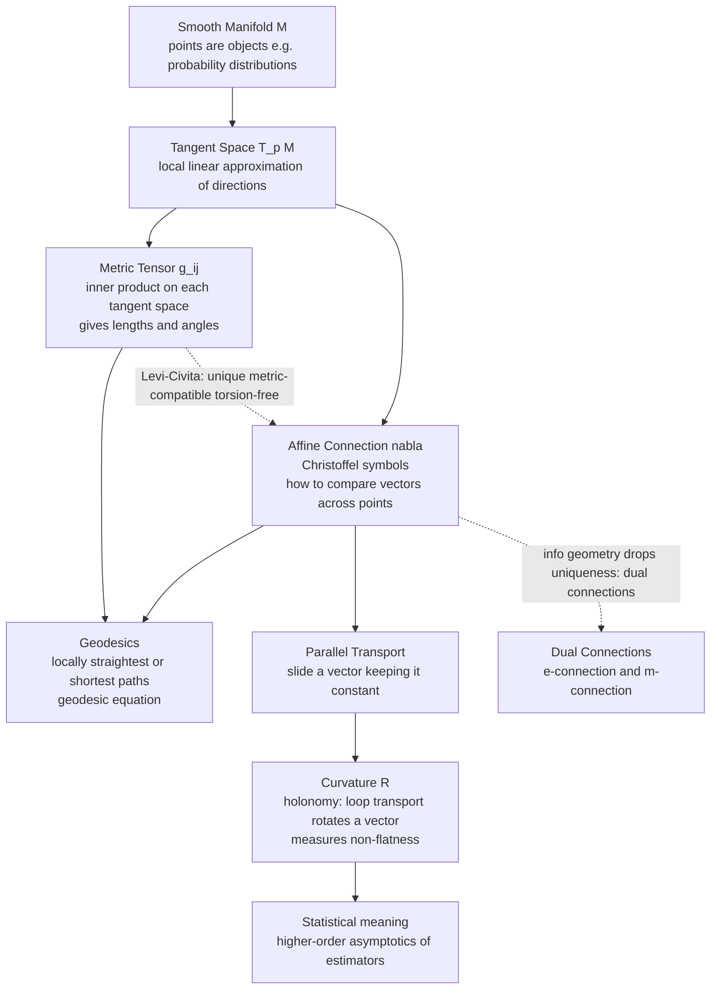

# 🌐 Riemannian Geometry Primer for Statistics

> [!abstract] TL;DR
> Riemannian geometry is the toolkit for measuring lengths, angles, and curvature on *any* curved space using only local data — a **metric** $g$ at each point, a **connection** $\nabla$ that says how to compare vectors at different points, and a **curvature** tensor that records how non-flat the space is. Information geometry aims this entire machinery at the space of probability distributions, so this primer is the geometric grammar the rest of the vault speaks.

---

## Intuition

**Analogy:** To do geometry on a curved surface like the Earth, the words "straight line" and "distance" both need redefining. The shortest path between two cities is a **great-circle arc** (the flight path that looks bowed on a flat map), not a tunnel through the crust; and "parallel" lines — two meridians leaving the equator at right angles — actually *meet* at the pole. You cannot rely on the flat Euclidean rulebook. What you *can* do is stand at each point, lay down a tiny local ruler-and-protractor (the **metric**), and stitch those local measurements into global statements about length and shape.

Riemannian geometry is exactly that stitching. It measures everything intrinsically — from *within* the surface — never needing to step outside into a higher-dimensional room. Information geometry makes one audacious substitution: replace "surface" with "the space of probability distributions," and replace "the local ruler" with the **Fisher information matrix**. A statistical model is then a curved surface, each point is a distribution, and questions like *how far apart are two models?* or *is this estimator biased at second order?* become questions about **geodesic distance** and **curvature**.

---

## How It Works

### Core Mechanics

A **Riemannian manifold** is a smooth space $M$ (points that locally look like $\mathbb{R}^n$) equipped with three layers of structure, each built on the last:

1. **Manifold and tangent spaces (recap).** At each point $p$, the **tangent space** $T_pM$ is the local linear approximation — the space of velocity vectors of curves passing through $p$. In coordinates $(x^1,\dots,x^n)$ its basis is the coordinate partials $\{\partial_1,\dots,\partial_n\}$. For a statistical model $\{p_\theta\}$, a point is a distribution and a tangent vector is a "direction of change" of the parameters $\theta$ (a score direction).

2. **The metric tensor $g_{ij}$.** A metric assigns to each tangent space an **inner product** $\langle u, v\rangle_p = \sum_{ij} g_{ij}(p)\,u^i v^j$, with $g_{ij}(p)$ a smooth, symmetric, positive-definite matrix. This single object gives:
   - **Length of a curve:** $\ \ell(\gamma) = \int_a^b \sqrt{g_{\gamma(t)}(\dot\gamma,\dot\gamma)}\;dt$
   - **Angle** between two tangent vectors via $\cos\theta = \langle u,v\rangle / (\lVert u\rVert\,\lVert v\rVert)$
   - **Arc length / distance:** $\ d(p,q) = \inf_\gamma \ell(\gamma)$ over all paths from $p$ to $q$.
   In information geometry this metric is the **Fisher information metric** — see the sibling note *The_Fisher_Information_Metric*.

3. **The affine connection $\nabla$ and covariant derivative.** Tangent vectors at *different* points live in *different* vector spaces, so you cannot naively subtract them to take a derivative. A **connection** supplies the missing rule for transporting a vector from $p$ to a neighbor, encoded by the **Christoffel symbols** $\Gamma^k_{ij}$:
   $$\nabla_{\partial_i}\partial_j = \sum_k \Gamma^k_{ij}\,\partial_k .$$
   The **covariant derivative** $\nabla_X Y$ then differentiates the vector field $Y$ along $X$ while correcting for the twisting of the coordinate frame.

4. **Geodesics.** A **geodesic** is a "straightest" curve — one whose velocity is parallel-transported along itself, $\nabla_{\dot\gamma}\dot\gamma = 0$, giving the **geodesic equation**
   $$\ddot\gamma^{\,k} + \sum_{ij}\Gamma^k_{ij}\,\dot\gamma^i\dot\gamma^j = 0 .$$
   Locally, geodesics minimize length; they are the great-circle arcs of the analogy.

5. **Parallel transport, flatness, and holonomy.** Sliding a vector along a curve while keeping it "constant" in the sense of the connection is **parallel transport**. A space is **flat** if some coordinate system makes all geodesics straight lines simultaneously. The signature of *non*-flatness is **holonomy**: transport a vector around a closed loop on a curved space and it comes back **rotated**.

6. **Curvature.** The **Riemann curvature tensor** $R^i{}_{jkl}$ quantifies exactly that loop-rotation and equals the failure of covariant derivatives to commute. Contractions give the **Ricci tensor** $R_{ij}$ and the **scalar curvature** $R$. In statistics, curvature is not decorative: it governs the **higher-order asymptotics** of estimators (see the sibling *Higher_Order_Asymptotics_and_Curvature*).

**The crucial subtlety for information geometry:** metric and connection are *independent* choices. Ordinary Riemannian geometry pins down a single canonical connection from the metric — the **Levi-Civita connection** (the unique one that is metric-compatible, $\nabla g = 0$, and torsion-free). Information geometry deliberately breaks that uniqueness, using a whole one-parameter family of **dual $\alpha$-connections** ($\nabla^{(e)}$ and $\nabla^{(m)}$ being the exponential and mixture connections), none of which is Levi-Civita. That freedom is what makes *dually-flat* spaces and the generalized Pythagorean theorem possible (siblings *Dual_Affine_Connections* and *Dually_Flat_Spaces*).

### Flow / Architecture



---

## Key Concepts

### Secondary (build the picture)
- **Metric = a local ruler.** On a curved surface, distance is measured by adding up tiny lengths given by the metric $g$; there is no single global straightedge.
- **Geodesic = straightest possible path.** On a sphere it is a great circle; between two cities it is the curved-looking flight path, and it is the shortest route.
- **Curvature = triangles misbehave.** On a sphere the angles of a triangle sum to *more* than $180°$; on a saddle, *less*. The excess measures curvature.

### Undergraduate (the machinery)
- **Tangent space & metric tensor.** $T_pM$ carries the inner product $g_p(u,v)=\sum_{ij}g_{ij}u^iv^j$; arc length is $\int\sqrt{g(\dot\gamma,\dot\gamma)}\,dt$.
- **Christoffel symbols from the metric (Levi-Civita).** $\ \Gamma^k_{ij}=\tfrac12\sum_l g^{kl}\big(\partial_i g_{jl}+\partial_j g_{il}-\partial_l g_{ij}\big).$ These are the components of the metric-derived connection.
- **Geodesic equation.** $\ \ddot\gamma^k+\sum_{ij}\Gamma^k_{ij}\dot\gamma^i\dot\gamma^j=0$ — a second-order ODE you can integrate numerically from an initial point and velocity.
- **Christoffel symbols are NOT a tensor.** They transform with an inhomogeneous (affine) term under coordinate change; that is why a flat space can still have nonzero $\Gamma$ in polar coordinates.
- **Intrinsic vs extrinsic curvature.** Gauss's *Theorema Egregium*: Gaussian curvature is intrinsic — computable from $g$ alone, without any embedding in $\mathbb{R}^3$.

### Graduate (the structure IG exploits)
- **Connection ⟂ metric.** A connection is an extra structure; the metric does not force it. Choosing a non-metric connection is legitimate — information geometry's entire program rests on this.
- **Dual connections.** Two connections $\nabla,\nabla^*$ are **dual** with respect to $g$ if $X\langle Y,Z\rangle=\langle\nabla_X Y,Z\rangle+\langle Y,\nabla^*_X Z\rangle$. The Levi-Civita connection is the self-dual midpoint $\nabla^{(0)}=\tfrac12(\nabla+\nabla^*)$.
- **Riemann curvature.** $\ R(X,Y)Z=\nabla_X\nabla_Y Z-\nabla_Y\nabla_X Z-\nabla_{[X,Y]}Z$; loop holonomy $\approx R\cdot(\text{enclosed area})$ for small loops. A connection is **flat** iff $R\equiv 0$ *and* torsion vanishes, i.e. affine coordinates exist.
- **Constant-curvature model of statistics.** The univariate Gaussian family $\{N(\mu,\sigma^2)\}$ with its Fisher metric is (up to a rescaling of $\mu$) the **hyperbolic plane** of constant negative curvature — the same $\mathbb{H}^2$ from non-Euclidean geometry (sibling *The_Fisher_Rao_Distance*).

---

## Python Demo

```python
# Riemannian geometry, made concrete on two curved spaces:
#   (A) The hyperbolic upper-half-plane = the Gaussian (mu, sigma) Fisher-Rao geometry.
#       Geodesics between Gaussians are semicircles centered on the sigma=0 axis,
#       NOT Euclidean straight lines. Interpolating two same-variance Gaussians
#       forces you to pass through HIGHER-variance ones.
#   (B) The unit sphere: parallel transport around a closed geodesic triangle
#       returns a vector ROTATED (holonomy). The rotation angle equals the
#       triangle's area (angular excess) -- a direct read-out of curvature.
import numpy as np
import matplotlib.pyplot as plt

# ----------------------------------------------------------------------
# (A) Hyperbolic geodesics between Gaussians (upper half-plane model)
# Coordinates: x = mu (mean), y = sigma (std dev, must be > 0).
# Fisher metric of N(mu, sigma^2) is proportional to (d mu^2 + 2 d sigma^2)/sigma^2,
# i.e. the hyperbolic metric ds^2 = (dx^2 + dy^2)/y^2 after rescaling mu.
# Its geodesics: vertical rays and semicircles centered on the x-axis.
# ----------------------------------------------------------------------
def hyperbolic_geodesic(p, q, n=200):
    (x1, y1), (x2, y2) = p, q
    if np.isclose(x1, x2):                      # same mean -> vertical geodesic
        return np.full(n, x1), np.linspace(y1, y2, n)
    xc = ((x2**2 + y2**2) - (x1**2 + y1**2)) / (2.0 * (x2 - x1))  # center on x-axis
    r  = np.hypot(x1 - xc, y1)                   # radius
    t1, t2 = np.arctan2(y1, x1 - xc), np.arctan2(y2, x2 - xc)
    t = np.linspace(t1, t2, n)
    return xc + r * np.cos(t), r * np.sin(t)

def fisher_rao_distance(p, q):                   # hyperbolic distance in H^2
    (x1, y1), (x2, y2) = p, q
    return np.arccosh(1.0 + ((x2 - x1)**2 + (y2 - y1)**2) / (2.0 * y1 * y2))

pairs = [((-2.0, 1.0), (2.0, 1.0)),              # equal sigma, different mean
         ((0.0, 1.0),  (0.0, 3.0)),              # equal mean, different sigma
         ((-3.0, 0.5), (3.0, 2.0))]              # general pair
colors = ["tab:blue", "tab:green", "tab:red"]

# ----------------------------------------------------------------------
# (B) Parallel transport on the unit sphere via geodesic (great-circle) rotations.
# Parallel transport along a great circle from a to b equals the rigid rotation
# about axis (a x b) by the arc angle. Compose around a loop -> holonomy.
# ----------------------------------------------------------------------
def rodrigues(axis, theta):
    axis = axis / np.linalg.norm(axis)
    K = np.array([[0, -axis[2], axis[1]],
                  [axis[2], 0, -axis[0]],
                  [-axis[1], axis[0], 0]])
    return np.eye(3) + np.sin(theta) * K + (1 - np.cos(theta)) * (K @ K)

def transport(a, b):                             # parallel transport map a -> b
    axis  = np.cross(a, b)
    theta = np.arccos(np.clip(a @ b, -1.0, 1.0))
    return rodrigues(axis, theta)

def slerp(a, b, n=60):                            # great-circle arc a -> b
    omega = np.arccos(np.clip(a @ b, -1.0, 1.0))
    t = np.linspace(0, 1, n)
    return (np.sin((1 - t) * omega)[:, None] * a +
            np.sin(t * omega)[:, None] * b) / np.sin(omega)

# Octant geodesic triangle: three right angles, area = pi/2.
p1, p2, p3 = np.array([1., 0., 0.]), np.array([0., 1., 0.]), np.array([0., 0., 1.])
R = transport(p3, p1) @ transport(p2, p3) @ transport(p1, p2)   # loop holonomy
v0 = np.array([0., 1., 0.])                      # initial tangent vector at p1
v_final = R @ v0
holonomy = np.arccos(np.clip(v0 @ v_final /
                             (np.linalg.norm(v0) * np.linalg.norm(v_final)), -1, 1))
print(f"Holonomy after looping the octant triangle: {np.degrees(holonomy):.2f} deg")
print(f"Predicted by curvature (triangle area = pi/2): {np.degrees(np.pi/2):.2f} deg")

# ----------------------------------------------------------------------
# Plot
# ----------------------------------------------------------------------
fig = plt.figure(figsize=(13, 5.5))

# Left: hyperbolic geodesics between Gaussians vs Euclidean straight lines
ax1 = fig.add_subplot(1, 2, 1)
for (p, q), c in zip(pairs, colors):
    gx, gy = hyperbolic_geodesic(p, q)
    ax1.plot(gx, gy, c, lw=2.2,
             label=f"geodesic  d={fisher_rao_distance(p, q):.2f}")
    ax1.plot([p[0], q[0]], [p[1], q[1]], c, ls="--", lw=1.2, alpha=0.7)
    ax1.scatter([p[0], q[0]], [p[1], q[1]], color=c, zorder=5)
ax1.set_xlabel(r"$\mu$  (mean)"); ax1.set_ylabel(r"$\sigma$  (std dev)")
ax1.set_title("Fisher-Rao geodesics between Gaussians\n"
              "(solid = geodesic, dashed = Euclidean straight line)")
ax1.set_ylim(0, 4); ax1.legend(fontsize=8); ax1.grid(alpha=0.3)

# Right: sphere with geodesic triangle + parallel-transported vector (holonomy)
ax2 = fig.add_subplot(1, 2, 2, projection="3d")
u, v = np.mgrid[0:np.pi/2:40j, 0:np.pi/2:40j]     # draw the positive octant
ax2.plot_surface(np.sin(u)*np.cos(v), np.sin(u)*np.sin(v), np.cos(u),
                 alpha=0.15, color="gray")
for a, b in [(p1, p2), (p2, p3), (p3, p1)]:
    arc = slerp(a, b)
    ax2.plot(arc[:, 0], arc[:, 1], arc[:, 2], "k", lw=2)
sc = 0.6
ax2.quiver(*p1, *(sc*v0), color="tab:blue", lw=3, label="start vector")
ax2.quiver(*p1, *(sc*v_final), color="tab:red", lw=3, label="after loop")
ax2.set_title(f"Parallel transport around a geodesic loop\n"
              f"holonomy = {np.degrees(holonomy):.0f} deg = curvature x area")
ax2.legend(fontsize=8); ax2.set_box_aspect((1, 1, 1))

plt.tight_layout()
plt.savefig("riemannian_primer.png", dpi=110)
print("Saved riemannian_primer.png")
```

Running it prints a holonomy of `90.00 deg`, exactly matching the octant's area of $\pi/2$ — a numerical confirmation of Gauss-Bonnet (angle excess = enclosed curvature). The left panel shows that the geodesic joining $N(-2,1)$ to $N(2,1)$ bulges *upward*: the shortest statistical path between two equal-variance Gaussians runs through *higher-variance* distributions — you cannot slide the mean across without temporarily becoming less certain.

---

## Real-World Applications

> **Example — General relativity is the same machinery.** Einstein models spacetime as a 4D Lorentzian manifold; matter tells the metric $g_{\mu\nu}$ how to curve via $G_{\mu\nu}=8\pi T_{\mu\nu}$, and free-falling bodies follow **geodesics**. Every object in this primer (metric, Levi-Civita connection, Christoffel symbols, Riemann curvature) is imported wholesale into physics — information geometry and GR are two applications of one toolkit.

- **Statistics / information geometry:** The Fisher metric turns a parametric model into a Riemannian manifold; **Fisher-Rao distance** measures dissimilarity between distributions invariantly under reparameterization, and the Cramér-Rao bound is the statement that estimator variance is bounded by the inverse metric.
- **Machine learning — natural gradient:** Amari's natural gradient replaces the Euclidean gradient with $g^{-1}\nabla L$, i.e. steepest descent *in the Fisher metric*, giving updates invariant to how the network is parameterized (the basis of K-FAC and TRPO/natural-policy-gradient methods).
- **Robotics:** A robot's configuration space is a manifold (e.g. $SO(3)$, $SE(3)$); geodesics give smooth minimum-effort motions, and parallel transport is used to interpolate orientations without gimbal artifacts.
- **Computer graphics & shape analysis:** Geodesic distance on mesh surfaces drives texture mapping, remeshing, and morphometric statistics on spaces of shapes.

---

## Trade-offs

| Aspect | Pro | Con |
|--------|-----|-----|
| Performance | Intrinsic quantities (geodesic distance, natural gradient) are reparameterization-invariant, so results do not depend on arbitrary coordinate choices | Computing geodesics means integrating ODEs or solving boundary-value problems — far costlier than a straight-line/Euclidean step |
| Complexity | One metric $g$ generates lengths, angles, volumes, geodesics, and curvature — a unified framework | Christoffel symbols, dual connections, and curvature tensors are index-heavy and error-prone to derive by hand |
| Scalability | Curvature captures global structure from purely local data, and low-dimensional models (e.g. Gaussian $\to \mathbb{H}^2$) have closed forms | In high dimensions the Fisher metric is a large dense matrix; inverting it for natural gradient is $O(n^3)$ without approximations |

---

## When to Use vs Avoid

**Use when:**
- Your parameters have no natural Euclidean meaning and you need *invariant* notions of distance, gradient, or interpolation (statistical models, orientations, covariance matrices).
- Second-order / asymptotic effects matter — bias, efficiency loss, and confidence-region shape are curvature phenomena.

**Avoid when:**
- The space is genuinely flat in your working coordinates (curvature $\approx 0$); the geometric overhead buys nothing over plain linear algebra.
- You need cheap, real-time updates and an approximate Euclidean step is good enough — full geodesic/metric computation may be too expensive.

---

## Common Pitfalls

- **Conflating the metric with the connection.** They are *independent* structures. Riemannian geometry hides this by canonically deriving Levi-Civita from $g$, but information geometry's dual connections show a metric admits many compatible connections. Assuming "metric determines everything" is precisely the mistake that makes dual/dually-flat geometry look impossible.
- **Treating Christoffel symbols as a tensor.** $\Gamma^k_{ij}$ has an extra inhomogeneous term under coordinate change, so it is *not* a tensor. A nonzero $\Gamma$ (e.g. flat plane in polar coordinates) does **not** imply curvature; only the Riemann tensor does.
- **Coordinates vs. tensors.** A geometric fact (a distance, a curvature) is coordinate-independent; its *components* are not. Always ask whether a quantity transforms correctly before attributing meaning to its numerical value.
- **Intrinsic vs. extrinsic curvature.** A cylinder looks bent in $\mathbb{R}^3$ but has zero Gaussian (intrinsic) curvature — you can unroll it flat without distortion. Statistics only ever sees *intrinsic* curvature (Theorema Egregium); there is no ambient space to be extrinsic to.
- **Geodesic ≠ globally shortest.** Geodesics are *locally* length-minimizing; two points may be joined by several geodesics of different lengths (antipodes on a sphere have infinitely many).

---

## Related Concepts

- [[Differential_Geometry]] — the full general theory (smooth manifolds, tangent bundle, Levi-Civita connection, Stokes' theorem); this primer is its statistics-motivated core extracted for information geometry.
- [[Non_Euclidean_Geometry]] — the hyperbolic and spherical constant-curvature spaces used here; the Gaussian family's Fisher-Rao geometry *is* the hyperbolic plane.
- [[Introduction_to_General_Relativity]] — the other flagship application of exactly this metric-connection-curvature machinery, on spacetime rather than distribution space.
- [[Inner_Product_Spaces]] — the metric tensor is precisely a smoothly-varying inner product on each tangent space; length, angle, and orthogonality carry over pointwise.
- [[Partial_Derivatives]] — coordinate partials $\partial_i$ form the tangent-space basis and appear throughout the Christoffel-symbol and geodesic formulas.
- [[Statistical_Inference]] — the estimation-theory context (score, information, efficiency) that curvature and the Fisher metric geometrize.
- [[Rigid_Body_Motion_and_Homogeneous_Transforms]] — $SO(3)$/$SE(3)$ are curved matrix manifolds where geodesics and parallel transport are used for orientation interpolation.

---

## Review Questions

1. **(Secondary)** On the surface of the Earth, why is the shortest New-York-to-London route a curved-looking arc rather than the straight line drawn on a flat map? Which Riemannian object encodes "shortest," and which encodes "curved"?
2. **(Undergraduate)** Write the geodesic equation and explain why nonzero Christoffel symbols alone (e.g. the flat plane in polar coordinates) do *not* imply the space is curved. What object *does* certify curvature?
3. **(Graduate)** Information geometry uses two connections $\nabla^{(e)},\nabla^{(m)}$ that are dual with respect to the Fisher metric but neither is Levi-Civita. Explain precisely which assumption of ordinary Riemannian geometry this abandons, and why that abandonment is *consistent* rather than a contradiction. Given the Gaussian family is the hyperbolic plane, what does its constant negative curvature imply for geodesic interpolation between two equal-variance Gaussians?

---

## Sources

- do Carmo, M. P., *Riemannian Geometry*, Birkhäuser, 1992 — metric, geodesics, connection, curvature.
- Lee, J. M., *Introduction to Riemannian Manifolds*, 2nd ed., Springer, 2018 — modern, careful treatment of connections and parallel transport.
- Amari, S. & Nagaoka, H., *Methods of Information Geometry*, AMS/Oxford, 2000 — the dual-connection framework this primer feeds into.
- Spivak, M., *A Comprehensive Introduction to Differential Geometry*, Vols. 1–2, Publish or Perish — encyclopedic reference for the curvature machinery.
- Amari, S., *Information Geometry and Its Applications*, Springer, 2016 — natural gradient and statistical curvature applications.

---

#information-geometry #riemannian-geometry #geodesics #curvature #connections
