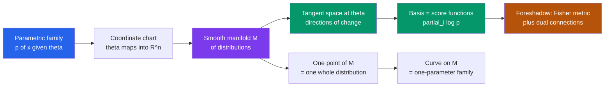

# 🌐 Statistical Manifolds

> [!abstract] TL;DR
> A **statistical manifold** is a whole *family* of probability distributions $\{p(x;\theta)\}$ treated as a smooth geometric surface, with the parameters $\theta$ serving as **coordinates**. Every point on the surface is an entire distribution; sliding along the surface morphs one distribution smoothly into another. Its **tangent space** at a point is spanned by the **score functions** $\partial_i \log p$, giving statistics a genuine geometry — the stage on which the Fisher metric, dual connections, and geodesic inference are later built.

---

## Intuition

**Analogy — a map whose every point is a bell curve.** Picture every possible Gaussian distribution laid out on a map. The horizontal axis is the mean $\mu$; the vertical axis is the standard deviation $\sigma$. Stand at $(\mu,\sigma) = (0,1)$ and you are looking at the standard bell curve. Take one step east and the whole bell slides rightward; take one step north and it flattens and spreads. Every point of this map *is* a complete probability distribution, and walking across the map smoothly deforms one bell curve into the next. That map — a smooth surface whose every point is an entire distribution — is a **statistical manifold**.

Just as Earth's surface is a 2D manifold you navigate with latitude and longitude, a parametric family of distributions is a manifold you navigate with its parameters, and its "geography" — distances, curvature, straightest paths — encodes deep statistical truths. Two distributions that are hard to tell apart from data sit *close together* on this map; two that are easy to distinguish sit *far apart*. Information geometry is, quite literally, the study of the shape of this map.

---

## How It Works

### Core Mechanics

1. **A parametric family becomes a set of points.** A statistical model is a family $\mathcal{S} = \{\,p(x;\theta) : \theta \in \Theta\subseteq \mathbb{R}^n\,\}$ of probability densities over a sample space $\mathcal{X}$. We stop thinking of each $p(x;\theta)$ as "a function of $x$" and start thinking of it as **a single point** in a space whose elements are distributions.

2. **The parameters are coordinates.** The map $\theta \mapsto p(\cdot;\theta)$ is a **chart**: it labels each distribution by a point $\theta$ in ordinary Euclidean parameter space, exactly as a chart on Earth labels each city by $(\text{lat},\text{lon})$. The number of free parameters $n$ is the **dimension** of the manifold. Requiring $p(x;\theta)$ to depend **smoothly** ($C^\infty$) on $\theta$ makes $\mathcal{S}$ a *smooth manifold*.

3. **Tangent space = infinitesimal changes of the distribution.** At a point $\theta$, the **tangent space** $T_\theta \mathcal{S}$ is the space of directions you can move. Moving a hair in the $i$-th coordinate perturbs the density by $\partial_i\, p(x;\theta)$. The natural basis vector for the $i$-th direction is the **score function**
$$
\ell_i(x;\theta) \;=\; \partial_i \log p(x;\theta) \;=\; \frac{\partial_i\, p(x;\theta)}{p(x;\theta)},
$$
so a tangent vector $v = \sum_i v^i\,\ell_i$ is a *random variable* describing how the log-density responds to a nudge of the parameters. This identification — **tangent vectors are score functions** — is the bridge between differential geometry and statistics.

4. **Curves are one-parameter families.** A smooth path $\gamma(t) = \theta(t)$ on the manifold traces out a **one-parameter family of distributions** $p(x;\theta(t))$; its velocity is the score-valued tangent vector $\dot\gamma = \sum_i \dot\theta^i\,\ell_i$. Estimation trajectories, EM iterations, and natural-gradient flows are all curves on a statistical manifold.

5. **Regularity keeps the geometry non-degenerate.** The scores have **zero mean**, $\mathbb{E}_\theta[\ell_i] = \int p\,\partial_i\log p\,dx = \partial_i\!\int p\,dx = 0$, and their covariance is the **Fisher information** $g_{ij}=\mathbb{E}_\theta[\ell_i\ell_j]$. When this covariance matrix is positive-definite the tangent basis is genuinely independent and the manifold is smooth and well-behaved; where it degenerates, the geometry breaks down (see Pitfalls).

### Flow / Architecture



---

## Key Concepts

### 🟢 Secondary — the map of distributions
- A **statistical manifold** is a *collection* of probability distributions arranged as a smooth surface; each **point is a full distribution**, not a single number.
- The distribution's **parameters are its coordinates** — like latitude/longitude pinning a city on Earth, $(\mu,\sigma)$ pins a Gaussian on the map.
- **Sliding** across the surface smoothly morphs one distribution into a neighbour; distributions that look similar sit close, those easy to tell apart sit far.

### 🟡 Undergraduate — manifold structure and coordinate systems
- **Charts, dimension, smoothness.** A chart is the labeling map $\theta \mapsto p(\cdot;\theta)$; the count of independent parameters is the **dimension**; densities must vary $C^\infty$-smoothly in $\theta$. Overlapping charts must agree via smooth **transition maps** (see [[Differential_Geometry]], [[Topological_Spaces]]).
- **The probability simplex.** All distributions on a finite set $\{1,\dots,K\}$ form the **simplex** $\Delta^{K-1}=\{p_k\ge 0,\ \sum_k p_k=1\}$ — a flat $(K-1)$-dimensional manifold whose interior is the "space of all distributions" over that set. Its boundary (some $p_k=0$) needs care.
- **Curves = families.** A curve $\theta(t)$ is a **one-parameter family** of distributions; the tangent direction says how the distribution is changing at each instant.
- **Reparameterization.** The same family can be described by different coordinates ($\sigma$ vs. variance $\sigma^2$ vs. precision $1/\sigma^2$). A change of coordinates is a **diffeomorphism**; the *points* (distributions) are unchanged, so meaningful geometry must be **coordinate-free**.
- **Exponential and mixture families (foreshadow).** Two coordinate systems are canonical: the **exponential family** $p(x;\theta)=\exp[\theta\cdot T(x)-\psi(\theta)]$ with its natural parameters, and the **mixture family** with mean parameters. Each is *flat* in its own affine coordinates — the seed of information geometry's celebrated dual-flat structure.

### 🔴 Graduate — intrinsic geometry, scores, and singular models
- **Tangent vectors as derivations / scores.** Formally $T_\theta\mathcal{S}$ is the space of derivations on smooth functions; statistically it is the linear span of the **score functions** $\ell_i=\partial_i\log p$ inside $L^2(p)$, the "**representation space**" $T_\theta^{(1)}$. The inner product $\langle \ell_i,\ell_j\rangle = \mathbb{E}[\ell_i\ell_j]=g_{ij}$ is the **Fisher information metric** (foreshadowed here; developed in the *Fisher Information Metric* note).
- **Intrinsic vs. coordinate-dependent objects.** A **connection**, metric, or curvature must transform tensorially under reparameterization to be intrinsic. The naive Euclidean geometry of $\Theta$ is *not* intrinsic; the Fisher metric and Amari's $\alpha$-connections *are*.
- **Curved exponential families and embeddings.** A model can sit inside a bigger family as a **submanifold** — e.g. a curved exponential family is a smooth curve/surface embedded in a full exponential family. Its intrinsic curvature (relative to the ambient flat structure) governs the second-order efficiency of estimators (Efron, Amari).
- **Regularity conditions.** We require **identifiability** ($\theta_1\ne\theta_2 \Rightarrow p(\cdot;\theta_1)\ne p(\cdot;\theta_2)$, so coordinates are honest), common support, differentiability under the integral sign, and a **non-degenerate Fisher matrix** so $g$ is a genuine Riemannian metric.
- **The simplex as a sphere.** The map $p_k \mapsto 2\sqrt{p_k}$ sends $\Delta^{K-1}$ to a piece of the sphere of radius $2$ in $\mathbb{R}^K$, and under it the Fisher metric becomes the *round* sphere metric — the "sphere of all distributions," making Hellinger/geodesic distances literally spherical arc-lengths.
- **Singular statistical models.** Hierarchical models, mixtures, and neural networks violate regularity: the Fisher matrix degenerates on subsets of $\Theta$, the map $\theta\mapsto p$ is many-to-one, and classical asymptotics fail. Watanabe's **singular learning theory** replaces the manifold picture with real-algebraic geometry (resolution of singularities) to recover correct learning curves.

---

## Python Demo

```python
# Statistical manifold of 1-D Gaussians N(mu, sigma):
#   - visualize the MANIFOLD (each parameter point is a bell curve),
#   - show the TANGENT SPACE as the span of the SCORE functions,
#   - draw a CURVE on the manifold = a one-parameter path of distributions.
import numpy as np
import matplotlib.pyplot as plt

def gaussian(x, mu, sigma):
    return np.exp(-0.5 * ((x - mu) / sigma) ** 2) / (sigma * np.sqrt(2 * np.pi))

# Score functions: partial derivatives of log p w.r.t. each coordinate.
def score_mu(x, mu, sigma):
    return (x - mu) / sigma**2                       # d/dmu log p

def score_sigma(x, mu, sigma):
    return ((x - mu)**2 - sigma**2) / sigma**3        # d/dsigma log p

x = np.linspace(-6, 8, 500)
fig, ax = plt.subplots(2, 2, figsize=(13, 10))

# ---- (A) The manifold: a plane whose every point IS a distribution ----
axA = ax[0, 0]
mu_grid  = np.linspace(-3, 5, 5)
sig_grid = np.linspace(0.6, 2.6, 4)
for mu in mu_grid:
    for sig in sig_grid:
        xs = np.linspace(-2, 2, 60)
        ys = gaussian(xs, 0.0, sig)                   # glyph shape depends on sigma
        ys = 0.9 * ys / ys.max()                      # scale glyph for display
        axA.plot(mu + 0.7 * xs, sig + 0.35 * ys, color="#2563eb", lw=1)
        axA.plot(mu, sig, 'o', color="#1e3a8a", ms=2)
# a curve on the manifold = a one-parameter family of distributions
t = np.linspace(0, 1, 60)
mu_path  = -2 + 6 * t
sig_path = 0.7 + 1.4 * np.sin(np.pi * t)
axA.plot(mu_path, sig_path, color="#dc2626", lw=2.5,
         label="curve  gamma(t) = (mu(t), sigma(t))")
axA.set_xlabel("coordinate  theta1 = mu"); axA.set_ylabel("coordinate  theta2 = sigma")
axA.set_title("Statistical manifold: each grid point is a bell curve")
axA.legend(loc="upper left", fontsize=8)

# ---- (B) Tangent space basis = score functions at a base point ----
axB = ax[0, 1]
mu0, sig0 = 1.0, 1.3
axB.plot(x, gaussian(x, mu0, sig0), 'k', lw=2, label="p(x; mu0, sigma0)")
axB.plot(x, score_mu(x, mu0, sig0),    color="#2563eb", lw=1.8, label="d log p / d mu")
axB.plot(x, score_sigma(x, mu0, sig0), color="#059669", lw=1.8, label="d log p / d sigma")
axB.axhline(0, color="gray", lw=0.6)
axB.set_title("Tangent basis = score functions at (mu0, sigma0)")
axB.set_xlabel("x"); axB.legend(fontsize=8)

# ---- (C) Tangent vectors morph the distribution into a neighbour ----
axC = ax[1, 0]
eps = 0.35
p0 = gaussian(x, mu0, sig0)
dp_mu  = p0 * score_mu(x, mu0, sig0)                  # d p / d mu    = p * score_mu
dp_sig = p0 * score_sigma(x, mu0, sig0)              # d p / d sigma = p * score_sigma
axC.plot(x, p0, 'k', lw=2, label="p(x; mu0, sigma0)")
axC.plot(x, p0 + eps * dp_mu,  color="#2563eb", ls="--", lw=1.8, label="step +eps in mu")
axC.plot(x, p0 + eps * dp_sig, color="#059669", ls="--", lw=1.8, label="step +eps in sigma")
axC.set_title("Tangent vectors = directions the density can move")
axC.set_xlabel("x"); axC.legend(fontsize=8)

# ---- (D) The distributions living along the curve gamma(t) ----
axD = ax[1, 1]
colors = plt.cm.plasma(t)
for i in range(0, len(t), 5):
    axD.plot(x, gaussian(x, mu_path[i], sig_path[i]), color=colors[i], lw=1.5)
axD.set_title("A curve on the manifold = a path of distributions")
axD.set_xlabel("x"); axD.set_ylabel("density")

plt.tight_layout()
plt.savefig("statistical_manifold.png", dpi=110)
plt.show()

# Regularity check: scores have zero mean (defining property of a regular model).
xs = np.linspace(-25, 25, 40000)
w  = gaussian(xs, mu0, sig0)
E_score_mu = np.trapz(w * score_mu(xs, mu0, sig0), xs)
print(f"E[score_mu] = {E_score_mu:.2e}   (should be ~0: the manifold is regular)")
```

The four panels show the same object from four angles: **(A)** the parameter plane *is* a field of bell curves with a red curve threading through it; **(B)** at one point the two score functions form the tangent basis; **(C)** stepping along each score direction deforms the density into a neighbour; **(D)** the red curve unrolls into an animated-looking family of distributions. The final print confirms $\mathbb{E}[\ell_\mu]\approx 0$ — the regularity condition that makes the geometry well-defined.

---

## Real-World Applications

> **Example — Natural-gradient descent (Amari) in ML.** A neural network's output distribution $p(y\mid x;\theta)$ *is* a point on a statistical manifold parameterized by weights $\theta$. Ordinary gradient descent moves in raw coordinate space and is distorted by reparameterization; **natural gradient** preconditions the gradient with the inverse Fisher metric $g^{-1}$, i.e. it descends on the *manifold's intrinsic geometry* rather than the arbitrary coordinate grid. This is the same insight that powers K-FAC optimizers and TRPO/PPO's trust regions in reinforcement learning.

- **Asymptotic statistics.** The Cramér–Rao bound, MLE efficiency, and higher-order corrections (Efron's curvature, Amari's dual connections) are geometric statements about a model manifold and its embedding (see [[Statistical_Inference]]).
- **Exponential-family / GLM inference.** Fitting an exponential family is moving to a point on a *flat* manifold; the mean and natural parameters are dual coordinate systems (see [[Maximum_Entropy_and_Exponential_Families]]).
- **Signal processing & vision.** Covariance descriptors, diffusion tensors, and Gaussian mixtures are averaged and compared using geodesic distances on the manifold of Gaussians rather than naive Euclidean ones.
- **Singular models & deep learning.** Watanabe's singular learning theory explains why over-parameterized networks generalize despite classical asymptotics failing on their degenerate manifolds.

---

## Common Pitfalls

- **Confusing coordinate-dependent with intrinsic quantities.** The Euclidean distance $\lVert\theta_1-\theta_2\rVert$ in parameter space is *not* meaningful: rescale or reparameterize (variance vs. precision) and it changes, while the underlying distributions do not. Only coordinate-free objects (Fisher metric, KL divergence, geodesic distance) describe the real geometry. Always ask "does this survive a change of coordinates?"
- **Assuming regularity where it fails (singular models).** Mixtures, hierarchical models, and neural nets have parameter regions where the **Fisher matrix degenerates** and $\theta\mapsto p$ is many-to-one. There the "manifold" is singular; Cramér–Rao, Wald tests, and Laplace approximations silently break, and BIC/AIC give wrong learning curves. Diagnose non-identifiability before trusting asymptotics.
- **Ignoring the boundary of parameter space.** On the probability simplex, distributions with some $p_k = 0$ live on the **boundary**, where charts degenerate and Fisher information blows up; MLEs pinned to the boundary violate the interior-point assumptions of standard theory.
- **Forgetting embedding curvature in curved exponential families.** A curved family looks locally flat but is a *bent submanifold* of a larger flat family. Treating it as flat discards the embedding curvature that controls second-order estimator bias and efficiency.
- **Non-identifiability masquerading as a good fit.** If two different $\theta$ give the same distribution, gradient methods wander a flat valley and confidence regions become unbounded — a modeling failure, not a manifold you can navigate.

---

## Related Concepts

- [[Differential_Geometry]] — supplies the manifold machinery (charts, tangent spaces, connections, curvature) that a statistical manifold specializes to distributions.
- [[Topological_Spaces]] — a manifold is first a topological space with extra smooth structure; underpins charts and continuity.
- [[Partial_Derivatives]] — score functions are literally partial derivatives $\partial_i \log p$; the tangent basis is built from them.
- [[Probability_Theory]] — the points of the manifold are probability distributions with all their measure-theoretic structure.
- [[Random_Variables]] — each score is a random variable; tangent vectors live in $L^2(p)$ of random variables.
- [[Common_Probability_Distributions]] — Gaussians, Bernoullis, and their families are the concrete manifolds studied here.
- [[Statistical_Inference]] — MLE, Cramér–Rao, and asymptotic efficiency are geometric facts about the model manifold.
- [[Bayesian_Statistics]] — priors and posteriors are themselves points/measures over the manifold; Jeffreys prior is the Fisher volume element.
- [[Maximum_Entropy_and_Exponential_Families]] — exponential families are the canonical *flat* coordinate charts on a statistical manifold.

*Sibling notes in this vault (forthcoming): the Information Geometry Overview, The Fisher Information Metric, Exponential Families and Their Geometry, Dual Affine Connections, and a Riemannian Geometry Primer for Statistics build directly on the manifold and tangent-space picture introduced here.*

---

## Review Questions

1. **🟢 Conceptual.** Explain, using the map-of-bell-curves analogy, what it means for a single *point* on a statistical manifold to be an entire probability distribution, and what a *curve* on that manifold represents.
2. **🟡 Scenario.** You parameterize Gaussians once by standard deviation $\sigma$ and once by precision $\tau = 1/\sigma^2$. The Euclidean distance between two models differs between the two parameterizations, yet the models are the same. What does this teach you about which geometric quantities are meaningful, and name one quantity that is invariant?
3. **🔴 Trade-off / graduate.** A colleague fits a two-component Gaussian mixture and reports a tight Cramér–Rao-based confidence interval. Why should you be suspicious? Discuss identifiability, degeneracy of the Fisher information, and how the manifold picture fails for singular models.

---

## Sources

- Amari, S. & Nagaoka, H. — *Methods of Information Geometry* (AMS/Oxford, 2000). The canonical reference for statistical manifolds, dual connections, and $\alpha$-geometry.
- Murray, M. K. & Rice, J. W. — *Differential Geometry and Statistics* (Chapman & Hall, 1993). Careful development of the manifold structure of statistical models.
- Kass, R. E. & Vos, P. W. — *Geometrical Foundations of Asymptotic Inference* (Wiley, 1997). Statistical-manifold geometry aimed at asymptotic inference and curved exponential families.
- Nielsen, F. — ["An Elementary Introduction to Information Geometry"](https://www.mdpi.com/1099-4300/22/10/1100), *Entropy* 22(10):1100 (2020). Accessible modern overview with worked examples.
- Watanabe, S. — *Algebraic Geometry and Statistical Learning Theory* (Cambridge, 2009). The theory of singular statistical models where the manifold picture degenerates.

---

#information-geometry #statistical-manifolds #tangent-space #score-function #differential-geometry
