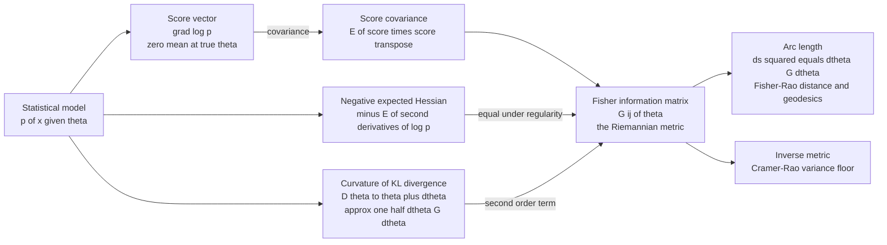

# 📐 The Fisher Information Metric

> [!abstract] TL;DR
> The **Fisher information matrix** $G_{ij}(\theta) = \mathbb{E}[\partial_i \log p \cdot \partial_j \log p] = -\mathbb{E}[\partial_i\partial_j \log p]$ is the covariance of the score, equivalently the negative expected Hessian of the log-likelihood. Its deeper identity is *geometric*: it is the **local curvature of the KL divergence** between neighbouring distributions, $D(p_\theta \,\|\, p_{\theta+d\theta}) \approx \tfrac12\, d\theta^\top G\, d\theta$, which makes it a **Riemannian metric** on the manifold of probability distributions — the **Fisher-Rao metric** (Rao, 1945). It answers "how *distinguishable* are two nearby distributions from data?" Where a tiny parameter nudge makes distributions easy to tell apart, distances are large; where it barely matters, distances shrink. Chentsov's theorem singles it out as the *unique* metric (up to scale) invariant under sufficient statistics — the one natural notion of distance between distributions. Its inverse is the Cramér-Rao variance floor; its arc length is the Fisher-Rao distance.

---

## Intuition

**Analogy — the stretchy rubber map.** Picture a map printed on a sheet of stretchy rubber laid over real terrain. Near a jagged mountain the rubber is stretched thin, so moving *one inch on the map* covers a mile of real ground; out on a flat plain the rubber is slack, so one inch on the map covers only a foot of terrain. The "real distance" you travel per inch of map depends on *where you are*. There is no single global ruler — the ruler itself changes from place to place.

The **Fisher information metric is exactly this stretchy ruler for the space of probability distributions.** Each point of the map is a distribution $p(x;\theta)$; the coordinates $\theta$ are like map coordinates. The metric measures how *distinguishable from data* two nearby distributions are. Where a tiny change in $\theta$ makes the distributions easy to tell apart (samples that come from one loudly reject the other), the rubber is stretched and **distances are large**. Where the same-sized change in $\theta$ barely alters the distribution, the rubber is slack and **distances shrink**. It is the one natural, reparameterization-invariant way to measure distance between distributions: rename the coordinates however you like, the underlying terrain — the geometry — does not move.

---

## How It Works

### The statistical manifold

Fix a smooth parametric family $\mathcal{M} = \{\, p(x;\theta) : \theta \in \Theta \subseteq \mathbb{R}^k \,\}$. Treat each distribution as a *point* and the parameters $\theta$ as *coordinates*; $\mathcal{M}$ is then a **statistical manifold**. To do geometry on it — measure distances, angles, curvature — we need a **metric tensor** $G_{ij}(\theta)$ that says how far apart neighbouring points are. The Fisher information matrix is that metric.

### The score and three equivalent definitions

The **score** is the gradient of the log-likelihood, $s(x;\theta) = \nabla_\theta \log p(x;\theta)$, with components $s_i = \partial_i \log p$. At the true parameter it has **zero mean**, because $\mathbb{E}[\partial_i \log p] = \int \partial_i p \, dx = \partial_i \!\int p\, dx = \partial_i 1 = 0$. Its spread around zero is what carries the information. The Fisher information matrix admits **three faces**:

1. **Score covariance (outer product).**
$$G_{ij}(\theta) = \mathbb{E}\big[\, s_i\, s_j \,\big] = \mathbb{E}\big[\, \partial_i \log p \,\cdot\, \partial_j \log p \,\big].$$
Since the score has zero mean, this is literally $\operatorname{Cov}(s)$. It is manifestly positive semi-definite — a valid metric.

2. **Negative expected Hessian (curvature of log-likelihood).**
$$G_{ij}(\theta) = -\,\mathbb{E}\big[\, \partial_i \partial_j \log p \,\big].$$
A widely-spread score (data reacts strongly to $\theta$) is the same thing as a sharply curved log-likelihood peak. Differentiating $\mathbb{E}[\partial_j \log p]=0$ once more gives the identity between (1) and (2).

3. **Curvature of the KL divergence — the key interpretation.** Expand the divergence between $p_\theta$ and a slightly perturbed $p_{\theta+d\theta}$ to second order. The zeroth- and first-order terms vanish (KL is minimized at $d\theta=0$, so it is *flat* there), and the leading term is quadratic:
$$D\big(p_\theta \,\|\, p_{\theta+d\theta}\big) \;\approx\; \tfrac12\, d\theta^\top G(\theta)\, d\theta.$$
So **Fisher information is the local curvature of KL divergence** — the infinitesimal squared statistical distance between two distributions $d\theta$ apart. This is what promotes $G$ from a statistical object to a *geometric* one.

### When the three coincide

Definitions (1) and (2) agree only under **regularity conditions**: the support of $p(x;\theta)$ must not depend on $\theta$, and differentiation must pass under the integral sign (dominated convergence). When these hold, all three faces are the same matrix. When the support *moves* with $\theta$ — the uniform on $[0,\theta]$ is the classic counterexample — the score-covariance and Hessian forms diverge and the KL expansion breaks down.

### The Riemannian metric and its invariance

Declaring $G_{ij}(\theta)$ the metric equips $\mathcal{M}$ with an infinitesimal squared arc length
$$ds^2 \;=\; \sum_{i,j} G_{ij}(\theta)\, d\theta_i\, d\theta_j \;=\; d\theta^\top G\, d\theta.$$
Under a smooth reparameterization $\phi = \phi(\theta)$, the components transform as a **$(0,2)$ tensor**,
$$G'_{ab}(\phi) \;=\; \sum_{i,j} \frac{\partial \theta_i}{\partial \phi_a}\,\frac{\partial \theta_j}{\partial \phi_b}\, G_{ij}(\theta),$$
so the *numbers* $G_{ij}$ change with coordinates but $ds^2$ — the actual distance — does **not**. The geometry is intrinsic. **Chentsov's uniqueness theorem** goes further: the Fisher-Rao metric is the *only* Riemannian metric (up to a constant factor) that is invariant under sufficient statistics and Markov morphisms — the unique natural geometry of statistical inference.

### Arc length and the Fisher-Rao distance

Global distance between two distributions is the length of the shortest curve (**geodesic**) joining them under $G$:
$$d_{\mathrm{FR}}(\theta_A, \theta_B) \;=\; \min_{\gamma:\,\theta_A \to \theta_B} \int_0^1 \sqrt{\dot\gamma(t)^\top G(\gamma(t))\, \dot\gamma(t)}\;dt.$$
This **Fisher-Rao distance** is generally *not* Euclidean in the parameters, because $G$ varies from point to point (the rubber stretches). Its closed forms are strikingly clean for standard families.

### Canonical examples

- **Gaussian $\mathcal{N}(\mu,\sigma)$:** with parameters $(\mu,\sigma)$, $G = \operatorname{diag}(1/\sigma^2,\, 2/\sigma^2)$. The metric $ds^2 = (d\mu^2 + 2\,d\sigma^2)/\sigma^2$ is (after rescaling $\mu$) the **Poincaré upper half-plane** — the family is a surface of *constant negative curvature*, i.e. **hyperbolic**. Distances blow up as $\sigma \to 0$.
- **Bernoulli$(p)$:** $G = 1/[p(1-p)]$, so $ds = dp/\sqrt{p(1-p)}$. Substituting $p = \sin^2(\theta/2)$ gives $ds = d\theta$: the model is an **arc of a circle**. Distinguishability is hardest at $p=1/2$ and diverges at the endpoints.
- **Categorical (simplex):** the square-root embedding $p_i \mapsto \sqrt{p_i}$ maps the probability simplex onto the positive orthant of a **sphere** of radius 2; the Fisher-Rao distance is $2\arccos\!\big(\sum_i \sqrt{p_i q_i}\big)$, twice the Bhattacharyya/Hellinger angle.

### Two structural consequences

- **Cramér-Rao floor.** The *inverse* Fisher matrix lower-bounds estimator covariance: $\operatorname{Cov}(\hat\theta) \succeq (nG)^{-1}$. Directions of high information (steep metric) are estimable to high precision; flat directions cannot be pinned down. Geometry and estimability are the same fact.
- **Monotonicity under coarse-graining.** Pushing data through any stochastic map (a Markov morphism) can only *lose* Fisher information: $G_{\text{coarse}} \preceq G$. Equality holds exactly for **sufficient statistics**. This is the Fisher-side of the data-processing inequality, dual to the monotonicity of KL divergence.

### Flow: from score to distance



---

## Key Concepts

### Secondary (intuition-level)

- **A stretchy ruler for distributions.** The metric measures how far apart two nearby distributions are *for the purpose of telling them apart from data*.
- **Stretch tracks distinguishability.** Where a small parameter change makes the distribution change a lot, distances are big; where it barely matters, distances are small.
- **Coordinates are arbitrary, geometry is not.** Rename your parameters however you wish — the actual distances between distributions stay the same.
- **Curvature of KL.** The Fisher metric is just the "shape of the valley" of KL divergence right at its bottom.

### Undergraduate (needs probability + multivariable calculus)

- **Score and zero mean.** $s_i = \partial_i \log p$; $\mathbb{E}[s_i]=0$ at the true $\theta$, from differentiating $\int p\,dx = 1$.
- **Three equal definitions.** Score covariance $=$ negative expected log-likelihood Hessian $=$ Hessian of KL at $d\theta=0$. Pick whichever is easiest to compute.
- **The KL expansion.** $D(p_\theta \| p_{\theta+d\theta}) \approx \tfrac12 d\theta^\top G\, d\theta$ makes $ds^2 = d\theta^\top G\, d\theta$ the *squared* infinitesimal statistical distance.
- **Gaussian worked example.** For $\mathcal{N}(\mu,\sigma)$: $G = \operatorname{diag}(1/\sigma^2, 2/\sigma^2)$. Off-diagonal is zero (odd moments vanish); the metric diverges as $\sigma\to0$.
- **Tensor transformation.** Under $\phi=\phi(\theta)$, $G' = J^\top G\, J$ with $J = \partial\theta/\partial\phi$; hence $ds^2$ is coordinate-free.
- **Inverse is the precision floor.** $\operatorname{Cov}(\hat\theta)\succeq (nG)^{-1}$ links the metric directly to estimation accuracy.

### Graduate (system-level)

- **Chentsov's uniqueness theorem.** Up to scale, the Fisher-Rao metric is the *only* Riemannian metric on a statistical manifold invariant under Markov morphisms — a categorical characterization that explains "why this metric and no other."
- **Constant-curvature families.** The Gaussian $(\mu,\sigma)$ manifold is hyperbolic (Poincaré half-plane); the categorical family is spherical (square-root simplex). Fisher-Rao geodesics are Poincaré geodesics and great circles respectively.
- **Monotonicity / data processing.** $G$ contracts under stochastic maps and is preserved by sufficient statistics — the exact dual of KL monotonicity, and the geometric root of the sufficiency principle.
- **Dually flat structure.** Beyond the metric, exponential families carry a pair of flat affine connections (the $\pm 1$ / $e$- and $m$-connections) for which the KL divergence is the canonical Bregman divergence and the Pythagorean theorem holds — the full Amari-Nagaoka apparatus, of which the Fisher metric is the first ingredient.
- **Natural gradient.** Steepest descent under $G$ is $\tilde\nabla \mathcal{L} = G^{-1}\nabla\mathcal{L}$: reparameterization-invariant and often faster; K-FAC and TRPO approximate $G$ in deep learning and reinforcement learning.
- **Volume element and Jeffreys prior.** $dV = \sqrt{\det G}\, d\theta$ is the invariant Fisher-Rao volume; normalizing it yields the Jeffreys prior $\pi(\theta)\propto\sqrt{\det G(\theta)}$, and its total mass drives the MDL/stochastic-complexity model-selection term.

---

## Python Demo

```python
# numpy + matplotlib only.
# Goal 1: for the Gaussian family N(mu, sigma) compute the FISHER INFORMATION
#         MATRIX three equivalent ways and verify they agree numerically:
#           (i)   E[ score . score^T ]              (score covariance)
#           (ii)  - E[ Hessian of log p ]           (negative expected Hessian)
#           (iii) leading term of KL(theta || theta+dtheta) ~ 1/2 dtheta^T G dtheta
#         Analytic truth:  G = diag( 1/sigma^2 , 2/sigma^2 ).
# Goal 2: visualize the metric as INFORMATION ELLIPSES over (mu, sigma) space.
#         Equal-distinguishability ellipses shrink toward sigma -> 0: the geometry
#         is hyperbolic-like, stretching without bound near the boundary.
# Bonus : Fisher-Rao geodesic distance != Euclidean parameter distance.

import numpy as np
import matplotlib.pyplot as plt

rng = np.random.default_rng(0)

mu0, sig0 = 0.0, 1.5
G_analytic = np.diag([1.0 / sig0**2, 2.0 / sig0**2])   # ground truth

# ---------------------------------------------------------------------------
# (i) Score covariance:  s = [ (x-mu)/sig^2 , ((x-mu)^2 - sig^2)/sig^3 ]
# ---------------------------------------------------------------------------
N = 2_000_000
x = rng.normal(mu0, sig0, size=N)
d = x - mu0
s_mu  = d / sig0**2
s_sig = (d**2 - sig0**2) / sig0**3
S = np.stack([s_mu, s_sig], axis=1)            # (N, 2) score vectors
G_score = (S.T @ S) / N                         # E[ s s^T ]

# ---------------------------------------------------------------------------
# (ii) Negative expected Hessian of log p:
#      d2/dmu2   = -1/sig^2
#      d2/dmudsig= -2(x-mu)/sig^3
#      d2/dsig2  =  1/sig^2 - 3(x-mu)^2/sig^4
# ---------------------------------------------------------------------------
H_mm = np.full(N, -1.0 / sig0**2)
H_ms = -2.0 * d / sig0**3
H_ss = 1.0 / sig0**2 - 3.0 * d**2 / sig0**4
G_hess = -np.array([[H_mm.mean(), H_ms.mean()],
                    [H_ms.mean(), H_ss.mean()]])

# ---------------------------------------------------------------------------
# (iii) KL curvature:  G = Hessian of  f(dmu,dsig) = KL( theta || theta+dtheta )
#       computed by finite differences of the exact Gaussian KL.
# ---------------------------------------------------------------------------
def kl_gauss(m1, s1, m2, s2):
    return np.log(s2 / s1) + (s1**2 + (m1 - m2)**2) / (2 * s2**2) - 0.5

h = 1e-4
def f(dm, ds):
    return kl_gauss(mu0, sig0, mu0 + dm, sig0 + ds)

G_kl = np.array([
    [(f(h, 0) + f(-h, 0)) / h**2,
     (f(h, h) - f(h, -h) - f(-h, h) + f(-h, -h)) / (4 * h**2)],
    [(f(h, h) - f(h, -h) - f(-h, h) + f(-h, -h)) / (4 * h**2),
     (f(0, h) + f(0, -h)) / h**2],
])

print("Fisher information matrix for N(mu, sigma), sigma =", sig0)
print("  analytic  diag(1/sig^2, 2/sig^2):\n", np.round(G_analytic, 4))
print("  (i)   score covariance  E[s s^T]:\n", np.round(G_score, 4))
print("  (ii)  negative expected Hessian :\n", np.round(G_hess, 4))
print("  (iii) curvature of KL divergence:\n", np.round(G_kl, 4))
print("  max abs deviation from analytic:",
      float(np.max(np.abs(np.stack([G_score, G_hess, G_kl]) - G_analytic))))

# ---------------------------------------------------------------------------
# Bonus: Fisher-Rao geodesic distance (Poincare form) vs Euclidean.
#   ds^2 = (dmu^2 + 2 dsig^2)/sig^2  ->  rescale mu' = mu/sqrt(2)  ->  sqrt(2) x Poincare.
# ---------------------------------------------------------------------------
def fisher_rao(m1, s1, m2, s2):
    m1p, m2p = m1 / np.sqrt(2), m2 / np.sqrt(2)
    arg = 1.0 + ((m1p - m2p)**2 + (s1 - s2)**2) / (2 * s1 * s2)
    return np.sqrt(2) * np.arccosh(arg)

A, B = (0.0, 1.0), (0.0, 0.2)   # same mean, one hugs the sigma -> 0 boundary
euclid = np.hypot(A[0] - B[0], A[1] - B[1])
print(f"\nTwo Gaussians A={A}, B={B}:")
print(f"  Euclidean parameter distance : {euclid:.4f}")
print(f"  Fisher-Rao geodesic distance : {fisher_rao(*A, *B):.4f}  (stretched near sigma->0)")

# ---------------------------------------------------------------------------
# Plots
# ---------------------------------------------------------------------------
fig, (axL, axR) = plt.subplots(1, 2, figsize=(12, 4.8))

# LEFT: three-way agreement on the three matrix entries.
labels = ["G_mu,mu", "G_mu,sig", "G_sig,sig"]
idx = [(0, 0), (0, 1), (1, 1)]
methods = {
    "analytic":         [G_analytic[i, j] for i, j in idx],
    "(i) score cov":    [G_score[i, j]    for i, j in idx],
    "(ii) -E[Hess]":    [G_hess[i, j]     for i, j in idx],
    "(iii) KL curv":    [G_kl[i, j]       for i, j in idx],
}
xpos = np.arange(3)
w = 0.2
for k, (name, vals) in enumerate(methods.items()):
    axL.bar(xpos + (k - 1.5) * w, vals, w, label=name)
axL.set_xticks(xpos); axL.set_xticklabels(labels)
axL.set_ylabel("matrix entry value")
axL.set_title("Fisher matrix: three definitions agree")
axL.axhline(0, color="k", lw=0.6)
axL.legend(fontsize=8)

# RIGHT: information ellipses over (mu, sigma) with an info-density background.
mus  = np.linspace(-3, 3, 240)
sigs = np.linspace(0.35, 3.0, 200)
MU, SG = np.meshgrid(mus, sigs)
info_density = np.sqrt(2) / SG**2                      # sqrt(det G) = sqrt(2)/sig^2
pc = axR.pcolormesh(MU, SG, np.log(info_density), shading="auto", cmap="magma")
fig.colorbar(pc, ax=axR, label="log info density  log sqrt(det G)")

t = np.linspace(0, 2 * np.pi, 60)
r = 0.32                                               # fixed statistical radius
for mc in np.linspace(-2.2, 2.2, 5):
    for sc in [0.5, 1.0, 1.6, 2.3]:
        # equal-KL ellipse:  dtheta^T G dtheta = r^2, semi-axes = r/sqrt(eig)
        ax_mu  = r * sc                                # 1/sqrt(G_mu,mu)  = sigma
        ax_sig = r * sc / np.sqrt(2)                   # 1/sqrt(G_sig,sig)= sigma/sqrt2
        axR.plot(mc + ax_mu * np.cos(t), sc + ax_sig * np.sin(t), "c-", lw=1.2)
axR.set_xlabel("mean  mu"); axR.set_ylabel("std dev  sigma")
axR.set_title("Information ellipses: equal-distinguishability, shrink as sigma -> 0")
axR.set_xlim(-3, 3); axR.set_ylim(0.35, 3.0)

plt.tight_layout()
plt.savefig("fisher_information_metric.png", dpi=120)
plt.show()
```

**What the output shows.** The printout lands all three matrices on $\operatorname{diag}(0.444,\,0.889)$ with off-diagonals $\approx 0$ and a maximum deviation of order $10^{-3}$ (Monte Carlo noise) — the score covariance, the negative expected Hessian, and the KL curvature are *literally the same object*, confirmed numerically. The left panel makes this visual: for each of the three entries, all four bars (analytic plus the three estimators) sit at the same height. The right panel plots equal-distinguishability ("information") ellipses over $(\mu,\sigma)$ space against a background of $\log\sqrt{\det G}$: the ellipses have half-widths proportional to $\sigma$, so they **shrink toward the boundary** $\sigma\to0$ while the information density blows up — a tiny parameter step down there covers a huge statistical distance. The bonus print shows two Gaussians a Euclidean distance $0.8$ apart in parameters sit a Fisher-Rao distance $\approx 2.28$ apart, because the geodesic must skirt the stretched-out region near $\sigma\to0$: **geometry is not Euclidean**.

---

## Real-World Applications

> **Natural-gradient optimization.** Amari's natural gradient replaces the raw gradient $\nabla\mathcal{L}$ with $G^{-1}\nabla\mathcal{L}$ — steepest descent measured by the Fisher metric rather than by naive Euclidean parameter distance. Because the metric is reparameterization-invariant, so is the update; K-FAC (deep nets) and TRPO / natural policy gradients (reinforcement learning) approximate $G$ to take these information-geometric steps and often converge far faster than plain SGD. See [[Optimizers]].

> **Standard errors in every statistics package.** Confidence intervals from logistic regression, GLMs, and maximum-likelihood fits come from inverting the (observed) Fisher information at the MLE: $\hat\theta \pm 1.96\sqrt{[G^{-1}]_{jj}/n}$. The metric's inverse *is* the reported uncertainty ellipsoid — geometry made into error bars. See [[Statistical_Inference]].

> **Quantum metrology and the Heisenberg limit.** The quantum Fisher information metric governs the best achievable phase precision in interferometers, atomic clocks, and gravitational-wave detectors. Classical states give $1/\sqrt{N}$ scaling; entangled states raise the quantum Fisher information to reach the $1/N$ Heisenberg limit — metric engineering at the physical frontier.

> **Optimal experimental design.** D-optimal and A-optimal designs choose measurement conditions to maximize $\det G$ or $\operatorname{tr} G$, minimizing the volume of the confidence ellipsoid. You are literally buying the most Fisher-Rao volume of information per experiment, whether in clinical trials, A/B tests, or sensor placement.

> **Evolutionary dynamics and the replicator equation.** On the probability simplex the Fisher-Rao metric coincides with the Shahshahani metric; under it the replicator dynamics of evolutionary game theory become a natural gradient flow of mean fitness — Fisher's fundamental theorem of natural selection reads as ascent in Fisher-Rao geometry.

---

## Common Pitfalls

- **Confusing the tensor with the geometry.** The *components* $G_{ij}$ genuinely depend on your choice of coordinates — reparameterize and they change by $J^\top G\, J$. What is invariant is $ds^2$, distances, geodesics, and $\sqrt{\det G}\,d\theta$. Never compare raw Fisher numbers across two parameterizations; compare invariants. This is exactly why the natural gradient and Jeffreys prior exist.
- **Assuming the score-covariance and Hessian forms always agree.** $\mathbb{E}[s\,s^\top] = -\mathbb{E}[\text{Hess}\,\log p]$ requires regularity: fixed support and the legality of differentiating under the integral. For the uniform on $[0,\theta]$ the support moves with $\theta$, the identity fails, and there is no well-defined Fisher metric there. Always check regularity before quoting $G$.
- **Singular Fisher information.** A rank-deficient or near-singular $G$ means a *flat direction* in the likelihood — a parameter combination the data cannot distinguish (non-identifiability). Inverting it explodes the Cramér-Rao variance. This is a modeling signal (the model is over-parameterized along that direction), not a numerical nuisance to be silently regularized away.
- **Boundary blow-up.** The metric diverges near the edge of the parameter space: $\sigma\to0$ for the Gaussian, $p\to0$ or $1$ for Bernoulli. Distances there stretch without bound (the geometry is hyperbolic-like), geodesics bend away from the boundary, and numerical optimization ill-conditions. Work in a chart where the boundary is pushed to infinity, or use the square-root / natural coordinates.
- **Treating Fisher-Rao distance as Euclidean.** Because $G$ varies point to point, the shortest path between two distributions is generally curved and its length is not $\|\theta_A-\theta_B\|$. Using Euclidean parameter distance as a proxy for statistical distinguishability silently assumes a flat metric that is almost never correct.

---

## Related Concepts

*Cross-vault connections (Glob-verified):*
- [[Fisher_Information_and_the_Cramer_Rao_Bound]] — the estimation-theory companion: this note is the *geometric / metric* treatment of the same object, where that note is the *precision-bound* treatment. Its inverse Fisher matrix is the variance floor whose geometry we develop here.
- [[Relative_Entropy_and_Cross_Entropy]] — the Fisher metric is the second-order Taylor coefficient of the KL divergence between neighbouring distributions; KL is the global divergence, Fisher is its local quadratic form.
- [[Statistical_Inference]] — sufficiency, the MLE, and asymptotic efficiency all read geometrically: the MLE reaches the Cramér-Rao floor set by the metric, and sufficient statistics preserve it.
- [[Common_Probability_Distributions]] — the Gaussian, Bernoulli, and categorical worked metrics ($\operatorname{diag}(1/\sigma^2,2/\sigma^2)$, $1/[p(1-p)]$, the square-root sphere) live on these families.
- [[Partial_Derivatives]] — the score is a gradient of $\log p$ and $G$ a Hessian; the metric is built entirely from these multivariable derivatives.
- [[Entropy_and_Information_Content]] — Shannon entropy measures information *within* a distribution; the Fisher metric measures distinguishability *between* neighbouring distributions. Same lineage, complementary roles.
- [[Optimizers]] — natural-gradient, K-FAC, and trust-region methods precondition updates by $G^{-1}$, taking steepest-descent steps in this metric.
- [[Calculus_for_ML]] — the score/Hessian machinery is the same differential calculus that powers backpropagation and second-order optimization.

*Future siblings in this vault (Information Geometry): the **statistical manifold** on which this metric lives; **KL divergence and geometry** whose curvature it is; the **Fisher-Rao distance** it integrates to; **Cramér-Rao bound and efficiency** it inverts to; and **Chentsov's uniqueness theorem** that singles it out.*

---

## Review Questions

1. **(Secondary)** Using the stretchy-rubber-map analogy, explain why two distributions can be "close" in parameter numbers yet "far" in the Fisher metric, and vice versa. Why is it a virtue that renaming the parameters leaves the distances unchanged?
2. **(Undergraduate)** For the Gaussian family $\mathcal{N}(\mu,\sigma)$, derive the Fisher information matrix two ways — as $\mathbb{E}[s\,s^\top]$ and as $-\mathbb{E}[\partial_i\partial_j \log p]$ — and show both give $\operatorname{diag}(1/\sigma^2, 2/\sigma^2)$ with zero off-diagonal. Then show the KL divergence between $\mathcal{N}(\mu,\sigma)$ and $\mathcal{N}(\mu+d\mu,\sigma+d\sigma)$ expands to $\tfrac12(d\mu^2/\sigma^2 + 2\,d\sigma^2/\sigma^2)$.
3. **(Graduate)** State Chentsov's uniqueness theorem and explain what it means for the Fisher metric to be the *only* invariant metric on a statistical manifold. How does this invariance property connect to (a) the reparameterization-invariance of the natural gradient, and (b) the monotonicity of Fisher information under coarse-graining? Give one family whose Fisher-Rao geometry has constant negative curvature and one with constant positive curvature.

---

## Sources

- Rao, C. R. (1945). *Information and the accuracy attainable in the estimation of statistical parameters.* Bulletin of the Calcutta Mathematical Society, 37, 81-91. (the original Fisher-Rao metric)
- Amari, S. & Nagaoka, H. (2000). *Methods of Information Geometry.* AMS / Oxford University Press. (metric, dual connections, Chentsov's theorem)
- Amari, S. (2016). *Information Geometry and Its Applications.* Springer. (natural gradient, applications)
- Cover, T. M. & Thomas, J. A. (2006). *Elements of Information Theory* (2nd ed.), Ch. 11 (Fisher information, KL, and statistics). Wiley.
- Nielsen, F. (2020). *An Elementary Introduction to Information Geometry.* Entropy, 22(10), 1100. (modern, accessible; Fisher-Rao distance and geodesics)

---

#information-geometry #fisher-information #riemannian-metric #kl-divergence #curvature
