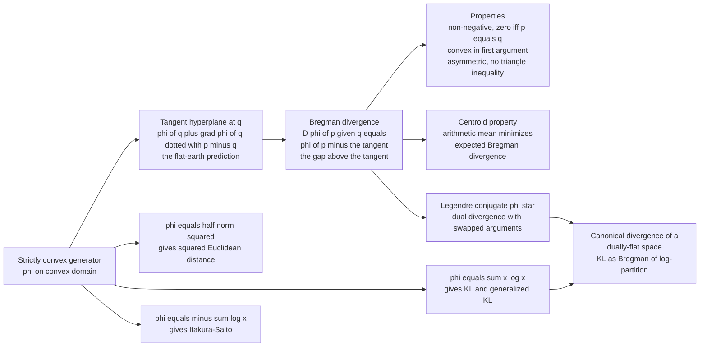

# 📐 Bregman Divergences

> [!abstract] TL;DR
> A **Bregman divergence** $D_\varphi(p\,\|\,q) = \varphi(p) - \varphi(q) - \langle \nabla\varphi(q),\, p - q\rangle$ is the **vertical gap between a strictly convex generator $\varphi$ and its tangent hyperplane at $q$**, evaluated at $p$. Pick any convex "hill" $\varphi$ and you get a distance-like function for free: $\varphi(x)=\tfrac12\|x\|^2$ yields **squared Euclidean distance**, $\varphi(x)=\sum x\log x$ (negative entropy) yields the **KL / generalized-KL divergence**, $\varphi(x)=-\sum\log x$ yields the **Itakura–Saito** divergence, and $\varphi(x)=\tfrac12 x^\top A x$ yields the squared **Mahalanobis** distance. This one construction unifies most of the "distances" of statistics and machine learning. It is **always non-negative** and **strictly convex in its first argument**, but it is **not symmetric** and obeys **no triangle inequality** — so it is a divergence, not a metric. Two structural facts make it central: the **arithmetic mean uniquely minimizes expected Bregman divergence** (generalizing least squares — the engine of Bregman $k$-means), and via the **Legendre conjugate** $\varphi^\*$ the divergence **dualizes**, $D_\varphi(p\,\|\,q) = D_{\varphi^\*}(\nabla\varphi(q)\,\|\,\nabla\varphi(p))$. In information geometry the Bregman divergence generated by the log-partition function *is* the **canonical divergence of a dually-flat space** — which is exactly why KL divergence is the natural "distance" on an exponential family.

---

## Intuition

**Analogy — the hill and the flat-earth prediction.** Stand somewhere on a smoothly curved hillside at point $q$ and look toward a distant point $p$. From where you stand you can only *see* the ground sloping away, so you make the naive **flat-earth prediction**: "if the slope keeps going straight, the ground at $p$ will be at *this* height" — that is the tangent plane, the best linear guess extrapolated from your current position and local slope. But the hill is **convex** (it curves upward), so the *actual* hilltop at $p$ rises **above** your flat prediction. That vertical gap — how much the real, curved surface overshoots the straight-line guess made from $q$ — is the **Bregman divergence** $D_\varphi(p\,\|\,q)$.

Because a convex hill always bends upward away from any tangent, this gap is **always non-negative**, and it is **zero only when $p=q$** (no gap right under your feet). Now the magic: *pick a different hill and you get a different notion of "distance."* Choose a parabola $\varphi(x)=\tfrac12 x^2$ and the gap is exactly the squared distance you know from Euclidean geometry. Choose the negative-entropy hill $\varphi(x)=\sum x\log x$ and the gap becomes the **KL divergence** — the fundamental measure of "surprise" in information theory. The gap is asymmetric because the tangent is anchored at $q$: the flat prediction you make standing at $q$ looking at $p$ is not the same as the one you make standing at $p$ looking at $q$. This single "gap-above-the-tangent" idea is the shared skeleton beneath least squares, logistic loss, information-theoretic distance, and the geometry of exponential families.

---

## How It Works

### Core Mechanics

Fix a **strictly convex, continuously differentiable generator** $\varphi:\Omega\to\mathbb{R}$ on a convex domain $\Omega\subseteq\mathbb{R}^d$. The **Bregman divergence** of $p$ from $q$ is

$$
D_\varphi(p\,\|\,q) \;=\; \varphi(p) \;-\; \underbrace{\Big[\varphi(q) + \langle \nabla\varphi(q),\, p - q\rangle\Big]}_{\text{tangent (1st-order Taylor) at } q}.
$$

Read the bracket as the **first-order Taylor expansion of $\varphi$ about $q$**, evaluated at $p$ — the "flat prediction." The divergence is how far the true value $\varphi(p)$ overshoots that linear approximation. From this one line, every property follows:

1. **Non-negativity.** Strict convexity means the graph of $\varphi$ lies *on or above* every tangent, so $D_\varphi(p\,\|\,q)\ge 0$, with equality iff $p=q$. This is just the first-order convexity inequality rearranged.
2. **Convexity in the first argument.** $D_\varphi(p\,\|\,q)$ is strictly convex in $p$ (it is $\varphi(p)$ plus an affine term in $p$). It is **not** generally convex in the second argument $q$.
3. **Linearity in the generator.** $D_{a\varphi_1 + b\varphi_2} = a\,D_{\varphi_1} + b\,D_{\varphi_2}$ for $a,b\ge 0$. Divergences add when generators add.
4. **Not a metric.** It is generally **asymmetric** ($D_\varphi(p\,\|\,q)\neq D_\varphi(q\,\|\,p)$) and satisfies **no triangle inequality**. It behaves like a *squared* distance, not a distance.

### The canonical menu of generators

| Generator $\varphi(x)$ | Domain | $D_\varphi(p\,\|\,q)$ | Name |
|---|---|---|---|
| $\tfrac12\|x\|^2$ | $\mathbb{R}^d$ | $\tfrac12\|p-q\|^2$ | Squared Euclidean |
| $\tfrac12 x^\top A x$ | $\mathbb{R}^d$ | $\tfrac12 (p-q)^\top A (p-q)$ | (Squared) Mahalanobis |
| $\sum_i x_i\log x_i$ | $\mathbb{R}^d_{>0}$ | $\sum_i p_i\log\tfrac{p_i}{q_i} - p_i + q_i$ | Generalized KL (I-divergence) |
| $\sum_i x_i\log x_i$, on simplex | $\Delta^{d-1}$ | $\sum_i p_i\log\tfrac{p_i}{q_i}$ | KL divergence |
| $-\sum_i \log x_i$ | $\mathbb{R}^d_{>0}$ | $\sum_i \tfrac{p_i}{q_i} - \log\tfrac{p_i}{q_i} - 1$ | Itakura–Saito |
| $\sum_i x_i\log x_i + (1-x_i)\log(1-x_i)$ | $(0,1)^d$ | logistic loss form | Logistic / bit-entropy |

The **negative-entropy** row is the bridge to information theory: restricting $\sum x\log x$ to the probability simplex (where $\sum p_i = \sum q_i = 1$) collapses the "$-p_i+q_i$" correction and leaves exactly the **Kullback–Leibler divergence**. KL is a Bregman divergence *of negative entropy* — that is the mechanical link between convex duality and information.

### Three structural theorems

- **Generalized Pythagorean / law of cosines.** For any three points the exact identity holds:
$$
D_\varphi(p\,\|\,r) \;=\; D_\varphi(p\,\|\,q) + D_\varphi(q\,\|\,r) \;-\; \langle \nabla\varphi(r) - \nabla\varphi(q),\, p - q\rangle.
$$
When the correction term vanishes — the "dual-orthogonality" condition $\langle \nabla\varphi(r)-\nabla\varphi(q),\,p-q\rangle = 0$ — this becomes a clean **Pythagorean theorem** $D_\varphi(p\|r)=D_\varphi(p\|q)+D_\varphi(q\|r)$, the backbone of information projections and the EM algorithm.
- **The mean is the Bregman centroid.** For *any* Bregman divergence and any weights, $\displaystyle \arg\min_{c}\ \sum_i w_i\, D_\varphi(x_i\,\|\,c) = \frac{\sum_i w_i x_i}{\sum_i w_i}$ — the (weighted) **arithmetic mean**, independent of which $\varphi$ you chose. This generalizes "the mean minimizes sum of squared errors" to every convex generator, and a converse (Banerjee et al.) shows Bregman divergences are the **only** losses for which the mean is the minimizer.
- **Dual divergence via Legendre conjugate.** Let $\varphi^\*(y)=\sup_x\big[\langle x,y\rangle - \varphi(x)\big]$ be the convex conjugate and $y=\nabla\varphi(x)$ the dual (expectation) coordinate. Then
$$
D_\varphi(p\,\|\,q) \;=\; D_{\varphi^\*}\big(\nabla\varphi(q)\,\|\,\nabla\varphi(p)\big).
$$
The divergence reappears in dual coordinates **with its arguments swapped** — the geometric root of "forward vs reverse KL."

### Flow / Architecture



---

## Key Concepts

### Secondary (intuition-level)

- **Gap above the tangent.** Draw a convex curve and a straight tangent line touching it at $q$. The divergence to another point $p$ is the vertical distance from the tangent line up to the curve at $p$.
- **Pick a hill, get a distance.** Different convex generators give different divergences: a parabola gives ordinary squared distance; the entropy curve gives KL divergence.
- **Always non-negative, zero only at the touch point.** A convex curve never dips below its tangent, so the gap is never negative and vanishes only right under $q$.
- **A one-sided ruler.** The gap depends on *where the tangent is anchored*, so measuring from $q$ to $p$ is not the same as $p$ to $q$ — it is not a symmetric distance.

### Undergraduate (needs convexity + multivariable calculus)

- **Definition as Taylor remainder.** $D_\varphi(p\|q)=\varphi(p)-\varphi(q)-\langle\nabla\varphi(q),p-q\rangle$ is exactly the first-order Taylor remainder of $\varphi$ about $q$; by Taylor's theorem it equals $\tfrac12 (p-q)^\top\nabla^2\varphi(\xi)(p-q)\ge0$ for some $\xi$, making the non-negativity a curvature statement.
- **Squared Euclidean and Mahalanobis.** $\varphi=\tfrac12\|x\|^2$ has constant Hessian $I$, giving $\tfrac12\|p-q\|^2$; $\varphi=\tfrac12 x^\top A x$ gives the $A$-weighted (Mahalanobis) squared distance.
- **KL from negative entropy.** On the simplex, $\varphi(x)=\sum x_i\log x_i$ gives $\nabla\varphi = 1+\log x$ and $D_\varphi(p\|q)=\sum p_i\log(p_i/q_i)$ — the KL divergence — the concrete calculation linking convexity to information.
- **Centroid = mean.** Setting $\nabla_c\sum_i D_\varphi(x_i\|c)=0$ gives $\sum_i(\nabla\varphi(c)-\nabla\varphi(x_i))=0$, i.e. $\nabla\varphi(c)=\overline{\nabla\varphi(x_i)}$; but the *unique first-argument minimizer* works out to $c=\bar x$ regardless of $\varphi$.
- **Three-point identity.** The generalized law of cosines is a two-line algebraic expansion; the right-angle case gives the Pythagorean decomposition used in projections.

### Graduate (system-level)

- **Legendre duality and dual coordinates.** With $\varphi$ of Legendre type, $\nabla\varphi:\Omega\to\Omega^\*$ is a bijection with inverse $\nabla\varphi^\*$, and $\varphi(x)+\varphi^\*(y)=\langle x,y\rangle$ on dual pairs $y=\nabla\varphi(x)$. The identity $D_\varphi(p\|q)=D_{\varphi^\*}(\nabla\varphi(q)\|\nabla\varphi(p))$ makes forward/reverse and primal/dual two sides of one object.
- **Canonical divergence of a dually-flat manifold.** A dually-flat space carries two flat affine coordinate systems ($\theta$ natural, $\eta=\nabla\psi(\theta)$ expectation) linked by the Legendre transform of a convex potential $\psi$ (the **log-partition / cumulant** function of an exponential family). Its **canonical divergence is exactly the Bregman divergence of $\psi$**, and it equals the KL divergence between the corresponding distributions. This is *why* KL is the natural geometry of exponential families.
- **Bregman projection and the Pythagorean theorem.** Minimizing $D_\varphi(\cdot\|q)$ over a convex set is a **Bregman projection**; iterating alternating projections (Bregman/Dykstra, Sinkhorn as a special case) solves maximum-entropy and optimal-transport problems, all governed by the generalized Pythagorean relation.
- **Exponential-family MLE.** Maximum-likelihood estimation in an exponential family is an $m$-projection under KL — a Bregman projection onto the data's expectation-parameter, matching sufficient statistics to their empirical means.
- **Mirror descent and online learning.** Replacing the Euclidean proximal term $\tfrac12\|x-x_t\|^2$ with $D_\varphi(x\|x_t)$ yields **mirror descent**; the negative-entropy generator recovers multiplicative-weights / exponentiated gradient, with regret bounds controlled by the strong convexity of $\varphi$.
- **Bregman information and rate-distortion.** The minimum expected Bregman divergence to the centroid, $\mathbb{E}[D_\varphi(X\|\mathbb{E}X)]$, is the **Bregman information** — a generalized variance that reduces to Shannon mutual information for the KL case and underlies the Bregman clustering / rate-distortion connection.

---

## Python Demo

```python
# Bregman divergences as the "gap above the tangent line," from convex generators.
# numpy + matplotlib only.
#
# (a) Three generators, three classic divergences:
#       phi(x) = x^2            -> D = (p - q)^2                 (squared Euclidean)
#       phi(x) = x*log(x)       -> D = p*log(p/q) - p + q        (generalized KL)
#       phi(x) = -log(x)        -> D = p/q - log(p/q) - 1        (Itakura-Saito)
#     and VISUALIZE the tangent-gap construction in 1D.
# (b) Verify the key properties numerically:
#       - non-negativity, zero iff p == q
#       - convexity in the FIRST argument
#       - the generalized "law of cosines" (three-point identity)
#       - the arithmetic MEAN is the Bregman centroid (generalizes least squares)

import numpy as np
import matplotlib.pyplot as plt

# --- generators: (phi, phi', closed-form divergence, label, domain sample) ---------
generators = {
    "squared Euclidean\nphi = x^2": dict(
        phi   = lambda x: x**2,
        dphi  = lambda x: 2*x,
        D     = lambda p, q: (p - q)**2,
        xs    = np.linspace(-2.0, 2.0, 400),
        q     = 0.6,
        p     = 1.7,
    ),
    "generalized KL\nphi = x log x": dict(
        phi   = lambda x: x*np.log(x),
        dphi  = lambda x: np.log(x) + 1.0,
        D     = lambda p, q: p*np.log(p/q) - p + q,
        xs    = np.linspace(0.05, 3.0, 400),
        q     = 0.7,
        p     = 2.2,
    ),
    "Itakura-Saito\nphi = -log x": dict(
        phi   = lambda x: -np.log(x),
        dphi  = lambda x: -1.0/x,
        D     = lambda p, q: p/q - np.log(p/q) - 1.0,
        xs    = np.linspace(0.15, 3.0, 400),
        q     = 0.7,
        p     = 2.2,
    ),
}

def bregman_1d(phi, dphi, p, q):
    """Definitional Bregman divergence = phi(p) - tangent-at-q evaluated at p."""
    return phi(p) - (phi(q) + dphi(q)*(p - q))

# ---- consistency check: definition vs closed form -------------------------------
print("Definition matches closed form (max abs diff over a grid):")
for name, g in generators.items():
    xs = g["xs"]; q = g["q"]
    err = np.max(np.abs(bregman_1d(g["phi"], g["dphi"], xs, q) - g["D"](xs, q)))
    flat = name.replace(chr(10), " ")
    print(f"  {flat:32s}  {err:.2e}")

# ---- property 1: non-negativity, zero iff p == q --------------------------------
print("\nNon-negativity (min over random p,q > 0) and D(q||q):")
rng = np.random.default_rng(0)
for name, g in generators.items():
    lo = 0.1 if "log" in name else -2.0
    p = rng.uniform(lo, 3.0, 50_000); q = rng.uniform(0.1, 3.0, 50_000)
    Dv = g["D"](p, q)
    flat = name.replace(chr(10), " ")
    print(f"  {flat:32s}  min D = {Dv.min():+.2e}   D(q||q) = {g['D'](q, q).max():.2e}")

# ---- property 2: generalized law of cosines (three-point identity) --------------
# D(p||r) = D(p||q) + D(q||r) - <grad phi(r) - grad phi(q), p - q>
print("\nGeneralized law of cosines residual (should be ~0):")
for name, g in generators.items():
    p, q, r = 1.9, 1.1, 0.6
    lhs = g["D"](p, r)
    rhs = g["D"](p, q) + g["D"](q, r) - (g["dphi"](r) - g["dphi"](q))*(p - q)
    flat = name.replace(chr(10), " ")
    print(f"  {flat:32s}  |LHS - RHS| = {abs(lhs - rhs):.2e}")

# ---- property 3: the MEAN is the Bregman centroid -------------------------------
# argmin_c  sum_i D(x_i || c)  ==  mean(x_i)   for EVERY Bregman divergence.
print("\nBregman centroid == arithmetic mean:")
data = rng.uniform(0.3, 2.5, 200)
cand = np.linspace(0.35, 2.4, 4000)
for name, g in generators.items():
    total = np.array([g["D"](data, c).sum() for c in cand])
    c_star = cand[np.argmin(total)]
    flat = name.replace(chr(10), " ")
    print(f"  {flat:32s}  argmin_c = {c_star:.4f}   mean = {data.mean():.4f}")

# ================================ PLOTS ==========================================
fig, axes = plt.subplots(2, 2, figsize=(12.5, 9.5))

# (top-left, top-right) tangent-gap picture for two generators
for ax, key in zip(axes[0], list(generators)[:2]):
    g = generators[key]; xs, q, p = g["xs"], g["q"], g["p"]
    ax.plot(xs, g["phi"](xs), lw=2.2, color="#1f77b4", label="generator  phi")
    tangent = g["phi"](q) + g["dphi"](q)*(xs - q)
    ax.plot(xs, tangent, "--", color="#ff7f0e", lw=1.8, label="tangent at q")
    ax.plot([q], [g["phi"](q)], "o", color="#ff7f0e", ms=7)
    ax.annotate("q", (q, g["phi"](q)), textcoords="offset points", xytext=(-4, -14))
    # the vertical gap at p == the Bregman divergence
    ax.plot([p, p], [g["phi"](q)+g["dphi"](q)*(p-q), g["phi"](p)],
            color="#d62728", lw=3.5, solid_capstyle="round")
    Dpq = bregman_1d(g["phi"], g["dphi"], p, q)
    ax.annotate(f"D = {Dpq:.2f}\n(gap above tangent)",
                (p, 0.5*(g["phi"](p)+g["phi"](q)+g["dphi"](q)*(p-q))),
                textcoords="offset points", xytext=(10, -6), color="#d62728")
    ax.plot([p], [g["phi"](p)], "o", color="#1f77b4", ms=6)
    ax.set_title(key.replace(chr(10), "  "), fontsize=10)
    ax.set_xlabel("x"); ax.set_ylabel("phi(x)")
    ax.legend(fontsize=8, loc="upper center")

# (bottom-left) the three divergences D(p || q0) vs p: convex, >= 0, zero at p=q0
axBL = axes[1, 0]
for name, g in generators.items():
    q0 = 1.0
    lo = 0.05 if "log" in name else 0.05
    p = np.linspace(lo, 3.0, 400)
    axBL.plot(p, g["D"](p, q0), lw=2, label=name.replace(chr(10), " "))
axBL.axvline(1.0, color="k", lw=0.8, ls=":")
axBL.axhline(0.0, color="k", lw=0.8)
axBL.set_title("D(p || q0=1): convex in first arg, >= 0, min at p = q0")
axBL.set_xlabel("p"); axBL.set_ylabel("Bregman divergence")
axBL.legend(fontsize=8)

# (bottom-right) Bregman centroid: expected divergence vs candidate center
axBR = axes[1, 1]
for name, g in generators.items():
    total = np.array([g["D"](data, c).sum() for c in cand]) / len(data)
    total = total / total.min()          # normalize for shared axis
    axBR.plot(cand, total, lw=2, label=name.replace(chr(10), " "))
axBR.axvline(data.mean(), color="k", lw=1.4, ls="--",
             label=f"arithmetic mean = {data.mean():.2f}")
axBR.set_ylim(0.9, 3.0)
axBR.set_title("Every Bregman centroid = the arithmetic mean")
axBR.set_xlabel("candidate center c")
axBR.set_ylabel("mean divergence to data (normalized)")
axBR.legend(fontsize=8)

plt.tight_layout()
plt.savefig("bregman_divergences.png", dpi=120)
plt.show()
```

**What the output shows.** The first printout confirms the *definitional* divergence (generator minus its tangent) equals the textbook closed form for all three generators to machine precision — squared Euclidean, generalized KL, and Itakura–Saito are all the *same tangent-gap construction* with a different $\varphi$. The non-negativity check finds the minimum divergence over tens of thousands of random pairs sitting at $0$ (never negative) and $D(q\|q)=0$ exactly. The law-of-cosines residual is $\sim 10^{-15}$: the three-point identity is an exact algebraic fact for every generator. The centroid check is the punchline — for *all three* wildly different divergences, the center that minimizes the summed divergence to the data lands on the same value, the arithmetic mean, confirming that Bregman divergences generalize least squares. The plots make it visual: the top row draws the convex generator, its tangent at $q$, and the red vertical bar at $p$ that *is* the divergence; the bottom-left shows each $D(p\|q_0)$ as a convex bowl touching zero at $p=q_0$; the bottom-right shows three different normalized "cost curves" all bottoming out at the same dashed line — the mean.

---

## Real-World Applications

> **Bregman $k$-means and one-shot generalized clustering (Banerjee et al., 2005).** Classic $k$-means implicitly uses squared Euclidean distance *because* the cluster-mean update is optimal only for that loss. Banerjee, Merugu, Dhillon, and Ghosh proved the mean is the minimizer for **every** Bregman divergence and no others — so the *identical* Lloyd algorithm (assign to nearest centroid, recompute the mean) is provably correct for KL, Itakura–Saito, or any Bregman loss. This gives a single clustering algorithm matched to the data's exponential-family noise model: KL for count/text data, Itakura–Saito for audio spectra. See [[KMeans]].

> **Speech and audio: Itakura–Saito NMF.** The Itakura–Saito divergence ($\varphi=-\sum\log x$) is scale-invariant and matches the multiplicative gamma noise of audio power spectra, so it is the loss of choice in non-negative matrix factorization for music source separation and speech enhancement — separating instruments or denoising by minimizing IS divergence between the spectrogram and its low-rank reconstruction.

> **Boosting and mirror descent.** AdaBoost's exponential loss and logistic boosting are Bregman-divergence minimizations, and the general **mirror-descent** framework replaces Euclidean proximal steps with a Bregman term $D_\varphi(x\|x_t)$. Choosing negative entropy as $\varphi$ turns gradient descent into **multiplicative weights / exponentiated gradient**, the workhorse of online learning over the simplex with dimension-independent regret. See [[Gradient_Descent]] and [[Optimizers]].

> **Exponential-family maximum likelihood.** Fitting a logistic regression, Poisson GLM, or any exponential-family model is a **Bregman projection**: MLE matches the sufficient statistics to their empirical expectations, which is exactly $m$-projection under the KL divergence generated by the log-partition function. The loss that trains the model *is* a Bregman divergence. See [[Logistic_Regression]] and [[Loss_Functions]].

> **Matrix nearness and covariance estimation.** The **LogDet / Stein** divergence and the von Neumann divergence are matrix Bregman divergences (generators $-\log\det X$ and $\operatorname{tr}(X\log X)$). They drive metric learning (ITML), positive-definite covariance completion, and quantum relative entropy, where you project onto constraint sets under a matrix Bregman geometry.

---

## Common Pitfalls

- **Treating it as a metric.** A Bregman divergence is **asymmetric** and obeys **no triangle inequality** — $D_\varphi(p\|q)\neq D_\varphi(q\|p)$ in general and $D_\varphi(p\|r)\not\le D_\varphi(p\|q)+D_\varphi(q\|r)$. Never feed it to an algorithm that assumes a true metric (e.g. metric-tree nearest-neighbor pruning) without accounting for the asymmetry. It is a *squared-distance-like* object, not a distance.
- **Getting the argument order wrong.** Because it is asymmetric, "forward" and "reverse" divergence differ qualitatively: forward KL $D(p\|q)$ is mean-seeking (mode-covering), reverse KL is mode-seeking. The **dual** divergence is *not* $D^\*(p\|q)=D(q\|p)$ by naive swapping — it is $D_\varphi(p\|q)=D_{\varphi^\*}(\nabla\varphi(q)\|\nabla\varphi(p))$ via the Legendre conjugate, swapping arguments *and* moving to dual (expectation) coordinates. Confusing "argument swap" with "conjugate dual" is a classic error.
- **Assuming any nice loss has the mean as its optimum.** Only Bregman divergences make the arithmetic mean the risk-minimizing centroid (Banerjee's converse). If your custom loss is not Bregman, the mean update in a Lloyd-style loop is *not* optimal and the clustering objective can go up — silently. Verify your loss is a Bregman divergence before reusing the $k$-means machinery.
- **Forgetting KL is the Bregman divergence of negative entropy.** People treat KL as a standalone information-theoretic quantity and miss that it is a *special case* of one convex construction. That blindness hides the whole toolbox: the Pythagorean theorem, mirror descent, Bregman projections, and dual flatness all transfer to KL precisely because it is Bregman-of-negative-entropy (equivalently, the canonical divergence generated by the log-partition function).
- **Non-strict or non-smooth generators.** The clean theory needs $\varphi$ **strictly convex and differentiable** on the interior. A merely convex $\varphi$ can give $D_\varphi(p\|q)=0$ for $p\neq q$ (identity of indiscernibles fails); a non-differentiable $\varphi$ has no tangent to subtract. Boundary points (e.g. a zero coordinate for entropy) send the divergence to $+\infty$ — a real modeling constraint, not a bug.

---

## Related Concepts

*Cross-vault connections (Glob-verified):*
- [[Convex_Functions]] — the entire construction *is* the first-order convexity inequality: strict convexity of $\varphi$ is exactly what guarantees the gap above the tangent is positive.
- [[Duality_Theory]] — the Legendre / convex-conjugate machinery behind the dual divergence $D_\varphi(p\|q)=D_{\varphi^\*}(\nabla\varphi(q)\|\nabla\varphi(p))$ and the switch to dual coordinates.
- [[Convex_Sets]] — Bregman projections minimize $D_\varphi(\cdot\|q)$ over a convex set; the projection and the Pythagorean theorem live on convex domains.
- [[The_Fisher_Information_Metric]] — the *infinitesimal* limit: a Bregman divergence between neighbouring points expands to $\tfrac12(p-q)^\top\nabla^2\varphi(q)(p-q)$, and for the KL/log-partition generator that Hessian **is** the Fisher metric. Bregman is the global divergence; Fisher is its local quadratic form.
- [[Relative_Entropy_and_Cross_Entropy]] — KL divergence is the Bregman divergence of negative entropy (on the simplex); this note explains *why* the fundamental information distance is a convex-duality object.
- [[Entropy_and_Information_Content]] — the negative-entropy generator that produces KL; entropy is the concave potential whose Bregman gap is information-theoretic surprise.
- [[KMeans]] — Bregman $k$-means: the mean-update Lloyd algorithm is correct for exactly the Bregman family, generalizing Euclidean clustering to KL and Itakura–Saito.
- [[Loss_Functions]] — squared error, logistic, and cross-entropy losses are all Bregman divergences; the "matching loss" of a generalized linear model is generated by its link function.
- [[Logistic_Regression]] — its cross-entropy training loss is the Bregman divergence of the bit-entropy generator; MLE is a Bregman/$m$-projection.
- [[Gradient_Descent]] — mirror descent replaces the Euclidean proximal term with a Bregman divergence, unifying gradient descent and multiplicative weights.
- [[Optimizers]] — natural gradient, mirror descent, and exponentiated-gradient methods are all Bregman-geometry preconditioners.
- [[Statistical_Inference]] — exponential-family MLE, sufficiency, and information projection are Bregman projections under the canonical divergence.
- [[Common_Probability_Distributions]] — exponential families supply the log-partition potentials whose Bregman divergence is the KL between their members.
- [[Maximum_Entropy_and_Exponential_Families]] — the log-partition (cumulant) function is the convex generator whose Bregman divergence is the canonical dually-flat divergence, i.e. KL between exponential-family distributions.

*Future siblings in this vault (Information Geometry — prose references, not yet written): **Legendre_Transform_and_Convex_Duality** (the conjugate machinery behind the dual divergence and dual coordinates); **Dually_Flat_Spaces** (where a Bregman divergence is the canonical divergence and two flat coordinate systems meet via Legendre transform); **The_Generalized_Pythagorean_Theorem** (the right-angle case of the law of cosines above); **Kullback_Leibler_Divergence_and_Geometry** (KL as the Bregman divergence of the log-partition function); and **Mirror_Descent_and_Bregman_Optimization** (optimization with a Bregman proximal term).*

---

## Review Questions

1. **(Secondary)** Using the hill-and-flat-earth-prediction analogy, explain in words why a Bregman divergence is always non-negative and why it is asymmetric. What single property of the "hill" guarantees the gap is never negative?
2. **(Undergraduate)** Take the generator $\varphi(x)=\sum_i x_i\log x_i$ on the probability simplex. Compute $\nabla\varphi$ and show that $D_\varphi(p\|q)$ reduces exactly to the KL divergence $\sum_i p_i\log(p_i/q_i)$. Then verify by differentiation that the arithmetic mean minimizes $\sum_i D_\varphi(x_i\|c)$ for this $\varphi$.
3. **(Graduate)** State the dual-divergence identity $D_\varphi(p\|q)=D_{\varphi^\*}(\nabla\varphi(q)\|\nabla\varphi(p))$ and explain, in terms of Legendre duality and dual (natural vs expectation) coordinates, why this is *not* the same as simply swapping the arguments. Then explain what it means for KL divergence to be "the canonical divergence of a dually-flat space" generated by the log-partition function, and why that makes maximum-likelihood estimation in an exponential family a Bregman projection.

---

## Sources

- Bregman, L. M. (1967). *The relaxation method of finding the common point of convex sets and its application to the solution of problems in convex programming.* USSR Computational Mathematics and Mathematical Physics, 7(3), 200–217. (the original construction)
- Banerjee, A., Merugu, S., Dhillon, I. S., & Ghosh, J. (2005). *Clustering with Bregman Divergences.* Journal of Machine Learning Research, 6, 1705–1749. (centroid theorem, Bregman $k$-means, Bregman information)
- Amari, S. & Nagaoka, H. (2000). *Methods of Information Geometry.* AMS / Oxford University Press. (dually-flat spaces, canonical divergence, KL as Bregman of the log-partition)
- Nielsen, F. & Nock, R. (2019). *The Bregman chord divergence.* In Geometric Science of Information (GSI), Springer LNCS. (modern treatment, generalizations, geometry)
- Nielsen, F. (2020). *An Elementary Introduction to Information Geometry.* Entropy, 22(10), 1100. (Bregman divergences, dual coordinates, Pythagorean theorem)

---

#information-geometry #bregman-divergence #convex-duality #kl-divergence #clustering
