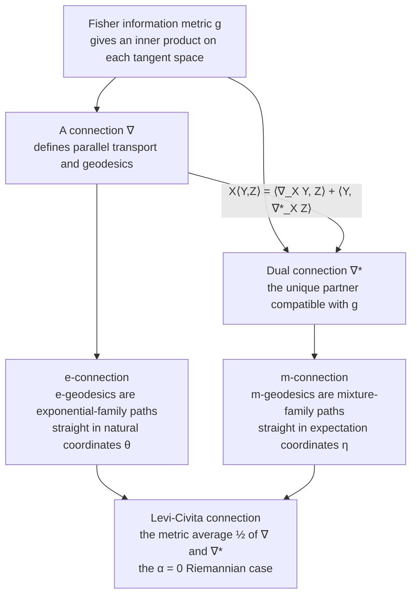

# 🔀 Dual Affine Connections

> [!abstract] TL;DR
> On an ordinary curved space the metric fixes a *single* notion of "straight line." Information geometry's central discovery (Amari) is that the manifold of probability distributions carries a **matched pair** of affine connections — the **exponential connection** $\nabla^{(e)}$ and the **mixture connection** $\nabla^{(m)}$ — that are mirror images of each other through the Fisher metric. This duality is what gives statistics its Pythagorean theorem, its dual coordinate systems, and its clean projection structure.

---

## Intuition

**Analogy.** Imagine a city built on a gently curved hillside. A pedestrian who only trusts the terrain has exactly one idea of "the straightest path between two corners" — the geodesic the landscape hands them. Now imagine the city is instead overlaid with **two independent grid systems**: a grid of *avenues* and a grid of *streets*, laid at reciprocal angles. A route can run dead-straight along the avenue grid while looking curved on the street grid, and vice versa. The two grids are not arbitrary — they are **locked together** so that a measurement taken in one always reconciles perfectly with a measurement taken in the other.

That is precisely the situation on a **statistical manifold**. The single "terrain geodesic" is the ordinary Riemannian (Levi-Civita) straight line. But the space of distributions comes with two extra, complementary notions of straightness: one that makes **exponential-family paths** straight (the $e$-connection) and one that makes **mixture paths** straight (the $m$-connection). Neither is "the" right answer; they are a **dual pair**, reflected into one another by the Fisher metric. The duality relation is the lock that ties the two grids together — and everything elegant in information geometry follows from it.

---

## How It Works

### Recap: what an affine connection gives you

A **metric** $g$ (here the [[Fisher_Information_and_the_Cramer_Rao_Bound|Fisher information]] metric) supplies an inner product $\langle X, Y\rangle_p = g_p(X,Y)$ on each tangent space — it measures lengths and angles between "directions of change" of a distribution. But a metric alone does not tell you how to **compare vectors at different points**. That is the job of an **affine connection** $\nabla$, which provides:

1. **Parallel transport** — a rule for sliding a tangent vector along a curve while keeping it "the same."
2. **Geodesics** — the curves $\gamma$ that transport their own velocity, $\nabla_{\dot\gamma}\dot\gamma = 0$ (the connection's notion of "straight").
3. **Flatness** — a coordinate system in which the connection coefficients vanish, so geodesics are literally straight lines in those coordinates.

Crucially, **a connection is extra structure, not determined by the metric.** A manifold admits infinitely many connections. Ordinary Riemannian geometry singles out one — the torsion-free, metric-compatible Levi-Civita connection — but statistics has a reason to keep more than one around.

### The dual (conjugate) connection

Given the metric $g$ and any connection $\nabla$, define its **dual** $\nabla^*$ by the **compatibility condition**

$$X\,\langle Y, Z\rangle \;=\; \langle \nabla_X Y,\, Z\rangle \;+\; \langle Y,\, \nabla^*_X Z\rangle .$$

Read this as a **product rule for the inner product**: when you differentiate $\langle Y, Z\rangle$ along $X$, one connection acts on the first slot and its dual acts on the second. Equivalently, and this is the punchline for transport:

> If you $\nabla$-parallel-transport a vector $Y$ and simultaneously $\nabla^*$-parallel-transport a vector $Z$ along the same curve, the inner product $\langle Y, Z\rangle$ **stays constant.**

So neither connection preserves the metric *by itself* — but the **pair jointly does.** The ordinary metric-compatible case is just the self-dual special case $\nabla = \nabla^*$.

### The canonical dual pair: $e$ and $m$

On a statistical manifold the Fisher metric distinguishes one such pair, generated by the two most natural ways to "mix" distributions:

- **Exponential connection $\nabla^{(e)}$.** Its geodesics ($e$-geodesics) are **log-linear** paths: $\log p(x;t) = (1-t)\log p_0(x) + t\log p_1(x) - \psi(t)$. These are exactly the paths that stay inside **exponential families**, straight in the **natural (canonical) parameters** $\theta$.
- **Mixture connection $\nabla^{(m)}$.** Its geodesics ($m$-geodesics) are **linear** mixtures: $p(x;t) = (1-t)\,p_0(x) + t\,p_1(x)$. These are the paths of **mixture families**, straight in the **expectation (mean) parameters** $\eta = \mathbb{E}[x]$.

These two are dual with respect to the Fisher metric: $\big(\nabla^{(e)}\big)^{*} = \nabla^{(m)}$. Their average is the metric one:

$$\nabla^{(0)} \;=\; \tfrac{1}{2}\big(\nabla^{(e)} + \nabla^{(m)}\big) \;=\; \text{Levi-Civita connection}.$$

This $\alpha = 0$ midpoint is the entry to a whole **one-parameter family** $\nabla^{(\alpha)} = \tfrac{1+\alpha}{2}\nabla^{(e)} + \tfrac{1-\alpha}{2}\nabla^{(m)}$ (the *alpha family of connections*, developed in the next note), with $e$ at $\alpha=+1$ and $m$ at $\alpha=-1$.



**Why keep two connections?** Because the pair unlocks the geometry statisticians actually want: **dual coordinate systems** ($\theta \leftrightarrow \eta$), the **generalized Pythagorean theorem** for the KL divergence, and **dual projections** (fitting a model by projecting the empirical distribution). When *both* $\nabla^{(e)}$ and $\nabla^{(m)}$ are flat — as they are for exponential families — the manifold is called **dually flat**, the setting where all of this becomes exact. Those three payoffs are the subjects of the following sibling notes (*Dually Flat Spaces* and *The Generalized Pythagorean Theorem*).

---

## Key Concepts

### Secondary (intuitive)
- **Two kinds of "straight."** Between two distributions there are two natural paths: the **mixture** (average the probabilities: $\tfrac12 p + \tfrac12 q$) and the **geometric/log-linear** blend (average the log-probabilities, then renormalize). These are generally **different curves** in probability space.
- **A connection = a rule for "same direction."** It lets you carry a direction-of-change from one distribution to another so you can compare them.
- **The pair is balanced.** One connection alone distorts lengths as you move; measuring with the connection *and its dual together* keeps everything consistent.

### Undergraduate
- **Affine connection $\nabla$.** Coordinate coefficients $\Gamma^{k}_{ij}$; geodesic equation $\ddot\gamma^k + \Gamma^k_{ij}\dot\gamma^i\dot\gamma^j = 0$; flat $\iff$ coordinates exist with $\Gamma \equiv 0$.
- **Dual connection.** Defined by $X\langle Y,Z\rangle = \langle\nabla_X Y,Z\rangle + \langle Y,\nabla^*_X Z\rangle$. In coordinates the dual Christoffel symbols satisfy $\partial_k g_{ij} = \Gamma_{ki,j} + \Gamma^{*}_{kj,i}$.
- **$e$- and $m$-geodesics.** $e$: straight line in natural params $\theta$; $m$: straight line in expectation params $\eta$. For exponential families $\theta$ and $\eta$ are related by the Legendre transform of the log-partition function $\psi(\theta)$, i.e. $\eta = \nabla\psi(\theta)$.
- **Levi-Civita = the average.** $\nabla^{(0)} = \tfrac12(\nabla^{(e)}+\nabla^{(m)})$ recovers the ordinary Riemannian connection of the Fisher metric.

### Graduate
- **$\alpha$-connections.** $\Gamma^{(\alpha)}_{ij,k} = \mathbb{E}\!\big[(\partial_i\partial_j \ell)(\partial_k \ell)\big] + \tfrac{1-\alpha}{2}\,\mathbb{E}\!\big[(\partial_i\ell)(\partial_j\ell)(\partial_k\ell)\big]$, where $\ell = \log p(x;\theta)$; the last term is the **Amari–Chentsov cubic tensor** $T_{ijk}$. Duality is $\big(\nabla^{(\alpha)}\big)^{*} = \nabla^{(-\alpha)}$, so $e\,(\alpha{=}1)$ and $m\,(\alpha{=}{-}1)$ are dual and $\alpha{=}0$ is self-dual.
- **Chentsov's theorem.** Up to scale, the Fisher metric is the *unique* metric invariant under sufficient statistics, and the $\alpha$-connections are the unique invariant family — the duality is not a convenience, it is forced by the requirement of statistical invariance.
- **Divergence view.** A convex potential $\psi$ and its Legendre dual $\varphi$ generate a **canonical divergence** (the Bregman divergence, here the KL divergence) whose Hessians give the metric and whose flat coordinates are exactly $\theta$ and $\eta$. Dual flatness $\iff$ existence of such a pair of biorthogonal affine charts.

---

## Python Demo

```python
# Dual affine connections on the categorical statistical manifold.
# Family: categorical distributions p = (p1, p2, p3) on the 2-simplex.
#   * m-geodesic (mixture connection):  straight line in expectation params eta
#         -> ARITHMETIC mixture   r(t) = (1-t) p + t q
#   * e-geodesic (exponential connection): straight line in natural params theta
#         -> NORMALIZED GEOMETRIC mean   r_i(t) ~ p_i^(1-t) * q_i^t
# We show (a) the two dual geodesics are DIFFERENT curves in probability space,
# and (b) the duality relation: e-transport of one vector and m-transport of
# another preserves their metric inner product, even though a single connection
# does NOT preserve length by itself.
import numpy as np
import matplotlib.pyplot as plt

# two endpoint distributions on 3 outcomes
p = np.array([0.70, 0.20, 0.10])
q = np.array([0.10, 0.30, 0.60])
ts = np.linspace(0.0, 1.0, 101)

# m-geodesic: arithmetic mixture (straight in eta coordinates)
m_geo = np.array([(1 - t) * p + t * q for t in ts])

# e-geodesic: normalized geometric interpolation (straight in theta coordinates)
def e_interp(p, q, t):
    r = (p ** (1 - t)) * (q ** t)
    return r / r.sum()
e_geo = np.array([e_interp(p, q, t) for t in ts])

# map 3-category probabilities to a 2D triangle (barycentric coordinates)
A, B, C = np.array([0.0, 0.0]), np.array([1.0, 0.0]), np.array([0.5, np.sqrt(3) / 2])
def bary(P):
    return P[:, [0]] * A + P[:, [1]] * B + P[:, [2]] * C
m_xy, e_xy = bary(m_geo), bary(e_geo)
p_xy, q_xy = bary(p[None]) [0], bary(q[None])[0]

# ------------------------------------------------------------------
# Duality check.  Fisher metric in natural coords for the categorical
# (free components 1..k-1):   G_theta = diag(p_free) - p_free p_free^T
# a  = constant theta-components  -> vector e-transported by nabla^(e)
# b  = constant eta-components    -> vector m-transported by nabla^(m)
# ------------------------------------------------------------------
a = np.array([1.0, 0.5])
b = np.array([0.4, -0.9])
e_self, dual_pair = [], []
for r in e_geo:                      # sample points along a curve
    pf = r[:2]                       # free components (p1, p2)
    G = np.diag(pf) - np.outer(pf, pf)          # Fisher metric in theta coords
    Ginv = np.linalg.inv(G)
    e_self.append(a @ G @ a)                    # single-connection "length": VARIES
    dual_pair.append(a @ G @ (Ginv @ b))        # <e-transport, m-transport>: CONSTANT
e_self, dual_pair = np.array(e_self), np.array(dual_pair)

print(f"a^T G a  (single e-connection): varies {e_self.min():.4f} .. {e_self.max():.4f}")
print(f"<e-transport, m-transport>   : constant {dual_pair.mean():.6f}"
      f"  (spread {np.ptp(dual_pair):.2e},  a.b = {a @ b:.4f})")

# ------------------------------------------------------------------
fig, (ax1, ax2) = plt.subplots(1, 2, figsize=(12, 5))
tri = np.array([A, B, C, A])
ax1.plot(tri[:, 0], tri[:, 1], 'k-', lw=1)
ax1.plot(m_xy[:, 0], m_xy[:, 1], color='tab:blue', lw=2.5, label='m-geodesic  (mixture)')
ax1.plot(e_xy[:, 0], e_xy[:, 1], color='tab:red',  lw=2.5, label='e-geodesic  (exponential)')
for xy, lab in [(p_xy, ' p'), (q_xy, ' q')]:
    ax1.scatter(*xy, color='k', zorder=5); ax1.annotate(lab, xy)
ax1.set_title('Two dual geodesics on the probability simplex')
ax1.legend(loc='upper center'); ax1.set_aspect('equal'); ax1.axis('off')

ax2.plot(ts, e_self,    color='tab:red',   label='a$^T$G a  (single connection: NOT preserved)')
ax2.plot(ts, dual_pair, color='tab:green', lw=2.5, label='dual pairing  (jointly preserved)')
ax2.set_xlabel('t along curve'); ax2.set_ylabel('metric inner product')
ax2.set_title('Duality preserves the metric jointly, not singly')
ax2.legend(loc='center right')
plt.tight_layout()
plt.savefig('dual_connections.png', dpi=110)
plt.show()
```

**What you see.** The blue $m$-geodesic and the red $e$-geodesic connect the *same* two distributions $p$ and $q$ yet bow away from each other — the mixture path is the arithmetic average of probabilities, the exponential path is the normalized geometric average of them. In the right panel, the "length" of a single $e$-transported vector, $a^{\top}G\,a$, drifts as we move (a lone connection is **not** metric-compatible), while the **dual pairing** $\langle e\text{-transport}, m\text{-transport}\rangle$ stays flat — the numerical signature of the compatibility condition.

---

## Real-World Applications

> **Example — the EM algorithm as alternating dual projections.** Amari showed that Expectation–Maximization on a latent-variable model is exactly an **$e$-projection** onto the model manifold followed by an **$m$-projection** onto the data manifold, alternating. The two half-steps use the two dual connections; convergence and the geometry of local optima fall directly out of the dual-flatness picture.

- **Natural gradient descent (Amari).** Optimization that follows $e$-straight/$m$-straight directions using the Fisher metric converges faster and is reparameterization-invariant; it underlies natural-gradient and K-FAC training of neural networks and policy-gradient methods in reinforcement learning.
- **Boltzmann machines and exponential-family models.** Learning is an $m$-projection of the empirical distribution onto the $e$-flat model; the log-likelihood gap is a KL divergence measured along dual geodesics.
- **MaxEnt / graphical-model inference.** Fitting a [[Maximum_Entropy_and_Exponential_Families|maximum-entropy exponential family]] to moment constraints is an intersection of an $e$-flat model surface and an $m$-flat constraint surface — a dual-geodesic projection problem.
- **Statistical hypothesis testing and information projections.** The $e$- and $m$-projections formalize likelihood-ratio geometry and the "information projection" used in large-deviation and Sanov-type arguments.

---

## Common Pitfalls

- **Connection ≠ metric.** The Fisher metric measures lengths *at a point*; a connection tells you how to *move* vectors between points. A manifold has one metric here but a whole family of admissible connections — do not conflate "the geometry" with "the metric."
- **Neither dual connection is metric-compatible on its own.** $\nabla^{(e)}$-transport and $\nabla^{(m)}$-transport each distort inner products; only the **pair jointly** preserves $\langle\cdot,\cdot\rangle$. Expecting $\nabla^{(e)} g = 0$ is the classic mistake (that holds only for $\alpha=0$).
- **Mixing up $e$ and $m$ interpolation.** The $e$-geodesic averages **log**-densities (geometric mean, straight in $\theta$); the $m$-geodesic averages **densities** (arithmetic mean, straight in $\eta$). They coincide only at the endpoints, and picking the wrong one silently changes what "halfway between two distributions" means.
- **Forgetting the Levi-Civita connection is the *average*, not one of the pair.** The ordinary Riemannian geodesic $\nabla^{(0)} = \tfrac12(\nabla^{(e)}+\nabla^{(m)})$ is $\alpha=0$; it is generally **neither** $e$-straight **nor** $m$-straight, which is exactly why the dual pair (not the Levi-Civita connection) drives the Pythagorean and projection theorems.
- **Assuming flatness comes for free.** Both $\nabla^{(e)}$ and $\nabla^{(m)}$ are flat (the manifold is *dually flat*) for exponential and mixture families, but **not** for arbitrary curved sub-models — outside those families you keep the duality but lose the exact global coordinate charts.

---

## Related Concepts

- [[Fisher_Information_and_the_Cramer_Rao_Bound]] — the Fisher information *is* the metric $g$ with respect to which the dual pair is defined; duality is meaningless without it.
- [[Maximum_Entropy_and_Exponential_Families]] — exponential families are the $e$-flat manifolds; their natural parameters are the $e$-affine coordinates in which $e$-geodesics are literally straight lines.
- [[Relative_Entropy_and_Cross_Entropy]] — the KL divergence is the *canonical divergence* generated by the dual pair; its two arguments correspond to the $e$- and $m$-directions and it powers the generalized Pythagorean theorem.
- [[Mathematics/14_Advanced_Topics/Differential_Geometry|Differential Geometry]] — supplies the machinery (connections, parallel transport, geodesics, curvature) that information geometry specializes to statistical manifolds.
- [[Inner_Product_Spaces]] — the metric is a smoothly varying inner product on tangent spaces; the compatibility condition $X\langle Y,Z\rangle = \langle\nabla_X Y,Z\rangle + \langle Y,\nabla^*_X Z\rangle$ is a bilinear-form identity built on it.
- [[Introduction_to_General_Relativity]] — physics uses the *self-dual* metric-compatible Levi-Civita connection ($\alpha=0$); comparing it to the $e$/$m$ pair sharpens why statistics needs the extra structure.

*Section siblings (forthcoming in this vault, referenced in prose):* **The Alpha Family of Connections**, **Dually Flat Spaces**, **The Generalized Pythagorean Theorem**, **Riemannian Geometry Primer for Statistics**, and **Exponential Families and Their Geometry**.

---

## Review Questions

1. **(Secondary)** Between the distributions $p = (0.8, 0.2)$ and $q = (0.2, 0.8)$, describe in words the mixture ($m$-) path and the log-linear ($e$-) path. Why are they different curves even though they share both endpoints?
2. **(Undergraduate)** Starting from the compatibility condition $X\langle Y,Z\rangle = \langle\nabla_X Y, Z\rangle + \langle Y, \nabla^*_X Z\rangle$, argue that parallel-transporting $Y$ by $\nabla$ and $Z$ by $\nabla^*$ along a curve keeps $\langle Y, Z\rangle$ constant. What is special about the case $\nabla = \nabla^*$?
3. **(Graduate)** You must "average" two Gaussians $N(\mu_0,\sigma_0^2)$ and $N(\mu_1,\sigma_1^2)$ at $t=\tfrac12$. Compute the $m$-geodesic midpoint and the $e$-geodesic midpoint, show they generally differ, and explain which one the Levi-Civita ($\alpha=0$) geodesic would give and why it is neither.

---

## Sources

- Amari, S. & Nagaoka, H. (2000). *Methods of Information Geometry.* AMS / Oxford University Press. — Ch. 3 develops dual connections, the $\alpha$-family, and dual flatness.
- Amari, S. (2016). *Information Geometry and Its Applications.* Springer. [DOI](https://doi.org/10.1007/978-4-431-55978-8)
- Nielsen, F. (2020). *An Elementary Introduction to Information Geometry.* Entropy 22(10):1100. [arXiv:1808.08271](https://arxiv.org/abs/1808.08271)
- Ay, N., Jost, J., Lê, H. V. & Schwachhöfer, L. (2017). *Information Geometry.* Springer. [DOI](https://doi.org/10.1007/978-3-319-56478-4)

---

#information-geometry #dual-connections #e-connection #m-connection #duality
