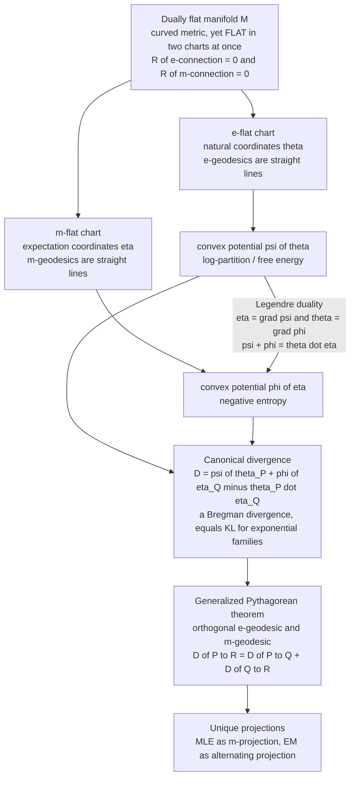

# 🪞 Dually Flat Spaces

> [!abstract] TL;DR
> A **dually flat space** is the ideal habitat of information geometry: a manifold that is *curved* in the ordinary (Riemannian) sense yet **flat in two dual coordinate systems at once**. Both of Amari's dual connections — the **exponential ($e$-) connection** and the **mixture ($m$-) connection** — have zero curvature, so the space carries **two affine charts** (natural parameters $\theta$ and expectation parameters $\eta$) linked by a **Legendre transform** of two convex potentials $\psi$ and $\varphi$. Out of this structure falls a **canonical divergence** — the **Bregman divergence** of $\psi$, which *is* the KL divergence for exponential families — together with a **generalized Pythagorean theorem** that turns projection, EM, and maximum likelihood into straight-line geometry. Exponential and mixture families are the canonical dually flat manifolds, and essentially every clean, closed-form result in information geometry lives here.

---

## Intuition

**Analogy — one curved landscape seen as perfectly flat through two different pairs of glasses.** Imagine a hilly terrain that, by every ordinary measurement, is genuinely curved. Now you are handed two pairs of magic glasses. Put on the **"exponential" glasses** and something remarkable happens: every path in a certain natural family straightens out into a perfect ruler-straight line — the terrain *looks* flat. Take them off, put on the **"mixture" glasses**, and a *different* family of paths — the ones that were curvy before — now snap perfectly straight, while the first family bends. Neither pair is lying; the landscape really does look flat through each, just about *different* straight lines. A **dually flat space** is exactly this magical structure: one curved manifold that is simultaneously flat in *two* coordinate systems, each with its own notion of "straight."

Why care? Because in a space that is flat in two dual ways, the hardest problems in statistics collapse into high-school geometry. A right triangle obeys a **Pythagorean theorem** (in divergences, not squared distances), so a "closest point" **projection is unique** and can be found by dropping a perpendicular. Maximum likelihood becomes *dropping the empirical distribution onto the model along a straight mixture line*. The EM algorithm becomes *alternately straightening along one pair of glasses, then the other*. Curved, hard, coordinate-tangled statistics becomes flat, easy, coordinate-free geometry — which is why the whole field organizes itself around finding the dually flat structure hiding inside a model.

---

## How It Works

### Core Mechanics

A dually flat space is built by demanding that **both** dual connections be flat at the same time. Concretely:

1. **Start from a statistical manifold with a metric and dual connections.** Take a family of distributions (see [[Statistical_Manifolds]]) equipped with the Fisher metric $g$ and Amari's pair of dual connections $\nabla^{(e)}$ (exponential) and $\nabla^{(m)}$ (mixture). Duality means $\nabla^{(e)}$ and $\nabla^{(m)}$ jointly preserve the Fisher inner product under parallel transport.

2. **Demand double flatness.** The space is **dually flat** when *both* connections have **zero curvature**: $R^{(e)} = 0$ and $R^{(m)} = 0$. Flatness of a connection means a **global affine coordinate system** exists in which its geodesics are literal straight lines. So double flatness gives **two** such charts.

3. **Two dual affine coordinate systems.** The $e$-flat chart is the **natural (canonical) parameters** $\theta$; the $m$-flat chart is the **expectation (mean) parameters** $\eta$. For an exponential family $p(x;\theta) = \exp\!\big(\theta\cdot T(x) - \psi(\theta)\big)$, these are precisely the natural parameters $\theta$ and the mean parameters $\eta = \mathbb{E}_\theta[T(x)]$.

4. **Legendre duality links the charts.** A convex **potential** $\psi(\theta)$ (the log-partition / cumulant function, the same free-energy object as in [[Partition_Functions_and_Free_Energy_in_ML]]) generates the map $\eta = \nabla\psi(\theta)$. Its **Legendre transform** $\varphi(\eta) = \sup_\theta\{\theta\cdot\eta - \psi(\theta)\}$ is the dual convex potential (the negative entropy), generating the inverse map $\theta = \nabla\varphi(\eta)$. At dual points the two potentials satisfy the **Legendre identity** $\psi(\theta) + \varphi(\eta) = \theta\cdot\eta$.

5. **The canonical divergence emerges.** The gap in that identity when $\theta$ and $\eta$ come from *different* points defines the **canonical divergence**
$$
D(P\,\|\,Q) \;=\; \psi(\theta_P) + \varphi(\eta_Q) - \theta_P\cdot\eta_Q .
$$
This is exactly the **Bregman divergence** generated by the convex $\psi$, and for exponential families it **coincides with the Kullback–Leibler divergence** between the two distributions.

6. **Straight lines in each chart are dual geodesics.** An **$e$-geodesic** is a straight line in $\theta$ (a geometric/exponential interpolation $p_t \propto p_P^{1-t}p_Q^{t}$); an **$m$-geodesic** is a straight line in $\eta$ (a linear mixture $p_t = (1-t)p_P + t\,p_Q$). Where an $m$-geodesic meets an $e$-geodesic **at a Fisher-orthogonal angle**, the canonical divergences add — the **generalized Pythagorean theorem** — the payoff that makes projection and inference clean.

The deep equivalence to remember: **convex function $\psi$ $\Leftrightarrow$ Bregman divergence $D_\psi$ $\Leftrightarrow$ dually flat structure.** Any one of these three objects determines the other two.

### Flow / Architecture



---

## Key Concepts

### 🟢 Secondary — the two-glasses picture

- **Flat in two ways at once.** A dually flat space is one curved landscape that looks perfectly *straight* through two different pairs of glasses — each straightening a different family of paths.
- **Two coordinate systems, not one.** Instead of a single grid on the map, a dually flat space naturally comes with **two** grids ($\theta$ and $\eta$) that are mirror images of each other.
- **Straight-line problems.** Once the map is flat, "find the closest distribution" becomes "drop a perpendicular" — a right-triangle problem — instead of a hard search.

### 🟡 Undergraduate — dual charts, Legendre, canonical divergence

- **Natural vs. expectation parameters.** For an exponential family, $\theta$ (natural) and $\eta = \mathbb{E}_\theta[T]$ (expectation) are the two affine charts. They describe the same distributions but flatten different geodesics (see [[Maximum_Entropy_and_Exponential_Families]]).
- **Legendre duality.** The convex log-partition $\psi(\theta)$ and its convex conjugate $\varphi(\eta)$ (negative entropy) are related by $\eta = \nabla\psi(\theta)$, $\theta = \nabla\varphi(\eta)$, and $\psi + \varphi = \theta\cdot\eta$ at dual points — the same Legendre machinery as convex-optimization duality (see [[Duality_Theory]], [[Convex_Functions]]).
- **Canonical divergence.** $D(P\|Q) = \psi(\theta_P) + \varphi(\eta_Q) - \theta_P\cdot\eta_Q \ge 0$, zero iff $P = Q$. It is asymmetric — a *divergence*, not a distance — and equals the KL divergence for exponential families (see [[Relative_Entropy_and_Cross_Entropy]]).
- **Dual geodesics.** $e$-geodesic = straight line in $\theta$ = geometric mixture of distributions; $m$-geodesic = straight line in $\eta$ = arithmetic mixture. Between the same two points these are usually *different* curves.

### 🔴 Graduate — the deep equivalence

- **Double flatness and torsion-freeness.** $(M, g, \nabla^{(e)}, \nabla^{(m)})$ is dually flat iff both connections are flat and torsion-free; then $M$ admits biorthogonal affine coordinates $(\theta_i, \eta^j)$ with $\partial_i\eta^j = \delta_i^j$ and metric $g_{ij} = \partial_i\partial_j\psi = (\partial^i\partial^j\varphi)^{-1}$ — the potentials are the metric's convex generators. Note $\nabla^{(0)}$ (Levi-Civita) need **not** be flat.
- **Bregman $\Leftrightarrow$ convex $\Leftrightarrow$ dually flat.** Every dually flat manifold is a **Bregman manifold**: fix a strictly convex $\psi$ on a convex domain and you get the Hessian metric $\nabla^2\psi$, dual coordinates $\nabla\psi$, and the canonical Bregman divergence $D_\psi(\theta_P\!:\!\theta_Q) = \psi(\theta_P) - \psi(\theta_Q) - \nabla\psi(\theta_Q)\cdot(\theta_P - \theta_Q)$. Conversely every Bregman divergence induces a dually flat geometry.
- **Generalized Pythagorean theorem.** If the $m$-geodesic $P\!\to\!Q$ is $g$-orthogonal to the $e$-geodesic $Q\!\to\!R$ at $Q$, then $D(P\|R) = D(P\|Q) + D(Q\|R)$ exactly. This gives **unique projections**: the $m$-projection of $P$ onto an $e$-flat submanifold (and vice versa) is unique and characterized by orthogonality.
- **KL as the exponential-family case.** With $\psi$ the cumulant function, the canonical/Bregman divergence equals KL; the MLE is the $m$-projection of the empirical distribution onto the model, and EM alternates $e$- and $m$-projections between data and model manifolds.
- **Direction convention.** With the indexing $D(P\|Q) = \psi(\theta_P) + \varphi(\eta_Q) - \theta_P\cdot\eta_Q$ one gets $D(P\|Q) = \mathrm{KL}(p_Q \,\|\, p_P)$ — a routine source of sign/direction confusion; always pin down which argument sits in the $\theta$ slot.

---

## Python Demo

We make dual flatness concrete on the **categorical family over 3 outcomes** — a 2-dimensional dually flat manifold sitting on the probability simplex. Part **(a)** displays the two dual affine charts (natural $\theta$ and expectation $\eta$) and the Legendre-dual potentials $\psi$ (log-partition) and $\varphi$ (negative entropy), then verifies numerically that the **canonical divergence** $D(P\|Q)=\psi(\theta_P)+\varphi(\eta_Q)-\theta_P\cdot\eta_Q$ equals the **KL divergence**. Part **(b)** draws an **$e$-geodesic** and an **$m$-geodesic** between the same two points and shows each is a *straight line only in its own chart* — the visual signature of a doubly flat space.

```python
import numpy as np
import matplotlib.pyplot as plt

# ============================================================
# Dually flat geometry of the categorical family on 3 outcomes.
# A distribution p = (p1, p2, p3), p3 = 1 - p1 - p2, lives on the
# 2-simplex -> a 2D dually flat manifold with TWO affine charts:
#   e-flat  NATURAL     coords  theta = ( log(p1/p3), log(p2/p3) )
#   m-flat  EXPECTATION coords  eta   = ( p1, p2 )
# linked by Legendre duality of potentials
#   psi(theta) = log-partition (convex)     eta = grad psi
#   phi(eta)   = negative entropy (convex)  theta = grad phi
# ============================================================

def eta_to_theta(eta):                 # expectation (m) -> natural (e)
    p1, p2 = eta; p3 = 1.0 - p1 - p2
    return np.array([np.log(p1 / p3), np.log(p2 / p3)])

def theta_to_eta(theta):               # natural (e) -> expectation (m)
    t1, t2 = theta
    Z = 1.0 + np.exp(t1) + np.exp(t2)
    return np.array([np.exp(t1) / Z, np.exp(t2) / Z])

def psi(theta):                        # e-flat potential (log-partition), convex
    t1, t2 = theta
    return np.log(1.0 + np.exp(t1) + np.exp(t2))

def phi(eta):                          # m-flat potential (negative entropy), convex
    p1, p2 = eta; p3 = 1.0 - p1 - p2
    p = np.array([p1, p2, p3])
    return np.sum(p * np.log(p))

def canonical_divergence(P_eta, Q_eta):     # D(P||Q) = psi(theta_P)+phi(eta_Q)-theta_P.eta_Q
    theta_P = eta_to_theta(P_eta)
    return psi(theta_P) + phi(Q_eta) - theta_P @ Q_eta

def kl(A_eta, B_eta):                        # KL( p_A || p_B ), computed directly
    a = np.array([A_eta[0], A_eta[1], 1 - A_eta[0] - A_eta[1]])
    b = np.array([B_eta[0], B_eta[1], 1 - B_eta[0] - B_eta[1]])
    return np.sum(a * np.log(a / b))

# ---- (a) Legendre identity + canonical divergence == KL ---------------------
pairs = [(np.array([0.50, 0.30]), np.array([0.20, 0.20])),
         (np.array([0.10, 0.60]), np.array([0.40, 0.40])),
         (np.array([0.33, 0.33]), np.array([0.70, 0.10]))]

print("Legendre identity  psi(theta) + phi(eta) - theta . eta   (== 0 at dual points):")
for P, _ in pairs:
    th = eta_to_theta(P)
    print(f"  eta = {P},  gap = {psi(th) + phi(P) - th @ P: .2e}")

print("\nCanonical divergence  vs  KL divergence:")
print(f"{'D_canonical(P||Q)':>20}{'KL(p_Q||p_P)':>16}{'abs diff':>12}")
for P, Q in pairs:
    D = canonical_divergence(P, Q)
    K = kl(Q, P)                     # index convention: D(P||Q) = KL(p_Q || p_P)
    print(f"{D:20.6f}{K:16.6f}{abs(D - K):12.2e}")

# ---- (b) e-geodesic straight in theta, m-geodesic straight in eta -----------
P_eta = np.array([0.70, 0.15])
Q_eta = np.array([0.12, 0.72])
P_th, Q_th = eta_to_theta(P_eta), eta_to_theta(Q_eta)
t = np.linspace(0.0, 1.0, 80)

# m-geodesic: STRAIGHT LINE in eta (arithmetic mixture of distributions)
m_eta = np.array([(1 - tt) * P_eta + tt * Q_eta for tt in t])
m_th  = np.array([eta_to_theta(e) for e in m_eta])      # its image in theta -> curved

# e-geodesic: STRAIGHT LINE in theta (geometric / exponential mixture)
e_th  = np.array([(1 - tt) * P_th + tt * Q_th for tt in t])
e_eta = np.array([theta_to_eta(th) for th in e_th])     # its image in eta -> curved

fig, (axL, axR) = plt.subplots(1, 2, figsize=(13, 5.6))

# LEFT: m-flat chart (expectation eta) -- the m-geodesic is straight here
axL.plot([0, 1, 0, 0], [0, 0, 1, 0], color="gray", lw=0.8)       # simplex boundary
axL.plot(m_eta[:, 0], m_eta[:, 1], color="#059669", lw=2.8,
         label="m-geodesic  (STRAIGHT in eta)")
axL.plot(e_eta[:, 0], e_eta[:, 1], color="#2563eb", lw=2.0, ls="--",
         label="e-geodesic  (curved in eta)")
for pt, name in [(P_eta, "P"), (Q_eta, "Q")]:
    axL.plot(*pt, 'o', color="#111", ms=7)
    axL.annotate(name, pt, textcoords="offset points", xytext=(8, 6), fontsize=11)
axL.set_xlabel("eta_1 = p1"); axL.set_ylabel("eta_2 = p2")
axL.set_title("m-flat chart: EXPECTATION coordinates eta")
axL.legend(fontsize=8); axL.set_aspect("equal"); axL.grid(alpha=0.3)

# RIGHT: e-flat chart (natural theta) -- the e-geodesic is straight here
axR.plot(e_th[:, 0], e_th[:, 1], color="#2563eb", lw=2.8,
         label="e-geodesic  (STRAIGHT in theta)")
axR.plot(m_th[:, 0], m_th[:, 1], color="#059669", lw=2.0, ls="--",
         label="m-geodesic  (curved in theta)")
for pt, name in [(P_th, "P"), (Q_th, "Q")]:
    axR.plot(*pt, 'o', color="#111", ms=7)
    axR.annotate(name, pt, textcoords="offset points", xytext=(8, 6), fontsize=11)
axR.set_xlabel("theta_1 = log(p1/p3)"); axR.set_ylabel("theta_2 = log(p2/p3)")
axR.set_title("e-flat chart: NATURAL coordinates theta")
axR.legend(fontsize=8); axR.grid(alpha=0.3)

plt.tight_layout()
plt.savefig("dually_flat_geodesics.png", dpi=120)
print("\nSaved dually_flat_geodesics.png")
```

Reading the output: the **Legendre gaps are ~1e-16** (machine zero), confirming $\psi + \varphi = \theta\cdot\eta$ at dual points; the **canonical divergence matches the KL divergence to ~1e-16** for every pair, confirming $D$ is exactly the Bregman-divergence-as-KL. In the figure, the green $m$-geodesic is a *ruler-straight* line in the left ($\eta$) panel but *bends* in the right ($\theta$) panel; the blue $e$-geodesic is *straight* in the right ($\theta$) panel but *bends* in the left ($\eta$) panel. Same two endpoints, two different "straights" — the manifold is flat through both pairs of glasses at once.

---

## Real-World Applications

- **Maximum-likelihood estimation as projection.** Fitting an exponential family is an **$m$-projection** of the empirical distribution onto the $e$-flat model manifold; dual flatness guarantees the projection is *unique* and solvable by matching sufficient statistics ($\hat\eta = $ empirical mean of $T$).
- **The EM algorithm.** For latent-variable models, EM is provably an **alternating projection** — an $e$-step and an $m$-step — between the data manifold and the model manifold, with the generalized Pythagorean theorem giving its monotone-improvement guarantee.
- **Variational inference and free energy.** Minimizing variational free energy is minimizing a canonical (KL) divergence over a dually flat family; mean-field VI is an $m$-projection onto a factorized $e$-flat submanifold (see [[Partition_Functions_and_Free_Energy_in_ML]]).
- **Mirror descent and natural gradient in ML.** Mirror descent uses a Bregman divergence as its proximity term; its "mirror map" is exactly the Legendre map $\theta \leftrightarrow \eta$ of a dually flat space, which is why exponentiated-gradient and softmax updates are so natural.
- **Boosting and clustering.** AdaBoost is an $e$-projection sequence in a dually flat space of distributions; Bregman $k$-means generalizes Lloyd's algorithm to any dually flat geometry, with the centroid = the $\eta$-mean.
- **Thermodynamics and MaxEnt physics.** The $\theta\leftrightarrow\eta$ / $\psi\leftrightarrow\varphi$ duality *is* the Legendre duality between free energy and entropy; equilibrium statistical mechanics is a dually flat space with the partition function as $\psi$.

---

## Common Pitfalls

- **"Dually flat" ≠ "Riemannian (metrically) flat."** Zero curvature of the $e$- and $m$-connections does **not** imply zero curvature of the Levi-Civita ($\alpha=0$) connection. The Gaussian family is dually flat yet metrically **hyperbolic**. Dual flatness is about two *affine* structures, not the metric one.
- **Two flat coordinate systems, not one.** A dually flat space is not "just flat." It has **two** dual affine charts ($\theta$ and $\eta$); a curve straight in one is generally *curved* in the other. Reporting a single "geodesic" is ambiguous — always say $e$- or $m$-geodesic.
- **The canonical divergence is a Bregman divergence — hence asymmetric.** $D(P\|Q) \ne D(Q\|P)$ in general, and it violates the triangle inequality. It behaves like a *squared* distance only infinitesimally (its Hessian is the Fisher metric). Do not treat it as a metric or symmetrize it carelessly.
- **Direction/index confusion.** With $D(P\|Q) = \psi(\theta_P) + \varphi(\eta_Q) - \theta_P\cdot\eta_Q$ you actually get $\mathrm{KL}(p_Q\|p_P)$. Different textbooks swap the roles of $P$ and $Q$; pin down which point supplies $\theta$ and which supplies $\eta$ before trusting a formula.
- **Boundary and steepness (essential smoothness).** The Legendre duality is clean only where $\psi$ is **steep** and the point is in the *interior* of the parameter domain. On the simplex boundary (some $p_k = 0$) the natural parameter $\theta \to \pm\infty$, $\varphi$'s gradient blows up, and $\eta = \nabla\psi$ stops being a bijection — the dually flat coordinates degenerate exactly where distributions become deterministic.
- **Assuming every model is dually flat.** Only **exponential families (e-flat)** and **mixture families (m-flat)** are fully flat. A generic curved model is *not* dually flat; it inherits the ambient dual-flat structure only as a curved submanifold, and its embedding curvature is what governs second-order estimation efficiency.

---

## Related Concepts

- [[Statistical_Manifolds]] — the underlying object; a dually flat space is a statistical manifold whose two dual connections both happen to be flat.
- [[Information_Geometry_Overview]] — situates dual flatness as the central, most tractable structure in the field's four-layer stack.
- [[Maximum_Entropy_and_Exponential_Families]] — exponential families are *the* canonical $e$-flat manifolds; their natural and mean parameters are the two dual charts used here.
- [[Relative_Entropy_and_Cross_Entropy]] — the KL divergence *is* the canonical (Bregman) divergence of the log-partition potential on this space.
- [[Partition_Functions_and_Free_Energy_in_ML]] — the log-partition function is the convex potential $\psi$; free-energy/entropy duality is precisely the $\psi\leftrightarrow\varphi$ Legendre pair.
- [[Fisher_Information_and_the_Cramer_Rao_Bound]] — the Fisher metric equals the Hessian $\nabla^2\psi$ of the potential, tying the metric to the dual-flat convex structure.
- [[Convex_Functions]] — strict convexity of $\psi$ is what makes the Legendre map a bijection and the Bregman divergence non-negative.
- [[Duality_Theory]] — the Legendre–Fenchel transform linking $\theta$ and $\eta$ is the same convex-duality machinery used in optimization.
- [[Convex_Sets]] — the expectation-parameter domain (e.g. the marginal polytope / simplex interior) is a convex set; its boundary is where dual flatness degenerates.
- [[Differential_Geometry]] — supplies flat connections, affine coordinates, geodesics, and curvature, which dual flatness specializes to two connections at once.
- [[Partial_Derivatives]] — the dual maps $\eta = \nabla\psi$ and $\theta = \nabla\varphi$ and the metric $g_{ij} = \partial_i\partial_j\psi$ are built from partial derivatives of the potentials.

*Sibling notes in this vault (in prose; forthcoming): **Dual Affine Connections** define the $e$- and $m$-connections whose joint flatness this note assumes; **Legendre Transform and Convex Duality** develops the $\psi\leftrightarrow\varphi$ conjugacy in full; **Bregman Divergences** is the general convex-function view of the canonical divergence; **The Generalized Pythagorean Theorem** proves the orthogonality/additivity result foreshadowed here; and **Exponential Families and Their Geometry** shows why exponential and mixture families are the canonical dually flat manifolds.*

---

## Review Questions

### 🟢 Secondary
1. Using the two-pairs-of-glasses analogy, explain what it means for a single curved space to be "flat in two different ways at once," and why that would make a "find the closest distribution" problem easier.

### 🟡 Undergraduate
2. Given an exponential family with log-partition $\psi(\theta)$, define the expectation parameter $\eta$ and the dual potential $\varphi(\eta)$, and state the Legendre identity relating $\psi$, $\varphi$, $\theta$, and $\eta$. Why must $\psi$ be strictly convex for this to work?
3. You are handed two distributions $P$ and $Q$ from the same exponential family and asked to interpolate between them. Contrast the $e$-geodesic and the $m$-geodesic: what is each in terms of the raw densities, and in which coordinate system is each a straight line?

### 🔴 Graduate
4. Prove (or sketch) that the canonical divergence $D(P\|Q) = \psi(\theta_P) + \varphi(\eta_Q) - \theta_P\cdot\eta_Q$ equals the Bregman divergence $B_\psi$ and, for an exponential family, the KL divergence — being explicit about which direction of KL you obtain and why.
5. Explain how the generalized Pythagorean theorem makes the maximum-likelihood estimate an $m$-projection onto the model manifold, why that projection is unique, and where this argument breaks down for a *curved* exponential family that is not itself dually flat.

---

## Sources

- Amari, S. & Nagaoka, H. — *Methods of Information Geometry* (AMS/Oxford, 2000). Chapters 3–4 develop dual connections, dual flatness, canonical divergence, and the Pythagorean theorem.
- Amari, S. — *Information Geometry and Its Applications* (Springer, 2016). Chapters 1–6: dually flat spaces, Legendre duality, Bregman divergences, and applications to ML and optimization.
- Nielsen, F. — ["An Elementary Introduction to Information Geometry"](https://www.mdpi.com/1099-4300/22/10/1100), *Entropy* 22(10):1100 (2020). Clear modern treatment of dual coordinates, convex conjugacy, and canonical divergences.
- Wainwright, M. J. & Jordan, M. I. — *Graphical Models, Exponential Families, and Variational Inference* (Foundations and Trends in ML, 2008). The exponential-family $\theta\leftrightarrow\eta$ duality, log-partition convexity, and mean-parameter (marginal-polytope) geometry.

---

#information-geometry #dually-flat #dual-coordinates #canonical-divergence #legendre
