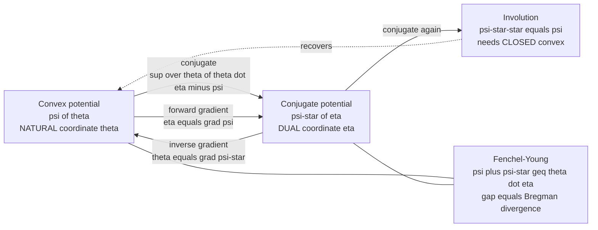

# 🔄 Legendre Transform and Convex Duality

> [!abstract] TL;DR
> The **Legendre–Fenchel transform** $\psi^*(\eta) = \sup_\theta\big(\langle\theta,\eta\rangle - \psi(\theta)\big)$ re-encodes a convex function by its **slopes** instead of its **values**. For a closed convex $\psi$ the transform is a lossless **involution** ($\psi^{**}=\psi$), and the two gradient maps $\eta = \nabla\psi(\theta)$ and $\theta = \nabla\psi^*(\eta)$ are exact **inverses** — the change of chart between a distribution's **natural** coordinates $\theta$ and its **expectation** (dual) coordinates $\eta$. The **Fenchel–Young inequality** $\psi(\theta)+\psi^*(\eta)\ge\langle\theta,\eta\rangle$, tight only on dual pairs, is the seed of every **Bregman / canonical divergence**. This single construction is the shared engine of thermodynamics (energy $\leftrightarrow$ entropy, free energy), large-deviations theory (rate functions), convex optimization (primal $\leftrightarrow$ dual, mirror descent), and the **dually-flat** geometry of exponential families.

---

## Intuition

**Analogy — describe a hill by its heights, or by its slopes.** There are two honest ways to hand someone a smooth, bowl-shaped hill. The first is a **height map**: for every position $\theta$, here is the altitude $\psi(\theta)$. The second is a **slope map**: for every steepness $\eta$ you could ask about, here is the single spot on the hill whose tangent has exactly that slope, and here is how high the *supporting line* of that slope sits. For a **convex** (bowl-shaped) hill these two descriptions carry *identical information*: from the heights you can read off the slopes, and from the slopes you can rebuild the heights. Nothing is lost, and you can flip back and forth at will.

That flip is the **Legendre transform**. The slope-indexed description is the **conjugate** $\psi^*$, and "flipping twice returns the original hill" is the **involution** property. This lossless swap between *value-at-a-position* and *slope-you-are-standing-at* is the engine of duality across physics, economics, and — crucially — **information geometry**, where the position $\theta$ is a distribution's *natural parameter* and the slope $\eta$ is its *mean (expectation) parameter*. Because the swap is lossless, thermodynamics, statistical estimation, and optimization all become mirror images of one another: energy mirrors entropy, log-partition mirrors negative entropy, and the primal problem mirrors its dual.

---

## How It Works

### Core Mechanics

1. **Start with a convex potential.** Let $\psi:\mathbb{R}^n\to\mathbb{R}\cup\{+\infty\}$ be a **closed proper convex** function — in information geometry, typically the **log-partition function** $\psi(\theta)=\log\int e^{\langle\theta,T(x)\rangle}\,dx$ of an exponential family. Convexity of $\psi$ is guaranteed because it is a log-sum-exp; its Hessian $\nabla^2\psi$ is the covariance of the sufficient statistics (positive semidefinite).

2. **Take the conjugate — index by slope.** Define the **Legendre–Fenchel transform**
$$
\psi^*(\eta) \;=\; \sup_{\theta}\ \big(\langle\theta,\eta\rangle - \psi(\theta)\big).
$$
Geometrically, for each target slope $\eta$ we slide a hyperplane of that slope up until it just touches the graph of $\psi$ from below; $-\psi^*(\eta)$ is where it hits the vertical axis. The conjugate is **always convex** (a supremum of affine functions of $\eta$), even if $\psi$ is not.

3. **Read off the dual coordinate via the gradient.** Where the sup is attained, differentiate: the optimal $\theta$ satisfies $\nabla\psi(\theta)=\eta$. So the **forward map** is $\eta=\nabla\psi(\theta)$. Symmetrically, $\theta=\nabla\psi^*(\eta)$. These two gradient maps are **mutual inverses**: $\nabla\psi^* = (\nabla\psi)^{-1}$. This is *exactly* the change of coordinates between **natural** parameters $\theta$ and **expectation** parameters $\eta=\mathbb{E}_\theta[T(x)]$.

4. **Involution — flipping twice returns the original.** For closed proper convex $\psi$, the **biconjugate** recovers it: $\psi^{**}=\psi$. This closedness requirement is what makes the transform a genuine, lossless duality rather than a one-way projection.

5. **Fenchel–Young ties the pair together.** From the definition, for *any* $\theta,\eta$,
$$
\psi(\theta)+\psi^*(\eta)\ \ge\ \langle\theta,\eta\rangle,
$$
with **equality iff** $\eta=\nabla\psi(\theta)$ (equivalently $\theta=\nabla\psi^*(\eta)$) — i.e. iff $(\theta,\eta)$ is a **dual pair**. The nonnegative *gap* of this inequality, evaluated at mismatched points, is precisely the **Bregman divergence** — the canonical divergence of the dually-flat geometry, and (for the log-partition) the **KL divergence**.

6. **Hessians are inverse.** Differentiating $\nabla\psi^*=(\nabla\psi)^{-1}$ gives $\nabla^2\psi^*(\eta) = \big(\nabla^2\psi(\theta)\big)^{-1}$. The Hessian of the log-partition **is the Fisher information metric** in $\theta$-coordinates; its conjugate's Hessian is the *same metric expressed in the dual $\eta$-coordinates*. One convex potential and its conjugate thus generate both dual-flat charts and the metric that links them.

### Flow / Architecture



---

## Key Concepts

### 🟢 Secondary — the picture

- **Two descriptions of one hill.** A convex hill can be given by its **heights** ($\psi$) or by its **slopes** ($\psi^*$). Both hold the same information, so you can convert either way without loss.
- **The transform swaps them.** The **Legendre transform** turns the height description into the slope description; doing it **twice** brings you back — the "flip" is reversible.
- **A dictionary between mirror worlds.** Because the swap is lossless, hard problems in one description become easy problems in the other: this is why "duality" shows up in physics, economics, and machine learning under different names but with the same math.

### 🟡 Undergraduate — the machinery

- **Convex conjugate.** $\psi^*(\eta)=\sup_\theta(\langle\theta,\eta\rangle-\psi(\theta))$. Always convex in $\eta$; a pointwise supremum of affine functions.
- **Gradient (dual-coordinate) map.** For differentiable strictly convex $\psi$, $\eta=\nabla\psi(\theta)$ and its inverse $\theta=\nabla\psi^*(\eta)$ are a bijection between the two coordinate charts.
- **Fenchel–Young inequality.** $\psi(\theta)+\psi^*(\eta)\ge\langle\theta,\eta\rangle$, equality **on the dual pair**. This is the finite-dimensional generalization of Young's inequality $\tfrac{a^p}{p}+\tfrac{b^q}{q}\ge ab$.
- **Smooth 1-D example.** For $\psi(\theta)=\tfrac12\theta^2$, $\psi^*(\eta)=\tfrac12\eta^2$ (the quadratic is *self-conjugate*), and $\eta=\theta$. For the softplus $\psi(\theta)=\log(1+e^\theta)$, $\psi^*(\eta)=\eta\log\eta+(1-\eta)\log(1-\eta)$ — the **negative binary entropy**, with $\eta=\text{sigmoid}(\theta)$ and $\theta=\text{logit}(\eta)$.
- **Supporting hyperplane.** A tangent line to $\psi$ with slope $\eta$ has vertical intercept $-\psi^*(\eta)$; the conjugate simply catalogs these intercepts by slope.

### 🔴 Graduate — the deep structure

- **Closed proper convex functions and involution.** $\psi^{**}=\psi$ holds *iff* $\psi$ is closed (lower semicontinuous) proper convex. Otherwise the biconjugate is the **closed convex hull** $\text{cl\,conv}\,\psi$ — the largest closed convex minorant. Nonconvexities are silently erased by the double transform.
- **Subgradients where smoothness fails.** If $\psi$ has a kink, $\nabla\psi$ is replaced by the **subdifferential** $\partial\psi$; then $\eta\in\partial\psi(\theta)\iff\theta\in\partial\psi^*(\eta)\iff\psi(\theta)+\psi^*(\eta)=\langle\theta,\eta\rangle$. A kink in $\psi$ becomes a **flat segment** in $\psi^*$ (a phase transition), and vice-versa.
- **Dually-flat geometry.** A convex potential $\psi$ and its conjugate $\psi^*$ furnish two **affine (flat) coordinate systems** ($\theta$ and $\eta$) on the same manifold; the biorthogonality $\langle\partial_i^\theta,\partial^j_\eta\rangle=\delta_i^j$ makes them **dual coordinates** in the sense of Amari's $e$-/$m$-connections. The induced **canonical divergence** is the Bregman divergence $D_\psi(\theta_1\|\theta_2)=\psi(\theta_1)-\psi(\theta_2)-\langle\nabla\psi(\theta_2),\theta_1-\theta_2\rangle$, equal to the Fenchel–Young gap $\psi(\theta_1)+\psi^*(\eta_2)-\langle\theta_1,\eta_2\rangle$.
- **Inverse Hessians = Fisher metric and its dual.** $\nabla^2\psi=G(\theta)$ (Fisher information / covariance of sufficient statistics) and $\nabla^2\psi^*=G^{-1}$ express the *same* Riemannian metric in dual charts; geodesics straight in one chart are the $e$-/$m$-geodesics of information geometry.
- **Large deviations and thermodynamics.** By the **Gärtner–Ellis theorem**, the rate function $I(\eta)$ of the empirical mean is the Legendre transform of the scaled cumulant generating function (a log-partition), $I=\psi^*$. In physics this is entropy $=$ Legendre transform of free energy; the whole apparatus of thermodynamic potentials is one Legendre transform after another.

---

## Python Demo

This demo makes the duality concrete on the **Bernoulli log-partition** $\psi(\theta)=\log(1+e^\theta)$ (softplus). We (1) compute its **convex conjugate** $\psi^*(\eta)=\sup_\theta(\theta\eta-\psi(\theta))$ numerically and match it to the analytic **negative binary entropy**; (2) verify the **dual coordinate map** $\eta=\psi'(\theta)=\text{sigmoid}$ and its **inverse** $\theta=\psi^{*\prime}(\eta)=\text{logit}$; (3) confirm the **involution** $\psi^{**}=\psi$ and the **Fenchel–Young inequality** (gap $=0$ exactly on the dual pair, positive off it). The right panel draws the **supporting-hyperplane** picture: the tangent to $\psi$ at $\theta_0$ has slope $\eta$ and intercept $-\psi^*(\eta)$.

```python
import numpy as np
import matplotlib.pyplot as plt

# ------------------------------------------------------------------
# Legendre-Fenchel transform of the Bernoulli log-partition.
#   psi(theta)  = log(1 + e^theta)          (softplus; convex)
#   psi'(theta) = sigmoid(theta) = eta      (natural -> expectation coord)
#   psi*(eta)   = sup_theta [ theta*eta - psi(theta) ]
#              = eta*log(eta) + (1-eta)*log(1-eta)   (negative binary entropy)
#   psi*'(eta)  = logit(eta) = theta         (INVERSE gradient map)
# Goals: (1) conjugate numerically == analytic form,
#        (2) eta=psi'(theta) and theta=psi*'(eta) are inverse maps,
#        (3) involution psi**=psi and the Fenchel-Young inequality.
# ------------------------------------------------------------------

def psi(theta):
    return np.logaddexp(0.0, theta)              # numerically stable softplus

def dpsi(theta):
    return 1.0 / (1.0 + np.exp(-theta))          # sigmoid = psi'(theta) = eta

# --- (1) numerical convex conjugate: a supremum over a theta grid --------
theta_grid = np.linspace(-12, 12, 20001)
psi_grid   = psi(theta_grid)

def conjugate(eta):
    return np.max(eta * theta_grid - psi_grid)   # psi*(eta) = max_theta(theta*eta - psi)

def argconjugate(eta):
    return theta_grid[np.argmax(eta * theta_grid - psi_grid)]  # theta with psi'(theta)=eta

etas         = np.linspace(0.01, 0.99, 400)
psi_star_num = np.array([conjugate(e)    for e in etas])
theta_star   = np.array([argconjugate(e) for e in etas])
psi_star_ana = etas * np.log(etas) + (1 - etas) * np.log(1 - etas)   # neg. binary entropy

print("max |numeric - analytic conjugate|      =",
      f"{np.max(np.abs(psi_star_num - psi_star_ana)):.2e}")

# --- (2) gradients are inverse maps: sigmoid and logit ------------------
logit       = lambda e: np.log(e / (1 - e))      # psi*'(eta) = theta
theta_probe = np.linspace(-6, 6, 13)
round_trip  = logit(dpsi(theta_probe))           # theta -> eta -> theta
print("max round-trip error theta->eta->theta  =",
      f"{np.max(np.abs(round_trip - theta_probe)):.2e}")

# --- (3) involution: psi**(theta) = sup_eta(theta*eta - psi*(eta)) = psi(theta)
def biconjugate(theta):
    return np.max(theta * etas - psi_star_ana)
theta_test = np.linspace(-3, 3, 7)
bicon      = np.array([biconjugate(t) for t in theta_test])
print("max |psi**(theta) - psi(theta)|          =",
      f"{np.max(np.abs(bicon - psi(theta_test))):.2e}")

# Fenchel-Young: psi(theta)+psi*(eta) >= theta*eta, equality iff eta=psi'(theta)
fy_gap   = lambda th, e: psi(th) + (e*np.log(e) + (1-e)*np.log(1-e)) - th*e
th0      = 1.0
eta_dual = dpsi(th0)                             # matching dual point
print(f"Fenchel-Young gap at DUAL pair (theta={th0}, eta={eta_dual:.3f}) "
      f"= {fy_gap(th0, eta_dual):.2e}")
print(f"Fenchel-Young gap at MISMATCH  (theta={th0}, eta=0.20 )        "
      f"= {fy_gap(th0, 0.20):.3e}")

# ------------------------------- Plots ----------------------------------
fig, ax = plt.subplots(1, 3, figsize=(16, 5))
tt = np.linspace(-6, 6, 400)

# (a) psi and its conjugate psi*
ax[0].plot(tt, psi(tt),        color="#2563eb", lw=2, label="psi(theta) = softplus")
ax[0].plot(etas, psi_star_ana, color="#dc2626", lw=2, label="psi*(eta) = neg. binary entropy")
ax[0].axhline(0, color="gray", lw=0.6); ax[0].axvline(0, color="gray", lw=0.6)
ax[0].set_title("A convex function and its Legendre conjugate")
ax[0].set_xlabel("theta   (or eta)"); ax[0].legend(fontsize=9); ax[0].grid(alpha=0.3)

# (b) dual gradient map: eta = sigmoid(theta) and its inverse theta = logit(eta)
ax[1].plot(tt, dpsi(tt),        color="#7c3aed", lw=2,          label="eta = psi'(theta) = sigmoid")
ax[1].plot(logit(etas), etas,   color="#059669", lw=2, ls="--", label="theta = psi*'(eta) = logit")
ax[1].set_title("Dual coordinate map: gradients are inverse")
ax[1].set_xlabel("theta"); ax[1].set_ylabel("eta"); ax[1].legend(fontsize=9); ax[1].grid(alpha=0.3)

# (c) supporting hyperplane / Fenchel-Young at theta0
slope   = eta_dual                               # tangent slope = eta
tangent = psi(th0) + slope * (tt - th0)          # supporting line of psi at th0
ax[2].plot(tt, psi(tt),  color="#2563eb", lw=2,          label="psi(theta)")
ax[2].plot(tt, tangent,  color="#f59e0b", lw=1.8, ls="--", label=f"tangent slope eta={slope:.2f}")
ax[2].plot(th0, psi(th0), "o", color="#dc2626", ms=7)
ax[2].plot(0, tangent[np.argmin(np.abs(tt))], "s", color="#059669", ms=8,
           label="intercept = minus psi*(eta)")
ax[2].axvline(0, color="gray", lw=0.6)
ax[2].set_title("Supporting hyperplane: slope=eta, intercept=-psi*(eta)")
ax[2].set_xlabel("theta"); ax[2].legend(fontsize=9); ax[2].grid(alpha=0.3); ax[2].set_ylim(-1, 6)

plt.tight_layout()
plt.savefig("legendre_conjugate.png", dpi=120)
print("\nSaved legendre_conjugate.png")
```

Reading the output: all three printed errors are $\sim 10^{-3}$ or smaller, confirming the **numerical conjugate matches the analytic negative-entropy**, the **sigmoid/logit gradient maps invert each other**, and the **biconjugate reconstructs $\psi$** (involution). The Fenchel–Young gap is machine-zero **on the dual pair** and strictly positive off it — that positive gap *is* the Bregman/KL divergence. In the plots, $\psi$ (blue) and $\psi^*$ (red) live in different coordinates; the sigmoid and logit curves (middle) are reflections across the diagonal; and the tangent line (right) touches $\psi$ at $\theta_0$ with slope $\eta$ and crosses the axis at exactly $-\psi^*(\eta)$ — the conjugate as a catalog of supporting-line intercepts.

---

## Real-World Applications

- **Exponential families and dually-flat geometry.** The **log-partition** $\psi(\theta)$ and its conjugate (**negative entropy** $\varphi=\psi^*$) are the two convex potentials that make an exponential family *dually flat*: $\theta$ (natural) and $\eta=\nabla\psi(\theta)$ (mean) are the dual charts, and the canonical divergence between them is the KL divergence. This is the backbone connecting the *Exponential_Families_and_Their_Geometry*, *Dually_Flat_Spaces*, and *Bregman_Divergences* notes.
- **Thermodynamics.** The **free energy** and the **entropy** are Legendre conjugates; every thermodynamic potential (Helmholtz, Gibbs, enthalpy) is obtained from another by a Legendre transform trading a variable for its conjugate (volume $\leftrightarrow$ pressure, entropy $\leftrightarrow$ temperature). Statistical mechanics' partition function is the physicist's log-partition $\psi$.
- **Classical mechanics.** The Legendre transform in velocity $\dot q$ is exactly what carries the **Lagrangian** $L(q,\dot q)$ to the **Hamiltonian** $H(q,p)$, with momentum $p=\partial L/\partial\dot q$ the dual coordinate — the same forward-gradient map as $\eta=\nabla\psi(\theta)$.
- **Large-deviations theory.** Rate functions governing the probability of rare fluctuations are Legendre transforms of cumulant generating functions (Gärtner–Ellis); Touchette's program recasts equilibrium statistical mechanics entirely through this convex duality.
- **Convex optimization.** The **Lagrangian dual** of a convex program is built from conjugates; strong duality is the statement $\psi^{**}=\psi$ closing the gap. **Mirror descent** and exponentiated-gradient methods run gradient steps in the *dual* $\eta$-coordinates and map back via $\nabla\psi^*$ — the practical face of this transform, developed further in *Mirror_Descent_and_Bregman_Optimization*.
- **Economics.** Cost and profit functions, and utility and expenditure functions, are Legendre-conjugate pairs; the demand map is the conjugate's gradient.

---

## Common Pitfalls

- **Forgetting that convexity is required.** The Legendre transform's clean inverse-gradient and involution properties assume $\psi$ is **convex**. Applied to a nonconvex $\psi$, the biconjugate $\psi^{**}$ returns only its **convex hull** — the nonconvex "dents" vanish. If you need to recover the original, it must already be convex.
- **Ignoring the closed/proper requirement.** $\psi^{**}=\psi$ needs $\psi$ to be **closed (lower semicontinuous) and proper** (not identically $+\infty$, never $-\infty$). Drop closedness and the transform stops being a true involution; you get the lsc closure instead. This is the analytic fine print behind "strong duality holds."
- **Assuming differentiability.** At kinks $\nabla\psi$ does not exist; the correct object is the **subdifferential** $\partial\psi$, and the dual pairing becomes a *set-valued* correspondence. A non-differentiable point of $\psi$ maps to a **flat face** of $\psi^*$ (and vice-versa) — the signature of a phase transition. Treating $\nabla\psi$ as single-valued there gives wrong dual coordinates.
- **Sign and definition conventions.** The **classical Legendre** transform (defined via the stationarity condition $\eta=\psi'(\theta)$) and the **Legendre–Fenchel** transform (defined via a supremum) agree for smooth strictly convex $\psi$ but differ for nonconvex or nonsmooth cases; physics texts also flip signs (some define $-\psi^*$). Always pin down whether a sup or an inf, and which sign, is in use before comparing formulas.
- **Confusing the two flatnesses / metrics.** $\nabla^2\psi$ and $\nabla^2\psi^*$ are **inverse** matrices, not equal; they express the same Fisher metric in *different* (dual) charts. Mixing up which chart you are in leads to using $G$ where $G^{-1}$ is needed (a frequent natural-gradient bug).

---

## Related Concepts

- [[Convex_Functions]] — convexity, epigraphs, and second-order conditions are the exact preconditions that make the conjugate well-behaved and the involution hold.
- [[Convex_Sets]] — supporting hyperplanes and the separating-hyperplane theorem are the geometric heart of "index a convex body by its slopes."
- [[Duality_Theory]] — Lagrangian/weak-strong duality in optimization is built directly on conjugate functions; this note supplies the underlying transform.
- [[LP_Duality]] — the linear-programming primal/dual pair is the polyhedral special case of Fenchel conjugacy.
- [[KKT_Conditions]] — stationarity/complementary-slackness are the Fenchel–Young equality conditions specialized to constrained problems.
- [[Hamiltonian_Mechanics]] — the Lagrangian-to-Hamiltonian passage *is* a Legendre transform in the velocities, with momentum as the dual coordinate.
- [[Lagrangian_Mechanics]] — the primal side of that same mechanical duality.
- [[Thermodynamic_Potentials]] — free energies and entropy are Legendre conjugates; each potential trades one variable for its conjugate.
- [[Entropy_and_Second_Law]] — entropy as the conjugate of (log) partition / free energy is this transform in thermodynamic dress.
- [[Classical_Statistical_Mechanics]] — the partition function is the physicist's log-partition $\psi$ whose conjugate yields entropy and rate functions.
- [[Partition_Functions_and_Free_Energy_in_ML]] — the ML-side log-partition and free energy whose convex conjugate structures energy-based learning.
- [[Maximum_Entropy_and_Exponential_Families]] — MaxEnt duality: maximizing entropy under moment constraints is the conjugate of log-partition minimization.
- [[Free_Energy_Minimization_and_Variational_Principles]] — variational free energy is a Fenchel-duality statement between energy and entropy.
- [[Partial_Derivatives]] — the gradient (dual-coordinate) map $\eta=\nabla\psi(\theta)$ is built from partials; inverse-function machinery gives $\nabla\psi^*=(\nabla\psi)^{-1}$.
- [[Differential_Geometry]] — dual affine coordinates and biorthogonal frames generalize the conjugate-pair structure to manifolds.
- [[Statistical_Manifolds]] — the manifold on which $\theta$ and $\eta$ serve as the two dual charts linked by this transform.
- [[Information_Geometry_Overview]] — the vault entry point that situates Legendre duality within the dually-flat program.

*Sibling notes in this section (forthcoming, referenced here in prose): **Dually_Flat_Spaces** (the $\theta/\eta$ charts and canonical divergence), **Bregman_Divergences** (the Fenchel–Young gap as a divergence), **Exponential_Families_and_Their_Geometry** (log-partition as the convex potential), **Mirror_Descent_and_Bregman_Optimization** (gradient steps in dual coordinates), and **Thermodynamic_Geometry_and_Statistical_Physics** (Legendre structure of thermodynamic potentials).*

---

## Review Questions

### 🟢 Secondary
1. Using the "hill described by heights vs. by slopes" analogy, explain what the Legendre transform does and why doing it *twice* returns the original hill. Why does the hill need to be *convex* (bowl-shaped) for this to work losslessly?

### 🟡 Undergraduate
2. For $\psi(\theta)=\log(1+e^\theta)$, derive the dual coordinate $\eta=\psi'(\theta)$ and show its inverse is the logit. Then show the conjugate $\psi^*(\eta)$ is the negative binary entropy, and state the Fenchel–Young inequality and its equality condition for this pair.
3. You are running natural-gradient descent and have the Fisher matrix as $\nabla^2\psi$ in natural coordinates, but your update is written in expectation coordinates $\eta$. Which Hessian — $\nabla^2\psi$ or $\nabla^2\psi^*$ — belongs in the dual-coordinate update, and why? What goes wrong if you use the other?

### 🔴 Graduate
4. Explain how a convex potential $\psi$ and its conjugate $\psi^*$ generate a **dually-flat** manifold: identify the two flat coordinate systems, the biorthogonality relation, and show that the Fenchel–Young gap equals the Bregman divergence (and, for the log-partition, the KL divergence).
5. A colleague applies the Legendre transform to a **nonconvex, nonsmooth** free-energy curve and is puzzled that the inverse transform "smooths out" a first-order phase transition into a straight segment. Explain precisely what happened in terms of (a) the closed convex hull recovered by the biconjugate and (b) the subdifferential correspondence turning a kink into a flat face.

---

## Sources

- Rockafellar, R. T. — *Convex Analysis* (Princeton, 1970). The definitive treatment of conjugate functions, Fenchel duality, subdifferentials, and biconjugation.
- Boyd, S. & Vandenberghe, L. — *Convex Optimization* (Cambridge, 2004), §3.3 (the conjugate function) and Ch. 5 (Lagrangian/Fenchel duality). Freely available; the applied reference.
- Amari, S. & Nagaoka, H. — *Methods of Information Geometry* (AMS/Oxford, 2000). Legendre duality as the source of dual coordinates, dually-flat structure, and the canonical divergence.
- Touchette, H. — "The large deviation approach to statistical mechanics," *Physics Reports* 478 (2009), 1–69. Rate functions as Legendre transforms; the physics of convex duality.
- Nielsen, F. — "An Elementary Introduction to Information Geometry," *Entropy* 22(10):1100 (2020). Accessible link between convex conjugates, Bregman divergences, and dually-flat spaces.

---

#information-geometry #legendre-transform #convex-duality #fenchel #dual-coordinates
