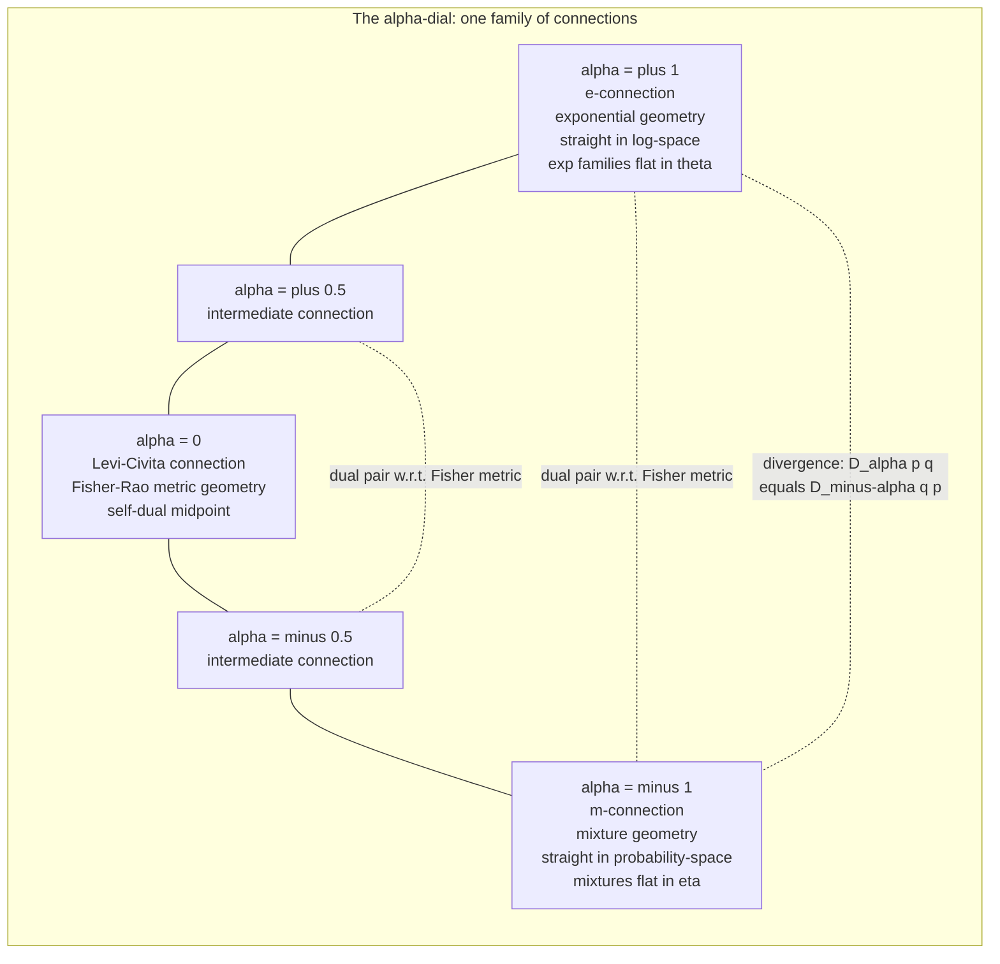

# 🎛️ The Alpha Family of Connections

> [!abstract] TL;DR
> A statistical manifold carries **two** natural notions of "straight line": the **exponential ($e$-) connection** (straight in *log*-probability) and the **mixture ($m$-) connection** (straight in *raw* probability). Rather than pick one, Amari built a **dial** — a one-parameter family of affine connections $\nabla^{(\alpha)}$, roughly $\tfrac{1+\alpha}{2}\nabla^{(e)} + \tfrac{1-\alpha}{2}\nabla^{(m)}$ — where $\alpha=+1$ is the $e$-connection, $\alpha=-1$ is the $m$-connection, and $\alpha=0$ is the **Levi-Civita (metric) connection** of the Fisher–Rao metric. The two ends are **dual** with respect to the Fisher metric: $\nabla^{(\alpha)}$ and $\nabla^{(-\alpha)}$ are always partners. Turning the dial also generates the **$\alpha$-representations** (the power/log transform $\propto p^{(1-\alpha)/2}$) and the **$\alpha$-divergences** that interpolate KL, squared-Hellinger, and $\chi^2$ — with the same duality $D_\alpha(p\|q)=D_{-\alpha}(q\|p)$.

---

## Intuition

**Analogy — a dial between two rulers, not a coin flip.** Suppose two expert surveyors argue about how to draw a "straight road" across the country of probability distributions. One insists on measuring everything in *log-probability* — for her, exponential families (Gaussians, Poissons) are perfectly flat, so their geodesics are her straight roads. The other insists on measuring in *raw probability* — for him, mixtures of fixed distributions are perfectly flat, so *his* straight roads follow blends. Both are right; they are just using different rulers. Instead of forcing a choice, Amari bolts the two rulers to a single **dial**. Set the dial to $\alpha=+1$ and you get the log-ruler ($e$-connection); set it to $\alpha=-1$ and you get the probability-ruler ($m$-connection); park it exactly in the middle at $\alpha=0$ and you get the *ordinary* Riemannian ruler — the Levi-Civita connection of the Fisher metric, the one that measures plain geometric distance.

Turning the dial sweeps out an entire spectrum of "statistical straightness," and it comes with a beautiful symmetry: **every setting $+\alpha$ has a mirror partner $-\alpha$**, and the two are *dual* — parallel-transport a vector with one connection and its partner with the other, and their Fisher inner product never changes. The self-dual, perfectly balanced point is $\alpha=0$. The same dial re-appears everywhere: it controls how you *embed* a distribution (the transform $p \mapsto p^{(1-\alpha)/2}$, with $\log p$ at the $\alpha=1$ end), and it controls which *divergence* you measure with (KL at the $\pm1$ ends, Hellinger at the balanced middle). One knob, one unified geometry.

---

## How It Works

### The one-parameter family

Write $\ell(x;\theta) = \log p(x;\theta)$ and $\partial_i = \partial/\partial\theta^i$. The **$\alpha$-connection** is defined by its Christoffel symbols (of the first kind):

$$
\Gamma^{(\alpha)}_{ij,k}(\theta) \;=\; \mathbb{E}_\theta\!\Big[\big(\partial_i\partial_j \ell\big)\,\partial_k \ell\Big] \;+\; \frac{1-\alpha}{2}\,\mathbb{E}_\theta\!\Big[\partial_i \ell\,\partial_j \ell\,\partial_k \ell\Big].
$$

The second term is the **Amari–Chentsov (skewness) tensor** $T_{ijk} = \mathbb{E}[\partial_i\ell\,\partial_j\ell\,\partial_k\ell]$, scaled by $(1-\alpha)/2$. Everything reduces to three landmark settings:

1. **$\alpha=+1$ — the exponential ($e$-) connection $\nabla^{(e)}$.** The skewness term vanishes; $\Gamma^{(1)}_{ij,k}=\mathbb{E}[(\partial_i\partial_j\ell)\,\partial_k\ell]$. Exponential families written in their **natural parameters $\theta$** are *flat* under this connection — their geodesics are straight lines in $\theta$-space, i.e. straight in log-probability.
2. **$\alpha=-1$ — the mixture ($m$-) connection $\nabla^{(m)}$.** The skewness term enters with full weight. **Mixture families** written in their **expectation parameters $\eta$** are flat under this connection — geodesics are straight lines in raw probability, $p_t = (1-t)p_0 + t\,p_1$.
3. **$\alpha=0$ — the Levi-Civita (metric) connection.** It is the *average* of the two extremes and is the unique torsion-free connection compatible with the Fisher metric $g$. Its geodesics are Fisher–Rao shortest paths.

The convex-combination picture is exact for the connection *coefficients*:

$$
\nabla^{(\alpha)} \;=\; \frac{1+\alpha}{2}\,\nabla^{(e)} \;+\; \frac{1-\alpha}{2}\,\nabla^{(m)},
\qquad\text{so}\quad \nabla^{(0)} = \tfrac12\big(\nabla^{(e)}+\nabla^{(m)}\big).
$$

### Duality is the backbone

The single identity that makes the family cohere is **duality with respect to the Fisher metric** $g$: for vector fields $X,Y,Z$,

$$
X\,g(Y,Z) \;=\; g\!\big(\nabla^{(\alpha)}_X Y,\,Z\big) \;+\; g\!\big(Y,\,\nabla^{(-\alpha)}_X Z\big).
$$

So $\nabla^{(\alpha)}$ and $\nabla^{(-\alpha)}$ are a **dual pair**; $e$ and $m$ ($\alpha=\pm1$) are the outermost pair, and $\alpha=0$ is **self-dual** (it is its own partner — the definition of the metric connection). This is what "the two rulers preserve the same inner product" means precisely.

### The $\alpha$-representation and $\alpha$-flatness

The same $\alpha$ indexes a way of **re-coordinatizing probability itself**, the **$\alpha$-representation (or $\alpha$-embedding)**:

$$
L_\alpha(p) \;=\;
\begin{cases}
\dfrac{2}{1-\alpha}\,p^{(1-\alpha)/2}, & \alpha \neq 1,\\[2mm]
\log p, & \alpha = 1.
\end{cases}
$$

At $\alpha=-1$ this is (up to constants) the **linear** map $p$ itself → mixtures are straight; at $\alpha=+1$ it is $\log p$ → exponential families are straight; at $\alpha=0$ it is $\propto\sqrt{p}$ → the "square-root of density" that makes the Fisher metric a plain Euclidean metric on the sphere of $\sqrt{p}$. A manifold is **$\alpha$-flat** when it is flat under $\nabla^{(\alpha)}$; the headline theorem is that **exponential families are $\pm1$-flat** (indeed dually flat), which is exactly why they are the "harmonic oscillators" of statistics.

### The $\alpha$-divergences

To each $\alpha$ Amari attaches a **divergence** (a smooth, asymmetric "squared distance") that *generates* the very same geometry:

$$
D_\alpha(p\,\|\,q) \;=\; \frac{4}{1-\alpha^2}\left(1 - \int p(x)^{\frac{1-\alpha}{2}}\,q(x)^{\frac{1+\alpha}{2}}\,dx\right),\qquad \alpha\neq\pm1,
$$

which interpolates a whole classical zoo (in the convention used throughout this note):

| $\alpha$ | $D_\alpha(p\|q)$ becomes | character |
|---|---|---|
| $\to -1$ | $\mathrm{KL}(p\|q) = \int p\log\frac{p}{q}$ | forward KL, $m$-flat side |
| $=0$ | $2\!\int(\sqrt{p}-\sqrt{q})^2 = 4\big(1-\!\int\!\sqrt{pq}\big)$ | squared Hellinger, **symmetric** |
| $\to +1$ | $\mathrm{KL}(q\|p) = \int q\log\frac{q}{p}$ | reverse KL, $e$-flat side |
| $=3,\,-3$ | Pearson / Neyman $\chi^2$ | heavy-tail-sensitive |

and the duality of the connections shows up verbatim as a duality of divergences:

$$
\boxed{\,D_\alpha(p\,\|\,q) \;=\; D_{-\alpha}(q\,\|\,p)\,}
$$

Flipping the dial's sign is the same as swapping the two arguments. The self-dual midpoint $\alpha=0$ is therefore *forced* to be symmetric — that is why Hellinger sits exactly in the middle.

### Flow / Architecture



---

## Key Concepts

### 🟢 Secondary (build the picture)

- **Two ways to draw a straight line.** Between two distributions you can travel "straight in log-probability" (the exponential way) or "straight in plain probability" (the mixture way). Both are legitimate straight roads.
- **A dial, not a switch.** Amari's $\alpha$ is a knob from $-1$ to $+1$ (and beyond) that smoothly slides between the two. Middle of the dial ($\alpha=0$) is the ordinary, symmetric geometry.
- **Every setting has a mirror.** $+\alpha$ and $-\alpha$ are partners; the balanced middle is its own partner.

### 🟡 Undergraduate (the machinery)

- **$\alpha$-connection.** The family $\nabla^{(\alpha)} = \tfrac{1+\alpha}{2}\nabla^{(e)} + \tfrac{1-\alpha}{2}\nabla^{(m)}$; a torsion-free affine connection for each $\alpha$, all sharing the Fisher metric.
- **The three landmarks.** $\alpha=+1$: $e$-connection (exponential families flat). $\alpha=-1$: $m$-connection (mixtures flat). $\alpha=0$: Levi-Civita/Fisher–Rao metric connection.
- **$\alpha$-representation.** The transform $L_\alpha(p)\propto p^{(1-\alpha)/2}$ with $\log p$ at $\alpha=1$: linear at $\alpha=-1$, $\sqrt p$ at $\alpha=0$, $\log p$ at $\alpha=+1$.
- **$\alpha$-divergence.** A one-parameter divergence interpolating KL ($\alpha\to\pm1$), squared Hellinger ($\alpha=0$), and $\chi^2$; obeys $D_\alpha(p\|q)=D_{-\alpha}(q\|p)$.

### 🔴 Graduate (the deep structure)

- **Amari–Chentsov tensor & duality.** $\Gamma^{(\alpha)}_{ij,k} = \Gamma^{(0)}_{ij,k} - \tfrac{\alpha}{2}T_{ijk}$, where $T_{ijk}=\mathbb{E}[\partial_i\ell\,\partial_j\ell\,\partial_k\ell]$; the pair $(g, T)$ is the complete invariant data (Chentsov), and $\nabla^{(\alpha)},\nabla^{(-\alpha)}$ are $g$-dual, with $\nabla^{(0)}$ self-dual.
- **$\alpha$-flatness and dual flatness.** A space is $\alpha$-flat iff the $\nabla^{(\alpha)}$-curvature vanishes. Exponential families are $\pm1$-flat *simultaneously* (dually flat), yielding the Legendre pair $(\theta,\eta)$ and the canonical (KL/Bregman) divergence.
- **Divergence $\to$ geometry.** A divergence $D$ induces a metric $g_{ij}=\partial_i\partial_j' D|_{p=q}$ and a dual pair of connections from its third derivatives; the $\alpha$-divergence *induces* precisely $(\nabla^{(\alpha)},\nabla^{(-\alpha)})$, closing the loop between the metric/connection view and the divergence view.
- **$f$-divergence membership.** Each $\alpha$-divergence is an $f$-divergence with $f_\alpha(t)=\tfrac{4}{1-\alpha^2}\big(1-t^{(1+\alpha)/2}\big)$; all $f$-divergences share the *same* Fisher metric (Chentsov invariance) but differ at third order — that third-order difference is exactly $\alpha$.
- **Relatives.** The $\alpha$-divergence is a monotone reparameterization of the **Rényi** and **Tsallis** divergences of the corresponding order; Chernoff information and the Bhattacharyya coefficient live at the $\alpha=0$ balance point.

---

## Python Demo

This demo makes the dial tangible on a **categorical / Bernoulli** family. Part (a) computes the **$\alpha$-embedding** $L_\alpha(p)\propto p^{(1-\alpha)/2}$ and plots it for several $\alpha$, showing the smooth spectrum: *linear* at $\alpha=-1$ (mixture), $\sqrt{p}$ at $\alpha=0$ (Hellinger), $\log p$ at $\alpha=+1$ (exponential). Part (b) computes **Amari's $\alpha$-divergence** between two fixed categorical distributions across the whole dial and overlays the classical landmarks — **KL, reverse-KL, squared-Hellinger** — then verifies the duality $D_\alpha(p\|q)=D_{-\alpha}(q\|p)$ by plotting $D_\alpha(q\|p)$ as the mirror image of $D_\alpha(p\|q)$.

```python
import numpy as np
import matplotlib.pyplot as plt

# ------------------------------------------------------------------
# The alpha-family: alpha-embeddings and Amari's alpha-divergences.
# One dial (alpha) sweeps exponential (alpha=+1) <-> metric (alpha=0)
# <-> mixture (alpha=-1) geometry, plus the matching divergences.
# ------------------------------------------------------------------

# ---------- (a) the alpha-embedding L_alpha(p) ----------------------
# Box-Cox form (constant-shifted so the alpha=1 limit is exactly log p):
#   f_alpha(p) = (p**beta - 1) / beta,  beta = (1-alpha)/2,  f_1(p)=log p
# A constant offset does not change the affine embedding, so this is the
# same object as (2/(1-alpha)) p**((1-alpha)/2) up to an affine shift.
def alpha_embedding(p, alpha):
    beta = (1.0 - alpha) / 2.0
    if abs(beta) < 1e-12:          # alpha -> 1  =>  log p
        return np.log(p)
    return (p**beta - 1.0) / beta

# ---------- (b) Amari's alpha-divergence (discrete) -----------------
#   D_alpha(p||q) = 4/(1-alpha^2) * (1 - sum_i p_i^((1-a)/2) q_i^((1+a)/2))
# with limits  D_{-1}=KL(p||q),  D_{+1}=KL(q||p),  D_0 = 2*sum(sqrt p - sqrt q)^2
def alpha_divergence(p, q, alpha):
    if abs(alpha - 1.0) < 1e-9:            # limit -> reverse KL = KL(q||p)
        return np.sum(q * np.log(q / p))
    if abs(alpha + 1.0) < 1e-9:            # limit -> forward KL = KL(p||q)
        return np.sum(p * np.log(p / q))
    a = (1.0 - alpha) / 2.0
    b = (1.0 + alpha) / 2.0
    return 4.0 / (1.0 - alpha**2) * (1.0 - np.sum(p**a * q**b))

# two fixed categorical distributions on 4 outcomes (strictly positive)
p = np.array([0.50, 0.25, 0.15, 0.10])
q = np.array([0.20, 0.35, 0.25, 0.20])
p /= p.sum(); q /= q.sum()

# classical landmark values (analytic)
kl_pq   = np.sum(p * np.log(p / q))                 # forward KL   ~ alpha=-1
kl_qp   = np.sum(q * np.log(q / p))                 # reverse KL   ~ alpha=+1
hell_sq = 2.0 * np.sum((np.sqrt(p) - np.sqrt(q))**2)  # 4*H^2      = alpha=0

print("Landmark divergences between p and q:")
print(f"  KL(p||q)            = {kl_pq:.4f}   (alpha -> -1)")
print(f"  KL(q||p)            = {kl_qp:.4f}   (alpha -> +1)")
print(f"  4 * Hellinger^2     = {hell_sq:.4f}   (alpha = 0, symmetric)")
print(f"  D_0(p||q) computed  = {alpha_divergence(p, q, 0.0):.4f}")

# duality check:  D_alpha(p||q) == D_{-alpha}(q||p)
for a in (0.7, 1.5, 2.0):
    lhs = alpha_divergence(p, q,  a)
    rhs = alpha_divergence(q, p, -a)
    print(f"  duality alpha={a:+.1f}:  D_a(p||q)={lhs:.5f}  vs  D_-a(q||p)={rhs:.5f}")

# sweep the dial
alphas = np.linspace(-2.5, 2.5, 201)
Dpq = np.array([alpha_divergence(p, q, a) for a in alphas])
Dqp = np.array([alpha_divergence(q, p, a) for a in alphas])   # mirror of Dpq

# ---------- plots ---------------------------------------------------
fig, (ax1, ax2) = plt.subplots(1, 2, figsize=(13, 5.2))

# (a) alpha-embedding curves
pp = np.linspace(1e-3, 1.0, 400)
palette = {
    -1.0: ("tab:red",   "alpha = -1  (mixture, ~linear in p)"),
    -0.5: ("tab:orange","alpha = -0.5"),
     0.0: ("tab:green", "alpha = 0  (metric, ~sqrt p)"),
     0.5: ("tab:blue",  "alpha = +0.5"),
     1.0: ("tab:purple","alpha = +1  (exponential, log p)"),
}
for a, (col, lab) in palette.items():
    ax1.plot(pp, alpha_embedding(pp, a), color=col, lw=1.9, label=lab)
ax1.set_xlabel("probability  p")
ax1.set_ylabel("alpha-embedding  L_alpha(p)")
ax1.set_title("The alpha-representation: one dial from linear to sqrt to log")
ax1.axhline(0, color="gray", lw=0.8)
ax1.grid(alpha=0.3)
ax1.legend(fontsize=8, loc="lower right")

# (b) alpha-divergence across the dial + landmarks + duality mirror
ax2.plot(alphas, Dpq, color="tab:blue", lw=2.2, label="D_alpha(p || q)")
ax2.plot(alphas, Dqp, color="tab:red",  lw=1.6, ls="--",
         label="D_alpha(q || p)  = mirror of D_-alpha(p || q)")
ax2.scatter([-1, 1, 0], [kl_pq, kl_qp, hell_sq],
            color="black", zorder=5, s=45)
ax2.annotate("KL(p||q)",  (-1, kl_pq),   textcoords="offset points", xytext=(6, 6),  fontsize=8)
ax2.annotate("KL(q||p)",  ( 1, kl_qp),   textcoords="offset points", xytext=(-52,6), fontsize=8)
ax2.annotate("4*Hellinger^2", (0, hell_sq), textcoords="offset points", xytext=(6,-14), fontsize=8)
ax2.axvline(0, color="gray", lw=0.8, ls=":")
ax2.set_xlabel("alpha  (the connection / divergence dial)")
ax2.set_ylabel("alpha-divergence between p and q")
ax2.set_title("Amari alpha-divergence: KL <-> Hellinger <-> reverse-KL\n"
              "D_alpha(p||q) and D_alpha(q||p) are mirror images")
ax2.grid(alpha=0.3)
ax2.legend(fontsize=8, loc="upper center")

plt.tight_layout()
plt.savefig("alpha_family_of_connections.png", dpi=120)
print("\nSaved alpha_family_of_connections.png")
```

Reading the output: the **duality checks print equal pairs** ($D_\alpha(p\|q)=D_{-\alpha}(q\|p)$ to floating-point precision), and $D_0(p\|q)$ matches $4H^2$ exactly. In the left plot the embedding curve *rotates continuously* from a near-straight line ($\alpha=-1$, mixture) through the concave $\sqrt{p}$ ($\alpha=0$) to the steep $\log p$ ($\alpha=+1$, exponential) — a single knob generating the whole spectrum of "statistical straightness." In the right plot the blue $D_\alpha(p\|q)$ curve passes through KL at $\alpha=-1$, the symmetric Hellinger value at $\alpha=0$, and reverse-KL at $\alpha=+1$; the dashed red $D_\alpha(q\|p)$ is its **left-right mirror**, the visual signature of $D_\alpha(p\|q)=D_{-\alpha}(q\|p)$.

---

## Real-World Applications

- **$\alpha$/power expectation propagation (Power EP).** Minka's Power EP and related message-passing schemes minimize an **$\alpha$-divergence** rather than KL at each site; sliding $\alpha$ trades **mode-seeking** (reverse-KL, $\alpha\to+1$) against **mass-covering** (forward-KL, $\alpha\to-1$) behavior — the single most practical use of the dial.
- **Rényi / $\alpha$-divergence variational inference.** Li & Turner's *Rényi Divergence Variational Inference* and Hernández-Lobato's *Black-Box Alpha* optimize an $\alpha$-parameterized bound, tuning $\alpha$ to control how conservatively the approximate posterior covers the true one — directly relevant to VAEs and Bayesian deep nets.
- **Robust estimation.** The **density-power / $\alpha$-divergence** estimators (Basu, Cichocki–Amari) down-weight outliers by moving $\alpha$ away from the KL extremes, giving M-estimators that resist heavy tails while remaining near-efficient.
- **Nonnegative matrix / tensor factorization.** Cichocki–Amari's $\alpha\beta$-divergence family provides tunable NMF/NTF cost functions; $\alpha$ interpolates KL-NMF, Euclidean-NMF, and Itakura–Saito, letting practitioners match the divergence to the noise model of audio or image data.
- **Nonextensive statistical mechanics.** The $\alpha$-divergence is a monotone map of the **Tsallis** $q$-divergence, so $\alpha$-geometry is the information-geometric backbone of Tsallis/Rényi thermostatistics and $q$-Gaussian modeling.

---

## Common Pitfalls

- **Sign conventions differ between authors.** Some texts index so that $\alpha=+1$ is the $e$-connection giving $\mathrm{KL}(p\|q)$; others (and the divergence convention used here) put $\mathrm{KL}(p\|q)$ at $\alpha\to-1$. Always pin down *which* $\alpha$ maps to which KL direction before comparing formulas — an unnoticed sign flip silently swaps forward and reverse KL.
- **Forgetting that $\alpha=\pm1$ is the flat/dual *pair*, not a single geometry.** Exponential families are flat under **both** $\nabla^{(e)}$ and $\nabla^{(m)}$ (dually flat) in **different** coordinate charts ($\theta$ vs $\eta$). Treating "$e$-flat" and "$m$-flat" as the same flatness collapses the whole point of duality.
- **Confusing $\alpha=0$ (Levi-Civita) with dual flatness.** The $\alpha=0$ connection is the *metric* (Fisher–Rao) connection whose curvature is generally **nonzero** (Gaussians are hyperbolic). "Dually flat" refers to $\alpha=\pm1$, not $\alpha=0$; the two must not be conflated.
- **The $\alpha$-embedding singularity at $p\to0$.** The transform $p^{(1-\alpha)/2}$ (and $\log p$ at $\alpha=1$) blows up or loses smoothness at zero probability. On the boundary of the simplex, on distributions with vanishing support, or with sparse categoricals, the $\alpha$-geometry degenerates — regularize or restrict to the interior.
- **Assuming $D_\alpha$ is a metric.** Like KL, the $\alpha$-divergence is asymmetric for $\alpha\neq0$ and violates the triangle inequality; only $\alpha=0$ (Hellinger) yields a symmetric, metric-inducing quantity. Do not feed $D_\alpha$ into algorithms that assume a true distance.

---

## Related Concepts

- [[Statistical_Manifolds]] — the smooth surface of distributions on which the whole $\alpha$-family of connections lives.
- [[Information_Geometry_Overview]] — the vault entry point that introduces the $e$/$m$ dual connections this note generalizes into a continuum.
- [[Fisher_Information_and_the_Cramer_Rao_Bound]] — the Fisher metric that all $\nabla^{(\alpha)}$ share and with respect to which $\pm\alpha$ are dual; $\alpha=0$ is its Levi-Civita connection.
- [[Relative_Entropy_and_Cross_Entropy]] — the KL divergence recovered at the $\alpha\to\pm1$ ends of the $\alpha$-divergence family.
- [[Maximum_Entropy_and_Exponential_Families]] — the exponential families that are $\pm1$-flat (dually flat), the canonical home of the $e$/$m$ structure.
- [[Hypothesis_Testing_and_Information]] — Chernoff information and Bhattacharyya distance ($\alpha=0$) as testing-error exponents, a direct $\alpha$-divergence application.
- [[Maximum_Likelihood_and_Information]] — MLE as $m$-projection ($\alpha=-1$ geometry), the estimation face of the flat side of the dial.
- [[Variational_Inference_as_Free_Energy_Minimization]] — variational objectives generalized from KL to $\alpha$/Rényi divergences to trade mode-seeking against mass-covering.
- [[Variational_Autoencoders]] — where $\alpha$/Rényi variational bounds are used in practice to shape posterior approximations.
- [[Common_Probability_Distributions]] — the concrete families (Bernoulli, categorical, Gaussian) whose $\alpha$-geometry the demo makes explicit.
- [[Statistical_Inference]] — the broader estimation/testing setting that $\alpha$-geometry reinterprets as projection under a chosen connection.

This note is the general theory behind several siblings authored elsewhere in the *Dual Structure* section (referenced here in prose): **Dual Affine Connections** (the $e$/$m$ pair as the $\alpha=\pm1$ endpoints), **Dually Flat Spaces** (the $\pm1$-flat exponential-family geometry and its Pythagorean theorem), **The Fisher Information Metric** (the shared $\alpha=0$ metric), **f-Divergences** (the class the $\alpha$-divergences belong to), and **The Alpha-Beta-Gamma Divergence Families** (Cichocki–Amari's two- and three-parameter extensions of the single $\alpha$-dial).

---

## Review Questions

### 🟢 Secondary
1. In plain language, what does the number $\alpha$ control, and what do the three settings $\alpha=+1$, $\alpha=0$, and $\alpha=-1$ correspond to? Why is it better described as a *dial* than a *switch*?

### 🟡 Undergraduate
2. Write $\nabla^{(\alpha)}$ as a combination of $\nabla^{(e)}$ and $\nabla^{(m)}$ and use it to explain why $\alpha=0$ is the Levi-Civita connection. Separately, explain why the $\alpha$-divergence at $\alpha=0$ *must* be symmetric.
3. Starting from $D_\alpha(p\|q)=\tfrac{4}{1-\alpha^2}\big(1-\int p^{(1-\alpha)/2}q^{(1+\alpha)/2}\big)$, show algebraically that $D_\alpha(p\|q)=D_{-\alpha}(q\|p)$, and identify which KL direction lives at each of $\alpha\to\pm1$.

### 🔴 Graduate
4. State the duality relation $X g(Y,Z)=g(\nabla^{(\alpha)}_X Y,Z)+g(Y,\nabla^{(-\alpha)}_X Z)$ and explain, using the Amari–Chentsov tensor $\Gamma^{(\alpha)}_{ij,k}=\Gamma^{(0)}_{ij,k}-\tfrac{\alpha}{2}T_{ijk}$, why $\alpha=0$ is self-dual while $\alpha=\pm1$ form the outermost dual pair.
5. Exponential families are $\pm1$-flat. Explain what "$\alpha$-flat" means in terms of curvature, why simultaneous $e$- and $m$-flatness (dual flatness) is special, and how a general divergence induces a *specific* dual pair of connections — hence how $D_\alpha$ regenerates $(\nabla^{(\alpha)},\nabla^{(-\alpha)})$. Contrast this with the (generally nonzero) Levi-Civita curvature at $\alpha=0$.

---

## Sources

- Amari, S. & Nagaoka, H. — *Methods of Information Geometry* (AMS / Oxford, 2000). Definitive treatment of the $\alpha$-connections, $\alpha$-representations, and $\alpha$-divergences.
- Amari, S. — *Differential-Geometrical Methods in Statistics*, Lecture Notes in Statistics 28 (Springer, 1985). The original monograph introducing the $\alpha$-family and $\alpha$-flatness.
- Amari, S. — *Information Geometry and Its Applications* (Springer, 2016). Modern, application-oriented account of dual connections and $\alpha$-divergences.
- Cichocki, A. & Amari, S. — "Families of Alpha- Beta- and Gamma-Divergences: Flexible and Robust Measures of Similarities," *Entropy* 12(6):1532–1568 (2010). The extended parametric divergence families and their robustness.
- Nielsen, F. — "An Elementary Introduction to Information Geometry," *Entropy* 22(10):1100 (2020). Accessible modern survey covering $\alpha$-geometry and dual connections.

---

#information-geometry #alpha-connections #alpha-divergence #dual-connections #interpolation
