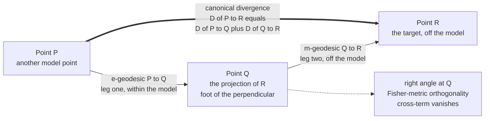

# 📐 The Generalized Pythagorean Theorem

> [!abstract] TL;DR
> In a **dually-flat space** (the geometry of exponential families), three distributions $P, Q, R$ obey a **Pythagorean law for divergence**: if the **e-geodesic** joining $P$ and $Q$ is **orthogonal in the Fisher metric** to the **m-geodesic** joining $Q$ and $R$, then the canonical divergence splits additively,
> $$D(P\,\|\,R) \;=\; D(P\,\|\,Q) \;+\; D(Q\,\|\,R),$$
> the exact analog of $a^2 + b^2 = c^2$ with squared lengths replaced by KL/Bregman divergences. The consequence is enormous: **inference is dropping a perpendicular.** The **information projection** — the foot of that perpendicular — *uniquely minimizes* the divergence to a flat submanifold, which is precisely why **maximum likelihood is an m-projection**, **maximum entropy is an e-projection**, and the **EM algorithm** is alternating e/m projections. Geometry, not luck, is why these estimators work.

---

## Intuition

**Analogy — the 3-4-5 triangle you met as a child.** Everyone knows the right-triangle rule: square the two legs, add them, and you get the square of the hypotenuse, $3^2 + 4^2 = 5^2$. The magic ingredient is the **right angle** — drop a perpendicular and the "diagonal" distance decomposes cleanly into two independent pieces. Astonishingly, the *same rule reappears in the world of probability distributions*, where "distance" is not miles but **information** (KL divergence — how many extra bits you waste using the wrong distribution).

Here is the picture. You have a distribution $R$ sitting somewhere, and a whole **family of models** — a flat surface of allowed distributions. You want the model closest to $R$. So you **drop a perpendicular from $R$ onto the family**, landing at a point $Q$. Now take *any other* model $P$ in the family. The information you lose by using $P$ instead of $R$ splits **perfectly** into two parts: the information from $P$ to the projection $Q$, *plus* the information from $Q$ onward to $R$:
$$\underbrace{D(P\,\|\,R)}_{\text{all the way}} \;=\; \underbrace{D(P\,\|\,Q)}_{\text{within the family}} \;+\; \underbrace{D(Q\,\|\,R)}_{\text{off the family}}.$$
No cross-term, because the two legs meet at a right angle. That single fact — **inference is dropping a perpendicular** — is the geometric engine underneath maximum-likelihood, maximum-entropy, and EM. Before any formulas: the shortest route to a model is straight down, and once you land, everything else adds up like a right triangle.

---

## How It Works

### Core mechanics

The theorem lives on a **dually-flat manifold** — the natural home of exponential families. Two structures make it run.

1. **Two flat coordinate systems (dual affine coordinates).** An exponential family has *two* privileged coordinate systems: the **natural / canonical parameters** $\theta$ (the "e-coordinates," in which the exponential family is a flat plane) and the **expectation / mean parameters** $\eta = \mathbb{E}[T]$ (the "m-coordinates," in which mixtures form flat planes). They are Legendre-dual: $\eta = \nabla\psi(\theta)$ where $\psi$ is the log-partition function.
2. **Two dual straight lines (geodesics).** A curve that is straight in $\theta$-space is an **e-geodesic** (exponential interpolation, log-linear); a curve straight in $\eta$-space is an **m-geodesic** (mixture interpolation, linear in the probabilities). Every point has both kinds passing through it.
3. **One canonical divergence.** The dually-flat structure has a canonical **Bregman divergence** built from $\psi$; for exponential families it is exactly the **KL divergence** (relative entropy). Locally its curvature is the [[The_Fisher_Information_Metric|Fisher metric]], the single object that defines "orthogonal."

**The theorem.** Take three points $P, Q, R$. Connect $P$ to $Q$ by an **e-geodesic** and $Q$ to $R$ by an **m-geodesic**. If those two legs meet **orthogonally at $Q$** — orthogonality measured in the Fisher metric, which for dual coordinates is just the duality pairing $\langle \delta\theta,\, \delta\eta\rangle$ — then
$$D(P\,\|\,R) \;=\; D(P\,\|\,Q) \;+\; D(Q\,\|\,R).$$

**Why it is true (one line).** For a Bregman divergence $B_\psi$ the exact three-point identity is
$$B_\psi(P,R) \;=\; B_\psi(P,Q) + B_\psi(Q,R) \;+\; \big\langle\, \theta_P - \theta_Q,\; \eta_Q - \eta_R \,\big\rangle.$$
The cross-term is the inner product of the **e-leg direction** $(\theta_P - \theta_Q)$ with the **m-leg direction** $(\eta_Q - \eta_R)$. Orthogonality kills it, and the Pythagorean split falls out. The right angle is *literally* the vanishing cross-term.

### Information projection — the foot of the perpendicular

Now fix a **flat submanifold** $S$ (a model) and an outside point. The **information projection** is the point of $S$ that minimizes the divergence to the outside point — geometrically, the foot of the dual-geodesic perpendicular. Two dual flavors:

- **m-projection onto an e-flat family** $\Rightarrow$ **maximum likelihood.** Given data $R$ (empirical distribution) and an exponential-family model $S$, the point $Q \in S$ minimizing $D(R\,\|\,q)$ is the one whose **moments match** the data, $\mathbb{E}_Q[T]=\mathbb{E}_R[T]$ — this is the **MLE**. For any other model $P \in S$: $\;D(R\,\|\,P) = D(R\,\|\,Q) + D(Q\,\|\,P)$.
- **e-projection onto an m-flat family** $\Rightarrow$ **maximum entropy.** Given a reference $R$ and a **linear constraint family** $L = \{p : \mathbb{E}_p[f]=c\}$, the point $Q \in L$ minimizing $D(p\,\|\,R)$ has **Gibbs form** $Q \propto R\,e^{\lambda f}$ — the **maximum-entropy** distribution. For any other $P \in L$: $\;D(P\,\|\,R) = D(P\,\|\,Q) + D(Q\,\|\,R)$.

**Uniqueness.** When the submanifold is flat in the appropriate dual sense (e-flat for m-projection, m-flat for e-projection), the projection is **unique** and the minimization is **convex** — the Pythagorean split guarantees no other point can do better. This is the *projection theorem* that turns much of statistics into geometry.

### Flow / architecture



---

## Key Concepts

### Secondary (plain-language core)

- **Right triangle for information.** Drop a perpendicular from a distribution onto a family of models; the information gap splits like $a^2 + b^2 = c^2$, with KL divergence playing the role of squared length.
- **Projection = best fit.** The foot of that perpendicular is the *closest* model — the projection uniquely minimizes the divergence.
- **Two kinds of straight lines.** Exponential interpolation (e-geodesic) and mixture interpolation (m-geodesic) are the two "straight lines" of this geometry; the perpendicular uses one, the family uses the other.
- **Why estimators work.** Maximum likelihood and maximum entropy are the *same* act — dropping a perpendicular — just onto different kinds of flat surface.

### Undergraduate (working machinery)

- **Dual coordinates.** Natural parameters $\theta$ (e-flat) and mean parameters $\eta=\nabla\psi(\theta)$ (m-flat) are Legendre-dual; $\psi$ is the log-partition function, its dual $\varphi$ is the negative entropy.
- **Canonical divergence.** $D(P\,\|\,Q) = \psi(\theta_P) + \varphi(\eta_Q) - \langle\theta_P,\eta_Q\rangle$, which for exponential families equals a KL divergence — the **Bregman divergence** of $\psi$.
- **Orthogonality is a pairing.** The Fisher inner product of an e-vector $\delta\theta$ and an m-vector $\delta\eta$ is just $\langle\delta\theta,\delta\eta\rangle$; the Pythagorean cross-term is exactly this pairing of the two legs.
- **Moment matching = m-projection.** The MLE $Q$ satisfies $\mathbb{E}_Q[T]=\mathbb{E}_R[T]$; the residual $R-Q$ is orthogonal (Fisher) to every direction inside the model, so $D(R\,\|\,P)=D(R\,\|\,Q)+D(Q\,\|\,P)$.
- **Gibbs form = e-projection.** The MaxEnt $Q \propto R\,e^{\lambda f}$ satisfies $\mathbb{E}_Q[f]=c$; the log-ratio $\log Q-\log R \propto f$ is orthogonal to the constraint surface $\{\mathbb{E}[f]=c\}$.

### Graduate (structural payoff)

- **Convention care.** Amari's canonical $D(P\,\|\,R)$ (with e-leg $P\!\to\!Q$ $\perp$ m-leg $Q\!\to\!R$) and Csiszár's standard-KL form (with the *dual* orthogonality) are **mirror images** under swapping $(e\leftrightarrow m)$ and reversing the KL argument order; both are "the generalized Pythagorean theorem." State which projection you mean.
- **Bregman generality.** The theorem is not special to KL: *every* Bregman divergence on a dually-flat space obeys the Pythagorean relation. KL is the exponential-family instance; squared Euclidean distance is the Gaussian/self-dual instance, recovering ordinary geometry.
- **EM as alternating projections.** The **e-step** is an e-projection onto the data-consistent family, the **m-step** is an m-projection onto the model; EM is the **alternating minimization** (Csiszár–Tusnády) of a single KL, monotone by two nested Pythagorean inequalities.
- **Iterative scaling / IPF.** Csiszár's iterative proportional fitting and generalized iterative scaling are sequences of I-projections onto constraint hyperplanes; convergence and the "no overshoot" property are Pythagorean.
- **Convexity and uniqueness.** Flatness of the target submanifold makes the divergence *convex* along the projecting geodesic, giving a unique global minimizer and a variational characterization (Pythagorean inequality $\ge$ for merely convex, $=$ for flat).

---

## Python Demo

```python
# numpy + matplotlib only.
# The GENERALIZED PYTHAGOREAN THEOREM for KL divergence, verified on categorical
# distributions over a 6-outcome "die" (a DUALLY-FLAT exponential family, so the
# theorem is exact). We show BOTH dual information projections:
#
#   (a) MAXIMUM ENTROPY = e-projection onto a LINEAR (m-flat) family:
#         reference R, family L = { p : E_p[X] = c }, projection Q (Gibbs form).
#         For ANY P in L :   KL(P||R) = KL(P||Q) + KL(Q||R).
#
#   (b) MAXIMUM LIKELIHOOD = m-projection onto an EXPONENTIAL (e-flat) family:
#         data R, model E = { Gibbs exp(theta X) }, projection Q = MLE (moment match).
#         For ANY P in E :   KL(R||P) = KL(R||Q) + KL(Q||P)   (e-leg P->Q _|_ m-leg Q->R).
#
# In both cases the two geodesic legs are ORTHOGONAL in the Fisher metric, so the
# cross-term vanishes and the divergences add like a^2 + b^2 = c^2.

import numpy as np
import matplotlib.pyplot as plt

x = np.arange(6)                     # outcomes 0..5 ; sufficient statistic f(x) = x

def kl(p, q):                        # standard KL(p||q) = sum p log(p/q), nats
    return float(np.sum(p * np.log(p / q)))

def normalize(v):
    return v / v.sum()

def gibbs(theta, base):              # e-flat tilt : q(x) ~ base(x) * exp(theta*x)
    w = base * np.exp(theta * x)
    return w / w.sum()

def mean_of(p):
    return float(np.sum(x * p))

def solve_theta(base, target, lo=-8.0, hi=8.0):
    """Bisection for theta so that mean of gibbs(theta, base) == target."""
    for _ in range(200):
        mid = 0.5 * (lo + hi)
        if mean_of(gibbs(mid, base)) - target > 0:
            hi = mid
        else:
            lo = mid
    return 0.5 * (lo + hi)

# =========================================================================
# (a) MAXIMUM ENTROPY : e-projection of uniform R onto L = { E[X] = c }
# =========================================================================
c = 4.0
R_a = normalize(np.ones(6))                       # reference = uniform
Q_a = gibbs(solve_theta(R_a, c), R_a)             # MaxEnt member of L (Gibbs)

# P = a DIFFERENT member of L (linear tilt of uniform, NOT of Gibbs form)
v = np.array([-0.5, -0.3, -0.1, 0.1, 0.3, 0.5])   # sum 0 ; sum(x*v) = 3.5
t = (c - mean_of(R_a)) / float(np.sum(x * v))     # shift mean 3.5 -> 4.0
P_a = R_a + t * v
assert np.all(P_a > 0) and abs(mean_of(P_a) - c) < 1e-12

lhs_a = kl(P_a, R_a)
rhs_a = kl(P_a, Q_a) + kl(Q_a, R_a)
ortho_a = float(np.sum((P_a - Q_a) * (np.log(Q_a) - np.log(R_a))))   # Fisher pairing
print("(a) MAX ENTROPY  =  e-projection onto linear family  L = { E[X] = 4 }")
print(f"    KL(P||R)             = {lhs_a:.12f}")
print(f"    KL(P||Q) + KL(Q||R)  = {rhs_a:.12f}")
print(f"    Pythagorean residual = {lhs_a - rhs_a:.2e}")
print(f"    <m-leg P->Q , e-leg Q->R>_Fisher = {ortho_a:.2e}   (right angle)\n")

# =========================================================================
# (b) MAXIMUM LIKELIHOOD : m-projection of data R onto model E = { Gibbs }
# =========================================================================
R_b = normalize(np.array([0.05, 0.10, 0.30, 0.25, 0.20, 0.10]))     # data, not Gibbs
base = normalize(np.ones(6))
Q_b = gibbs(solve_theta(base, mean_of(R_b)), base)  # MLE : match empirical mean
P_b = gibbs(solve_theta(base, mean_of(R_b)) - 0.6, base)  # another model point

lhs_b = kl(R_b, P_b)
rhs_b = kl(R_b, Q_b) + kl(Q_b, P_b)
ortho_b = float(np.sum((R_b - Q_b) * x))            # <m-leg Q->R , e-leg P->Q>_Fisher
print("(b) MAX LIKELIHOOD  =  m-projection onto exponential family E")
print(f"    KL(R||P)             = {lhs_b:.12f}")
print(f"    KL(R||Q) + KL(Q||P)  = {rhs_b:.12f}")
print(f"    Pythagorean residual = {lhs_b - rhs_b:.2e}")
print(f"    <m-leg Q->R , e-leg P->Q>_Fisher = {ortho_b:.2e}   (right angle)")

# =========================================================================
# Plots
# =========================================================================
fig, ax = plt.subplots(1, 3, figsize=(15, 4.6))

# --- panel 1 : the three distributions of case (a) -----------------------
w = 0.26
ax[0].bar(x - w, P_a, w, label="P  (in family L)")
ax[0].bar(x,      Q_a, w, label="Q  (projection = MaxEnt)")
ax[0].bar(x + w,  R_a, w, label="R  (reference = uniform)")
ax[0].set_title("(a) e-projection onto L = {E[X]=4}")
ax[0].set_xlabel("outcome x"); ax[0].set_ylabel("probability")
ax[0].legend(fontsize=8)

# --- panel 2 : Pythagorean right triangle, lengths^2 = 2 * KL ------------
a_leg = np.sqrt(2 * kl(P_a, Q_a))     # leg 1  : P -> Q
b_leg = np.sqrt(2 * kl(Q_a, R_a))     # leg 2  : Q -> R
hyp   = np.sqrt(2 * kl(P_a, R_a))     # hypotenuse : P -> R
Qv, Pv, Rv = np.array([0, 0]), np.array([a_leg, 0]), np.array([0, b_leg])
tri = np.array([Pv, Qv, Rv, Pv])
ax[1].plot(tri[:, 0], tri[:, 1], "o-", color="steelblue", lw=2)
# small right-angle marker at Q
s = 0.12 * min(a_leg, b_leg)
ax[1].plot([s, s, 0], [0, s, s], color="crimson", lw=1.4)
ax[1].annotate("P", Pv, textcoords="offset points", xytext=(6, -12))
ax[1].annotate("Q  (right angle)", Qv, textcoords="offset points", xytext=(8, -14))
ax[1].annotate("R", Rv, textcoords="offset points", xytext=(6, 6))
ax[1].text(a_leg/2, -0.06*b_leg, f"a=sqrt(2 KL(P||Q))={a_leg:.3f}", ha="center", fontsize=8)
ax[1].text(-0.03*a_leg, b_leg/2, f"b=sqrt(2 KL(Q||R))={b_leg:.3f}",
           va="center", rotation=90, fontsize=8)
ax[1].text(a_leg/2+0.02, b_leg/2+0.02, f"c=sqrt(2 KL(P||R))={hyp:.3f}",
           fontsize=8, color="darkgreen")
ax[1].set_title(f"a^2+b^2 = {a_leg**2 + b_leg**2:.4f}   c^2 = {hyp**2:.4f}")
ax[1].set_aspect("equal"); ax[1].axis("off")

# --- panel 3 : the three distributions of case (b) -----------------------
ax[2].bar(x - w, R_b, w, label="R  (data)")
ax[2].bar(x,      Q_b, w, label="Q  (MLE = m-projection)")
ax[2].bar(x + w,  P_b, w, label="P  (other model point)")
ax[2].set_title("(b) m-projection onto exponential model")
ax[2].set_xlabel("outcome x"); ax[2].set_ylabel("probability")
ax[2].legend(fontsize=8)

plt.tight_layout()
plt.savefig("generalized_pythagorean_theorem.png", dpi=120)
plt.show()
```

**What the output shows.** Both printed blocks land `KL(P||R)` and `KL(P||Q)+KL(Q||R)` on the *same twelve digits*, with a Pythagorean residual around $10^{-15}$ — the divergences add exactly. The two Fisher-pairing lines print $\approx 10^{-15}$ as well: the e-leg and the m-leg genuinely meet at a **right angle** (in (a) because $P$ and $Q$ share the constraint mean, in (b) because the MLE matches the data mean). The middle panel makes it visual: taking $\sqrt{2\,\mathrm{KL}}$ as a length turns the triple into an actual right triangle, and the title confirms $a^2+b^2 = c^2$ to four decimals. The two bar panels show the dual stories — max-entropy *tilting* a reference toward a target mean, and maximum-likelihood *snapping* data onto the closest exponential model.

---

## Real-World Applications

> **Maximum-likelihood fitting (everywhere).** Fitting any exponential-family model — logistic regression, Poisson GLMs, Gaussian MLE, Ising/Markov-random-field parameters — is an **m-projection** of the empirical distribution onto the model. The MLE is the foot of the perpendicular; the Pythagorean split is why the moment-matching equations $\mathbb{E}_Q[T]=\mathbb{E}_R[T]$ characterize it. See [[Maximum_Likelihood_and_Information]] and [[Statistical_Inference]].

> **Maximum-entropy models in NLP and physics.** Log-linear / MaxEnt classifiers, exponential language models, and Boltzmann distributions are **e-projections** onto a constraint surface $\{\mathbb{E}[f]=c\}$. The Gibbs form $p\propto e^{\lambda\cdot f}$ *is* the projection, and iterative scaling converges to it via successive I-projections. See [[Maximum_Entropy_Principle]] and [[Maximum_Entropy_and_Exponential_Families]].

> **The EM algorithm.** In latent-variable models EM is **alternating e/m projections** between the model manifold and the data-consistent manifold (Amari's em-algorithm; Csiszár–Tusnády alternating minimization). Each half-step is a Pythagorean projection, which is exactly why the observed-data log-likelihood never decreases.

> **Iterative proportional fitting (IPF / raking).** Adjusting a contingency table to match target margins — used in survey weighting, transportation matrices, and loglinear analysis — is a cyclic sequence of I-projections onto marginal-constraint hyperplanes. The Pythagorean "no overshoot" property guarantees monotone convergence.

> **Boosting and online learning.** AdaBoost and related algorithms can be read as sequential I-projections that greedily minimize a Bregman divergence subject to newly added constraints (Collins–Schapire–Singer), tying margin-based learning to the same projection geometry.

---

## Common Pitfalls

- **Using one e-leg and one m-leg — not two of a kind.** The theorem needs an **e-geodesic** for one leg and an **m-geodesic** for the other. Two e-geodesics or two m-geodesics do **not** give a Pythagorean split; the whole point is the *dual* pairing that makes the cross-term an honest inner product.
- **Getting the KL direction backwards.** KL is asymmetric, and the correct argument order flips between the two projections: m-projection (MLE) uses $D(R\,\|\,\cdot)$ with the data first; e-projection (MaxEnt) uses $D(\cdot\,\|\,R)$ with the model first. Amari's canonical $D(P\,\|\,R)$ and the standard KL differ by an argument swap — pick a convention and hold it, or your "identity" will fail to add up.
- **Confusing e-flat and m-flat submanifolds.** Maximum likelihood projects onto an **e-flat** family (an exponential model) with an **m-geodesic** perpendicular; maximum entropy projects onto an **m-flat** family (linear constraints) with an **e-geodesic** perpendicular. Swap them and you get the wrong projection and no additivity.
- **Assuming a unique projection on a curved submanifold.** Uniqueness and the *equality* (not just inequality) in the Pythagorean relation require the target submanifold to be **flat** in the appropriate dual sense (giving convexity of the divergence along the projecting geodesic). Onto a curved model the projection may be non-unique or only satisfy a Pythagorean *inequality*.
- **Mistaking orthogonality for Euclidean perpendicularity.** "Orthogonal" here means zero **Fisher-metric** inner product between a $\delta\theta$ (e-) direction and a $\delta\eta$ (m-) direction — the duality pairing $\langle\delta\theta,\delta\eta\rangle$. Perpendicular-looking legs in raw parameter coordinates are generally *not* orthogonal, and vice versa.
- **Expecting a triangle inequality.** The relation is an *equality* along orthogonal dual legs, but divergence is not a metric — off the right angle you get $D(P\,\|\,R)\ne D(P\,\|\,Q)+D(Q\,\|\,R)$, and $\sqrt{D}$ need not obey the triangle inequality. Only the Pythagorean (right-angle) case is clean.

---

## Related Concepts

*Cross-vault connections (Glob-verified):*
- [[The_Fisher_Information_Metric]] — supplies the notion of "orthogonal": the right angle between the two legs is a zero Fisher inner product, the duality pairing $\langle\delta\theta,\delta\eta\rangle$.
- [[Divergences_as_Geometric_Structure]] — the canonical divergence is the Bregman divergence of a dually-flat space; this note is what that structure *does* once you have three points and a right angle.
- [[Relative_Entropy_and_Cross_Entropy]] — the KL divergence that plays the role of squared length here; its asymmetry is exactly the argument-order subtlety flagged in the pitfalls.
- [[Maximum_Likelihood_and_Information]] — maximum likelihood *is* the m-projection of the data onto an exponential model; moment matching is the orthogonality condition.
- [[Maximum_Entropy_Principle]] — the max-entropy distribution *is* the e-projection onto a linear-constraint family; the Gibbs form is the foot of the perpendicular.
- [[Statistical_Inference]] — sufficiency, the MLE, and estimation recast geometrically: the estimator is a projection and its optimality is Pythagorean.
- [[Inner_Product_Spaces]] — the ordinary Hilbert-space projection theorem (orthogonal projection minimizes distance, $\|x\|^2=\|Px\|^2+\|x-Px\|^2$) is the *self-dual* Euclidean special case of this theorem.
- [[Maximum_Entropy_and_Exponential_Families]] — the dually-flat exponential-family setting where the theorem is exact, and the engine behind MaxEnt modeling and EM.

*Forthcoming siblings in this section (Information Geometry — Dual Structure), referenced in prose:* **Dually_Flat_Spaces** develops the two flat coordinate systems this theorem lives in; **Bregman_Divergences** is the general divergence for which the Pythagorean relation holds; **Kullback_Leibler_Divergence_and_Geometry** treats the KL instance in depth; **Maximum_Likelihood_as_Projection** and **The_em_Algorithm_and_Information_Projection** expand the two applications above into full notes.

---

## Review Questions

1. **(Secondary)** Using the 3-4-5 right-triangle picture, explain in words why the information gap from a model $P$ to a target $R$ splits into "$P$ to the projection $Q$" plus "$Q$ to $R$" with no leftover cross-term. What plays the role of the right angle, and what plays the role of squared length?
2. **(Undergraduate)** You fit an exponential-family model to data by maximum likelihood. Explain why the MLE is the point of the model whose expected sufficient statistic equals the data's, and show how this moment-matching condition is precisely the orthogonality that makes $D(R\,\|\,P)=D(R\,\|\,Q)+D(Q\,\|\,P)$ hold for every other model point $P$. Which leg is the e-geodesic and which is the m-geodesic?
3. **(Graduate)** Starting from the Bregman three-point identity $B_\psi(P,R)=B_\psi(P,Q)+B_\psi(Q,R)+\langle\theta_P-\theta_Q,\ \eta_Q-\eta_R\rangle$, derive the generalized Pythagorean theorem and state exactly what "orthogonal" means. Then explain (a) why the target submanifold must be *flat* for uniqueness and for equality rather than inequality, and (b) how EM realizes a single KL as two alternating projections that are individually Pythagorean.

---

## Sources

- Amari, S. & Nagaoka, H. (2000). *Methods of Information Geometry*, Ch. 3 (dual connections, dually-flat spaces, the generalized Pythagorean theorem, Thm 3.8). AMS / Oxford University Press. [Publisher](https://bookstore.ams.org/mmono-191/)
- Amari, S. (2016). *Information Geometry and Its Applications*, Ch. 1–2 (Pythagorean theorem, projection theorem, EM). Springer, Applied Mathematical Sciences 194. [Springer](https://link.springer.com/book/10.1007/978-4-431-55978-8)
- Csiszár, I. & Shields, P. (2004). *Information Theory and Statistics: A Tutorial*, §3 (I-projections, the Pythagorean identity, iterative scaling). Foundations and Trends in Communications and Information Theory. [Publisher](https://www.nowpublishers.com/article/Details/CIT-004)
- Csiszár, I. (1975). *I-divergence geometry of probability distributions and minimization problems*. Annals of Probability, 3(1), 146–158. [Project Euclid](https://projecteuclid.org/journals/annals-of-probability/volume-3/issue-1)
- Nielsen, F. (2020). *An elementary introduction to information geometry*. Entropy, 22(10), 1100 (dually-flat spaces, Bregman Pythagorean theorem, projections). [MDPI](https://www.mdpi.com/1099-4300/22/10/1100)

---

#information-geometry #pythagorean-theorem #information-projection #kl-divergence #dually-flat
